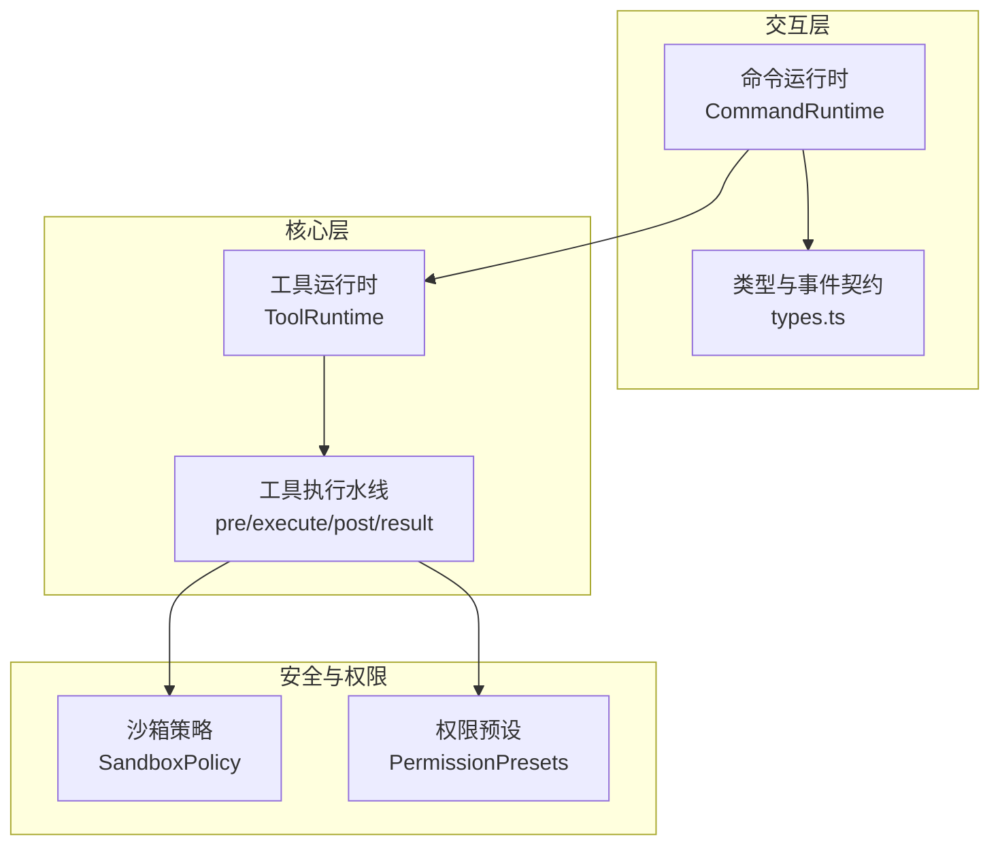
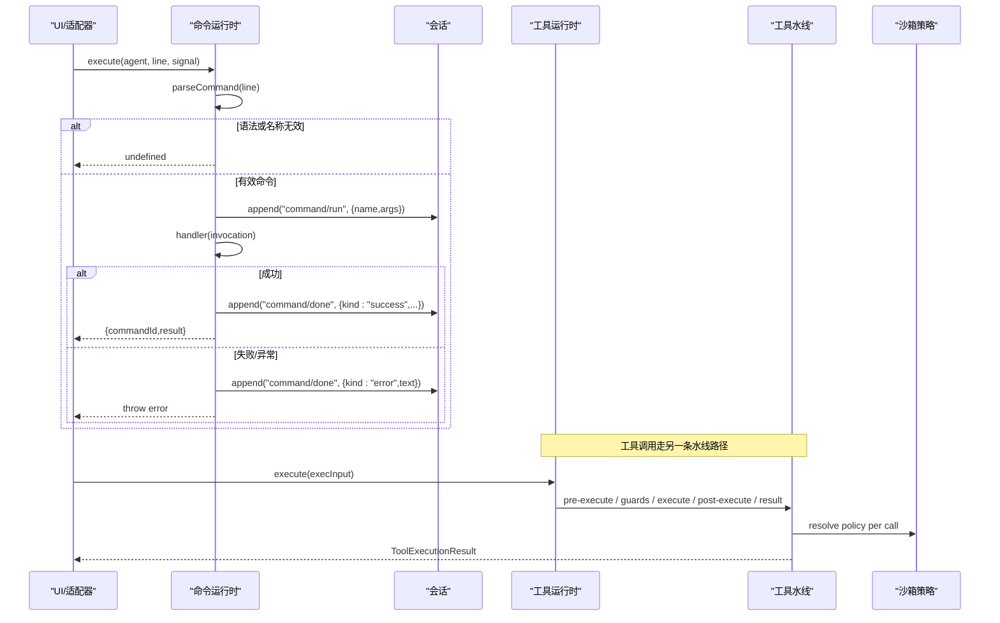
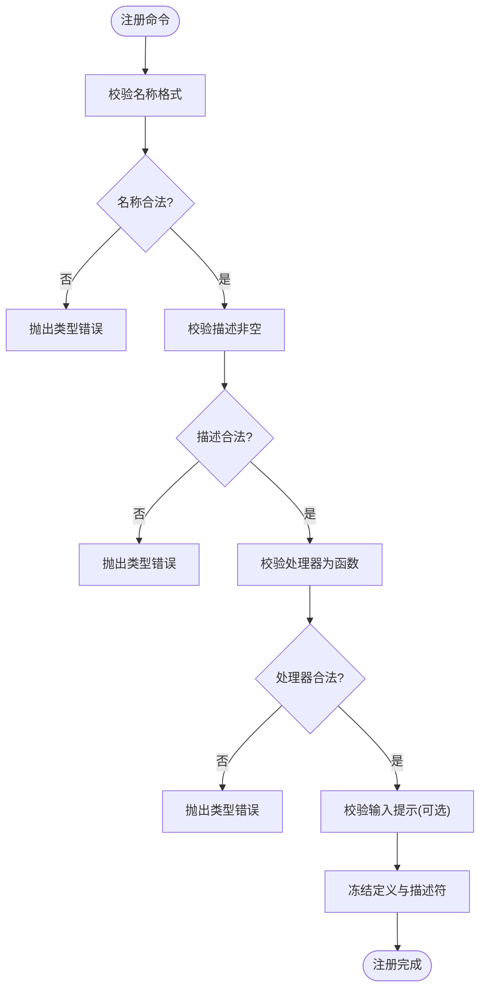
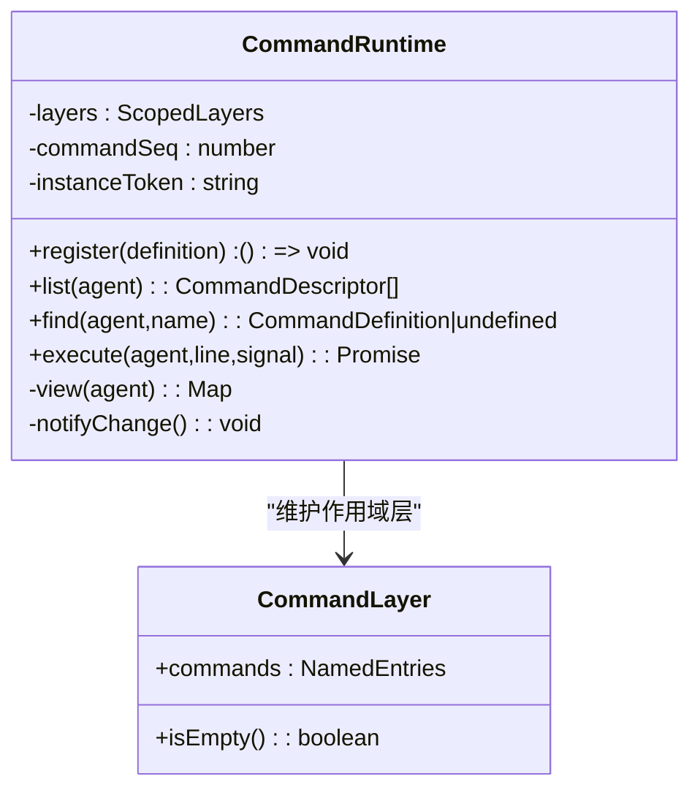
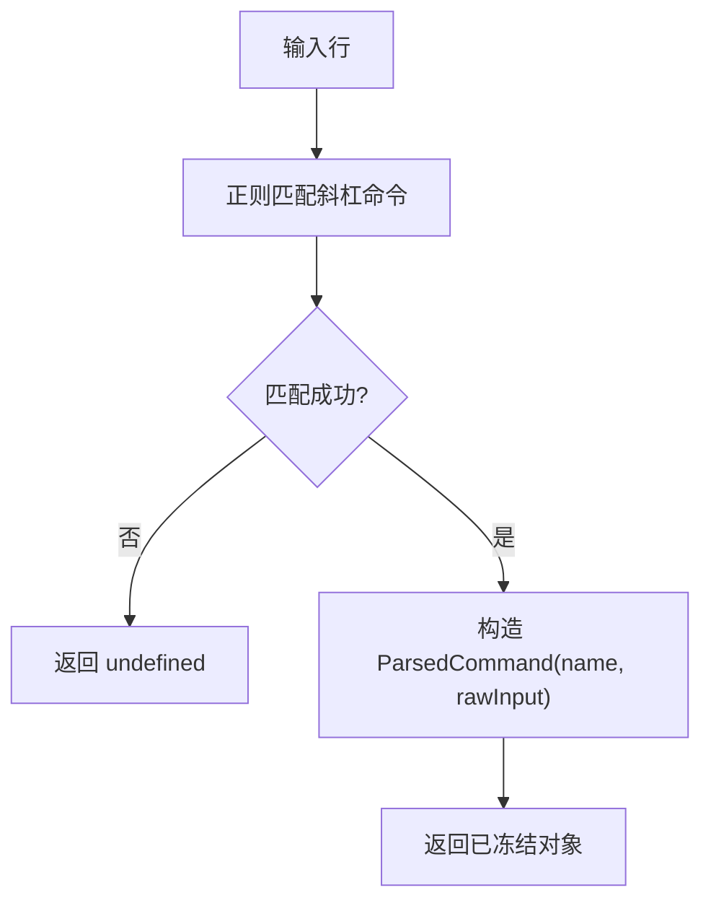
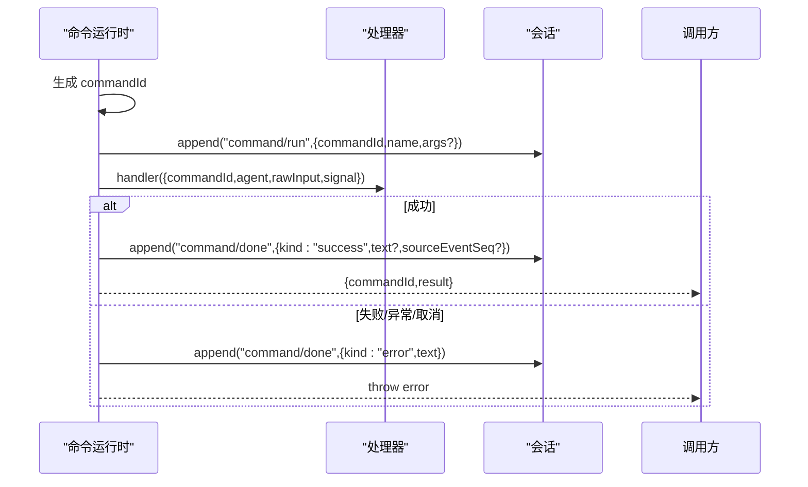
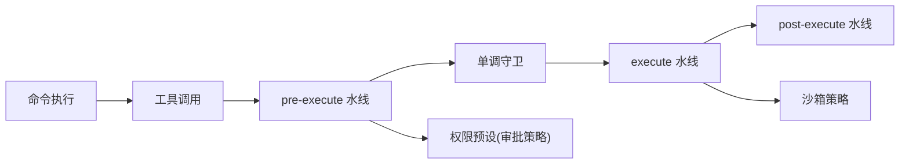
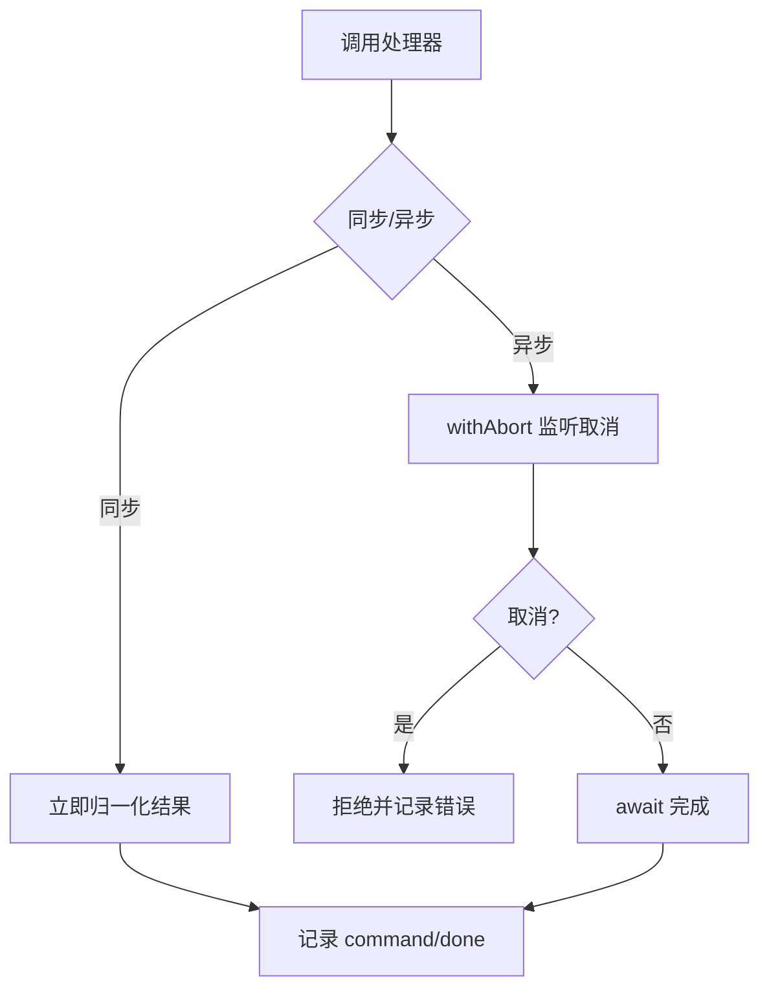
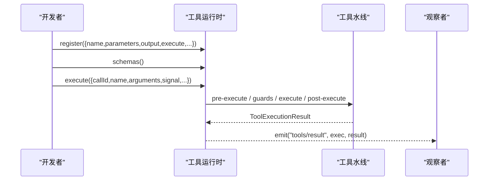
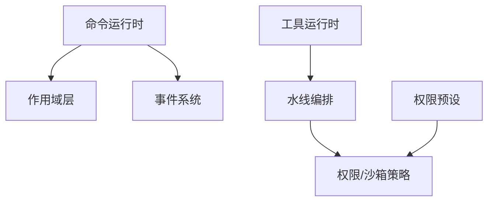

# 命令模式

<cite>
**本文引用的文件**
- [packages/interaction/commands/src/index.ts](file://packages/interaction/commands/src/index.ts)
- [packages/interaction/commands/src/types.ts](file://packages/interaction/commands/src/types.ts)
- [docs/subsystems/commands.md](file://docs/subsystems/commands.md)
- [docs/tool-execution-pipeline.md](file://docs/tool-execution-pipeline.md)
- [docs/subsystems/tools.md](file://docs/subsystems/tools.md)
- [docs/subsystems/sandbox.md](file://docs/subsystems/sandbox.md)
- [docs/subsystems/permission-presets.md](file://docs/subsystems/permission-presets.md)
</cite>

## 目录
1. [简介](#简介)
2. [项目结构](#项目结构)
3. [核心组件](#核心组件)
4. [架构总览](#架构总览)
5. [详细组件分析](#详细组件分析)
6. [依赖关系分析](#依赖关系分析)
7. [性能考虑](#性能考虑)
8. [故障排查指南](#故障排查指南)
9. [结论](#结论)
10. [附录](#附录)

## 简介
本文件系统性阐述 DeepSeek Harness 中“命令模式”在工具执行管道中的应用，覆盖命令定义、参数校验、注册与发现、执行上下文与结果处理、撤销与重做机制、权限控制与安全沙箱集成、异步执行与错误处理策略，并给出创建自定义工具的实践指引。命令模式用于将人类输入的命令（如斜杠命令）直接路由到插件提供的处理器，绕过模型消息通道，实现低延迟、可审计、可观测的交互路径。

## 项目结构
命令模式的核心位于交互层命令子系统，提供命令注册表、解析器、执行器与生命周期事件；工具执行管道则位于核心工具子系统，提供统一的预执行、守卫、执行、后处理与结果观察水线。两者通过会话事件与 Cordis 服务进行解耦协作：命令执行写入会话日志，工具执行通过水线注入权限、沙箱、超时、重试等横切关注点。

图表来源
- [packages/interaction/commands/src/index.ts:225-388](file://packages/interaction/commands/src/index.ts#L225-L388)
- [packages/interaction/commands/src/types.ts:1-103](file://packages/interaction/commands/src/types.ts#L1-L103)
- [docs/subsystems/tools.md:470-721](file://docs/subsystems/tools.md#L470-L721)
- [docs/subsystems/sandbox.md:1-219](file://docs/subsystems/sandbox.md#L1-L219)
- [docs/subsystems/permission-presets.md:1-132](file://docs/subsystems/permission-presets.md#L1-L132)

章节来源
- [docs/subsystems/commands.md:1-188](file://docs/subsystems/commands.md#L1-L188)
- [docs/tool-execution-pipeline.md:1-63](file://docs/tool-execution-pipeline.md#L1-L63)

## 核心组件
- 命令运行时 CommandRuntime：负责命令注册、作用域覆盖、解析与执行、生命周期事件记录、取消传播与结果归一化。
- 命令类型与事件契约：定义命令描述、输入提示、执行体签名、执行结果、命令源、会话事件 command/run 与 command/done。
- 工具运行时 ToolRuntime 与水线：提供 pre-execute、monotonic guards、execute、post-execute、result 等扩展点，承载权限、沙箱、超时、重试、结果重写与最终观察。
- 沙箱策略 SandboxPolicy：为每次能力调用解析文件访问模式与工作区边界，驱动进程级隔离。
- 权限预设 PermissionPresets：将沙箱模式与审批策略打包为可选的用户界面选项，统一切换。

章节来源
- [packages/interaction/commands/src/index.ts:27-63](file://packages/interaction/commands/src/index.ts#L27-L63)
- [packages/interaction/commands/src/types.ts:12-63](file://packages/interaction/commands/src/types.ts#L12-L63)
- [docs/subsystems/tools.md:170-405](file://docs/subsystems/tools.md#L170-L405)
- [docs/subsystems/sandbox.md:41-94](file://docs/subsystems/sandbox.md#L41-L94)
- [docs/subsystems/permission-presets.md:9-48](file://docs/subsystems/permission-presets.md#L9-L48)

## 架构总览
命令模式与工具执行管道的协作关系如下：用户输入被解析为命令或工具调用；命令由命令运行时直接调度，不进入模型消息流；工具调用则进入工具水线，依次经过权限检查、沙箱策略、超时/重试包装、执行体、结果规范化与最终通知。命令执行会写入会话事件，便于审计与回放。

图表来源
- [packages/interaction/commands/src/index.ts:296-338](file://packages/interaction/commands/src/index.ts#L296-L338)
- [packages/interaction/commands/src/types.ts:76-102](file://packages/interaction/commands/src/types.ts#L76-L102)
- [docs/subsystems/tools.md:470-721](file://docs/subsystems/tools.md#L470-L721)
- [docs/subsystems/sandbox.md:168-213](file://docs/subsystems/sandbox.md#L168-L213)

## 详细组件分析

### 命令定义与参数验证
- 命令定义包含名称、描述、可选输入提示、是否记录原始输入以及处理器函数。名称需匹配小写字母开头且仅含字母、数字、下划线与连字符的正则约束；描述必须为非空字符串；处理器必须为函数；输入提示若存在，hint 必须为非空字符串。
- 注册时会对定义进行归一化与冻结，生成不可变描述符供 UI 展示；同时保留完整定义用于执行。

图表来源
- [packages/interaction/commands/src/index.ts:151-189](file://packages/interaction/commands/src/index.ts#L151-L189)

章节来源
- [packages/interaction/commands/src/index.ts:39-63](file://packages/interaction/commands/src/index.ts#L39-L63)
- [packages/interaction/commands/src/index.ts:151-189](file://packages/interaction/commands/src/index.ts#L151-L189)
- [docs/subsystems/commands.md:21-43](file://docs/subsystems/commands.md#L21-L43)

### 命令注册机制与作用域覆盖
- 命令运行时基于作用域层管理全局与按代理的作用域注册。同一层内同名命令重复注册会报错；通过 agent.ctx 的子上下文注册的命令可覆盖全局命令，形成作用域阴影。
- 变更会通过 events 广播 commands/change，供 UI 刷新视图。

图表来源
- [packages/interaction/commands/src/index.ts:70-88](file://packages/interaction/commands/src/index.ts#L70-L88)
- [packages/interaction/commands/src/index.ts:225-275](file://packages/interaction/commands/src/index.ts#L225-L275)
- [packages/interaction/commands/src/index.ts:364-384](file://packages/interaction/commands/src/index.ts#L364-L384)

章节来源
- [packages/interaction/commands/src/index.ts:70-88](file://packages/interaction/commands/src/index.ts#L70-L88)
- [packages/interaction/commands/src/index.ts:225-275](file://packages/interaction/commands/src/index.ts#L225-L275)
- [packages/interaction/commands/src/index.ts:364-384](file://packages/interaction/commands/src/index.ts#L364-L384)

### 命令发现与解析
- 解析器支持以斜杠开头的命令语法，提取命令名与原始输入；未匹配或未知命令返回 undefined，不会写入任何日志。
- 发现视图返回不可变描述符集合，按名称排序，不包含处理器，适合 UI 展示。

图表来源
- [packages/interaction/commands/src/index.ts:102-109](file://packages/interaction/commands/src/index.ts#L102-L109)
- [packages/interaction/commands/src/index.ts:259-265](file://packages/interaction/commands/src/index.ts#L259-L265)

章节来源
- [packages/interaction/commands/src/index.ts:102-109](file://packages/interaction/commands/src/index.ts#L102-L109)
- [packages/interaction/commands/src/index.ts:259-265](file://packages/interaction/commands/src/index.ts#L259-L265)
- [docs/subsystems/commands.md:77-101](file://docs/subsystems/commands.md#L77-L101)

### 执行上下文与结果处理
- 执行上下文 CommandInvocation 包含命令 ID、目标代理、原始输入与取消信号；处理器可同步或异步返回结果。
- 结果必须为指定联合类型：成功时可携带文本与源事件序列号；错误时必须携带非空文本。
- 执行前后分别追加 command/run 与 command/done 会话事件；当 recordInput 为 false 时不在 run 事件中记录原始输入，避免与领域事件重复。
- 取消通过 AbortSignal 传播；非 Error 拒绝会被包装为带原因的 Error。

图表来源
- [packages/interaction/commands/src/index.ts:296-338](file://packages/interaction/commands/src/index.ts#L296-L338)
- [packages/interaction/commands/src/types.ts:76-102](file://packages/interaction/commands/src/types.ts#L76-L102)

章节来源
- [packages/interaction/commands/src/index.ts:27-63](file://packages/interaction/commands/src/index.ts#L27-L63)
- [packages/interaction/commands/src/index.ts:111-148](file://packages/interaction/commands/src/index.ts#L111-L148)
- [packages/interaction/commands/src/index.ts:296-338](file://packages/interaction/commands/src/index.ts#L296-L338)
- [packages/interaction/commands/src/types.ts:18-39](file://packages/interaction/commands/src/types.ts#L18-L39)

### 撤销与重做机制
- 命令模式本身不提供内置撤销/重做。由于命令执行通过会话事件持久化，客户端可通过回放 command/run 与 command/done 事件重建命令历史，并在 UI 层实现撤销/重做语义。
- 对于需要幂等或可补偿的操作，建议在处理器内部实现补偿逻辑，并通过 sourceEventSeq 关联权威领域事件，以便客户端组合呈现。

章节来源
- [packages/interaction/commands/src/types.ts:76-102](file://packages/interaction/commands/src/types.ts#L76-L102)
- [docs/subsystems/commands.md:45-75](file://docs/subsystems/commands.md#L45-L75)

### 权限控制与安全沙箱集成
- 命令执行不直接受工具水线的 pre-execute/guards 影响，但命令可触发工具调用，从而进入工具水线接受权限与沙箱策略。
- 工具水线在 pre-execute 阶段允许 deny/ask，随后由单调守卫进行最终拒绝；沙箱策略为每次能力调用解析文件访问模式与工作区边界，确保进程级隔离。
- 权限预设可将沙箱模式与审批策略打包为用户可见的选项，统一切换。

图表来源
- [docs/subsystems/tools.md:170-405](file://docs/subsystems/tools.md#L170-L405)
- [docs/subsystems/sandbox.md:41-94](file://docs/subsystems/sandbox.md#L41-L94)
- [docs/subsystems/permission-presets.md:9-48](file://docs/subsystems/permission-presets.md#L9-L48)

章节来源
- [docs/tool-execution-pipeline.md:1-63](file://docs/tool-execution-pipeline.md#L1-L63)
- [docs/subsystems/tools.md:470-721](file://docs/subsystems/tools.md#L470-L721)
- [docs/subsystems/sandbox.md:168-213](file://docs/subsystems/sandbox.md#L168-L213)
- [docs/subsystems/permission-presets.md:64-126](file://docs/subsystems/permission-presets.md#L64-L126)

### 异步执行与错误处理策略
- 命令处理器支持同步或异步返回；取消通过 AbortSignal 传播，withAbort 封装确保在 UI 请求取消时及时拒绝。
- 非 Error 拒绝会被包装为带原因的 Error；异常或中止均记录为 command/done 的错误结果。
- 工具水线对超时、重试、指标等横切关注点进行 around-dispatch 包装；最终结果在 tools/result 中作为不可变快照通知观察者。

图表来源
- [packages/interaction/commands/src/index.ts:111-148](file://packages/interaction/commands/src/index.ts#L111-L148)
- [packages/interaction/commands/src/index.ts:296-338](file://packages/interaction/commands/src/index.ts#L296-L338)
- [docs/subsystems/tools.md:628-675](file://docs/subsystems/tools.md#L628-L675)

章节来源
- [packages/interaction/commands/src/index.ts:111-148](file://packages/interaction/commands/src/index.ts#L111-L148)
- [packages/interaction/commands/src/index.ts:296-338](file://packages/interaction/commands/src/index.ts#L296-L338)
- [docs/subsystems/tools.md:628-675](file://docs/subsystems/tools.md#L628-L675)

### 创建自定义工具（实践指引）
- 使用 defineTool 声明参数 schema、输出 schema、execute 执行体，以及可选的 finalizeContent、presentCall/presentResult、timeoutMs、isConcurrencySafe。
- 参数与输出通过 JSON Schema 子集进行严格校验；execute 必须遵守执行上下文中的 signal 并保证可取消。
- 通过 ctx.tools.register 注册工具；通过 ctx.tools.execute 进入水线执行；通过 ctx.tools.schemas 获取模型可见的工具元数据。

图表来源
- [docs/subsystems/tools.md:9-152](file://docs/subsystems/tools.md#L9-L152)
- [docs/subsystems/tools.md:470-721](file://docs/subsystems/tools.md#L470-L721)

章节来源
- [docs/subsystems/tools.md:9-152](file://docs/subsystems/tools.md#L9-L152)
- [docs/subsystems/tools.md:470-721](file://docs/subsystems/tools.md#L470-L721)

## 依赖关系分析
- 命令运行时依赖作用域层与事件系统，提供注册、发现、执行与变更通知。
- 工具运行时依赖水线与策略服务，提供统一的执行编排与结果观察。
- 沙箱策略为工具执行提供进程级隔离；权限预设聚合沙箱与审批策略，简化用户配置。

图表来源
- [packages/interaction/commands/src/index.ts:225-275](file://packages/interaction/commands/src/index.ts#L225-L275)
- [docs/subsystems/tools.md:470-721](file://docs/subsystems/tools.md#L470-L721)
- [docs/subsystems/sandbox.md:168-213](file://docs/subsystems/sandbox.md#L168-L213)
- [docs/subsystems/permission-presets.md:64-126](file://docs/subsystems/permission-presets.md#L64-L126)

章节来源
- [packages/interaction/commands/src/index.ts:225-275](file://packages/interaction/commands/src/index.ts#L225-L275)
- [docs/subsystems/tools.md:470-721](file://docs/subsystems/tools.md#L470-L721)
- [docs/subsystems/sandbox.md:168-213](file://docs/subsystems/sandbox.md#L168-L213)
- [docs/subsystems/permission-presets.md:64-126](file://docs/subsystems/permission-presets.md#L64-L126)

## 性能考虑
- 命令解析与注册为 O(1) 操作；列表与查找基于作用域合并后的映射，名称唯一，排序开销与命令数量线性相关。
- 执行路径尽量轻量：解析、归一化、事件追加均为快速路径；处理器应尽快响应取消信号，避免阻塞。
- 工具水线支持并行与独占模式，合理声明 isConcurrencySafe 以提升吞吐；超时与重试应在 execute 水线中集中管理。

[本节为通用指导，无需特定文件引用]

## 故障排查指南
- 命令名称或描述非法：检查名称正则与描述非空约束，确保处理器为函数。
- 命令未找到：确认命令已注册且在当前作用域可见；注意作用域阴影可能覆盖全局命令。
- 执行失败：查看 command/done 的错误文本；检查处理器是否抛出异常或未正确处理取消。
- 工具调用被拒绝：检查 pre-execute 与单调守卫的拒绝原因；确认权限预设与沙箱策略是否符合预期。
- 沙箱限制：根据后端报告判断 enforcement 完整性；区分 runner 失败与命令被拒绝。

章节来源
- [packages/interaction/commands/src/index.ts:151-189](file://packages/interaction/commands/src/index.ts#L151-L189)
- [packages/interaction/commands/src/index.ts:296-338](file://packages/interaction/commands/src/index.ts#L296-L338)
- [docs/subsystems/tools.md:170-405](file://docs/subsystems/tools.md#L170-L405)
- [docs/subsystems/sandbox.md:152-157](file://docs/subsystems/sandbox.md#L152-L157)

## 结论
命令模式在 DeepSeek Harness 中提供了高效、可审计的人类命令执行路径，结合工具执行水线实现了灵活的权限、沙箱与横切关注点编排。通过严格的定义校验、作用域覆盖、会话事件记录与取消传播，命令与工具共同构成了可扩展、可观测、可回放的执行体系。建议在实践中遵循参数与输出的强类型约束，合理使用权限预设与沙箱策略，并确保处理器对取消信号的及时响应。

[本节为总结性内容，无需特定文件引用]

## 附录
- 命令事件：command/run、command/done，携带命令 ID、名称、原始输入（可选）、结果状态与源事件序列号。
- 工具水线：pre-execute、guards、execute、post-execute、result，支持超时、重试、结果重写与最终观察。
- 沙箱模式：read-only、workspace-write、danger-full-access；执行策略包含工作区根与会话标识。
- 权限预设：将沙箱模式与审批策略打包为可选的用户界面选项，统一切换。

章节来源
- [packages/interaction/commands/src/types.ts:76-102](file://packages/interaction/commands/src/types.ts#L76-L102)
- [docs/subsystems/tools.md:470-721](file://docs/subsystems/tools.md#L470-L721)
- [docs/subsystems/sandbox.md:9-39](file://docs/subsystems/sandbox.md#L9-L39)
- [docs/subsystems/permission-presets.md:9-48](file://docs/subsystems/permission-presets.md#L9-L48)