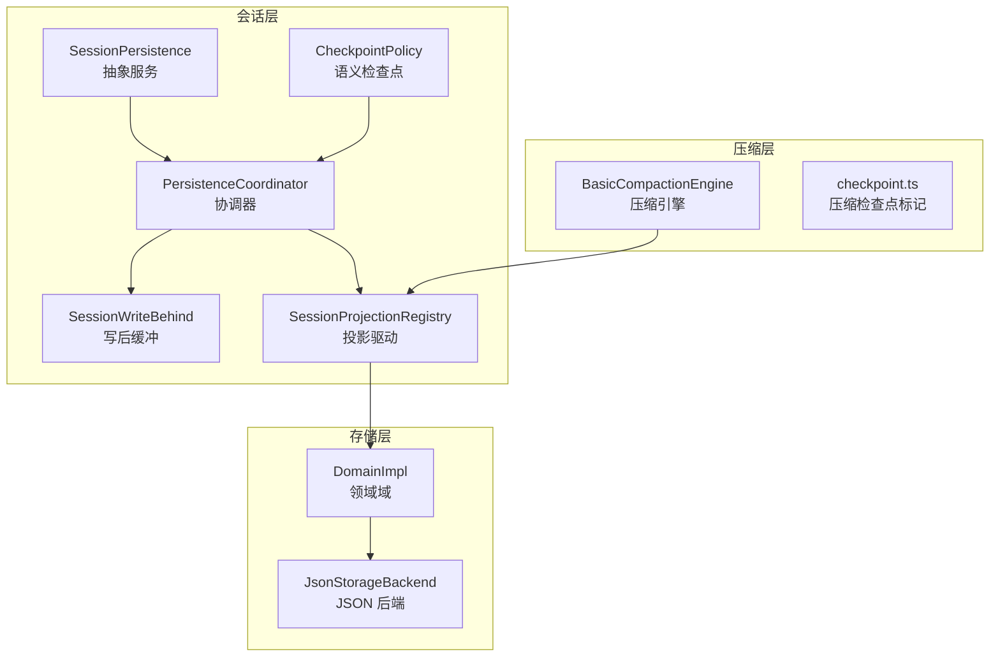
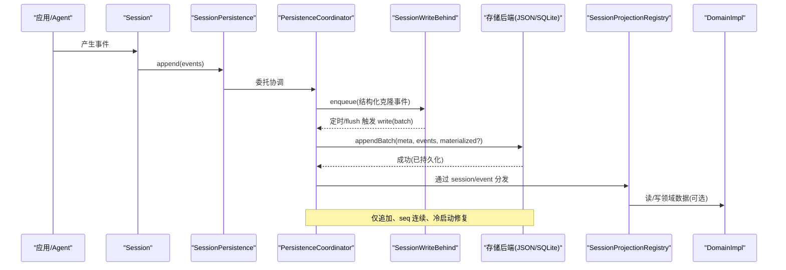
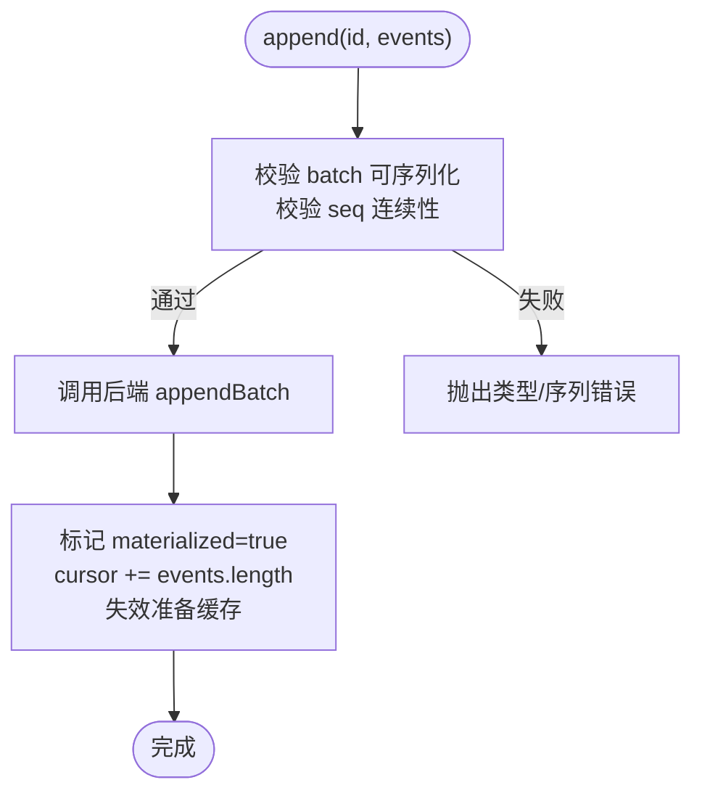
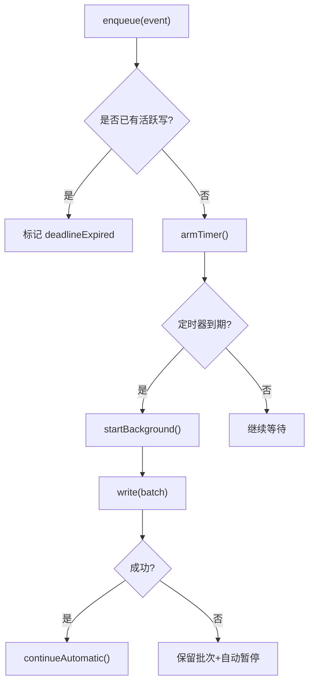
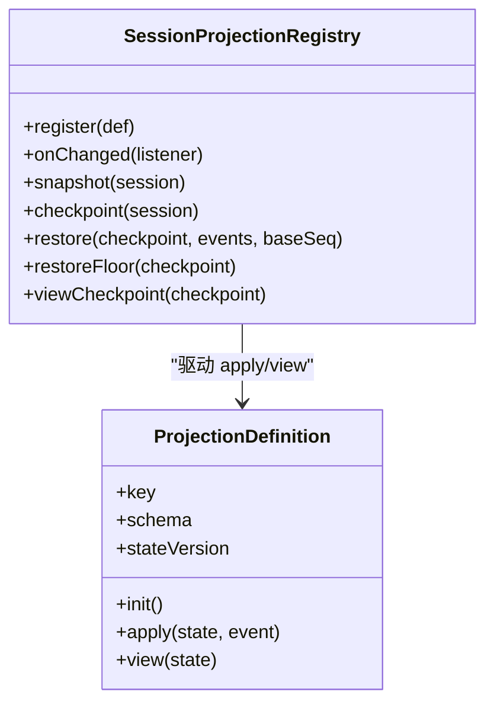
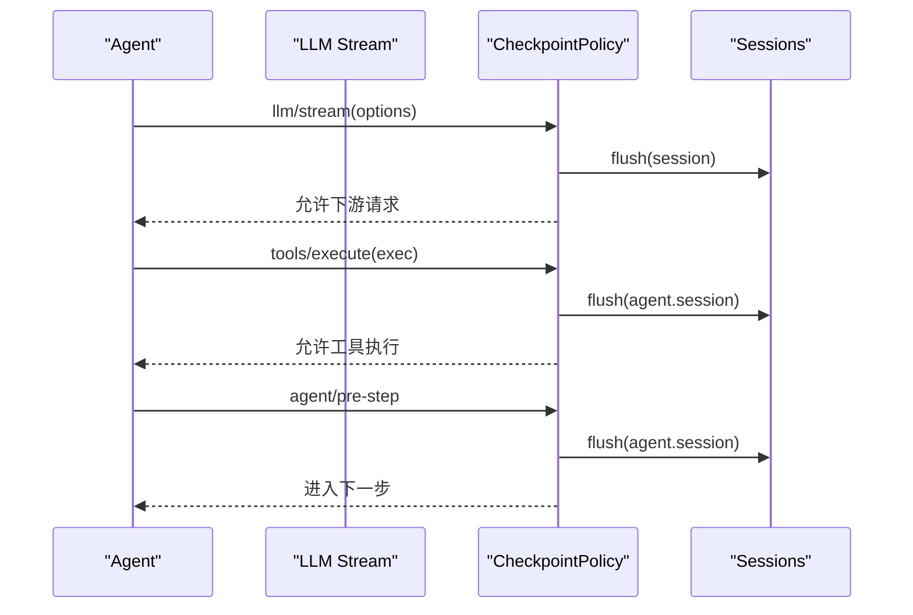
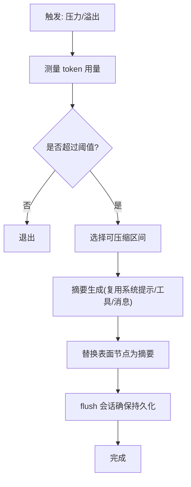
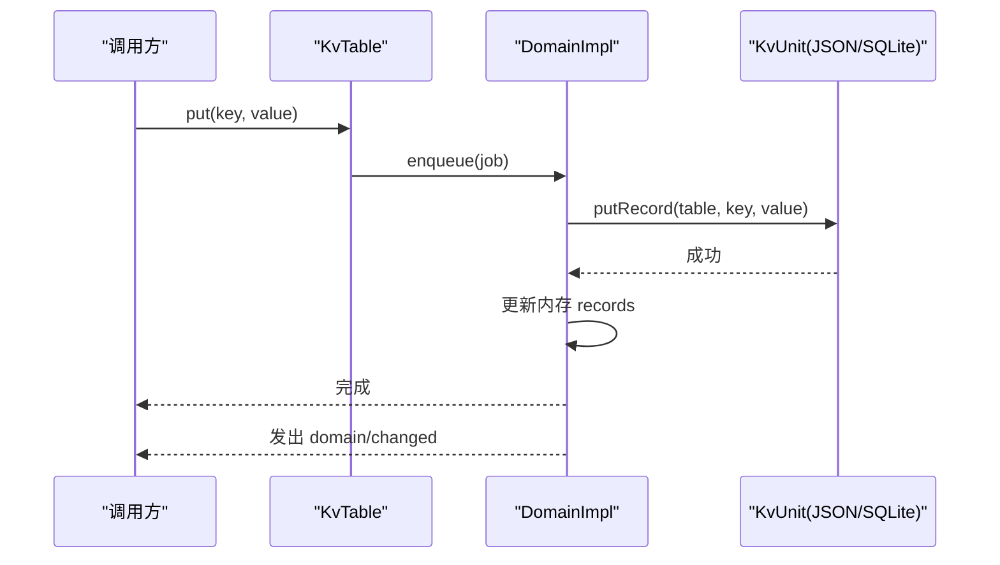
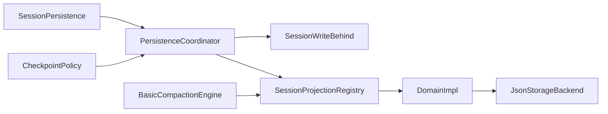

# 状态管理模式

<cite>
**本文引用的文件**
- [packages/session/session-persistence/src/index.ts](file://packages/session/session-persistence/src/index.ts)
- [packages/session/session-persistence/src/coordinator.ts](file://packages/session/session-persistence/src/coordinator.ts)
- [packages/session/session-persistence/src/write-behind.ts](file://packages/session/session-persistence/src/write-behind.ts)
- [packages/session/session-projection/src/index.ts](file://packages/session/session-projection/src/index.ts)
- [packages/session/session-checkpoint-policy/src/index.ts](file://packages/session/session-checkpoint-policy/src/index.ts)
- [packages/compaction/compaction-basic/src/index.ts](file://packages/compaction/compaction-basic/src/index.ts)
- [packages/compaction/compaction/src/checkpoint.ts](file://packages/compaction/compaction/src/checkpoint.ts)
- [packages/storage/storage-domain/src/domain.ts](file://packages/storage/storage-domain/src/domain.ts)
- [packages/storage/storage-json/src/index.ts](file://packages/storage/storage-json/src/index.ts)
</cite>

## 目录
1. [简介](#简介)
2. [项目结构](#项目结构)
3. [核心组件](#核心组件)
4. [架构总览](#架构总览)
5. [详细组件分析](#详细组件分析)
6. [依赖关系分析](#依赖关系分析)
7. [性能与压缩策略](#性能与压缩策略)
8. [故障排查指南](#故障排查指南)
9. [结论](#结论)
10. [附录：代码示例路径](#附录代码示例路径)

## 简介
本文件系统性阐述 DeepSeek Harness 中的“状态管理模式”，聚焦会话状态管理、持久化策略、事件日志的 append-only 设计、不可变性与版本控制、会话分叉/恢复/合并、状态压缩与性能优化，以及状态迁移与向后兼容。文档以源码为依据，提供架构图、时序图与流程图，并给出具体代码片段路径以便快速定位实现。

## 项目结构
围绕状态管理的核心模块分布在以下包中：
- 会话持久化：session-persistence（抽象服务、协调器、写后缓冲）
- 会话投影：session-projection（纯函数驱动的状态机与检查点）
- 语义检查点策略：session-checkpoint-model/tool/step 边界
- 压缩：compaction-basic（基于 token 计量的自动/手动压缩）
- 存储域：storage-domain（单写链、内存权威态、变更事件）
- JSON 存储后端：storage-json（原子重写、每单元一文件）

图表来源
- [packages/session/session-persistence/src/index.ts:84-241](file://packages/session/session-persistence/src/index.ts#L84-L241)
- [packages/session/session-persistence/src/coordinator.ts:588-800](file://packages/session/session-persistence/src/coordinator.ts#L588-L800)
- [packages/session/session-persistence/src/write-behind.ts:22-159](file://packages/session/session-persistence/src/write-behind.ts#L22-L159)
- [packages/session/session-projection/src/index.ts:171-429](file://packages/session/session-projection/src/index.ts#L171-L429)
- [packages/session/session-checkpoint-policy/src/index.ts:63-83](file://packages/session/session-checkpoint-policy/src/index.ts#L63-L83)
- [packages/compaction/compaction-basic/src/index.ts:103-432](file://packages/compaction/compaction-basic/src/index.ts#L103-L432)
- [packages/compaction/compaction/src/checkpoint.ts:19-51](file://packages/compaction/compaction/src/checkpoint.ts#L19-L51)
- [packages/storage/storage-domain/src/domain.ts:140-358](file://packages/storage/storage-domain/src/domain.ts#L140-L358)
- [packages/storage/storage-json/src/index.ts:38-115](file://packages/storage/storage-json/src/index.ts#L38-L115)

章节来源
- [packages/session/session-persistence/src/index.ts:84-241](file://packages/session/session-persistence/src/index.ts#L84-L241)
- [packages/session/session-persistence/src/coordinator.ts:588-800](file://packages/session/session-persistence/src/coordinator.ts#L588-L800)
- [packages/session/session-projection/src/index.ts:171-429](file://packages/session/session-projection/src/index.ts#L171-L429)
- [packages/storage/storage-domain/src/domain.ts:140-358](file://packages/storage/storage-domain/src/domain.ts#L140-L358)
- [packages/storage/storage-json/src/index.ts:38-115](file://packages/storage/storage-json/src/index.ts#L38-L115)

## 核心组件
- SessionPersistence（会话持久化抽象服务）
  - 定义 append-only 的事件日志接口：create、append、load、inspect、readFrom、list、listSnapshots、prepare。
  - 保证事件连续 seq、冷启动修复、不可变快照、可撤销的准备态。
- PersistenceCoordinator（持久化协调器）
  - 统一编排写路径：批处理、序列化、冷启动修复、准备态缓存、并发安全（按 session id 串行）。
  - 维护 stored prefix/suffix、torn tail marker、revision 一致性。
- SessionWriteBehind（写后缓冲）
  - 固定时间窗口的批量写入；支持 flush 屏障、失败重试与后台失败上报。
- SessionProjectionRegistry（会话投影注册表）
  - 订阅 session/event，对每个注册的纯函数单元 apply 事件，产出 view 快照与变更通知。
  - 提供 checkpoint/restore/viewCheckpoint/restoreFloor 等能力，支撑持久化投影缓存。
- CheckpointPolicy（语义检查点策略）
  - 在模型请求前、工具调用前、步骤开始前强制 flush，确保关键边界已落盘。
- BasicCompactionEngine（基础压缩引擎）
  - 基于 token 计量与上下文窗口触发压缩；支持自动/手动压缩、溢出恢复、保留尾部策略。
- DomainImpl（存储域）
  - 单写链、内存权威态、持久化后变更事件；put/update/delete 均先持久化再改内存。
- JsonStorageBackend（JSON 存储后端）
  - 每单元一文件，原子重写；提供 open/close/lifecycle。

章节来源
- [packages/session/session-persistence/src/index.ts:84-241](file://packages/session/session-persistence/src/index.ts#L84-L241)
- [packages/session/session-persistence/src/coordinator.ts:588-800](file://packages/session/session-persistence/src/coordinator.ts#L588-L800)
- [packages/session/session-persistence/src/write-behind.ts:22-159](file://packages/session/session-persistence/src/write-behind.ts#L22-L159)
- [packages/session/session-projection/src/index.ts:171-429](file://packages/session/session-projection/src/index.ts#L171-L429)
- [packages/session/session-checkpoint-policy/src/index.ts:63-83](file://packages/session/session-checkpoint-policy/src/index.ts#L63-L83)
- [packages/compaction/compaction-basic/src/index.ts:103-432](file://packages/compaction/compaction-basic/src/index.ts#L103-L432)
- [packages/storage/storage-domain/src/domain.ts:140-358](file://packages/storage/storage-domain/src/domain.ts#L140-L358)
- [packages/storage/storage-json/src/index.ts:38-115](file://packages/storage/storage-json/src/index.ts#L38-L115)

## 架构总览
下图展示从应用侧到存储层的完整状态流：事件产生 → 持久化协调器 → 写后缓冲 → 后端存储；同时投影系统消费事件更新视图，压缩系统在压力或溢出时进行区域压缩。

图表来源
- [packages/session/session-persistence/src/coordinator.ts:669-710](file://packages/session/session-persistence/src/coordinator.ts#L669-L710)
- [packages/session/session-persistence/src/write-behind.ts:45-159](file://packages/session/session-persistence/src/write-behind.ts#L45-L159)
- [packages/session/session-projection/src/index.ts:171-222](file://packages/session/session-projection/src/index.ts#L171-L222)
- [packages/storage/storage-domain/src/domain.ts:263-346](file://packages/storage/storage-domain/src/domain.ts#L263-L346)

## 详细组件分析

### 会话持久化与 append-only 日志
- 不可变事件与连续 seq
  - append 会校验事件 batch 的 JSON 可序列化性，并在 per-session 串行链上执行；每个事件的 seq 必须严格连续，否则拒绝。
- 冷启动修复与 torn tail
  - load/inspect 会识别并修复中断尾段：丢弃损坏记录，必要时合成关闭事件以保证 turn/end 平衡。
- 准备态与恢复
  - prepare 返回未发布的 Session 准备态，支持 revision 重试；commitPrepared 将准备态发布为持久化视图。
- 只读读取与后缀读取
  - readFrom 支持从指定 seq 起读取后缀，便于投影缓存增量重放；顺序介质仍解析全文但仅返回后缀。

图表来源
- [packages/session/session-persistence/src/coordinator.ts:669-710](file://packages/session/session-persistence/src/coordinator.ts#L669-L710)

章节来源
- [packages/session/session-persistence/src/index.ts:126-228](file://packages/session/session-persistence/src/index.ts#L126-L228)
- [packages/session/session-persistence/src/coordinator.ts:669-710](file://packages/session/session-persistence/src/coordinator.ts#L669-L710)

### 写后缓冲与批处理
- 固定时间窗口的批处理：空闲队列收到工作后，最多等待 maxDelayMs 再触发一次写。
- 显式 flush：创建共享 barrier，等待所有待写任务完成，确保一致的检查点。
- 失败处理：失败时保留批次并重试；后台失败通过回调上报，不阻断生产者。

图表来源
- [packages/session/session-persistence/src/write-behind.ts:45-159](file://packages/session/session-persistence/src/write-behind.ts#L45-L159)

章节来源
- [packages/session/session-persistence/src/write-behind.ts:22-159](file://packages/session/session-persistence/src/write-behind.ts#L22-L159)

### 投影系统与状态版本控制
- 纯函数驱动：每个投影单元由 init/apply/view 组成，apply 必须同步且返回新引用表示变化。
- 检查点与恢复：
  - checkpoint 输出每个单元的 {ver, seq, val}；restore 使用 stateVersion 判断行可用性，结合 baseSeq 做增量重放。
  - restoreFloor 计算最小可用水位，确保不会从被截断的日志恢复。
- 变更通知：当 view 引用改变时，向监听者推送 schema 校验后的值。

图表来源
- [packages/session/session-projection/src/index.ts:42-74](file://packages/session/session-projection/src/index.ts#L42-L74)
- [packages/session/session-projection/src/index.ts:171-429](file://packages/session/session-projection/src/index.ts#L171-L429)

章节来源
- [packages/session/session-projection/src/index.ts:171-429](file://packages/session/session-projection/src/index.ts#L171-L429)

### 语义检查点策略（会话分叉/恢复/合并的边界）
- 在模型请求前、工具调用前、步骤开始前强制 flush，确保关键边界已持久化。
- 这为会话的“分叉”（如回滚到某检查点）、“恢复”（从检查点重建）、“合并”（将分支结果合并为主线）提供了可靠基线。

图表来源
- [packages/session/session-checkpoint-policy/src/index.ts:63-83](file://packages/session/session-checkpoint-policy/src/index.ts#L63-L83)

章节来源
- [packages/session/session-checkpoint-policy/src/index.ts:63-83](file://packages/session/session-checkpoint-policy/src/index.ts#L63-L83)

### 压缩与状态压缩策略
- 自动压缩：在 step 压力或上下文溢出时选择可压缩区间，生成摘要并替换原区域，保持会话平衡。
- 手动压缩：在空闲时选择范围并持久化压缩标记，供后续回放识别。
- 压缩检查点标记：通过 MessageSource 携带 compactionId 与 sourceCommandId，用于追踪来源。

图表来源
- [packages/compaction/compaction-basic/src/index.ts:258-432](file://packages/compaction/compaction-basic/src/index.ts#L258-L432)
- [packages/compaction/compaction/src/checkpoint.ts:19-51](file://packages/compaction/compaction/src/checkpoint.ts#L19-L51)

章节来源
- [packages/compaction/compaction-basic/src/index.ts:103-432](file://packages/compaction/compaction-basic/src/index.ts#L103-L432)
- [packages/compaction/compaction/src/checkpoint.ts:19-51](file://packages/compaction/compaction/src/checkpoint.ts#L19-L51)

### 存储域与持久化一致性
- 单写链：所有 put/update/delete 都排队到单一写链，先持久化成功后再修改内存并发送 domain/changed 事件。
- 原子性：读始终来自内存权威态；写失败不改变内存，避免不一致。
- 生命周期：close 会拒绝新写、排空队列、释放后端、释放名称。

图表来源
- [packages/storage/storage-domain/src/domain.ts:263-346](file://packages/storage/storage-domain/src/domain.ts#L263-L346)

章节来源
- [packages/storage/storage-domain/src/domain.ts:140-358](file://packages/storage/storage-domain/src/domain.ts#L140-L358)

### 后端存储（JSON）
- 每单元一个 JSON 文件，open 时创建目录并打开单元；close 时关闭所有单元。
- 命名规范校验，防止非法 unit/table 名。

章节来源
- [packages/storage/storage-json/src/index.ts:38-115](file://packages/storage/storage-json/src/index.ts#L38-L115)

## 依赖关系分析
- 耦合与内聚
  - SessionPersistence 与 PersistenceCoordinator 高内聚：前者定义契约，后者实现跨后端通用逻辑。
  - SessionProjectionRegistry 与 DomainImpl 解耦：通过事件驱动更新，避免直接耦合存储细节。
  - 压缩引擎依赖 tokenMeter 与 sessions，但不直接操作持久化细节。
- 外部依赖
  - Cordis Context/Service：用于插件注入与服务发现。
  - 存储后端：JSON/SQLite 等通过 storage 注册中心接入。
- 循环依赖
  - 通过事件与接口隔离，避免循环导入；例如投影通过事件消费而非直接调用持久化。

图表来源
- [packages/session/session-persistence/src/index.ts:84-241](file://packages/session/session-persistence/src/index.ts#L84-L241)
- [packages/session/session-persistence/src/coordinator.ts:588-800](file://packages/session/session-persistence/src/coordinator.ts#L588-L800)
- [packages/session/session-projection/src/index.ts:171-429](file://packages/session/session-projection/src/index.ts#L171-L429)
- [packages/storage/storage-domain/src/domain.ts:140-358](file://packages/storage/storage-domain/src/domain.ts#L140-L358)
- [packages/storage/storage-json/src/index.ts:38-115](file://packages/storage/storage-json/src/index.ts#L38-L115)
- [packages/compaction/compaction-basic/src/index.ts:103-432](file://packages/compaction/compaction-basic/src/index.ts#L103-L432)
- [packages/session/session-checkpoint-policy/src/index.ts:63-83](file://packages/session/session-checkpoint-policy/src/index.ts#L63-L83)

## 性能与压缩策略
- 写路径优化
  - 批处理：默认最大延迟 200ms，减少 I/O 次数；支持显式 flush 保障检查点。
  - 结构化克隆：在入队时对事件深拷贝，避免生产者突变影响持久化。
  - 串行化：按 session id 串行，避免同一会话并发写竞争。
- 读取优化
  - 后缀读取：readFrom 支持从指定 seq 起读取，投影缓存可增量重放。
  - 准备态缓存：默认保留 5 个未发布准备态，加速 resume。
- 压缩策略
  - 自动压缩：基于 token 计量与上下文窗口阈值；溢出时优先尝试无摘要的剪枝，再尝试摘要压缩。
  - 手动压缩：空闲时选择范围并持久化压缩标记，便于回放识别。
  - 保留尾部：根据配置保留最近 N tokens，确保上下文可用性。

章节来源
- [packages/session/session-persistence/src/coordinator.ts:26-33](file://packages/session/session-persistence/src/coordinator.ts#L26-L33)
- [packages/session/session-persistence/src/write-behind.ts:45-159](file://packages/session/session-persistence/src/write-behind.ts#L45-L159)
- [packages/compaction/compaction-basic/src/index.ts:258-432](file://packages/compaction/compaction-basic/src/index.ts#L258-L432)

## 故障排查指南
- 格式不支持
  - 当存储日志的版本高于当前 harness 可读版本时，会拒绝加载并提示升级 harness。
  - 旧版事件类型（如 request/header-delta、mode/set）会被拒绝。
- 数据损坏
  - 若后端读取成功但验证失败，抛出 SessionPersistenceCorruptionError；协调器会尝试修复 torn tail。
- 写入失败
  - 写后缓冲失败会保留批次并重试；后台失败通过回调上报，不阻塞生产者。
- 投影恢复异常
  - 若检查点行版本不匹配或超出日志末尾，restore 会要求从 seq 0 重新读取。

章节来源
- [packages/session/session-persistence/src/coordinator.ts:35-81](file://packages/session/session-persistence/src/coordinator.ts#L35-L81)
- [packages/session/session-persistence/src/coordinator.ts:273-290](file://packages/session/session-persistence/src/coordinator.ts#L273-L290)
- [packages/session/session-persistence/src/write-behind.ts:138-159](file://packages/session/session-persistence/src/write-behind.ts#L138-L159)
- [packages/session/session-projection/src/index.ts:355-385](file://packages/session/session-projection/src/index.ts#L355-L385)

## 结论
DeepSeek Harness 的状态管理模式以“事件溯源 + 纯函数投影 + 写后缓冲 + 压缩”为核心，实现了：
- 强一致的 append-only 日志与冷启动修复
- 不可变状态与版本控制的投影系统
- 可靠的语义检查点，支撑会话的分叉、恢复与合并
- 高效的批处理与压缩策略，兼顾性能与可扩展性
- 清晰的存储域抽象，屏蔽后端差异

该模式在保证数据一致性的同时，提供了灵活的扩展点与强大的运维能力。

## 附录：代码示例路径
- 会话持久化接口与协调器
  - [packages/session/session-persistence/src/index.ts:84-241](file://packages/session/session-persistence/src/index.ts#L84-L241)
  - [packages/session/session-persistence/src/coordinator.ts:588-800](file://packages/session/session-persistence/src/coordinator.ts#L588-L800)
- 写后缓冲
  - [packages/session/session-persistence/src/write-behind.ts:22-159](file://packages/session/session-persistence/src/write-behind.ts#L22-L159)
- 投影系统与检查点
  - [packages/session/session-projection/src/index.ts:171-429](file://packages/session/session-projection/src/index.ts#L171-L429)
- 语义检查点策略
  - [packages/session/session-checkpoint-policy/src/index.ts:63-83](file://packages/session/session-checkpoint-policy/src/index.ts#L63-L83)
- 压缩引擎与标记
  - [packages/compaction/compaction-basic/src/index.ts:103-432](file://packages/compaction/compaction-basic/src/index.ts#L103-L432)
  - [packages/compaction/compaction/src/checkpoint.ts:19-51](file://packages/compaction/compaction/src/checkpoint.ts#L19-L51)
- 存储域与 JSON 后端
  - [packages/storage/storage-domain/src/domain.ts:140-358](file://packages/storage/storage-domain/src/domain.ts#L140-L358)
  - [packages/storage/storage-json/src/index.ts:38-115](file://packages/storage/storage-json/src/index.ts#L38-L115)