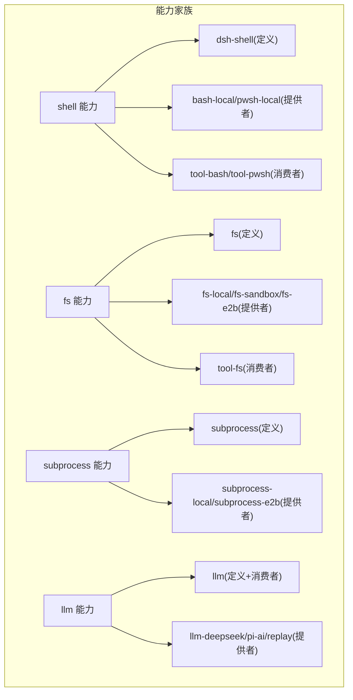
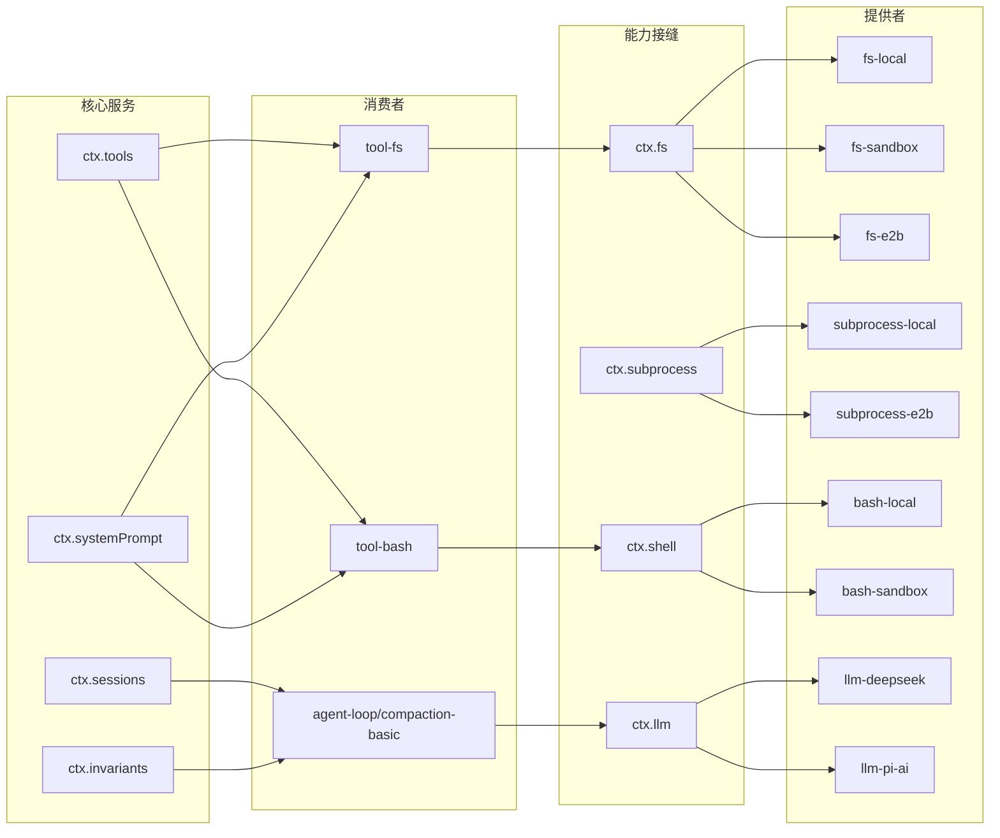
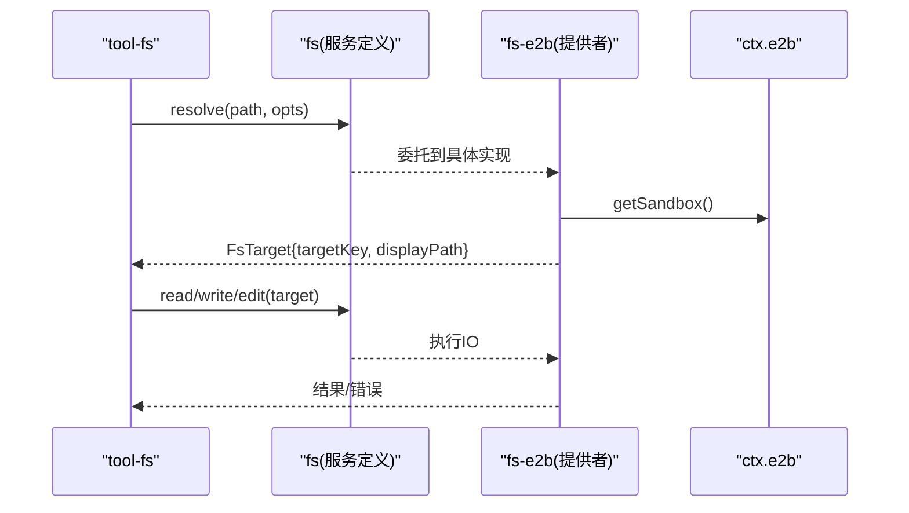
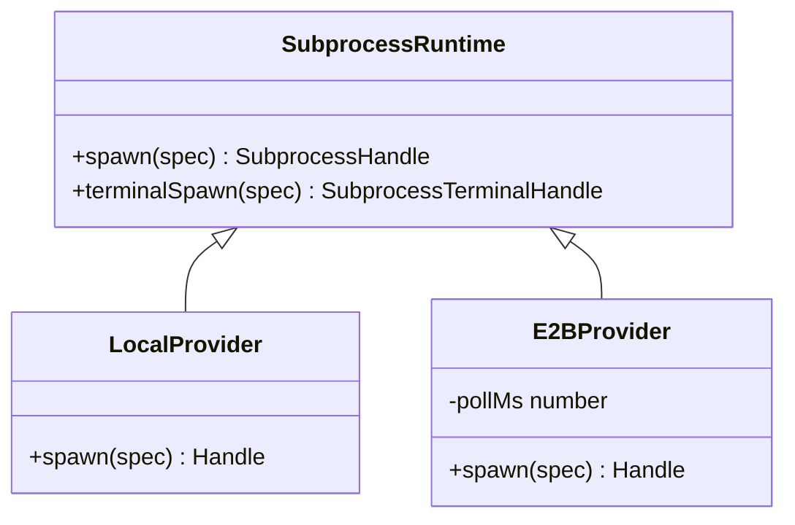
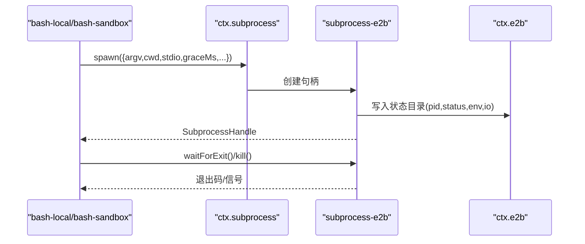
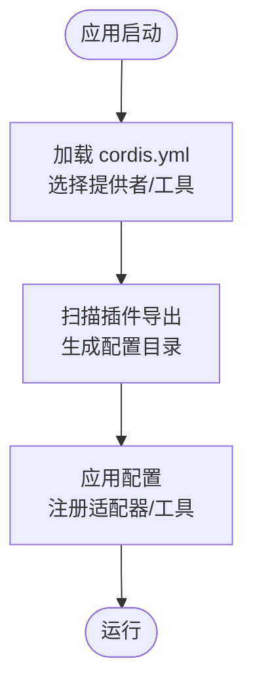
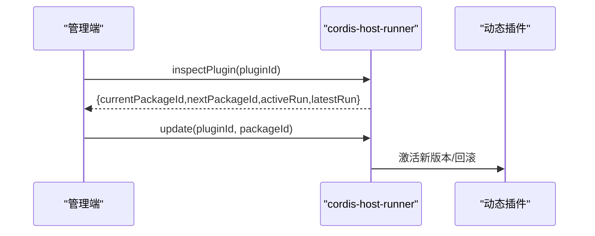
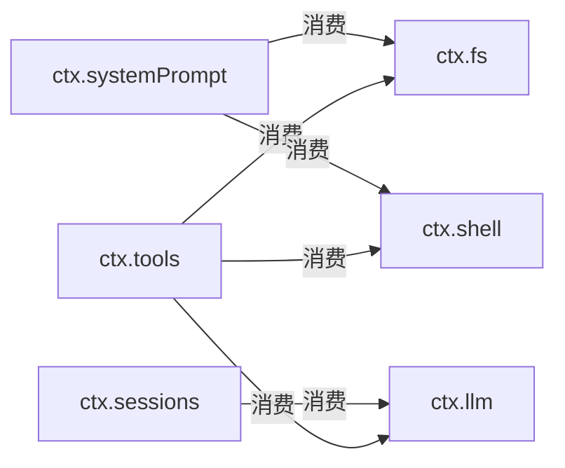

# 能力接缝模式

<cite>
**本文引用的文件**
- [docs/capability-seams.md](file://docs/capability-seams.md)
- [docs/capability-seams.zh.md](file://docs/capability-seams.zh.md)
- [.agents/notes/implemented/architecture/2026-06-13-capability-seams.md](file://.agents/notes/implemented/architecture/2026-06-13-capability-seams.md)
- [docs/glossary.md](file://docs/glossary.md)
- [packages/shell/README.md](file://packages/shell/README.md)
- [packages/fs/README.md](file://packages/fs/README.md)
- [packages/subprocess/README.md](file://packages/subprocess/README.md)
- [packages/llm/README.md](file://packages/llm/README.md)
- [packages/e2b/fs-e2b/src/index.ts](file://packages/e2b/fs-e2b/src/index.ts)
- [packages/e2b/subprocess-e2b/src/index.ts](file://packages/e2b/subprocess-e2b/src/index.ts)
- [packages/e2b/subprocess-e2b/src/process.ts](file://packages/e2b/subprocess-e2b/src/process.ts)
- [packages/llm/llm-pi-ai/src/replay.ts](file://packages/llm/llm-pi-ai/src/replay.ts)
- [docs/config-catalog.md](file://docs/config-catalog.md)
- [scripts/gen-config-catalog.ts](file://scripts/gen-config-catalog.ts)
- [packages/extensions/cordis-host-runner/src/index.ts](file://packages/extensions/cordis-host-runner/src/index.ts)
</cite>

## 目录
1. [简介](#简介)
2. [项目结构](#项目结构)
3. [核心组件](#核心组件)
4. [架构总览](#架构总览)
5. [详细组件分析](#详细组件分析)
6. [依赖关系分析](#依赖关系分析)
7. [性能考量](#性能考量)
8. [故障排查指南](#故障排查指南)
9. [结论](#结论)
10. [附录](#附录)

## 简介
本文件系统性阐述 DeepSeek Harness 中的“能力接缝”模式：以“服务定义—服务提供者—消费者”三角色解耦可替换能力，实现策略模式与接口隔离原则；覆盖文件系统、子进程、LLM 适配器等核心能力的接缝设计；说明能力切换机制与配置方式；给出新增能力接缝的实践路径；并讨论版本管理与向后兼容、以及与插件系统的集成。

## 项目结构
- 文档侧：能力接缝的官方说明位于 docs/capability-seams.* 与 glossary，Agent Note 明确三角色命名与边界。
- 代码侧：每个能力由若干包组成，分别承担服务定义、提供者、消费者职责，并通过 Cordis 上下文键 ctx.<key> 暴露。
- 关键参考：shell、fs、subprocess、llm 四个能力家族 README 清晰列出各包角色与 ctx 键。



**图表来源**
- [packages/shell/README.md:7-15](file://packages/shell/README.md#L7-L15)
- [packages/fs/README.md:7-17](file://packages/fs/README.md#L7-L17)
- [packages/subprocess/README.md:7-14](file://packages/subprocess/README.md#L7-L14)
- [packages/llm/README.md:7-15](file://packages/llm/README.md#L7-L15)

**章节来源**
- [docs/capability-seams.md:4-8](file://docs/capability-seams.md#L4-L8)
- [docs/capability-seams.zh.md:4-8](file://docs/capability-seams.zh.md#L4-L8)
- [packages/shell/README.md:1-20](file://packages/shell/README.md#L1-L20)
- [packages/fs/README.md:1-24](file://packages/fs/README.md#L1-L24)
- [packages/subprocess/README.md:1-15](file://packages/subprocess/README.md#L1-L15)
- [packages/llm/README.md:1-18](file://packages/llm/README.md#L1-L18)

## 核心组件
- 三角色定义
  - 服务定义：拥有 ctx.<key> 与领域词汇类型（抽象类或具体注册表），不依赖实现细节。
  - 服务提供者：一个或多个插件，注册或实现同一服务定义。
  - 消费者：模型与插件面向的 API（如工具 schema），注入服务键，不导入提供方可变类型。
- 术语约定：“seam”指完整能力（三者集合），而非单一接口；角色名首字母大写，通用 provider/consumer 小写。
- 典型示例：shell 能力 = dsh-shell（定义） + bash-local/bash-sandbox/pwsh-local（提供者） + tool-bash/tool-pwsh（消费者）。

**章节来源**
- [.agents/notes/implemented/architecture/2026-06-13-capability-seams.md:15-24](file://.agents/notes/implemented/architecture/2026-06-13-capability-seams.md#L15-L24)
- [docs/glossary.md:7-9](file://docs/glossary.md#L7-L9)
- [packages/shell/README.md:7-15](file://packages/shell/README.md#L7-L15)

## 架构总览
下图展示能力接缝在 Harness 中的全局视图：多个能力各自通过 ctx 键暴露，消费者仅依赖服务定义；提供者按部署组合选择；核心服务与能力之间形成清晰的消费图。



**图表来源**
- [docs/capability-seams.md:412-470](file://docs/capability-seams.md#L412-L470)
- [docs/capability-seams.zh.md:414-471](file://docs/capability-seams.zh.md#L414-L471)

## 详细组件分析

### 文件系统能力接缝（ctx.fs）
- 角色划分
  - 服务定义：fs/ 提供进程内路径、文本 IO、原子变更与可选版本守卫等能力，并拥有 fs/* 策略事件。
  - 提供者：fs-local（本地）、fs-sandbox（沙箱围栏）、fs-e2b（远程 E2B 共享执行世界）。
  - 消费者：tool-fs 暴露 read/write/edit 工具与执行器，通过 ctx.fs 调用，并在挂载了沙箱时声明升级字段。
- 关键设计要点
  - 无超时：read/write/edit 不设置 timeoutMs，避免 OS 级 I/O 被提前中断。
  - 策略门：fs-observation-policy 通过 fs/* 事件门参与，非服务注入，移除后仍可用裸提供者。
  - 远程实现：fs-e2b 将路径、内容与暂存文件置于共享远端沙箱，保持与 subprocess-e2b 一致的运行时世界。



**图表来源**
- [packages/fs/README.md:7-17](file://packages/fs/README.md#L7-L17)
- [packages/e2b/fs-e2b/src/index.ts:170-203](file://packages/e2b/fs-e2b/src/index.ts#L170-L203)

**章节来源**
- [packages/fs/README.md:1-24](file://packages/fs/README.md#L1-L24)
- [packages/e2b/fs-e2b/src/index.ts:170-203](file://packages/e2b/fs-e2b/src/index.ts#L170-L203)

### 子进程能力接缝（ctx.subprocess）
- 角色划分
  - 服务定义：subprocess/ 提供可执行查找、受管子进程树、PTY 原语、句柄生命周期与环境/输出词汇。
  - 提供者：subprocess-local（本地进程树、node-pty、前台/会话检查、终止与回收）、subprocess-e2b（通过共享 E2B 运行环境启动命令，维护状态目录与轮询）。
  - 消费者：bash 执行器、LSP Host、PTY Shell 后端、ACP Subagent 后端等。
- 关键设计要点
  - 进程坐标与生命周期由服务统一拥有，消费者只关注“一次 spawn/spec”。
  - E2B 提供者使用远程状态目录保存 pid/status/stdout/stderr/environment，并通过轮询获取退出码与存活状态。



**图表来源**
- [packages/subprocess/README.md:7-14](file://packages/subprocess/README.md#L7-L14)
- [packages/e2b/subprocess-e2b/src/index.ts:51-61](file://packages/e2b/subprocess-e2b/src/index.ts#L51-L61)



**图表来源**
- [packages/e2b/subprocess-e2b/src/process.ts:93-117](file://packages/e2b/subprocess-e2b/src/process.ts#L93-L117)
- [packages/e2b/subprocess-e2b/src/process.ts:186-217](file://packages/e2b/subprocess-e2b/src/process.ts#L186-L217)
- [packages/e2b/subprocess-e2b/src/index.ts:139-161](file://packages/e2b/subprocess-e2b/src/index.ts#L139-L161)

**章节来源**
- [packages/subprocess/README.md:1-15](file://packages/subprocess/README.md#L1-L15)
- [packages/e2b/subprocess-e2b/src/index.ts:51-61](file://packages/e2b/subprocess-e2b/src/index.ts#L51-L61)
- [packages/e2b/subprocess-e2b/src/process.ts:93-117](file://packages/e2b/subprocess-e2b/src/process.ts#L93-L117)
- [packages/e2b/subprocess-e2b/src/process.ts:186-217](file://packages/e2b/subprocess-e2b/src/process.ts#L186-L217)

### LLM 能力接缝（ctx.llm）
- 角色划分
  - 服务定义与消费者合一：llm/ 同时拥有抽象服务、内容块词汇与流式组装；loop/compaction 作为消费者调用提供方无关的流服务。
  - 提供者：llm-deepseek、llm-pi-ai、llm-replay 等适配器注册到 ctx.llm。
- 关键设计要点
  - 适配器注册路由与模型目录；重试与 token 计量为独立消费者。
  - replay 适配器持久化 provider-native 元数据以重建历史消息，支持回放场景。

```mermaid
sequenceDiagram
participant Loop as "agent-loop/compaction"
participant Seam as "ctx.llm"
participant Adapter as "llm-pi-ai / llm-deepseek"
participant Replay as "llm-replay"
Loop->>Seam : listProviders()/listModels()/generate(...)
Seam->>Adapter : 路由到具体适配器
Adapter-->>Loop : StreamChunk/Usage
Note over Loop,Replay : 回放场景通过 replay 适配器重建 provider 原生消息
```

**图表来源**
- [packages/llm/README.md:7-15](file://packages/llm/README.md#L7-L15)
- [packages/llm/llm-pi-ai/src/replay.ts:20-31](file://packages/llm/llm-pi-ai/src/replay.ts#L20-L31)

**章节来源**
- [packages/llm/README.md:1-18](file://packages/llm/README.md#L1-L18)
- [packages/llm/llm-pi-ai/src/replay.ts:20-31](file://packages/llm/llm-pi-ai/src/replay.ts#L20-L31)

### 能力切换机制与配置方式
- 通过 Cordis 组合选择提供者：每个能力家族 README 指出“leaf cordis.yml 选择执行器与所需工具”，例如 shell 能力选择 bash-local 或 bash-sandbox，并可选择 sandbox 后端。
- 配置目录：config-catalog 汇总各插件配置项（如 pi-ai 的 providers/models/compat 等），用于运行时装配不同提供者与模型路由。
- 动态发现：gen-config-catalog 脚本解析插件导出，识别 seam/plugin/no-config/library 等种类，生成配置目录。



**图表来源**
- [packages/shell/README.md:17-19](file://packages/shell/README.md#L17-L19)
- [docs/config-catalog.md:890-989](file://docs/config-catalog.md#L890-L989)
- [scripts/gen-config-catalog.ts:616-654](file://scripts/gen-config-catalog.ts#L616-L654)

**章节来源**
- [packages/shell/README.md:17-19](file://packages/shell/README.md#L17-L19)
- [docs/config-catalog.md:890-989](file://docs/config-catalog.md#L890-L989)
- [scripts/gen-config-catalog.ts:616-654](file://scripts/gen-config-catalog.ts#L616-L654)

### 新增能力接缝实践（步骤与示例路径）
- 步骤
  1) 在服务定义包中声明 ctx.<key> 与领域类型（抽象类或注册表）。
  2) 在提供者包中实现/注册该服务（如 fs-e2b、subprocess-e2b、llm-* 适配器）。
  3) 在消费者包中注入服务键，调用稳定 API（如 tool-fs、tool-bash）。
  4) 在 leaf cordis.yml 中选择提供者与工具组合。
- 参考路径
  - 服务定义与消费者合一：llm/README 展示了定义与消费者同包的模式。
  - 提供者实现：fs-e2b 与 subprocess-e2b 展示了跨执行世界的提供者实现。
  - 配置装配：config-catalog 与 gen-config-catalog 展示了如何暴露与发现配置。

**章节来源**
- [packages/llm/README.md:1-18](file://packages/llm/README.md#L1-L18)
- [packages/e2b/fs-e2b/src/index.ts:170-203](file://packages/e2b/fs-e2b/src/index.ts#L170-L203)
- [packages/e2b/subprocess-e2b/src/index.ts:51-61](file://packages/e2b/subprocess-e2b/src/index.ts#L51-L61)
- [docs/config-catalog.md:890-989](file://docs/config-catalog.md#L890-L989)
- [scripts/gen-config-catalog.ts:616-654](file://scripts/gen-config-catalog.ts#L616-L654)

### 能力版本管理与向后兼容性
- 动态插件版本指针：cordis-host-runner 暴露 inspectPlugin/inspectPackage，返回 currentPackageId/nextPackageId 与 activeRun/latestRun 等信息，支持热更新与回滚。
- 能力演进原则：服务定义保持稳定，消费者不感知提供者变化；提供者以插件形式替换，降低耦合度。
- 配置驱动：通过配置目录与插件导出自动发现，减少硬编码带来的版本风险。



**图表来源**
- [packages/extensions/cordis-host-runner/src/index.ts:605-673](file://packages/extensions/cordis-host-runner/src/index.ts#L605-L673)

**章节来源**
- [packages/extensions/cordis-host-runner/src/index.ts:605-673](file://packages/extensions/cordis-host-runner/src/index.ts#L605-L673)

### 能力接缝与插件系统集成
- 服务发现：能力从 Cordis 声明中发现，接口/实现/消费方角色在脚本中分类，具备完整性守卫。
- 组合点：agent-loop 是具体循环插件；扩展包依赖 dsh-agent 的事件与服务，而不直接依赖具体循环包。
- 工具注册：工具通过 ctx.tools 注册，遵循策略前处理、守卫、分派、后处理与结果观测管线。

**章节来源**
- [docs/capability-seams.md:471-472](file://docs/capability-seams.md#L471-L472)
- [docs/capability-seams.zh.md:473-474](file://docs/capability-seams.zh.md#L473-L474)
- [packages/llm/README.md:15-17](file://packages/llm/README.md#L15-L17)

## 依赖关系分析
- 低耦合高内聚：消费者仅依赖服务定义；提供者可独立演进；核心服务（sessions/tools/systemPrompt/invariants）提供稳定的横切能力。
- 多对一注册：多个提供者可实现同一服务（如 fs、subprocess、shell、llm），通过组合选择其一。
- 事件门与策略：fs/* 等事件门允许策略插件参与而不破坏主流程。



**图表来源**
- [docs/capability-seams.md:412-470](file://docs/capability-seams.md#L412-L470)
- [docs/capability-seams.zh.md:414-471](file://docs/capability-seams.zh.md#L414-L471)

**章节来源**
- [docs/capability-seams.md:412-470](file://docs/capability-seams.md#L412-L470)
- [docs/capability-seams.zh.md:414-471](file://docs/capability-seams.zh.md#L414-L471)

## 性能考量
- 子进程轮询：E2B 子进程提供者使用 pollMs 控制远程状态轮询频率，需权衡延迟与控制面开销。
- 文件 IO 无超时：避免 OS 级 I/O 被提前中断，但需确保上层取消信号正确传播。
- 流式处理：LLM 适配器采用流式协议，配合 compaction/basic 进行压力与恢复处理。

[本节为通用指导，无需特定文件引用]

## 故障排查指南
- 常见错误定位
  - 未找到适配器：当请求的 provider/model 不存在时，适配器会返回 NO_ADAPTER 等错误码。
  - 子进程参数校验：graceMs 必须为正有限数且不超过最大定时器限制；argv[0] 必须非空。
  - 文件系统编辑失败：old_string 匹配次数不符合预期或找不到时抛出 FS_EDIT_NOT_FOUND/FS_AMBIGUOUS_EDIT。
- 建议排查步骤
  - 检查 cordis.yml 是否选择了正确的提供者与工具。
  - 查看 config-catalog 确认配置项是否正确。
  - 对于 E2B 相关能力，确认 ctx.e2b 已就绪且 cwd/apiKey 配置正确。

**章节来源**
- [packages/llm/llm-pi-ai/src/replay.ts:20-31](file://packages/llm/llm-pi-ai/src/replay.ts#L20-L31)
- [packages/e2b/subprocess-e2b/src/index.ts:45-49](file://packages/e2b/subprocess-e2b/src/index.ts#L45-L49)
- [packages/e2b/subprocess-e2b/src/index.ts:139-161](file://packages/e2b/subprocess-e2b/src/index.ts#L139-L161)
- [packages/e2b/fs-e2b/src/index.ts:149-168](file://packages/e2b/fs-e2b/src/index.ts#L149-L168)

## 结论
能力接缝模式通过“服务定义—提供者—消费者”三角色解耦可替换能力，使 Harness 能在不改变模型可见契约的前提下灵活切换实现。文件系统、子进程、LLM 等核心能力均遵循此模式，并通过 Cordis 组合与配置目录完成装配。动态插件系统提供了版本管理与热更新能力，保障向后兼容与平滑演进。

## 附录
- 术语：capability-seam 的定义与示例见 glossary。
- 参考：各能力家族 README 提供子系统参考与决策链接。

**章节来源**
- [docs/glossary.md:7-9](file://docs/glossary.md#L7-L9)
- [packages/shell/README.md:17-20](file://packages/shell/README.md#L17-L20)
- [packages/fs/README.md:17-24](file://packages/fs/README.md#L17-L24)
- [packages/subprocess/README.md:12-15](file://packages/subprocess/README.md#L12-L15)
- [packages/llm/README.md:15-18](file://packages/llm/README.md#L15-L18)