# 设计模式应用

<cite>
**本文引用的文件**
- [architecture.md](file://docs/architecture.md)
- [capability-seams.md](file://docs/capability-seams.md)
- [event-producer-consumer.md](file://docs/event-producer-consumer.md)
- [tool-execution-pipeline.md](file://docs/tool-execution-pipeline.md)
- [index.ts（工具执行管线）](file://packages/core/tools/src/index.ts)
- [index.ts（会话事件与持久化）](file://packages/core/session/src/index.ts)
- [index.ts（LLM 适配器与流式调用）](file://packages/llm/llm/src/index.ts)
- [lifecycle.ts（子代理生命周期发射器）](file://packages/subagent/subagent/src/lifecycle.ts)
- [scopeTarget（作用域过滤）](file://packages/core/scope/src/index.ts)
- [session.spec.ts（重入观察者测试）](file://packages/core/session/tests/session.spec.ts)
- [conversation-assembler.ts（会话视图构建）](file://packages/client/runtime/src/client/sessions/conversation-assembler.ts)
- [conversation.ts（对话节点状态机定义）](file://packages/client/runtime/src/client/contract/conversation.ts)
- [registry.md（注入与服务发现）](file://docs/cordis-api/registry.md)
- [adding-a-package.md（包命名与角色约定）](file://docs/cookbook/adding-a-package.md)
</cite>

## 目录
1. [引言](#引言)
2. [项目结构](#项目结构)
3. [核心组件](#核心组件)
4. [架构总览](#架构总览)
5. [详细组件分析](#详细组件分析)
6. [依赖关系分析](#依赖关系分析)
7. [性能考量](#性能考量)
8. [故障排查指南](#故障排查指南)
9. [结论](#结论)
10. [附录](#附录)

## 引言
本文件聚焦 DeepSeek Harness 中设计模式的系统化应用，覆盖事件驱动、观察者、策略、工厂、命令、状态管理等关键模式，并结合能力接缝（Capability Seams）、服务注册与发现、工具执行管道与会话管理，给出可追溯的代码级说明与图示。目标是帮助读者在不深入源码的情况下理解系统如何以可扩展、可替换的方式组织能力，并在运行时通过事件与接口进行解耦协作。

## 项目结构
DeepSeek Harness 基于 Cordis 插件框架：每个子系统都是插件，通过声明式配置贡献服务、类型化事件与可逆副作用。启动时按顺序叠加 profile/bundle 层，形成可插拔的插件树。核心概念包括：
- 能力接缝（seam）：一个可替换的能力，包含“服务定义—提供者—消费者”三要素。
- 事件：扩展点，分为 session/agent/capability 三类，支持多种分发模式（emit、parallel、serial、bail、waterfall）。
- 工具执行管线：围绕 tools/* 事件的水瀑布与钩子，实现权限、沙箱、超时、结果重写等横切关注点。
- 会话日志：不可变追加日志，作为模型可见上下文与回放源。

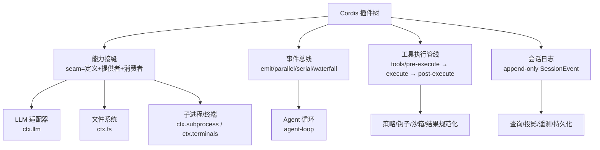

图表来源
- [architecture.md:9-27](file://docs/architecture.md#L9-L27)
- [capability-seams.md:99-103](file://docs/capability-seams.md#L99-L103)
- [event-producer-consumer.md:8-65](file://docs/event-producer-consumer.md#L8-L65)
- [tool-execution-pipeline.md:8-58](file://docs/tool-execution-pipeline.md#L8-L58)

章节来源
- [architecture.md:9-27](file://docs/architecture.md#L9-L27)
- [capability-seams.md:99-103](file://docs/capability-seams.md#L99-L103)

## 核心组件
- 事件系统与观察者：通过 ctx.on/ctx.emit/ctx.waterfall 等机制，将生产者与消费者解耦；支持并发、串行、短路、瀑布等多种分发模式。
- 能力接缝与策略模式：以 ctx.* 为键暴露稳定接口，多个实现并存，消费方仅依赖接口，便于热插拔。
- 工厂与注册中心：服务、工具、技能、LLM 适配器均通过注册表集中管理，支持动态增删与优先级规则。
- 命令模式：工具执行被抽象为 ToolDefinition.execute，配合 pre/execute/post 水瀑布形成可组合的命令管道。
- 状态管理：会话日志作为单一事实源，投影单元以纯函数对事件进行状态转换，保证可重放与一致性。

章节来源
- [event-producer-consumer.md:8-65](file://docs/event-producer-consumer.md#L8-L65)
- [capability-seams.md:412-469](file://docs/capability-seams.md#L412-L469)
- [tool-execution-pipeline.md:8-58](file://docs/tool-execution-pipeline.md#L8-L58)
- [index.ts（会话事件与持久化）:42-86](file://packages/core/session/src/index.ts#L42-L86)

## 架构总览
下图展示了事件驱动与能力接缝在系统中的协同方式：Agent 循环订阅 agent/* 事件并驱动步骤；工具调用进入 tools/* 水瀑布；LLM 适配器通过 llm/stream 水瀑布提供流式输出；会话日志承载所有模型可见事实。

```mermaid
sequenceDiagram
participant Loop as "Agent 循环"
participant Tools as "工具注册表"
participant LLM as "LLM 适配器"
participant Session as "会话日志"
participant UI as "UI/宿主"
Loop->>Session : 记录 turn/step 开始
Loop->>Tools : tools/pre-execute(请求)
Tools-->>Loop : 允许/拒绝/审批
Loop->>LLM : llm/stream(生成选项)
LLM-->>Loop : 流式分片
Loop->>Session : 记录 assistant/message
Loop->>Tools : tools/execute(实际执行)
Tools-->>Loop : 结果
Loop->>Session : 记录 tool/result
Loop->>UI : 渲染完成卡片
```

图表来源
- [event-producer-consumer.md:18-23](file://docs/event-producer-consumer.md#L18-L23)
- [event-producer-consumer.md:38-43](file://docs/event-producer-consumer.md#L38-L43)
- [tool-execution-pipeline.md:8-58](file://docs/tool-execution-pipeline.md#L8-L58)

## 详细组件分析

### 事件驱动与观察者模式
- 事件类型与分发模式：emit、parallel、serial、bail、waterfall，分别适用于广播、并行等待、串行短路、同步短路和中间件式处理。
- 作用域过滤：通过 scopeTarget 将事件限定到特定 Agent 或会话范围，避免全局耦合。
- 重入与隔离：会话事件监听器内再次 append 会触发保护逻辑，防止重入导致的顺序错乱。

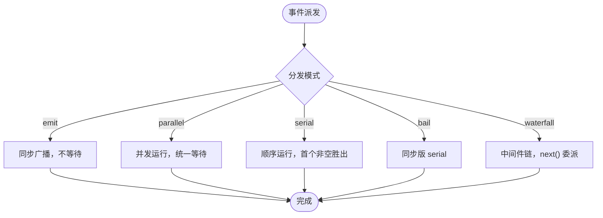

图表来源
- [event-producer-consumer.md:8-65](file://docs/event-producer-consumer.md#L8-L65)
- [scopeTarget（作用域过滤）:158-185](file://packages/core/scope/src/index.ts#L158-L185)
- [session.spec.ts（重入观察者测试）:1519-1546](file://packages/core/session/tests/session.spec.ts#L1519-L1546)

章节来源
- [event-producer-consumer.md:8-65](file://docs/event-producer-consumer.md#L8-L65)
- [scopeTarget（作用域过滤）:158-185](file://packages/core/scope/src/index.ts#L158-L185)
- [session.spec.ts（重入观察者测试）:1519-1546](file://packages/core/session/tests/session.spec.ts#L1519-L1546)

### 能力接缝体现策略模式与接口隔离原则
- 能力接缝（seam）将“接口定义—提供者—消费者”解耦，例如 ctx.llm、ctx.fs、ctx.shell、ctx.sessionPersistence 等。
- 同一接口的多实现并存（如 JSONL/SQLite 持久化、本地/沙箱文件系统），消费方只依赖接口，符合策略模式。
- 通过稳定的 ctx key 与类型声明合并，实现编译期与运行期的接口隔离，降低耦合度。

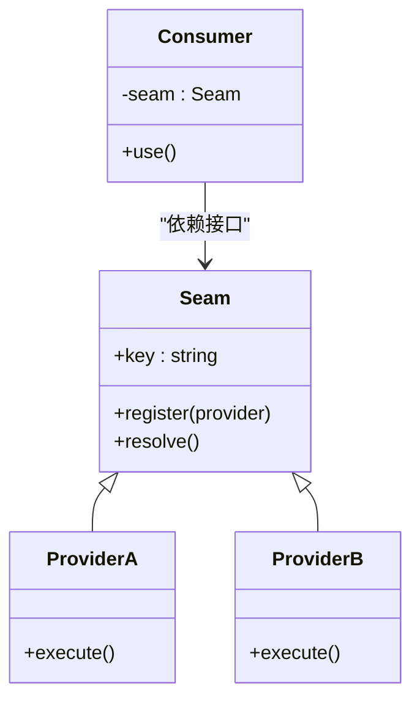

图表来源
- [capability-seams.md:412-469](file://docs/capability-seams.md#L412-L469)
- [adding-a-package.md:45-69](file://docs/cookbook/adding-a-package.md#L45-L69)

章节来源
- [capability-seams.md:412-469](file://docs/capability-seams.md#L412-L469)
- [adding-a-package.md:45-69](file://docs/cookbook/adding-a-package.md#L45-L69)

### 工厂模式与服务注册发现
- 服务注册：Cordis 的 inject 与 registry 机制允许插件声明依赖并获取已注册服务，支持拦截与作用域。
- 动态发现：技能、工具、LLM 适配器通过注册表维护，支持优先级、去重与失效刷新。
- 工厂语义：Provider 工厂在注册时创建实例，持有控制句柄（信号、失效回调），确保生命周期安全。

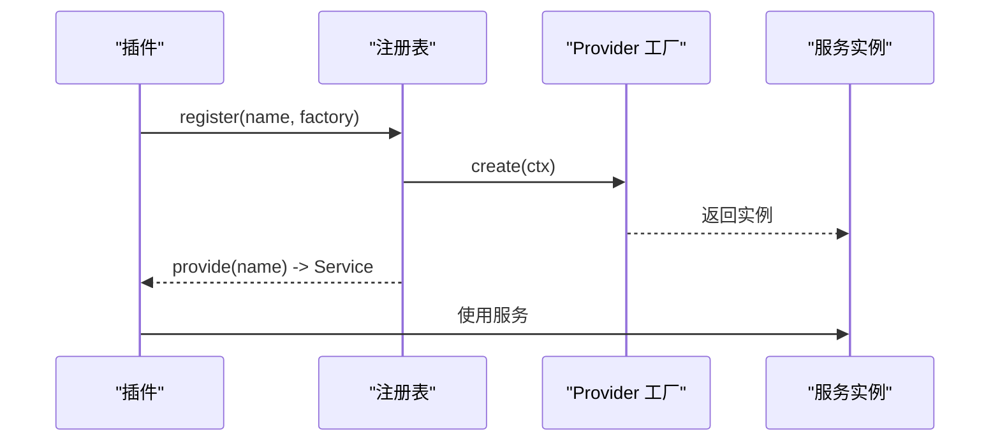

图表来源
- [registry.md:121-153](file://docs/cordis-api/registry.md#L121-L153)
- [subsystems/skills.md:13-15](file://docs/subsystems/skills.md#L13-L15)
- [skill/skill/README.md:48-52](file://packages/skill/skill/README.md#L48-L52)

章节来源
- [registry.md:121-153](file://docs/cordis-api/registry.md#L121-L153)
- [subsystems/skills.md:13-15](file://docs/subsystems/skills.md#L13-L15)
- [skill/skill/README.md:48-52](file://packages/skill/skill/README.md#L48-L52)

### 命令模式在工具执行管道中的应用
- 工具定义：ToolDefinition 将“参数校验—执行—内容呈现—最终结果”封装为命令对象。
- 执行管道：tools/pre-execute → tools/execute → tools/post-execute 构成命令流水线，支持权限、沙箱、超时、结果重写等横切逻辑。
- 结果观察：tools/result 提供不可变快照，供审计、遥测与 UI 渲染。

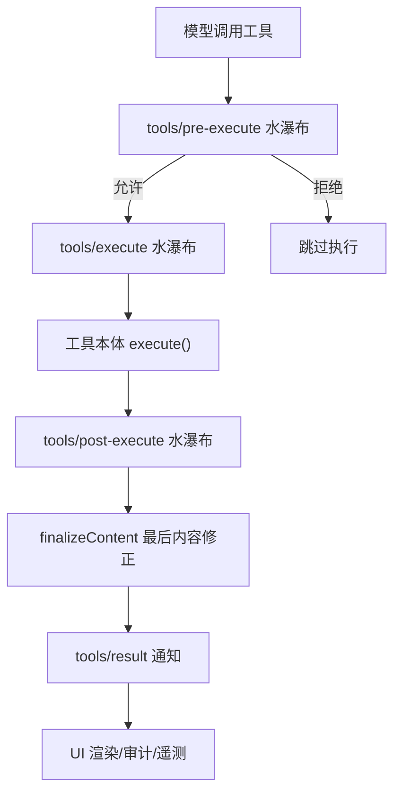

图表来源
- [tool-execution-pipeline.md:8-58](file://docs/tool-execution-pipeline.md#L8-L58)
- [index.ts（工具执行管线）:150-208](file://packages/core/tools/src/index.ts#L150-L208)
- [index.ts（工具执行管线）:221-288](file://packages/core/tools/src/index.ts#L221-L288)

章节来源
- [tool-execution-pipeline.md:8-58](file://docs/tool-execution-pipeline.md#L8-L58)
- [index.ts（工具执行管线）:150-208](file://packages/core/tools/src/index.ts#L150-L208)
- [index.ts（工具执行管线）:221-288](file://packages/core/tools/src/index.ts#L221-L288)

### 状态管理模式在会话管理中的实现
- 会话日志：append-only 的 SessionEvent 序列，作为唯一事实源，支持回放、分支、压缩与遥测。
- 投影单元：ProjectionDefinition 提供 init/apply/render 三个纯函数，对事件进行状态转换，保证可重放与一致性。
- 视图构建：ConversationNodeDefinition 定义业务事件到节点的状态机，start/update 负责状态演进，match 负责匹配。

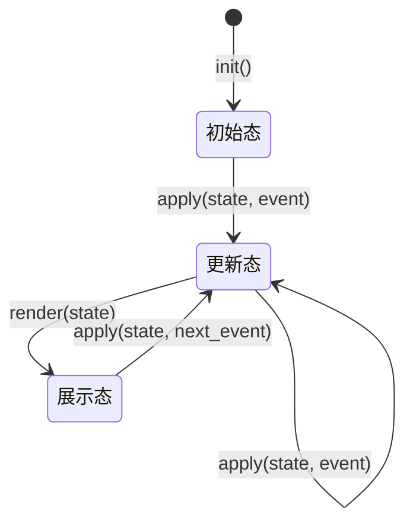

图表来源
- [index.ts（会话事件与持久化）:42-86](file://packages/core/session/src/index.ts#L42-L86)
- [session-projection/src/index.ts:34-60](file://packages/session/session-projection/src/index.ts#L34-L60)
- [conversation.ts:170-204](file://packages/client/runtime/src/client/contract/conversation.ts#L170-L204)
- [conversation-assembler.ts:775-808](file://packages/client/runtime/src/client/sessions/conversation-assembler.ts#L775-L808)

章节来源
- [index.ts（会话事件与持久化）:42-86](file://packages/core/session/src/index.ts#L42-L86)
- [session-projection/src/index.ts:34-60](file://packages/session/session-projection/src/index.ts#L34-L60)
- [conversation.ts:170-204](file://packages/client/runtime/src/client/contract/conversation.ts#L170-L204)
- [conversation-assembler.ts:775-808](file://packages/client/runtime/src/client/sessions/conversation-assembler.ts#L775-L808)

### 事件生产者-消费者模式的应用场景
- Agent 生命周期：agent/created、agent/disposed、agent/status 等事件由 agent-loop 派发，被 goal、schedule、telemetry 等消费。
- 会话事件：session/created、session/event、session/flush 贯穿持久化、查询、标题生成、遥测等模块。
- 工具事件：tools/change、tools/code-dispatch-log、tools/result 用于审计、溢出策略、UI 渲染。

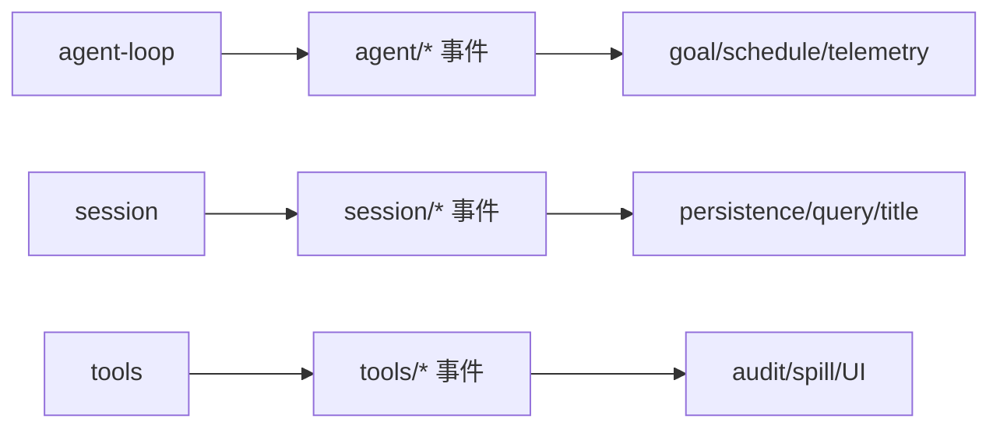

图表来源
- [event-producer-consumer.md:8-65](file://docs/event-producer-consumer.md#L8-L65)

章节来源
- [event-producer-consumer.md:8-65](file://docs/event-producer-consumer.md#L8-L65)

### 依赖注入在服务注册与发现中的应用
- 注入声明：插件通过 inject 数组或对象声明所需服务，框架解析并注入到 apply 的 ctx。
- 作用域注入：结合 scope 与 filter，实现 per-agent/per-session 的服务隔离与可见性。
- 动态替换：注册表支持 replace/invalidation，使运行时可热更新提供者而不中断调用。

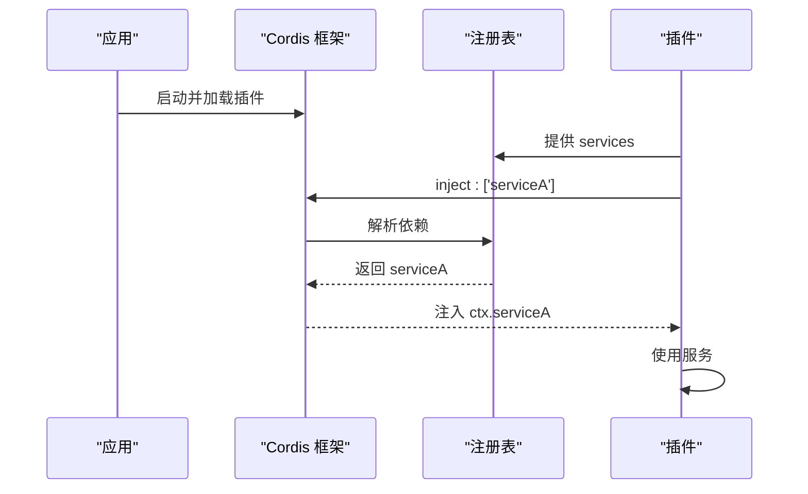

图表来源
- [registry.md:121-153](file://docs/cordis-api/registry.md#L121-L153)
- [scopeTarget（作用域过滤）:158-185](file://packages/core/scope/src/index.ts#L158-L185)

章节来源
- [registry.md:121-153](file://docs/cordis-api/registry.md#L121-L153)
- [scopeTarget（作用域过滤）:158-185](file://packages/core/scope/src/index.ts#L158-L185)

### 子代理生命周期的事件驱动
- 生命周期发射器：createLifecycleEmitter 将 subagent/start/end/provider-removed 等事件安全地派发给独立容器的监听器，异常不会污染其他监听器。
- 作用域传播：通过 carrier(parent) 将父 Agent 上下文传递给子代理事件，保持链路追踪。

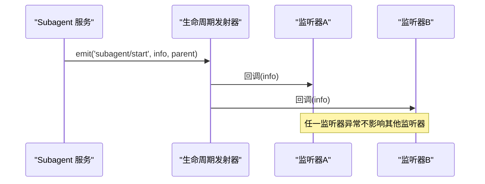

图表来源
- [lifecycle.ts（子代理生命周期发射器）:91-123](file://packages/subagent/subagent/src/lifecycle.ts#L91-L123)

章节来源
- [lifecycle.ts（子代理生命周期发射器）:91-123](file://packages/subagent/subagent/src/lifecycle.ts#L91-L123)

### LLM 适配器与流式调用（策略模式）
- 适配器抽象：LlmAdapter 定义 providerInfo、listModels、resolveModel、stream 等接口，具体实现可替换。
- 流式水瀑布：llm/stream 水瀑布允许插入重试、检查点、标题生成等横切逻辑。
- 错误分类：LlmError 携带结构化失败信息，便于上层统一处理。

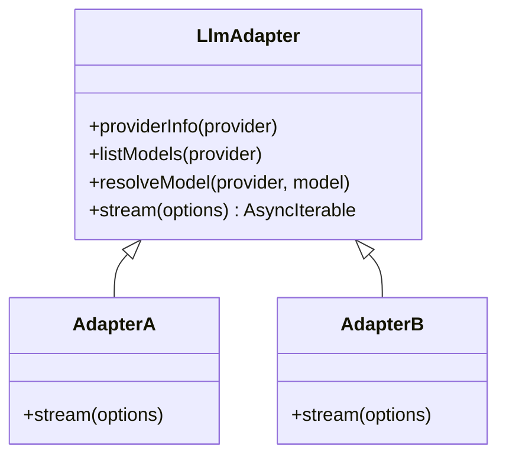

图表来源
- [index.ts（LLM 适配器与流式调用）:174-233](file://packages/llm/llm/src/index.ts#L174-L233)
- [event-producer-consumer.md:38-43](file://docs/event-producer-consumer.md#L38-L43)

章节来源
- [index.ts（LLM 适配器与流式调用）:174-233](file://packages/llm/llm/src/index.ts#L174-L233)
- [event-producer-consumer.md:38-43](file://docs/event-producer-consumer.md#L38-L43)

## 依赖关系分析
- 松耦合：通过能力接缝与事件总线，模块间仅依赖接口与事件契约，避免直接导入。
- 可替换性：同一 ctx key 的多实现并存，配置即可切换后端（如存储、LLM、FS、Shell）。
- 作用域隔离：per-agent/per-session 的作用域过滤确保事件与服务的可见性边界清晰。

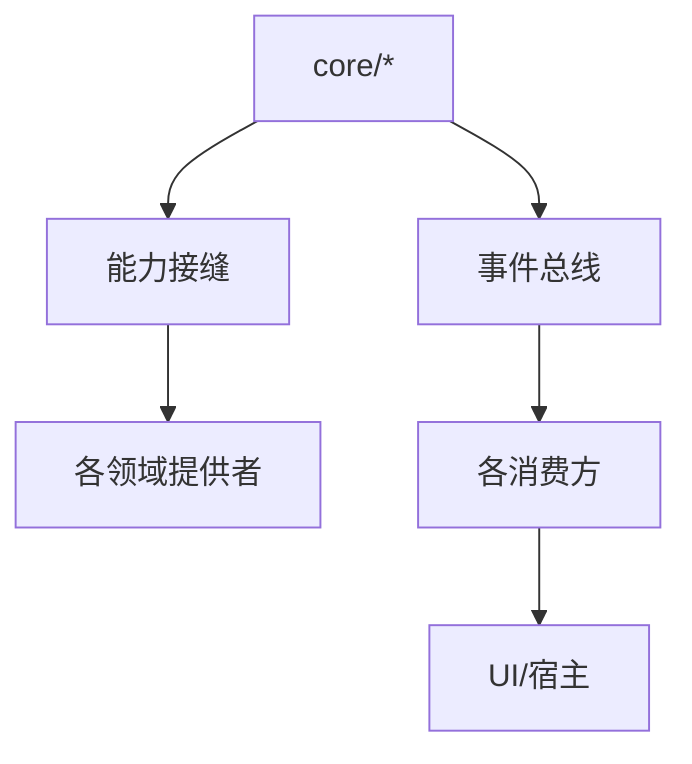

图表来源
- [capability-seams.md:412-469](file://docs/capability-seams.md#L412-L469)
- [event-producer-consumer.md:8-65](file://docs/event-producer-consumer.md#L8-L65)

章节来源
- [capability-seams.md:412-469](file://docs/capability-seams.md#L412-L469)
- [event-producer-consumer.md:8-65](file://docs/event-producer-consumer.md#L8-L65)

## 性能考量
- 事件分发模式选择：高吞吐场景优先 emit/parallel；需要顺序控制的场景使用 serial/waterfall。
- 会话日志冻结：对消息深度冻结，减少拷贝与意外修改，提升回放与序列化效率。
- 工具超时与取消：通过 exec.signal 与 timeoutMs 合作式取消，避免阻塞与资源泄漏。
- 投影缓存：会话投影缓存按会话维度保存状态，冷读路径避免全量回放。

[本节为通用指导，无需特定文件引用]

## 故障排查指南
- 事件监听器异常隔离：子代理生命周期发射器捕获监听器异常并记录，避免影响其他监听器。
- 会话重入保护：在 session/event 监听器中再次 append 会触发保护，防止重入导致顺序错乱。
- 工具执行失败归一化：pipeline/result 将快照失败归一化为 isError，便于上游统一处理。
- LLM 错误分类：LlmError 携带 code/status/requestId，便于定位认证、限流等问题。

章节来源
- [lifecycle.ts（子代理生命周期发射器）:91-123](file://packages/subagent/subagent/src/lifecycle.ts#L91-L123)
- [session.spec.ts（重入观察者测试）:1519-1546](file://packages/core/session/tests/session.spec.ts#L1519-L1546)
- [index.ts（工具执行管线）:190-197](file://packages/core/tools/src/index.ts#L190-L197)
- [index.ts（LLM 适配器与流式调用）:69-117](file://packages/llm/llm/src/index.ts#L69-L117)

## 结论
DeepSeek Harness 通过事件驱动、能力接缝、注册中心与状态投影等设计模式，构建了高度可插拔、可观测、可回放的系统。策略模式体现在多处 seam 的可替换实现；工厂与注册中心支撑动态服务发现；命令模式将工具执行标准化；状态管理以会话日志为核心，辅以纯函数投影保证一致性与可重放。这些模式共同实现了低耦合、高扩展的系统架构。

[本节为总结，无需特定文件引用]

## 附录
- 最佳实践建议
  - 明确事件模式：根据是否需要返回值、并发与短路选择合适的分发模式。
  - 使用能力接缝：新增能力时先定义接口与 ctx key，再提供实现与消费者。
  - 遵循工具契约：ToolDefinition 的 execute 必须尊重 signal 与超时，finalizeContent 保持纯函数。
  - 保持会话日志完整：任何模型可见输入都应转化为 SessionEvent，确保可重建上下文。
  - 作用域隔离：利用 scope 与 filter 限制事件与服务可见性，避免跨 Agent 污染。

[本节为通用指导，无需特定文件引用]