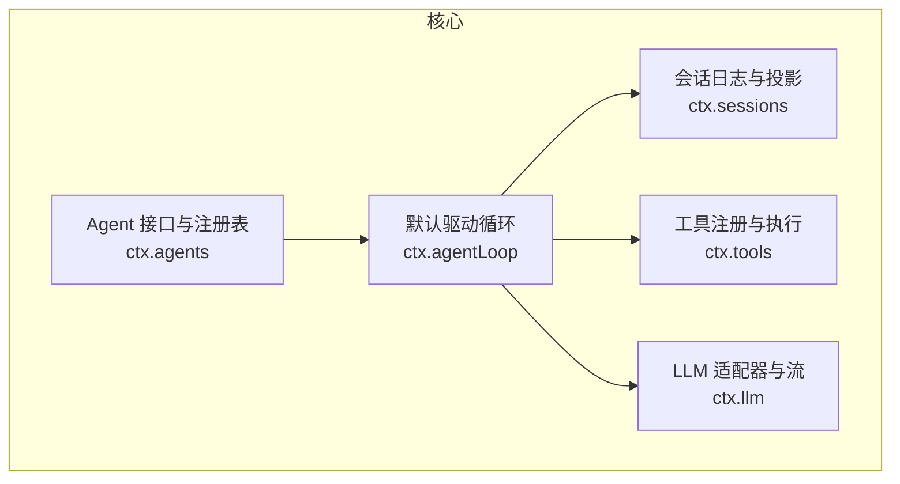
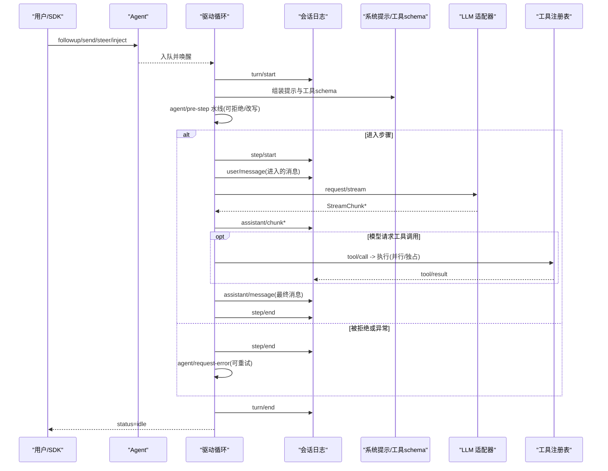
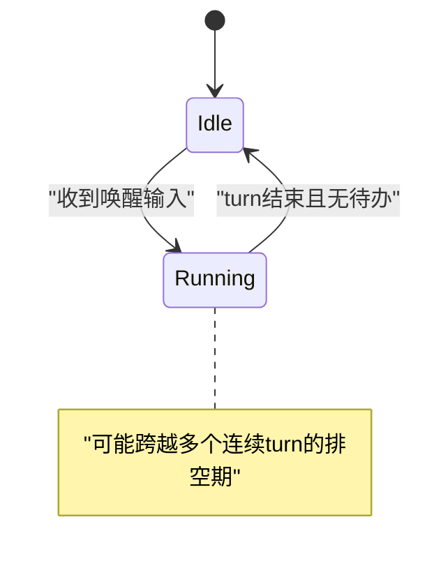
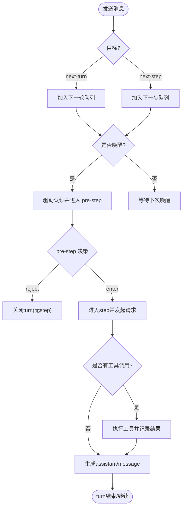
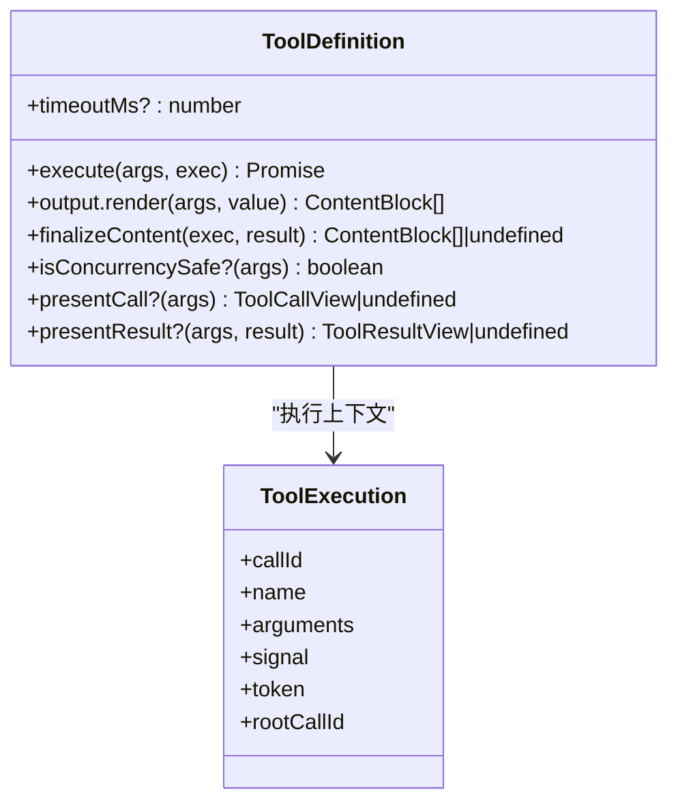
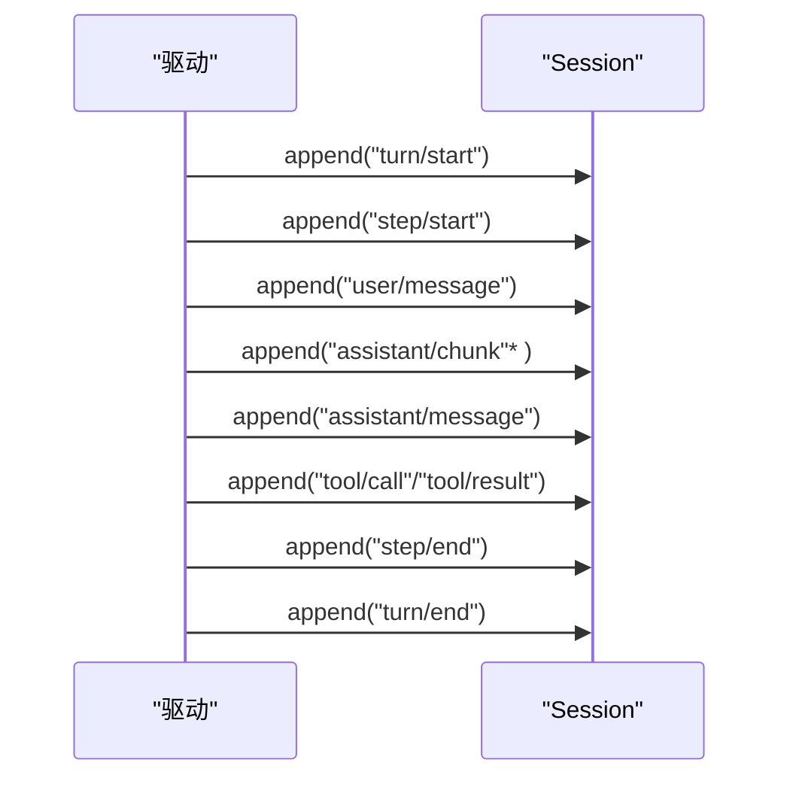
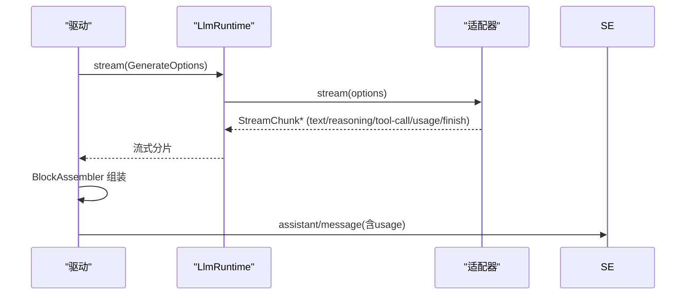
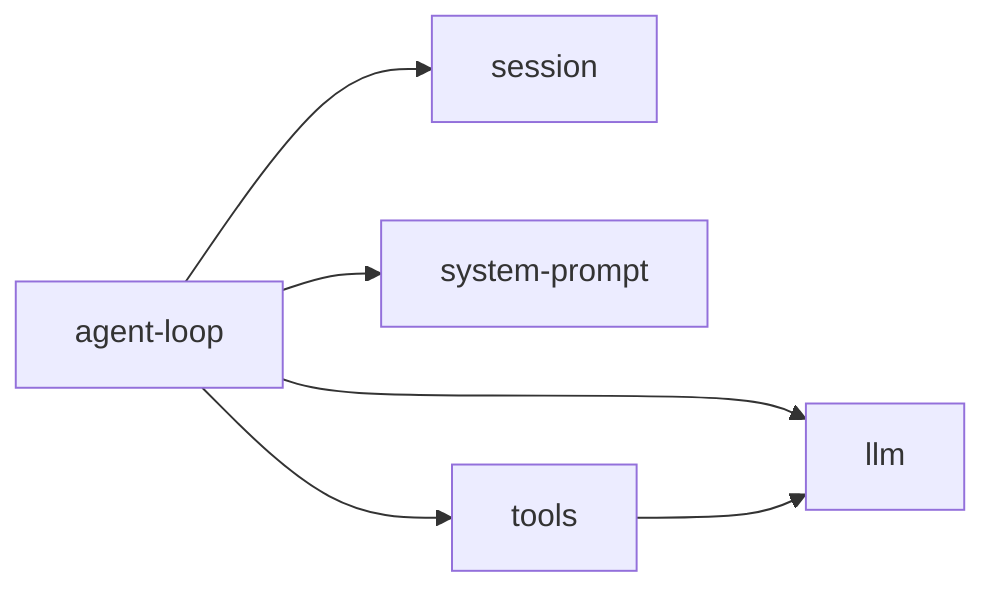

# Agent 管理系统

<cite>
**本文引用的文件**
- [packages/core/agent/src/index.ts](file://packages/core/agent/src/index.ts)
- [packages/core/agent/src/types.ts](file://packages/core/agent/src/types.ts)
- [packages/core/agent-loop/src/index.ts](file://packages/core/agent-loop/src/index.ts)
- [packages/core/session/src/index.ts](file://packages/core/session/src/index.ts)
- [packages/core/session/src/types.ts](file://packages/core/session/src/types.ts)
- [packages/core/tools/src/index.ts](file://packages/core/tools/src/index.ts)
- [packages/llm/llm/src/index.ts](file://packages/llm/llm/src/index.ts)
- [packages/llm/llm/src/types.ts](file://packages/llm/llm/src/types.ts)
- [docs/architecture.md](file://docs/architecture.md)
- [docs/agent-lifecycle.md](file://docs/agent-lifecycle.md)
- [docs/subsystems/core.md](file://docs/subsystems/core.md)
- [docs/subsystems/session.md](file://docs/subsystems/session.md)
- [docs/subsystems/tools.md](file://docs/subsystems/tools.md)
- [docs/subsystems/llm-streaming.md](file://docs/subsystems/llm-streaming.md)
</cite>

## 目录
1. [简介](#简介)
2. [项目结构](#项目结构)
3. [核心组件](#核心组件)
4. [架构总览](#架构总览)
5. [详细组件分析](#详细组件分析)
6. [依赖关系分析](#依赖关系分析)
7. [性能考量](#性能考量)
8. [故障排查指南](#故障排查指南)
9. [结论](#结论)
10. [附录](#附录)

## 简介
本文件面向 Agent 管理系统的创建者与维护者，系统化阐述 Agent 的生命周期（创建、初始化、执行与销毁）、状态控制（状态转换、并发控制、错误处理）、消息处理（路由、分发、响应）、以及与工具系统、会话管理和 LLM 适配器的集成方式。文档同时提供自定义 Agent 的创建与管理示例路径、事件监听与错误恢复策略，以及性能优化与最佳实践建议。

## 项目结构
Agent 管理系统由一组可插拔的子系统组成：
- 会话日志与投影：session（持久化、派生历史、表面投影）
- 工具注册与执行：tools（声明式 schema、执行管道、UI 呈现）
- LLM 适配器与流式协议：llm（适配器契约、流式块、重试与失败模型）
- Agent 接口与驱动：agent + agent-loop（生命周期、轮次/步骤驱动、事件水线）
- 配置与组合：preset、scope、boot（插件树、配置层叠、作用域隔离）

图表来源
- [docs/subsystems/core.md:11-20](file://docs/subsystems/core.md#L11-L20)
- [docs/architecture.md:39-51](file://docs/architecture.md#L39-L51)

章节来源
- [docs/architecture.md:15-37](file://docs/architecture.md#L15-L37)
- [docs/subsystems/core.md:1-20](file://docs/subsystems/core.md#L1-L20)

## 核心组件
- Agent 接口与句柄：暴露统一 send/followup/steer/inject/cancel/whenIdle/runMaintenance 等能力；status 为 idle/running；inbox 维护 next-turn/next-step 两个有序待处理队列。
- Agent 注册表与所有权：create/resume 返回带 dispose 的 AgentHandle；enter/announce 用于有序发布；isOwnedBy 区分运行时创建者。
- 会话 Session：append-only 日志，deriveMessages 派生模型可见历史；turn/step/user/assistant/tool 等事件构成完整回放。
- 工具管线：pre-execute → guards → execute → post-execute → finalizeContent → result；支持并行/独占模式与 UI 呈现。
- LLM 适配器：stream 协议、BlockAssembler 组装、重试策略、上下文溢出与空响应等错误归一化。

章节来源
- [packages/core/agent/src/types.ts:61-141](file://packages/core/agent/src/types.ts#L61-L141)
- [packages/core/agent/src/index.ts:158-213](file://packages/core/agent/src/index.ts#L158-L213)
- [packages/core/session/src/types.ts:27-125](file://packages/core/session/src/types.ts#L27-L125)
- [docs/subsystems/tools.md:169-173](file://docs/subsystems/tools.md#L169-L173)
- [docs/subsystems/llm-streaming.md:154-216](file://docs/subsystems/llm-streaming.md#L154-L216)

## 架构总览
Agent 驱动循环在一个 turn 中可能包含多个 step；每个 step 是一次模型请求及其工具调用。输入通过 inbox 进入，pre-step 决定进入内容，随后构建请求、流式获取响应、执行工具并回写日志，直到无更多工作。

图表来源
- [docs/agent-lifecycle.md:8-72](file://docs/agent-lifecycle.md#L8-L72)
- [docs/architecture.md:63-90](file://docs/architecture.md#L63-L90)

章节来源
- [docs/agent-lifecycle.md:1-83](file://docs/agent-lifecycle.md#L1-L83)
- [docs/architecture.md:63-90](file://docs/architecture.md#L63-L90)

## 详细组件分析

### Agent 生命周期与状态控制
- 创建与初始化
  - create(resume) 返回 AgentHandle，内部完成 session 准备、setup 组合、发布 created 事件并启动驱动。
  - enter/announce 保证有序发布与回滚安全。
- 运行态
  - status 在 idle/running 之间切换；running 覆盖整个驱动排空区间，不等同于“仍有 open turn”。
  - whenIdle 等待整代理活动收敛；runMaintenance 在空闲阶段执行维护任务。
- 销毁
  - dispose 停止驱动、等待退出、注销 agent、移除 session、解绑作用域。
- 取消与恢复
  - cancel 支持 keepInbox 保留排队项；cause 携带意图；turn/end 记录终止原因。
  - agent/request-error 允许修复后重试；dsh-compaction-basic 在上下文溢出时进行裁剪与摘要恢复。

图表来源
- [packages/core/agent/src/types.ts:144-153](file://packages/core/agent/src/types.ts#L144-L153)
- [docs/subsystems/core.md:53-155](file://docs/subsystems/core.md#L53-L155)

章节来源
- [packages/core/agent/src/index.ts:158-213](file://packages/core/agent/src/index.ts#L158-L213)
- [packages/core/agent/src/types.ts:61-141](file://packages/core/agent/src/types.ts#L61-L141)
- [docs/subsystems/core.md:211-235](file://docs/subsystems/core.md#L211-L235)

### 消息处理机制：路由、分发与响应
- 投递目标
  - next-turn：下一个 turn 的首条普通消息。
  - next-step：当前 step 的后续注入上下文或转向指令。
- 入队与认领
  - inbox.append/prepend/replace/remove/clear/splice/claim 记录持久化变更；claim 以纯删除形式移除提议步骤批次。
- 拦截与决策
  - agent/pre-step 水线可拒绝或改写进入消息；agent/turn-stopping 串行收尾。
- 响应处理
  - assistant/chunk 实时流式追加；assistant/message 汇总最终消息；tool/call→tool/result 成对记录。

图表来源
- [packages/core/agent/src/types.ts:171-178](file://packages/core/agent/src/types.ts#L171-L178)
- [docs/subsystems/core.md:211-235](file://docs/subsystems/core.md#L211-L235)
- [docs/agent-lifecycle.md:24-68](file://docs/agent-lifecycle.md#L24-L68)

章节来源
- [packages/core/agent/src/types.ts:103-141](file://packages/core/agent/src/types.ts#L103-L141)
- [docs/subsystems/core.md:211-235](file://docs/subsystems/core.md#L211-L235)

### 与工具系统的集成
- 工具定义：ToolDefinition = ToolSchema + output + execute + finalizeContent + timeoutMs + isConcurrencySafe + presentCall/presentResult。
- 执行管道：pre-execute → guards → execute → post-execute → finalizeContent → result；支持 parallel/exclusive 调度。
- 结果与呈现：成功/失败均产出 content；可选 meta 与 concludesTurn 标记；UI 通过 card-tagged 视图描述。

图表来源
- [docs/subsystems/tools.md:9-94](file://docs/subsystems/tools.md#L9-L94)
- [docs/subsystems/tools.md:170-173](file://docs/subsystems/tools.md#L170-L173)
- [docs/subsystems/tools.md:243-253](file://docs/subsystems/tools.md#L243-L253)

章节来源
- [docs/subsystems/tools.md:9-94](file://docs/subsystems/tools.md#L9-L94)
- [docs/subsystems/tools.md:169-173](file://docs/subsystems/tools.md#L169-L173)
- [docs/subsystems/tools.md:243-253](file://docs/subsystems/tools.md#L243-L253)

### 与会话管理的集成
- 会话日志：turn/start、step/start、user/message、assistant/chunk、assistant/message、tool/call、tool/result、request/header/context 等事件。
- 派生历史：deriveMessages() 基于 surfaceOp 与 sourceEventSeqs 构建模型可见消息；assistant/message.usage 作为用量落盘点。
- 边界与恢复：session/end-seed 标记种子结束；crash 恢复合成 interrupted 原因；flush 提供持久化屏障。

图表来源
- [docs/subsystems/session.md:27-125](file://docs/subsystems/session.md#L27-L125)
- [docs/subsystems/session.md:521-531](file://docs/subsystems/session.md#L521-L531)

章节来源
- [docs/subsystems/session.md:27-125](file://docs/subsystems/session.md#L27-L125)
- [docs/subsystems/session.md:521-531](file://docs/subsystems/session.md#L521-L531)

### 与 LLM 适配器的集成
- 适配器契约：stream(options) 返回 StreamChunk 流；usage 必须在 finish 之前；工具参数保持原始 JSON 字符串；错误走 error/aborted 两种路径。
- 重试与失败：ResolvedRetryPolicy 控制重试；CONTEXT_WINDOW_EXCEEDED 统一上下文溢出码；空响应视为可重试错误。
- 组装与记录：BlockAssembler 将流重组为 ContentBlock；assistant/message 携带 usage 与 replayState；request/header 记录有效配置与工具 schema。

图表来源
- [docs/subsystems/llm-streaming.md:154-216](file://docs/subsystems/llm-streaming.md#L154-L216)
- [docs/subsystems/llm-streaming.md:266-308](file://docs/subsystems/llm-streaming.md#L266-L308)
- [docs/subsystems/llm-streaming.md:599-614](file://docs/subsystems/llm-streaming.md#L599-L614)

章节来源
- [docs/subsystems/llm-streaming.md:154-216](file://docs/subsystems/llm-streaming.md#L154-L216)
- [docs/subsystems/llm-streaming.md:266-308](file://docs/subsystems/llm-streaming.md#L266-L308)
- [docs/subsystems/llm-streaming.md:599-614](file://docs/subsystems/llm-streaming.md#L599-L614)

### 自定义 Agent 的创建与管理（示例路径）
- 创建与拥有
  - 使用 ctx.agents.create/resume 获取 AgentHandle，并在 fiber 卸载时调用 dispose。
  - 参考：[packages/core/agent/src/index.ts:158-213](file://packages/core/agent/src/index.ts#L158-L213)
- 配置选项
  - AgentOptions 指定 provider/model/maxTokens；setup 回调可在发布前组合作用域。
  - 参考：[docs/subsystems/core.md:157-169](file://docs/subsystems/core.md#L157-L169)
- 事件监听
  - 订阅 agent/status、agent/error、session/event 等事件实现观测与审计。
  - 参考：[docs/subsystems/core.md:725-797](file://docs/subsystems/core.md#L725-L797)
- 错误恢复策略
  - 在 agent/request-error 中执行修复并返回 retry；结合 dsh-compaction-basic 的上下文裁剪与摘要。
  - 参考：[docs/subsystems/core.md:217-235](file://docs/subsystems/core.md#L217-L235)
- 取消与保活
  - cancel({ kind }) 支持 keepInbox 保留排队项；whenIdle 等待收敛。
  - 参考：[packages/core/agent/src/types.ts:182-203](file://packages/core/agent/src/types.ts#L182-L203)

章节来源
- [packages/core/agent/src/index.ts:158-213](file://packages/core/agent/src/index.ts#L158-L213)
- [docs/subsystems/core.md:157-169](file://docs/subsystems/core.md#L157-L169)
- [docs/subsystems/core.md:725-797](file://docs/subsystems/core.md#L725-L797)
- [docs/subsystems/core.md:217-235](file://docs/subsystems/core.md#L217-L235)
- [packages/core/agent/src/types.ts:182-203](file://packages/core/agent/src/types.ts#L182-L203)

## 依赖关系分析
- 松耦合扩展点
  - 通过 ctx.agents、ctx.sessions、ctx.tools、ctx.llm 四个核心服务解耦；插件以 Cordis 效果挂载/卸载。
- 直接依赖
  - agent-loop 依赖 session/system-prompt/tools/llm；tools 依赖 llm 的 ToolSchema；llm 提供适配器契约。
- 外部集成
  - 通过 preset/scope 实现按 Agent 的作用域隔离；通过 persistence 插件实现日志持久化。

图表来源
- [docs/subsystems/core.md:11-20](file://docs/subsystems/core.md#L11-L20)
- [docs/architecture.md:39-51](file://docs/architecture.md#L39-L51)

章节来源
- [docs/subsystems/core.md:11-20](file://docs/subsystems/core.md#L11-L20)
- [docs/architecture.md:39-51](file://docs/architecture.md#L39-L51)

## 性能考量
- 流式处理与缓存
  - 使用 StreamChunk 流式传输，避免大对象一次性加载；BlockAssembler 增量组装减少内存峰值。
- 工具并发控制
  - isConcurrencySafe 标记可并行执行的工具，配合滚动池提升吞吐；exclusive 工具形成顺序屏障。
- 会话投影成本
  - deriveMessages 对每个 surface 节点仅投影一次，替换时重建；合理控制 compaction 频率。
- 超时与背压
  - tools.timeoutMs 与 LLM 流空闲超时共同限制长尾；keepInbox 避免频繁丢弃导致重放开销。
- 持久化批处理
  - 通过 session/flush 集中落盘，降低 I/O 抖动；crash 恢复利用 session/end-seed 定位边界。

章节来源
- [docs/subsystems/tools.md:243-253](file://docs/subsystems/tools.md#L243-L253)
- [docs/subsystems/llm-streaming.md:154-216](file://docs/subsystems/llm-streaming.md#L154-L216)
- [docs/subsystems/session.md:521-531](file://docs/subsystems/session.md#L521-L531)
- [docs/subsystems/session.md:583-590](file://docs/subsystems/session.md#L583-L590)

## 故障排查指南
- 常见错误分类
  - LLM 适配器：DUPLICATE_ADAPTER、INVALID_ADAPTER、CONTEXT_WINDOW_EXCEEDED、EMPTY_RESPONSE。
  - 工具执行：UNKNOWN_TOOL、INVALID_ARGS、INVALID_TOOL_OUTPUT。
  - Agent 注册：重复注册、id 不一致、创建被 veto。
- 定位方法
  - 观察 agent/status、agent/error、session/event 事件；检查 request/header 与 tool/result 的元数据。
  - 使用 whenIdle 确认收敛；必要时 cancel({ keepInbox: true }) 保留排队项以便复现。
- 恢复策略
  - agent/request-error 中执行修复并返回 retry；上下文溢出时启用裁剪与摘要；崩溃后由 persistence 合成 interrupted 原因。

章节来源
- [docs/subsystems/llm-streaming.md:184-216](file://docs/subsystems/llm-streaming.md#L184-L216)
- [docs/subsystems/tools.md:149-151](file://docs/subsystems/tools.md#L149-L151)
- [packages/core/agent/tests/agent.spec.ts:221-232](file://packages/core/agent/tests/agent.spec.ts#L221-L232)
- [docs/subsystems/core.md:217-235](file://docs/subsystems/core.md#L217-L235)

## 结论
Agent 管理系统通过清晰的职责划分与可扩展的事件水线，实现了高内聚、低耦合的 Agent 生命周期与执行流程。借助会话日志的可回放性、工具的受控执行、LLM 适配器的标准化流式协议，系统在可靠性、可观测性与可维护性方面具备坚实基础。遵循本文的最佳实践与性能建议，可高效构建稳定、高性能的自定义 Agent。

## 附录
- 关键 API 速查
  - Agent：send/followup/steer/inject/cancel/whenIdle/runMaintenance
  - Session：append/deriveMessages/flush/fork
  - Tools：register/guard/execute/schemas
  - LLM：registerAdapter/listModels/resolveModelInfo/stream
- 推荐阅读
  - 架构与 Turn 流程图：[docs/architecture.md](file://docs/architecture.md)、[docs/agent-lifecycle.md](file://docs/agent-lifecycle.md)
  - 子系统详解：[docs/subsystems/core.md](file://docs/subsystems/core.md)、[docs/subsystems/session.md](file://docs/subsystems/session.md)、[docs/subsystems/tools.md](file://docs/subsystems/tools.md)、[docs/subsystems/llm-streaming.md](file://docs/subsystems/llm-streaming.md)