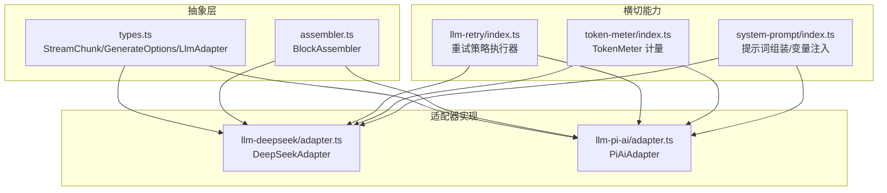
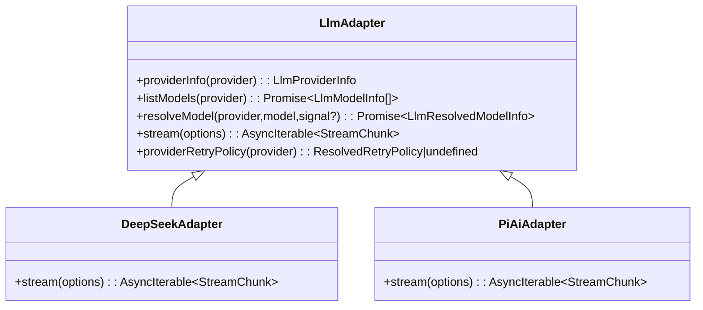
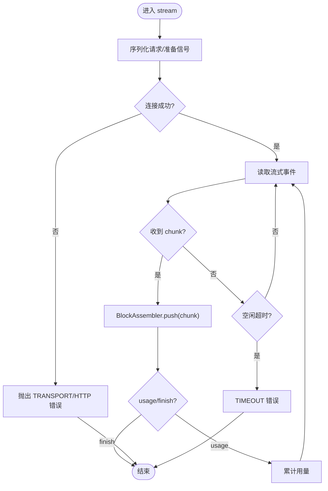
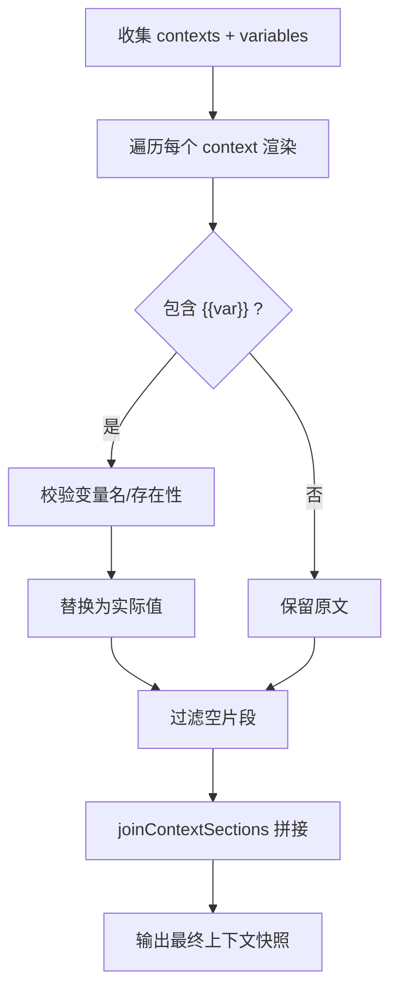
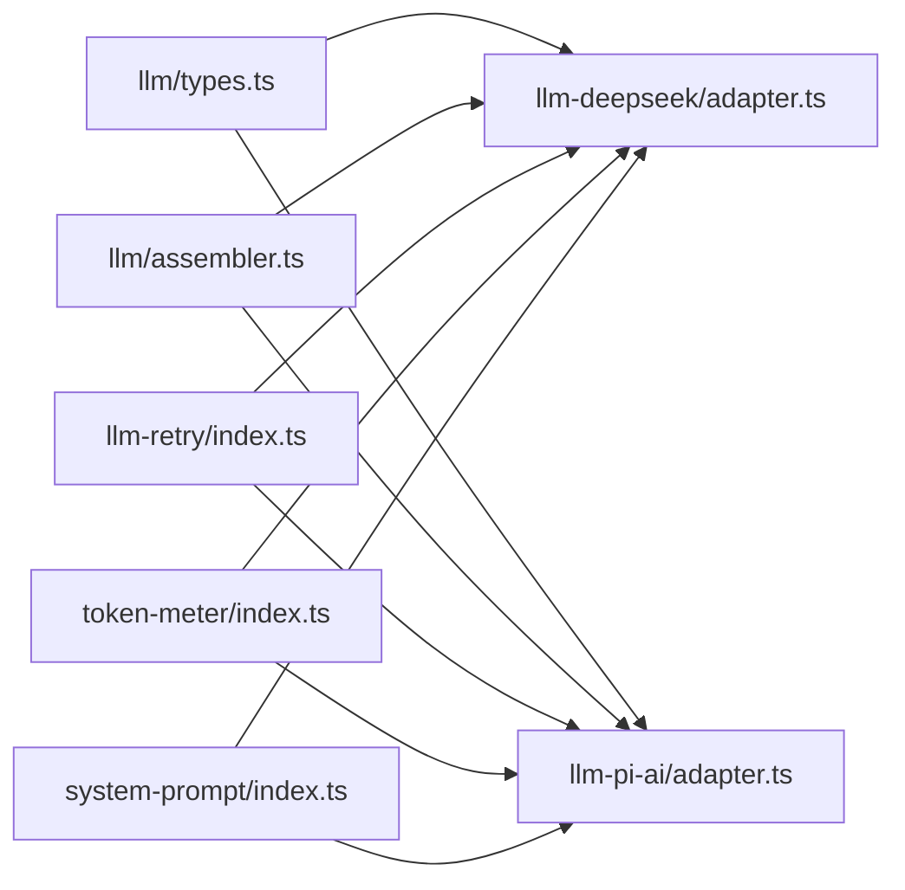

# LLM 集成层

<cite>
**本文引用的文件**
- [packages/llm/llm/src/types.ts](file://packages/llm/llm/src/types.ts)
- [packages/llm/llm/src/assembler.ts](file://packages/llm/llm/src/assembler.ts)
- [packages/llm/llm-deepseek/src/adapter.ts](file://packages/llm/llm-deepseek/src/adapter.ts)
- [packages/llm/llm-pi-ai/src/adapter.ts](file://packages/llm/llm-pi-ai/src/adapter.ts)
- [packages/llm/llm-retry/src/index.ts](file://packages/llm/llm-retry/src/index.ts)
- [packages/llm/token-meter/src/index.ts](file://packages/llm/token-meter/src/index.ts)
- [docs/cookbook/adding-an-llm-adapter.md](file://docs/cookbook/adding-an-llm-adapter.md)
- [docs/subsystems/llm-streaming.md](file://docs/subsystems/llm-streaming.md)
- [packages/core/system-prompt/src/index.ts](file://packages/core/system-prompt/src/index.ts)
</cite>

## 目录
1. [简介](#简介)
2. [项目结构](#项目结构)
3. [核心组件](#核心组件)
4. [架构总览](#架构总览)
5. [详细组件分析](#详细组件分析)
6. [依赖关系分析](#依赖关系分析)
7. [性能考量](#性能考量)
8. [故障排查指南](#故障排查指南)
9. [结论](#结论)
10. [附录](#附录)

## 简介
本文件面向需要在 Harness 中集成或扩展 LLM 能力的开发者，系统性说明模型适配器架构（抽象接口、适配器模式与插件机制）、流式响应处理（数据分块、错误重试与连接管理）、提示词组装与管理（上下文构建、模板渲染与变量注入）、模型选择策略与负载均衡机制，并提供添加新提供商、配置参数与优化请求性能的实践示例。同时涵盖安全与成本控制策略。

## 项目结构
LLM 集成层由“抽象契约 + 多实现适配器 + 通用基础设施”构成：
- 抽象契约与类型定义位于 llm 包，统一消息、流式协议、重试策略、应用标识等。
- 具体适配器实现分别位于 llm-deepseek（直连 OpenAI 兼容 SSE）与 llm-pi-ai（封装第三方 SDK）。
- 重试、令牌计量、提示词组装等能力以插件或服务形式提供，贯穿会话与调用生命周期。



图表来源
- [packages/llm/llm/src/types.ts:1-357](file://packages/llm/llm/src/types.ts#L1-L357)
- [packages/llm/llm/src/assembler.ts:1-165](file://packages/llm/llm/src/assembler.ts#L1-L165)
- [packages/llm/llm-deepseek/src/adapter.ts:1-347](file://packages/llm/llm-deepseek/src/adapter.ts#L1-L347)
- [packages/llm/llm-pi-ai/src/adapter.ts:1-359](file://packages/llm/llm-pi-ai/src/adapter.ts#L1-L359)
- [packages/llm/llm-retry/src/index.ts:1-227](file://packages/llm/llm-retry/src/index.ts#L1-L227)
- [packages/llm/token-meter/src/index.ts:1-314](file://packages/llm/token-meter/src/index.ts#L1-L314)
- [packages/core/system-prompt/src/index.ts:219-284](file://packages/core/system-prompt/src/index.ts#L219-L284)

章节来源
- [docs/subsystems/llm-streaming.md:1-800](file://docs/subsystems/llm-streaming.md#L1-L800)
- [docs/cookbook/adding-an-llm-adapter.md:1-44](file://docs/cookbook/adding-an-llm-adapter.md#L1-L44)

## 核心组件
- LlmAdapter 抽象接口：定义 providerInfo、listModels、resolveModel、stream 等能力，所有提供商必须实现 stream 并遵循 StreamChunk 协议。
- StreamChunk 协议：统一的增量块协议（block-start/text-delta/tool-call-delta/block-end/usage/finish），保证可组合、可回放、可度量。
- BlockAssembler：将流式块增量拼装为完整 ContentBlock 与 assistant Message，并暴露 usage、finish、replayState。
- 重试策略：基于 ResolvedRetryPolicy 的指数退避与抖动，支持 normal 与 always 两种模式，结合 providerRetryAfterMs 与稳定 code 路由。
- TokenMeter：基于会话事件回放与 BlockAssembler，估算当前上下文压力与 token 用量，支持投影与缓存锚点。
- 提示词系统：通过 context 快照与变量插值（{{name}}）动态组装系统提示与运行时上下文，确保安全性与可审计性。

章节来源
- [packages/llm/llm/src/types.ts:1-357](file://packages/llm/llm/src/types.ts#L1-L357)
- [packages/llm/llm/src/assembler.ts:1-165](file://packages/llm/llm/src/assembler.ts#L1-L165)
- [packages/llm/llm-retry/src/index.ts:1-227](file://packages/llm/llm-retry/src/index.ts#L1-L227)
- [packages/llm/token-meter/src/index.ts:1-314](file://packages/llm/token-meter/src/index.ts#L1-L314)
- [packages/core/system-prompt/src/index.ts:219-284](file://packages/core/system-prompt/src/index.ts#L219-L284)

## 架构总览
下图展示一次对话轮次从高层到适配器的调用链路与关键横切关注点：

```mermaid
sequenceDiagram
participant App as "上层调用方"
participant Loop as "AgentLoop/服务"
participant Retry as "llm-retry"
participant Adapter as "LlmAdapter(DeepSeek/PiAi)"
participant Provider as "外部模型提供商"
participant Meter as "TokenMeter"
participant Asm as "BlockAssembler"
App->>Loop : 发起生成请求 (GenerateOptions)
Loop->>Retry : 捕获失败并评估是否重试
Retry-->>Loop : 决策 : 重试/继续/放弃
Loop->>Adapter : stream(options)
Adapter->>Provider : 建立连接/发送请求
Provider-->>Adapter : 流式事件(SSE/SDK事件)
Adapter-->>Loop : StreamChunk(block/usage/finish)
Loop->>Asm : push(chunk) 累积拼装
Loop->>Meter : measure(session, header) 估算用量
Adapter-->>Loop : finish(reason, replayState?)
Loop-->>App : 返回结果/错误(含重试历史)
```

图表来源
- [packages/llm/llm-deepseek/src/adapter.ts:214-347](file://packages/llm/llm-deepseek/src/adapter.ts#L214-L347)
- [packages/llm/llm-pi-ai/src/adapter.ts:276-359](file://packages/llm/llm-pi-ai/src/adapter.ts#L276-L359)
- [packages/llm/llm-retry/src/index.ts:156-227](file://packages/llm/llm-retry/src/index.ts#L156-L227)
- [packages/llm/llm/src/assembler.ts:47-165](file://packages/llm/llm/src/assembler.ts#L47-L165)
- [packages/llm/token-meter/src/index.ts:116-147](file://packages/llm/token-meter/src/index.ts#L116-L147)

## 详细组件分析

### 模型适配器架构与插件机制
- 抽象接口 LlmAdapter：
  - providerInfo：描述注册路由的显示信息。
  - listModels：列出可发现模型（建议性，不限制路由）。
  - resolveModel：解析精确模型的上下文窗口、默认 maxTokens、推理努力等级等。
  - stream：唯一必需方法，输出 StreamChunk 流。
- 插件注册：
  - 通过 ctx.llm.registerAdapter(providers, adapter) 注册，支持原子替换 replace()。
  - 可声明可配置提供者 registerConfigurableProviders，供配置界面呈现。
- 适配器职责边界：
  - 仅负责传输与协议转换；认证、凭据、超时、重试策略由宿主与横切组件管理。
  - 必须遵守协议约定：usage 在 finish 之前；工具参数保持原始 JSON；错误两条路径（抛错或 finish error/aborted）。



图表来源
- [packages/llm/llm/src/types.ts:631-702](file://packages/llm/llm/src/types.ts#L631-L702)
- [packages/llm/llm-deepseek/src/adapter.ts:158-347](file://packages/llm/llm-deepseek/src/adapter.ts#L158-L347)
- [packages/llm/llm-pi-ai/src/adapter.ts:186-359](file://packages/llm/llm-pi-ai/src/adapter.ts#L186-L359)

章节来源
- [docs/subsystems/llm-streaming.md:627-702](file://docs/subsystems/llm-streaming.md#L627-L702)
- [docs/cookbook/adding-an-llm-adapter.md:1-44](file://docs/cookbook/adding-an-llm-adapter.md#L1-L44)

### 流式响应处理：数据分块、错误重试与连接管理
- 数据分块：
  - block-start 标记新块开始；text-delta/reasoning-delta/tool-call-delta 增量推送；block-end 携带完整块；usage 统计用量；finish 结束流。
  - BlockAssembler 按 index 关联增量，容忍 delta-only 协议，忽略已关闭块的后续增量，防止内存泄漏。
- 错误重试：
  - 适配器抛出 LlmError 或 finish(error/aborted) 两条路径；重试策略根据 failure.code 与 providerRetryAfterMs 决定延迟与次数。
  - 支持 normal（有限重试）与 always（无限重试）模式，带指数退避与抖动。
- 连接管理：
  - 使用 AbortSignal 统一管理上游取消与内部 watchdog 空闲超时；空闲超时映射为 TIMEOUT 错误。
  - DeepSeek 适配器直接 fetch + SSE；PiAi 适配器通过 SDK 流式 API，均对信号与超时做一致化处理。



图表来源
- [packages/llm/llm-deepseek/src/adapter.ts:214-347](file://packages/llm/llm-deepseek/src/adapter.ts#L214-L347)
- [packages/llm/llm-pi-ai/src/adapter.ts:276-359](file://packages/llm/llm-pi-ai/src/adapter.ts#L276-L359)
- [packages/llm/llm/src/assembler.ts:47-165](file://packages/llm/llm/src/assembler.ts#L47-L165)
- [packages/llm/llm-retry/src/index.ts:156-227](file://packages/llm/llm-retry/src/index.ts#L156-L227)

章节来源
- [docs/subsystems/llm-streaming.md:154-216](file://docs/subsystems/llm-streaming.md#L154-L216)

### 提示词组装与管理系统：上下文构建、模板渲染与变量注入
- 上下文快照：
  - 各子系统贡献 named sections，按顺序拼接成“Current runtime context...”文本。
  - renderContextSections 收集非空片段；renderContextSnapshot 合并为最终文本。
- 变量注入：
  - 使用 {{name}} 语法进行变量插值；变量名需匹配白名单，未注册或原型属性会被拒绝，避免注入风险。
  - 插值过程严格校验，错误时定位到具体 section 名称，便于诊断。
- 工具与系统提示：
  - 工具 schema 随请求下发；系统提示由多个 section 组成，可按部署需求裁剪。



图表来源
- [packages/core/system-prompt/src/index.ts:219-284](file://packages/core/system-prompt/src/index.ts#L219-L284)

章节来源
- [packages/core/system-prompt/src/index.ts:219-284](file://packages/core/system-prompt/src/index.ts#L219-L284)

### 模型选择策略与负载均衡机制
- 模型目录与精确解析：
  - listModels 提供建议性目录；resolveModel 返回精确模型的上下文窗口、默认 maxTokens、推理努力等级等权威元数据。
  - 目录缺失不代表不可用；适配器可接受未列出的模型 id。
- 路由与选择：
  - GenerateOptions.provider 选择已注册的适配器实例；model 为该实例下的模型 id。
  - 可通过 prepareCall 冻结一次调用的注册与元数据，避免中途切换导致的不一致。
- 负载均衡：
  - 当前设计以“按 provider 路由”为主；若需跨提供商均衡，可在上层通过策略选择不同 provider，并结合重试策略与容量元数据进行调度。
  - 适配器可暴露 reasoning efforts 与默认 effort，用于质量/成本权衡。

章节来源
- [packages/llm/llm/src/types.ts:318-500](file://packages/llm/llm/src/types.ts#L318-L500)
- [docs/subsystems/llm-streaming.md:318-500](file://docs/subsystems/llm-streaming.md#L318-L500)

### 集成示例：如何添加新的 LLM 提供商
- 步骤概览：
  - 新建适配器类继承 LlmAdapter，实现 stream 并遵循 StreamChunk 协议。
  - 实现 providerInfo、listModels、resolveModel、providerRetryPolicy（可选）。
  - 在插件 apply 中通过 ctx.llm.registerAdapter(['your-provider'], new YourAdapter(...)) 注册。
  - 如需可配置，使用 registerConfigurableProviders 声明可激活的路由。
- 参考实现：
  - llm-deepseek：直连 HTTP + SSE，SSE 帧由 eventsource-parser 解析。
  - llm-pi-ai：封装第三方 SDK，处理多提供商与图片输入等。
- 协议义务要点：
  - usage 必须在 finish 之前；finish 之后不得再 emit。
  - 工具调用 arguments 全程保持原始 JSON 字符串；若提供方返回对象，需在 block-end 前重新序列化为字符串。
  - 错误两条路径：throw LlmError 或 finish(error/aborted)。
  - 尊重 options.signal；不支持的能力应抛出 UNSUPPORTED。
  - 如需要原生 replayState，应在 finish 中附带并在历史重建时验证。

章节来源
- [docs/cookbook/adding-an-llm-adapter.md:1-44](file://docs/cookbook/adding-an-llm-adapter.md#L1-L44)
- [packages/llm/llm-deepseek/src/adapter.ts:158-347](file://packages/llm/llm-deepseek/src/adapter.ts#L158-L347)
- [packages/llm/llm-pi-ai/src/adapter.ts:186-359](file://packages/llm/llm-pi-ai/src/adapter.ts#L186-L359)

### 配置模型参数与优化请求性能
- 模型参数：
  - temperature、maxTokens、stop、reasoningEffort 等通过 GenerateOptions 传递；适配器按需映射到提供方字段。
  - resolveModel 可返回 defaultMaxTokens 与 reasoning efforts 列表及默认值，减少上层配置负担。
- 性能优化：
  - 使用 BlockAssembler 统一拼装，避免重复实现。
  - 合理设置 streamIdleTimeoutMs，避免长空闲占用资源。
  - 利用 TokenMeter 估算上下文压力，指导压缩与截断策略。
  - 复用会话身份 sessionId，有助于提供方侧游标与缓存命中。
  - 控制 tools 数量与复杂度，减少模型理解开销。

章节来源
- [packages/llm/llm/src/types.ts:319-500](file://packages/llm/llm/src/types.ts#L319-L500)
- [packages/llm/token-meter/src/index.ts:116-147](file://packages/llm/token-meter/src/index.ts#L116-L147)

### 安全考虑与成本控制策略
- 安全：
  - 应用标识 attributionHeaders 强制附加到每个请求，禁止敏感信息泄露。
  - 提示词变量注入严格校验，拒绝原型链访问与未知变量。
  - 凭据通过引用解析，不在配置中硬编码密钥；每次请求从同一快照解析，避免端点与密钥错位。
- 成本控制：
  - TokenUsage 采用离散计数（input/cacheRead/cacheWrite/output），避免重复计费。
  - TokenMeter 基于会话回放与 BlockAssembler 估算用量，支持表面节点折叠与锚点缓存。
  - 通过 resolveModel 获取 contextWindow 与 defaultMaxTokens，配合压缩策略避免溢出。
  - 重试策略限制最大延迟与抖动比例，避免雪崩；providerRetryAfterMs 优先采纳提供方建议。

章节来源
- [packages/llm/llm/src/types.ts:127-141](file://packages/llm/llm/src/types.ts#L127-L141)
- [packages/llm/token-meter/src/index.ts:43-49](file://packages/llm/token-meter/src/index.ts#L43-L49)
- [packages/core/system-prompt/src/index.ts:257-284](file://packages/core/system-prompt/src/index.ts#L257-L284)
- [packages/llm/llm-retry/src/index.ts:58-76](file://packages/llm/llm-retry/src/index.ts#L58-L76)

## 依赖关系分析
- 适配器依赖抽象类型与 BlockAssembler，确保协议一致性。
- 重试插件监听 agent/request-error，依据 provider 路由的 ResolvedRetryPolicy 执行恢复。
- TokenMeter 订阅 session/event，结合 BlockAssembler 与 EpochHeader 估算用量。
- 提示词系统独立于 LLM 层，但为请求构建提供上下文与变量。



图表来源
- [packages/llm/llm/src/types.ts:1-357](file://packages/llm/llm/src/types.ts#L1-L357)
- [packages/llm/llm/src/assembler.ts:1-165](file://packages/llm/llm/src/assembler.ts#L1-L165)
- [packages/llm/llm-deepseek/src/adapter.ts:1-347](file://packages/llm/llm-deepseek/src/adapter.ts#L1-L347)
- [packages/llm/llm-pi-ai/src/adapter.ts:1-359](file://packages/llm/llm-pi-ai/src/adapter.ts#L1-L359)
- [packages/llm/llm-retry/src/index.ts:1-227](file://packages/llm/llm-retry/src/index.ts#L1-L227)
- [packages/llm/token-meter/src/index.ts:1-314](file://packages/llm/token-meter/src/index.ts#L1-L314)
- [packages/core/system-prompt/src/index.ts:219-284](file://packages/core/system-prompt/src/index.ts#L219-L284)

章节来源
- [packages/llm/llm/src/types.ts:1-357](file://packages/llm/llm/src/types.ts#L1-L357)

## 性能考量
- 流式拼装：BlockAssembler 按 index 维护增量，避免重复计算；对异常流具备容错，防止内存增长。
- 超时与空闲保护：idleWatchdog 保障单次读取的空闲上限，避免挂起连接。
- 重试退避：指数退避+抖动，限制最大延迟，避免风暴；优先采纳 providerRetryAfterMs。
- 计量与压缩：TokenMeter 基于会话回放与 BlockAssembler 估算用量，结合上下文窗口与默认 maxTokens 指导压缩与截断。
- 头部与工具：减少不必要的 tools 与过长的 system prompt，降低模型理解成本。

[本节为通用性能建议，不直接分析具体文件]

## 故障排查指南
- 常见错误码：
  - AUTH/QUOTA_EXCEEDED/RATE_LIMIT/CONTEXT_WINDOW_EXCEEDED/EMPTY_RESPONSE/TIMEOUT/ABORTED/TRANSPORT/UNSUPPORTED_*。
- 排查步骤：
  - 检查适配器是否正确实现 StreamChunk 协议（usage 在 finish 之前、arguments 保持原始 JSON）。
  - 确认 options.signal 被正确传递与处理；检查 idleWatchdog 是否触发 TIMEOUT。
  - 查看重试策略是否生效（normal/always、retryableCodes、providerRetryAfterMs）。
  - 使用 TokenMeter 测量上下文压力，必要时启用压缩或截断。
  - 检查提示词变量是否注册且合法，避免注入错误或中断。
- 日志与诊断：
  - 记录 request/header 与 assistant/chunk，便于重放与对比。
  - 使用 requestId 与 status 定位提供方错误。

章节来源
- [packages/llm/llm-deepseek/src/adapter.ts:138-149](file://packages/llm/llm-deepseek/src/adapter.ts#L138-L149)
- [packages/llm/llm-retry/src/index.ts:156-227](file://packages/llm/llm-retry/src/index.ts#L156-L227)
- [packages/llm/token-meter/src/index.ts:188-270](file://packages/llm/token-meter/src/index.ts#L188-L270)

## 结论
该 LLM 集成层通过清晰的抽象接口与统一的流式协议，实现了多提供商的可插拔接入；借助 BlockAssembler、重试策略与 TokenMeter，提供了健壮的错误恢复与成本控制能力；提示词系统确保了上下文的安全与可审计。按照本文档的指引，可以高效地添加新提供商、配置模型参数并优化请求性能，同时兼顾安全与成本。

[本节为总结性内容，不直接分析具体文件]

## 附录
- 快速参考：
  - 适配器注册：ctx.llm.registerAdapter(['your-provider'], new YourAdapter(...))
  - 流式协议：block-start/text-delta/tool-call-delta/block-end/usage/finish
  - 重试策略：normal/always，指数退避+抖动，providerRetryAfterMs 优先
  - 计量：TokenUsage 离散计数；TokenMeter 基于会话回放估算
  - 提示词：{{name}} 变量插值，严格校验

[本节为补充信息，不直接分析具体文件]