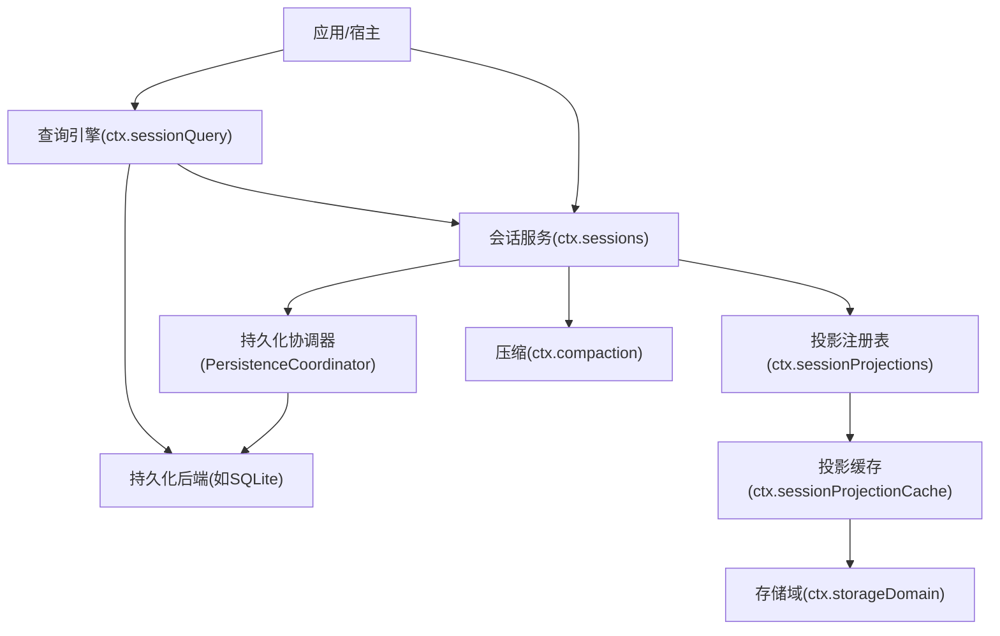
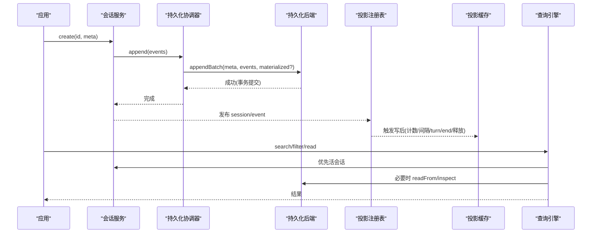
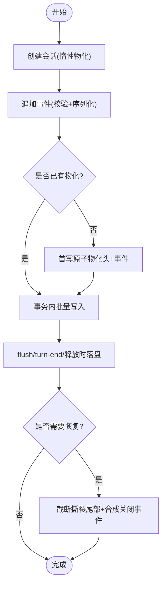
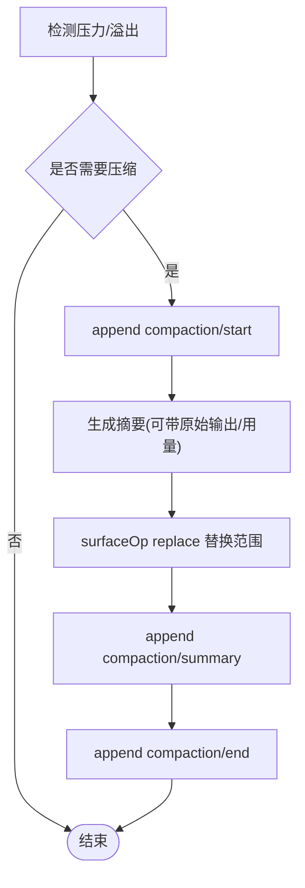
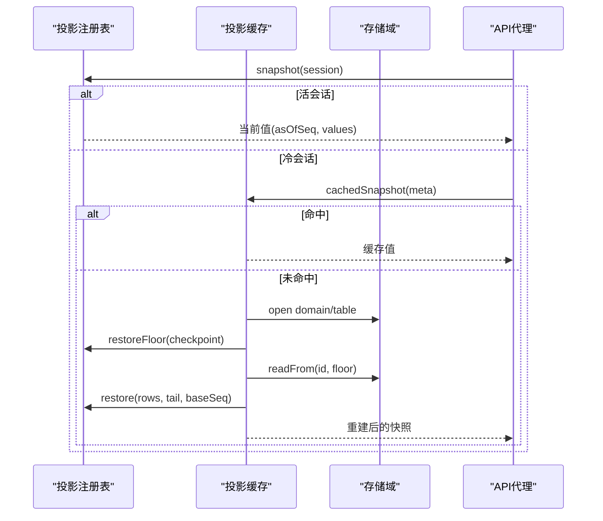
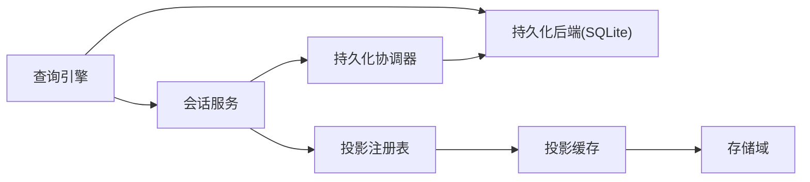

# 会话管理系统

<cite>
**本文引用的文件**
- [packages/session/session-persistence/src/coordinator.ts](file://packages/session/session-persistence/src/coordinator.ts)
- [packages/session/session-persistence/src/index.ts](file://packages/session/session-persistence/src/index.ts)
- [packages/session/session-projection-cache/src/index.ts](file://packages/session/session-projection-cache/src/index.ts)
- [packages/session-query/session-query/src/index.ts](file://packages/session-query/session-query/src/index.ts)
- [packages/host/apiproxy/src/api-proxy.ts](file://packages/host/apiproxy/src/api-proxy.ts)
- [packages/storage/storage-domain/src/index.ts](file://packages/storage/storage-domain/src/index.ts)
- [packages/storage/storage/src/backend.ts](file://packages/storage/storage/src/backend.ts)
- [packages/session/session-persistence-sqlite/src/index.ts](file://packages/session/session-persistence-sqlite/src/index.ts)
- [docs/subsystems/session.md](file://docs/subsystems/session.md)
- [docs/subsystems/persistence.zh.md](file://docs/subsystems/persistence.zh.md)
- [docs/subsystems/session-query.md](file://docs/subsystems/session-query.md)
- [docs/subsystems/session-projection.md](file://docs/subsystems/session-projection.md)
- [docs/subsystems/compaction.md](file://docs/subsystems/compaction.md)
- [docs/subsystems/storage.md](file://docs/subsystems/storage.md)
</cite>

## 目录
1. [简介](#简介)
2. [项目结构](#项目结构)
3. [核心组件](#核心组件)
4. [架构总览](#架构总览)
5. [详细组件分析](#详细组件分析)
6. [依赖关系分析](#依赖关系分析)
7. [性能考量](#性能考量)
8. [故障排查指南](#故障排查指南)
9. [结论](#结论)
10. [附录：使用示例与扩展点](#附录使用示例与扩展点)

## 简介
本文件系统性地梳理会话管理子系统，覆盖会话生命周期（创建、持久化、恢复、清理）、状态管理与事件日志结构、数据分片与压缩策略、查询与投影能力、修复与容错机制，以及性能优化与扩展点。目标是帮助读者在不深入源码的情况下理解整体设计，并在需要时快速定位到具体实现位置。

## 项目结构
会话管理由多个协作的子系统构成：
- 会话与事件模型：以追加式事件日志为核心，所有历史可重放推导。
- 持久化层：抽象服务 + 协调器 + 后端（如 SQLite），负责落盘、事务性写入、崩溃恢复。
- 投影系统：将事件流折叠为每会话的当前值，并提供缓存与冷读路径。
- 查询引擎：提供跨会话与单会话的全文检索、过滤、溯源与窗口读取。
- 存储域：通用 KV 域抽象，支撑投影缓存等元数据存储。
- 压缩：可选能力，对历史进行摘要与替换，减少上下文体积。

图表来源
- [packages/session/session-persistence/src/coordinator.ts:588-625](file://packages/session/session-persistence/src/coordinator.ts#L588-L625)
- [packages/session/session-projection-cache/src/index.ts:71-89](file://packages/session/session-projection-cache/src/index.ts#L71-L89)
- [packages/session-query/session-query/src/index.ts:81-105](file://packages/session-query/session-query/src/index.ts#L81-L105)
- [packages/storage/storage-domain/src/index.ts:163-201](file://packages/storage/storage-domain/src/index.ts#L163-L201)
- [docs/subsystems/session.md:1-12](file://docs/subsystems/session.md#L1-L12)

章节来源
- [docs/subsystems/session.md:1-12](file://docs/subsystems/session.md#L1-L12)
- [docs/subsystems/persistence.zh.md:17-19](file://docs/subsystems/persistence.zh.md#L17-L19)

## 核心组件
- 会话与事件模型：Session 是追加式事件日志，所有消息历史由事件推导；事件类型通过 SessionEventMap 声明，支持合并扩展。
- 持久化协调器：统一处理写缓冲、序列化、准备/恢复、回收与销毁，保证同一 ID 操作串行化与幂等。
- 投影系统：按单位纯函数驱动事件流，产出当前值；提供热路径快照与冷路径重建，并持久化缓存。
- 查询引擎：提供会话级与全局级搜索、过滤、溯源、窗口读取，屏蔽底层索引实现差异。
- 存储域：统一的 KV 域抽象，封装后端路由、版本校验、记录校验与变更事件。
- 压缩：可选能力，将选定表面范围替换为摘要节点，降低上下文大小。

章节来源
- [docs/subsystems/session.md:194-313](file://docs/subsystems/session.md#L194-L313)
- [packages/session/session-persistence/src/coordinator.ts:588-625](file://packages/session/session-persistence/src/coordinator.ts#L588-L625)
- [docs/subsystems/session-projection.md:9-57](file://docs/subsystems/session-projection.md#L9-L57)
- [docs/subsystems/session-query.md:9-55](file://docs/subsystems/session-query.md#L9-L55)
- [docs/subsystems/storage.md:9-47](file://docs/subsystems/storage.md#L9-L47)
- [docs/subsystems/compaction.md:9-23](file://docs/subsystems/compaction.md#L9-L23)

## 架构总览
下图展示从创建到落盘、投影缓存、查询与压缩的整体交互。

图表来源
- [packages/session/session-persistence/src/coordinator.ts:669-710](file://packages/session/session-persistence/src/coordinator.ts#L669-L710)
- [packages/session/session-projection-cache/src/index.ts:201-230](file://packages/session/session-projection-cache/src/index.ts#L201-L230)
- [packages/session-query/session-query/src/index.ts:107-151](file://packages/session-query/session-query/src/index.ts#L107-L151)

## 详细组件分析

### 会话生命周期：创建、持久化、恢复、清理
- 创建：会话服务创建会话并进入内存；首次写入时协调器可能惰性物化元数据。
- 持久化：事件批写入后端，要求 seq 连续且数据 JSON 可序列化；SQLite 后端在事务中批量插入并更新 revision。
- 恢复：prepare/load 会读取已存在日志，补齐中断轮次，返回不可变视图；HMR 接管活跃前缀但不关闭进行中轮次。
- 清理：会话释放时协调器刷新并回收状态，确保无悬挂写入。

图表来源
- [packages/session/session-persistence/src/coordinator.ts:645-710](file://packages/session/session-persistence/src/coordinator.ts#L645-L710)
- [packages/session/session-persistence-sqlite/src/index.ts:278-302](file://packages/session/session-persistence-sqlite/src/index.ts#L278-L302)
- [docs/subsystems/persistence.zh.md:17-19](file://docs/subsystems/persistence.zh.md#L17-L19)

章节来源
- [packages/session/session-persistence/src/coordinator.ts:629-710](file://packages/session/session-persistence/src/coordinator.ts#L629-L710)
- [packages/session/session-persistence-sqlite/src/index.ts:278-302](file://packages/session/session-persistence-sqlite/src/index.ts#L278-L302)
- [docs/subsystems/persistence.zh.md:17-19](file://docs/subsystems/persistence.zh.md#L17-L19)

### 事件日志结构与状态管理
- 事件类型：turn/start、turn/end、step/*、user/message、assistant/chunk、assistant/message、tool/call、tool/result、request/header/context、session/end-seed 等。
- 表面投影：仅 SurfaceEventType 参与有序表面；replace 操作可替换一段表面节点。
- 标题与请求头：通过折叠最新 snapshot 得到；路由上下文独立记录。
- 种子边界：session/end-seed 标记构造种子结束，区分“继承历史”和“本次生命周期新增”。

章节来源
- [docs/subsystems/session.md:27-124](file://docs/subsystems/session.md#L27-L124)
- [docs/subsystems/session.md:152-192](file://docs/subsystems/session.md#L152-L192)
- [docs/subsystems/session.md:251-313](file://docs/subsystems/session.md#L251-L313)
- [docs/subsystems/session.md:583-598](file://docs/subsystems/session.md#L583-L598)

### 数据分片与压缩策略
- 分片：事件日志保持连续 seq，包含 chunk 等细粒度内容；后端可按自身编码存储但必须可回放。
- 压缩：可选能力，将选定的表面范围替换为摘要节点；使用 compaction/start/summary/end 三事件包裹整个操作，并通过 user/message 的 replace 完成表面替换；工具结果可先裁剪再选择范围。
- 自动/手动：压力或上下文溢出触发自动压缩；也可显式指定范围压缩。

图表来源
- [docs/subsystems/compaction.md:9-23](file://docs/subsystems/compaction.md#L9-L23)
- [docs/subsystems/compaction.md:60-87](file://docs/subsystems/compaction.md#L60-L87)

章节来源
- [docs/subsystems/session.md:601-605](file://docs/subsystems/session.md#L601-L605)
- [docs/subsystems/compaction.md:9-23](file://docs/subsystems/compaction.md#L9-L23)
- [docs/subsystems/compaction.md:60-87](file://docs/subsystems/compaction.md#L60-L87)

### 查询与投影：高效检索与分析
- 投影：每个单位定义 init/apply/view/stateVersion；注册表订阅 session/event 并驱动计算；提供快照与变更通知。
- 缓存：投影缓存按 turn/end 与释放两个强制点写盘；冷读走“缓存行 → 持久化 readFrom 尾 → 注册表 restore”阶梯，失败软降级。
- 查询：提供 list/filter/search/trace/window 等接口；支持会话级与跨会话搜索，结果分页与游标；事件溯源支持直接引用链与替换链。

图表来源
- [packages/session/session-projection-cache/src/index.ts:119-197](file://packages/session/session-projection-cache/src/index.ts#L119-L197)
- [packages/storage/storage-domain/src/index.ts:163-201](file://packages/storage/storage-domain/src/index.ts#L163-L201)
- [docs/subsystems/session-projection.md:59-93](file://docs/subsystems/session-projection.md#L59-L93)

章节来源
- [docs/subsystems/session-projection.md:9-57](file://docs/subsystems/session-projection.md#L9-L57)
- [packages/session/session-projection-cache/src/index.ts:201-230](file://packages/session/session-projection-cache/src/index.ts#L201-L230)
- [docs/subsystems/session-query.md:103-141](file://docs/subsystems/session-query.md#L103-L141)
- [docs/subsystems/session-query.md:143-218](file://docs/subsystems/session-query.md#L143-L218)

### 修复与容错：一致性保障
- 格式版本：加载时拒绝不支持的版本；未知类型事件若不可忽略则拒绝。
- 撕裂尾部：load/inspect 会识别并截断不完整尾部，合成关闭事件以保证轮次闭合。
- 事务性写入：SQLite 后端在事务中批量插入，失败回滚，避免部分提交。
- 投影缓存：写失败软降级，下次冷读自愈；身份校验防止不同日志混用缓存。

章节来源
- [packages/session/session-persistence/src/coordinator.ts:35-81](file://packages/session/session-persistence/src/coordinator.ts#L35-L81)
- [packages/session/session-persistence/src/coordinator.ts:712-747](file://packages/session/session-persistence/src/coordinator.ts#L712-L747)
- [packages/session/session-persistence-sqlite/src/index.ts:278-302](file://packages/session/session-persistence-sqlite/src/index.ts#L278-L302)
- [packages/session/session-projection-cache/src/index.ts:154-197](file://packages/session/session-projection-cache/src/index.ts#L154-L197)

### 性能特性与优化策略
- 写路径：协调器按会话 ID 串行化，避免并发交错；支持写批延迟合并（默认上限受定时器限制）。
- 投影缓存：计数阈值与时间阈值节流，turn/end 与释放为强制落盘点，减少频繁 IO。
- 查询：优先活会话路径，冷读采用阶梯式恢复，避免全量重放；支持分页与游标。
- 存储：KV 域写队列串行化，写成功后才变更内存并广播事件，保证一致性与顺序。

章节来源
- [packages/session/session-persistence/src/coordinator.ts:597-625](file://packages/session/session-persistence/src/coordinator.ts#L597-L625)
- [packages/session/session-projection-cache/src/index.ts:201-230](file://packages/session/session-projection-cache/src/index.ts#L201-L230)
- [docs/subsystems/session-query.md:143-218](file://docs/subsystems/session-query.md#L143-L218)
- [docs/subsystems/storage.md:69-99](file://docs/subsystems/storage.md#L69-L99)

## 依赖关系分析
- 会话服务依赖持久化协调器与投影注册表。
- 协调器依赖后端抽象（如 SQLite）与准备/回收模块。
- 投影缓存依赖存储域与注册表。
- 查询引擎依赖会话服务与持久化后端，屏蔽索引实现。
- 存储域解耦后端实现，提供统一 KV 语义。

图表来源
- [packages/session/session-persistence/src/coordinator.ts:588-625](file://packages/session/session-persistence/src/coordinator.ts#L588-L625)
- [packages/session/session-projection-cache/src/index.ts:71-89](file://packages/session/session-projection-cache/src/index.ts#L71-L89)
- [packages/session-query/session-query/src/index.ts:81-105](file://packages/session-query/session-query/src/index.ts#L81-L105)
- [packages/storage/storage-domain/src/index.ts:163-201](file://packages/storage/storage-domain/src/index.ts#L163-L201)

## 性能考量
- 批写与节流：协调器合并短时写，投影缓存按事件计数与时间阈值节流，turn/end 与释放强制落盘。
- 冷读阶梯：投影缓存优先命中，未命中时只读必要尾部，必要时全量重建并写回。
- 事务与一致性：后端事务保证原子性；存储域写队列串行化，事件严格在持久化后发出。
- 查询优化：分页与游标减少传输；文本扫描与全文索引分离，避免重复解析。

[本节为通用指导，不直接分析具体文件]

## 故障排查指南
- 格式不支持：加载时遇到更高或更低版本日志，需升级或迁移 harness。
- 未知事件类型：若不可忽略，拒绝恢复；检查插件兼容性与事件契约。
- 序列不连续：append 时 seq 不匹配会报错；确认事件顺序与批写入逻辑。
- 投影缓存不一致：冷读时身份不匹配或水印越界会触发全量重建；检查日志长度与缓存行版本。
- 查询失败：检查配置参数（窗口大小、并发度）、索引可用性、会话是否存在。

章节来源
- [packages/session/session-persistence/src/coordinator.ts:35-81](file://packages/session/session-persistence/src/coordinator.ts#L35-L81)
- [packages/session/session-persistence/src/coordinator.ts:697-710](file://packages/session/session-persistence/src/coordinator.ts#L697-L710)
- [packages/session/session-projection-cache/src/index.ts:154-197](file://packages/session/session-projection-cache/src/index.ts#L154-L197)
- [docs/subsystems/session-query.md:333-357](file://docs/subsystems/session-query.md#L333-L357)

## 结论
该会话管理系统以追加式事件日志为核心，通过协调器与后端实现强一致持久化，结合投影系统与缓存提升读写效率，并以查询引擎提供灵活的数据检索与分析能力。压缩作为可选能力，在保证一致性的前提下有效降低上下文体积。整体设计强调可扩展性、容错性与性能平衡。

[本节为总结，不直接分析具体文件]

## 附录：使用示例与扩展点

### 典型操作流程（参考路径）
- 创建与会话写入：参见会话服务与协调器的创建与追加流程。
  - 参考路径：[packages/session/session-persistence/src/coordinator.ts:629-710](file://packages/session/session-persistence/src/coordinator.ts#L629-L710)
- 持久化与恢复：参见协调器的 prepare/load 与 SQLite 后端的事务写入。
  - 参考路径：[packages/session/session-persistence/src/coordinator.ts:712-747](file://packages/session/session-persistence/src/coordinator.ts#L712-L747)
  - 参考路径：[packages/session/session-persistence-sqlite/src/index.ts:278-302](file://packages/session/session-persistence-sqlite/src/index.ts#L278-L302)
- 投影缓存与冷读：参见投影缓存的写后路径与冷读阶梯。
  - 参考路径：[packages/session/session-projection-cache/src/index.ts:201-230](file://packages/session/session-projection-cache/src/index.ts#L201-L230)
  - 参考路径：[packages/session/session-projection-cache/src/index.ts:154-197](file://packages/session/session-projection-cache/src/index.ts#L154-L197)
- 查询与过滤：参见查询引擎的列表、过滤、搜索与窗口读取。
  - 参考路径：[packages/session-query/session-query/src/index.ts:107-151](file://packages/session-query/session-query/src/index.ts#L107-L151)
  - 参考路径：[docs/subsystems/session-query.md:143-218](file://docs/subsystems/session-query.md#L143-L218)
- 压缩：参见压缩事件的三段式事务与表面替换。
  - 参考路径：[docs/subsystems/compaction.md:9-23](file://docs/subsystems/compaction.md#L9-L23)
  - 参考路径：[docs/subsystems/compaction.md:60-87](file://docs/subsystems/compaction.md#L60-L87)

### 自定义存储后端（扩展点）
- 实现持久化后端：遵循 PersistenceBackend 接口，提供 loadStored、appendBatch、commitRepair、list 等方法。
  - 参考路径：[packages/session/session-persistence/src/coordinator.ts:117-215](file://packages/session/session-persistence/src/coordinator.ts#L117-L215)
- 挂载存储域：通过 ctx.storageDomain.open 打开声明的域，并使用 table 访问键值表。
  - 参考路径：[packages/storage/storage-domain/src/index.ts:163-201](file://packages/storage/storage-domain/src/index.ts#L163-L201)
- 注册投影单位：实现 ProjectionDefinition（init/apply/view/stateVersion），并注册到 ctx.sessionProjections。
  - 参考路径：[docs/subsystems/session-projection.md:9-57](file://docs/subsystems/session-projection.md#L9-L57)

### 常见错误与定位
- 事件数据不可序列化：在 append 阶段即被拒绝，检查事件 payload。
  - 参考路径：[packages/session/session-persistence/src/coordinator.ts:669-680](file://packages/session/session-persistence/src/coordinator.ts#L669-L680)
- 序列不连续：检查事件顺序与批写入逻辑。
  - 参考路径：[packages/session/session-persistence/src/coordinator.ts:697-710](file://packages/session/session-persistence/src/coordinator.ts#L697-L710)
- 投影缓存身份不匹配：冷读时丢弃旧行并全量重建。
  - 参考路径：[packages/session/session-projection-cache/src/index.ts:154-197](file://packages/session/session-projection-cache/src/index.ts#L154-L197)