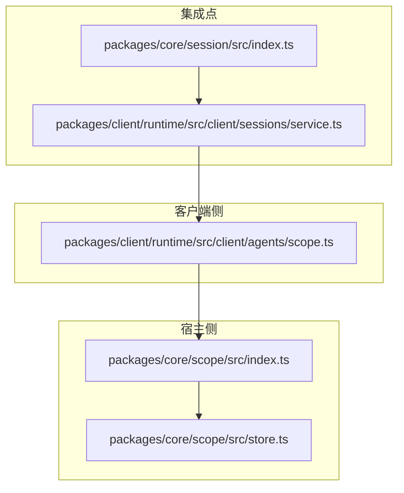
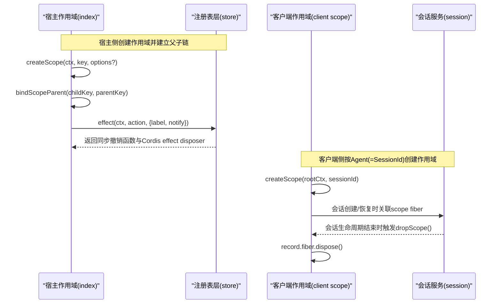
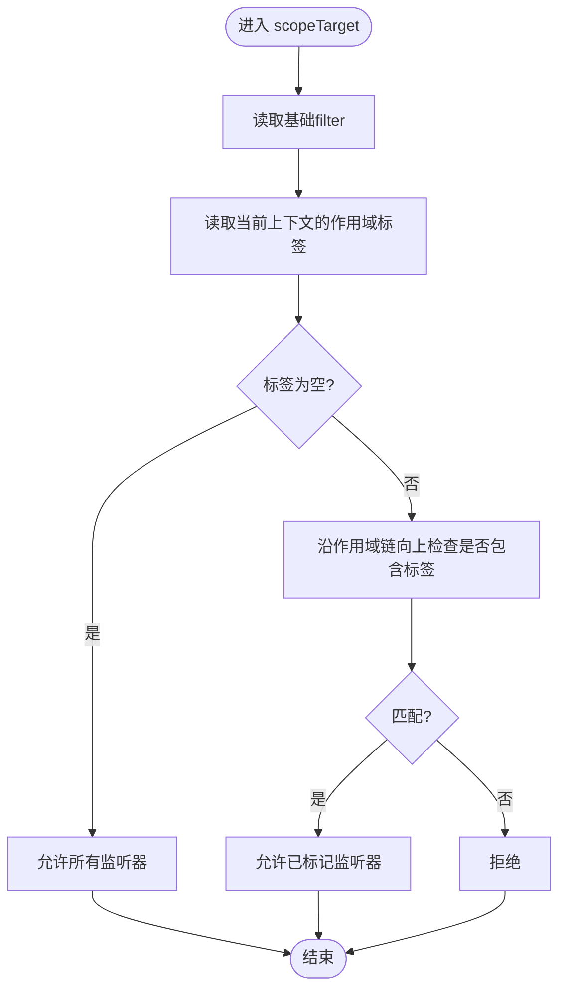
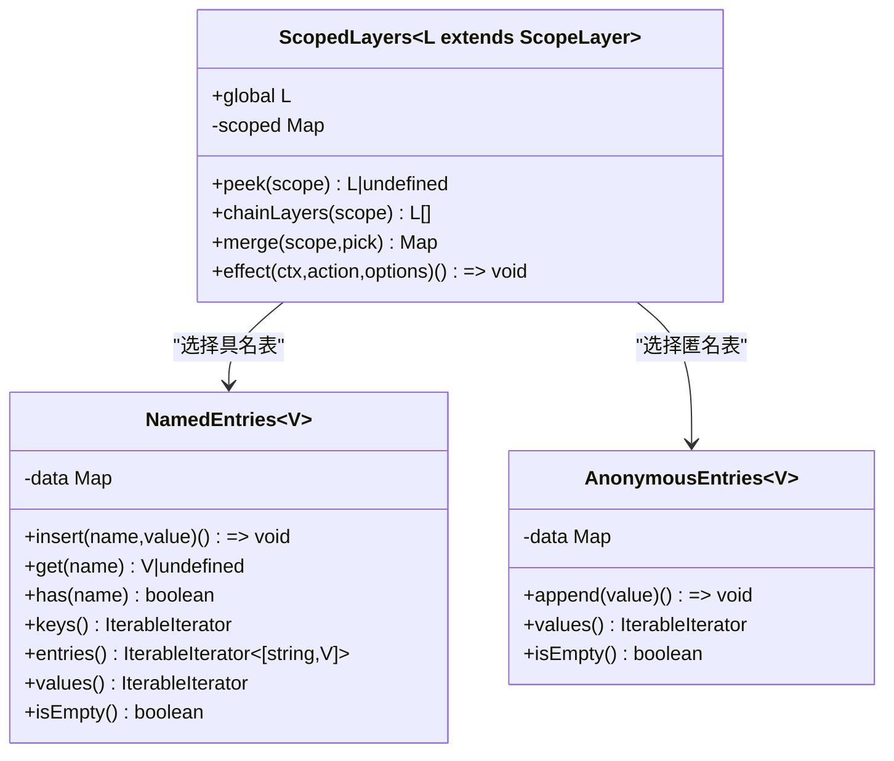
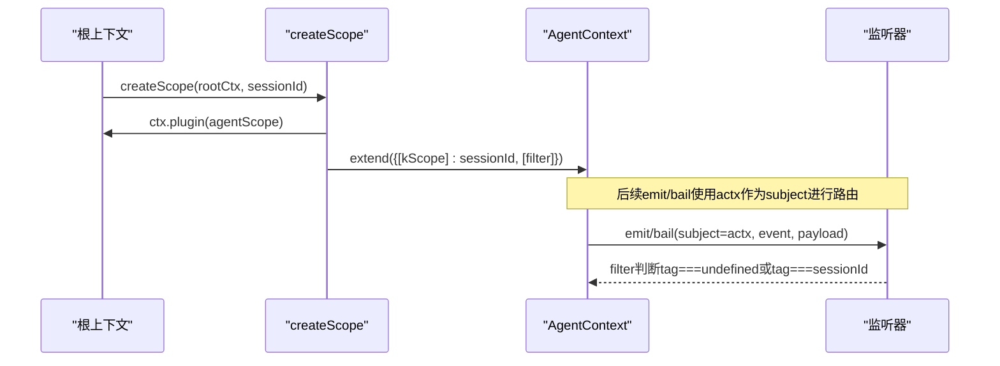
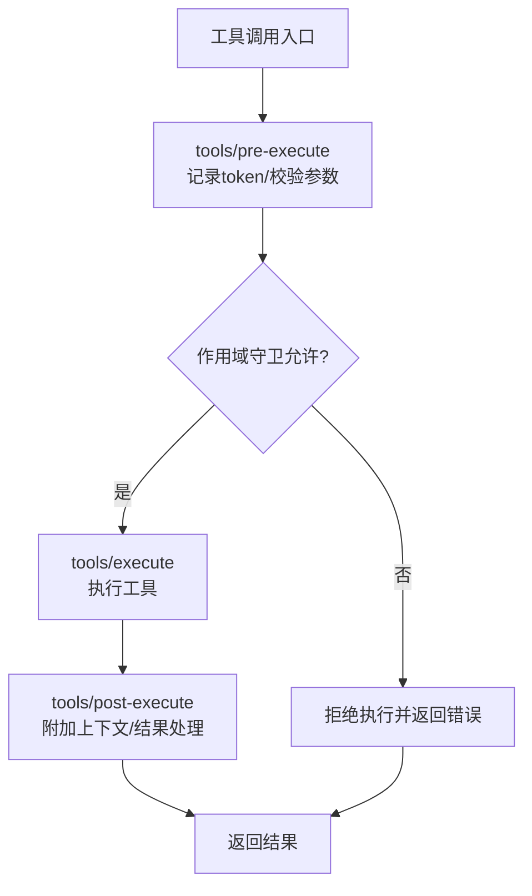

# 作用域管理系统

<cite>
**本文引用的文件**
- [packages/core/scope/src/index.ts](file://packages/core/scope/src/index.ts)
- [packages/core/scope/src/store.ts](file://packages/core/scope/src/store.ts)
- [docs/subsystems/scope.md](file://docs/subsystems/scope.md)
- [docs/subsystems/scope.zh.md](file://docs/subsystems/scope.zh.md)
- [packages/client/runtime/src/client/agents/scope.ts](file://packages/client/runtime/src/client/agents/scope.ts)
- [packages/core/session/src/index.ts](file://packages/core/session/src/index.ts)
- [packages/client/runtime/src/client/sessions/service.ts](file://packages/client/runtime/src/client/sessions/service.ts)
- [packages/test-support/client-runtime/src/sessions.ts](file://packages/test-support/client-runtime/src/sessions.ts)
- [packages/core/system-prompt/tests/scoped.spec.ts](file://packages/core/system-prompt/tests/scoped.spec.ts)
- [packages/core/tools/tests/scoped.spec.ts](file://packages/core/tools/tests/scoped.spec.ts)
- [packages/core/scope/tests/scope.spec.ts](file://packages/core/scope/tests/scope.spec.ts)
- [packages/client/runtime/tests/scope.client.spec.ts](file://packages/client/runtime/tests/scope.client.spec.ts)
</cite>

## 目录
1. [简介](#简介)
2. [项目结构](#项目结构)
3. [核心组件](#核心组件)
4. [架构总览](#架构总览)
5. [详细组件分析](#详细组件分析)
6. [依赖关系分析](#依赖关系分析)
7. [性能考虑](#性能考虑)
8. [故障排查指南](#故障排查指南)
9. [结论](#结论)
10. [附录：使用示例与最佳实践](#附录使用示例与最佳实践)

## 简介
本文件系统性地阐述“作用域管理系统”的设计原理与实现，覆盖作用域的创建、嵌套与销毁；作用域内的状态隔离与数据共享模式；事件系统的发布、订阅与过滤机制；以及与 Agent、会话和工具的集成方式。文档同时提供可视化图示、关键流程与时序图，并给出性能优化与内存泄漏防护策略，帮助读者在不同上下文中安全、高效地管理作用域、处理事件并构建模块化架构。

## 项目结构
作用域系统由核心库与客户端适配两部分组成：
- 核心作用域（Host）：提供不透明身份标识、上下文标签、作用域链、带作用域的注册表层与事件路由载体。
- 客户端作用域（Client）：以 Agent 身份为作用域键，将作用域语义映射到客户端的 Cordis 上下文，使事件分发无需额外包装即可按 Agent 隔离。



**图表来源**
- [packages/core/scope/src/index.ts:1-205](file://packages/core/scope/src/index.ts#L1-L205)
- [packages/core/scope/src/store.ts:1-268](file://packages/core/scope/src/store.ts#L1-L268)
- [packages/client/runtime/src/client/agents/scope.ts:1-78](file://packages/client/runtime/src/client/agents/scope.ts#L1-L78)
- [packages/core/session/src/index.ts:831-841](file://packages/core/session/src/index.ts#L831-L841)
- [packages/client/runtime/src/client/sessions/service.ts:736-766](file://packages/client/runtime/src/client/sessions/service.ts#L736-L766)

**章节来源**
- [docs/subsystems/scope.md:1-60](file://docs/subsystems/scope.md#L1-L60)
- [docs/subsystems/scope.zh.md:1-60](file://docs/subsystems/scope.zh.md#L1-L60)

## 核心组件
- 作用域键与作用域链：通过不透明对象作为作用域键，维护父子关系链，支持向上继承的事件准入与向下继承的注册可见性。
- 作用域上下文与生命周期：通过无操作插件 Fiber 承载作用域，所有在该上下文中的注册随 Fiber 自动清理。
- 带作用域的注册表层：全局层 + 精确作用域层的惰性合并，支持命名与匿名条目，保证撤销幂等与空层回收。
- 客户端 Agent 作用域：将 Agent ID（即 SessionId）作为作用域键，直接在 Context 上注入 filter，使普通 emit/bail 具备作用域路由能力。

**章节来源**
- [packages/core/scope/src/index.ts:14-112](file://packages/core/scope/src/index.ts#L14-L112)
- [packages/core/scope/src/store.ts:11-159](file://packages/core/scope/src/store.ts#L11-L159)
- [packages/client/runtime/src/client/agents/scope.ts:23-68](file://packages/client/runtime/src/client/agents/scope.ts#L23-L68)

## 架构总览
作用域系统围绕“上下文标签 + 事件过滤器 + 注册表层”三要素工作：
- 创建：在宿主或客户端创建作用域时，生成一个带标签的上下文，并将该上下文挂载到某个 Fiber 的生命周期中。
- 嵌套：通过父作用域键绑定子作用域键，形成作用域链；事件分发沿链向上匹配，注册可见性沿链向下叠加。
- 销毁：Fiber 析构时，所有在该作用域上下文注册的监听器与服务均被清理；注册表层在完全为空时释放对应层。



**图表来源**
- [packages/core/scope/src/index.ts:129-147](file://packages/core/scope/src/index.ts#L129-L147)
- [packages/core/scope/src/index.ts:72-82](file://packages/core/scope/src/index.ts#L72-L82)
- [packages/core/scope/src/store.ts:226-266](file://packages/core/scope/src/store.ts#L226-L266)
- [packages/client/runtime/src/client/agents/scope.ts:55-68](file://packages/client/runtime/src/client/agents/scope.ts#L55-L68)
- [packages/core/session/src/index.ts:831-841](file://packages/core/session/src/index.ts#L831-L841)
- [packages/client/runtime/src/client/sessions/service.ts:736-766](file://packages/client/runtime/src/client/sessions/service.ts#L736-L766)

## 详细组件分析

### 宿主侧作用域原语（index.ts）
- 作用域键与作用域链：
  - ScopeKey 为不透明对象，用于身份比较。
  - 通过 WeakMap 维护父子关系，支持 rebind 且禁止成环。
  - 提供 chainOf 工具获取从某 key 到根的路径。
- 作用域上下文与生命周期：
  - createScope 在无操作插件 Fiber 下扩展上下文，写入作用域标签。
  - rawDispose 暴露精确 disposer 以便有序复合 effect 嵌套；dispose 提供幂等的停稳边界。
- 事件路由载体：
  - scopeTarget 基于 base 的已有 filter 与当前上下文的作用域标签，实现“未标记监听器全局可达，已标记监听器仅对匹配键或其祖先可达”。
  - isScopeCarrier/carrierKeyOf 用于识别与读取载体键。



**图表来源**
- [packages/core/scope/src/index.ts:158-185](file://packages/core/scope/src/index.ts#L158-L185)

**章节来源**
- [packages/core/scope/src/index.ts:14-112](file://packages/core/scope/src/index.ts#L14-L112)
- [packages/core/scope/src/index.ts:158-205](file://packages/core/scope/src/index.ts#L158-L205)

### 注册表层与条目表（store.ts）
- NamedEntries：插入顺序的具名表，重复名称抛错，迭代器在表非空期间保持活跃，撤销幂等。
- AnonymousEntries：匿名表，每次 append 分配唯一符号键，确保相等值独立存在。
- ScopedLayers：
  - 拥有立即创建的全局层与惰性创建的精确作用域层。
  - peek 不创建层；chainLayers 沿作用域链收集已有层；merge 按插入顺序合并全局与链上层，近者优先。
  - effect 将同步变更绑定到 Cordis effect，并在析构时执行撤销与可选通知；当作用域层完全为空时回收。



**图表来源**
- [packages/core/scope/src/store.ts:30-150](file://packages/core/scope/src/store.ts#L30-L150)
- [packages/core/scope/src/store.ts:159-268](file://packages/core/scope/src/store.ts#L159-L268)

**章节来源**
- [packages/core/scope/src/store.ts:11-159](file://packages/core/scope/src/store.ts#L11-L159)
- [packages/core/scope/src/store.ts:159-268](file://packages/core/scope/src/store.ts#L159-L268)

### 客户端 Agent 作用域（client scope）
- 设计差异：
  - 作用域键为 SessionId（值比较），而非对象身份。
  - 作用域直接附着在 actx 的 filter 上，无需额外载体对象。
  - 作用域针对 Agent 身份而非活体 Agent 对象，便于冷会话历史浏览。
- 行为：
  - createScope 创建无操作插件 Fiber，扩展上下文并注入 filter：未标记监听器全局可达，已标记监听器仅对匹配的 Agent 可达。
  - scopeOf 读取最近的作用域标签。



**图表来源**
- [packages/client/runtime/src/client/agents/scope.ts:55-68](file://packages/client/runtime/src/client/agents/scope.ts#L55-L68)
- [packages/client/runtime/src/client/agents/scope.ts:70-78](file://packages/client/runtime/src/client/agents/scope.ts#L70-L78)

**章节来源**
- [packages/client/runtime/src/client/agents/scope.ts:1-78](file://packages/client/runtime/src/client/agents/scope.ts#L1-L78)

### 与会话的集成
- 会话创建：
  - 会话创建通过 effect 包裹，先 enter 再 announce；若 created 监听抛出，effect 会回滚，避免泄露。
- 会话销毁：
  - 客户端会话服务在不再 eligible 时调用 dropScope，依次 dispose scope fiber、解绑 session 作用域、清理 slots store 与 manager 引用。
- 测试支撑：
  - 测试运行时在 remove 时统一清理列表、scope fiber 与 per-session store。

```mermaid
sequenceDiagram
participant App as "应用"
participant Session as "SessionStore"
participant ClientSvc as "SessionsService"
participant Scope as "AgentScopeHandle"
App->>Session : sessions.create(id)
Session->>Session : effect(() => enter(session); announce(session))
Session-->>App : 返回session句柄
App->>ClientSvc : 会话切换/过期
ClientSvc->>ClientSvc : pruneScopes()
ClientSvc->>Scope : fiber.dispose()
ClientSvc->>Session : session.unbindScope()
ClientSvc->>ClientSvc : slots.pruneStoreScope(id), manager.drop(id)
```

**图表来源**
- [packages/core/session/src/index.ts:831-841](file://packages/core/session/src/index.ts#L831-L841)
- [packages/client/runtime/src/client/sessions/service.ts:736-766](file://packages/client/runtime/src/client/sessions/service.ts#L736-L766)
- [packages/test-support/client-runtime/src/sessions.ts:297-327](file://packages/test-support/client-runtime/src/sessions.ts#L297-L327)

**章节来源**
- [packages/core/session/src/index.ts:831-841](file://packages/core/session/src/index.ts#L831-L841)
- [packages/client/runtime/src/client/sessions/service.ts:736-766](file://packages/client/runtime/src/client/sessions/service.ts#L736-L766)
- [packages/test-support/client-runtime/src/sessions.ts:297-327](file://packages/test-support/client-runtime/src/sessions.ts#L297-L327)

### 与工具的集成
- 作用域内注册工具守卫、监听器与中间件，可限制特定工具的执行或附加上下文。
- 工具执行管道中，token 贯穿 pre-execute/execute/post-execute，便于跨阶段共享状态。
- 作用域内注册可遮蔽全局配置，如 system prompt 的 context 可在作用域内覆盖并随作用域销毁而恢复。



**图表来源**
- [packages/core/tools/tests/scoped.spec.ts:378-415](file://packages/core/tools/tests/scoped.spec.ts#L378-L415)
- [packages/core/system-prompt/tests/scoped.spec.ts:128-151](file://packages/core/system-prompt/tests/scoped.spec.ts#L128-L151)

**章节来源**
- [packages/core/tools/tests/scoped.spec.ts:378-415](file://packages/core/tools/tests/scoped.spec.ts#L378-L415)
- [packages/core/system-prompt/tests/scoped.spec.ts:128-151](file://packages/core/system-prompt/tests/scoped.spec.ts#L128-L151)

## 依赖关系分析
- 宿主作用域 index.ts 依赖 Cordis 的 Context/Fiber，并通过 Symbol 注入 filter。
- store.ts 依赖 index.ts 提供的作用域链工具，实现层合并与 effect 绑定。
- 客户端作用域依赖 Cordis 的 Context，并在 actx 上直接注入 filter，避免额外载体。
- 会话服务与客户端作用域协作，确保会话生命周期与作用域生命周期一致。


**图表来源**
- [packages/core/scope/src/index.ts:1-205](file://packages/core/scope/src/index.ts#L1-L205)
- [packages/core/scope/src/store.ts:1-268](file://packages/core/scope/src/store.ts#L1-L268)
- [packages/client/runtime/src/client/agents/scope.ts:1-78](file://packages/client/runtime/src/client/agents/scope.ts#L1-L78)
- [packages/core/session/src/index.ts:831-841](file://packages/core/session/src/index.ts#L831-L841)
- [packages/client/runtime/src/client/sessions/service.ts:736-766](file://packages/client/runtime/src/client/sessions/service.ts#L736-L766)

**章节来源**
- [packages/core/scope/src/index.ts:1-205](file://packages/core/scope/src/index.ts#L1-L205)
- [packages/core/scope/src/store.ts:1-268](file://packages/core/scope/src/store.ts#L1-L268)
- [packages/client/runtime/src/client/agents/scope.ts:1-78](file://packages/client/runtime/src/client/agents/scope.ts#L1-L78)
- [packages/core/session/src/index.ts:831-841](file://packages/core/session/src/index.ts#L831-L841)
- [packages/client/runtime/src/client/sessions/service.ts:736-766](file://packages/client/runtime/src/client/sessions/service.ts#L736-L766)

## 性能考虑
- 惰性层创建：ScopedLayers 仅在需要时创建精确作用域层，减少内存占用。
- 空层回收：当作用域层完全为空时及时删除，避免无用引用累积。
- 迭代器生命周期：NamedEntries/AnonymousEntries 在同一轮非空表生命周期内保持活跃，清空后断开后续插入，降低迭代成本。
- 事件过滤路径短：scopeTarget 的 filter 仅遍历作用域链至多一次，避免深层递归。
- 异步停稳：quiesceFiber 等待惯性任务完成，避免竞态导致的资源泄漏。

[本节为通用指导，不直接分析具体文件]

## 故障排查指南
- 作用域链成环：
  - 现象：绑定父作用域时报错。
  - 原因：linkScopeParent 检测到循环。
  - 处理：检查 rebind 调用，确保不会形成闭环。
- 重复注册：
  - 现象：NamedEntries.insert 抛出重复名称错误。
  - 处理：确保同一作用域内同名注册唯一，或使用匿名表。
- 事件未送达：
  - 现象：期望的监听器未收到事件。
  - 处理：确认作用域链是否正确；scopeTarget 的 filter 要求监听器的作用域键为派发键或其祖先。
- 会话销毁后仍持有引用：
  - 现象：会话结束后仍有回调触发。
  - 处理：确保通过 dropScope 正确 dispose fiber 并解绑 session 作用域。

**章节来源**
- [packages/core/scope/src/index.ts:54-82](file://packages/core/scope/src/index.ts#L54-L82)
- [packages/core/scope/src/store.ts:43-54](file://packages/core/scope/src/store.ts#L43-L54)
- [packages/client/runtime/src/client/sessions/service.ts:736-766](file://packages/client/runtime/src/client/sessions/service.ts#L736-L766)

## 结论
作用域管理系统通过“上下文标签 + 事件过滤器 + 注册表层”实现了清晰的隔离与共享模型：
- 创建：通过 createScope 生成带标签上下文并绑定到 Fiber 生命周期。
- 嵌套：通过 bindScopeParent 建立父子链，事件向上匹配，注册向下叠加。
- 销毁：Fiber 析构时自动清理所有作用域内注册，注册表层在空时回收。
- 集成：与 Agent、会话、工具紧密协作，确保生命周期一致性与模块化扩展能力。
- 性能与健壮性：惰性创建、空层回收、短路径过滤与异步停稳保障高吞吐与低泄漏风险。

[本节为总结，不直接分析具体文件]

## 附录：使用示例与最佳实践
- 在宿主侧创建作用域并注册服务：
  - 通过 createScope 在插件 Fiber 中创建作用域，使用 ctx.effect 绑定同步撤销与通知。
  - 参考路径：[packages/core/scope/src/index.ts:129-147](file://packages/core/scope/src/index.ts#L129-L147)、[packages/core/scope/src/store.ts:226-266](file://packages/core/scope/src/store.ts#L226-L266)
- 在客户端侧按 Agent 创建作用域：
  - 使用 createScope(ctx, sessionId) 获得 AgentContext，直接使用 emit/bail 进行作用域路由。
  - 参考路径：[packages/client/runtime/src/client/agents/scope.ts:55-68](file://packages/client/runtime/src/client/agents/scope.ts#L55-L68)
- 会话生命周期与作用域对齐：
  - 会话创建通过 effect 包裹，确保异常回滚；销毁时统一 dropScope。
  - 参考路径：[packages/core/session/src/index.ts:831-841](file://packages/core/session/src/index.ts#L831-L841)、[packages/client/runtime/src/client/sessions/service.ts:736-766](file://packages/client/runtime/src/client/sessions/service.ts#L736-L766)
- 工具与系统提示的作用域覆盖：
  - 在作用域内注册工具守卫或抑制系统提示上下文，随作用域销毁恢复全局状态。
  - 参考路径：[packages/core/tools/tests/scoped.spec.ts:378-415](file://packages/core/tools/tests/scoped.spec.ts#L378-L415)、[packages/core/system-prompt/tests/scoped.spec.ts:128-151](file://packages/core/system-prompt/tests/scoped.spec.ts#L128-L151)
- 验证作用域行为：
  - 使用测试用例验证作用域标签、事件路由与 Fiber 析构清理。
  - 参考路径：[packages/core/scope/tests/scope.spec.ts:24-39](file://packages/core/scope/tests/scope.spec.ts#L24-L39)、[packages/client/runtime/tests/scope.client.spec.ts:41-84](file://packages/client/runtime/tests/scope.client.spec.ts#L41-L84)

**章节来源**
- [packages/core/scope/src/index.ts:129-147](file://packages/core/scope/src/index.ts#L129-L147)
- [packages/core/scope/src/store.ts:226-266](file://packages/core/scope/src/store.ts#L226-L266)
- [packages/client/runtime/src/client/agents/scope.ts:55-68](file://packages/client/runtime/src/client/agents/scope.ts#L55-L68)
- [packages/core/session/src/index.ts:831-841](file://packages/core/session/src/index.ts#L831-L841)
- [packages/client/runtime/src/client/sessions/service.ts:736-766](file://packages/client/runtime/src/client/sessions/service.ts#L736-L766)
- [packages/core/tools/tests/scoped.spec.ts:378-415](file://packages/core/tools/tests/scoped.spec.ts#L378-L415)
- [packages/core/system-prompt/tests/scoped.spec.ts:128-151](file://packages/core/system-prompt/tests/scoped.spec.ts#L128-L151)
- [packages/core/scope/tests/scope.spec.ts:24-39](file://packages/core/scope/tests/scope.spec.ts#L24-L39)
- [packages/client/runtime/tests/scope.client.spec.ts:41-84](file://packages/client/runtime/tests/scope.client.spec.ts#L41-L84)