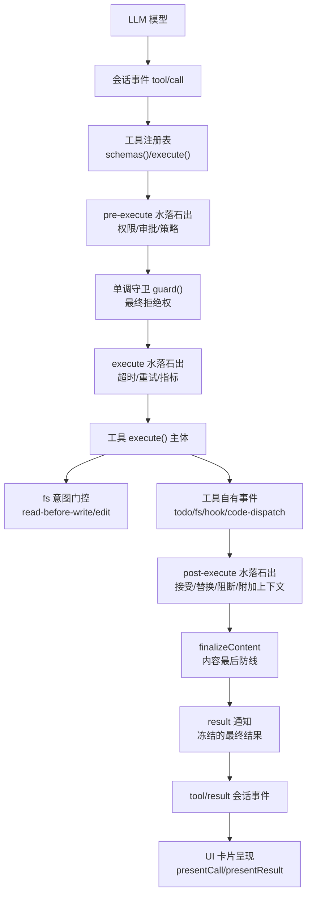
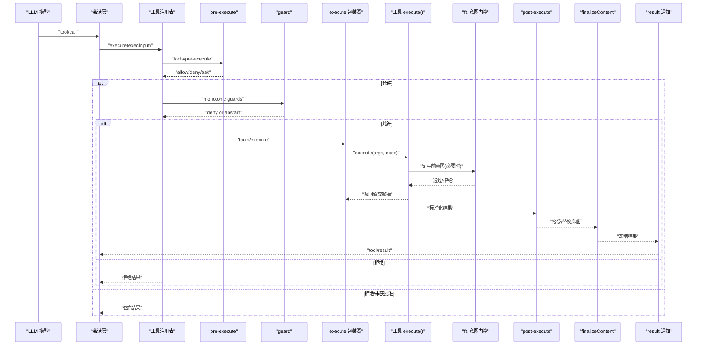
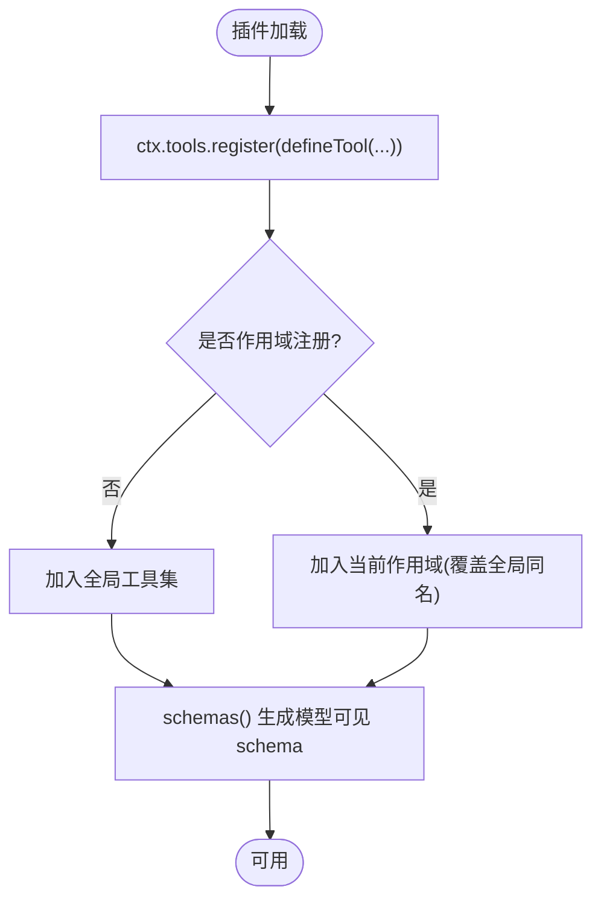
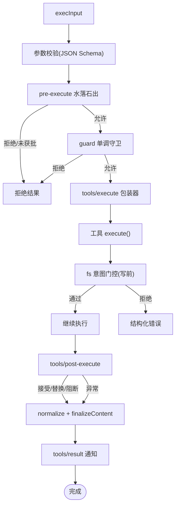
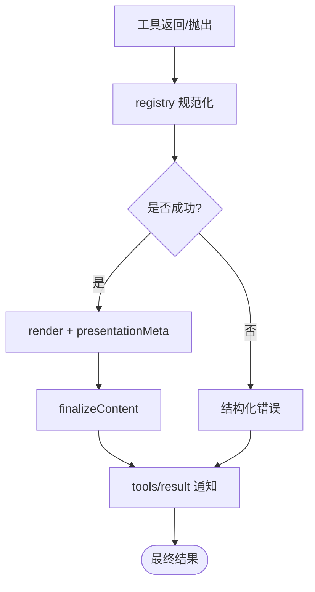
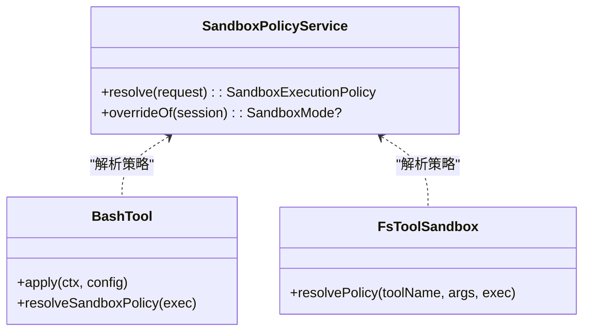
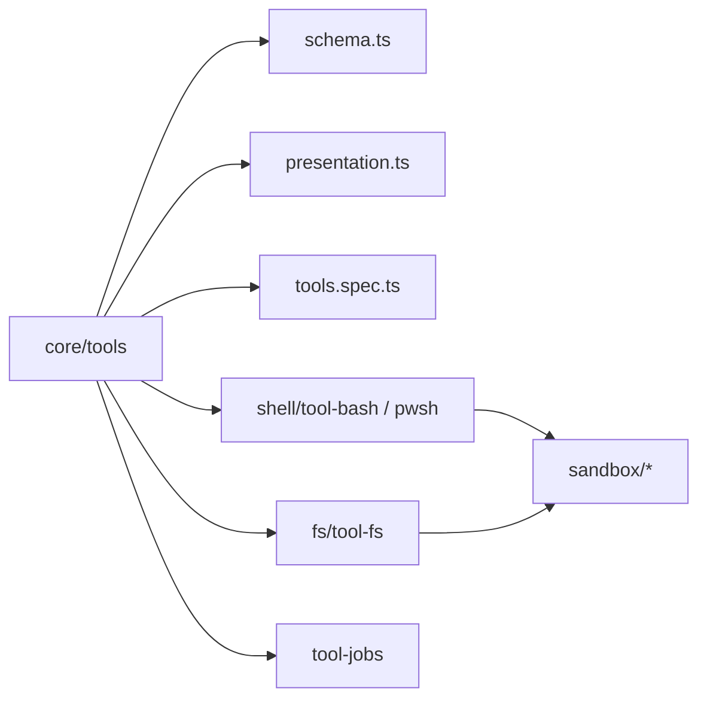

# 工具执行系统

<cite>
**本文引用的文件**
- [packages/core/tools/src/index.ts](file://packages/core/tools/src/index.ts)
- [packages/core/tools/src/schema.ts](file://packages/core/tools/src/schema.ts)
- [packages/core/tools/src/presentation.ts](file://packages/core/tools/src/presentation.ts)
- [packages/core/tools/tests/tools.spec.ts](file://packages/core/tools/tests/tools.spec.ts)
- [docs/subsystems/tools.md](file://docs/subsystems/tools.md)
- [docs/tool-execution-pipeline.md](file://docs/tool-execution-pipeline.md)
- [docs/tool-catalog.md](file://docs/tool-catalog.md)
- [docs/cookbook/adding-a-tool.md](file://docs/cookbook/adding-a-tool.md)
- [docs/subsystems/sandbox.md](file://docs/subsystems/sandbox.md)
- [packages/fs/tool-fs/src/sandbox.ts](file://packages/fs/tool-fs/src/sandbox.ts)
- [packages/shell/tool-bash/src/index.ts](file://packages/shell/tool-bash/src/index.ts)
- [packages/shell/bash-sandbox/src/index.ts](file://packages/shell/bash-sandbox/src/index.ts)
- [packages/shell/pwsh-sandbox/src/index.ts](file://packages/shell/pwsh-sandbox/src/index.ts)
- [packages/sandbox/sandbox/src/escalation.ts](file://packages/sandbox/sandbox/src/escalation.ts)
</cite>

## 目录
1. [简介](#简介)
2. [项目结构](#项目结构)
3. [核心组件](#核心组件)
4. [架构总览](#架构总览)
5. [详细组件分析](#详细组件分析)
6. [依赖关系分析](#依赖关系分析)
7. [性能考虑](#性能考虑)
8. [故障排查指南](#故障排查指南)
9. [结论](#结论)
10. [附录](#附录)

## 简介
本文件系统性地说明 DeepSeek Harness 的工具执行体系：工具的注册、发现与加载；动态插件能力与依赖管理；执行管道（参数校验、权限检查、沙箱隔离、执行监控）；工具调用协议与数据格式，以及与不同 LLM 模型的兼容方式；结果处理与错误恢复机制；并提供自定义工具开发示例、性能优化与安全注意事项。

## 项目结构
围绕“工具”的核心代码集中在 core/tools 包，配合文档与子系统实现：
- 工具定义与执行管线：packages/core/tools
- 工具清单与模型可见 schema：docs/tool-catalog.md
- 执行流程与扩展点：docs/tool-execution-pipeline.md、docs/subsystems/tools.md
- 沙箱与权限：docs/subsystems/sandbox.md、packages/sandbox/*、packages/shell/*、packages/fs/tool-fs/*
- 开发者指南：docs/cookbook/adding-a-tool.md

图表来源
- [docs/tool-execution-pipeline.md:8-60](file://docs/tool-execution-pipeline.md#L8-L60)
- [docs/subsystems/tools.md:170-404](file://docs/subsystems/tools.md#L170-L404)

章节来源
- [docs/tool-execution-pipeline.md:1-63](file://docs/tool-execution-pipeline.md#L1-L63)
- [docs/subsystems/tools.md:1-152](file://docs/subsystems/tools.md#L1-L152)

## 核心组件
- 工具定义与注册
  - ToolDefinition：包含模型可见的 schema、输出契约 output、execute 主体、可选 finalizeContent、timeoutMs、isConcurrencySafe、presentCall/presentResult。
  - defineTool：将用户声明的参数 schema 与输出 schema 编译为 JSON Schema，并在执行前对参数进行严格校验；返回只读定义供注册表使用。
  - 注册表 ctx.tools.register/get/schemas/restrict/guard/execute：提供全局或作用域内注册、可见性过滤、查询、执行入口。
- 执行管道
  - pre-execute：允许/拒绝/询问（审批），不可改写参数。
  - guard：单调守卫，仅能拒绝或放行，不能反转之前的拒绝。
  - execute：around-dispatch 包装器，可替换信号以施加超时/重试/指标等。
  - post-execute：接受、替换 content/value、阻断并转为错误、附加上下文。
  - finalizeContent：工具自有的内容最后防线，纯函数且必须不抛错。
  - result：同步通知冻结的最终结果。
- 沙箱与权限
  - SandboxPolicyService：按调用解析 mode/workspaceRoot/sessionId。
  - 工具层集成：bash/pwsh 通过 ctx.sandbox.confine 包裹进程；fs 工具在写操作前触发 read-before-edit/write 意图门控。
- UI 呈现
  - presentCall/presentResult：基于中性 card 标签的渲染意图，支持 generic/terminal/diff/search/read/web 等视图。

章节来源
- [docs/subsystems/tools.md:9-152](file://docs/subsystems/tools.md#L9-L152)
- [packages/core/tools/src/schema.ts:563-590](file://packages/core/tools/src/schema.ts#L563-L590)
- [docs/subsystems/sandbox.md:9-94](file://docs/subsystems/sandbox.md#L9-L94)
- [docs/cookbook/adding-a-tool.md:7-66](file://docs/cookbook/adding-a-tool.md#L7-L66)

## 架构总览
工具执行从“助手消息中的工具调用块”开始，进入会话事件 tool/call，随后依次经过 pre-execute、guard、execute、工具主体、fs 意图门控、post-execute、finalizeContent、result，最终产出 tool/result 并驱动 UI 呈现。

图表来源
- [docs/tool-execution-pipeline.md:8-60](file://docs/tool-execution-pipeline.md#L8-L60)
- [docs/subsystems/tools.md:170-404](file://docs/subsystems/tools.md#L170-L404)

## 详细组件分析

### 工具注册、发现与加载
- 注册与可见性
  - ctx.tools.register：注册全局或作用域内的工具；重复名称在同一层会失败；reserved 名称如 run_code 受保护。
  - ctx.tools.restrict：对全局工具集进行 allow/deny 过滤，作用域内注册不受影响。
  - ctx.tools.get/schemas：按作用域解析可见工具；schemas() 仅暴露模型可见字段（name/description/parameters）。
- 动态插件与生命周期
  - 工具注册是 effect-based：插件 fiber 销毁时自动注销工具，确保 HMR 安全。
  - 动态 Cordis 工具集可在运行期注册/更新/停止/删除插件，从而动态增减模型可见工具。
- 依赖管理
  - 工具通过 ctx.* 服务按需注入（如 fs、shell、jobs、sandboxPolicy），缺失依赖会在加载或执行时报错，便于显式装配。

图表来源
- [docs/subsystems/tools.md:478-574](file://docs/subsystems/tools.md#L478-L574)
- [docs/tool-catalog.md:16-41](file://docs/tool-catalog.md#L16-L41)

章节来源
- [docs/subsystems/tools.md:478-574](file://docs/subsystems/tools.md#L478-L574)
- [docs/tool-catalog.md:16-41](file://docs/tool-catalog.md#L16-L41)
- [packages/core/tools/tests/tools.spec.ts:1978-1990](file://packages/core/tools/tests/tools.spec.ts#L1978-L1990)

### 执行管道：参数验证、权限检查、沙箱隔离、执行监控
- 参数验证
  - defineTool 将参数 schema 编译为 JSON Schema，并在执行前校验；非法参数抛出结构化错误（INVALID_ARGS）。
- 权限检查
  - pre-execute：允许/拒绝/询问（审批）。缺少审批支持时 ask 降级为拒绝。
  - guard：单调守卫，只能拒绝或保持原决定，无法“撤销”之前的拒绝。
- 沙箱隔离
  - 沙箱模式：read-only / workspace-write / danger-full-access。
  - 每调用解析策略：SandboxPolicyService.resolve(session?, approvedMode?)。
  - bash/pwsh 通过 ctx.sandbox.confine 包裹进程 argv；fs 写操作前触发 read-before-edit/write 意图门控。
- 执行监控
  - tools/execute：around-dispatch，可叠加超时、重试、指标收集。
  - tools/post-execute：可替换 content/value、阻断并转为错误、附加上下文。
  - tools/result：观察冻结的最终结果。

图表来源
- [docs/subsystems/tools.md:170-404](file://docs/subsystems/tools.md#L170-L404)
- [docs/subsystems/sandbox.md:41-94](file://docs/subsystems/sandbox.md#L41-L94)

章节来源
- [docs/subsystems/tools.md:170-404](file://docs/subsystems/tools.md#L170-L404)
- [docs/subsystems/sandbox.md:41-94](file://docs/subsystems/sandbox.md#L41-L94)
- [packages/fs/tool-fs/src/sandbox.ts:75-108](file://packages/fs/tool-fs/src/sandbox.ts#L75-L108)
- [packages/shell/tool-bash/src/index.ts:190-200](file://packages/shell/tool-bash/src/index.ts#L190-L200)

### 工具调用协议与数据格式（与 LLM 兼容）
- 模型可见 schema
  - schemas() 仅暴露 name/description/parameters，不包含 execute/output 等内部字段，保证跨模型传输安全。
- 统一 JSON 值 schema DSL
  - ValueSchemaSpec 支持 string/number/integer/boolean/null/array/object/json/oneOf；object 节点需显式 additionalProperties。
- 输出契约
  - output.schema 约束成功返回值；output.render 将 value 投影为 ContentBlock[]；可选 presentationMeta 用于持久化 UI 元数据。
- 与 LLM 的兼容
  - 工具 schema 由系统提示组装后下发给模型；不同后端只需遵循同一套 JSON Schema 描述即可。
  - Code Mode 下，工具可通过运行时 SDK 被程序调用，仍走同一管道，但不会向模型暴露内部细节。

章节来源
- [docs/subsystems/tools.md:98-152](file://docs/subsystems/tools.md#L98-L152)
- [docs/tool-catalog.md:1-14](file://docs/tool-catalog.md#L1-L14)
- [docs/cookbook/adding-a-tool.md:7-66](file://docs/cookbook/adding-a-tool.md#L7-L66)

### 结果处理与错误恢复
- 结果形态
  - ToolExecutionSuccess：isError=false，携带 value/content/meta/additionalContexts/concludesTurn。
  - ToolExecutionFailure：isError=true，携带 error.message/info。
- 规范化与容错
  - 任何 throw、无效 value、渲染失败、presentationMeta 失败都会被捕获并归一化为 isError，同时保留 content 与 meta。
  - 未知工具映射到 UNKNOWN_TOOL；非 Error 抛出的对象/字符串也会被安全地转换为文本内容。
- 恢复策略
  - post-execute 可将纠正性反馈作为 block 返回，使上层视为错误；也可替换 content/value 以修正展示或程序语义。
  - 取消：ABORTED_BEFORE_DISPATCH（未启动）或 ABORTED（已启动后被取消）。

图表来源
- [docs/subsystems/tools.md:337-404](file://docs/subsystems/tools.md#L337-L404)
- [packages/core/tools/tests/tools.spec.ts:630-665](file://packages/core/tools/tests/tools.spec.ts#L630-L665)
- [packages/core/tools/tests/tools.spec.ts:2402-2450](file://packages/core/tools/tests/tools.spec.ts#L2402-L2450)

章节来源
- [docs/subsystems/tools.md:337-404](file://docs/subsystems/tools.md#L337-L404)
- [packages/core/tools/tests/tools.spec.ts:630-665](file://packages/core/tools/tests/tools.spec.ts#L630-L665)
- [packages/core/tools/tests/tools.spec.ts:2402-2450](file://packages/core/tools/tests/tools.spec.ts#L2402-L2450)

### 自定义工具开发示例
- 最小形状
  - 使用 defineTool 声明 name/description/parameters/output.execute/render。
  - 在 apply(ctx) 中通过 ctx.tools.register 注册，插件 fiber 销毁即自动注销。
- 执行契约要点
  - 参数已由 defineTool 校验；返回单一 canonical JSON 值；尊重 exec.signal；避免在 execute 中直接输出 ContentBlock。
  - 长任务通过 ctx.jobs.start 注册后台任务，前台工作耦合 exec.signal。
- UI 呈现
  - presentCall/presentResult 返回中性 card 视图；presentationMeta 用于持久化 UI 所需元数据。

章节来源
- [docs/cookbook/adding-a-tool.md:7-95](file://docs/cookbook/adding-a-tool.md#L7-L95)

### 沙箱与权限深化
- 沙箱模式与策略
  - read-only：仅允许必要写入（如 /dev/null）；workspace-write：允许在工作区与后端临时目录写入；danger-full-access：绕过限制。
  - 每调用策略：resolve(session?, approvedMode?) 返回 mode/workspaceRoot/sessionId。
- 进程级隔离
  - bash/pwsh 通过 ctx.sandbox.confine(argv, policy) 获取受限 argv 并 spawn；后端返回 enforcement 事实与诊断方言。
- 文件访问增强
  - fs 工具在执行写/编辑前触发 read-before-edit/write 意图门控，确保读取先于修改。
- 升级与提示
  - 当被拒绝时，可附带 escalationHintMarker 提示重试路径；sandboxDenialMarker 告知模型具体模式下的拒绝原因。

图表来源
- [docs/subsystems/sandbox.md:41-94](file://docs/subsystems/sandbox.md#L41-L94)
- [packages/shell/tool-bash/src/index.ts:190-200](file://packages/shell/tool-bash/src/index.ts#L190-L200)
- [packages/fs/tool-fs/src/sandbox.ts:75-108](file://packages/fs/tool-fs/src/sandbox.ts#L75-L108)

章节来源
- [docs/subsystems/sandbox.md:9-94](file://docs/subsystems/sandbox.md#L9-L94)
- [packages/shell/bash-sandbox/src/index.ts:51-86](file://packages/shell/bash-sandbox/src/index.ts#L51-L86)
- [packages/shell/pwsh-sandbox/src/index.ts:59-94](file://packages/shell/pwsh-sandbox/src/index.ts#L59-L94)
- [packages/sandbox/sandbox/src/escalation.ts:63-86](file://packages/sandbox/sandbox/src/escalation.ts#L63-L86)

## 依赖关系分析
- 工具注册表依赖
  - 参数与输出 schema 编译器（schema.ts）、呈现类型（presentation.ts）、测试用例（tools.spec.ts）。
- 工具与子系统
  - fs 工具依赖 fs 意图门控与附件存储；bash/pwsh 依赖 shell 执行器与 sandbox 提供者；jobs 工具依赖通用后台任务运行时。
- 外部依赖
  - 子进程（ripgrep）、终端 PTY、LLM 路由（web/lsp 等）均通过 ctx.* 抽象解耦。

图表来源
- [docs/tool-catalog.md:16-41](file://docs/tool-catalog.md#L16-L41)
- [docs/subsystems/tools.md:478-574](file://docs/subsystems/tools.md#L478-L574)

章节来源
- [docs/tool-catalog.md:16-41](file://docs/tool-catalog.md#L16-L41)
- [docs/subsystems/tools.md:478-574](file://docs/subsystems/tools.md#L478-L574)

## 性能考虑
- 并发与并行
  - isConcurrencySafe：标记可并行的工具，注册表据此形成滚动池并行执行；未知/非 true 默认串行。
- 超时与取消
  - timeoutMs：声明工具级超时预算，由 around-dispatch 包装器强制；exec.signal 贯穿全链路，工具需协作取消。
- 结果裁剪与溢出
  - 大输出通过 spillStore 保存定位器，inline 结果截断并报告 truncated/total，避免阻塞与内存压力。
- 冷启动与热插拔
  - 插件 fiber 生命周期管理支持 HMR 安全卸载与重挂载，减少重启成本。

章节来源
- [docs/subsystems/tools.md:53-74](file://docs/subsystems/tools.md#L53-L74)
- [docs/tool-catalog.md:26-28](file://docs/tool-catalog.md#L26-L28)
- [docs/cookbook/adding-a-tool.md:51-66](file://docs/cookbook/adding-a-tool.md#L51-L66)

## 故障排查指南
- 常见错误与定位
  - 未知工具：UNKNOWN_TOOL；参数非法：INVALID_ARGS；输出非法：INVALID_TOOL_OUTPUT；取消：ABORTED_BEFORE_DISPATCH/ABORTED。
  - 非 Error 抛出会被安全转换为文本内容，便于调试。
- 权限与沙箱
  - 若命令/文件操作被拒绝，查看 sandboxDenialMarker 与 escalationHintMarker，确认是否需要提升权限并附带 justification。
- 调试建议
  - 使用 tools/execute 包装器记录耗时/重试；tools/post-execute 替换 content 以便快速定位问题；tools/result 监听最终结果。
  - 对于 fs 写失败，优先确认 read-before-edit/write 是否满足；对于 bash/pwsh，检查 confinement 模式与后端 enforcement 事实。

章节来源
- [packages/core/tools/tests/tools.spec.ts:630-665](file://packages/core/tools/tests/tools.spec.ts#L630-L665)
- [packages/core/tools/tests/tools.spec.ts:2402-2450](file://packages/core/tools/tests/tools.spec.ts#L2402-L2450)
- [packages/sandbox/sandbox/src/escalation.ts:63-86](file://packages/sandbox/sandbox/src/escalation.ts#L63-L86)

## 结论
该工具执行系统通过严格的 schema 驱动、可扩展的水落石出水线、单调守卫与沙箱策略，实现了高内聚、低耦合、可观测且安全的工具生态。它既支持静态注册的内置工具，也支持动态插件与运行时能力扩展；既能面向 LLM 暴露稳定协议，又能通过 Code Mode 为程序提供强类型调用。结合超时、取消、结果规范化与 UI 呈现分离的设计，系统在可靠性、可维护性与用户体验之间取得了良好平衡。

## 附录
- 工具清单与模型可见 schema 参考：docs/tool-catalog.md
- 执行流水线与扩展点：docs/tool-execution-pipeline.md、docs/subsystems/tools.md
- 沙箱与权限：docs/subsystems/sandbox.md
- 自定义工具开发：docs/cookbook/adding-a-tool.md