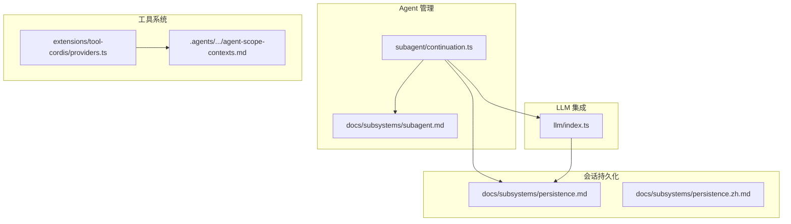
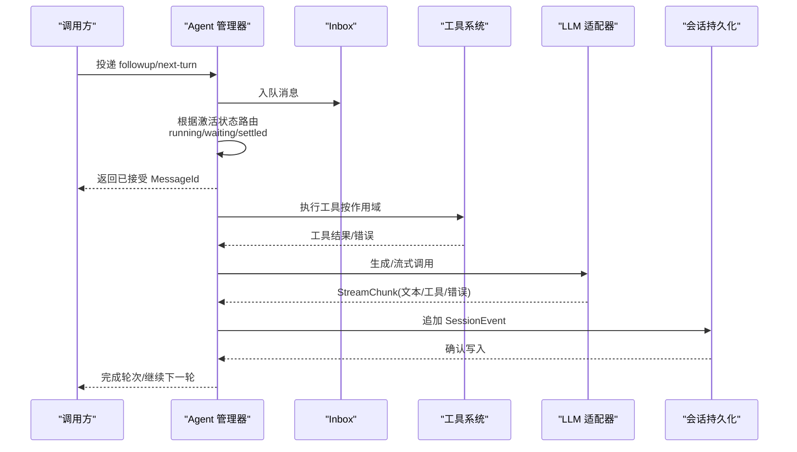
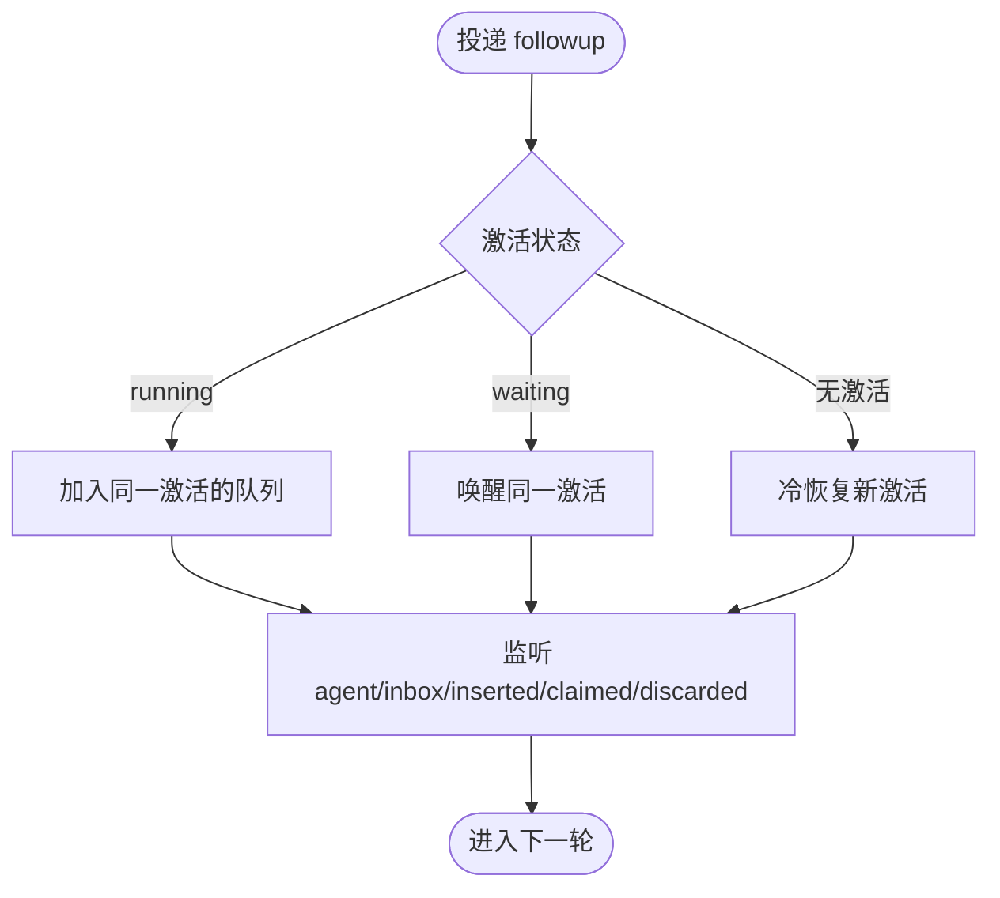
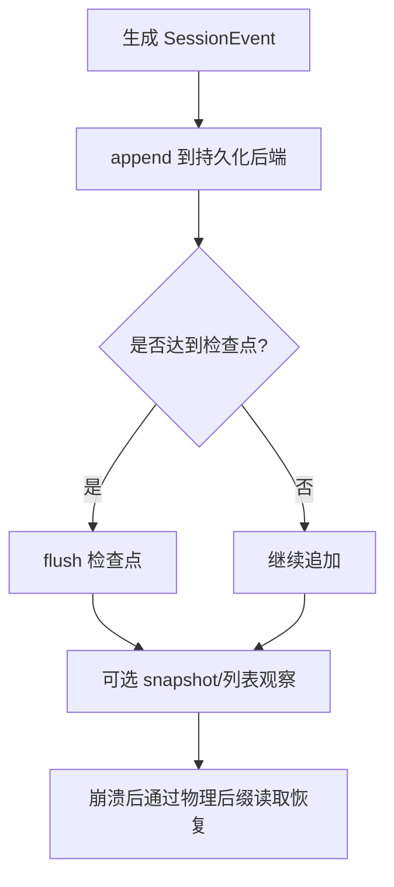
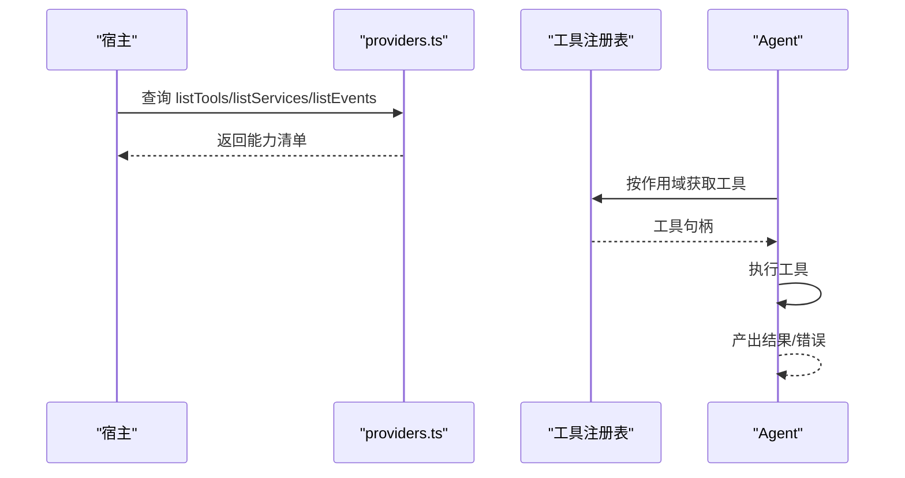
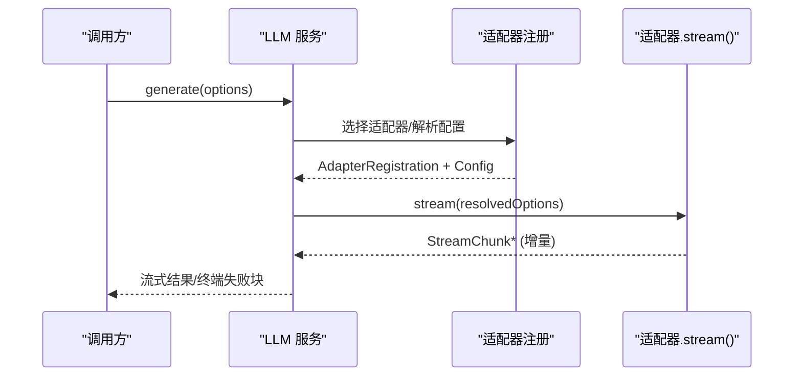
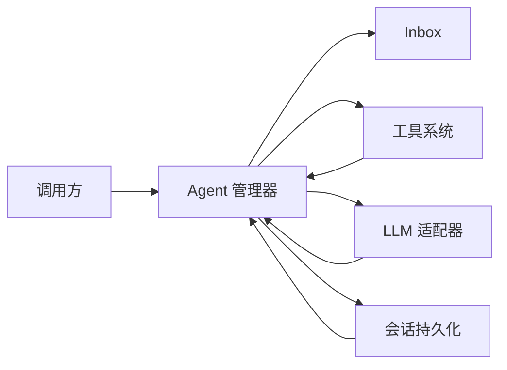
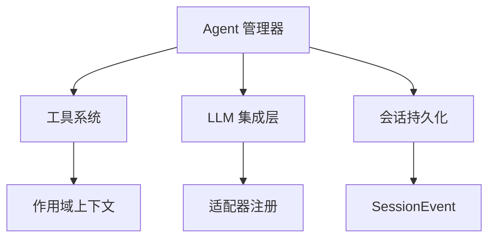

# 核心系统

<cite>
**本文引用的文件**
- [packages/subagent/subagent/src/continuation.ts](file://packages/subagent/subagent/src/continuation.ts)
- [docs/subsystems/subagent.md](file://docs/subsystems/subagent.md)
- [docs/subsystems/persistence.md](file://docs/subsystems/persistence.md)
- [docs/subsystems/persistence.zh.md](file://docs/subsystems/persistence.zh.md)
- [packages/llm/llm/src/index.ts](file://packages/llm/llm/src/index.ts)
- [packages/extensions/tool-cordis/src/providers.ts](file://packages/extensions/tool-cordis/src/providers.ts)
- [.agents/notes/implemented/architecture/2026-07-08-agent-scope-contexts.md](file://.agents/notes/implemented/architecture/2026-07-08-agent-scope-contexts.md)
- [.agents/notes/implemented/simplification/2026-07-24-agent-loop-observable-state-machine.zh.md](file://.agents/notes/implemented/simplification/2026-07-24-agent-loop-observable-state-machine.zh.md)
</cite>

## 目录
1. [简介](#简介)
2. [项目结构](#项目结构)
3. [核心组件](#核心组件)
4. [架构总览](#架构总览)
5. [详细组件分析](#详细组件分析)
6. [依赖关系分析](#依赖关系分析)
7. [性能考虑](#性能考虑)
8. [故障排查指南](#故障排查指南)
9. [结论](#结论)
10. [附录](#附录)

## 简介
本文件面向 DeepSeek Harness 的核心系统，聚焦以下能力：
- Agent 管理系统：生命周期、状态机与消息处理（入队、认领、丢弃、唤醒）。
- 会话管理子系统：事件日志的持久化、崩溃恢复与元数据头。
- 工具执行系统：工具注册、发现与执行流程。
- LLM 集成层：模型适配器选择、配置解析与流式响应处理。
- 子系统交互与数据流转：从用户输入到工具调用、LLM 调用、事件落盘与状态更新的完整链路。

## 项目结构
DeepSeek Harness 采用多包模块化设计，核心能力分布在 packages 与 docs 中：
- packages/subagent：子代理管理与延续性对话（injection/inbox/activation）。
- packages/session/session-persistence：会话持久化 seam 与后端实现。
- packages/llm：LLM 适配器抽象、流式迭代与错误封装。
- packages/extensions/tool-cordis：宿主侧工具与服务发现提供者。
- docs/subsystems：子系统文档，定义契约与行为语义。

图表来源
- [packages/subagent/subagent/src/continuation.ts:861-1054](file://packages/subagent/subagent/src/continuation.ts#L861-L1054)
- [docs/subsystems/subagent.md:136-142](file://docs/subsystems/subagent.md#L136-L142)
- [docs/subsystems/persistence.md:1-7](file://docs/subsystems/persistence.md#L1-L7)
- [packages/llm/llm/src/index.ts:838-870](file://packages/llm/llm/src/index.ts#L838-L870)
- [packages/extensions/tool-cordis/src/providers.ts:21-53](file://packages/extensions/tool-cordis/src/providers.ts#L21-L53)
- [.agents/notes/implemented/architecture/2026-07-08-agent-scope-contexts.md:61-97](file://.agents/notes/implemented/architecture/2026-07-08-agent-scope-contexts.md#L61-L97)

章节来源
- [packages/subagent/subagent/src/continuation.ts:861-1054](file://packages/subagent/subagent/src/continuation.ts#L861-L1054)
- [docs/subsystems/subagent.md:136-142](file://docs/subsystems/subagent.md#L136-L142)
- [docs/subsystems/persistence.md:1-7](file://docs/subsystems/persistence.md#L1-L7)
- [packages/llm/llm/src/index.ts:838-870](file://packages/llm/llm/src/index.ts#L838-L870)
- [packages/extensions/tool-cordis/src/providers.ts:21-53](file://packages/extensions/tool-cordis/src/providers.ts#L21-L53)
- [.agents/notes/implemented/architecture/2026-07-08-agent-scope-contexts.md:61-97](file://.agents/notes/implemented/architecture/2026-07-08-agent-scope-contexts.md#L61-L97)

## 核心组件
- Agent 管理器：维护激活态（running/waiting/settled）、inbox 队列、父子激活所有权与冷恢复策略。
- 会话持久化：以 SessionEvent 为真源，提供 locate/create/append、逻辑 load/inspect、物理后缀读取与快照观察。
- 工具系统：在宿主侧通过 providers 暴露 listTools/listServices/listEvents/builtins，支持作用域内注册与查询。
- LLM 集成层：统一适配器边界，负责选择适配器、解析配置、构造流式迭代器并封装失败为 chunk。

章节来源
- [docs/subsystems/subagent.md:136-142](file://docs/subsystems/subagent.md#L136-L142)
- [docs/subsystems/persistence.md:1-7](file://docs/subsystems/persistence.md#L1-L7)
- [packages/extensions/tool-cordis/src/providers.ts:21-53](file://packages/extensions/tool-cordis/src/providers.ts#L21-L53)
- [packages/llm/llm/src/index.ts:838-870](file://packages/llm/llm/src/index.ts#L838-L870)

## 架构总览
下图展示“用户请求 → Agent 循环 → 工具调用 → LLM 调用 → 事件落盘”的主路径，以及关键状态与事件。

图表来源
- [packages/subagent/subagent/src/continuation.ts:861-1054](file://packages/subagent/subagent/src/continuation.ts#L861-L1054)
- [docs/subsystems/subagent.md:136-142](file://docs/subsystems/subagent.md#L136-L142)
- [packages/llm/llm/src/index.ts:838-870](file://packages/llm/llm/src/index.ts#L838-L870)
- [docs/subsystems/persistence.md:1-7](file://docs/subsystems/persistence.md#L1-L7)

## 详细组件分析

### Agent 管理系统：生命周期、状态控制与消息处理
- 生命周期与状态
  - running：存在活跃准入或轮次，或 inbox 中有待唤醒的工作。
  - waiting：完全停稳但持有尚未完成 dispose 的子激活。
  - settled：完全停稳且所有子激活已 dispose；随后管理器释放 AgentHandle 并移除激活。
- 消息处理
  - 唯一队列是 Agent inbox；每条 continue 使用 followup 成为 FIFO 轮次。
  - 投递后发出 agent/inbox/inserted，随后要么领取时发出 agent/inbox/claimed，要么普通删除时发出 agent/inbox/discarded。
  - 投递与最终 dispose 竞争时，仅一方越过准入截止点：进入仍在线的 inbox 或等待 dispose 后冷恢复新激活。
- 作用域与上下文
  - 工具与服务在 agent setup 中注册，属于该 agent 的作用域；操作级查找绑定具体 agent，避免全局污染。

图表来源
- [packages/subagent/subagent/src/continuation.ts:861-1054](file://packages/subagent/subagent/src/continuation.ts#L861-L1054)
- [docs/subsystems/subagent.md:136-142](file://docs/subsystems/subagent.md#L136-L142)
- [.agents/notes/implemented/simplification/2026-07-24-agent-loop-observable-state-machine.zh.md:15-24](file://.agents/notes/implemented/simplification/2026-07-24-agent-loop-observable-state-machine.zh.md#L15-L24)

章节来源
- [packages/subagent/subagent/src/continuation.ts:861-1054](file://packages/subagent/subagent/src/continuation.ts#L861-L1054)
- [docs/subsystems/subagent.md:136-142](file://docs/subsystems/subagent.md#L136-L142)
- [.agents/notes/implemented/simplification/2026-07-24-agent-loop-observable-state-machine.zh.md:15-24](file://.agents/notes/implemented/simplification/2026-07-24-agent-loop-observable-state-machine.zh.md#L15-L24)
- [.agents/notes/implemented/architecture/2026-07-08-agent-scope-contexts.md:61-97](file://.agents/notes/implemented/architecture/2026-07-08-agent-scope-contexts.md#L61-L97)

### 会话管理子系统：持久化、事件日志与恢复
- 真源为内存中的 Session 与仅追加的 SessionEvent 日志。
- 持久化 seam 提供 locate/create/append、可复用的 Session 准备流程、逻辑 load/inspect、物理后缀读取与轻量 list/snapshot 观察。
- 不引入并行持久化事件类型，直接复用 SessionEvent；附带元数据头随日志一起存储。
- 崩溃恢复基于物理后缀读取与检查点机制。

图表来源
- [docs/subsystems/persistence.md:1-7](file://docs/subsystems/persistence.md#L1-L7)
- [docs/subsystems/persistence.zh.md:1-7](file://docs/subsystems/persistence.zh.md#L1-L7)

章节来源
- [docs/subsystems/persistence.md:1-7](file://docs/subsystems/persistence.md#L1-L7)
- [docs/subsystems/persistence.zh.md:1-7](file://docs/subsystems/persistence.zh.md#L1-L7)

### 工具执行系统：注册、发现与执行
- 宿主侧通过 providers 暴露 listTools/listServices/listEvents/builtins，用于动态发现可用能力。
- 工具在服务端按 agent 作用域注册，调用时由 agent.ctx 决定归属与作用域视图。
- 工具执行结果回传给 Agent 循环，驱动后续决策或继续调用。

图表来源
- [packages/extensions/tool-cordis/src/providers.ts:21-53](file://packages/extensions/tool-cordis/src/providers.ts#L21-L53)
- [.agents/notes/implemented/architecture/2026-07-08-agent-scope-contexts.md:61-97](file://.agents/notes/implemented/architecture/2026-07-08-agent-scope-contexts.md#L61-L97)

章节来源
- [packages/extensions/tool-cordis/src/providers.ts:21-53](file://packages/extensions/tool-cordis/src/providers.ts#L21-L53)
- [.agents/notes/implemented/architecture/2026-07-08-agent-scope-contexts.md:61-97](file://.agents/notes/implemented/architecture/2026-07-08-agent-scope-contexts.md#L61-L97)

### LLM 集成层：适配器架构与流式响应
- 统一适配器边界：选择适配器、解析配置、构造异步迭代器。
- 流式输出：adapter.stream 返回 AsyncIterator<StreamChunk>，消费方可增量处理。
- 错误处理：适配器选择/构造失败被封装为 adapterFailureChunk，下游消费者错误保持抛出。

图表来源
- [packages/llm/llm/src/index.ts:838-870](file://packages/llm/llm/src/index.ts#L838-L870)

章节来源
- [packages/llm/llm/src/index.ts:838-870](file://packages/llm/llm/src/index.ts#L838-L870)

### 各子系统交互与数据流转
- 入口：调用方投递 followup/next-turn 给 Agent 管理器。
- 路由：依据激活状态将消息入队、唤醒或冷恢复。
- 执行：Agent 循环根据 pre-step/request 等阶段驱动工具调用与 LLM 调用。
- 持久化：每步产生的 SessionEvent 经持久化 seam 落盘，支持恢复。
- 反馈：工具与 LLM 的结果/错误回流至 Agent 循环，更新状态并可能触发下一轮。

图表来源
- [packages/subagent/subagent/src/continuation.ts:861-1054](file://packages/subagent/subagent/src/continuation.ts#L861-L1054)
- [docs/subsystems/subagent.md:136-142](file://docs/subsystems/subagent.md#L136-L142)
- [packages/llm/llm/src/index.ts:838-870](file://packages/llm/llm/src/index.ts#L838-L870)
- [docs/subsystems/persistence.md:1-7](file://docs/subsystems/persistence.md#L1-L7)

## 依赖关系分析
- Agent 管理器依赖：
  - 工具系统：按 agent 作用域查询与执行工具。
  - LLM 集成层：发起模型调用并消费流式响应。
  - 会话持久化：将事件追加到日志并支持恢复。
- 工具系统依赖：
  - 宿主 providers：暴露能力清单，供 Agent 发现。
  - 作用域上下文：确保注册与查询绑定到具体 agent。
- LLM 集成层依赖：
  - 适配器注册：选择具体模型实现。
  - 配置解析：合并 options 与 resolvedConfig。
- 持久化依赖：
  - SessionEvent：作为唯一事件词汇，贯穿内存与磁盘。

图表来源
- [packages/subagent/subagent/src/continuation.ts:861-1054](file://packages/subagent/subagent/src/continuation.ts#L861-L1054)
- [packages/extensions/tool-cordis/src/providers.ts:21-53](file://packages/extensions/tool-cordis/src/providers.ts#L21-L53)
- [packages/llm/llm/src/index.ts:838-870](file://packages/llm/llm/src/index.ts#L838-L870)
- [docs/subsystems/persistence.md:1-7](file://docs/subsystems/persistence.md#L1-L7)
- [.agents/notes/implemented/architecture/2026-07-08-agent-scope-contexts.md:61-97](file://.agents/notes/implemented/architecture/2026-07-08-agent-scope-contexts.md#L61-L97)

章节来源
- [packages/subagent/subagent/src/continuation.ts:861-1054](file://packages/subagent/subagent/src/continuation.ts#L861-L1054)
- [packages/extensions/tool-cordis/src/providers.ts:21-53](file://packages/extensions/tool-cordis/src/providers.ts#L21-L53)
- [packages/llm/llm/src/index.ts:838-870](file://packages/llm/llm/src/index.ts#L838-L870)
- [docs/subsystems/persistence.md:1-7](file://docs/subsystems/persistence.md#L1-L7)
- [.agents/notes/implemented/architecture/2026-07-08-agent-scope-contexts.md:61-97](file://.agents/notes/implemented/architecture/2026-07-08-agent-scope-contexts.md#L61-L97)

## 性能考虑
- Inbox 唯一队列与 FIFO 顺序保证可观测性与公平性，避免多队列带来的竞态与延迟。
- 流式 LLM 响应降低首字节延迟，提升交互体验；适配器失败封装为 chunk 便于上层容错。
- 持久化采用仅追加日志与检查点，减少写放大并支持快速恢复。
- 作用域内工具注册避免全局冲突，提高并发下的隔离性与吞吐。

[本节为通用指导，不直接分析具体文件]

## 故障排查指南
- 消息未到达或丢失
  - 检查 agent/inbox/inserted/claimed/discarded 事件序列，确认入队与领取/丢弃路径。
  - 确认投递发生在 handle 未被 dispose 之前；若发生竞争，遵循“仅一方越过准入截止点”的规则。
- 工具调用失败
  - 核对工具是否在目标 agent 作用域内注册；通过宿主 providers 的 listTools 验证可见性。
  - 捕获工具执行异常并记录上下文，必要时回退或重试。
- LLM 调用异常
  - 适配器选择或配置解析失败会被封装为终端失败 chunk；检查 provider 与 resolvedConfig 一致性。
  - 下游消费者抛出的插件/消费者错误保持抛出，需在上层捕获。
- 持久化与恢复
  - 确认 append 成功与检查点 flush；崩溃后通过物理后缀读取恢复。
  - 校验 SessionEvent 词汇与元数据头完整性。

章节来源
- [packages/subagent/subagent/src/continuation.ts:861-1054](file://packages/subagent/subagent/src/continuation.ts#L861-L1054)
- [docs/subsystems/subagent.md:136-142](file://docs/subsystems/subagent.md#L136-L142)
- [packages/llm/llm/src/index.ts:838-870](file://packages/llm/llm/src/index.ts#L838-L870)
- [docs/subsystems/persistence.md:1-7](file://docs/subsystems/persistence.md#L1-L7)

## 结论
DeepSeek Harness 的核心系统围绕“Agent 管理—工具执行—LLM 集成—会话持久化”形成闭环：
- Agent 管理器提供稳定的生命周期与消息路由，确保可预测的执行顺序与恢复能力。
- 工具系统在作用域内安全注册与发现，支撑灵活的能力扩展。
- LLM 集成层以适配器抽象与流式接口屏蔽底层差异，提升可扩展性与用户体验。
- 会话持久化以 SessionEvent 为真源，保障一致性与可恢复性。
通过上述协作，系统能够在复杂场景下提供高可靠、高性能与易扩展的 Agent 运行时。

[本节为总结性内容，不直接分析具体文件]

## 附录
- 使用模式参考
  - 在 agent setup 中注册工具与服务，并通过 agent.ctx 进行作用域内查询与调用。
  - 使用 followup 投递继续执行消息，利用事件观察 inbox 生命周期。
  - 通过 LLM 服务的流式接口消费增量响应，并在失败时处理终端失败块。
  - 借助持久化 seam 的 append/locate/load 接口实现事件落盘与恢复。

[本节为概念性说明，不直接分析具体文件]