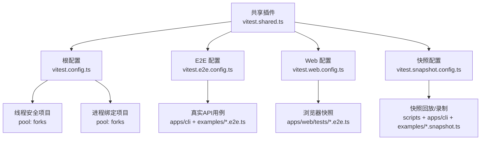
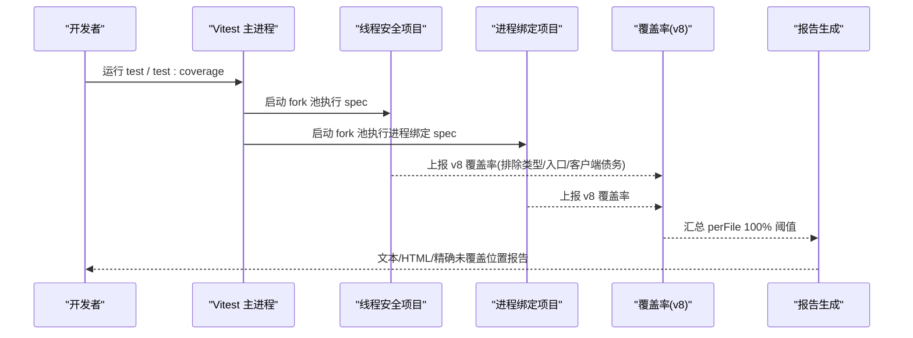
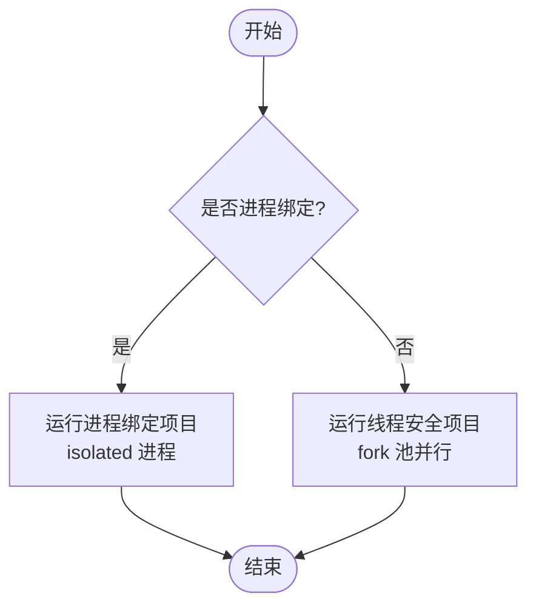
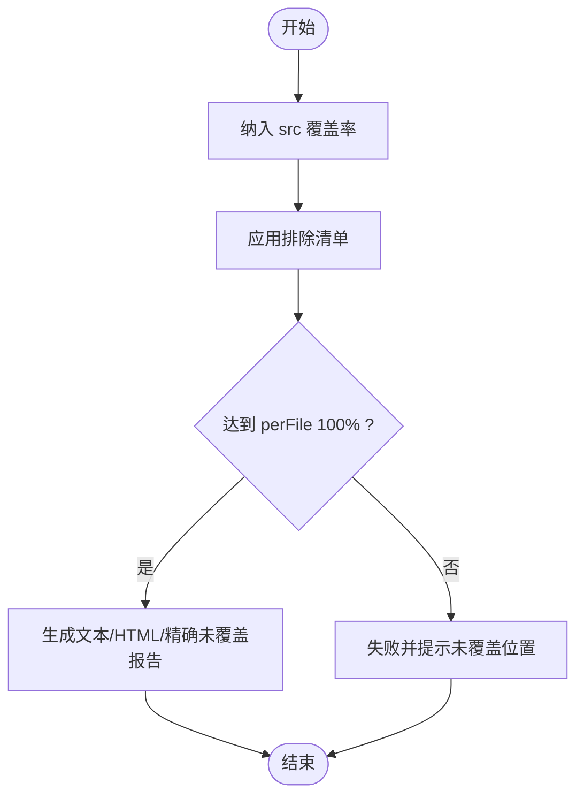
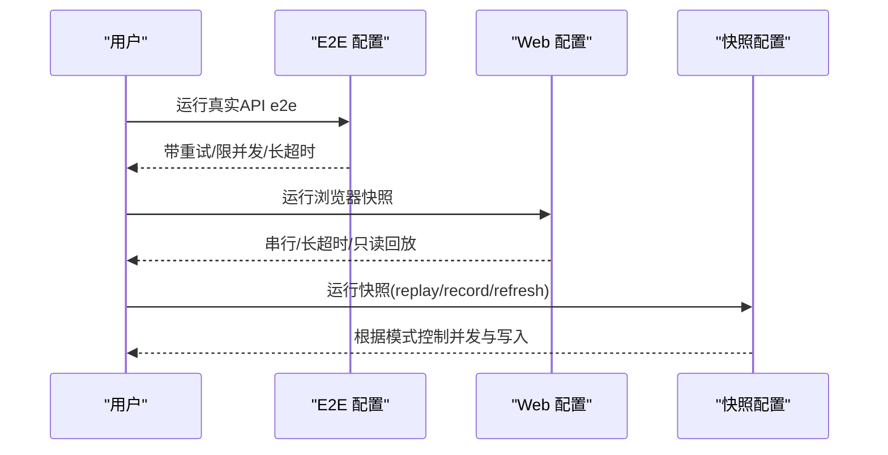
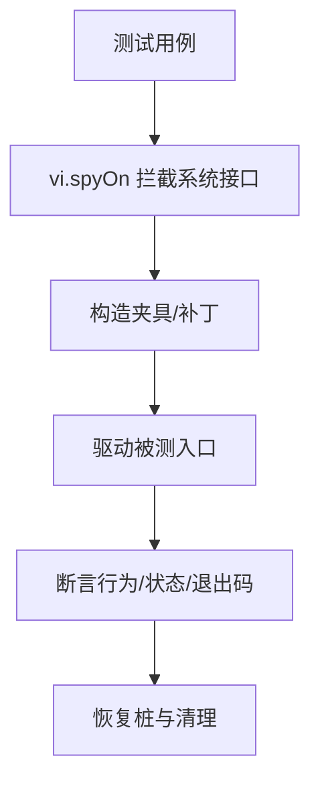
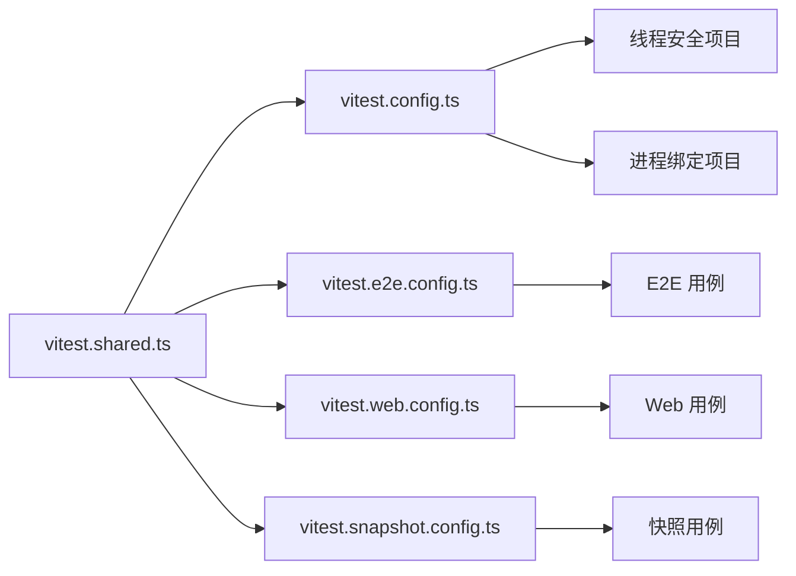

# 单元测试

<cite>
**本文引用的文件**
- [vitest.config.ts](file://vitest.config.ts)
- [vitest.shared.ts](file://vitest.shared.ts)
- [vitest.e2e.config.ts](file://vitest.e2e.config.ts)
- [vitest.web.config.ts](file://vitest.web.config.ts)
- [vitest.snapshot.config.ts](file://vitest.snapshot.config.ts)
- [testing.md](file://docs/testing.md)
- [args.spec.ts](file://apps/cli/tests/args.spec.ts)
- [test-invariants.spec.ts](file://scripts/test-invariants.spec.ts)
- [coverage-exempt.spec.ts](file://scripts/coverage-exempt.spec.ts)
- [harness.ts](file://examples/headless-agent/tests/harness.ts)
</cite>

## 目录
1. [简介](#简介)
2. [项目结构](#项目结构)
3. [核心组件](#核心组件)
4. [架构总览](#架构总览)
5. [详细组件分析](#详细组件分析)
6. [依赖关系分析](#依赖关系分析)
7. [性能考量](#性能考量)
8. [故障排查指南](#故障排查指南)
9. [结论](#结论)
10. [附录](#附录)

## 简介
本文件面向 DeepSeek Harness 的单元测试实践，聚焦 Vitest 测试框架的配置与使用、测试组织与命名规范、线程安全与进程绑定测试的区别、覆盖率要求与质量门禁、以及高质量单测的编写最佳实践（含模拟对象、桩函数、测试夹具）。文档同时给出可操作的流程图与时序图，帮助开发者快速理解并落地。

## 项目结构
仓库采用多配置分层的 Vitest 工程：
- 单元与脚本规格：由根 vitest.config.ts 统一收集 packages、apps、examples、scripts 下的 .spec.{ts,tsx}
- E2E 真实 API：独立 vitest.e2e.config.ts，启用重试、较长超时、受限并发
- Web 浏览器快照：独立 vitest.web.config.ts，串行执行、长超时
- 快照回放/录制：独立 vitest.snapshot.config.ts，支持 replay/record/refresh 模式与并发控制
- 共享能力：vitest.shared.ts 提供装饰器预处理与 execArgv 注入，保证 jsdom 与 Node 存储隔离

**图表来源**
- [vitest.config.ts:117-159](file://vitest.config.ts#L117-L159)
- [vitest.e2e.config.ts:31-57](file://vitest.e2e.config.ts#L31-L57)
- [vitest.web.config.ts:16-35](file://vitest.web.config.ts#L16-L35)
- [vitest.snapshot.config.ts:39-67](file://vitest.snapshot.config.ts#L39-L67)
- [vitest.shared.ts:15-42](file://vitest.shared.ts#L15-L42)

**章节来源**
- [vitest.config.ts:85-159](file://vitest.config.ts#L85-L159)
- [vitest.e2e.config.ts:31-57](file://vitest.e2e.config.ts#L31-L57)
- [vitest.web.config.ts:16-35](file://vitest.web.config.ts#L16-L35)
- [vitest.snapshot.config.ts:39-67](file://vitest.snapshot.config.ts#L39-L67)
- [vitest.shared.ts:1-42](file://vitest.shared.ts#L1-L42)

## 核心组件
- 测试入口与包含规则
  - 单元规格：packages/*/*/tests/**/*.spec.{ts,tsx}、apps/*/tests/**/*.spec.ts、examples/*/tests/**/*.spec.ts、scripts/**/*.spec.ts
  - E2E：packages/*/tests/**/*.e2e.ts、apps/cli/tests/**/*.e2e.ts、examples/*/tests/**/*.e2e.ts
  - Web：apps/web/tests/**/*.e2e.ts、apps/web/tests/**/*.snapshot.ts
  - 快照：scripts/**/*.snapshot.ts、apps/cli/tests/**/*.snapshot.ts、examples/*/tests/**/*.snapshot.ts
- 运行池与隔离
  - 线程安全项目：pool: forks，避免 worker 线程在特定 Node/CJS 路径下崩溃
  - 进程绑定项目：单独列出，隔离进程级状态与 I/O
- 覆盖范围与门禁
  - 仅统计 packages/*/*/src/**/*.{ts,tsx}
  - 严格阈值：语句、分支、函数、行均为 100%，且 perFile 开启
  - 平台/环境豁免：Windows 不支持包、pwsh 缺失时豁免、runner 子进程等
- 共享预处理
  - 标准装饰器转译：在 Vite 解析前将 TS 装饰器编译为 ESNext
  - execArgv 注入：禁用 --webstorage，避免 jsdom 与 Node 存储冲突

**章节来源**
- [vitest.config.ts:85-159](file://vitest.config.ts#L85-L159)
- [vitest.config.ts:160-283](file://vitest.config.ts#L160-L283)
- [vitest.e2e.config.ts:31-57](file://vitest.e2e.config.ts#L31-L57)
- [vitest.web.config.ts:16-35](file://vitest.web.config.ts#L16-L35)
- [vitest.snapshot.config.ts:39-67](file://vitest.snapshot.config.ts#L39-L67)
- [vitest.shared.ts:1-42](file://vitest.shared.ts#L1-L42)

## 架构总览
下图展示 Vitest 多项目并行执行与覆盖率采集的整体流程。

**图表来源**
- [vitest.config.ts:117-159](file://vitest.config.ts#L117-L159)
- [vitest.config.ts:160-283](file://vitest.config.ts#L160-L283)

## 详细组件分析

### 线程安全测试 vs 进程绑定测试
- 线程安全测试
  - 目标：在 worker/fork 池中尽可能并行执行，提升速度
  - 适用：纯函数、模块级无副作用、不依赖进程全局状态或系统调用
  - 配置要点：pool: forks；包含所有常规 spec；排除进程绑定列表
- 进程绑定测试
  - 目标：隔离进程级状态、时序敏感 I/O、子进程生命周期
  - 适用：涉及 process、spawn、pty、时间上下文、LLM 适配器、工作线程会话等
  - 配置要点：独立 project，仅包含进程绑定列表；同样使用 fork 池

**图表来源**
- [vitest.config.ts:103-159](file://vitest.config.ts#L103-L159)

**章节来源**
- [vitest.config.ts:103-159](file://vitest.config.ts#L103-L159)

### 覆盖率与质量门禁
- 覆盖率范围
  - include: packages/*/*/src/**/*.{ts,tsx}
  - exclude: 类型定义、bin/worker 入口、客户端 UI 债务区、扩展、typert 生成器等
- 阈值
  - statements/branches/functions/lines = 100，perFile 开启
  - CI 输出额外“未覆盖位置”报告，便于定位具体行
- 豁免策略
  - Windows 不支持包与 pwsh 缺失时的豁免
  - 重套件在受控环境下免插桩（通过环境变量开关）

**图表来源**
- [vitest.config.ts:160-283](file://vitest.config.ts#L160-L283)

**章节来源**
- [vitest.config.ts:160-283](file://vitest.config.ts#L160-L283)

### E2E 与 Web 快照
- E2E（真实 API）
  - 超时与重试：更长超时与自动重试，缓解配额抖动
  - 并发：默认限制最大工作进程数，可通过环境变量调整
  - 密钥：可选加载 .env，无密钥时自跳过
- Web 快照
  - 串行执行：共享浏览器实例，避免竞态
  - 超时：更长的测试与钩子超时
  - 模式：CI 强制 replay，本地 record/refresh 更新黄金值
- 快照回放/录制
  - 模式：replay（默认）、record、refresh
  - 并发：replay 可并行，record/refresh 串行写回
  - 密钥：仅 record 读取密钥

**图表来源**
- [vitest.e2e.config.ts:31-57](file://vitest.e2e.config.ts#L31-L57)
- [vitest.web.config.ts:16-35](file://vitest.web.config.ts#L16-L35)
- [vitest.snapshot.config.ts:24-67](file://vitest.snapshot.config.ts#L24-L67)

**章节来源**
- [vitest.e2e.config.ts:31-57](file://vitest.e2e.config.ts#L31-L57)
- [vitest.web.config.ts:16-35](file://vitest.web.config.ts#L16-L35)
- [vitest.snapshot.config.ts:24-67](file://vitest.snapshot.config.ts#L24-L67)

### 测试组织与命名规范
- 位置
  - 单元：与源码同级的 tests 目录下，按包划分
  - E2E：apps/cli/tests、examples/*/tests
  - Web：apps/web/tests
  - 脚本：scripts 下的 *.spec.ts
- 命名
  - 单元：*.spec.ts/.tsx
  - E2E：*.e2e.ts
  - 快照：*.snapshot.ts
- 原则
  - 测试靠近被测代码，保持领域内聚
  - 每个注册点提供 HMR 安全测试（释放 fiber、断言清理）

**章节来源**
- [vitest.config.ts:85-90](file://vitest.config.ts#L85-L90)
- [vitest.e2e.config.ts:45-45](file://vitest.e2e.config.ts#L45-L45)
- [vitest.web.config.ts:26-29](file://vitest.web.config.ts#L26-L29)
- [vitest.snapshot.config.ts:47-54](file://vitest.snapshot.config.ts#L47-L54)
- [testing.md:7-14](file://docs/testing.md#L7-L14)

### 模拟对象、桩函数与测试夹具
- 模拟与桩
  - 使用 vi.spyOn 拦截 process.exit/stdout/stderr，捕获 CLI 退出码与输出
  - 示例参考：CLI 参数解析测试中对 process 的 spy 与恢复
- 测试夹具
  - 使用 fixtures 目录存放最小化输入（如无效的 provider 配置），用于引导失败路径
  - 示例参考：invalid-provider.cordis.yml 作为补丁叠加以验证启动失败收敛
- 组合夹具
  - harness.ts 封装完整插件栈，供 e2e 复用，避免重复注册与外部资源泄漏

**图表来源**
- [args.spec.ts:7-21](file://apps/cli/tests/args.spec.ts#L7-L21)
- [harness.ts:19-84](file://examples/headless-agent/tests/harness.ts#L19-L84)

**章节来源**
- [args.spec.ts:1-107](file://apps/cli/tests/args.spec.ts#L1-L107)
- [harness.ts:19-105](file://examples/headless-agent/tests/harness.ts#L19-L105)

### 测试最佳实践与常见模式
- 优先真实实现而非 mock：仅在昂贵或不确定边界（LLM、网络、时钟）打桩
- 验证世界而非自报告：e2e 通过外部命令或文件系统断言
- 测试真实入口：对产物 bin/lib 进行冒烟，暴露 tsx 掩盖的问题
- 源平面解析：vitest 始终指向 src，避免加载构建产物导致单例复制
- 子进程启动模式：CI 与构建通道统一通过双模 launcher 从 lib 启动
- 快照何时必须：非平凡模型/协议/人类可见变更需补充 keyless 场景

**章节来源**
- [testing.md:17-49](file://docs/testing.md#L17-L49)

## 依赖关系分析
- 配置间依赖
  - 三个专用配置（e2e/web/snapshot）均复用 vitest.shared.ts 的装饰器插件与 execArgv
  - 根配置聚合 thread-safe 与 process-bound 两个项目，并统一覆盖率策略
- 测试与实现耦合
  - args.spec.ts 依赖 CLI 参数解析逻辑，验证路由与错误处理
  - test-invariants.spec.ts 验证测试期不变量宿主与插件生命周期
  - coverage-exempt.spec.ts 机械校验豁免清单一致性，防止漂移

**图表来源**
- [vitest.shared.ts:15-42](file://vitest.shared.ts#L15-L42)
- [vitest.config.ts:117-159](file://vitest.config.ts#L117-L159)
- [vitest.e2e.config.ts:31-57](file://vitest.e2e.config.ts#L31-L57)
- [vitest.web.config.ts:16-35](file://vitest.web.config.ts#L16-L35)
- [vitest.snapshot.config.ts:39-67](file://vitest.snapshot.config.ts#L39-L67)

**章节来源**
- [vitest.shared.ts:1-42](file://vitest.shared.ts#L1-L42)
- [vitest.config.ts:117-159](file://vitest.config.ts#L117-L159)
- [vitest.e2e.config.ts:31-57](file://vitest.e2e.config.ts#L31-L57)
- [vitest.web.config.ts:16-35](file://vitest.web.config.ts#L16-L35)
- [vitest.snapshot.config.ts:39-67](file://vitest.snapshot.config.ts#L39-L67)

## 性能考量
- 并发与隔离
  - 线程安全项目使用 fork 池，规避 Node/CJS 在 worker 线程的已知问题
  - 进程绑定项目隔离进程级状态，避免竞争
- 超时与重试
  - E2E/Web/快照分别设置合理超时与重试，平衡稳定性与吞吐
- 覆盖率开销
  - 通过排除类型/入口/客户端债务区减少插桩成本
  - 重套件可按需免插桩，缩短 CI 时长

[本节为通用指导，不直接分析具体文件]

## 故障排查指南
- 覆盖率门失败
  - 检查 perFile 阈值与排除清单，确认是否为死代码或需新增测试
  - 查看“未覆盖位置”报告定位具体行
- 进程绑定测试不稳定
  - 确认其归属进程绑定项目，避免与线程安全项目混跑
- E2E 超时/失败
  - 调整 DSH_E2E_MAX_WORKERS 降低并发；检查密钥与环境变量
- Web 快照差异
  - 在本地 record/refresh 后人工审查 diff；CI 强制 replay 只读
- 装饰器/解析问题
  - 确保使用 standardDecoratorPlugin；必要时检查 execArgv 注入

**章节来源**
- [vitest.config.ts:160-283](file://vitest.config.ts#L160-L283)
- [vitest.e2e.config.ts:31-57](file://vitest.e2e.config.ts#L31-L57)
- [vitest.web.config.ts:16-35](file://vitest.web.config.ts#L16-L35)
- [vitest.snapshot.config.ts:24-67](file://vitest.snapshot.config.ts#L24-L67)
- [vitest.shared.ts:1-42](file://vitest.shared.ts#L1-L42)

## 结论
DeepSeek Harness 的测试体系以 Vitest 为核心，通过多配置分层、严格的覆盖率门禁与清晰的线程/进程隔离策略，兼顾了速度与可靠性。遵循“真实入口优先、关键边界打桩、快照覆盖对外契约”的原则，配合夹具与桩函数的规范化使用，能够持续保障代码正确性与演进安全性。

[本节为总结性内容，不直接分析具体文件]

## 附录
- 常用命令
  - 单元：pnpm run test
  - 覆盖率：pnpm run test:coverage
  - E2E：pnpm run test:e2e
  - Web：pnpm run test:web
  - 快照：pnpm run test:snapshot / test:snapshot:record / test:snapshot:refresh
- 环境变量
  - DSH_E2E_MAX_WORKERS：E2E 最大并发
  - DSH_SNAPSHOT：replay/record/refresh
  - DSH_SNAPSHOT_MAX_CONCURRENCY：快照并发度
  - COVERAGE_EXEMPT_ENV：重套件免插桩开关

[本节为补充信息，不直接分析具体文件]