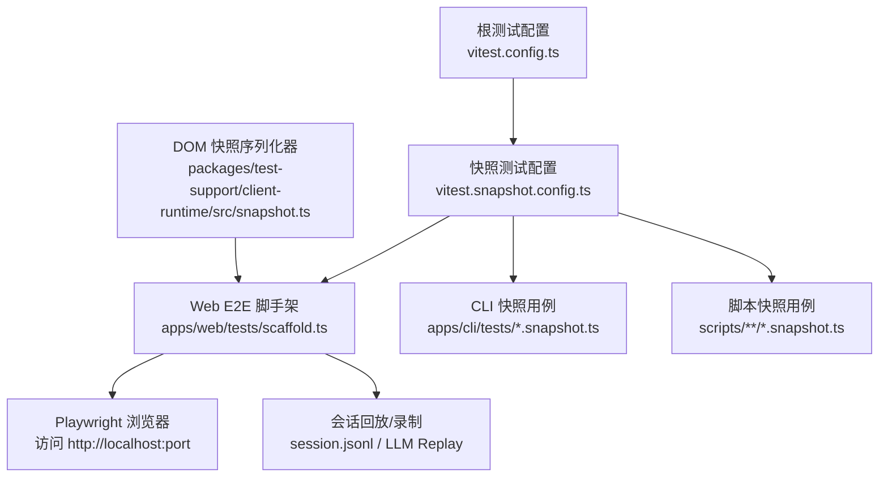
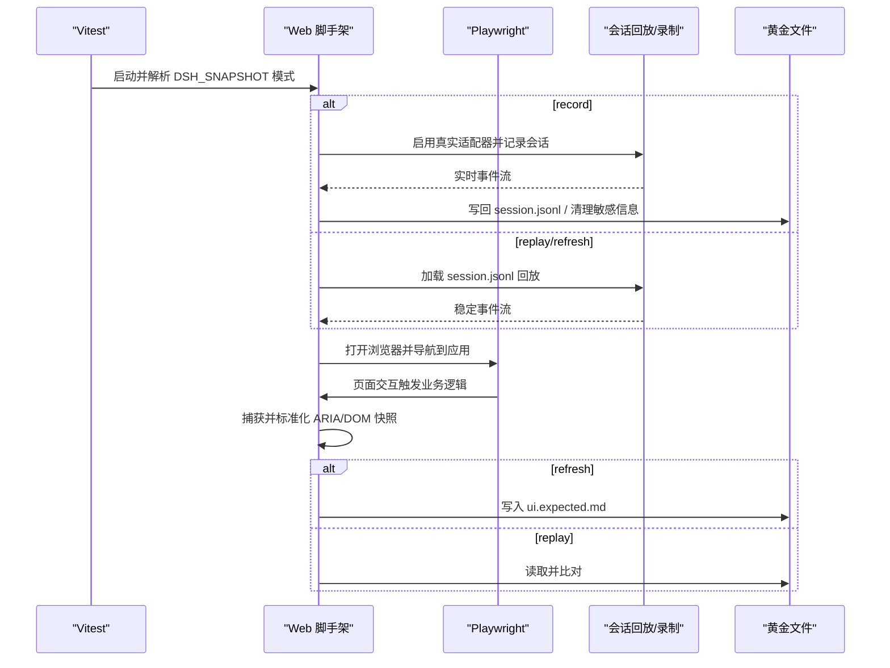
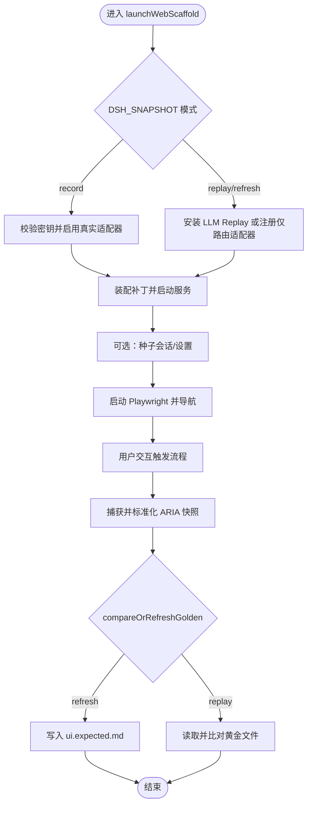
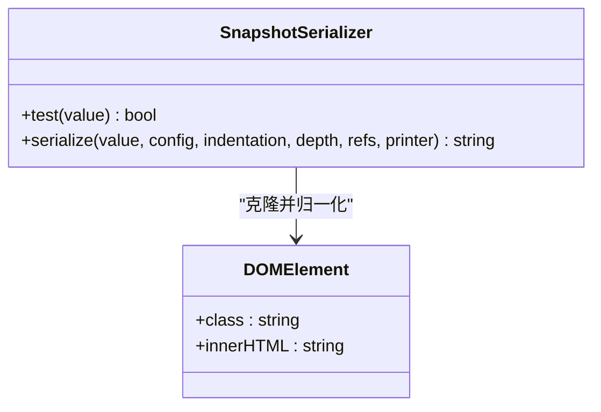
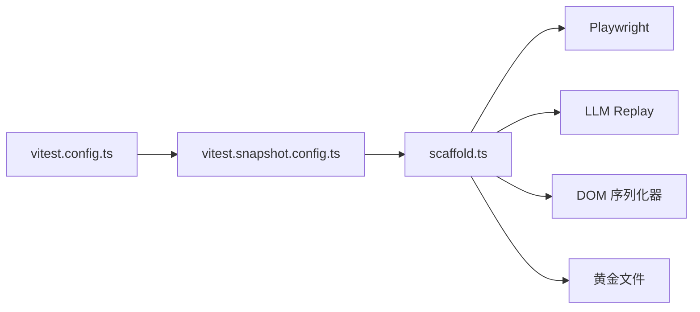

# 快照测试

<cite>
**本文引用的文件**
- [vitest.snapshot.config.ts](file://vitest.snapshot.config.ts)
- [vitest.config.ts](file://vitest.config.ts)
- [scaffold.ts](file://apps/web/tests/scaffold.ts)
- [access-confirmation.e2e.ts](file://apps/web/tests/access-confirmation.e2e.ts)
- [dsh-badge.snapshot.ts](file://apps/cli/tests/dsh-badge.snapshot.ts)
- [translation-prompt.snapshot.ts](file://scripts/translation-prompt.snapshot.ts)
- [snapshot.ts](file://packages/test-support/client-runtime/src/snapshot.ts)
</cite>

## 目录
1. [简介](#简介)
2. [项目结构](#项目结构)
3. [核心组件](#核心组件)
4. [架构总览](#架构总览)
5. [详细组件分析](#详细组件分析)
6. [依赖关系分析](#依赖关系分析)
7. [性能考虑](#性能考虑)
8. [故障排除指南](#故障排除指南)
9. [结论](#结论)
10. [附录](#附录)

## 简介
本文件面向 DeepSeek Harness 的快照测试体系，系统性说明：
- 快照测试的概念与适用场景（UI、协议、CLI 输出、会话回放等）
- 快照文件的生成、更新与管理方法（replay / record / refresh 三态）
- UI 组件快照测试的实现技巧（稳定化、ARIA 快照、DOM 序列化）
- 最佳实践与常见问题排查
- 对比工具使用与性能优化建议

## 项目结构
仓库采用多工程 + 多模式测试组织：
- 根级 Vitest 配置负责单元与集成测试；独立的快照测试配置文件隔离快照用例
- Web E2E 通过 Playwright 驱动真实浏览器，结合“Web 脚手架”启动完整产品组合，进行 UI 快照
- CLI 与脚本类快照用于验证命令行产物、协议组装结果等
- 共享测试支持库提供 DOM 快照序列化器与稳定性处理

图表来源
- [vitest.config.ts:117-159](file://vitest.config.ts#L117-L159)
- [vitest.snapshot.config.ts:39-68](file://vitest.snapshot.config.ts#L39-L68)
- [scaffold.ts:294-626](file://apps/web/tests/scaffold.ts#L294-L626)
- [snapshot.ts:59-89](file://packages/test-support/client-runtime/src/snapshot.ts#L59-L89)

章节来源
- [vitest.config.ts:117-159](file://vitest.config.ts#L117-L159)
- [vitest.snapshot.config.ts:39-68](file://vitest.snapshot.config.ts#L39-L68)

## 核心组件
- 快照运行配置：定义包含范围、并发策略、超时与环境加载行为，区分 replay/record/refresh 三种模式
- Web E2E 脚手架：启动真实产品组合、注入回放或禁用模型调用、管理临时工作区与会话持久化、捕获并标准化 ARIA 快照、对比或刷新黄金文件
- DOM 快照序列化器：对 DOM 进行归一化（CSS 模块类名折叠、SVG 内容指纹），保证 .snap 文件稳定
- 具体快照用例：覆盖 CLI 输出、Web UI、协议组装、翻译提示等

章节来源
- [vitest.snapshot.config.ts:39-68](file://vitest.snapshot.config.ts#L39-L68)
- [scaffold.ts:294-626](file://apps/web/tests/scaffold.ts#L294-L626)
- [snapshot.ts:59-89](file://packages/test-support/client-runtime/src/snapshot.ts#L59-L89)

## 架构总览
快照测试在三个维度协作：
- 运行期：Vitest 根据配置选择并行度与包含范围；快照专用配置聚焦 *.snapshot.ts
- 数据面：会话回放 fixture（session.jsonl）、黄金文件（ui.expected.md / *.expected.*）、内联快照（toMatchInlineSnapshot）
- 比较面：统一归一化后与黄金文件比对；refresh 模式写入新黄金；record 模式从真实会话提取并写回 fixture

图表来源
- [vitest.snapshot.config.ts:24-37](file://vitest.snapshot.config.ts#L24-L37)
- [vitest.snapshot.config.ts:55-66](file://vitest.snapshot.config.ts#L55-L66)
- [scaffold.ts:294-626](file://apps/web/tests/scaffold.ts#L294-L626)
- [scaffold.ts:778-858](file://apps/web/tests/scaffold.ts#L778-L858)

## 详细组件分析

### Web E2E 脚手架（scaffold.ts）
职责与关键点：
- 模式解析：DSH_SNAPSHOT 支持 replay（默认）、record、refresh；非法值抛出错误
- 环境隔离：为每个测试创建独立的工作区、持久化根、harness home，避免污染本地环境
- 组合装配：加载 shipped bundle 补丁，按需禁用/插入行（如 llm-deepseek、webserver、storage-json 等）
- 模型后端：
  - record：要求 DEEPSEEK_API_KEY，走真实适配器
  - replay/refresh：安装 dsh-llm-replay 回放 fixture；若无 fixture 且未开启 first-run 模式，则注册仅路由适配器以暴露 provider 列表但不允许流式调用
- 会话种子：通过 SessionStore + JSONL 持久化将 seed/session 注入真实后端，确保语义正确性
- 快照捕获：
  - captureStableAria：轮询直到两次标准化 ARIA 快照一致，避免竞态
  - normalizeAria：替换路径、UUID、时间、吞吐等不稳定因素为占位符
  - compareOrRefreshGolden：refresh 写入黄金；replay 若缺失黄金直接报错并提示命令
- 清理与断言：关闭时校验回放 fixture 是否被完全消费，防止静默漂移

图表来源
- [scaffold.ts:85-97](file://apps/web/tests/scaffold.ts#L85-L97)
- [scaffold.ts:294-626](file://apps/web/tests/scaffold.ts#L294-L626)
- [scaffold.ts:778-858](file://apps/web/tests/scaffold.ts#L778-L858)

章节来源
- [scaffold.ts:85-97](file://apps/web/tests/scaffold.ts#L85-L97)
- [scaffold.ts:294-626](file://apps/web/tests/scaffold.ts#L294-L626)
- [scaffold.ts:778-858](file://apps/web/tests/scaffold.ts#L778-L858)

### DOM 快照序列化器（client-runtime snapshot.ts）
作用：
- 将 DOM 元素序列化为稳定的 .snap 文本
- 折叠 CSS 模块类名（_frame_334d2d → frame），避免样式重构导致快照抖动
- 将 SVG 内部内容替换为 data-content 指纹，保留图形变更感知但忽略路径噪声

图表来源
- [snapshot.ts:59-89](file://packages/test-support/client-runtime/src/snapshot.ts#L59-L89)

章节来源
- [snapshot.ts:59-89](file://packages/test-support/client-runtime/src/snapshot.ts#L59-L89)

### CLI 与脚本快照用例
- CLI 快照：通过 runLoaderSmoke 执行子进程，捕获 stdout/stderr，并进行内联快照匹配；路径等动态信息会被替换为占位符
- 脚本快照：执行脚本并产出 JSON，按 DSH_SNAPSHOT 决定是否刷新期望文件，再与期望文件进行匹配

章节来源
- [dsh-badge.snapshot.ts:10-176](file://apps/cli/tests/dsh-badge.snapshot.ts#L10-L176)
- [translation-prompt.snapshot.ts:14-31](file://scripts/translation-prompt.snapshot.ts#L14-L31)

### Web UI 快照用例示例
- 典型流程：启动脚手架 → 打开浏览器 → 导航至应用 → 等待稳定 → 捕获 ARIA 快照 → 与 ui.expected.md 比对或刷新
- 语言与布局：固定浏览器 locale，确保国际化文案稳定；窗口尺寸固定，避免几何差异

章节来源
- [access-confirmation.e2e.ts:20-79](file://apps/web/tests/access-confirmation.e2e.ts#L20-L79)

## 依赖关系分析
- 运行层：vitest.config.ts 管理常规测试；vitest.snapshot.config.ts 专注快照测试，包含 *.snapshot.ts 与部分 apps/web/tests 下的快照
- 数据层：session.jsonl（会话回放）、ui.expected.*（UI 黄金）、*.expected.*（其他黄金）、内联快照
- 工具层：Playwright（浏览器自动化）、LLM Replay（会话回放/录制）、DOM 序列化器（DOM 快照稳定化）

图表来源
- [vitest.config.ts:117-159](file://vitest.config.ts#L117-L159)
- [vitest.snapshot.config.ts:47-66](file://vitest.snapshot.config.ts#L47-L66)
- [scaffold.ts:294-626](file://apps/web/tests/scaffold.ts#L294-L626)

章节来源
- [vitest.config.ts:117-159](file://vitest.config.ts#L117-L159)
- [vitest.snapshot.config.ts:47-66](file://vitest.snapshot.config.ts#L47-L66)

## 性能考虑
- 并发控制：
  - 快照测试可通过环境变量 DSH_SNAPSHOT_MAX_CONCURRENCY 控制文件级与任务级并发；replay 可并行，record/refresh 串行以避免竞争写
  - 默认并发取系统可用并行数与上限的最小值
- 超时与稳定性：
  - 测试与钩子超时分别设置，避免长尾阻塞
  - ARIA 快照采用轮询直至稳定，减少因 React 提交时序导致的抖动
- 资源隔离：
  - 每个测试拥有独立工作区、持久化根与 harness home，避免跨测试干扰
- 网络与 I/O：
  - record 模式会消耗真实 API 配额，应谨慎使用；replay 模式不产生外部请求
  - 通过只读回放与最小化 fixture 集降低 I/O 压力

章节来源
- [vitest.snapshot.config.ts:6-22](file://vitest.snapshot.config.ts#L6-L22)
- [vitest.snapshot.config.ts:55-66](file://vitest.snapshot.config.ts#L55-L66)
- [scaffold.ts:778-858](file://apps/web/tests/scaffold.ts#L778-L858)

## 故障排除指南
- 缺少黄金文件（replay 模式）：
  - 现象：比较失败并提示需要运行 refresh 生成
  - 解决：设置 DSH_SNAPSHOT=refresh 运行对应用例，确认变更后再次回归 replay
- 回放 fixture 未完全消费：
  - 现象：teardown 阶段断言失败
  - 原因：实际驱动少于记录，或分支未覆盖
  - 解决：检查用例逻辑，确保所有记录的步骤都被驱动
- 环境变量缺失（record 模式）：
  - 现象：缺少 DEEPSEEK_API_KEY 时报错
  - 解决：在 .env 或环境变量中提供密钥
- 快照不稳定：
  - 现象：时间、路径、UUID、吞吐等变化导致 diff
  - 解决：确保已使用 normalizeAria 与 DOM 序列化器；必要时调整窗口大小或 locale
- 并发冲突（record/refresh）：
  - 现象：黄金文件或 fixture 被并发写入导致损坏
  - 解决：保持 record/refresh 串行；replay 可并行

章节来源
- [scaffold.ts:848-858](file://apps/web/tests/scaffold.ts#L848-L858)
- [scaffold.ts:294-326](file://apps/web/tests/scaffold.ts#L294-L326)
- [vitest.snapshot.config.ts:55-66](file://vitest.snapshot.config.ts#L55-L66)

## 结论
DeepSeek Harness 的快照测试体系通过“三态模式 + 稳定化 + 严格隔离”的组合，覆盖了 UI、协议、CLI 与脚本等多类场景。借助 Web 脚手架与回放机制，既能保证关键路径的确定性，又能高效维护黄金资产。遵循本文的最佳实践与排障建议，可显著提升测试的稳定性与可维护性。

## 附录

### 快照模式速查
- replay（默认）：回放已记录会话，不写入任何黄金或 fixture
- record：调用真实适配器，从运行时提取会话并写回 fixture，需密钥
- refresh：基于已有 fixture 回放，并将当前稳定快照写回黄金文件

章节来源
- [vitest.snapshot.config.ts:24-37](file://vitest.snapshot.config.ts#L24-L37)
- [scaffold.ts:85-97](file://apps/web/tests/scaffold.ts#L85-L97)

### UI 组件快照实现要点
- 使用 captureStableAria 等待界面稳定后再捕获
- 通过 normalizeAria 消除路径、时间、UUID、吞吐等不稳定因素
- 使用 DOM 序列化器保证 .snap 的结构稳定性
- 固定浏览器 locale 与视口尺寸，确保文案与布局一致

章节来源
- [scaffold.ts:778-858](file://apps/web/tests/scaffold.ts#L778-L858)
- [snapshot.ts:59-89](file://packages/test-support/client-runtime/src/snapshot.ts#L59-L89)
- [access-confirmation.e2e.ts:20-79](file://apps/web/tests/access-confirmation.e2e.ts#L20-L79)

### 常用命令与环境变量
- 运行快照测试：使用 vitest 的快照项目入口（由配置文件定义）
- 切换模式：设置 DSH_SNAPSHOT=replay|record|refresh
- 控制并发：设置 DSH_SNAPSHOT_MAX_CONCURRENCY（正整数）
- 指定浏览器可执行路径（可选）：DSH_PLAYWRIGHT_EXECUTABLE_PATH

章节来源
- [vitest.snapshot.config.ts:6-22](file://vitest.snapshot.config.ts#L6-L22)
- [access-confirmation.e2e.ts:26-38](file://apps/web/tests/access-confirmation.e2e.ts#L26-L38)