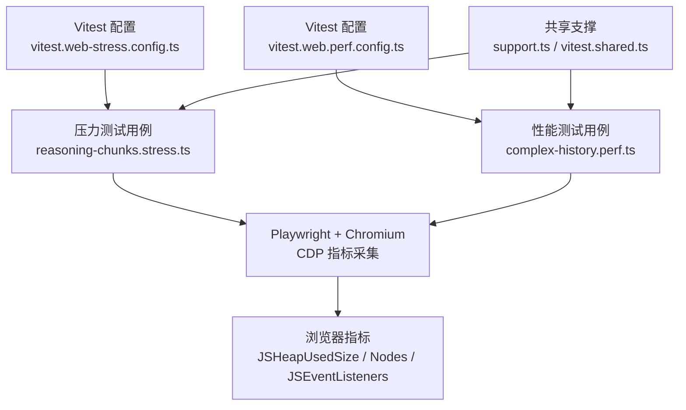
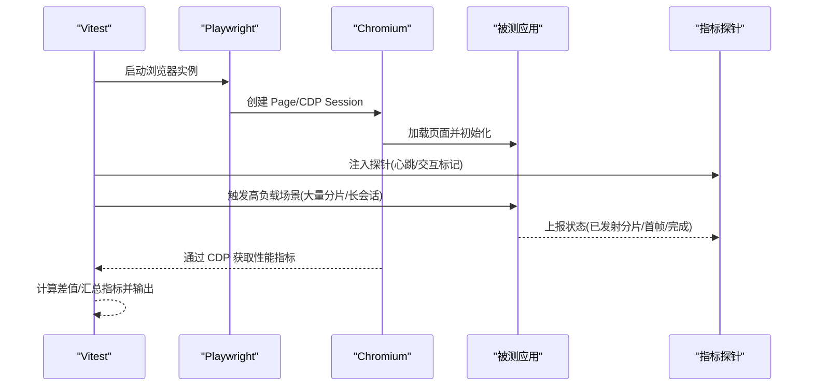
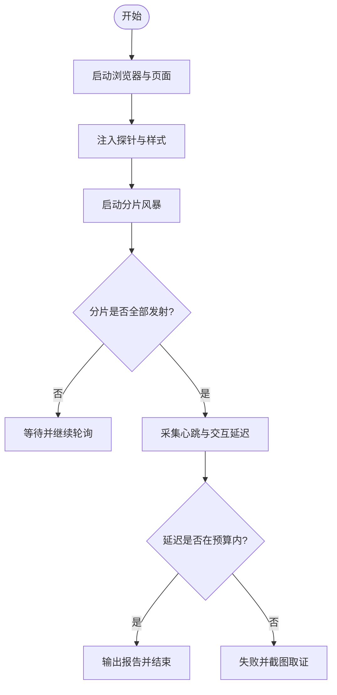
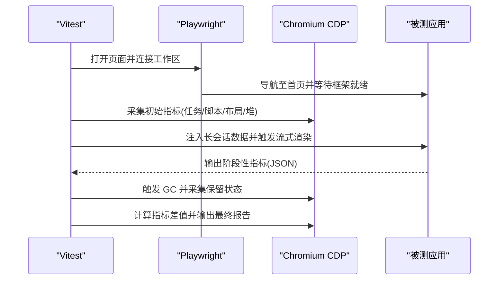
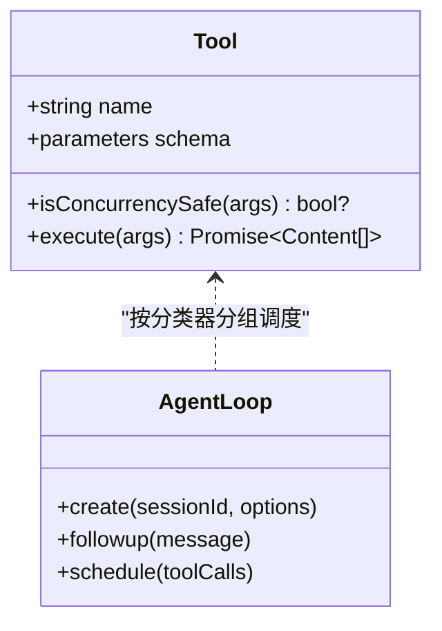
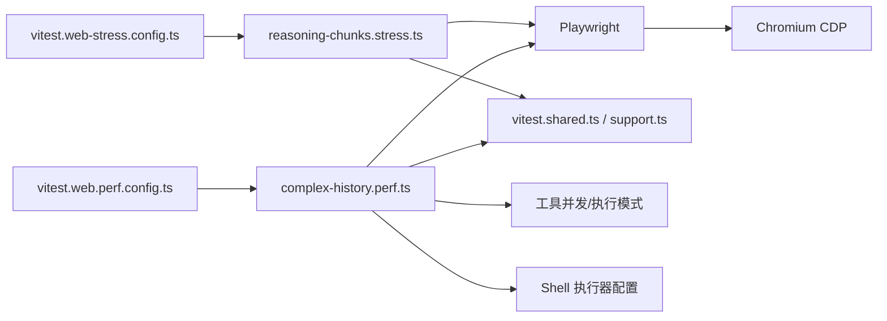

# 性能测试

<cite>
**本文引用的文件**
- [BENCHMARK.md](file://BENCHMARK.md)
- [vitest.web-stress.config.ts](file://vitest.web-stress.config.ts)
- [vitest.web.perf.config.ts](file://vitest.web.perf.config.ts)
- [vitest.shared.ts](file://vitest.shared.ts)
- [apps/web/stress-tests/reasoning-chunks.stress.ts](file://apps/web/stress-tests/reasoning-chunks.stress.ts)
- [apps/web/tests/complex-history.perf.ts](file://apps/web/tests/complex-history.perf.ts)
- [apps/web/tests/support.ts](file://apps/web/tests/support.ts)
- [packages/core/agent-loop/tests/tool-calls.spec.ts](file://packages/core/agent-loop/tests/tool-calls.spec.ts)
- [packages/core/tools/tests/execution-mode.spec.ts](file://packages/core/tools/tests/execution-mode.spec.ts)
- [packages/shell/bash-local/src/index.ts](file://packages/shell/bash-local/src/index.ts)
- [scripts/run-gates.ts](file://scripts/run-gates.ts)
</cite>

## 目录
1. [简介](#简介)
2. [项目结构](#项目结构)
3. [核心组件](#核心组件)
4. [架构总览](#架构总览)
5. [详细组件分析](#详细组件分析)
6. [依赖关系分析](#依赖关系分析)
7. [性能注意事项](#性能注意事项)
8. [故障排查指南](#故障排查指南)
9. [结论](#结论)
10. [附录](#附录)

## 简介
本文件面向 DeepSeek Harness 的性能测试与基准测试，聚焦于：
- 工具配置与执行方法（Vitest 多配置、Playwright 浏览器驱动）
- 压力测试与基准测试的实施策略（高吞吐流式渲染、长会话历史渲染、长时间浸泡）
- 性能指标收集与监控机制（Chromium CDP 指标、主线程延迟、交互响应时间、内存占用）
- 性能优化最佳实践与问题诊断（并发控制、超时与资源限制、泄漏检测）
- 帮助开发者识别瓶颈，确保系统稳定性与可扩展性

## 项目结构
仓库为多包 Monorepo，性能相关能力分布在以下位置：
- Web 端性能与压力测试用例位于 apps/web/tests 与 apps/web/stress-tests
- Vitest 多配置用于区分常规 E2E、性能与压力测试通道
- 共享测试支撑在 apps/web/tests/support.ts 与 vitest.shared.ts
- 后端/Agent 侧并发与执行模式由 packages/core 下的工具调用与执行模式测试覆盖
- Shell 执行器提供可配置的超时与输出限制，便于压测环境稳定运行
- CI 门控脚本提供默认并发度计算，避免本地或 CI 资源争用

图表来源
- [vitest.web-stress.config.ts:1-16](file://vitest.web-stress.config.ts#L1-L16)
- [vitest.web.perf.config.ts:1-16](file://vitest.web.perf.config.ts#L1-L16)
- [apps/web/stress-tests/reasoning-chunks.stress.ts:1-154](file://apps/web/stress-tests/reasoning-chunks.stress.ts#L1-L154)
- [apps/web/tests/complex-history.perf.ts:1-200](file://apps/web/tests/complex-history.perf.ts#L1-L200)
- [apps/web/tests/support.ts:1-136](file://apps/web/tests/support.ts#L1-L136)
- [vitest.shared.ts:1-43](file://vitest.shared.ts#L1-L43)

章节来源
- [vitest.web-stress.config.ts:1-16](file://vitest.web-stress.config.ts#L1-L16)
- [vitest.web.perf.config.ts:1-16](file://vitest.web.perf.config.ts#L1-L16)
- [apps/web/stress-tests/reasoning-chunks.stress.ts:1-154](file://apps/web/stress-tests/reasoning-chunks.stress.ts#L1-L154)
- [apps/web/tests/complex-history.perf.ts:1-200](file://apps/web/tests/complex-history.perf.ts#L1-L200)
- [apps/web/tests/support.ts:1-136](file://apps/web/tests/support.ts#L1-L136)
- [vitest.shared.ts:1-43](file://vitest.shared.ts#L1-L43)

## 核心组件
- 压力测试通道：通过独立 Vitest 配置仅包含 *.stress.ts，禁用文件并行，延长钩子与测试超时，适合在真实浏览器中验证 UI 在高负载下的响应性。
- 性能测试通道：通过独立 Vitest 配置仅包含 *.perf.ts，关闭控制台拦截以便输出结构化指标，延长超时以容纳长会话与流式场景。
- Playwright 与 Chromium CDP：使用 Playwright 启动 Chromium，通过 CDP 获取 Performance.getMetrics 与 HeapProfiler，采集任务时长、布局/样式重算、事件监听器数量、堆大小等关键指标。
- 指标探针与断言：在页面内注入探针记录主线程心跳延迟与交互处理延迟；在复杂历史场景中采集 DOM 节点数、事件监听器数、堆内存变化，并输出 JSON 结果供后续分析。
- 并发与执行模式：工具调用支持 isConcurrencySafe 分类器，决定并行或独占执行；AgentLoop 根据分类器分组调度，保障安全前提下提升吞吐。
- Shell 执行器配置：提供 timeoutMs、maxTimeoutMs、maxOutputBytes、maxSpillBytes、graceMs 等参数，防止压测期间进程失控或输出膨胀。
- 并发度控制：CI 门控脚本根据可用 CPU 与模式限制默认工作进程数，避免本地构建/检查阶段内存爆炸。

章节来源
- [vitest.web-stress.config.ts:1-16](file://vitest.web-stress.config.ts#L1-L16)
- [vitest.web.perf.config.ts:1-16](file://vitest.web.perf.config.ts#L1-L16)
- [apps/web/tests/complex-history.perf.ts:515-542](file://apps/web/tests/complex-history.perf.ts#L515-L542)
- [apps/web/stress-tests/reasoning-chunks.stress.ts:46-154](file://apps/web/stress-tests/reasoning-chunks.stress.ts#L46-L154)
- [packages/core/agent-loop/tests/tool-calls.spec.ts:62-142](file://packages/core/agent-loop/tests/tool-calls.spec.ts#L62-L142)
- [packages/core/tools/tests/execution-mode.spec.ts:40-67](file://packages/core/tools/tests/execution-mode.spec.ts#L40-L67)
- [packages/shell/bash-local/src/index.ts:105-137](file://packages/shell/bash-local/src/index.ts#L105-L137)
- [scripts/run-gates.ts:123-156](file://scripts/run-gates.ts#L123-L156)

## 架构总览
下图展示从测试入口到浏览器指标采集的端到端流程，涵盖压力测试与性能测试两条通道。

图表来源
- [vitest.web-stress.config.ts:1-16](file://vitest.web-stress.config.ts#L1-L16)
- [vitest.web.perf.config.ts:1-16](file://vitest.web.perf.config.ts#L1-L16)
- [apps/web/stress-tests/reasoning-chunks.stress.ts:46-154](file://apps/web/stress-tests/reasoning-chunks.stress.ts#L46-L154)
- [apps/web/tests/complex-history.perf.ts:515-542](file://apps/web/tests/complex-history.perf.ts#L515-L542)

## 详细组件分析

### 压力测试：推理分片风暴（reasoning-chunks.stress.ts）
- 目标：在真实装配的应用中，向渲染管线注入大量推理分片，验证主线程不阻塞、交互仍可及时响应。
- 关键实现要点：
  - 通过 Playwright 启动 Chromium，注入 localStorage 与样式以隐藏引导层，保持生产渲染树挂载。
  - 在页面内设置心跳间隔与交互事件，记录最大主线程延迟与交互处理延迟。
  - 调用 fixture hooks 启动“分片风暴”，轮询等待分片全部发射，并断言可见文本包含标记。
  - 最终汇总报告：分片总数、每批数量、间隔、已发射数、最大主线程延迟、交互延迟、心跳采样次数。
- 指标与断言：
  - 主线程延迟预算：最大延迟需低于阈值。
  - 交互延迟：从计划时间到实际处理时间的延迟需低于阈值。
  - 无页面错误与警告。

图表来源
- [apps/web/stress-tests/reasoning-chunks.stress.ts:46-154](file://apps/web/stress-tests/reasoning-chunks.stress.ts#L46-L154)

章节来源
- [apps/web/stress-tests/reasoning-chunks.stress.ts:46-154](file://apps/web/stress-tests/reasoning-chunks.stress.ts#L46-L154)

### 性能测试：长会话与流式渲染（complex-history.perf.ts）
- 目标：评估高基数工作区与长会话历史渲染的性能，包括流式增量更新、工具调用轨迹、内存与 DOM 规模。
- 关键实现要点：
  - 构造超长会话（如 500 轮），生成大量工具调用与轨迹行，模拟真实用户行为。
  - 通过 Playwright + CDP 采集 Chromium 指标：TaskDuration、ScriptDuration、LayoutDuration、RecalcStyleDuration、Nodes、JSEventListeners、JSHeapUsedSize。
  - 在关键阶段触发垃圾回收并采集堆与节点数，计算差值得到增量指标。
  - 输出结构化 JSON 结果，包含墙钟时间、任务/脚本/布局/样式耗时、DOM 与监听器增量、堆内存增量等。
- 指标与断言：
  - 结构性断言保证工作区与历史条目数量不会静默减少。
  - 性能指标用于趋势分析与回归检测，而非硬性阈值断言（主机差异大）。

图表来源
- [apps/web/tests/complex-history.perf.ts:515-542](file://apps/web/tests/complex-history.perf.ts#L515-L542)
- [apps/web/tests/complex-history.perf.ts:88-168](file://apps/web/tests/complex-history.perf.ts#L88-L168)

章节来源
- [apps/web/tests/complex-history.perf.ts:88-168](file://apps/web/tests/complex-history.perf.ts#L88-L168)
- [apps/web/tests/complex-history.perf.ts:515-542](file://apps/web/tests/complex-history.perf.ts#L515-L542)

### 工具调用并发与执行模式
- 设计原则：工具可通过 isConcurrencySafe(args) 声明是否可并行执行；未声明或返回非 true 时按独占执行。
- 效果：对读操作或无副作用的工具允许并行，写操作或存在共享状态风险的工具串行化，从而在保证正确性的同时提升吞吐。
- 验证方式：单元测试覆盖分类器判定、分组调度、屏障行为、滚动上限、有序结果与上下文、中止排空等。

图表来源
- [packages/core/agent-loop/tests/tool-calls.spec.ts:62-142](file://packages/core/agent-loop/tests/tool-calls.spec.ts#L62-L142)
- [packages/core/tools/tests/execution-mode.spec.ts:40-67](file://packages/core/tools/tests/execution-mode.spec.ts#L40-L67)

章节来源
- [packages/core/agent-loop/tests/tool-calls.spec.ts:62-142](file://packages/core/agent-loop/tests/tool-calls.spec.ts#L62-L142)
- [packages/core/tools/tests/execution-mode.spec.ts:40-67](file://packages/core/tools/tests/execution-mode.spec.ts#L40-L67)

### Shell 执行器配置（超时与输出限制）
- 关键配置项：timeoutMs、maxTimeoutMs、maxOutputBytes、maxSpillBytes、graceMs。
- 作用：在压测环境中防止命令执行过久、输出过大导致内存或磁盘压力；graceMs 提供优雅退出缓冲。
- 建议：在性能测试中适当降低 maxOutputBytes 与 maxSpillBytes，缩短 timeoutMs 以快速失败，避免拖慢整体流水线。

章节来源
- [packages/shell/bash-local/src/index.ts:105-137](file://packages/shell/bash-local/src/index.ts#L105-L137)

### 并发度与资源管理（CI 门控）
- 默认并发度：根据可用 CPU 与模式限制工作进程数，避免本地构建/文档检查阶段内存爆炸。
- 环境变量：可通过环境变量覆盖并发度，但需为正整数。
- 建议：在性能测试通道中显式设置较低并发，确保结果可重复且不受宿主资源波动影响。

章节来源
- [scripts/run-gates.ts:123-156](file://scripts/run-gates.ts#L123-L156)

## 依赖关系分析
- 测试配置依赖：
  - 压力测试配置引入共享 execArgv 与路径解析插件，仅包含 stress 测试文件。
  - 性能测试配置继承 Web 测试配置，仅包含 perf 测试文件，并关闭控制台拦截。
- 运行时依赖：
  - Playwright 驱动 Chromium，通过 CDP 获取性能指标。
  - 被测应用暴露 hooks 与探针接口，供测试注入与读取状态。
- 后端依赖：
  - 工具执行模式与 AgentLoop 调度影响吞吐与延迟。
  - Shell 执行器配置影响 I/O 与资源占用。

图表来源
- [vitest.web-stress.config.ts:1-16](file://vitest.web-stress.config.ts#L1-L16)
- [vitest.web.perf.config.ts:1-16](file://vitest.web.perf.config.ts#L1-L16)
- [apps/web/stress-tests/reasoning-chunks.stress.ts:1-154](file://apps/web/stress-tests/reasoning-chunks.stress.ts#L1-L154)
- [apps/web/tests/complex-history.perf.ts:1-200](file://apps/web/tests/complex-history.perf.ts#L1-L200)
- [vitest.shared.ts:1-43](file://vitest.shared.ts#L1-L43)
- [apps/web/tests/support.ts:1-136](file://apps/web/tests/support.ts#L1-L136)
- [packages/core/agent-loop/tests/tool-calls.spec.ts:62-142](file://packages/core/agent-loop/tests/tool-calls.spec.ts#L62-L142)
- [packages/shell/bash-local/src/index.ts:105-137](file://packages/shell/bash-local/src/index.ts#L105-L137)

章节来源
- [vitest.web-stress.config.ts:1-16](file://vitest.web-stress.config.ts#L1-L16)
- [vitest.web.perf.config.ts:1-16](file://vitest.web.perf.config.ts#L1-L16)
- [apps/web/stress-tests/reasoning-chunks.stress.ts:1-154](file://apps/web/stress-tests/reasoning-chunks.stress.ts#L1-L154)
- [apps/web/tests/complex-history.perf.ts:1-200](file://apps/web/tests/complex-history.perf.ts#L1-L200)
- [vitest.shared.ts:1-43](file://vitest.shared.ts#L1-L43)
- [apps/web/tests/support.ts:1-136](file://apps/web/tests/support.ts#L1-L136)
- [packages/core/agent-loop/tests/tool-calls.spec.ts:62-142](file://packages/core/agent-loop/tests/tool-calls.spec.ts#L62-L142)
- [packages/shell/bash-local/src/index.ts:105-137](file://packages/shell/bash-local/src/index.ts#L105-L137)

## 性能注意事项
- 选择合适通道：
  - 压力测试用于验证极端负载下的响应性与稳定性，适合在真实浏览器中运行。
  - 性能测试用于采集指标与趋势分析，适合在受控环境下多次运行对比。
- 指标解读：
  - 主线程延迟与交互延迟反映 UI 流畅度；任务/脚本/布局/样式耗时定位热点阶段。
  - DOM 节点数与事件监听器数增长可能暗示泄漏或未及时清理。
  - JSHeapUsedSize 增长需结合 GC 时机判断是否为正常分配或潜在泄漏。
- 并发与隔离：
  - 工具并发分类器应保守声明，仅在确认无副作用或可安全重叠时启用并行。
  - 压测通道禁用文件并行，避免资源竞争干扰结果。
- 资源限制：
  - 合理设置 Shell 执行器的超时与输出限制，防止异常进程拖垮测试环境。
  - CI 门控默认并发度限制有助于避免内存爆炸，可在本地按需调整。

[本节为通用指导，无需特定文件引用]

## 故障排查指南
- 浏览器无响应或交互卡顿：
  - 检查主线程心跳延迟与交互处理延迟是否超过预算。
  - 查看布局/样式重算耗时是否异常升高，定位频繁重排的代码路径。
- 内存持续增长：
  - 在关键阶段触发 GC 后观察堆大小是否回落；若持续上升，检查事件监听器与 DOM 节点是否被释放。
  - 关注 JSEventListeners 与 Nodes 的增长趋势，排查未移除的监听器或残留组件。
- 流式渲染卡顿：
  - 检查分片发射速率与批量大小，避免一次性推送过多内容。
  - 使用性能测试中的指标差值，定位首帧到稳定阶段的耗时热点。
- 工具调用阻塞：
  - 确认工具的 isConcurrencySafe 分类是否正确；必要时将写操作改为独占执行。
  - 检查 AgentLoop 的并发上限与分组调度，避免队列堆积。
- Shell 执行超时或输出过大：
  - 调整 timeoutMs、maxOutputBytes、maxSpillBytes，确保压测环境稳定。
  - 使用 graceMs 提供优雅退出缓冲，避免强制终止导致状态不一致。

章节来源
- [apps/web/stress-tests/reasoning-chunks.stress.ts:46-154](file://apps/web/stress-tests/reasoning-chunks.stress.ts#L46-L154)
- [apps/web/tests/complex-history.perf.ts:515-542](file://apps/web/tests/complex-history.perf.ts#L515-L542)
- [packages/core/agent-loop/tests/tool-calls.spec.ts:62-142](file://packages/core/agent-loop/tests/tool-calls.spec.ts#L62-L142)
- [packages/shell/bash-local/src/index.ts:105-137](file://packages/shell/bash-local/src/index.ts#L105-L137)

## 结论
DeepSeek Harness 提供了完善的性能与压力测试基础设施：
- 通过独立的 Vitest 配置将压力与性能测试隔离，确保结果可重复与可比较。
- 借助 Playwright 与 Chromium CDP 采集多维度指标，覆盖主线程、布局、内存与 DOM 规模。
- 工具并发分类器与 Shell 执行器配置为吞吐与稳定性提供保障。
- 建议在压测与性能测试中遵循本指南的最佳实践，持续监控指标趋势，及时识别并修复瓶颈。

[本节为总结，无需特定文件引用]

## 附录
- 快速开始：
  - 参考基准说明，安装 Python SDK 并运行最小化示例，使用独立工作区与会话 ID 进行独立基准任务。
- 运行命令（概念性说明）：
  - 压力测试：使用压力测试专用 Vitest 配置运行 *.stress.ts。
  - 性能测试：使用性能测试专用 Vitest 配置运行 *.perf.ts。
- 指标输出：
  - 压力测试输出结构化报告（分片统计、主线程延迟、交互延迟）。
  - 性能测试输出 JSON 指标（任务/脚本/布局/样式耗时、DOM/监听器/堆增量）。

章节来源
- [BENCHMARK.md:1-4](file://BENCHMARK.md#L1-L4)
- [vitest.web-stress.config.ts:1-16](file://vitest.web-stress.config.ts#L1-L16)
- [vitest.web.perf.config.ts:1-16](file://vitest.web.perf.config.ts#L1-L16)
- [apps/web/stress-tests/reasoning-chunks.stress.ts:46-154](file://apps/web/stress-tests/reasoning-chunks.stress.ts#L46-L154)
- [apps/web/tests/complex-history.perf.ts:515-542](file://apps/web/tests/complex-history.perf.ts#L515-L542)