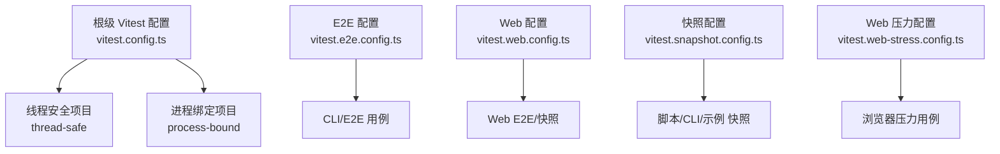
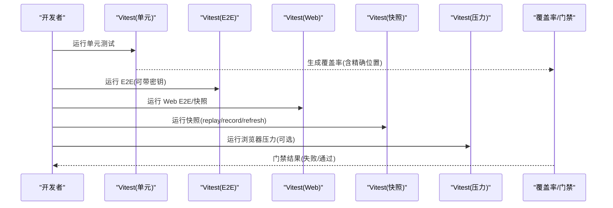
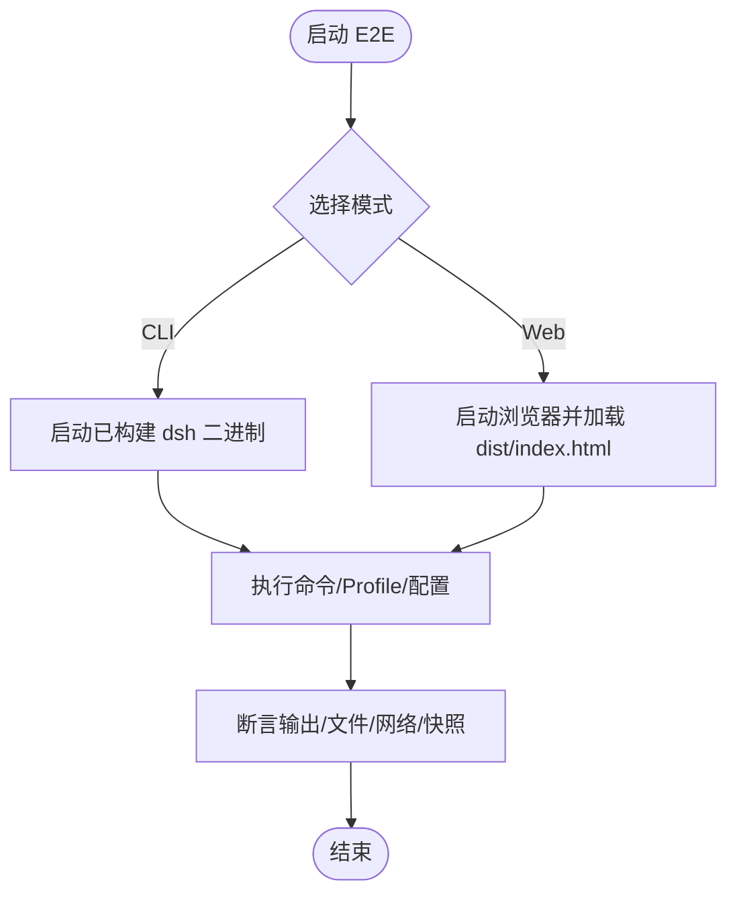
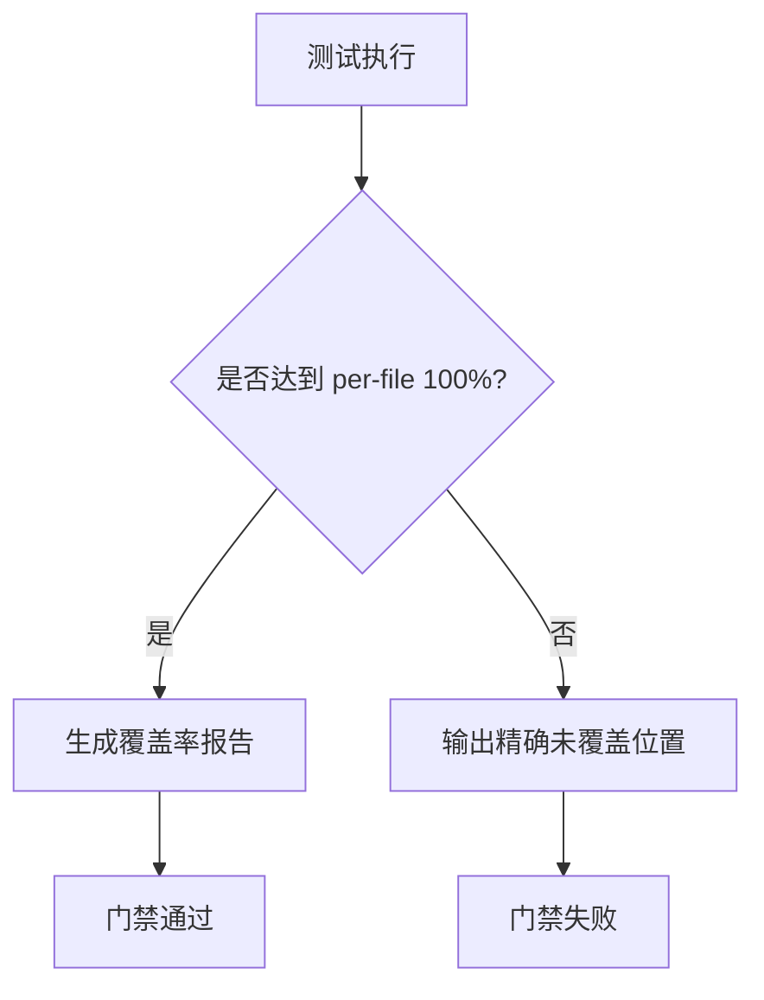
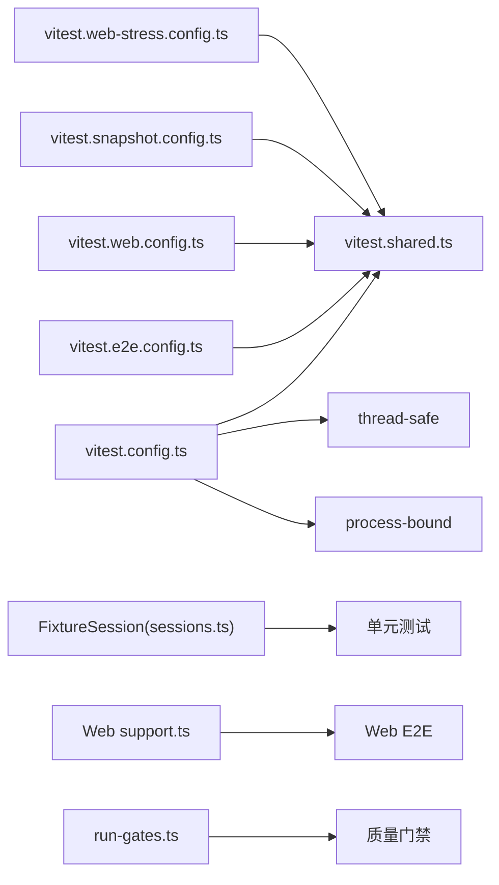

# 测试策略

<cite>
**本文引用的文件**
- [vitest.config.ts](file://vitest.config.ts)
- [vitest.e2e.config.ts](file://vitest.e2e.config.ts)
- [vitest.shared.ts](file://vitest.shared.ts)
- [vitest.web.config.ts](file://vitest.web.config.ts)
- [vitest.snapshot.config.ts](file://vitest.snapshot.config.ts)
- [vitest.web-stress.config.ts](file://vitest.web-stress.config.ts)
- [docs/testing.md](file://docs/testing.md)
- [apps/cli/tests/args.spec.ts](file://apps/cli/tests/args.spec.ts)
- [apps/cli/tests/built-bin.e2e.ts](file://apps/cli/tests/built-bin.e2e.ts)
- [apps/web/tests/support.ts](file://apps/web/tests/support.ts)
- [packages/test-support/client-runtime/src/sessions.ts](file://packages/test-support/client-runtime/src/sessions.ts)
- [scripts/run-gates.ts](file://scripts/run-gates.ts)
</cite>

## 目录
1. [简介](#简介)
2. [项目结构](#项目结构)
3. [核心组件](#核心组件)
4. [架构总览](#架构总览)
5. [详细组件分析](#详细组件分析)
6. [依赖关系分析](#依赖关系分析)
7. [性能考量](#性能考量)
8. [故障排查指南](#故障排查指南)
9. [结论](#结论)
10. [附录](#附录)

## 简介
本文件面向 DeepSeek Harness 的开发者与测试工程师，系统化阐述单元测试、集成测试、端到端（E2E）测试、快照测试、覆盖率门禁与质量门禁、以及性能/基准测试的实施策略与最佳实践。文档基于仓库中的 Vitest 配置、示例测试与测试支撑库，给出可操作的流程与约束，帮助建立稳定、可维护且高覆盖率的测试体系。

## 项目结构
DeepSeek Harness 采用多工作区与多应用形态（CLI、Web、Examples），测试按“层”组织：
- 单元测试：位于各包的 tests 目录，使用 Vitest 运行，强调隔离性与快速反馈。
- E2E 测试：针对 CLI 与 Web 的端到端场景，分别由独立配置文件驱动。
- 快照测试：以 keyless 回放为主，验证协议、传输与呈现输出的一致性。
- 浏览器压力测试：可选的性能回归通道，用于观察真实组装应用的响应性。

图表来源
- [vitest.config.ts:117-159](file://vitest.config.ts#L117-L159)
- [vitest.e2e.config.ts:31-57](file://vitest.e2e.config.ts#L31-L57)
- [vitest.web.config.ts:16-35](file://vitest.web.config.ts#L16-L35)
- [vitest.snapshot.config.ts:39-67](file://vitest.snapshot.config.ts#L39-L67)
- [vitest.web-stress.config.ts:6-15](file://vitest.web-stress.config.ts#L6-L15)

章节来源
- [vitest.config.ts:1-286](file://vitest.config.ts#L1-L286)
- [vitest.e2e.config.ts:1-59](file://vitest.e2e.config.ts#L1-L59)
- [vitest.web.config.ts:1-36](file://vitest.web.config.ts#L1-L36)
- [vitest.snapshot.config.ts:1-69](file://vitest.snapshot.config.ts#L1-L69)
- [vitest.web-stress.config.ts:1-15](file://vitest.web-stress.config.ts#L1-L15)

## 核心组件
- 统一装饰器与执行参数：通过共享插件处理 TypeScript 装饰器并注入 Node 环境参数，确保 jsdom 存储隔离与跨运行时一致性。
- 多项目并行与隔离：将“线程安全”和“进程绑定”两类用例分离，避免进程全局状态污染，提升稳定性。
- 覆盖率门禁：对 packages 源码实施 per-file 100% 阈值，配合精确位置报告与豁免清单，保证关键路径全覆盖。
- 分层测试入口：
  - 单元测试：默认 Vitest 配置，聚焦包内行为与契约。
  - E2E：独立配置，支持真实 API 调用与重试、超时控制。
  - Web：构建产物驱动的浏览器交互与快照对比。
  - 快照：keyless 回放模式为主，record/refresh 模式用于更新基线。
  - 压力：可选浏览器压力通道，关注响应性与资源占用。

章节来源
- [vitest.shared.ts:1-43](file://vitest.shared.ts#L1-L43)
- [vitest.config.ts:117-159](file://vitest.config.ts#L117-L159)
- [vitest.config.ts:160-283](file://vitest.config.ts#L160-L283)
- [docs/testing.md:7-15](file://docs/testing.md#L7-L15)

## 架构总览
下图展示测试在仓库中的分层与数据流：从配置到用例执行，再到覆盖率与门禁汇总。

图表来源
- [vitest.config.ts:117-159](file://vitest.config.ts#L117-L159)
- [vitest.e2e.config.ts:31-57](file://vitest.e2e.config.ts#L31-L57)
- [vitest.web.config.ts:16-35](file://vitest.web.config.ts#L16-L35)
- [vitest.snapshot.config.ts:39-67](file://vitest.snapshot.config.ts#L39-L67)
- [vitest.web-stress.config.ts:6-15](file://vitest.web-stress.config.ts#L6-L15)

## 详细组件分析

### 单元测试：编写方法与框架配置
- 目标与范围：覆盖 packages/*/src 下的实现代码；tests 与源码同域放置，便于就近验证边界条件、错误路径、事件顺序与并发竞态。
- 运行与隔离：
  - 双项目模型：thread-safe 与 process-bound 分离，后者包含进程全局或时序敏感的用例。
  - 每个用例在独立进程中执行（forks），避免共享线程路径导致的崩溃。
  - 通过 tsconfig.base.json 的路径映射解析 bare imports，确保测试始终指向 src，不加载已构建产物。
- 装饰器与存储：
  - 预转换 TypeScript 装饰器，兼容不同 Node/Vitest 版本。
  - 在支持 --webstorage 的 Node 上禁用进程级 Web Storage，使 jsdom 拥有 isolated localStorage。
- 建议：
  - 优先断言外部可见行为（文件、子进程、网络请求），而非仅检查内部状态。
  - 为每个注册表提供 HMR 安全测试，确保 fiber 释放与清理。
  - 对契约回归保留永久测试用例。

章节来源
- [vitest.config.ts:117-159](file://vitest.config.ts#L117-L159)
- [vitest.config.ts:160-283](file://vitest.config.ts#L160-L283)
- [vitest.shared.ts:1-43](file://vitest.shared.ts#L1-L43)
- [docs/testing.md:7-15](file://docs/testing.md#L7-L15)

### 集成测试与端到端测试策略
- CLI 集成/E2E：
  - 直接调用已构建的 bin 入口，验证真实装配后的行为（如 profile 生命周期、配置 dump、环境变量与凭据）。
  - 通过临时目录与最小化 bundle 模拟自定义 profile，验证热重载、信号处理与退出。
- Web E2E：
  - 基于构建产物 index.html，使用 Playwright 驱动浏览器，比较快照或断言 UI 行为。
  - 通过 support 工具管理端口、工作区连接、截图取证等。
- 真实 API 的 E2E：
  - 独立配置，支持 .env 与密钥注入；具备较长超时与重试，适合调用外部服务。
  - 无密钥时自动跳过，保障 keyless CI 畅通。

图表来源
- [apps/cli/tests/built-bin.e2e.ts:17-39](file://apps/cli/tests/built-bin.e2e.ts#L17-L39)
- [apps/web/tests/support.ts:8-39](file://apps/web/tests/support.ts#L8-L39)
- [vitest.e2e.config.ts:31-57](file://vitest.e2e.config.ts#L31-L57)
- [vitest.web.config.ts:16-35](file://vitest.web.config.ts#L16-L35)

章节来源
- [apps/cli/tests/built-bin.e2e.ts:1-764](file://apps/cli/tests/built-bin.e2e.ts#L1-L764)
- [apps/web/tests/support.ts:1-136](file://apps/web/tests/support.ts#L1-L136)
- [vitest.e2e.config.ts:1-59](file://vitest.e2e.config.ts#L1-L59)
- [vitest.web.config.ts:1-36](file://vitest.web.config.ts#L1-L36)

### 快照测试与模拟对象技巧
- 快照策略：
  - 默认 replay 模式：基于已提交的 JSONL 会话与期望输出进行回放与比对，不消耗外部密钥。
  - record 模式：读取密钥并更新基线；refresh 模式：重放并提交输入但更新当前期望输出。
  - Web 快照：CI 强制只读回放，本地记录需人工审查差异。
- 模拟对象：
  - 对昂贵或非确定性边界（LLM 适配器、网络、时钟）进行 mock；其余保持真实实现。
  - 使用 FixtureSession 等测试支撑类，未 stub 的方法会 fail-loud，避免“半工作”的假阳性。
- 最佳实践：
  - 对外部行为（协议、传输、持久化日志）进行快照；对瞬态展示使用语义矩阵或 PTY 用例。
  - 新增能力/生命周期变体时，同步扩展 harness 并覆盖所有层级。

章节来源
- [vitest.snapshot.config.ts:1-69](file://vitest.snapshot.config.ts#L1-L69)
- [packages/test-support/client-runtime/src/sessions.ts:18-115](file://packages/test-support/client-runtime/src/sessions.ts#L18-L115)
- [docs/testing.md:12-15](file://docs/testing.md#L12-L15)
- [docs/testing.md:21-25](file://docs/testing.md#L21-L25)

### 测试覆盖率要求与质量门禁
- 覆盖率门槛：
  - per-file 100%（语句、分支、函数、行），对 packages/*/src 生效。
  - 精确位置报告：当某文件未达 100% 时，输出具体 path:line:col 记录，便于定位。
  - 豁免清单：对无法覆盖或重复覆盖的代码（类型文件、bin/worker 入口、部分客户端 UI 债务）显式排除，并附带原因。
- 质量门禁：
  - 通过 run-gates 聚合多个 gate（lint、类型、契约、覆盖率、快照、制品等），在 CI 中串行/并行调度。
  - 重型套件拆分：将耗时且对覆盖率贡献有限的套件放入 uninstrumented 门，缩短 CI 时间但不牺牲正确性信号。

图表来源
- [vitest.config.ts:160-283](file://vitest.config.ts#L160-L283)
- [scripts/run-gates.ts:1-44](file://scripts/run-gates.ts#L1-L44)

章节来源
- [vitest.config.ts:160-283](file://vitest.config.ts#L160-L283)
- [scripts/run-gates.ts:1-44](file://scripts/run-gates.ts#L1-L44)

### 测试最佳实践与常见模式
- 优先真实路径：产品可见插件必须通过非单元的 REAL 组合测试验证；bin 入口需在 node 下运行已构建产物。
- 资源自管理：每个 e2e 测试创建并销毁自身资源（afterEach 清理），避免共享 fixture 导致重复注册与真实 API 调用。
- 断言世界而非自报告：通过外部文件、命令输出或网络请求断言，避免被被测系统“自说自话”。
- 常见模式：
  - 命令行参数解析：捕获 process.exit 与 stdout/stderr 输出，验证路由与错误码。
  - Profile 生命周期：通过临时目录与最小 bundle 验证 ready/settled/disposed 与热重载。
  - Web 工作区连接：封装 connectFreshWorkspace/connectFreshWorkspaceZh，统一初始化步骤。

章节来源
- [docs/testing.md:17-46](file://docs/testing.md#L17-L46)
- [apps/cli/tests/args.spec.ts:1-107](file://apps/cli/tests/args.spec.ts#L1-L107)
- [apps/cli/tests/built-bin.e2e.ts:17-39](file://apps/cli/tests/built-bin.e2e.ts#L17-L39)
- [apps/web/tests/support.ts:57-110](file://apps/web/tests/support.ts#L57-L110)

### 性能测试与基准测试方法
- 浏览器压力测试：
  - 单独配置文件，包含 stress-tests 目录，关闭文件并行，设置更长超时，用于观察真实组装应用的响应性。
  - 作为显式性能证据，不替代确定性聚焦测试。
- 建议：
  - 将压力测试与常规测试解耦，仅在需要时启用。
  - 结合浏览器性能面板与指标采集，定位瓶颈。

章节来源
- [vitest.web-stress.config.ts:1-15](file://vitest.web-stress.config.ts#L1-L15)

## 依赖关系分析
- 配置间依赖：
  - vitest.config.ts 定义基础插件与双项目模型，并通过 shared 插件统一装饰器与 execArgv。
  - vitest.e2e.config.ts、vitest.web.config.ts、vitest.snapshot.config.ts、vitest.web-stress.config.ts 各自扩展 include、超时与并行策略。
- 测试支撑依赖：
  - FixtureSession 提供 fail-loud 的会话桩，确保未声明的行为不会静默通过。
  - Web support 提供浏览器与文件系统辅助，简化 E2E 初始化与取证。
- 门禁依赖：
  - run-gates 聚合多种质量门禁，协调覆盖率、静态检查、快照与制品任务。

图表来源
- [vitest.config.ts:117-159](file://vitest.config.ts#L117-L159)
- [vitest.shared.ts:1-43](file://vitest.shared.ts#L1-L43)
- [packages/test-support/client-runtime/src/sessions.ts:18-115](file://packages/test-support/client-runtime/src/sessions.ts#L18-L115)
- [apps/web/tests/support.ts:1-136](file://apps/web/tests/support.ts#L1-L136)
- [scripts/run-gates.ts:1-44](file://scripts/run-gates.ts#L1-L44)

章节来源
- [vitest.config.ts:117-159](file://vitest.config.ts#L117-L159)
- [vitest.shared.ts:1-43](file://vitest.shared.ts#L1-L43)
- [packages/test-support/client-runtime/src/sessions.ts:18-115](file://packages/test-support/client-runtime/src/sessions.ts#L18-L115)
- [apps/web/tests/support.ts:1-136](file://apps/web/tests/support.ts#L1-L136)
- [scripts/run-gates.ts:1-44](file://scripts/run-gates.ts#L1-L44)

## 性能考量
- 并行与隔离：
  - 单元用例使用 fork 池，避免共享线程路径导致的崩溃；进程绑定用例单独运行，减少干扰。
  - E2E/Web/快照根据场景调整 fileParallelism 与 maxWorkers，平衡速度与稳定性。
- 覆盖率开销：
  - 重型套件在 uninstrumented 门运行，避免 v8 插桩放大耗时；同时保持正确性信号完整。
- 浏览器压力：
  - 关闭文件并行，延长超时，专注观察真实应用响应性；不作为默认快速反馈通道。

[本节为通用指导，无需特定文件引用]

## 故障排查指南
- 常见问题与定位：
  - 覆盖率未达标：查看精确位置报告，确认是否为死代码或需补充测试；必要时申请豁免并附理由。
  - E2E 不稳定：检查超时、重试与环境变量；确保资源在 afterEach 中清理。
  - Web 快照不一致：确认浏览器语言与视口一致；CI 强制 replay，本地记录需人工审查。
  - 装饰器/存储问题：确认使用了标准装饰器插件与 --no-webstorage 参数，避免 jsdom 存储被 Node 覆盖。
- 参考实现：
  - CLI 参数解析测试展示了如何捕获 exit 与输出，验证路由与错误码。
  - Built bin E2E 展示了如何启动已构建入口、验证 profile 生命周期与配置 dump。
  - Web support 提供了端口探测、工作区连接与截图取证工具。

章节来源
- [vitest.config.ts:160-283](file://vitest.config.ts#L160-L283)
- [apps/cli/tests/args.spec.ts:1-107](file://apps/cli/tests/args.spec.ts#L1-L107)
- [apps/cli/tests/built-bin.e2e.ts:17-39](file://apps/cli/tests/built-bin.e2e.ts#L17-L39)
- [apps/web/tests/support.ts:41-55](file://apps/web/tests/support.ts#L41-L55)
- [apps/web/tests/support.ts:112-121](file://apps/web/tests/support.ts#L112-L121)

## 结论
DeepSeek Harness 的测试体系以 Vitest 为核心，分层清晰、隔离严格、门禁严格。通过 per-file 100% 覆盖率、精确位置报告、重型套件豁免与 run-gates 聚合，既保证了质量又兼顾了效率。建议在新增功能时同步完善对应层的测试与快照，遵循“真实路径优先、资源自管理、断言世界”的最佳实践，持续巩固代码质量与系统稳定性。

[本节为总结性内容，无需特定文件引用]

## 附录
- 常用命令（参考仓库 AGENTS.md 与脚本）：
  - 单元测试：pnpm run test
  - 覆盖率门禁：pnpm run test:coverage
  - E2E（可带密钥）：pnpm run test:e2e
  - Web E2E/快照：pnpm run test:web
  - 快照回放/记录/刷新：pnpm run test:snapshot / :record / :refresh
  - 浏览器压力（可选）：pnpm run test:web:stress
- 环境变量要点：
  - DSH_SNAPSHOT=replay|record|refresh
  - DSH_E2E_MAX_WORKERS
  - DSH_SNAPSHOT_MAX_CONCURRENCY
  - DEEPSEEK_API_KEY 等 provider 密钥（按需）

[本节为操作指引，无需特定文件引用]