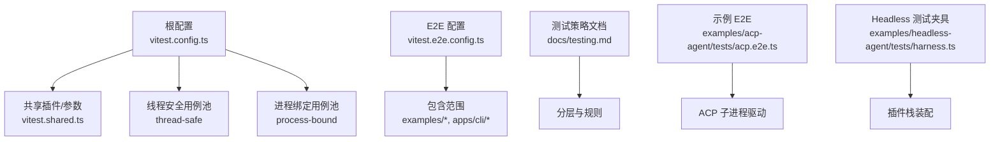
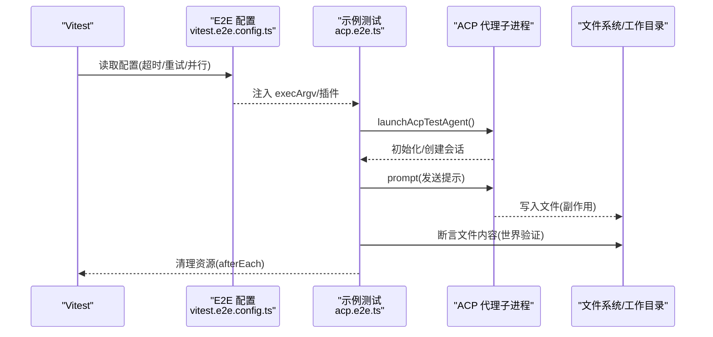
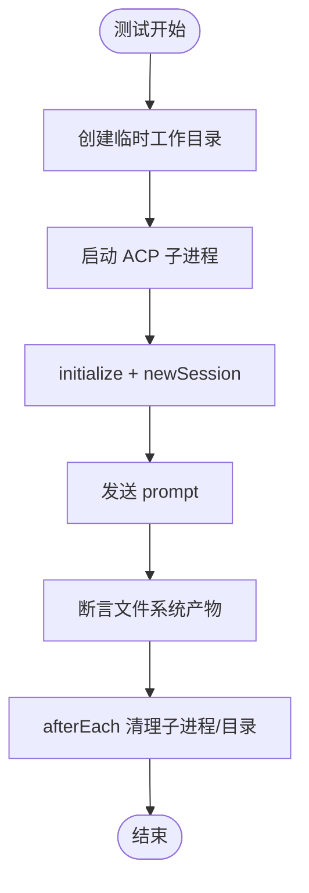
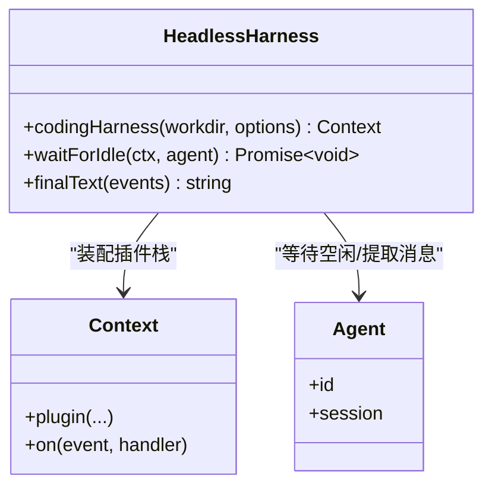
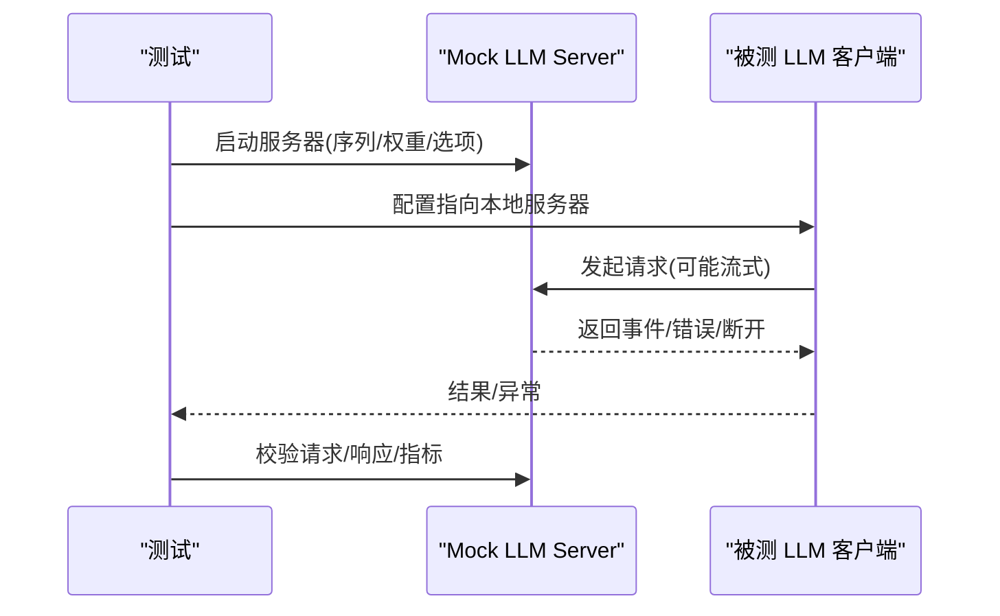
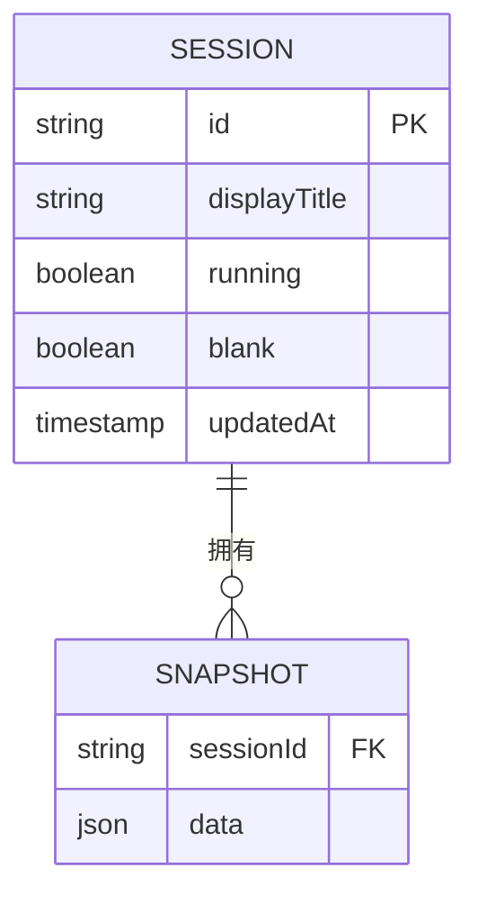
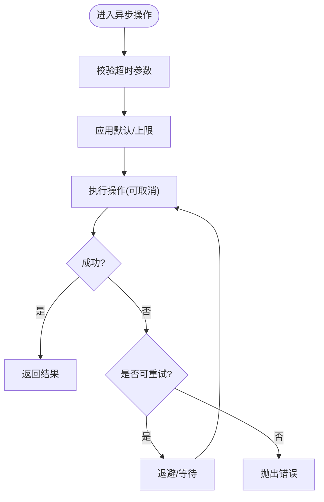
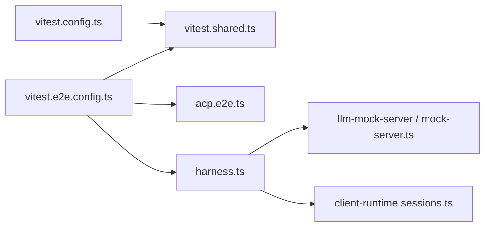

# 集成测试

<cite>
**本文引用的文件**
- [vitest.config.ts](file://vitest.config.ts)
- [vitest.e2e.config.ts](file://vitest.e2e.config.ts)
- [vitest.shared.ts](file://vitest.shared.ts)
- [testing.md](file://docs/testing.md)
- [acp.e2e.ts](file://examples/acp-agent/tests/acp.e2e.ts)
- [harness.ts](file://examples/headless-agent/tests/harness.ts)
- [mock-server.ts](file://packages/llm/llm-pi-ai/tests/mock-server.ts)
- [index.ts](file://packages/test-support/llm-mock-server/src/index.ts)
- [sessions.ts](file://packages/test-support/client-runtime/src/sessions.ts)
</cite>

## 目录
1. [简介](#简介)
2. [项目结构](#项目结构)
3. [核心组件](#核心组件)
4. [架构总览](#架构总览)
5. [详细组件分析](#详细组件分析)
6. [依赖关系分析](#依赖关系分析)
7. [性能与稳定性](#性能与稳定性)
8. [故障排查指南](#故障排查指南)
9. [结论](#结论)
10. [附录](#附录)

## 简介
本文件面向 DeepSeek Harness 的集成测试，目标是帮助开发者构建可靠的端到端（E2E）套件，确保各组件间正确交互。文档涵盖：
- 集成测试策略与分层（单元、覆盖率门、真实 API E2E、快照、Web 浏览器快照）
- 测试环境搭建与配置要点
- 端到端测试的配置与执行方法
- 测试数据管理与“测试数据库”的使用方式
- 异步操作测试、外部服务模拟与测试隔离策略
- 最佳实践与常见问题解决方案

## 项目结构
仓库采用多包工作区，测试按层级组织：
- 单元测试：位于 packages/*/tests/*.spec.ts 与 scripts/*.spec.ts
- 端到端测试：位于 examples/* 与 apps/cli 下的 *.e2e.ts
- 快照测试：基于 JSONL 会话与预期输出进行比对
- Web 浏览器快照：基于 Chromium 回放对比 UI 输出

图表来源
- [vitest.config.ts:117-159](file://vitest.config.ts#L117-L159)
- [vitest.e2e.config.ts:31-57](file://vitest.e2e.config.ts#L31-L57)
- [testing.md:7-15](file://docs/testing.md#L7-L15)

章节来源
- [vitest.config.ts:1-286](file://vitest.config.ts#L1-L286)
- [vitest.e2e.config.ts:1-59](file://vitest.e2e.config.ts#L1-L59)
- [testing.md:1-50](file://docs/testing.md#L1-L50)

## 核心组件
- 测试运行器与项目分片
  - 通过 vitest 的多项目能力将“线程安全”和“进程绑定”两类用例分离执行，避免全局状态污染与并发干扰。
  - 覆盖率门要求 per-file 100%，并针对 Windows/PowerShell 等环境做选择性排除。
- E2E 专用配置
  - 独立加载 .env 环境变量，支持真实模型调用；提供超时、重试与并行度控制。
- 共享工具
  - 统一装饰器预处理、execArgv 设置，保证测试进程行为一致。
- 测试策略与规范
  - 明确分层、with-key 策略、优先使用真实实现而非 mock、验证世界状态而非自报告、测试真实入口路径、源码平面解析等原则。

章节来源
- [vitest.config.ts:117-159](file://vitest.config.ts#L117-L159)
- [vitest.config.ts:160-283](file://vitest.config.ts#L160-L283)
- [vitest.e2e.config.ts:5-14](file://vitest.e2e.config.ts#L5-L14)
- [vitest.e2e.config.ts:40-57](file://vitest.e2e.config.ts#L40-L57)
- [vitest.shared.ts:1-43](file://vitest.shared.ts#L1-L43)
- [testing.md:7-49](file://docs/testing.md#L7-L49)

## 架构总览
下图展示从 Vitest 到具体 E2E 场景的调用链与资源管理：

图表来源
- [vitest.e2e.config.ts:40-57](file://vitest.e2e.config.ts#L40-L57)
- [acp.e2e.ts:14-22](file://examples/acp-agent/tests/acp.e2e.ts#L14-L22)
- [acp.e2e.ts:34-40](file://examples/acp-agent/tests/acp.e2e.ts#L34-L40)
- [acp.e2e.ts:100-126](file://examples/acp-agent/tests/acp.e2e.ts#L100-L126)

## 详细组件分析

### 端到端测试：ACP 子进程驱动
- 目标：以真实子进程启动示例 ACP 代理，通过标准输入输出协议驱动，断言“世界状态”（如文件写入），而非仅检查代理自身输出。
- 关键点：
  - 每个测试在 afterEach 中清理子进程与工作目录，确保隔离。
  - 无密钥场景可只校验 stdout 为纯 JSON-RPC 帧；有密钥场景可发起真实对话并验证结果。
  - 通过临时工作目录隔离文件系统影响。

图表来源
- [acp.e2e.ts:34-40](file://examples/acp-agent/tests/acp.e2e.ts#L34-L40)
- [acp.e2e.ts:42-97](file://examples/acp-agent/tests/acp.e2e.ts#L42-L97)
- [acp.e2e.ts:100-126](file://examples/acp-agent/tests/acp.e2e.ts#L100-L126)

章节来源
- [acp.e2e.ts:1-127](file://examples/acp-agent/tests/acp.e2e.ts#L1-L127)

### Headless 测试夹具与插件栈装配
- 目标：在 headless 场景中装配完整的插件栈（AgentLoop、LLM、Bash、持久化、压缩等），并提供等待空闲、提取最终文本等辅助方法。
- 关键点：
  - 通过 mountAgentLoopTestDependencies 快速挂载测试依赖。
  - 可选启用 TokenMeter、ToolResultPruner、BasicCompactionEngine 与 JsonlSessionPersistence。
  - 通过事件监听等待 agent 空闲，便于断言完成时机。

图表来源
- [harness.ts:19-84](file://examples/headless-agent/tests/harness.ts#L19-L84)
- [harness.ts:86-105](file://examples/headless-agent/tests/harness.ts#L86-L105)

章节来源
- [harness.ts:1-105](file://examples/headless-agent/tests/harness.ts#L1-L105)

### 外部服务模拟：LLM Mock Server
- 目标：用本地 HTTP 服务器模拟 LLM 提供商行为，支持顺序脚本、随机权重、流式事件、延迟、断开、限流、错误等多种场景。
- 关键点：
  - 支持 success/slow_success/max_tokens/connection_reset/stream_disconnect/partial_disconnect/rate_limit/server_error 等行为。
  - 暴露请求/结果事件用于断言与诊断。
  - 可通过 random 与权重组合生成压力测试场景。

图表来源
- [index.ts:46-94](file://packages/test-support/llm-mock-server/src/index.ts#L46-L94)
- [index.ts:116-141](file://packages/test-support/llm-mock-server/src/index.ts#L116-L141)
- [mock-server.ts:28-61](file://packages/llm/llm-pi-ai/tests/mock-server.ts#L28-L61)

章节来源
- [index.ts:46-251](file://packages/test-support/llm-mock-server/src/index.ts#L46-L251)
- [mock-server.ts:28-61](file://packages/llm/llm-pi-ai/tests/mock-server.ts#L28-L61)

### 测试数据与“测试数据库”
- 会话快照与回放：通过 JSONL 记录会话事件，配合 replay.override.json 与 session.expected.jsonl 进行关键路径回归。
- 客户端运行时 Fixture：FixtureSession 将会话读委托给 fixture 的快照存储，未声明的行为会失败，避免“半工作”的假象。
- 内存态测试存储：部分测试使用静态 Map 作为轻量“测试数据库”，提供 reset/set/create/append 等方法，确保跨用例隔离与可控性。

图表来源
- [sessions.ts:18-30](file://packages/test-support/client-runtime/src/sessions.ts#L18-L30)
- [sessions.ts:222-259](file://packages/test-support/client-runtime/src/sessions.ts#L222-L259)

章节来源
- [sessions.ts:18-259](file://packages/test-support/client-runtime/src/sessions.ts#L18-L259)

### 异步操作测试、超时与重试
- 超时与截止时间：统一的 clampTimeout 与 Deadline 封装，确保超时值合法并在作用域退出时清理定时器。
- 重试机制：对 LLM 请求提供正常/无界恢复策略，跟踪活跃操作，支持取消信号。
- E2E 超时与重试：E2E 配置提供较长超时与重试次数，缓解瞬时抖动。

图表来源
- [util/timeout/src/index.ts:33-63](file://packages/util/timeout/src/index.ts#L33-L63)
- [llm-retry/src/index.ts:78-109](file://packages/llm/llm-retry/src/index.ts#L78-L109)
- [vitest.e2e.config.ts:46-57](file://vitest.e2e.config.ts#L46-L57)

章节来源
- [vitest.e2e.config.ts:46-57](file://vitest.e2e.config.ts#L46-L57)
- [util/timeout/src/index.ts:33-63](file://packages/util/timeout/src/index.ts#L33-L63)
- [llm-retry/src/index.ts:78-109](file://packages/llm/llm-retry/src/index.ts#L78-L109)

### 测试隔离策略
- 进程/线程隔离：通过 vitest 的 fork 模式与项目分片，避免进程级全局状态互相影响。
- 资源生命周期：每个 E2E 测试在 afterEach 中显式清理子进程与工作目录，防止泄漏。
- 插件栈隔离：headless harness 每次创建新 Context 并按需装载插件，避免跨用例污染。
- 数据隔离：使用临时目录、内存态 Map、fixture 快照，确保测试间互不干扰。

章节来源
- [vitest.config.ts:117-159](file://vitest.config.ts#L117-L159)
- [acp.e2e.ts:34-40](file://examples/acp-agent/tests/acp.e2e.ts#L34-L40)
- [harness.ts:56-84](file://examples/headless-agent/tests/harness.ts#L56-L84)

## 依赖关系分析
- 配置层
  - vitest.config.ts 定义单测与覆盖率门，拆分 thread-safe 与 process-bound 项目。
  - vitest.e2e.config.ts 定义 E2E 覆盖范围、超时、重试与并行度。
  - vitest.shared.ts 提供装饰器预处理与 execArgv 统一。
- 测试层
  - acp.e2e.ts 驱动 ACP 子进程，验证协议与文件系统效果。
  - harness.ts 装配 headless 插件栈，提供等待与提取工具。
  - llm-mock-server 与 llm-pi-ai mock-server 提供外部服务模拟。
  - client-runtime sessions 提供会话 fixture 与快照回放。

图表来源
- [vitest.config.ts:117-159](file://vitest.config.ts#L117-L159)
- [vitest.e2e.config.ts:31-57](file://vitest.e2e.config.ts#L31-L57)
- [acp.e2e.ts:14-22](file://examples/acp-agent/tests/acp.e2e.ts#L14-L22)
- [harness.ts:19-84](file://examples/headless-agent/tests/harness.ts#L19-L84)
- [index.ts:46-94](file://packages/test-support/llm-mock-server/src/index.ts#L46-L94)
- [mock-server.ts:28-61](file://packages/llm/llm-pi-ai/tests/mock-server.ts#L28-L61)
- [sessions.ts:18-30](file://packages/test-support/client-runtime/src/sessions.ts#L18-L30)

章节来源
- [vitest.config.ts:117-159](file://vitest.config.ts#L117-L159)
- [vitest.e2e.config.ts:31-57](file://vitest.e2e.config.ts#L31-L57)
- [acp.e2e.ts:14-22](file://examples/acp-agent/tests/acp.e2e.ts#L14-L22)
- [harness.ts:19-84](file://examples/headless-agent/tests/harness.ts#L19-L84)
- [index.ts:46-94](file://packages/test-support/llm-mock-server/src/index.ts#L46-L94)
- [mock-server.ts:28-61](file://packages/llm/llm-pi-ai/tests/mock-server.ts#L28-L61)
- [sessions.ts:18-30](file://packages/test-support/client-runtime/src/sessions.ts#L18-L30)

## 性能与稳定性
- 并行与资源限制
  - E2E 通过 fileParallelism 与 maxWorkers 控制并发，默认有限并行度，避免耗尽外部配额。
- 超时与重试
  - E2E 提供较长超时与重试，降低网络抖动导致的偶发失败。
- 覆盖率门
  - per-file 100% 强制高质量覆盖，但需结合真实场景测试，覆盖率不等于功能正确性。
- 平台差异
  - Windows 不支持的部分包/测试被排除，避免误报；PowerShell 可用性检测决定覆盖豁免。

章节来源
- [vitest.e2e.config.ts:46-57](file://vitest.e2e.config.ts#L46-L57)
- [vitest.config.ts:21-83](file://vitest.config.ts#L21-L83)
- [vitest.config.ts:269-283](file://vitest.config.ts#L269-L283)

## 故障排查指南
- 常见症状与定位
  - 子进程泄漏：确认 afterEach 是否清理了子进程与工作目录。
  - 端口冲突：Mock 服务器使用 OS 分配端口时，确保测试结束后释放。
  - 环境变量缺失：E2E 需要 .env 或环境变量提供密钥；无密钥时相关测试应自动跳过。
  - 超时/重试不足：适当调整超时与重试，或减少并发。
- 建议步骤
  - 先运行无密钥场景（仅协议/引导），再运行带密钥场景（真实模型）。
  - 使用快照回放逐步缩小问题范围。
  - 借助 Mock LLM Server 复现边界条件（断开、限流、错误）。

章节来源
- [acp.e2e.ts:34-40](file://examples/acp-agent/tests/acp.e2e.ts#L34-L40)
- [vitest.e2e.config.ts:5-14](file://vitest.e2e.config.ts#L5-L14)
- [index.ts:116-141](file://packages/test-support/llm-mock-server/src/index.ts#L116-L141)

## 结论
DeepSeek Harness 的集成测试体系以分层清晰、隔离严格、外部服务可模拟为核心特征。通过 Vitest 多项目与 E2E 专用配置，结合 ACP 子进程驱动、headless 插件栈装配、LLM Mock Server 与会话快照回放，能够高效验证端到端交互与系统行为。遵循“验证世界而非自报告”的原则，配合严格的资源清理与超时重试策略，可构建稳定可靠的集成测试套件。

## 附录
- 快速上手
  - 运行单测与覆盖率门：参考根命令与 vitest 配置。
  - 运行 E2E：准备 .env 或环境变量，按需调整并发与超时。
  - 录制/刷新快照：仅在必要时更新预期输出，并审查差异。
- 最佳实践清单
  - 每个 E2E 测试拥有并清理自己的资源。
  - 优先使用真实实现，仅对昂贵/非确定性边界进行模拟。
  - 使用临时目录与 fixture 快照隔离数据。
  - 对异步操作使用明确的超时与取消信号。
  - 通过 Mock LLM Server 覆盖异常与边界场景。