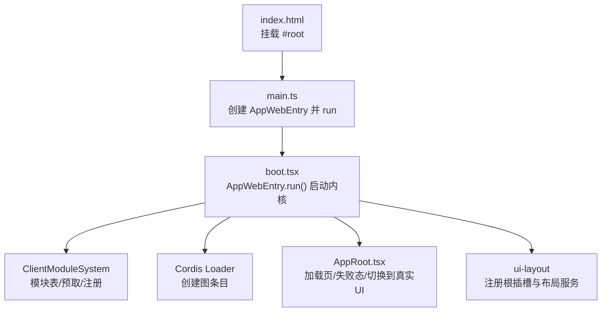
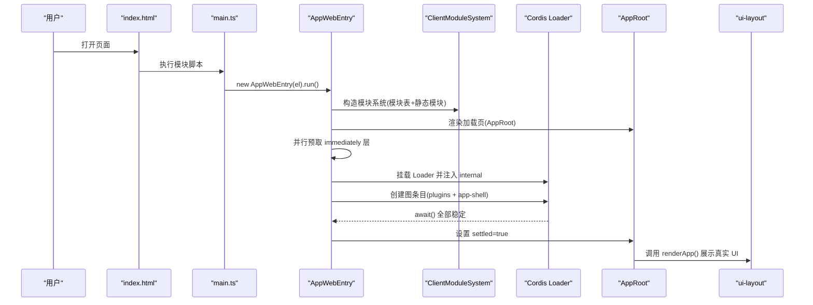
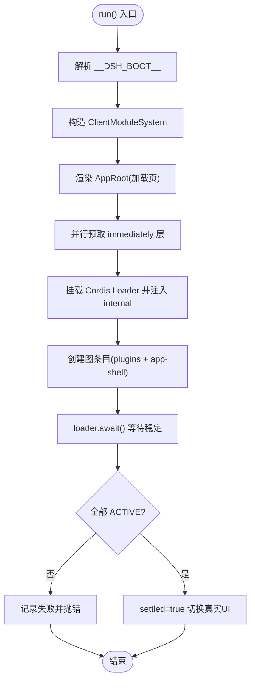
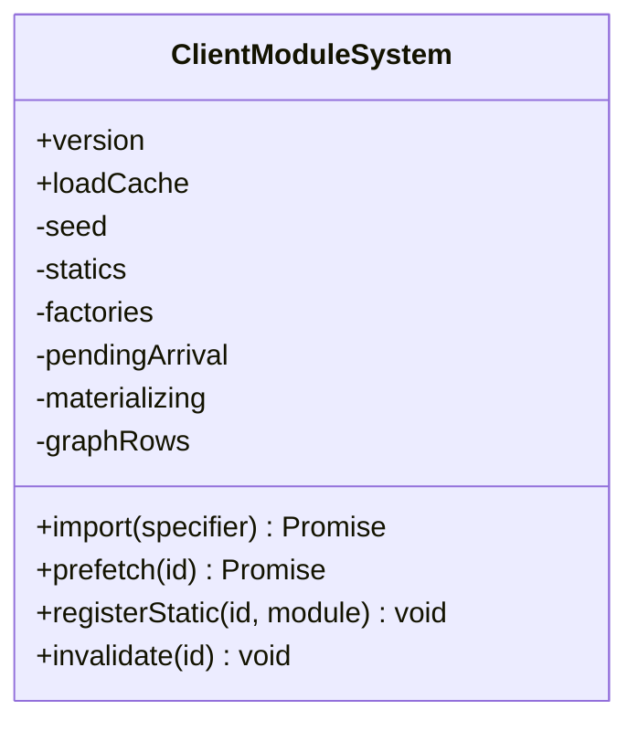
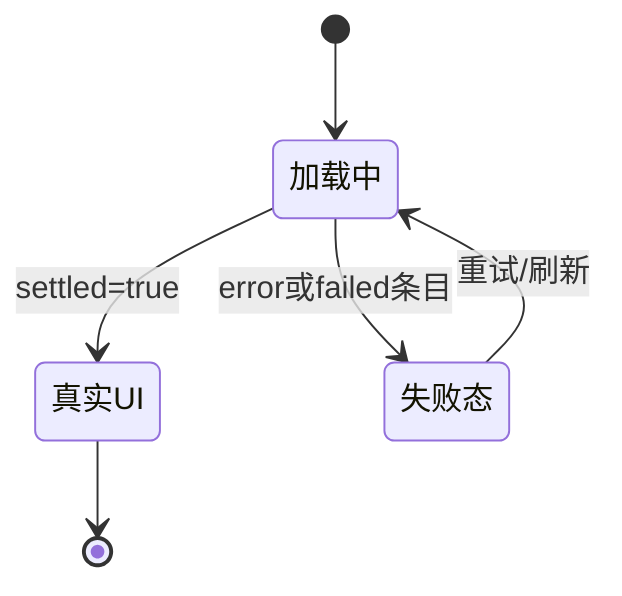
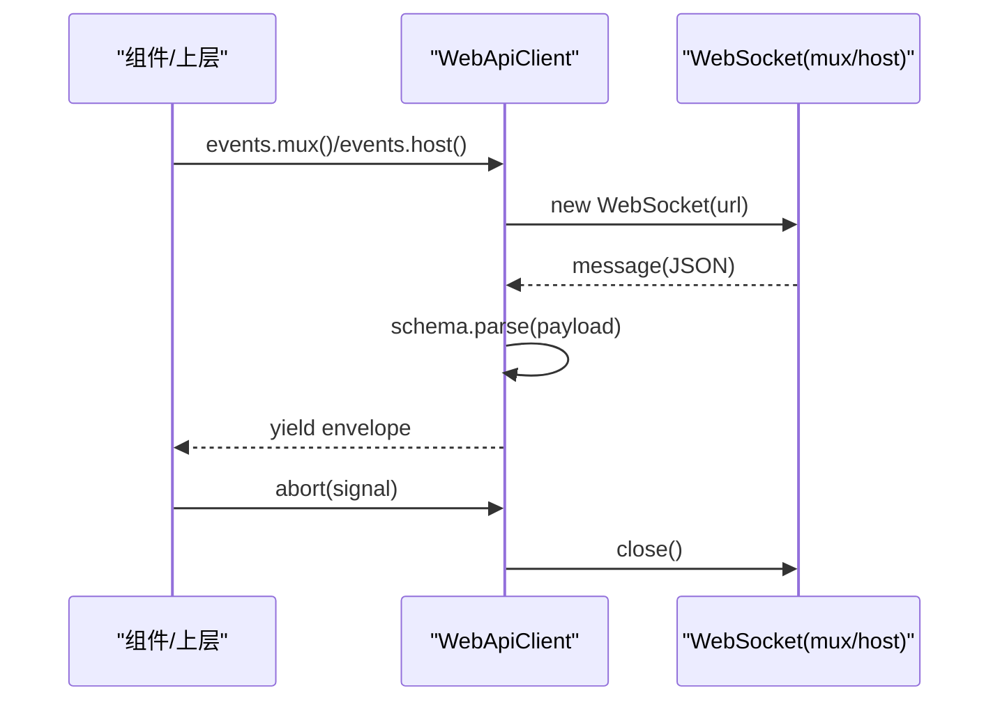
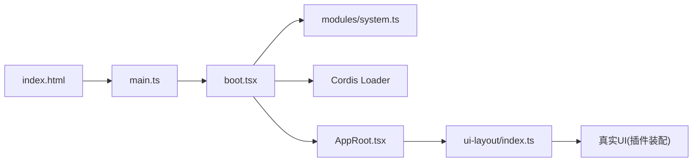

# Web 应用架构

<cite>
**本文引用的文件**
- [apps/web/src/main.ts](file://apps/web/src/main.ts)
- [apps/web/index.html](file://apps/web/index.html)
- [apps/web/vite.config.ts](file://apps/web/vite.config.ts)
- [packages/client/web/src/boot.tsx](file://packages/client/web/src/boot.tsx)
- [packages/client/web/src/AppRoot.tsx](file://packages/client/web/src/AppRoot.tsx)
- [packages/client/modules/src/client/system.ts](file://packages/client/modules/src/client/system.ts)
- [packages/client/connection/src/client/web-api-client.ts](file://packages/client/connection/src/client/web-api-client.ts)
- [packages/client/ui-layout/src/client/index.ts](file://packages/client/ui-layout/src/client/index.ts)
- [packages/client/AGENTS.md](file://packages/client/AGENTS.md)
</cite>

## 目录
1. [简介](#简介)
2. [项目结构](#项目结构)
3. [核心组件](#核心组件)
4. [架构总览](#架构总览)
5. [详细组件分析](#详细组件分析)
6. [依赖关系分析](#依赖关系分析)
7. [性能考量](#性能考量)
8. [故障排查指南](#故障排查指南)
9. [结论](#结论)
10. [附录](#附录)

## 简介
本文件面向 DeepSeek Harness Web 应用的架构与实现，聚焦基于 React 的前端设计、应用入口与启动流程、模块加载机制与插件系统、Vite 构建配置与开发环境、实时通信（WebSocket）连接管理与事件处理，以及组件开发与性能优化实践。文档以代码级事实为依据，配合图示帮助读者快速理解从页面到插件装配、再到运行时状态切换的完整链路。

## 项目结构
Web 应用位于 apps/web，采用“薄入口 + 壳库”的组织方式：
- index.html 提供挂载点 #root 并引入模块脚本。
- main.ts 仅负责查找挂载节点并实例化 AppWebEntry.run()。
- 真正的启动内核、模块系统、插件装配与 UI 切换逻辑集中在 packages/client/web 中。
- Vite 配置在 apps/web/vite.config.ts，负责构建产物拆分、别名解析与浏览器兼容注入。

**图表来源**
- [apps/web/index.html:1-15](file://apps/web/index.html#L1-L15)
- [apps/web/src/main.ts:1-11](file://apps/web/src/main.ts#L1-L11)
- [packages/client/web/src/boot.tsx:1-239](file://packages/client/web/src/boot.tsx#L1-L239)
- [packages/client/web/src/AppRoot.tsx:1-61](file://packages/client/web/src/AppRoot.tsx#L1-L61)
- [packages/client/modules/src/client/system.ts:1-197](file://packages/client/modules/src/client/system.ts#L1-L197)
- [packages/client/ui-layout/src/client/index.ts:110-143](file://packages/client/ui-layout/src/client/index.ts#L110-L143)

**章节来源**
- [apps/web/index.html:1-15](file://apps/web/index.html#L1-L15)
- [apps/web/src/main.ts:1-11](file://apps/web/src/main.ts#L1-L11)
- [apps/web/vite.config.ts:1-161](file://apps/web/vite.config.ts#L1-L161)

## 核心组件
- AppWebEntry：Web 壳启动器，负责解析引导清单、初始化模块系统、渲染加载页、并行预取 immediately 层、挂载 Cordis Loader、创建图条目、等待稳定并切换至真实 UI。
- ClientModuleSystem：客户端模块系统，维护模块表、静态模块、工厂注册、懒加载与缓存、样式归属追踪、HMR 失效支持。
- AppRoot：React 根组件，根据 boot 信号在“加载中/失败/已就绪”三种视图间切换。
- WebApiClient：浏览器端 API 客户端，使用 fetch 进行 RPC，使用 WebSocket 订阅事件流（mux/host）。
- ui-layout：注册根插槽与布局服务，将面板动作注入布局控制器。

**章节来源**
- [packages/client/web/src/boot.tsx:1-239](file://packages/client/web/src/boot.tsx#L1-L239)
- [packages/client/modules/src/client/system.ts:1-197](file://packages/client/modules/src/client/system.ts#L1-L197)
- [packages/client/web/src/AppRoot.tsx:1-61](file://packages/client/web/src/AppRoot.tsx#L1-L61)
- [packages/client/connection/src/client/web-api-client.ts:1-92](file://packages/client/connection/src/client/web-api-client.ts#L1-L92)
- [packages/client/ui-layout/src/client/index.ts:110-143](file://packages/client/ui-layout/src/client/index.ts#L110-L143)

## 架构总览
Web 应用遵循“壳自足、插件装配”的原则：壳不直接 value-import 任何插件包，所有业务功能通过 Cordis 图与模块系统动态装配。启动时先渲染加载页，再在后台完成模块预取与服务装配，最后一次性切换到真实界面。

**图表来源**
- [apps/web/src/main.ts:1-11](file://apps/web/src/main.ts#L1-L11)
- [packages/client/web/src/boot.tsx:1-239](file://packages/client/web/src/boot.tsx#L1-L239)
- [packages/client/web/src/AppRoot.tsx:1-61](file://packages/client/web/src/AppRoot.tsx#L1-L61)
- [packages/client/ui-layout/src/client/index.ts:110-143](file://packages/client/ui-layout/src/client/index.ts#L110-L143)

## 详细组件分析

### AppWebEntry 启动流程
- 解析引导清单：从 window.__DSH_BOOT__ 解析出模块表与插件行。
- 构建模块系统：注册 shell 自有模块与 modules 包自身，暴露 window.__ModuleLoader__ 供外部脚本注册工厂。
- 渲染加载页：使用 React createRoot 挂载 AppRoot，传入状态信号与错误信号。
- 预取 immediately 层：与 Loader 挂载并行，确保后续同步 require 边可用。
- 创建图条目：按顺序包含 modules、各插件、app-shell；每个条目创建后更新加载状态。
- 等待稳定并断言：loader.await() 后检查所有条目 fiber 状态，非 ACTIVE 则抛出汇总错误。
- 切换 UI：settled 置为 true，AppRoot 切换到真实 UI。

**图表来源**
- [packages/client/web/src/boot.tsx:1-239](file://packages/client/web/src/boot.tsx#L1-L239)

**章节来源**
- [packages/client/web/src/boot.tsx:1-239](file://packages/client/web/src/boot.tsx#L1-L239)

### 模块系统与插件装配
- 模块表与静态模块：构造时索引 BootModuleRow，注册 shell 自有模块与 modules 包自身。
- 工厂注册：外部脚本通过 window.__ModuleLoader__.load 注册工厂，重复注册会报错。
- 懒加载与缓存：import/prefetch 按需加载 bundle，结果缓存于 loadCache。
- 同步 require：makeRequire 提供同步 require 能力，用于工厂内跨包引用，循环依赖会报错。
- 样式归属：materialize 阶段收集新增 style 标签并标记 data-plugin，便于 HMR 管理。
- 失效：invalidate 可清除工厂与缓存，配合 HMR 使用。

**图表来源**
- [packages/client/modules/src/client/system.ts:1-197](file://packages/client/modules/src/client/system.ts#L1-L197)

**章节来源**
- [packages/client/modules/src/client/system.ts:1-197](file://packages/client/modules/src/client/system.ts#L1-L197)

### AppRoot 组件树与状态管理
- 职责：根据 settled/status/error 三个信号决定显示“加载中/失败/真实 UI”。
- 状态来源：由 AppWebEntry 提供的 KernelSignal 驱动，使用 useSyncExternalStore 订阅。
- 失败态：列出 failed 条目与错误信息，保持加载页以便诊断。
- 真实 UI：settled 为真时调用 renderApp() 渲染由 app-shell 提供的界面。

**图表来源**
- [packages/client/web/src/AppRoot.tsx:1-61](file://packages/client/web/src/AppRoot.tsx#L1-L61)

**章节来源**
- [packages/client/web/src/AppRoot.tsx:1-61](file://packages/client/web/src/AppRoot.tsx#L1-L61)

### Vite 构建配置与开发环境
- 禁止独立 serve：自定义插件在 dev serve 模式下拒绝启动，避免缺少 __DSH_BOOT__ 导致运行异常。
- 产物拆分：
  - vendor 手动块：数学、高亮、markdown 等重型且变更频率低的依赖。
  - langs 子目录：@shikijs/langs 语法包按需分包。
  - fonts 子目录：KaTeX 字体资源归类。
- 别名与 define：
  - 将 @deepseek-ai/dsh-client-web 等指向源码，使 CSS 走 Vite 管线。
  - 注入 process.versions.node 等 define 值，屏蔽 Node-only 分支。
- 开发体验：通过 dsh web 命令启动，而非裸 Vite 服务；插件 HMR 需配合 dev:web。

**章节来源**
- [apps/web/vite.config.ts:1-161](file://apps/web/vite.config.ts#L1-L161)

### 实时通信机制（WebSocket）
- 事件通道：WebApiClient 为每个下游事件流建立独立 WebSocket（mux/host），RPC 请求仍使用 fetch。
- URL 推导：根据页面协议自动选择 ws/wss。
- 帧解析：对消息体进行 JSON 解析并按 schema 校验，非法帧丢弃并记录日志。
- 生命周期：监听 open/message/close，支持 AbortController 主动关闭；清理事件监听器。
- 迭代消费：内部使用 inbox + wake 队列，异步生成器对外暴露事件流。

**图表来源**
- [packages/client/connection/src/client/web-api-client.ts:1-92](file://packages/client/connection/src/client/web-api-client.ts#L1-L92)

**章节来源**
- [packages/client/connection/src/client/web-api-client.ts:1-92](file://packages/client/connection/src/client/web-api-client.ts#L1-L92)

### 组件开发指南与最佳实践
- 分层与职责边界：
  - 数据对象层（runtime）：纯 JS，零 React 依赖，持有业务状态与事件窗口、重连机等。
  - 渲染层（web-react）：仅做 ctx 到 React 的桥接（Slot、Provider、uSES 适配）。
  - 展示组件（插件 src/client）：纯 props 驱动，不含业务逻辑。
- 组件与 ctx：组件不得直接访问 ctx，只能通过注入的 props/actions 获取能力。
- 插槽与注入：通过 ui-layout 注册根插槽与子插槽，inject 返回 actions 并绑定到 store。
- 性能建议：
  - 使用 memoization、浅比较与虚拟滚动减少重渲染。
  - 大文本/长列表采用分片渲染与增量更新。
  - 避免在渲染路径中进行网络或 I/O 操作。
  - 合理使用 Suspense/Lazy 与分包策略（Vite 已配置 vendor/langs/fonts）。
  - 关注样式注入与 HMR 失效范围，利用模块系统的样式归属追踪。

**章节来源**
- [packages/client/AGENTS.md:38-48](file://packages/client/AGENTS.md#L38-L48)
- [packages/client/ui-layout/src/client/index.ts:110-143](file://packages/client/ui-layout/src/client/index.ts#L110-L143)

## 依赖关系分析
- 入口依赖链：index.html → main.ts → AppWebEntry → ClientModuleSystem → Cordis Loader → 插件图 → AppRoot → 真实 UI。
- 构建期依赖：Vite 通过 alias 将多个 @deepseek-ai/dsh-client-* 包映射到源码，保证 CSS 与热更新生效。
- 运行时依赖：模块系统依赖 window.__ModuleLoader__ 进行工厂注册；Loader 依赖 internal 注入以避免浏览器下 bare import 失败。
- 通信依赖：WebApiClient 依赖宿主提供的 /api/events.mux 与 /api/events.host 端点。

**图表来源**
- [apps/web/index.html:1-15](file://apps/web/index.html#L1-L15)
- [apps/web/src/main.ts:1-11](file://apps/web/src/main.ts#L1-L11)
- [packages/client/web/src/boot.tsx:1-239](file://packages/client/web/src/boot.tsx#L1-L239)
- [packages/client/modules/src/client/system.ts:1-197](file://packages/client/modules/src/client/system.ts#L1-L197)
- [packages/client/web/src/AppRoot.tsx:1-61](file://packages/client/web/src/AppRoot.tsx#L1-L61)
- [packages/client/ui-layout/src/client/index.ts:110-143](file://packages/client/ui-layout/src/client/index.ts#L110-L143)

**章节来源**
- [apps/web/vite.config.ts:1-161](file://apps/web/vite.config.ts#L1-L161)

## 性能考量
- 启动性能：
  - 立即预取 immediately 层，减少同步 require 边的阻塞。
  - 并行创建图条目，最大化并发下载。
  - 使用 vendor/langs/fonts 分包，降低首屏体积与哈希抖动。
- 渲染性能：
  - 数据层与渲染层解耦，组件只接收 props，避免深层 context 导致的无关重渲染。
  - 使用 memo 与选择性订阅（useSyncExternalStore）提升响应效率。
- 网络性能：
  - WebSocket 单路多流（mux/host），减少握手开销。
  - 严格帧校验，避免无效消息带来的处理成本。
- 可维护性：
  - 模块系统支持 invalidate 与 HMR，便于局部重建与调试。

[本节为通用指导，无需特定文件来源]

## 故障排查指南
- 启动失败：
  - 检查 window.__DSH_BOOT__ 是否存在且格式正确。
  - 查看 AppRoot 的失败态输出，定位具体失败的条目。
  - 确认 Loader 已正确挂载且 internal 已注入。
- 模块加载失败：
  - 检查 bundle 是否通过 window.__ModuleLoader__.load 注册了正确的 id。
  - 确认模块表中存在对应 row，且 prefetch/import 未被拦截。
  - 若出现循环依赖，makeRequire 会抛出明确错误。
- 通信问题：
  - 确认 /api/events.mux 与 /api/events.host 可达。
  - 检查浏览器控制台是否有“malformed WebSocket frame”日志。
  - 使用 AbortController 主动关闭并验证连接释放。
- 构建/开发问题：
  - 不要直接使用 Vite serve 启动 apps/web，应通过 dsh web。
  - 插件 HMR 需要同时运行 dev:web 以重新打包客户端插件。

**章节来源**
- [packages/client/web/src/boot.tsx:1-239](file://packages/client/web/src/boot.tsx#L1-L239)
- [packages/client/modules/src/client/system.ts:1-197](file://packages/client/modules/src/client/system.ts#L1-L197)
- [packages/client/connection/src/client/web-api-client.ts:1-92](file://packages/client/connection/src/client/web-api-client.ts#L1-L92)
- [apps/web/vite.config.ts:1-161](file://apps/web/vite.config.ts#L1-L161)

## 结论
DeepSeek Harness Web 采用“壳自足 + 插件装配”的架构，通过 AppWebEntry 协调模块系统与 Cordis Loader，在加载页期间完成必要的预取与服务装配，最终一次性切换到真实 UI。Vite 构建配置精细控制分包与别名，确保开发体验与生产性能。实时通信通过 WebApiClient 统一封装，提供稳定的事件流。组件开发遵循清晰的分层与注入模式，便于扩展与维护。

[本节为总结，无需特定文件来源]

## 附录
- 如何扩展 Web 界面功能：
  - 在插件中定义 client 入口，并通过模块系统导出工厂函数。
  - 使用 ui-layout 注册新的插槽或覆盖现有插槽，注入所需 actions。
  - 通过 WebApiClient 的事件接口订阅服务端事件，驱动 UI 更新。
  - 利用 Vite 分包策略与模块系统 invalidate，实现高效的热更新与回滚。

[本节为概念性说明，无需特定文件来源]