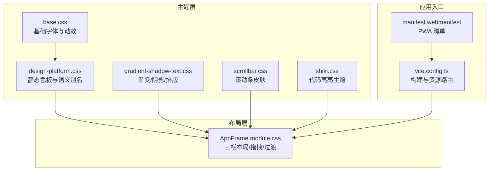
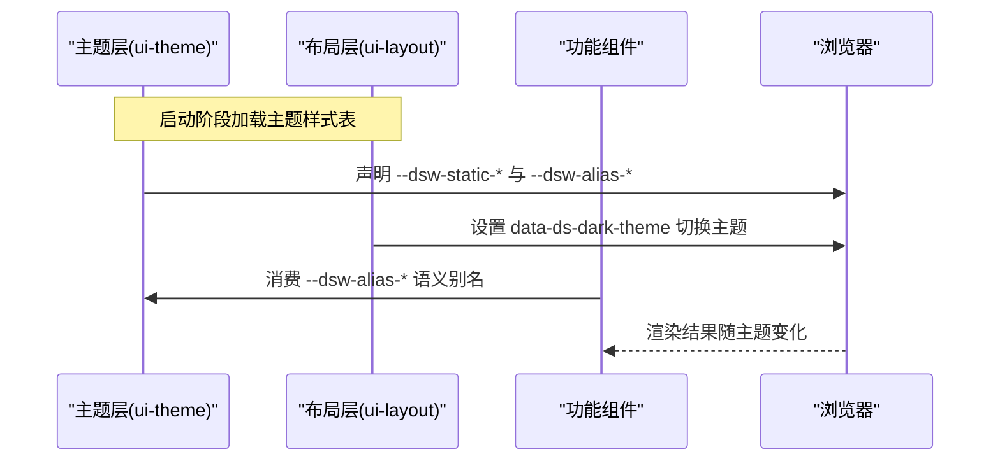
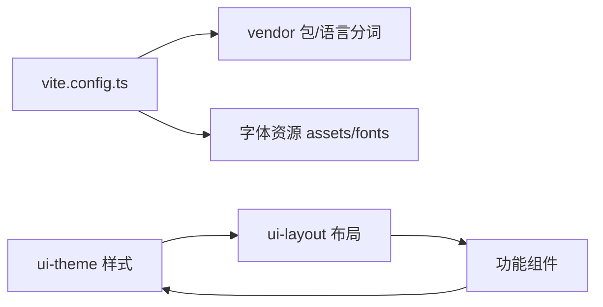

# 主题与样式定制

<cite>
**本文引用的文件**
- [apps/web/public/manifest.webmanifest](file://apps/web/public/manifest.webmanifest)
- [apps/web/vite.config.ts](file://apps/web/vite.config.ts)
- [packages/client/ui-theme/src/styles/base.css](file://packages/client/ui-theme/src/styles/base.css)
- [packages/client/ui-theme/src/styles/design-platform.css](file://packages/client/ui-theme/src/styles/design-platform.css)
- [packages/client/ui-theme/src/styles/gradient-shadow-text.css](file://packages/client/ui-theme/src/styles/gradient-shadow-text.css)
- [packages/client/ui-theme/src/styles/scrollbar.css](file://packages/client/ui-theme/src/styles/scrollbar.css)
- [packages/client/ui-theme/src/styles/shiki.css](file://packages/client/ui-theme/src/styles/shiki.css)
- [packages/client/ui-layout/src/client/AppFrame.module.css](file://packages/client/ui-layout/src/client/AppFrame.module.css)
- [docs/web-styling.md](file://docs/web-styling.md)
- [docs/web-styling.zh.md](file://docs/web-styling.zh.md)
</cite>

## 目录
1. [简介](#简介)
2. [项目结构](#项目结构)
3. [核心组件](#核心组件)
4. [架构总览](#架构总览)
5. [详细组件分析](#详细组件分析)
6. [依赖关系分析](#依赖关系分析)
7. [性能考虑](#性能考虑)
8. [故障排查指南](#故障排查指南)
9. [结论](#结论)
10. [附录](#附录)

## 简介
本指南面向希望为 DeepSeek Harness Web 界面进行品牌化与个性化定制的开发者，系统讲解样式系统的架构设计、主题变量体系、组件样式组织方式、响应式与移动端适配策略，以及 PWA 配置与图标管理。文档基于仓库中的实际源码与配置，提供可操作的定制路径与最佳实践，帮助你在不破坏既有样式契约的前提下完成主题扩展。

## 项目结构
DeepSeek Harness 的 Web 样式由“主题层”和“布局层”共同构成：
- 主题层（ui-theme）：集中定义静态色板、语义别名、排版、动效、渐变、阴影、滚动条皮肤与明暗主题偏好。
- 布局层（ui-layout）：将解析后的主题快照应用到文档，承载页面骨架与栅格布局。
- 功能组件：以 CSS Modules 就近组织样式，消费语义别名，不自行定义全局主题。

图表来源
- [packages/client/ui-theme/src/styles/base.css:1-16](file://packages/client/ui-theme/src/styles/base.css#L1-L16)
- [packages/client/ui-theme/src/styles/design-platform.css:1-339](file://packages/client/ui-theme/src/styles/design-platform.css#L1-L339)
- [packages/client/ui-theme/src/styles/gradient-shadow-text.css:1-233](file://packages/client/ui-theme/src/styles/gradient-shadow-text.css#L1-L233)
- [packages/client/ui-theme/src/styles/scrollbar.css:1-91](file://packages/client/ui-theme/src/styles/scrollbar.css#L1-L91)
- [packages/client/ui-theme/src/styles/shiki.css:1-32](file://packages/client/ui-theme/src/styles/shiki.css#L1-L32)
- [packages/client/ui-layout/src/client/AppFrame.module.css:1-120](file://packages/client/ui-layout/src/client/AppFrame.module.css#L1-L120)
- [apps/web/vite.config.ts:92-160](file://apps/web/vite.config.ts#L92-L160)
- [apps/web/public/manifest.webmanifest:1-17](file://apps/web/public/manifest.webmanifest#L1-L17)

章节来源
- [docs/web-styling.zh.md:1-26](file://docs/web-styling.zh.md#L1-L26)
- [docs/web-styling.md:1-26](file://docs/web-styling.md#L1-L26)

## 核心组件
- 基础变量与动效（base.css）
  - 定义全局字体栈与代码字体栈，统一缓动曲线与过渡时长，确保跨平台一致的视觉节奏。
- 静态色板与语义别名（design-platform.css）
  - 在根节点声明大量 --dsw-static-* 静态色值；通过 --dsw-alias-* 语义别名组合出背景、边框、文字、状态、按钮、遮罩等用途。
  - 使用 body[data-ds-dark-theme] 切换深色模式下的别名映射，实现统一的明暗主题覆盖。
- 渐变、阴影与排版（gradient-shadow-text.css）
  - 提供思考区渐变、层级阴影、模糊遮罩等视觉增强。
  - 集中定义 Markdown 与通用字号/行高/字重组合，便于组件复用。
- 滚动条皮肤（scrollbar.css）
  - 通过标准属性与 WebKit 伪元素双路径兼容不同浏览器，读取 --dsh-scrollbar-thumb 等间接变量，支持表面层级提升时重新绑定颜色。
- 代码高亮主题（shiki.css）
  - 将 Shiki 的 --shiki-* 变量映射到语义别名，保证代码块与正文区块的背景/前景一致，并支持深色模式覆盖。
- 布局框架（AppFrame.module.css）
  - 使用 CSS Grid 构建三栏布局，配合自定义属性驱动过渡动画；拖拽手柄与细节面板折叠交互遵循减少动效与可访问性要求。

章节来源
- [packages/client/ui-theme/src/styles/base.css:1-16](file://packages/client/ui-theme/src/styles/base.css#L1-L16)
- [packages/client/ui-theme/src/styles/design-platform.css:1-339](file://packages/client/ui-theme/src/styles/design-platform.css#L1-L339)
- [packages/client/ui-theme/src/styles/gradient-shadow-text.css:1-233](file://packages/client/ui-theme/src/styles/gradient-shadow-text.css#L1-L233)
- [packages/client/ui-theme/src/styles/scrollbar.css:1-91](file://packages/client/ui-theme/src/styles/scrollbar.css#L1-L91)
- [packages/client/ui-theme/src/styles/shiki.css:1-32](file://packages/client/ui-theme/src/styles/shiki.css#L1-L32)
- [packages/client/ui-layout/src/client/AppFrame.module.css:1-120](file://packages/client/ui-layout/src/client/AppFrame.module.css#L1-L120)

## 架构总览
样式系统采用“静态色板 → 语义别名 → 组件消费”的分层模型，并通过数据属性切换明暗主题。布局层负责将主题快照应用到文档，功能组件仅消费语义别名，避免直接引用静态色值或主题选择器。

图表来源
- [packages/client/ui-theme/src/styles/design-platform.css:156-339](file://packages/client/ui-theme/src/styles/design-platform.css#L156-L339)
- [packages/client/ui-layout/src/client/AppFrame.module.css:1-120](file://packages/client/ui-layout/src/client/AppFrame.module.css#L1-L120)

## 详细组件分析

### 主题变量与语义别名体系
- 静态色板
  - 在根节点集中声明多组 --dsw-static-* 色值，涵盖中性、品牌、成功、警告、错误等色系。
- 语义别名
  - 通过 --dsw-alias-* 将静态色值按用途抽象为“背景、边框、文字、状态、按钮、遮罩、滚动条”等角色。
  - 深色模式下通过 body[data-ds-dark-theme] 覆盖别名映射，保持组件无需感知主题分支。
- 建议
  - 新增品牌色时，优先添加新的静态色值，再派生语义别名，供组件消费。
  - 避免在组件中硬编码颜色字面量，确保主题一致性。

章节来源
- [packages/client/ui-theme/src/styles/design-platform.css:1-339](file://packages/client/ui-theme/src/styles/design-platform.css#L1-L339)

### 字体与排版
- 基础字体栈
  - 定义系统级字体栈与代码字体栈，兼顾跨平台可读性与 CJK 显示。
- 排版变量
  - 为 Markdown 标题、正文、表格、代码块等提供字号、行高、字重的完整组合，组件可直接复用。
- 建议
  - 新增排版角色时，保持字号与行高的配对关系，确保阅读节奏一致。

章节来源
- [packages/client/ui-theme/src/styles/base.css:1-16](file://packages/client/ui-theme/src/styles/base.css#L1-L16)
- [packages/client/ui-theme/src/styles/gradient-shadow-text.css:19-233](file://packages/client/ui-theme/src/styles/gradient-shadow-text.css#L19-L233)

### 渐变、阴影与遮罩
- 渐变
  - 提供思考区渐变与选中态渐变，区分明暗主题。
- 阴影
  - 多层级阴影变量用于卡片、弹窗、悬浮等场景，体现层级关系。
- 遮罩
  - 模糊遮罩与半透明遮罩用于模态、图片预览等场景。
- 建议
  - 根据交互层级选择合适的阴影等级，避免过度堆叠影响性能。

章节来源
- [packages/client/ui-theme/src/styles/gradient-shadow-text.css:1-18](file://packages/client/ui-theme/src/styles/gradient-shadow-text.css#L1-L18)

### 滚动条皮肤
- 双路径兼容
  - 标准属性 scrollbar-width/color 与 WebKit 伪元素 ::-webkit-scrollbar* 并存，确保跨引擎一致体验。
- 表面层级
  - 通过 --dsh-scrollbar-thumb 与 --dsh-scrollbar-thumb-hover 间接变量，允许菜单、弹窗等高阶表面提升滚动条颜色。
- 建议
  - 在高阶容器中重新绑定滚动条变量，以获得正确的悬浮态颜色。

章节来源
- [packages/client/ui-theme/src/styles/scrollbar.css:1-91](file://packages/client/ui-theme/src/styles/scrollbar.css#L1-L91)

### 代码高亮主题
- 变量映射
  - 将 Shiki 的 --shiki-* 变量映射到语义别名，保证代码块与正文区块风格一致。
- 深色模式
  - 在深色模式下覆盖关键字、字符串、注释等 token 颜色，提升对比度。
- 建议
  - 调整代码高亮配色时，优先修改语义别名，而非直接改动 Shiki 变量。

章节来源
- [packages/client/ui-theme/src/styles/shiki.css:1-32](file://packages/client/ui-theme/src/styles/shiki.css#L1-L32)

### 布局框架与交互
- 三栏布局
  - 使用 CSS Grid 组织侧边栏、主内容区与详情面板，支持拖拽调整宽度。
- 过渡与动效
  - 列宽变化与手柄位置移动使用统一的缓动曲线与时长，尊重 prefers-reduced-motion。
- 可访问性
  - 保留键盘焦点可见性，禁用不必要的动效以提升可访问性。
- 建议
  - 新增区域时沿用现有语义别名与过渡参数，确保视觉与交互一致性。

章节来源
- [packages/client/ui-layout/src/client/AppFrame.module.css:1-120](file://packages/client/ui-layout/src/client/AppFrame.module.css#L1-L120)

### 构建与资源路由
- 分包策略
  - 将数学、语法高亮、Markdown 解析等重型依赖抽离至 vendor 包，减少首屏体积。
- 资源分组
  - 语法分词按需懒加载，字体资源统一输出到 assets/fonts，便于缓存与版本控制。
- 建议
  - 新增第三方库时评估是否纳入 vendor 包，避免重复引入 React 导致打包膨胀。

章节来源
- [apps/web/vite.config.ts:21-128](file://apps/web/vite.config.ts#L21-L128)

### PWA 配置与图标管理
- 清单文件
  - manifest.webmanifest 定义应用名称、短名称、启动路径、作用域、显示模式与图标。
- 图标
  - 当前使用 SVG 图标，适用于任意尺寸；可按需补充 PNG 等多格式以满足不同平台需求。
- 建议
  - 结合站点部署路径更新 start_url 与 scope，确保离线与安装体验一致。

章节来源
- [apps/web/public/manifest.webmanifest:1-17](file://apps/web/public/manifest.webmanifest#L1-L17)

## 依赖关系分析
样式与构建之间的依赖关系如下：
- 主题层提供变量与规则，布局层消费这些变量构建页面骨架。
- 功能组件仅消费语义别名，不直接依赖静态色值或主题选择器。
- 构建配置决定第三方依赖与资源的打包与输出路径，影响主题相关资源（如字体）的加载。

图表来源
- [apps/web/vite.config.ts:92-160](file://apps/web/vite.config.ts#L92-L160)
- [packages/client/ui-theme/src/styles/design-platform.css:156-339](file://packages/client/ui-theme/src/styles/design-platform.css#L156-L339)
- [packages/client/ui-layout/src/client/AppFrame.module.css:1-120](file://packages/client/ui-layout/src/client/AppFrame.module.css#L1-L120)

章节来源
- [apps/web/vite.config.ts:21-160](file://apps/web/vite.config.ts#L21-L160)

## 性能考虑
- 减少主题切换开销
  - 通过数据属性切换主题，避免频繁替换样式表；语义别名集中声明，降低重排与重绘。
- 合理分包
  - 将重型依赖放入 vendor 包，利用浏览器缓存；语法分词按需懒加载，减少首屏体积。
- 字体与资源
  - 字体资源统一输出到独立目录，便于缓存命中；避免在组件中内联大段样式。
- 动效与可访问性
  - 尊重 prefers-reduced-motion，避免在低端设备上触发昂贵动画。

[本节为通用指导，不直接分析具体文件]

## 故障排查指南
- 滚动条颜色异常
  - 检查是否在高阶容器（菜单、弹窗）中重新绑定了 --dsh-scrollbar-thumb 与 --dsh-scrollbar-thumb-hover。
  - 确认未对容器设置会抑制伪元素的 scrollbar-width/scrollbar-color 值。
- 主题切换无效
  - 确认 body 上已正确设置 data-ds-dark-theme，且语义别名在该选择器下被覆盖。
- 代码高亮不一致
  - 检查 shiki.css 中的 --shiki-* 是否映射到正确的语义别名，并确保深色模式覆盖生效。
- 布局过渡卡顿
  - 检查是否在拖拽期间禁用了过渡（frame[data-dragging]），并确认缓动曲线与时长合理。

章节来源
- [packages/client/ui-theme/src/styles/scrollbar.css:1-91](file://packages/client/ui-theme/src/styles/scrollbar.css#L1-L91)
- [packages/client/ui-theme/src/styles/design-platform.css:156-339](file://packages/client/ui-theme/src/styles/design-platform.css#L156-L339)
- [packages/client/ui-theme/src/styles/shiki.css:1-32](file://packages/client/ui-theme/src/styles/shiki.css#L1-L32)
- [packages/client/ui-layout/src/client/AppFrame.module.css:1-120](file://packages/client/ui-layout/src/client/AppFrame.module.css#L1-L120)

## 结论
DeepSeek Harness 的样式系统通过“静态色板 + 语义别名 + 布局快照”的分层架构，实现了清晰的主题管理与灵活的定制能力。遵循职责归属与组件规则，可以在不破坏既有契约的前提下完成品牌化与个性化外观。结合构建优化与 PWA 配置，可进一步提升性能与用户体验。

[本节为总结性内容，不直接分析具体文件]

## 附录

### 自定义主题的最佳实践
- 新增品牌色
  - 在主题层添加新的 --dsw-static-* 色值，随后派生出 --dsw-alias-* 语义别名，供组件消费。
- 字体与排版
  - 调整字体栈与字号/行高组合时，保持角色命名一致，确保组件可复用。
- 滚动条与高亮
  - 通过语义别名统一调整滚动条与代码高亮配色，避免分散维护。
- 主题隔离
  - 组件样式使用 CSS Modules，避免全局污染；主题选择器仅在主题层使用。
- 兼容性
  - 滚动条双路径兼容、减少动效与可访问性要求已在主题与布局层内置，定制时请保持一致。

[本节为通用指导，不直接分析具体文件]

### 实际定制示例（步骤指引）
- 更换主色调
  - 在主题层新增品牌色静态值，并在语义别名中将主按钮、主文本等指向新色值；刷新页面即可生效。
- 切换深色模式默认
  - 在布局层初始化时设置 body 的数据属性为深色模式；所有语义别名自动切换到深色映射。
- 调整代码高亮
  - 修改 shiki.css 中的 token 映射，使其与新的语义别名一致；深色模式覆盖同样生效。
- 优化首屏体积
  - 将新增的重型依赖加入 vendor 包；确保语法分词按需懒加载。
- 完善 PWA
  - 更新 manifest.webmanifest 的图标与显示模式，确保安装后全屏体验一致。

[本节为通用指导，不直接分析具体文件]