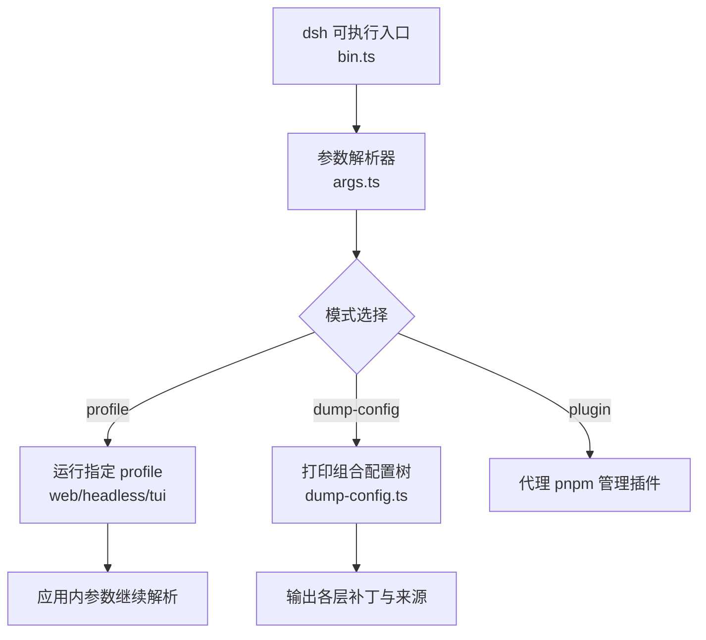
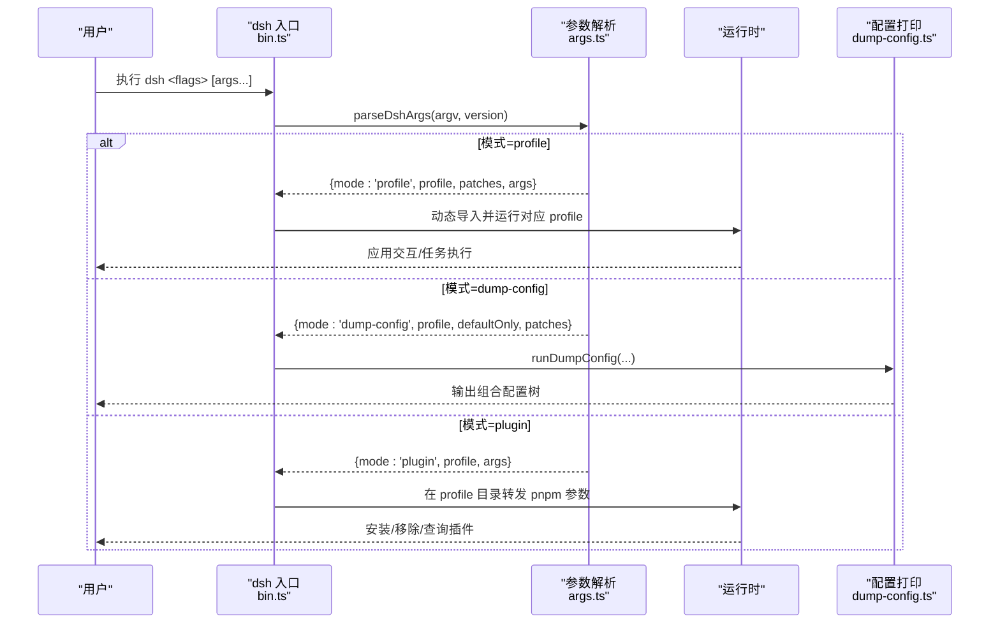
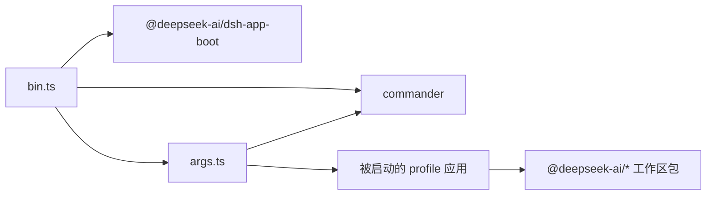

# 命令行界面

<cite>
**本文引用的文件**
- [apps/cli/src/bin.ts](file://apps/cli/src/bin.ts)
- [apps/cli/src/args.ts](file://apps/cli/src/args.ts)
- [apps/cli/src/dump-config.ts](file://apps/cli/src/dump-config.ts)
- [apps/cli/README.md](file://apps/cli/README.md)
- [apps/cli/package.json](file://apps/cli/package.json)
- [apps/cli/config/agent-presets/standard/preset.yml](file://apps/cli/config/agent-presets/standard/preset.yml)
- [apps/cli/config/agent-presets/minimal/preset.yml](file://apps/cli/config/agent-presets/minimal/preset.yml)
- [apps/cli/config/agent-presets/code/preset.yml](file://apps/cli/config/agent-presets/code/preset.yml)
- [apps/cli/config/agent-presets/standard/agent.cordis.yml](file://apps/cli/config/agent-presets/standard/agent.cordis.yml)
- [apps/cli/config/agent-presets/minimal/agent.cordis.yml](file://apps/cli/config/agent-presets/minimal/agent.cordis.yml)
- [apps/cli/config/agent-presets/code/agent.cordis.yml](file://apps/cli/config/agent-presets/code/agent.cordis.yml)
</cite>

## 目录
1. [简介](#简介)
2. [项目结构](#项目结构)
3. [核心组件](#核心组件)
4. [架构总览](#架构总览)
5. [详细组件分析](#详细组件分析)
6. [依赖关系分析](#依赖关系分析)
7. [性能注意事项](#性能注意事项)
8. [故障排除指南](#故障排除指南)
9. [结论](#结论)
10. [附录](#附录)

## 简介
本文件面向 DeepSeek Harness 的命令行界面（CLI），聚焦 dsh 命令的使用与定制。内容涵盖：
- 命令结构与参数选项，包括 web、headless、plugin、dump-config 等
- 配置文件与预设系统的工作原理，内置与自定义预设的配置方法
- Agent 预设的管理与使用，标准、最小化、代码模式的特点
- 常用工作流示例，快速启动不同类型的 Agent 会话
- 常见问题的排查与解决

## 项目结构
CLI 入口由 bin.ts 负责分发到不同模式；参数解析由 args.ts 完成；配置树打印由 dump-config.ts 提供。预设位于 apps/cli/config/agent-presets 下，包含 standard、minimal、code 三种内置预设及其描述与组合定义。

图表来源
- [apps/cli/src/bin.ts:1-54](file://apps/cli/src/bin.ts#L1-L54)
- [apps/cli/src/args.ts:112-190](file://apps/cli/src/args.ts#L112-L190)
- [apps/cli/src/dump-config.ts:1-54](file://apps/cli/src/dump-config.ts#L1-L54)

章节来源
- [apps/cli/src/bin.ts:1-54](file://apps/cli/src/bin.ts#L1-L54)
- [apps/cli/src/args.ts:1-192](file://apps/cli/src/args.ts#L1-L192)
- [apps/cli/src/dump-config.ts:1-54](file://apps/cli/src/dump-config.ts#L1-L54)
- [apps/cli/README.md:1-48](file://apps/cli/README.md#L1-L48)

## 核心组件
- 入口分发器：读取版本、解析参数、按模式动态加载对应模块并执行
- 参数解析器：声明 dsh 自身标志（--profile、--patch、--dump-config、--dump-default-config），以及子命令 web、plugin；将剩余参数透传给被启动的应用
- 配置打印器：在不启动应用的情况下，按层渲染组合后的补丁树，便于诊断与审计
- 预设系统：通过 preset.yml 描述名称、说明与排序；通过 agent.cordis.yml 声明工具、技能、计划模式、压缩、工作流等能力

章节来源
- [apps/cli/src/bin.ts:11-53](file://apps/cli/src/bin.ts#L11-L53)
- [apps/cli/src/args.ts:20-48](file://apps/cli/src/args.ts#L20-L48)
- [apps/cli/src/dump-config.ts:21-52](file://apps/cli/src/dump-config.ts#L21-L52)
- [apps/cli/config/agent-presets/standard/preset.yml:1-4](file://apps/cli/config/agent-presets/standard/preset.yml#L1-L4)
- [apps/cli/config/agent-presets/minimal/preset.yml:1-4](file://apps/cli/config/agent-presets/minimal/preset.yml#L1-L4)
- [apps/cli/config/agent-presets/code/preset.yml:1-4](file://apps/cli/config/agent-presets/code/preset.yml#L1-L4)

## 架构总览
dsh 作为“引导器”，只解析自身标志，随后把控制权交给所选 profile 或子命令。web 是 --profile web 的别名；plugin 将参数转发给 pnpm；dump-config 仅打印配置树。

图表来源
- [apps/cli/src/bin.ts:27-53](file://apps/cli/src/bin.ts#L27-L53)
- [apps/cli/src/args.ts:112-190](file://apps/cli/src/args.ts#L112-L190)
- [apps/cli/src/dump-config.ts:30-52](file://apps/cli/src/dump-config.ts#L30-L52)

## 详细组件分析

### 命令与参数
- 顶层命令
  - dsh --profile <name>：启动指定 profile（如 web、headless、tui）。未提供时要求必须指定。
  - dsh --patch <path>：追加补丁覆盖层，可重复。
  - dsh --dump-config：打印组合后的 profile 配置树并退出。
  - dsh --dump-default-config：仅打印 bundle 层（不含用户层与 --patch），用于查看默认装配。
  - dsh -V/--version：输出版本号。
- 子命令
  - dsh web：等价于 --profile web，其后参数由 web 应用解析。
  - dsh plugin --profile <name> <pnpm args>：在 profile 目录下转发 pnpm 操作（add/remove/why 等）。
- 参数优先级与传递
  - 先解析 dsh 自身标志，遇到未知 token 即停止，后续全部透传给被启动的应用。
  - --patch 以 argv 顺序叠加，最后生效。
  - --dump-config 与 --dump-default-config 互斥；后者不接受任何应用参数与 --patch。

章节来源
- [apps/cli/src/args.ts:50-103](file://apps/cli/src/args.ts#L50-L103)
- [apps/cli/src/args.ts:112-190](file://apps/cli/src/args.ts#L112-L190)
- [apps/cli/README.md:18-43](file://apps/cli/README.md#L18-L43)

### 配置文件与组合规则
- Profile 目录结构
  - package.json：声明 out-of-tree 插件依赖与 profile 清单（bundles 列表）
  - cordis.patch.yml：用户自定义补丁层
- 组合顺序（从空根开始）
  - bundles 中每个包的补丁（按顺序）
  - profile 自身的 cordis.patch.yml
  - 家级 $DSH_HOME/cordis.patch.yml
  - 命令行 --patch 指定的覆盖层（按 argv 顺序）
- 调试
  - 使用 --dump-default-config 查看 bundle 层
  - 使用 --dump-config 查看完整组合（含用户层与 --patch）

章节来源
- [apps/cli/README.md:30-43](file://apps/cli/README.md#L30-L43)
- [apps/cli/src/dump-config.ts:21-52](file://apps/cli/src/dump-config.ts#L21-L52)

### 预设系统（Agent Presets）
- 内置预设
  - 标准模式：功能完整的编码 Agent，支持文件编辑、Shell、搜索、Skills、计划、目标、子代理与工作流
  - 极简模式：仅提供持久 bash 与 str_replace_editor 的双工具编码 Agent
  - 代码模式：具备标准模式全部能力，并通过 Code Mode SDK 呈现工具，让模型用 TypeScript 程序组合多步操作
- 元数据
  - preset.yml 中的 name、description、order 控制显示与排序
- 组合定义
  - agent.cordis.yml 声明 persona、工具、技能、计划模式、压缩、工作流等
  - 标准/代码模式启用更多能力；极简模式保持最小工具集
- 管理与使用
  - 可通过设置选择默认预设
  - 可复制内置预设为自定义 ID，并在会话中锁定使用的预设

章节来源
- [apps/cli/config/agent-presets/standard/preset.yml:1-4](file://apps/cli/config/agent-presets/standard/preset.yml#L1-L4)
- [apps/cli/config/agent-presets/minimal/preset.yml:1-4](file://apps/cli/config/agent-presets/minimal/preset.yml#L1-L4)
- [apps/cli/config/agent-presets/code/preset.yml:1-4](file://apps/cli/config/agent-presets/code/preset.yml#L1-L4)
- [apps/cli/config/agent-presets/standard/agent.cordis.yml:1-252](file://apps/cli/config/agent-presets/standard/agent.cordis.yml#L1-L252)
- [apps/cli/config/agent-presets/minimal/agent.cordis.yml:1-63](file://apps/cli/config/agent-presets/minimal/agent.cordis.yml#L1-L63)
- [apps/cli/config/agent-presets/code/agent.cordis.yml:1-263](file://apps/cli/config/agent-presets/code/agent.cordis.yml#L1-L263)

### 常用工作流示例
- 启动 Web 界面
  - dsh web
  - dsh web --help（查看 web 应用自身参数）
- 运行一次性 Headless 任务
  - dsh --profile headless "run the tests"
- 启动 TUI（终端界面）
  - dsh --profile tui --resume <session-id>
- 附加补丁层
  - dsh --profile web --patch ./extra.yml
- 查看组合配置
  - dsh --profile web --dump-config
  - dsh --profile web --dump-default-config
- 管理插件
  - dsh plugin --profile tui add <package>

章节来源
- [apps/cli/README.md:7-28](file://apps/cli/README.md#L7-L28)
- [apps/cli/src/args.ts:64-72](file://apps/cli/src/args.ts#L64-L72)

### 错误处理与健壮性
- 参数校验
  - 缺少 --profile 时报错
  - --patch 需要路径，空值报错
  - --dump-config 与 --dump-default-config 互斥
  - 配置打印模式不接受应用参数
- 子命令保护
  - plugin/web 子命令拒绝父级选项混用
- 退出行为
  - 无效命令、选项冲突、配置错误、启动失败均非零退出
  - 帮助与版本信息直接输出并退出

章节来源
- [apps/cli/src/args.ts:83-103](file://apps/cli/src/args.ts#L83-L103)
- [apps/cli/src/args.ts:147-180](file://apps/cli/src/args.ts#L147-L180)
- [apps/cli/src/args.ts:183-190](file://apps/cli/src/args.ts#L183-L190)
- [apps/cli/README.md:5-6](file://apps/cli/README.md#L5-L6)

## 依赖关系分析
- 包入口
  - 可执行名 dsh 指向 lib/bin.js（构建产物）
- 运行时依赖
  - commander：命令行解析
  - js-yaml：YAML 解析
  - 大量 @deepseek-ai/* 工作区包：提供 base、web-app、headless、terminal、tools、compaction、workflow 等能力
- 开发依赖
  - 测试与构建相关工具链（如 execa、类型与测试框架）

图表来源
- [apps/cli/package.json:14-84](file://apps/cli/package.json#L14-L84)
- [apps/cli/src/bin.ts:11-15](file://apps/cli/src/bin.ts#L11-L15)
- [apps/cli/src/args.ts:18-19](file://apps/cli/src/args.ts#L18-L19)

章节来源
- [apps/cli/package.json:1-102](file://apps/cli/package.json#L1-L102)

## 性能注意事项
- 按需加载：bin.ts 根据模式动态 import 对应模块，避免无关模式进入启动路径
- 配置打印不启动应用：dump-config 仅组合并渲染补丁树，适合快速诊断
- 补丁层数量与复杂度会影响组合时间；建议精简 --patch 与用户层
- 预设能力越多（如工作流、子代理、压缩），初始化工具与服务越多，首次启动开销相应增加

[本节为通用指导，无需特定文件引用]

## 故障排除指南
- 无法识别的参数或命令
  - 确认 dsh 自身标志在前，应用参数在后；使用 dsh --help 查看引导器帮助，使用 dsh web --help 查看 web 帮助
- 缺少 --profile
  - 显式指定 --profile <name>，或使用 dsh web 别名
- 配置打印异常
  - 使用 --dump-default-config 仅查看 bundle 层，定位是否为用户层或 --patch 引入的问题
- 插件管理失败
  - 确保在正确的 profile 目录执行 dsh plugin --profile <name> ...
- 预设相关问题
  - 检查 preset.yml 的 name/description/order 是否合法
  - 若复制预设后权限不足，注意生成文件的访问权限
  - 会话创建后锁定预设，切换需新建会话

章节来源
- [apps/cli/src/args.ts:83-103](file://apps/cli/src/args.ts#L83-L103)
- [apps/cli/src/args.ts:147-180](file://apps/cli/src/args.ts#L147-L180)
- [apps/cli/src/dump-config.ts:30-52](file://apps/cli/src/dump-config.ts#L30-L52)
- [apps/cli/README.md:5-6](file://apps/cli/README.md#L5-L6)

## 结论
dsh CLI 通过清晰的参数边界与分层组合机制，让用户以最小成本启动 web、headless、tui 等场景，并通过预设系统快速获得一致的 Agent 能力集合。借助 --dump-config 与 --dump-default-config，可以高效诊断配置问题；通过 plugin 子命令管理扩展能力。遵循本文的工作流与排障建议，可稳定高效地使用 DeepSeek Harness 命令行界面。

## 附录

### 预设对比速览
- 标准模式：全面能力，适合大多数编码任务
- 极简模式：仅保留必要工具，适合轻量、受控环境
- 代码模式：在标准基础上提供 Code Mode 呈现，提升复杂任务的表达效率

章节来源
- [apps/cli/config/agent-presets/standard/preset.yml:1-4](file://apps/cli/config/agent-presets/standard/preset.yml#L1-L4)
- [apps/cli/config/agent-presets/minimal/preset.yml:1-4](file://apps/cli/config/agent-presets/minimal/preset.yml#L1-L4)
- [apps/cli/config/agent-presets/code/preset.yml:1-4](file://apps/cli/config/agent-presets/code/preset.yml#L1-L4)