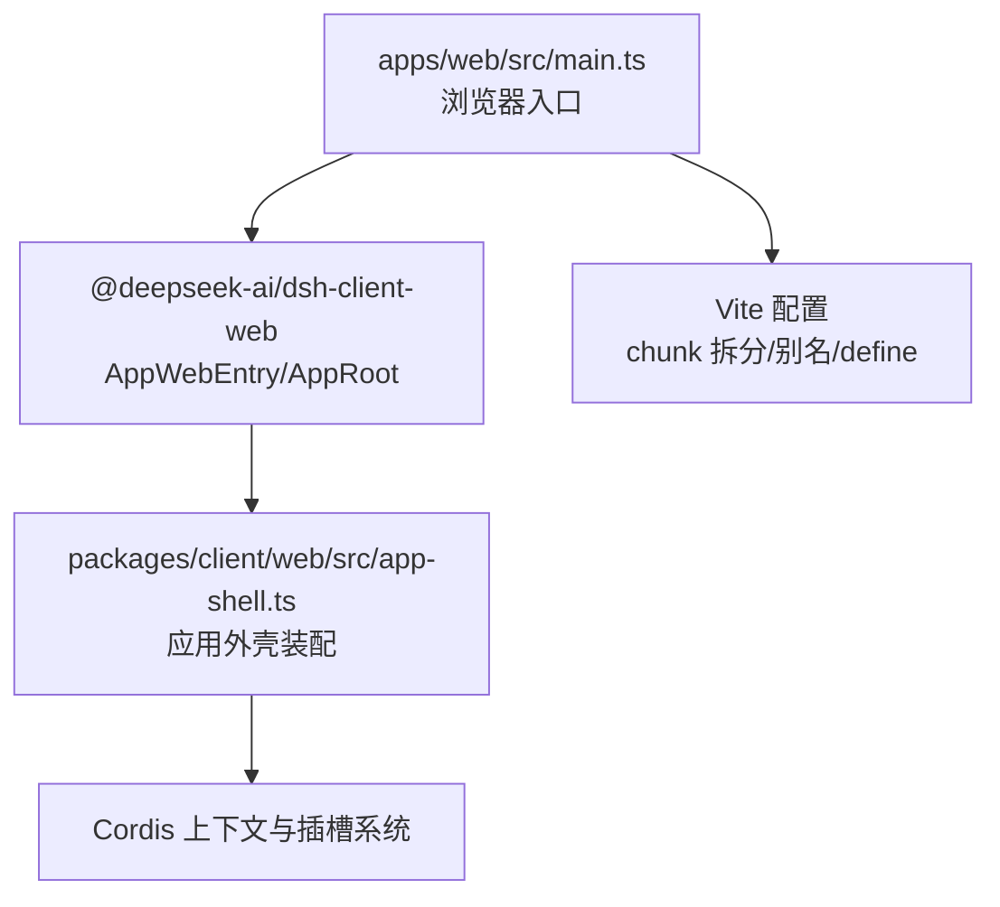
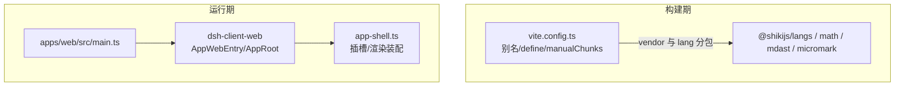
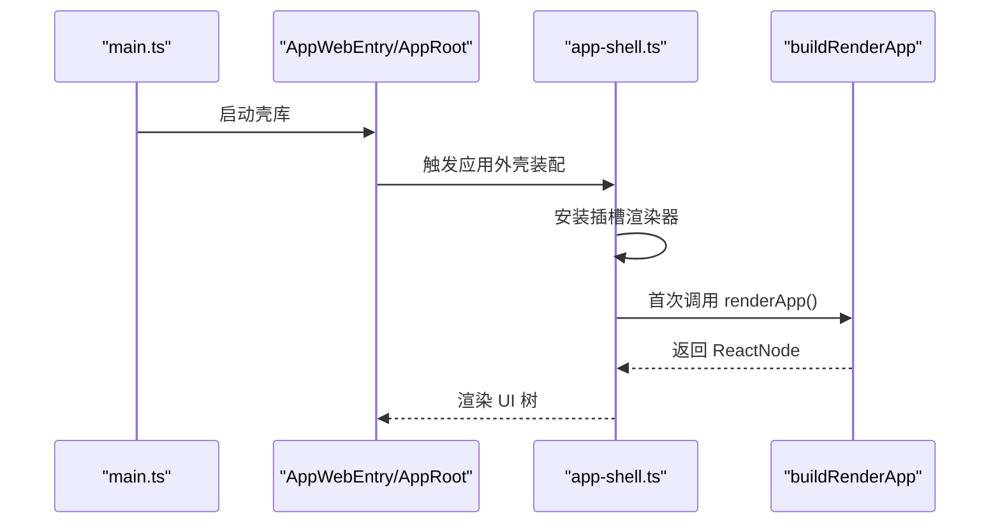
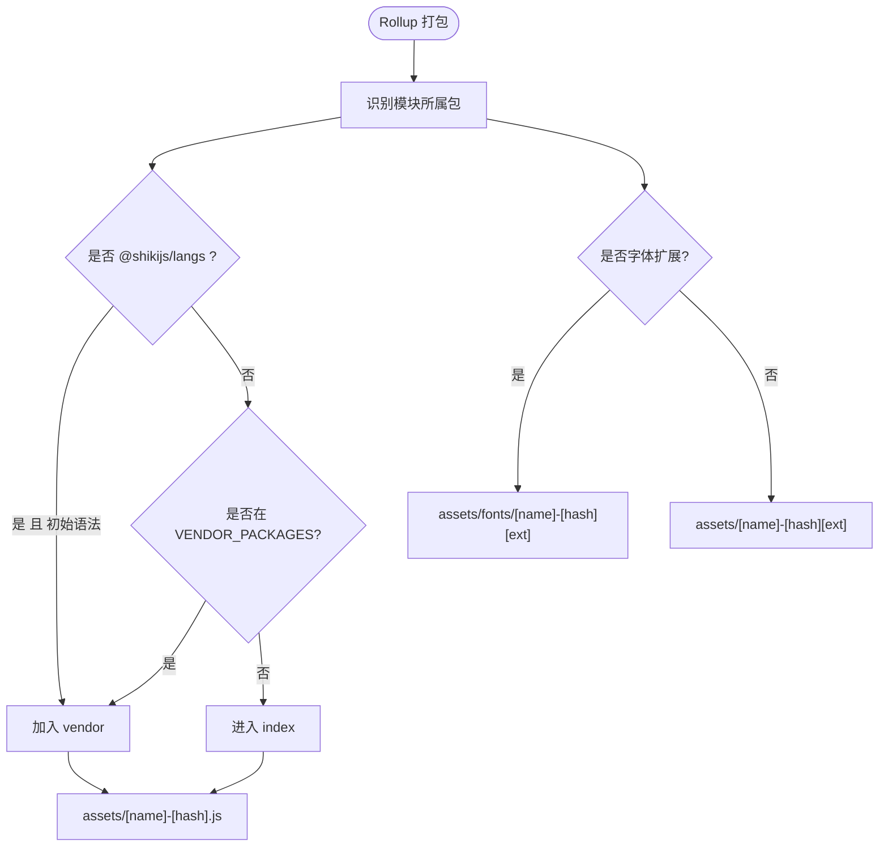
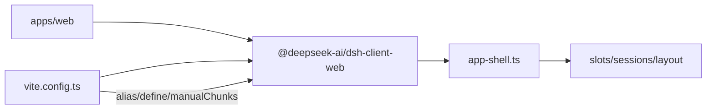

# 用户界面

<cite>
**本文引用的文件**
- [apps/web/src/main.ts](file://apps/web/src/main.ts)
- [apps/web/vite.config.ts](file://apps/web/vite.config.ts)
- [packages/client/web/src/index.ts](file://packages/client/web/src/index.ts)
- [packages/client/web/src/app-shell.ts](file://packages/client/web/src/app-shell.ts)
- [docs/web-styling.md](file://docs/web-styling.md)
- [apps/cli/README.md](file://apps/cli/README.md)
- [apps/cli/config/agent-presets/standard/preset.yml](file://apps/cli/config/agent-presets/standard/preset.yml)
- [apps/cli/config/agent-presets/code/preset.yml](file://apps/cli/config/agent-presets/code/preset.yml)
</cite>

## 目录
1. [简介](#简介)
2. [项目结构](#项目结构)
3. [核心组件](#核心组件)
4. [架构总览](#架构总览)
5. [详细组件分析](#详细组件分析)
6. [依赖关系分析](#依赖关系分析)
7. [性能考量](#性能考量)
8. [故障排查指南](#故障排查指南)
9. [结论](#结论)
10. [附录](#附录)

## 简介
本文件面向 DeepSeek Harness 的用户界面，聚焦 Web 应用的架构设计、React 组件组织、状态与实时通信机制、命令行界面（CLI）功能与用法、预设系统与模板机制、主题定制与样式覆盖方法，以及界面自定义最佳实践与性能优化建议。文档同时提供可追溯的源码路径，便于读者快速定位实现细节。

## 项目结构
Web 应用采用“薄入口 + 壳库”的组织方式：
- apps/web 是 Vite 构建产物与入口，仅负责挂载 React 根节点并启动壳库。
- packages/client/web 提供 Web Shell 库，导出 AppWebEntry、AppRoot、渲染装配器、文档标题、应用外壳服务、静态模块注入与加载状态等能力。
- apps/cli 提供统一的命令入口与 Profile 机制，支持 web、headless 等运行模式，并通过预设与补丁层组合行为。

图表来源
- [apps/web/src/main.ts:1-11](file://apps/web/src/main.ts#L1-L11)
- [packages/client/web/src/index.ts:1-21](file://packages/client/web/src/index.ts#L1-L21)
- [packages/client/web/src/app-shell.ts:1-51](file://packages/client/web/src/app-shell.ts#L1-L51)
- [apps/web/vite.config.ts:92-160](file://apps/web/vite.config.ts#L92-L160)

章节来源
- [apps/web/src/main.ts:1-11](file://apps/web/src/main.ts#L1-L11)
- [apps/web/vite.config.ts:1-161](file://apps/web/vite.config.ts#L1-L161)
- [packages/client/web/src/index.ts:1-21](file://packages/client/web/src/index.ts#L1-L21)

## 核心组件
- 应用入口与挂载
  - 浏览器入口在 #root 节点上创建并运行 AppWebEntry，完成壳库初始化。
- 应用外壳装配
  - app-shell 插件安装插槽渲染器，并提供 renderApp 以一次性组装并渲染真实 UI 树。
- 导出能力
  - 对外暴露 AppWebEntry、AppRoot、buildRenderApp、DocumentTitle、APP_SHELL_ID、加载状态信号与存储等。

章节来源
- [apps/web/src/main.ts:1-11](file://apps/web/src/main.ts#L1-L11)
- [packages/client/web/src/app-shell.ts:1-51](file://packages/client/web/src/app-shell.ts#L1-L51)
- [packages/client/web/src/index.ts:1-21](file://packages/client/web/src/index.ts#L1-L21)

## 架构总览
Web 应用通过 Vite 构建，将重型第三方库（数学、语法高亮、Markdown 解析等）抽取为 vendor chunk，并将初始语法表内联到 vendor，其余按需懒加载；同时通过别名将工作区内的 client 包指向源码，以便 CSS 走 Vite 管线。

图表来源
- [apps/web/vite.config.ts:21-74](file://apps/web/vite.config.ts#L21-L74)
- [apps/web/vite.config.ts:92-160](file://apps/web/vite.config.ts#L92-L160)
- [apps/web/src/main.ts:1-11](file://apps/web/src/main.ts#L1-L11)
- [packages/client/web/src/app-shell.ts:1-51](file://packages/client/web/src/app-shell.ts#L1-L51)

## 详细组件分析

### 应用外壳与渲染装配
- 职责
  - 安装插槽渲染器，使 Cordis 插槽可在 React 中渲染。
  - 提供 AppShellService.renderApp，惰性构建并返回一次性的 UI 树。
- 关键点
  - 通过 inject 声明依赖 slots/sessions/layout，确保顺序。
  - 使用 ctx.reflect.provide 暴露给宿主图。

图表来源
- [apps/web/src/main.ts:1-11](file://apps/web/src/main.ts#L1-L11)
- [packages/client/web/src/app-shell.ts:1-51](file://packages/client/web/src/app-shell.ts#L1-L51)
- [packages/client/web/src/index.ts:1-21](file://packages/client/web/src/index.ts#L1-L21)

章节来源
- [packages/client/web/src/app-shell.ts:1-51](file://packages/client/web/src/app-shell.ts#L1-L51)
- [packages/client/web/src/index.ts:1-21](file://packages/client/web/src/index.ts#L1-L21)

### 构建与分包策略（vendor/lang/fonts）
- 目标
  - 将稳定且体积大的第三方库放入 vendor，减少频繁变更时的缓存失效。
  - 将 @shikijs/langs 的初始语法表归入 vendor，其他语法按需懒加载。
  - 字体资源按扩展名路由至 assets/fonts。
- 关键机制
  - manualChunks 基于 npm 包名与模块路径判断归属。
  - chunkFileNames 与 assetFileNames 控制输出布局。
  - define 替换 process 相关常量，屏蔽 Node 分支。

图表来源
- [apps/web/vite.config.ts:21-74](file://apps/web/vite.config.ts#L21-L74)
- [apps/web/vite.config.ts:92-160](file://apps/web/vite.config.ts#L92-L160)

章节来源
- [apps/web/vite.config.ts:21-74](file://apps/web/vite.config.ts#L21-L74)
- [apps/web/vite.config.ts:92-160](file://apps/web/vite.config.ts#L92-L160)

### 主题与样式体系
- 所有权
  - ui-theme 管理 --dsw-* 语义化令牌、排版、动效、阴影、滚动条与明暗偏好。
  - ui-layout 将主题快照应用到文档。
  - 功能组件消费语义令牌，不重复定义全局主题。
- 规则
  - 使用 CSS Modules 与 clsx；避免引入额外 UI 库或 Tailwind。
  - 组件样式就近放置；共享颜色/排版/动效放入主题包。
  - 保持键盘焦点可见性与 reduced-motion 兼容。
- 变更流程
  - 在 ui-theme 中添加或修改共享令牌，再由功能组件消费；公共样式契约变更时更新引用。

章节来源
- [docs/web-styling.md:1-26](file://docs/web-styling.md#L1-L26)

### 命令行界面（CLI）与 Profile
- 命令与模式
  - dsh --profile <name> 启动指定 Profile。
  - dsh web 等价于 --profile web。
  - dsh headless 用于无头执行任务。
- 参数传递
  - 先解析 dsh 自身标志，剩余参数交由被启动的应用解析。
- Profile 组合
  - 由 bundles 列表与 cordis.patch.yml 叠加组成，支持从安装目录与 profile 本地 node_modules 解析。
  - 可通过 --dump-default-config / --dump-config 查看组合结果。

章节来源
- [apps/cli/README.md:1-48](file://apps/cli/README.md#L1-L48)

### 预设系统与模板机制
- 内置预设
  - standard：功能完整的编码 Agent，包含文件编辑、Shell、检索、Skills、计划、目标、子代理与工作流。
  - code：标准模式基础上，通过 Code Mode SDK 呈现工具，让模型用 TypeScript 程序组合多步操作。
- 作用
  - 通过 preset.yml 描述名称、说明与排序，配合 Profile 与补丁层快速启用不同 Agent 行为。

章节来源
- [apps/cli/config/agent-presets/standard/preset.yml:1-4](file://apps/cli/config/agent-presets/standard/preset.yml#L1-L4)
- [apps/cli/config/agent-presets/code/preset.yml:1-4](file://apps/cli/config/agent-presets/code/preset.yml#L1-L4)

## 依赖关系分析
- 入口依赖
  - apps/web 依赖 @deepseek-ai/dsh-client-web，后者导出 AppWebEntry 与 AppRoot。
- 运行时装配
  - app-shell 插件依赖 slots/sessions/layout，并在上下文中提供 appShell.renderApp。
- 构建期依赖
  - vite.config.ts 通过 alias 将工作区 client 包映射到源码，确保 CSS 走 Vite 管线；通过 define 屏蔽 Node 分支；通过 manualChunks 控制分包。

图表来源
- [apps/web/src/main.ts:1-11](file://apps/web/src/main.ts#L1-L11)
- [packages/client/web/src/index.ts:1-21](file://packages/client/web/src/index.ts#L1-L21)
- [packages/client/web/src/app-shell.ts:1-51](file://packages/client/web/src/app-shell.ts#L1-L51)
- [apps/web/vite.config.ts:129-160](file://apps/web/vite.config.ts#L129-L160)

章节来源
- [apps/web/src/main.ts:1-11](file://apps/web/src/main.ts#L1-L11)
- [packages/client/web/src/index.ts:1-21](file://packages/client/web/src/index.ts#L1-L21)
- [packages/client/web/src/app-shell.ts:1-51](file://packages/client/web/src/app-shell.ts#L1-L51)
- [apps/web/vite.config.ts:129-160](file://apps/web/vite.config.ts#L129-L160)

## 性能考量
- 分包与缓存
  - 将稳定且体积大的第三方库放入 vendor，减少频繁变更导致的缓存失效。
  - 初始语法表放入 vendor，其他语法按需懒加载，降低首屏体积。
- 资源路由
  - 字体资源集中到 assets/fonts，利于浏览器缓存与 CDN 策略。
- 开发体验
  - 禁止独立 Vite serve，避免缺少引导清单导致的不一致行为；应通过 dsh web 启动。
- 样式与渲染
  - 遵循主题规范，避免在组件中硬编码颜色与排版，减少不必要的重绘与主题切换开销。
  - 合理使用 CSS Modules，避免全局样式污染。

章节来源
- [apps/web/vite.config.ts:21-74](file://apps/web/vite.config.ts#L21-L74)
- [apps/web/vite.config.ts:92-160](file://apps/web/vite.config.ts#L92-L160)
- [docs/web-styling.md:1-26](file://docs/web-styling.md#L1-L26)

## 故障排查指南
- 启动报错：缺少 #root 节点
  - 现象：浏览器入口找不到挂载点会抛出错误。
  - 处理：确保 HTML 中存在 id="root" 的元素。
- 独立 Vite 服务被拒绝
  - 现象：直接运行 Vite serve 会抛出错误，提示需通过 dsh web 启动。
  - 处理：使用 dsh web 或通过仓库脚本启动，以获得正确的引导环境。
- 样式异常
  - 现象：组件使用了非语义化的颜色或覆盖了主题选择器。
  - 处理：改为使用 --dsw-* 语义令牌，并在 ui-theme 中维护主题值。

章节来源
- [apps/web/src/main.ts:8-10](file://apps/web/src/main.ts#L8-L10)
- [apps/web/vite.config.ts:11-19](file://apps/web/vite.config.ts#L11-L19)
- [docs/web-styling.md:13-25](file://docs/web-styling.md#L13-L25)

## 结论
DeepSeek Harness 的 Web 界面以“薄入口 + 壳库”的方式解耦了构建与运行时装配，借助 Vite 的分包策略与主题体系，实现了良好的可维护性与可扩展性。CLI 的 Profile 与预设机制让用户能快速启用不同的 Agent 行为。遵循主题规范与构建约定，可获得更优的性能与一致性体验。

## 附录

### 常用命令与用法
- 启动 Web 界面
  - dsh web
- 查看组合配置
  - dsh --dump-default-config
  - dsh --dump-config
- 启动无头任务
  - dsh --profile headless "任务描述"

章节来源
- [apps/cli/README.md:1-48](file://apps/cli/README.md#L1-L48)

### 预设示例
- 标准模式
  - 名称：标准模式
  - 描述：功能完整的编码 Agent，支持文件编辑、Shell、文件与网页检索、Skills、计划、目标、子代理和工作流。
- Code 模式
  - 名称：PTC 模式
  - 描述：具备标准模式的全部能力，并通过 Code Mode SDK 呈现工具，让模型用一个 TypeScript 程序组合多步操作。

章节来源
- [apps/cli/config/agent-presets/standard/preset.yml:1-4](file://apps/cli/config/agent-presets/standard/preset.yml#L1-L4)
- [apps/cli/config/agent-presets/code/preset.yml:1-4](file://apps/cli/config/agent-presets/code/preset.yml#L1-L4)

### 主题定制要点
- 在 ui-theme 中新增或修改语义令牌。
- 在功能组件中使用 --dsw-alias-* 语义令牌，而非硬编码颜色。
- 将组件局部样式放在 CSS Modules 中，避免全局污染。
- 保持键盘可达性与 reduced-motion 兼容。

章节来源
- [docs/web-styling.md:1-26](file://docs/web-styling.md#L1-L26)