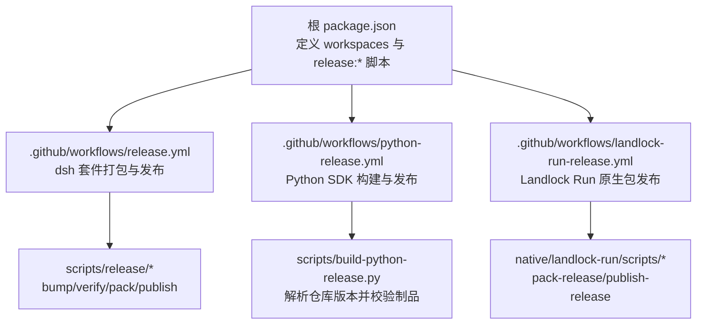
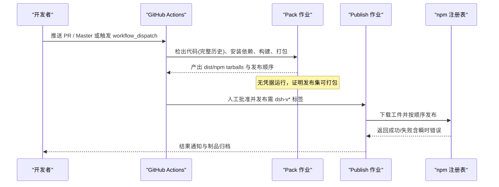
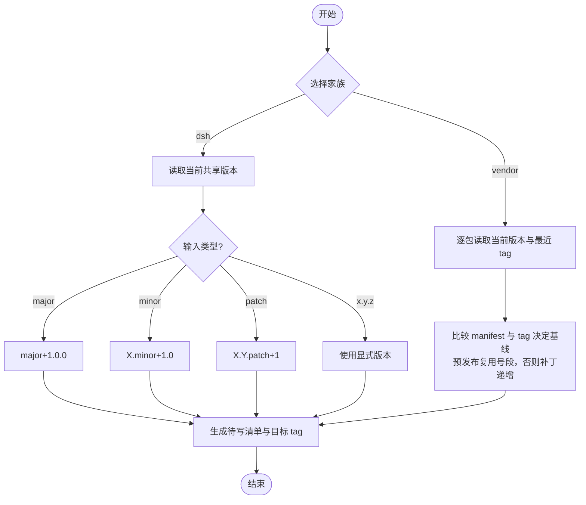
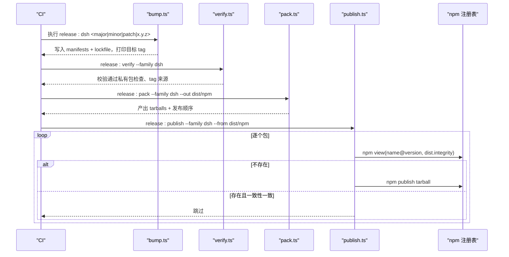
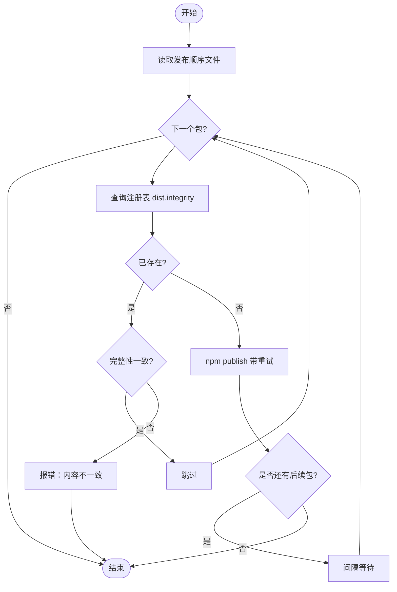
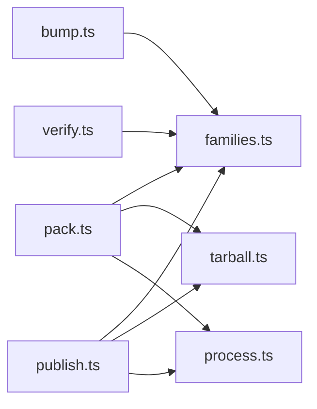

# 发布管理

<cite>
**本文引用的文件**
- [package.json](file://package.json)
- [.github/workflows/release.yml](file://.github/workflows/release.yml)
- [.github/workflows/python-release.yml](file://.github/workflows/python-release.yml)
- [.github/workflows/landlock-run-release.yml](file://.github/workflows/landlock-run-release.yml)
- [scripts/release/bump.ts](file://scripts/release/bump.ts)
- [scripts/release/verify.ts](file://scripts/release/verify.ts)
- [scripts/release/pack.ts](file://scripts/release/pack.ts)
- [scripts/release/publish.ts](file://scripts/release/publish.ts)
- [native/landlock-run/scripts/pack-release.mjs](file://native/landlock-run/scripts/pack-release.mjs)
- [native/landlock-run/scripts/publish-release.mjs](file://native/landlock-run/scripts/publish-release.mjs)
- [scripts/check-workspace-constraints.ts](file://scripts/check-workspace-constraints.ts)
- [scripts/publint-all.ts](file://scripts/publint-all.ts)
</cite>

## 目录
1. [简介](#简介)
2. [项目结构](#项目结构)
3. [核心组件](#核心组件)
4. [架构总览](#架构总览)
5. [详细组件分析](#详细组件分析)
6. [依赖关系分析](#依赖关系分析)
7. [性能与可靠性考虑](#性能与可靠性考虑)
8. [故障排查指南](#故障排查指南)
9. [结论](#结论)
10. [附录](#附录)

## 简介
本指南面向 DeepSeek Harness 的发布负责人与维护者，系统化说明自动化发布流程、版本标签管理、变更日志与文档生成、多包协调策略、发布前质量门禁、回滚与热修复流程，以及发布后的验证与监控。仓库采用“打包产物即发布源”的设计：CI 在 pack 阶段产出不可变 tarball，publish 阶段仅上传这些已验证的字节；所有版本与标签由脚本与流水线共同约束，确保可重复、可审计、可回滚。

## 项目结构
- 工作区根 package.json 定义了 pnpm workspace、Node 引擎要求与统一脚本入口（release:*）。
- GitHub Actions 提供三条独立发布流水线：
  - dsh 套件（packages/* 与 apps/*）
  - Python SDK（deepseek-harness-sdk 与运行时 wheel）
  - Landlock Run 原生扩展（@deepseek-ai/node-addon-landlock-run 系列）
- 发布脚本集中在 scripts/release 与 native/landlock-run/scripts，负责版本递增、校验、打包与发布。

**图示来源**
- [package.json:19-135](file://package.json#L19-L135)
- [.github/workflows/release.yml:1-150](file://.github/workflows/release.yml#L1-L150)
- [.github/workflows/python-release.yml:1-245](file://.github/workflows/python-release.yml#L1-L245)
- [.github/workflows/landlock-run-release.yml:1-181](file://.github/workflows/landlock-run-release.yml#L1-L181)

**章节来源**
- [package.json:1-183](file://package.json#L1-L183)
- [.github/workflows/release.yml:1-150](file://.github/workflows/release.yml#L1-L150)
- [.github/workflows/python-release.yml:1-245](file://.github/workflows/python-release.yml#L1-L245)
- [.github/workflows/landlock-run-release.yml:1-181](file://.github/workflows/landlock-run-release.yml#L1-L181)

## 核心组件
- 版本递增与标签规划：scripts/release/bump.ts
  - 支持 dsh 家族共享版本号（major/minor/patch 或显式 x.y.z），以及 vendor 家族按包独立递增。
  - 输出待提交清单与目标 tag 提示，不直接打 tag，保证人类审核后再标记。
- 发布前置校验：scripts/release/verify.ts
  - 校验成员是否可发布（非 private）、运行来源是否为预期 family 的 tag。
- 打包：scripts/release/pack.ts 与 native/landlock-run/scripts/pack-release.mjs
  - 按发布顺序产出 tarball，记录发布顺序文件，并对 payload 做内容校验。
- 发布：scripts/release/publish.ts 与 native/landlock-run/scripts/publish-release.mjs
  - 基于 registry 查询与完整性比对实现幂等发布；对瞬时错误指数退避重试。
- 工作区约束与发布物检查：
  - scripts/check-workspace-constraints.ts：校验根版本格式与依赖范围。
  - scripts/publint-all.ts：扫描每个包的 files 与 README/LICENCE/CHANGELOG 等元数据。

**章节来源**
- [scripts/release/bump.ts:1-369](file://scripts/release/bump.ts#L1-L369)
- [scripts/release/verify.ts:1-71](file://scripts/release/verify.ts#L1-L71)
- [scripts/release/pack.ts:1-62](file://scripts/release/pack.ts#L1-L62)
- [scripts/release/publish.ts:1-170](file://scripts/release/publish.ts#L1-L170)
- [native/landlock-run/scripts/pack-release.mjs:1-76](file://native/landlock-run/scripts/pack-release.mjs#L1-L76)
- [native/landlock-run/scripts/publish-release.mjs:25-52](file://native/landlock-run/scripts/publish-release.mjs#L25-L52)
- [scripts/check-workspace-constraints.ts:375-383](file://scripts/check-workspace-constraints.ts#L375-L383)
- [scripts/publint-all.ts:38-104](file://scripts/publint-all.ts#L38-L104)

## 架构总览
下图展示 dsh 套件从 PR/Master 到发布的完整流水线，强调“无凭据打包、凭据发布”的安全边界与工件传递。

**图示来源**
- [.github/workflows/release.yml:35-150](file://.github/workflows/release.yml#L35-L150)
- [scripts/release/pack.ts:1-62](file://scripts/release/pack.ts#L1-L62)
- [scripts/release/publish.ts:1-170](file://scripts/release/publish.ts#L1-L170)

## 详细组件分析

### 语义化版本控制策略
- dsh 家族
  - 单一共享版本：根 package.json 与各成员保持一致，通过 bump.ts 统一计算 nextSharedVersion。
  - 支持 major/minor/patch 或显式 x.y.z（含预发布如 0.0.1-rc.1）。
  - 预发布不会占用稳定版号段，稳定版优先于预发布。
- vendor 家族
  - 每包独立版本线，但每次发布整体推进，避免复用旧版本导致上游溯源丢失。
  - 若最新 tag 为预发布，则复用主/次/补丁号；否则补丁号递增。
- 工作区约束
  - 根版本必须匹配 X.Y.Z[-prerelease] 正则；依赖范围不得指向未发布或本地路径。

**图示来源**
- [scripts/release/bump.ts:126-179](file://scripts/release/bump.ts#L126-L179)
- [scripts/release/bump.ts:246-298](file://scripts/release/bump.ts#L246-L298)
- [scripts/check-workspace-constraints.ts:375-383](file://scripts/check-workspace-constraints.ts#L375-L383)

**章节来源**
- [scripts/release/bump.ts:1-369](file://scripts/release/bump.ts#L1-L369)
- [scripts/check-workspace-constraints.ts:375-383](file://scripts/check-workspace-constraints.ts#L375-L383)

### 版本标签管理与发布流水线
- dsh 套件
  - pack 阶段：无凭据运行，产出 dist/npm 与发布顺序文件。
  - publish 阶段：仅接受来自 dsh-v* 标签的 workflow_dispatch，下载工件后按顺序发布。
- Python SDK
  - 构建四平台 wheel，校验制品数量与大小，生成 SHA256SUMS。
  - 发布分两步：先 runtime wheels，再 SDK wheel；均通过 OIDC 认证至 PyPI。
- Landlock Run
  - 多架构 prebuilds 并行构建，assemble 后打包；发布脚本具备幂等与重试能力。

**图示来源**
- [.github/workflows/release.yml:35-150](file://.github/workflows/release.yml#L35-L150)
- [scripts/release/bump.ts:300-369](file://scripts/release/bump.ts#L300-L369)
- [scripts/release/verify.ts:1-71](file://scripts/release/verify.ts#L1-L71)
- [scripts/release/pack.ts:1-62](file://scripts/release/pack.ts#L1-L62)
- [scripts/release/publish.ts:1-170](file://scripts/release/publish.ts#L1-L170)

**章节来源**
- [.github/workflows/release.yml:1-150](file://.github/workflows/release.yml#L1-L150)
- [.github/workflows/python-release.yml:1-245](file://.github/workflows/python-release.yml#L1-L245)
- [.github/workflows/landlock-run-release.yml:1-181](file://.github/workflows/landlock-run-release.yml#L1-L181)
- [scripts/release/bump.ts:1-369](file://scripts/release/bump.ts#L1-L369)
- [scripts/release/verify.ts:1-71](file://scripts/release/verify.ts#L1-L71)
- [scripts/release/pack.ts:1-62](file://scripts/release/pack.ts#L1-L62)
- [scripts/release/publish.ts:1-170](file://scripts/release/publish.ts#L1-L170)

### 多包发布的协调机制
- 发布顺序：pack.ts 按 family.publishOrder 依次打包并写入发布顺序文件，确保依赖先于消费者发布。
- 幂等发布：publish.ts 通过 npm view 获取 dist.integrity，与本地 tarball 哈希对比；相同则跳过，不同则报错（防止内容变化但未升版）。
- 瞬时错误处理：识别 E409/E429/E5xx 等错误码，指数退避重试，最多 4 次。
- 原生包差异：Landlock 平台包使用 npm pack 保留可执行位，entry 包使用 pnpm pack 以正确转换 workspace 协议。

**图示来源**
- [scripts/release/pack.ts:1-62](file://scripts/release/pack.ts#L1-L62)
- [scripts/release/publish.ts:1-170](file://scripts/release/publish.ts#L1-L170)
- [native/landlock-run/scripts/pack-release.mjs:1-76](file://native/landlock-run/scripts/pack-release.mjs#L1-L76)
- [native/landlock-run/scripts/publish-release.mjs:25-52](file://native/landlock-run/scripts/publish-release.mjs#L25-L52)

**章节来源**
- [scripts/release/pack.ts:1-62](file://scripts/release/pack.ts#L1-L62)
- [scripts/release/publish.ts:1-170](file://scripts/release/publish.ts#L1-L170)
- [native/landlock-run/scripts/pack-release.mjs:1-76](file://native/landlock-run/scripts/pack-release.mjs#L1-L76)
- [native/landlock-run/scripts/publish-release.mjs:25-52](file://native/landlock-run/scripts/publish-release.mjs#L25-L52)

### 发布前的质量检查清单
- 代码审查与静态检查
  - 工作区约束：scripts/check-workspace-constraints.ts 校验根版本格式与依赖范围。
  - 发布物元数据：scripts/publint-all.ts 扫描 files、README/LICENCE/CHANGELOG/HISTORY/NOTICE 等。
- 测试覆盖率
  - 根脚本提供 test:coverage 与 check:ci:coverage 门控，建议在合并前达到团队阈值。
- 安全与许可证
  - verify-dsh-package-licenses 与第三方声明生成脚本保障合规。
- 构建与安装验证
  - dsh：release:verify-packed-install 验证 packed install。
  - Python：twine check 与大小限制校验。
  - Landlock：verify-launcher-binary 与 assemble-prebuilds。

**章节来源**
- [scripts/check-workspace-constraints.ts:375-383](file://scripts/check-workspace-constraints.ts#L375-L383)
- [scripts/publint-all.ts:38-104](file://scripts/publint-all.ts#L38-L104)
- [package.json:34-58](file://package.json#L34-L58)
- [.github/workflows/python-release.yml:141-167](file://.github/workflows/python-release.yml#L141-L167)
- [.github/workflows/landlock-run-release.yml:68-80](file://.github/workflows/landlock-run-release.yml#L68-L80)

### 发布回滚策略与热修复流程
- 回滚策略
  - npm 不支持删除已发布版本。推荐做法：发布一个更高版本的修复包，并通过 dist-tag 将 stable/latest 指向修复版本。
  - 利用预发布 tag 进行演练：bump.ts 支持 --prerelease 为 vendor 家族生成演练版本，不占用稳定 dist-tag。
- 热修复流程
  - 从稳定分支创建 hotfix 分支，仅升级必要依赖与修复逻辑。
  - 使用 bump.ts 指定 patch 或显式版本，提交并合并后打 tag。
  - 触发对应流水线，经 pack/verify/publish 后，通过 dist-tag 快速切换用户可见版本。
- 幂等与可重放
  - publish.ts 对已存在的相同完整性版本自动跳过，允许安全重跑。

**章节来源**
- [scripts/release/bump.ts:145-179](file://scripts/release/bump.ts#L145-L179)
- [scripts/release/publish.ts:97-124](file://scripts/release/publish.ts#L97-L124)
- [scripts/release/publish.ts:141-167](file://scripts/release/publish.ts#L141-L167)

### 发布后的验证与监控措施
- 工件完整性
  - Python 流水线生成并校验 SHA256SUMS；dsh 与 Landlock 通过 integrity 比对与 packed install 验证。
- 冒烟测试
  - Python：安装 wheel 并运行 smoke 场景。
  - dsh：packed install 验证内部依赖解析。
- 监控建议
  - 关注注册表错误码（E409/E429/E5xx）与重试次数。
  - 建立告警：当连续失败或跳过率异常时通知维护者。
  - 定期核对 dist-tag 指向与预期版本一致。

**章节来源**
- [.github/workflows/python-release.yml:168-179](file://.github/workflows/python-release.yml#L168-L179)
- [.github/workflows/python-release.yml:197-211](file://.github/workflows/python-release.yml#L197-L211)
- [.github/workflows/release.yml:99-107](file://.github/workflows/release.yml#L99-L107)
- [scripts/release/publish.ts:24-42](file://scripts/release/publish.ts#L24-L42)

### 发布文档的自动生成与维护方案
- 配置与工具目录
  - gen-config-catalog、gen-tool-catalog、gen-third-party-notices、gen-doc-graphs 等脚本支持 --check 模式，确保文档与源码同步。
- 变更日志
  - 发布脚本会读取 CHANGELOG* 等文件参与发布物校验；建议在 bump 时更新变更摘要，保持可读性。
- 工作流集成
  - 在 CI 中运行 --check 模式，若发现陈旧文档则阻断合并，强制生成并提交。

**章节来源**
- [scripts/gen-config-catalog.ts:851-880](file://scripts/gen-config-catalog.ts#L851-L880)
- [scripts/gen-tool-catalog.ts:719-759](file://scripts/gen-tool-catalog.ts#L719-L759)
- [scripts/gen-third-party-notices.ts:746-775](file://scripts/gen-third-party-notices.ts#L746-L775)
- [scripts/gen-doc-graphs.ts:1435-1461](file://scripts/gen-doc-graphs.ts#L1435-L1461)
- [scripts/publint-all.ts:63-90](file://scripts/publint-all.ts#L63-L90)

## 依赖关系分析
- 组件耦合
  - bump.ts 依赖 families.ts 与 process.ts，输出待提交清单与 tag 计划。
  - verify.ts 依赖 families.ts，校验发布条件。
  - pack.ts 依赖 families.ts 与 tarball.ts，按顺序打包并校验 payload。
  - publish.ts 依赖 families.ts、process.ts 与 tarball.ts，实现幂等发布与重试。
- 外部依赖
  - npm CLI：用于 pack/publish/view。
  - pnpm：workspace 安装与构建。
  - Node.js 内置模块：crypto/fs/path/timers/promises/util。
- 循环依赖
  - 发布脚本之间通过命令行参数与文件系统解耦，无循环 import。

**图示来源**
- [scripts/release/bump.ts:17-22](file://scripts/release/bump.ts#L17-L22)
- [scripts/release/verify.ts:10-13](file://scripts/release/verify.ts#L10-L13)
- [scripts/release/pack.ts:10-15](file://scripts/release/pack.ts#L10-L15)
- [scripts/release/publish.ts:15-23](file://scripts/release/publish.ts#L15-L23)

**章节来源**
- [scripts/release/bump.ts:1-369](file://scripts/release/bump.ts#L1-L369)
- [scripts/release/verify.ts:1-71](file://scripts/release/verify.ts#L1-L71)
- [scripts/release/pack.ts:1-62](file://scripts/release/pack.ts#L1-L62)
- [scripts/release/publish.ts:1-170](file://scripts/release/publish.ts#L1-L170)

## 性能与可靠性考虑
- 并发与缓存
  - pnpm store 缓存加速安装；CI 使用冻结锁文件保证可重现。
- 幂等与重试
  - publish.ts 对瞬时错误指数退避重试，最多 4 次；对已存在且完整性一致的版本直接跳过。
- 构建与打包
  - Landlock 平台包使用 npm pack 保留可执行位；entry 包使用 pnpm pack 正确处理 workspace 协议。
- 资源限制
  - Python wheel 大小限制（默认 100MB），流水线在验证阶段提前拦截。

**章节来源**
- [.github/workflows/release.yml:54-70](file://.github/workflows/release.yml#L54-L70)
- [scripts/release/publish.ts:24-42](file://scripts/release/publish.ts#L24-L42)
- [scripts/release/publish.ts:97-124](file://scripts/release/publish.ts#L97-L124)
- [native/landlock-run/scripts/pack-release.mjs:55-65](file://native/landlock-run/scripts/pack-release.mjs#L55-L65)
- [.github/workflows/python-release.yml:155-161](file://.github/workflows/python-release.yml#L155-L161)

## 故障排查指南
- 常见错误与定位
  - 版本格式不符：检查根 package.json 版本是否符合 X.Y.Z[-prerelease]。
  - 私有包发布失败：verify.ts 会拒绝 private=true 的包。
  - 标签不匹配：verify.ts 校验运行来源是否为 family 的 tag。
  - 内容不一致：publish.ts 检测到注册表已有版本但完整性不同，需升版或修复构建可重现性。
  - 瞬时网络错误：E409/E429/E5xx，脚本会自动重试；若持续失败，检查网络与注册表状态。
- 调试步骤
  - 本地运行 release:verify 与 release:pack，确认无错。
  - 查看 CI 日志中的 pack 与 publish 输出，定位具体包与错误码。
  - 对于 Python 发布，检查 twine check 与 SHA256SUMS 校验结果。

**章节来源**
- [scripts/check-workspace-constraints.ts:375-383](file://scripts/check-workspace-constraints.ts#L375-L383)
- [scripts/release/verify.ts:18-45](file://scripts/release/verify.ts#L18-L45)
- [scripts/release/publish.ts:141-167](file://scripts/release/publish.ts#L141-L167)
- [.github/workflows/python-release.yml:163-179](file://.github/workflows/python-release.yml#L163-L179)

## 结论
DeepSeek Harness 的发布体系围绕“不可变工件”与“幂等发布”展开，通过严格的版本策略、流水线门禁与完整性校验，确保多包协同发布的一致性与可回滚性。配合自动化文档生成与质量检查，可在保证质量的前提下高效交付。

## 附录
- 常用命令参考
  - 版本递增：pnpm run release:dsh <major|minor|patch|x.y.z>
  - 校验：pnpm run release:verify --family dsh
  - 打包：pnpm run release:pack --family dsh --out dist/npm
  - 发布：pnpm run release:publish --family dsh --from dist/npm
- 相关流水线
  - dsh：.github/workflows/release.yml
  - Python：.github/workflows/python-release.yml
  - Landlock：.github/workflows/landlock-run-release.yml

**章节来源**
- [package.json:126-135](file://package.json#L126-L135)
- [.github/workflows/release.yml:1-150](file://.github/workflows/release.yml#L1-L150)
- [.github/workflows/python-release.yml:1-245](file://.github/workflows/python-release.yml#L1-L245)
- [.github/workflows/landlock-run-release.yml:1-181](file://.github/workflows/landlock-run-release.yml#L1-L181)