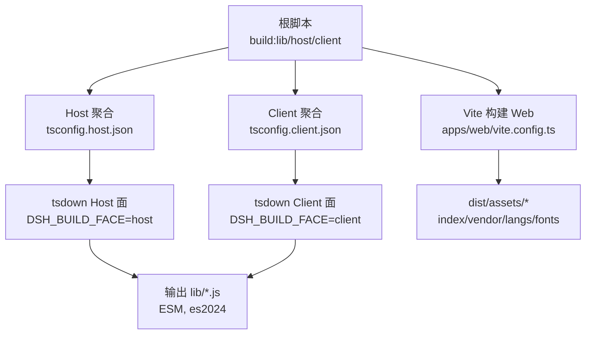
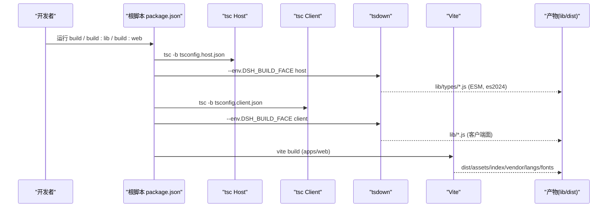
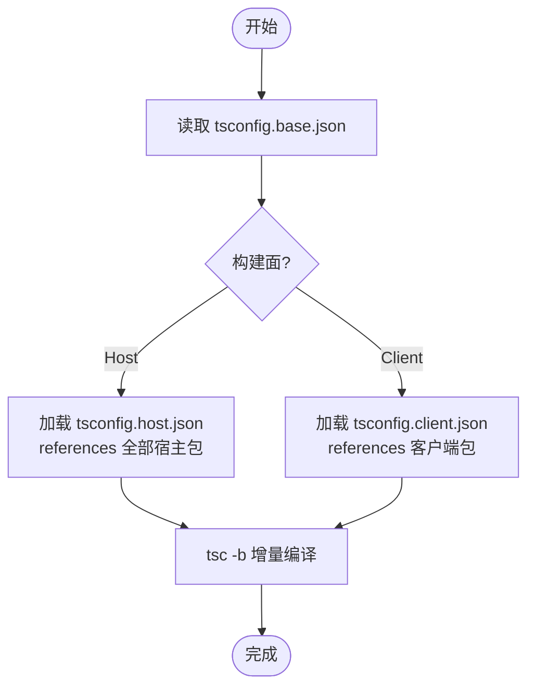
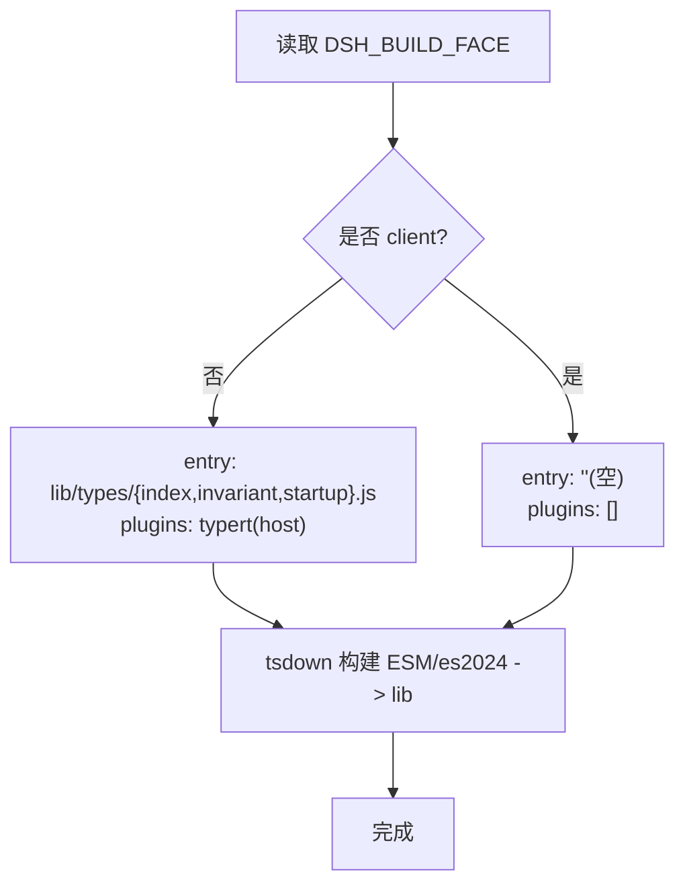
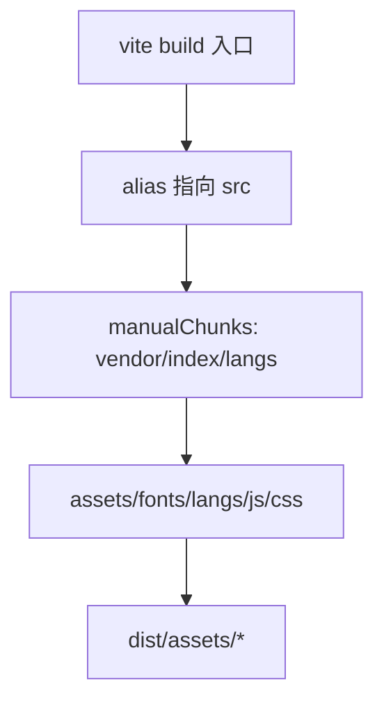
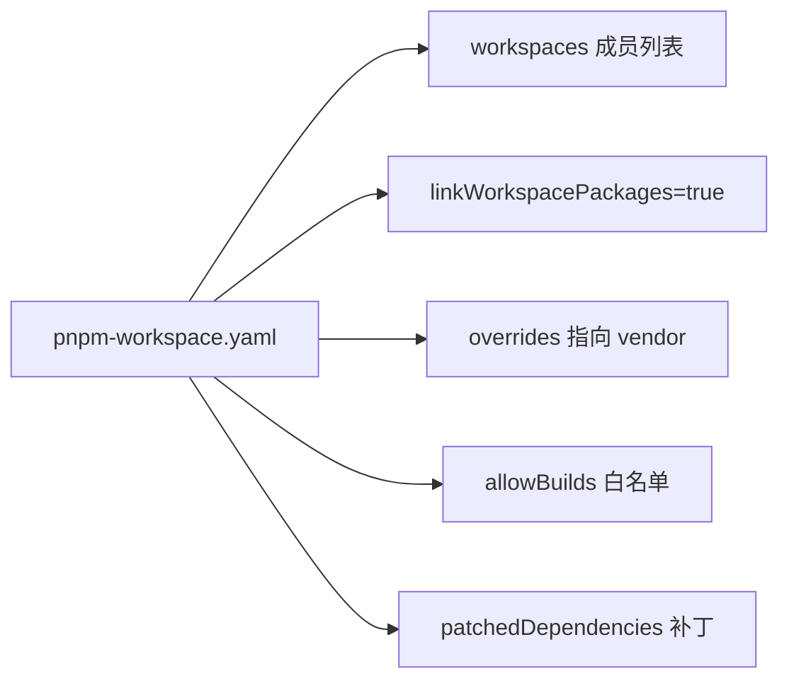
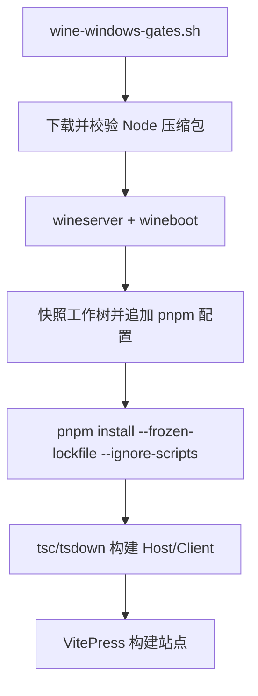
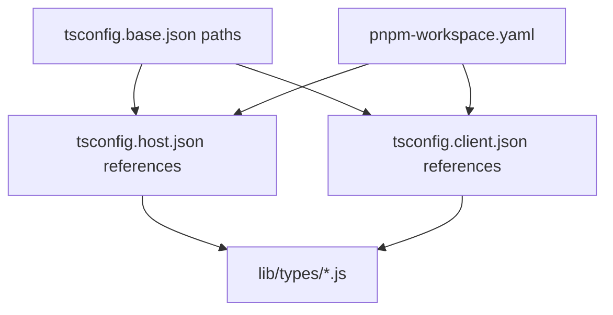

# 构建与打包

<cite>
**本文引用的文件**
- [package.json](file://package.json)
- [pnpm-workspace.yaml](file://pnpm-workspace.yaml)
- [tsconfig.base.json](file://tsconfig.base.json)
- [tsconfig.host.json](file://tsconfig.host.json)
- [tsconfig.client.json](file://tsconfig.client.json)
- [tsdown.config.ts](file://tsdown.config.ts)
- [apps/cli/package.json](file://apps/cli/package.json)
- [apps/web/package.json](file://apps/web/package.json)
- [apps/web/vite.config.ts](file://apps/web/vite.config.ts)
- [scripts/wine-windows-gates.sh](file://scripts/wine-windows-gates.sh)
- [scripts/check-macos-deployment-target.py](file://scripts/check-macos-deployment-target.py)
- [native/landlock-run/scripts/build.ts](file://native/landlock-run/scripts/build.ts)
- [native/landlock-run/scripts/github-matrix.mjs](file://native/landlock-run/scripts/github-matrix.mjs)
- [scripts/build-exe-for-python-sdk.ts](file://scripts/build-exe-for-python-sdk.ts)
</cite>

## 目录
1. [简介](#简介)
2. [项目结构](#项目结构)
3. [核心组件](#核心组件)
4. [架构总览](#架构总览)
5. [详细组件分析](#详细组件分析)
6. [依赖分析](#依赖分析)
7. [性能考虑](#性能考虑)
8. [故障排查指南](#故障排查指南)
9. [结论](#结论)
10. [附录](#附录)

## 简介
本指南面向 DeepSeek Harness 的构建与打包，覆盖多目标构建（TypeScript 编译、依赖优化、代码分割）、pnpm 工作区管理、包版本控制与依赖解析机制、跨平台（Linux/macOS/Windows）构建配置、构建脚本使用与自定义选项、性能优化技巧（缓存与并行），以及常见构建问题的调试方法。目标是帮助开发者在不同环境下稳定、高效地构建出 CLI、Web 前端与原生二进制产物。

## 项目结构
仓库采用 pnpm workspace 组织，包含：
- 根级脚本与聚合构建入口（TypeScript 编译、tsdown 打包、Vite 构建）
- apps/cli：CLI 应用，发布 dsh 命令
- apps/web：Web 前端，基于 Vite 构建并产出静态资源
- packages/*：大量功能包，按 host/client 双面构建
- native/landlock-run：原生二进制预构建与打包工具链
- scripts：CI、质量门禁、平台校验、发布等脚本

图表来源
- [package.json:19-24](file://package.json#L19-L24)
- [tsconfig.host.json:109-296](file://tsconfig.host.json#L109-L296)
- [tsconfig.client.json:38-96](file://tsconfig.client.json#L38-L96)
- [tsdown.config.ts:16-29](file://tsdown.config.ts#L16-L29)
- [apps/web/vite.config.ts:92-127](file://apps/web/vite.config.ts#L92-L127)

章节来源
- [package.json:19-24](file://package.json#L19-L24)
- [pnpm-workspace.yaml:1-21](file://pnpm-workspace.yaml#L1-L21)

## 核心组件
- TypeScript 编译与聚合
  - 通过 tsconfig.host.json 与 tsconfig.client.json 分别定义 Host 与 Client 两个类型检查聚合，共享 tsconfig.base.json 的基础编译器选项与路径映射。
  - 使用 project references 实现增量编译与跨包类型引用。
- tsdown 打包
  - 通过环境变量 DSH_BUILD_FACE 切换 host/client 两阶段打包；Host 面生成 lib/types 供消费方引用，Client 面选择浏览器可运行的包并复用其本地配置。
  - 统一输出 ESM、es2024 目标，关闭 d.ts 生成以加速流程。
- Vite 前端构建
  - 将 @deepseek-ai/dsh-client-web 等包直接指向源码进行浏览器化，避免 CSS 被外部化到 lib 中。
  - 通过 manualChunks 将重型渲染依赖（math、highlight、markdown）抽为 vendor 块，语法高亮语言按需懒加载。
- 原生二进制与平台产物
  - native/landlock-run 根据 prebuilds.json 矩阵组装平台二进制，GitHub Actions 矩阵由 github-matrix.mjs 推导。
  - Python SDK 单 exe 构建脚本支持多目标 triple（node 版本-平台-架构）。

章节来源
- [tsconfig.base.json:5-27](file://tsconfig.base.json#L5-L27)
- [tsconfig.host.json:109-296](file://tsconfig.host.json#L109-L296)
- [tsconfig.client.json:38-96](file://tsconfig.client.json#L38-L96)
- [tsdown.config.ts:16-29](file://tsdown.config.ts#L16-L29)
- [apps/web/vite.config.ts:129-159](file://apps/web/vite.config.ts#L129-L159)
- [native/landlock-run/scripts/build.ts:40-71](file://native/landlock-run/scripts/build.ts#L40-L71)
- [native/landlock-run/scripts/github-matrix.mjs:14-41](file://native/landlock-run/scripts/github-matrix.mjs#L14-L41)
- [scripts/build-exe-for-python-sdk.ts:86-171](file://scripts/build-exe-for-python-sdk.ts#L86-L171)

## 架构总览
下图展示从根脚本到各构建阶段的调用关系与产物流向。

图表来源
- [package.json:19-24](file://package.json#L19-L24)
- [tsdown.config.ts:16-29](file://tsdown.config.ts#L16-L29)
- [apps/web/vite.config.ts:92-127](file://apps/web/vite.config.ts#L92-L127)

## 详细组件分析

### TypeScript 编译与聚合
- 基础配置
  - 目标 ES2024、模块解析 bundler、启用声明与 source map、严格模式、增量与复合项目。
  - paths 提供仓库内别名映射，确保跨包引用一致且可被 IDE/工具识别。
- Host/Client 聚合
  - Host 聚合包含所有服务端/宿主侧包与测试、脚本、网站等；Client 聚合仅包含客户端相关包与测试。
  - 两者通过 references 显式声明依赖，保证增量编译与类型安全。

图表来源
- [tsconfig.base.json:5-27](file://tsconfig.base.json#L5-L27)
- [tsconfig.host.json:109-296](file://tsconfig.host.json#L109-L296)
- [tsconfig.client.json:38-96](file://tsconfig.client.json#L38-L96)

章节来源
- [tsconfig.base.json:5-27](file://tsconfig.base.json#L5-L27)
- [tsconfig.host.json:109-296](file://tsconfig.host.json#L109-L296)
- [tsconfig.client.json:38-96](file://tsconfig.client.json#L38-L96)

### tsdown 打包策略
- 双面构建
  - 通过 DSH_BUILD_FACE 区分 host/client；Host 面生成 types 供消费方引用，Client 面选择浏览器可用包。
- 输出规范
  - 统一 ESM、es2024 目标，输出至 lib，关闭 d.ts 生成以提升速度。
- 插件集成
  - Host 面启用 typert 插件进行类型相关处理。

图表来源
- [tsdown.config.ts:4-29](file://tsdown.config.ts#L4-L29)

章节来源
- [tsdown.config.ts:4-29](file://tsdown.config.ts#L4-L29)

### Vite 前端构建与代码分割
- 源码直编
  - 将 @deepseek-ai/dsh-client-web 等包 alias 到 src，使 CSS 走 Vite 管线而非外部化。
- 代码分割
  - 将 math/highlight/markdown 等重型依赖放入 vendor chunk；@shikijs/langs 语法按需懒加载，首屏 index 保持轻量。
  - 字体资源归类到 assets/fonts，语法块归类到 assets/langs。
- 环境注入
  - define 替换 process.env/process.versions.node，屏蔽 Node 特性，适配浏览器。

图表来源
- [apps/web/vite.config.ts:92-159](file://apps/web/vite.config.ts#L92-L159)

章节来源
- [apps/web/vite.config.ts:92-159](file://apps/web/vite.config.ts#L92-L159)

### pnpm 工作区与依赖解析
- 工作区成员
  - 包含 vendor、packages、apps、website、examples（仅依赖解析）、python/sdk-runtime（部署闭包）。
- 链接与覆盖
  - linkWorkspacePackages=true 保证本地开发时解析到工作区源；overrides 将特定包名指向 vendor。
- 构建脚本白名单
  - allowBuilds 精确允许必要包的 install/build 脚本（如 esbuild、node-pty、koffi 等），默认拒绝未列出的脚本。
- 补丁
  - patchedDependencies 对 node-pty 应用补丁以修复兼容性问题。

图表来源
- [pnpm-workspace.yaml:1-73](file://pnpm-workspace.yaml#L1-L73)

章节来源
- [pnpm-workspace.yaml:1-73](file://pnpm-workspace.yaml#L1-L73)

### 多平台构建配置
- Linux
  - CI 与本地均可执行 Host/Client 双面构建；原生二进制通过 native/landlock-run 的 prebuilds.json 矩阵选择对应平台产物。
- macOS
  - 使用 check-macos-deployment-target.py 验证 Mach-O 二进制的最小部署版本不高于 wheel 标签声明的版本，防止运行时不兼容。
- Windows
  - 通过 wine-windows-gates.sh 在 Wine 下以 win-x64 Node 执行完整构建与站点构建；自动安装/缓存 Node、初始化 Wine、快照工作树并追加 hoisted 布局与 win32-x64 架构支持；重试 pnpm 安装以规避已知竞态问题。

图表来源
- [scripts/wine-windows-gates.sh:144-254](file://scripts/wine-windows-gates.sh#L144-L254)

章节来源
- [scripts/check-macos-deployment-target.py:1-96](file://scripts/check-macos-deployment-target.py#L1-L96)
- [scripts/wine-windows-gates.sh:1-283](file://scripts/wine-windows-gates.sh#L1-L283)
- [native/landlock-run/scripts/build.ts:40-71](file://native/landlock-run/scripts/build.ts#L40-L71)
- [native/landlock-run/scripts/github-matrix.mjs:14-41](file://native/landlock-run/scripts/github-matrix.mjs#L14-L41)

### 构建脚本与自定义选项
- 根脚本
  - build: 先构建库（Host/Client），再构建 Web。
  - build:lib:host/client: 分别执行 tsc 与 tsdown，并通过 DSH_BUILD_FACE 切换。
  - build:web: 调用 apps/web 的 vite build。
- CLI 与 Web 包
  - apps/cli 暴露 dsh 命令，依赖众多 workspace 包。
  - apps/web 通过 vite build 产出静态资源，供 CLI 的 web 子命令服务。
- Python SDK 单 exe
  - 支持 --targets 指定 node 版本-平台-架构三元组，构建前会校验目标合法性与去重。

章节来源
- [package.json:19-24](file://package.json#L19-L24)
- [apps/cli/package.json:14-19](file://apps/cli/package.json#L14-L19)
- [apps/web/package.json:22-26](file://apps/web/package.json#L22-L26)
- [scripts/build-exe-for-python-sdk.ts:139-171](file://scripts/build-exe-for-python-sdk.ts#L139-L171)

## 依赖分析
- 工作区依赖图
  - Host/Client 聚合通过 references 显式声明依赖，避免隐式耦合。
  - 根 tsconfig.base.json 的 paths 提供统一的包名到源码路径映射，确保 IDE 与工具一致性。
- 外部依赖
  - 通过 allowBuilds 严格控制带生命周期脚本的包，减少不可控构建风险。
  - overrides 将关键框架指向 vendor，便于本地开发与发布一致性。

图表来源
- [tsconfig.base.json:30-276](file://tsconfig.base.json#L30-L276)
- [tsconfig.host.json:109-296](file://tsconfig.host.json#L109-L296)
- [tsconfig.client.json:38-96](file://tsconfig.client.json#L38-L96)
- [pnpm-workspace.yaml:23-73](file://pnpm-workspace.yaml#L23-L73)

章节来源
- [tsconfig.base.json:30-276](file://tsconfig.base.json#L30-L276)
- [pnpm-workspace.yaml:23-73](file://pnpm-workspace.yaml#L23-L73)

## 性能考虑
- 增量编译
  - 启用 TypeScript 增量与复合项目，配合 project references 减少重复编译。
- 并行构建
  - 根脚本顺序执行 Host/Client 构建，确保依赖顺序；CI 中可通过 run-gates 控制并发度，避免内存溢出。
- 缓存策略
  - pnpm store 与 .cache/wine-windows 缓存 Node 与 Wine 环境，加速 Windows 门限构建。
  - Vite 与 Rollup 的 vendor 块提升长期缓存命中率，编辑 shell 代码仅影响 index 块。
- 代码分割
  - 将重型第三方依赖拆分到 vendor，语法高亮语言按需懒加载，降低首屏体积。

[本节为通用指导，不直接分析具体文件]

## 故障排查指南
- pnpm 安装失败（git 依赖 prepare 脚本被阻止）
  - 现象：pnpm 报错提示需要 allowBuilds 白名单。
  - 解决：在工作区的 pnpm-workspace.yaml 中添加对应的 allowBuilds 条目后重试。
- Windows 下 pnpm 安装竞态
  - 现象：ERR_PNPM_ENOENT rename _tmp_ 错误。
  - 解决：wine-windows-gates.sh 已内置重试逻辑；若仍失败，清理 node_modules 后重新安装。
- macOS 部署目标不兼容
  - 现象：二进制要求更高 macOS 版本但 wheel 标签较低。
  - 解决：使用 check-macos-deployment-target.py 校验并调整构建参数或依赖版本。
- Vite 独立预览被拒绝
  - 现象：直接运行 Vite serve 抛出错误。
  - 解决：通过 dsh web 或安装后的 dsh web 启动，确保注入必要的引导上下文。

章节来源
- [pnpm-workspace.yaml:35-56](file://pnpm-workspace.yaml#L35-L56)
- [scripts/wine-windows-gates.sh:172-182](file://scripts/wine-windows-gates.sh#L172-L182)
- [scripts/check-macos-deployment-target.py:60-82](file://scripts/check-macos-deployment-target.py#L60-L82)
- [apps/web/vite.config.ts:6-19](file://apps/web/vite.config.ts#L6-L19)

## 结论
DeepSeek Harness 的构建体系通过 TypeScript 聚合、tsdown 双面打包与 Vite 前端构建形成清晰的分层：Host/Client 分离、vendor 代码分割、原生二进制矩阵化。pnpm 工作区与严格的 allowBuilds 策略保障了依赖可控与可复现。结合缓存与并行策略，可在多平台上高效构建 CLI、Web 与原生产物。遇到问题时，优先检查工作区配置、平台脚本与依赖白名单。

## 附录
- 常用命令
  - 构建库与 Web：pnpm run build
  - 仅构建库：pnpm run build:lib
  - 仅构建 Web：pnpm run build:web
  - 类型检查：pnpm run typecheck
  - 运行 dsh CLI：pnpm run dsh
- 环境变量
  - DSH_BUILD_FACE：控制 tsdown 构建面（host/client）
  - DSH_WINE_NODE_MAJOR：Wine 下使用的 Node 主版本
  - DSH_GATE_CONCURRENCY：限制 gates 并发度
  - DSH_COVERAGE_MAX_WORKERS：覆盖率任务最大工作进程数

[本节为补充信息，不直接分析具体文件]