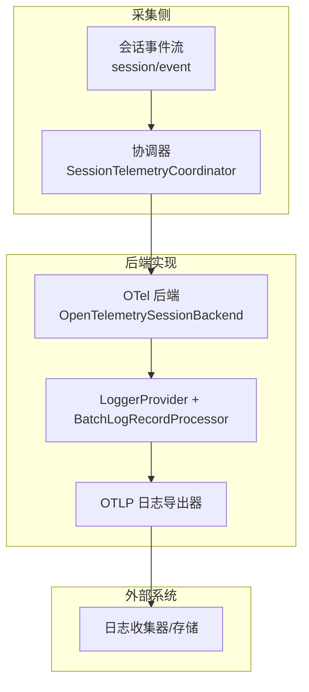
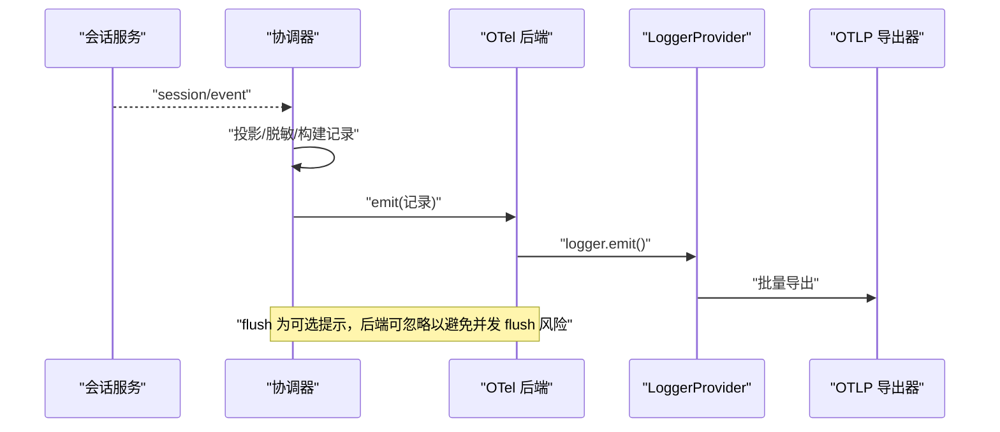
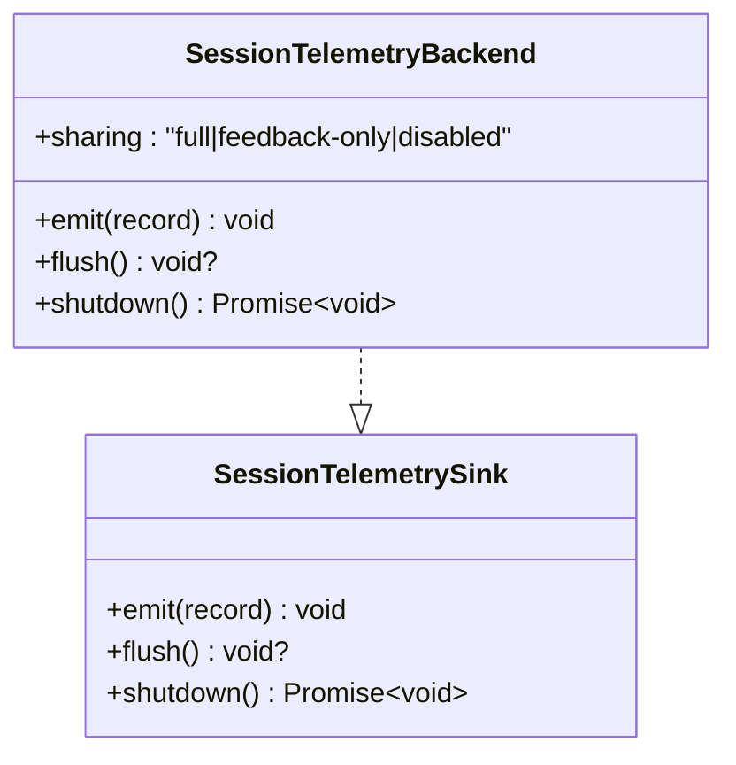
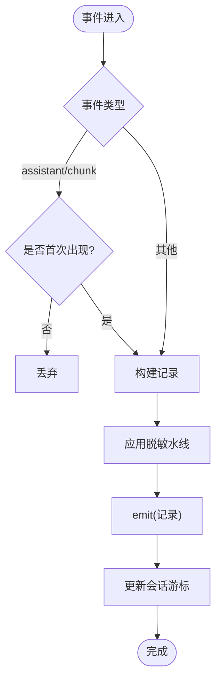
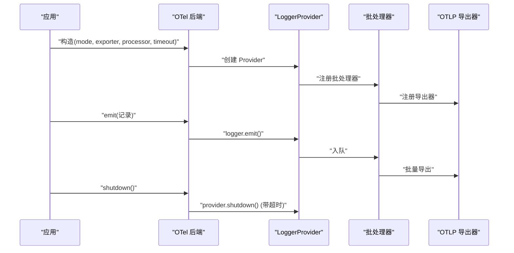

# 监控与诊断

<cite>
**本文引用的文件**
- [packages/session/session-telemetry/src/index.ts](file://packages/session/session-telemetry/src/index.ts)
- [packages/session/session-telemetry/src/coordinator.ts](file://packages/session/session-telemetry/src/coordinator.ts)
- [packages/session/session-telemetry-otel/src/index.ts](file://packages/session/session-telemetry-otel/src/index.ts)
- [packages/llm/llm/src/error.ts](file://packages/llm/llm/src/error.ts)
- [apps/cli/src/profile-boot.ts](file://apps/cli/src/profile-boot.ts)
- [packages/boot/app-boot/src/profile.ts](file://packages/boot/app-boot/src/profile.ts)
- [packages/code-runtime/code-runtime-worker-thread/src/bootstrap.ts](file://packages/code-runtime/code-runtime-worker-thread/src/bootstrap.ts)
- [packages/client/connection/src/client/fixture.ts](file://packages/client/connection/src/client/fixture.ts)
- [packages/llm/token-meter/tests/token-meter.spec.ts](file://packages/llm/token-meter/tests/token-meter.spec.ts)
- [apps/web/tests/complex-history.perf.ts](file://apps/web/tests/complex-history.perf.ts)
- [python/sdk/src/deepseek_harness/client.py](file://python/sdk/src/deepseek_harness/client.py)
</cite>

## 目录
1. [简介](#简介)
2. [项目结构](#项目结构)
3. [核心组件](#核心组件)
4. [架构总览](#架构总览)
5. [详细组件分析](#详细组件分析)
6. [依赖关系分析](#依赖关系分析)
7. [性能考量](#性能考量)
8. [故障排查指南](#故障排查指南)
9. [结论](#结论)
10. [附录](#附录)

## 简介
本指南面向 DeepSeek Harness 的运行时监控与诊断，覆盖以下主题：
- 运行时诊断工具使用方法（性能指标收集、系统状态监控）
- 遥测数据收集与分析（用户行为追踪、错误报告机制）
- 日志管理策略（日志级别配置、结构化日志格式、日志聚合方案）
- 性能分析工具使用（内存使用分析、CPU 性能调优）
- 告警规则配置与通知机制
- 常见问题诊断方法与故障排除流程
- 监控仪表板配置与可视化展示方案

## 项目结构
DeepSeek Harness 将“会话事件”作为可观测性基础，通过统一的遥测抽象层采集并投递到后端。OpenTelemetry 后端负责将记录映射为 OTLP 日志，并通过批处理器与导出器进行批量上报。同时提供进程级启动性能剖析能力，以及客户端/运行时的日志与指标投影。

**图表来源**
- [packages/session/session-telemetry/src/coordinator.ts:60-126](file://packages/session/session-telemetry/src/coordinator.ts#L60-L126)
- [packages/session/session-telemetry-otel/src/index.ts:147-253](file://packages/session/session-telemetry-otel/src/index.ts#L147-L253)

**章节来源**
- [packages/session/session-telemetry/src/index.ts:1-179](file://packages/session/session-telemetry/src/index.ts#L1-L179)
- [packages/session/session-telemetry/src/coordinator.ts:1-320](file://packages/session/session-telemetry/src/coordinator.ts#L1-L320)
- [packages/session/session-telemetry-otel/src/index.ts:1-302](file://packages/session/session-telemetry-otel/src/index.ts#L1-L302)

## 核心组件
- 会话遥测抽象层
  - 定义记录模型、严重级别、共享策略与后端接口；暴露“记录水线”扩展点用于脱敏与策略控制。
- 协调器
  - 订阅会话事件流，执行固定投影（如仅首块 chunk）、构建逻辑记录、应用脱敏水线，再交付给后端；支持“实时”和“按需”两种捕获模式。
- OpenTelemetry 后端
  - 基于 LoggerProvider + BatchLogRecordProcessor + OTLP 导出器，将记录映射为日志；支持 FULL / FEEDBACK_ONLY / DISABLED 三种共享模式；在关闭时提供超时保护。
- 错误链渲染
  - 统一渲染错误及其 cause 链，便于诊断输出与告警消息。
- 启动性能剖析
  - CLI 与 Boot 模块提供启动期 CPU/内存等指标采集入口。
- 代码运行时日志
  - 沙箱/工作线程内对 console 输出进行 shim，确保结构化且可控。
- 客户端指标投影
  - 从会话日志中派生 token 用量、上下文压力、会话统计等指标视图。

**章节来源**
- [packages/session/session-telemetry/src/index.ts:47-179](file://packages/session/session-telemetry/src/index.ts#L47-L179)
- [packages/session/session-telemetry/src/coordinator.ts:60-126](file://packages/session/session-telemetry/src/coordinator.ts#L60-L126)
- [packages/session/session-telemetry-otel/src/index.ts:43-128](file://packages/session/session-telemetry-otel/src/index.ts#L43-L128)
- [packages/llm/llm/src/error.ts:102-163](file://packages/llm/llm/src/error.ts#L102-L163)
- [apps/cli/src/profile-boot.ts](file://apps/cli/src/profile-boot.ts)
- [packages/boot/app-boot/src/profile.ts](file://packages/boot/app-boot/src/profile.ts)
- [packages/code-runtime/code-runtime-worker-thread/src/bootstrap.ts:103-120](file://packages/code-runtime/code-runtime-worker-thread/src/bootstrap.ts#L103-L120)
- [packages/client/connection/src/client/fixture.ts:1048-1070](file://packages/client/connection/src/client/fixture.ts#L1048-L1070)

## 架构总览
遥测采集链路采用“采集-协调-后端-导出”的分层设计：
- 采集侧：监听 session/event、agent/error 等事件，按策略生成逻辑记录。
- 协调器：维护每会话游标、去重 chunk、应用脱敏水线，保证热路径非阻塞。
- 后端：根据共享模式决定全量或按需采集，并将记录投递至 OTel 管道。
- 导出：由 SDK 负责批处理、重试、丢失策略与网络传输。

**图表来源**
- [packages/session/session-telemetry/src/coordinator.ts:91-126](file://packages/session/session-telemetry/src/coordinator.ts#L91-L126)
- [packages/session/session-telemetry-otel/src/index.ts:219-253](file://packages/session/session-telemetry-otel/src/index.ts#L219-L253)

## 详细组件分析

### 会话遥测抽象层（SessionTelemetryBackend）
- 职责
  - 定义 SessionTelemetryRecord、严重级别、共享策略与后端接口（emit/flush/shutdown）。
  - 暴露“session-telemetry/record”水线，供部署挂载脱敏/过滤规则。
- 关键点
  - emit 必须非阻塞（队列推送），异常被协调器捕获，不影响主循环。
  - flush 为可选提示，不强制实现以避免并发 flush 与 shutdown 竞态。
  - shutdown 需等待管道静默，失败仅警告，不阻断应用退出。

**图表来源**
- [packages/session/session-telemetry/src/index.ts:89-179](file://packages/session/session-telemetry/src/index.ts#L89-L179)

**章节来源**
- [packages/session/session-telemetry/src/index.ts:1-179](file://packages/session/session-telemetry/src/index.ts#L1-L179)

### 协调器（SessionTelemetryCoordinator）
- 职责
  - 订阅会话事件流，执行固定投影（assistant/chunk 仅首块），构建逻辑记录，应用脱敏水线后交付后端。
  - 维护 per-session 游标，避免重复发送；在 session/disposed 时发出 shutdown 操作记录。
  - 支持“live”与“on-demand”两种捕获模式；后者仅在反馈触发时回放历史日志片段。
- 关键流程
  - 事件捕获：投影 -> 脱敏 -> emit -> 更新游标。
  - 错误中继：将 agent/error 转换为 ops 记录。
  - 关闭：对所有已采用会话发出 shutdown 标记，然后调用后端 shutdown。

**图表来源**
- [packages/session/session-telemetry/src/coordinator.ts:166-226](file://packages/session/session-telemetry/src/coordinator.ts#L166-L226)

**章节来源**
- [packages/session/session-telemetry/src/coordinator.ts:1-320](file://packages/session/session-telemetry/src/coordinator.ts#L1-L320)

### OpenTelemetry 后端（OpenTelemetrySessionBackend）
- 职责
  - 根据 mode 选择 FULL / FEEDBACK_ONLY / DISABLED。
  - 构造 LoggerProvider + BatchLogRecordProcessor + OTLP 导出器，将记录映射为日志。
  - 在 DISABLED 模式下不创建 SDK 状态，仅对 feedback/record 事件发出本地警告。
- 配置要点
  - exporter.url 必填（非 DISABLED），需为 http(s)。
  - processor.maxExportBatchSize 必须为正整数。
  - shutdownTimeoutMillis 限制 provider.shutdown 等待时间。
- 共享策略
  - sharing 属性对外暴露当前共享策略，供 UI 确认文本显示。

**图表来源**
- [packages/session/session-telemetry-otel/src/index.ts:147-253](file://packages/session/session-telemetry-otel/src/index.ts#L147-L253)
- [packages/session/session-telemetry-otel/src/index.ts:283-298](file://packages/session/session-telemetry-otel/src/index.ts#L283-L298)

**章节来源**
- [packages/session/session-telemetry-otel/src/index.ts:1-302](file://packages/session/session-telemetry-otel/src/index.ts#L1-L302)

### 错误链渲染与诊断
- 功能
  - 将任意抛出值连同其 cause 链与 AggregateError 成员渲染为可读字符串，便于日志与告警。
- 使用建议
  - 在告警与通知中优先使用结构化字段（如 code、name、message），渲染结果仅用于人类阅读。

**章节来源**
- [packages/llm/llm/src/error.ts:102-163](file://packages/llm/llm/src/error.ts#L102-L163)

### 启动性能剖析
- CLI 与 Boot 模块提供启动期剖析入口，可用于定位冷启动瓶颈。
- 典型用法
  - 在进程启动阶段启用剖析，收集 CPU/内存快照，并在退出时输出报告。

**章节来源**
- [apps/cli/src/profile-boot.ts](file://apps/cli/src/profile-boot.ts)
- [packages/boot/app-boot/src/profile.ts](file://packages/boot/app-boot/src/profile.ts)

### 代码运行时日志
- 在工作线程/沙箱环境中，console 方法被替换为结构化写入缓冲，便于统一收集与解析。
- 适合用于工具执行、子代理输出的标准化日志。

**章节来源**
- [packages/code-runtime/code-runtime-worker-thread/src/bootstrap.ts:103-120](file://packages/code-runtime/code-runtime-worker-thread/src/bootstrap.ts#L103-L120)

### 客户端指标投影
- 从会话日志中派生 token 用量、上下文压力、会话统计等指标视图，便于前端/客户端展示。
- 示例包括 tokenUsage、contextPressure、contextBreakdown、sessionStats 等。

**章节来源**
- [packages/client/connection/src/client/fixture.ts:1048-1070](file://packages/client/connection/src/client/fixture.ts#L1048-L1070)
- [packages/llm/token-meter/tests/token-meter.spec.ts:148-167](file://packages/llm/token-meter/tests/token-meter.spec.ts#L148-L167)

## 依赖关系分析
- 松耦合
  - 协调器仅依赖会话事件与后端接口，不感知具体导出实现。
  - OTel 后端仅依赖 SDK 提供的 LoggerProvider/Processor/Exporter。
- 潜在环
  - 无直接循环依赖；遥测采集位于应用主循环之外，异常隔离。
- 外部集成点
  - OTLP 日志端点（exporter.url）
  - 匿名用户 ID（资源属性）
  - 应用身份（service.name/version）

**图表来源**
- [packages/session/session-telemetry/src/coordinator.ts:60-126](file://packages/session/session-telemetry/src/coordinator.ts#L60-L126)
- [packages/session/session-telemetry-otel/src/index.ts:197-218](file://packages/session/session-telemetry-otel/src/index.ts#L197-L218)

**章节来源**
- [packages/session/session-telemetry/src/coordinator.ts:1-320](file://packages/session/session-telemetry/src/coordinator.ts#L1-L320)
- [packages/session/session-telemetry-otel/src/index.ts:1-302](file://packages/session/session-telemetry-otel/src/index.ts#L1-L302)

## 性能考量
- 热路径非阻塞
  - emit 必须为队列推送；协调器对异常做容错，避免影响主循环。
- 批处理与导出
  - 使用 BatchLogRecordProcessor 降低网络开销；合理设置 maxExportBatchSize 与 scheduledDelayMillis。
- 关闭顺序与超时
  - shutdown 提供超时保护，防止导出阻塞导致进程挂起。
- 内存与 CPU
  - 启动期剖析定位冷启动热点；浏览器端可通过 CDP 指标评估 DOM/JSHeap 占用。
- 日志体积
  - 通过“仅首块 chunk”投影与按需回放减少冗余；结合脱敏水线控制敏感信息。

[本节为通用指导，无需特定文件引用]

## 故障排查指南
- 遥测未上报
  - 检查 mode 是否为 DISABLED；若为 FEEDBACK_ONLY，确认是否存在 feedback/record 事件。
  - 校验 exporter.url 是否为有效 http(s) URL。
  - 确认 processor.maxExportBatchSize 为正整数。
  - 查看后端 shutdown 是否因超时拒绝。
- 反馈事件被忽略
  - 在 FEEDBACK_ONLY 模式下，仅当 canonical 日志中存在对应 seq 的事件才会回放。
- 告警误报/漏报
  - 严重级别由事件自身语义映射（如 tool/result.isError、turn/end.reason.kind）；如需自定义，请通过“session-telemetry/record”水线调整。
- 错误难以定位
  - 使用错误链渲染函数获取完整 cause 链；在告警中保留结构化字段以便检索。
- 启动慢
  - 启用启动剖析，识别初始化耗时模块；必要时延迟加载非必要插件。
- 客户端指标异常
  - 核对 token 计量与上下文压力计算逻辑；确认会话日志完整性。

**章节来源**
- [packages/session/session-telemetry-otel/src/index.ts:170-195](file://packages/session/session-telemetry-otel/src/index.ts#L170-L195)
- [packages/session/session-telemetry-otel/src/index.ts:244-253](file://packages/session/session-telemetry-otel/src/index.ts#L244-L253)
- [packages/session/session-telemetry-otel/src/index.ts:283-298](file://packages/session/session-telemetry-otel/src/index.ts#L283-L298)
- [packages/llm/llm/src/error.ts:102-163](file://packages/llm/llm/src/error.ts#L102-L163)
- [apps/web/tests/complex-history.perf.ts:515-542](file://apps/web/tests/complex-history.perf.ts#L515-L542)

## 结论
DeepSeek Harness 的监控与诊断体系以“会话事件”为核心，通过协调器与后端解耦实现可扩展的遥测采集。OpenTelemetry 后端提供标准化的批处理与导出能力，配合启动剖析、结构化日志与客户端指标投影，形成端到端的可观测性闭环。建议在生产环境默认关闭遥测（DISABLED），仅在需要时开启并按需回放，以降低开销与隐私风险。

[本节为总结，无需特定文件引用]

## 附录

### 遥测模式与共享策略
- 模式
  - FULL：实时采集所有会话事件。
  - FEEDBACK_ONLY：仅在收到反馈事件时回放历史日志片段。
  - DISABLED：不采集任何数据，仅本地警告。
- 共享策略
  - full / feedback-only / disabled，通过后端 sharing 属性对外披露。

**章节来源**
- [packages/session/session-telemetry-otel/src/index.ts:43-84](file://packages/session/session-telemetry-otel/src/index.ts#L43-L84)
- [packages/session/session-telemetry/src/index.ts:133-140](file://packages/session/session-telemetry/src/index.ts#L133-L140)

### 配置项速查
- exporter.url：OTLP 日志端点（非 DISABLED 必填）
- processor.maxExportBatchSize：批大小（正整数）
- shutdownTimeoutMillis：关闭超时（毫秒）
- mode：FULL / FEEDBACK_ONLY / DISABLED

**章节来源**
- [packages/session/session-telemetry-otel/src/index.ts:91-128](file://packages/session/session-telemetry-otel/src/index.ts#L91-L128)

### 通知与订阅（Python SDK）
- 通过 NotificationSubscription 接收子代理生命周期与相关通知，支持 next/drain/close。
- 可按会话树过滤通知，避免跨会话噪声。

**章节来源**
- [python/sdk/src/deepseek_harness/client.py:474-557](file://python/sdk/src/deepseek_harness/client.py#L474-L557)

### 告警规则建议
- 基于严重级别
  - error：tool/result.isError、turn/end.reason.error、agent-error 操作记录。
- 基于阈值
  - token 用量突增、上下文压力持续高位、错误率超过阈值。
- 基于业务指标
  - 会话时长、工具调用失败率、子代理中断次数。

[本节为通用建议，无需特定文件引用]

### 仪表板与可视化
- 指标来源
  - 会话事件投影：tokenUsage、contextPressure、sessionStats。
  - 遥测日志：按 session.id、event.type、telemetry.op 分组。
- 推荐视图
  - 概览：错误率、平均延迟、token 消耗趋势。
  - 会话详情：事件时间线、chunk 首块、工具调用轨迹。
  - 资源：JSHeapUsedSize、DOM 节点数、事件监听器数量（浏览器端）。

**章节来源**
- [packages/client/connection/src/client/fixture.ts:1048-1070](file://packages/client/connection/src/client/fixture.ts#L1048-L1070)
- [apps/web/tests/complex-history.perf.ts:515-542](file://apps/web/tests/complex-history.perf.ts#L515-L542)