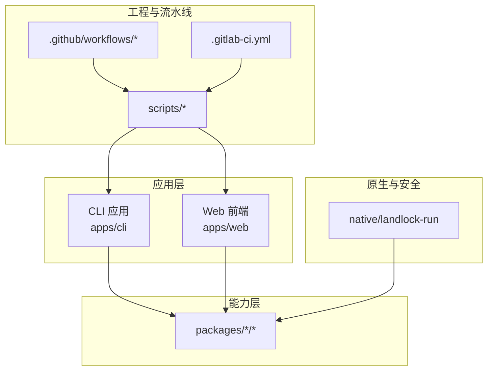
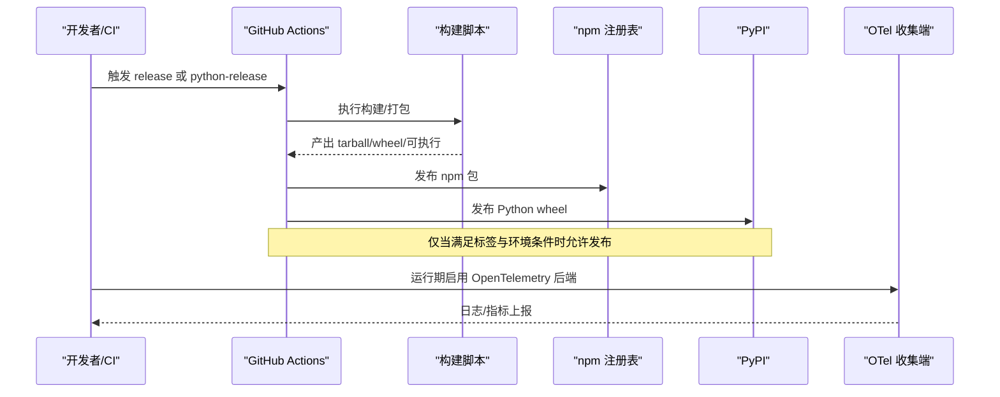
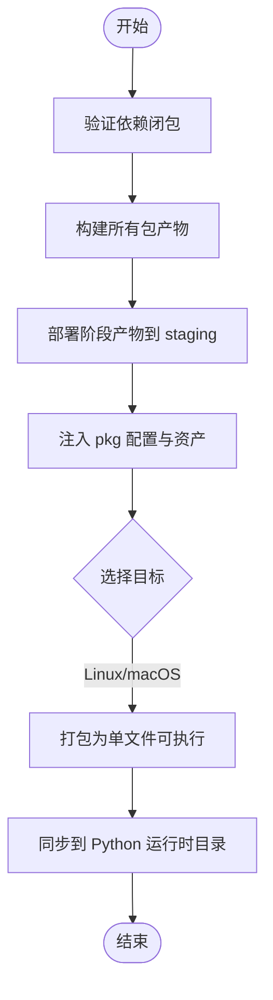
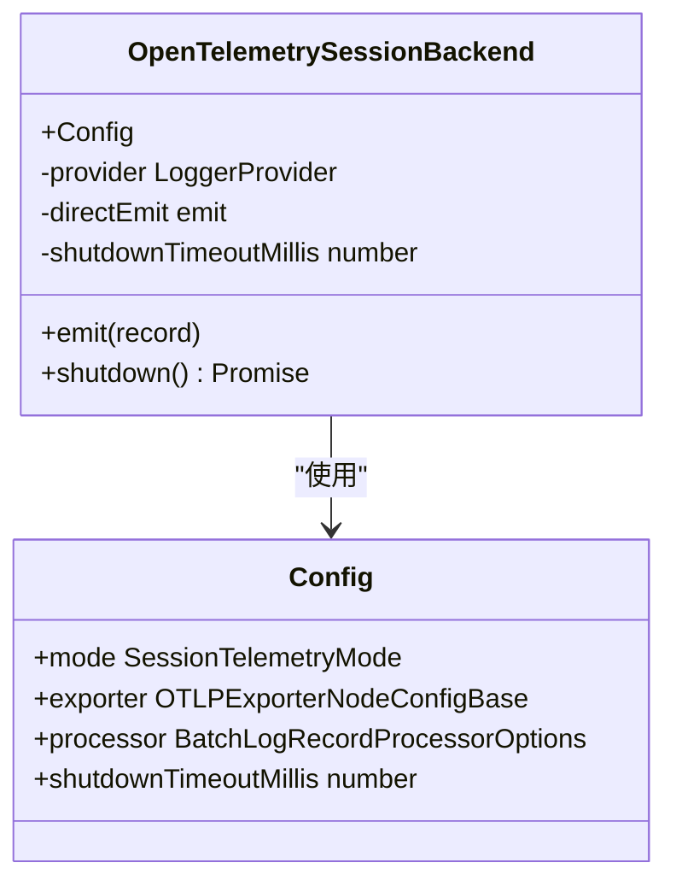
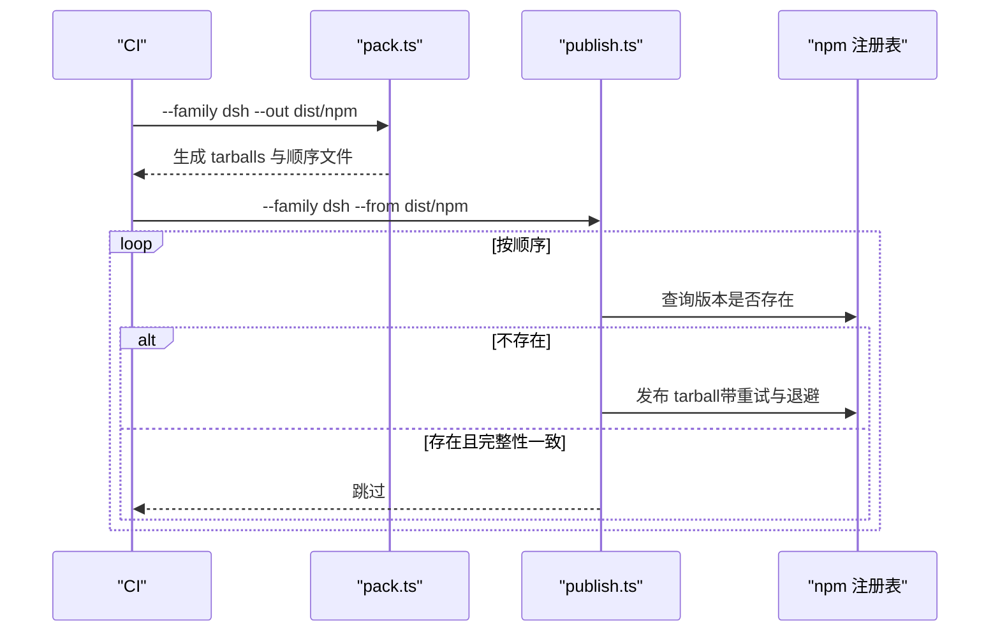
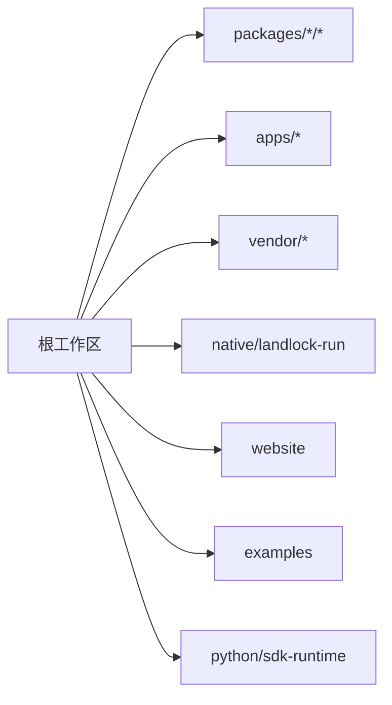

# 部署与运维

<cite>
**本文引用的文件**
- [package.json](file://package.json)
- [pnpm-workspace.yaml](file://pnpm-workspace.yaml)
- [.github/workflows/release.yml](file://.github/workflows/release.yml)
- [.github/workflows/python-release.yml](file://.github/workflows/python-release.yml)
- [scripts/build-exe-for-python-sdk.ts](file://scripts/build-exe-for-python-sdk.ts)
- [scripts/release/pack.ts](file://scripts/release/pack.ts)
- [scripts/release/publish.ts](file://scripts/release/publish.ts)
- [packages/session/session-telemetry-otel/src/index.ts](file://packages/session/session-telemetry-otel/src/index.ts)
- [apps/cli/tsdown.config.ts](file://apps/cli/tsdown.config.ts)
- [apps/web/vite.config.ts](file://apps/web/vite.config.ts)
- [.gitlab-ci.yml](file://.gitlab-ci.yml)
</cite>

## 目录
1. [简介](#简介)
2. [项目结构](#项目结构)
3. [核心组件](#核心组件)
4. [架构总览](#架构总览)
5. [详细组件分析](#详细组件分析)
6. [依赖关系分析](#依赖关系分析)
7. [性能考虑](#性能考虑)
8. [故障排除指南](#故障排除指南)
9. [结论](#结论)
10. [附录](#附录)

## 简介
本指南面向生产环境的 DeepSeek Harness 部署与运维，覆盖多目标构建、打包策略、容器化与云服务集成、监控与诊断（含 OpenTelemetry）、日志管理、自动化发布与版本管理、故障排除与性能优化。文档基于仓库中的工作流、脚本与配置进行说明，确保可操作且可追溯。

## 项目结构
DeepSeek Harness 采用 monorepo 组织：
- apps/ 提供 CLI 与 Web 前端两个产品面
- packages/ 为可复用的能力包（会话、工具、运行时等）
- native/landlock-run 提供原生安全沙箱相关产物
- scripts/ 包含构建、发布、校验等工程脚本
- .github/workflows/ 定义 GitHub Actions 流水线
- .gitlab-ci.yml 定义 GitLab CI 的 Python 制品发布流程

**图表来源**
- [package.json:1-18](file://package.json#L1-L18)
- [pnpm-workspace.yaml:1-22](file://pnpm-workspace.yaml#L1-L22)

**章节来源**
- [package.json:1-18](file://package.json#L1-L18)
- [pnpm-workspace.yaml:1-22](file://pnpm-workspace.yaml#L1-L22)

## 核心组件
- 多目标构建与打包
  - Node/JS 侧通过根脚本统一触发构建与打包；Python SDK 侧通过专用脚本生成跨平台单文件可执行并嵌入到 Python 包中。
- 自动化发布
  - npm 发布序列由 GitHub Actions 编排，先打包再发布；PyPI 发布按工件校验后分步推送。
- 监控与诊断
  - 通过 OpenTelemetry 后端插件接入日志采集，支持多种上报模式与关闭超时控制。
- 日志与可观测性
  - 使用 OTLP/HTTP 导出器将日志批量上报至收集端，资源属性携带服务身份与匿名用户标识。

**章节来源**
- [package.json:19-142](file://package.json#L19-L142)
- [scripts/build-exe-for-python-sdk.ts:1-528](file://scripts/build-exe-for-python-sdk.ts#L1-L528)
- [scripts/release/pack.ts:1-62](file://scripts/release/pack.ts#L1-L62)
- [scripts/release/publish.ts:1-170](file://scripts/release/publish.ts#L1-L170)
- [packages/session/session-telemetry-otel/src/index.ts:1-302](file://packages/session/session-telemetry-otel/src/index.ts#L1-L302)

## 架构总览
下图展示从源码到制品再到发布的整体链路，以及监控数据流向。

**图表来源**
- [.github/workflows/release.yml:1-150](file://.github/workflows/release.yml#L1-L150)
- [.github/workflows/python-release.yml:1-245](file://.github/workflows/python-release.yml#L1-L245)
- [scripts/release/pack.ts:1-62](file://scripts/release/pack.ts#L1-L62)
- [scripts/release/publish.ts:1-170](file://scripts/release/publish.ts#L1-L170)
- [packages/session/session-telemetry-otel/src/index.ts:141-302](file://packages/session/session-telemetry-otel/src/index.ts#L141-L302)

## 详细组件分析

### 多目标构建与打包策略
- 构建入口与任务编排
  - 根 package.json 提供统一的 build、test、lint、release 等脚本，封装 host/client 构建与 Web 前端构建。
- Python SDK 单文件可执行构建
  - 脚本负责验证闭包、构建产物、部署阶段产物、注入 pkg 配置、按目标 triple 打包、拷贝到 Python 运行时目录。
  - 支持 node24-linux-x64、node24-linux-arm64、node24-macos-arm64 等多目标，macOS 额外复制 spawn-helper。
- npm 发布序列
  - pack 步骤按发布顺序打包每个成员，记录顺序文件；publish 步骤读取顺序并逐个发布，具备幂等与重试逻辑。
- 流水线集成
  - GitHub Actions 在 PR 与 master 分支上执行打包与验证；仅在带 dsh-v* 标签的手动触发下才允许发布到 npm。
  - Python 发布需满足 python-v* 标签与仓库变量开关，分两步发布 runtime 与 SDK。

**图表来源**
- [scripts/build-exe-for-python-sdk.ts:219-474](file://scripts/build-exe-for-python-sdk.ts#L219-L474)

**章节来源**
- [package.json:19-142](file://package.json#L19-L142)
- [scripts/build-exe-for-python-sdk.ts:1-528](file://scripts/build-exe-for-python-sdk.ts#L1-L528)
- [scripts/release/pack.ts:1-62](file://scripts/release/pack.ts#L1-L62)
- [scripts/release/publish.ts:1-170](file://scripts/release/publish.ts#L1-L170)
- [.github/workflows/release.yml:1-150](file://.github/workflows/release.yml#L1-L150)
- [.github/workflows/python-release.yml:1-245](file://.github/workflows/python-release.yml#L1-L245)

### 容器化与云服务集成建议
- 容器镜像
  - 以 Python wheel 或已打包的可执行作为基础镜像内容，结合最小化基础镜像（如 Alpine 或 distroless）减少攻击面。
  - 将 OpenTelemetry 收集端地址、批处理参数、关闭超时等通过环境变量注入，避免硬编码。
- 云服务集成
  - 将 OTLP 端点指向云厂商日志/可观测性服务；利用工作流的环境变量与密钥管理（如 GitHub Environments/Secrets）控制发布权限。
  - 对 Python 发布，遵循仓库变量开关与标签约束，确保只有受控分支与标签能触发公开发布。

[本节为通用实践说明，不直接分析具体文件]

### 监控与诊断（OpenTelemetry）
- 模式与共享策略
  - 支持 FULL、FEEDBACK_ONLY、DISABLED 三种模式；默认禁用以避免意外外发。
- 配置项
  - exporter.url：必填（非 DISABLED），必须为 http(s)。
  - processor：透传给 BatchLogRecordProcessor，支持批大小、延迟等。
  - shutdownTimeoutMillis：外部关闭超时，防止 hang。
- 资源与上报
  - 资源属性携带 service.name/version 与匿名 user.id；日志经 OTLP/HTTP 批量上报。
- 错误与健壮性
  - 启动时对 URL、批大小、关闭超时进行严格校验；关闭路径有超时保护，避免阻塞进程退出。

**图表来源**
- [packages/session/session-telemetry-otel/src/index.ts:86-302](file://packages/session/session-telemetry-otel/src/index.ts#L86-L302)

**章节来源**
- [packages/session/session-telemetry-otel/src/index.ts:1-302](file://packages/session/session-telemetry-otel/src/index.ts#L1-L302)

### 日志管理与分析策略
- 采集
  - 通过 OpenTelemetry 后端将 session 事件与反馈事件映射为日志记录，按 channel 区分业务与运维日志。
- 传输
  - 使用 OTLP/HTTP 导出器，支持压缩、超时、keepAlive 等传输级选项；批处理器负责聚合与重传。
- 存储与分析
  - 将日志汇聚到集中式日志系统，按 service.name/version/user.id 维度进行检索与告警。
- 隐私与合规
  - 默认禁用上报；如需开启，需在配置中显式指定 exporter.url，并确保符合数据出境与隐私策略。

**章节来源**
- [packages/session/session-telemetry-otel/src/index.ts:141-302](file://packages/session/session-telemetry-otel/src/index.ts#L141-L302)

### 自动化发布流程与版本管理
- npm 发布
  - 工作流在 PR 与 master 上执行打包与验证；仅在 dsh-v* 标签手动触发 publish 时才上传到 npm。
  - pack 步骤输出 tarball 并记录发布顺序；publish 步骤按顺序发布，遇到相同完整性则跳过，避免重复。
- Python 发布
  - 构建四个 wheel（runtime 与 SDK），校验工件内容与大小；仅在 python-v* 标签且仓库变量允许时发布到公共 PyPI。
  - 分两步发布：先 runtime，再 SDK，保证依赖顺序与可恢复性。
- 版本一致性
  - Python 发布脚本从根 package.json 解析仓库版本，并与 tag 匹配校验，确保版本一致性与可追溯性。

**图表来源**
- [scripts/release/pack.ts:1-62](file://scripts/release/pack.ts#L1-L62)
- [scripts/release/publish.ts:1-170](file://scripts/release/publish.ts#L1-L170)
- [.github/workflows/release.yml:1-150](file://.github/workflows/release.yml#L1-L150)

**章节来源**
- [.github/workflows/release.yml:1-150](file://.github/workflows/release.yml#L1-L150)
- [.github/workflows/python-release.yml:1-245](file://.github/workflows/python-release.yml#L1-L245)
- [scripts/release/pack.ts:1-62](file://scripts/release/pack.ts#L1-L62)
- [scripts/release/publish.ts:1-170](file://scripts/release/publish.ts#L1-L170)

### 前端与 CLI 构建配置要点
- CLI 构建
  - 使用 tsdown 进行宿主端构建，配合根脚本统一触发。
- Web 前端
  - 使用 Vite 构建，测试与性能用例通过独立配置文件执行。

**章节来源**
- [apps/cli/tsdown.config.ts](file://apps/cli/tsdown.config.ts)
- [apps/web/vite.config.ts](file://apps/web/vite.config.ts)
- [package.json:19-142](file://package.json#L19-L142)

## 依赖关系分析
- Workspace 与包范围
  - pnpm workspace 声明了 vendor、packages、apps、website、examples、python/sdk-runtime 等成员，linkWorkspacePackages 确保本地开发解析到工作区源。
- 构建限制与白名单
  - allowBuilds 明确允许少数需要构建脚本的依赖（如 esbuild、lefthook、node-pty），其余默认拒绝，降低安装风险。
- 发布约束
  - 发布成员不得 private，必须设置 public access，repository 字段需指向仓库与目录，确保发布一致性。

**图表来源**
- [pnpm-workspace.yaml:1-22](file://pnpm-workspace.yaml#L1-L22)

**章节来源**
- [pnpm-workspace.yaml:23-73](file://pnpm-workspace.yaml#L23-L73)
- [package.json:1-18](file://package.json#L1-L18)

## 性能考虑
- 构建与打包
  - 使用缓存（pnpm store）加速安装；按需跳过构建（--skip-build）用于增量场景。
  - 单文件可执行打包时，注意资产清单与原生模块（node-pty）的引入，避免体积膨胀。
- 运行时
  - 合理设置 OTel 批处理参数（maxExportBatchSize、scheduledDelayMillis）与关闭超时，平衡吞吐与延迟。
  - 在生产环境默认禁用遥测，按需开启并限制上报范围。
- 前端
  - 使用 Vite 构建优化与代码分割；性能测试通过回放与限流模拟真实负载。

[本节为通用指导，不直接分析具体文件]

## 故障排除指南
- 发布失败
  - npm 发布遇到 E409/E429/E5xx 等临时错误会重试；若检测到已存在且完整性不同，需检查构建是否可重现。
  - Python 发布需满足标签与仓库变量；若未配置 PYPI_PUBLISHER_REPOSITORY 或 PUBLIC_PYPI_RELEASE_ENABLED，将阻止发布。
- 构建问题
  - Python 可执行构建要求 Linux 目标与宿主机架构一致；否则报错提示必须在目标架构上构建。
  - macOS 产物需附带 spawn-helper；缺失会导致子进程创建失败。
- 监控与日志
  - 若 exporter.url 为空或协议非法，插件加载时会抛出配置错误；关闭超时会防止 hang。
  - 默认禁用模式下，feedback/record 事件不会上报，仅记录警告。

**章节来源**
- [scripts/release/publish.ts:24-170](file://scripts/release/publish.ts#L24-L170)
- [.github/workflows/python-release.yml:105-133](file://.github/workflows/python-release.yml#L105-L133)
- [scripts/build-exe-for-python-sdk.ts:416-436](file://scripts/build-exe-for-python-sdk.ts#L416-L436)
- [packages/session/session-telemetry-otel/src/index.ts:170-196](file://packages/session/session-telemetry-otel/src/index.ts#L170-L196)

## 结论
DeepSeek Harness 提供了完善的 monorepo 构建与发布体系，结合 GitHub Actions 与 GitLab CI 实现安全的自动化发布流程。通过 OpenTelemetry 后端插件，可在生产环境中灵活启用遥测与日志上报，同时保持默认禁用的安全基线。建议在容器化部署中结合环境变量注入关键配置，并依据团队需求调整批处理与关闭超时参数，以获得稳定高效的运行体验。

## 附录
- 常用命令参考
  - 构建与测试：见根 package.json scripts
  - 发布：通过 GitHub Actions 触发，遵循标签与环境约束
  - Python 可执行构建：使用 scripts/build-exe-for-python-sdk.ts 指定目标 triple

[本节为补充信息，不直接分析具体文件]