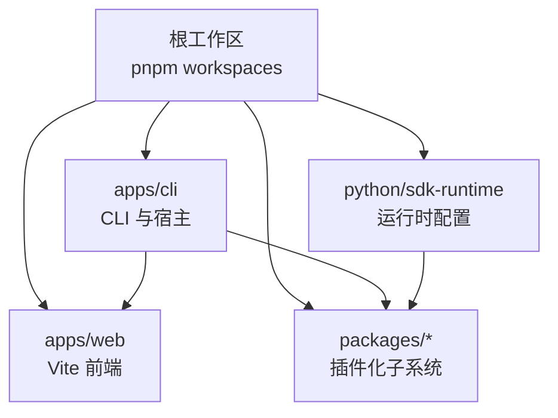
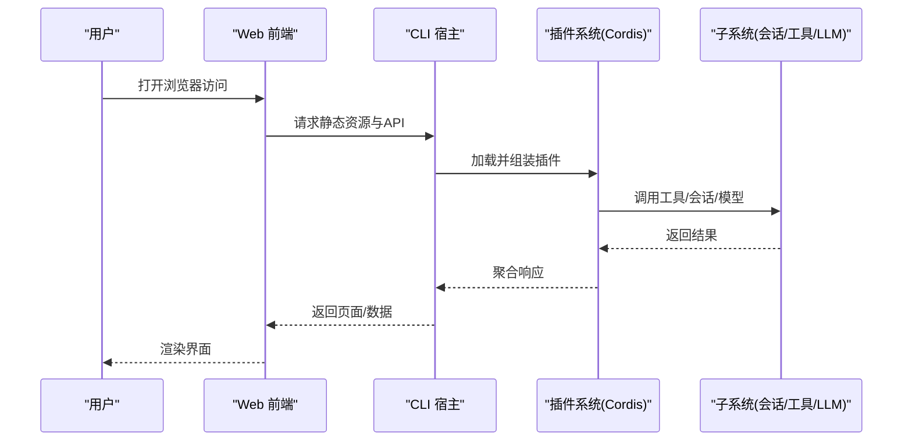
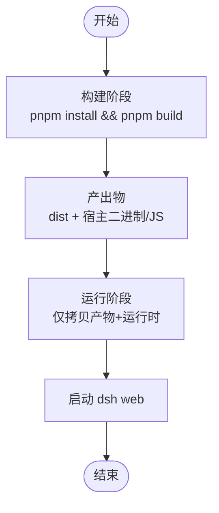
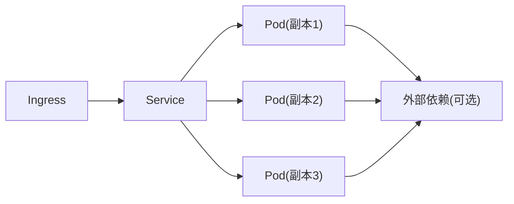
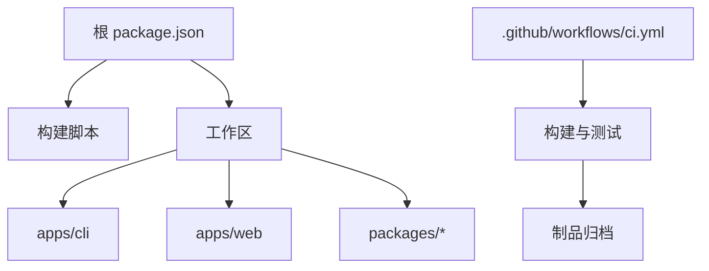

# 部署策略

<cite>
**本文引用的文件**
- [README.md](file://README.md)
- [package.json](file://package.json)
- [apps/cli/package.json](file://apps/cli/package.json)
- [apps/web/package.json](file://apps/web/package.json)
- [.github/workflows/ci.yml](file://.github/workflows/ci.yml)
- [apps/cli/config/agent-presets/code/preset.yml](file://apps/cli/config/agent-presets/code/preset.yml)
- [python/sdk-runtime/src/deepseek_harness_runtime/runtime/cordis.yml](file://python/sdk-runtime/src/deepseek_harness_runtime/runtime/cordis.yml)
</cite>

## 目录
1. [简介](#简介)
2. [项目结构](#项目结构)
3. [核心组件](#核心组件)
4. [架构总览](#架构总览)
5. [详细组件分析](#详细组件分析)
6. [依赖关系分析](#依赖关系分析)
7. [性能考虑](#性能考虑)
8. [故障排查指南](#故障排查指南)
9. [结论](#结论)
10. [附录](#附录)

## 简介
本指南面向 DeepSeek Harness（dsh）的容器化与云原生部署，覆盖 Docker 镜像构建、多阶段构建优化、主流云平台（AWS/Azure/GCP）部署最佳实践、无服务器与边缘计算模式、Kubernetes 服务发现/负载均衡/滚动更新、环境变量与密钥管理、监控与健康检查、以及故障恢复与灾难恢复策略。内容基于仓库现有工程结构与 CI/CD 配置进行提炼，确保可落地且与代码一致。

## 项目结构
DeepSeek Harness 采用 monorepo 组织：
- apps/cli：命令行入口与宿主服务，提供 web 命令启动前端静态资源与后端能力
- apps/web：Web 前端应用，使用 Vite 构建产物供 CLI 托管
- packages/*：插件化子系统（LLM、会话、工具、工作流等），通过 Cordis 组合
- python/sdk-runtime：Python SDK 运行时，包含运行时配置文件
- .github/workflows：CI/CD 流水线，涵盖构建、测试、兼容性与发布相关任务

**图示来源**
- [package.json:11-18](file://package.json#L11-L18)
- [apps/cli/package.json:1-20](file://apps/cli/package.json#L1-L20)
- [apps/web/package.json:1-25](file://apps/web/package.json#L1-L25)

**章节来源**
- [README.md:1-58](file://README.md#L1-L58)
- [package.json:11-18](file://package.json#L11-L18)

## 核心组件
- CLI 宿主与 Web 入口
  - CLI 暴露 dsh 命令，支持 web 子命令以启动内置 Web UI
  - Web 前端由 Vite 构建，产物被 CLI 托管
- 插件化运行时
  - 通过 Cordis 将各子系统作为插件装配，便于扩展与隔离
- Python SDK 运行时
  - 提供运行时配置文件，用于在 Python 生态中集成 Harness

**章节来源**
- [apps/cli/package.json:1-20](file://apps/cli/package.json#L1-L20)
- [apps/web/package.json:1-25](file://apps/web/package.json#L1-L25)
- [python/sdk-runtime/src/deepseek_harness_runtime/runtime/cordis.yml](file://python/sdk-runtime/src/deepseek_harness_runtime/runtime/cordis.yml)

## 架构总览
下图展示从请求到执行的关键路径：用户访问 Web UI，CLI 提供静态资源与 API；内部通过插件系统调用 LLM、工具与工作流；CI 流水线负责构建与验证。

**图示来源**
- [apps/cli/package.json:1-20](file://apps/cli/package.json#L1-L20)
- [apps/web/package.json:1-25](file://apps/web/package.json#L1-L25)
- [package.json:11-18](file://package.json#L11-L18)

## 详细组件分析

### 容器化与多阶段构建
- 构建目标
  - 前端：Vite 构建静态资源，输出至 dist
  - 宿主：CLI 编译产物与依赖，提供 web 命令
- 多阶段建议
  - 构建阶段：安装 Node.js 与 pnpm，执行 pnpm install 与 pnpm build
  - 运行阶段：仅拷贝构建产物与最小运行时，减少镜像体积
- 安全加固
  - 非 root 用户运行
  - 只读文件系统（除必要日志/缓存目录）
  - 最小权限网络访问

[本节为概念性流程，不直接映射具体源码文件]

### 云服务部署最佳实践（AWS/Azure/GCP）
- 通用原则
  - 使用容器镜像统一交付
  - 通过环境变量注入配置，避免硬编码
  - 启用健康检查端点，配合平台探针
  - 使用平台密钥管理服务（如 Secrets Manager/KMS）
- AWS
  - ECS/Fargate：定义任务定义、服务、ALB 监听器
  - 使用 Secrets Manager 注入凭据
  - CloudWatch 收集日志与指标
- Azure
  - Container Apps：容器化应用，自动扩缩容
  - Key Vault 管理密钥
  - Application Insights 观测
- GCP
  - Cloud Run：无服务器容器，按请求计费
  - Secret Manager 管理敏感信息
  - Cloud Logging/Monitoring 观测

[本节为通用指导，不直接引用具体源码文件]

### 无服务器与边缘计算
- 函数计算
  - 将 dsh 作为容器镜像部署到 FaaS（如 AWS Lambda 容器、Azure Functions、GCP Cloud Run Functions）
  - 通过事件触发（HTTP、消息队列、定时任务）驱动 agent 执行
- 边缘计算
  - 在边缘节点运行轻量容器，缓存本地资源与模型权重
  - 通过边云协同，降低延迟与带宽消耗

[本节为概念性指导，不直接引用具体源码文件]

### Kubernetes 部署配置
- 服务发现
  - 使用 Service 暴露端口，ClusterIP/NodePort/LoadBalancer
  - Ingress 管理外部访问与 TLS
- 负载均衡
  - Deployment 副本数与 HPA 基于 CPU/内存/自定义指标扩缩容
  - PodDisruptionBudget 保障滚动更新期间的可用性
- 滚动更新
  - strategy: rollingUpdate 设置 maxUnavailable/maxSurge
  - readinessProbe/livenessProbe 确保流量只路由到就绪 Pod

[本节为概念性架构图，不直接映射具体源码文件]

### 环境变量管理与密钥安全存储
- 环境变量
  - 通过平台或编排层注入（ECS Task Definition、Container App Environment Variables、Kubernetes ConfigMap/Secret）
  - 区分非机密配置与机密配置，后者使用 Secret
- 密钥存储
  - 使用平台密钥服务（Secrets Manager、Key Vault、Secret Manager）
  - 运行时动态读取，避免写入镜像或持久卷
- 配置分层
  - 基础配置（ConfigMap）、环境特定配置（环境变量）、机密（Secret）
  - 应用内按命名空间与优先级合并

[本节为通用指导，不直接引用具体源码文件]

### 监控与健康检查
- 健康检查
  - 实现 /healthz 与 /readyz 端点，分别表示存活与就绪
  - 平台探针定期探测，失败时摘除流量或重启实例
- 指标与日志
  - 暴露 Prometheus 指标（CPU、内存、请求量、错误率）
  - 结构化日志输出，集中采集与分析
- 告警
  - 基于阈值与异常模式设置告警规则
  - 联动通知渠道（邮件、短信、IM）

[本节为通用指导，不直接引用具体源码文件]

### 故障恢复与灾难恢复
- 故障恢复
  - 重试与退避策略：对临时失败（网络抖动、限流）实施指数退避
  - 熔断与降级：当依赖不可用时快速失败，返回兜底响应
  - 幂等性：确保重试不会导致副作用重复
- 灾难恢复
  - 备份与快照：定期备份关键状态（会话、配置、密钥）
  - 多区域部署：跨可用区/跨区域冗余
  - 演练：定期进行故障切换演练，验证 RTO/RPO

[本节为通用指导，不直接引用具体源码文件]

## 依赖关系分析
- 工作区与脚本
  - 根 package.json 定义 workspaces 与构建脚本，协调多包构建
  - CLI 与 Web 作为顶层应用，依赖多个子系统包
- CI/CD 流水线
  - GitHub Actions 定义多平台构建、测试与兼容性校验
  - 缓存与并行化提升构建效率

**图示来源**
- [package.json:11-18](file://package.json#L11-L18)
- [.github/workflows/ci.yml:1-80](file://.github/workflows/ci.yml#L1-L80)

**章节来源**
- [package.json:11-18](file://package.json#L11-L18)
- [.github/workflows/ci.yml:1-80](file://.github/workflows/ci.yml#L1-L80)

## 性能考虑
- 构建优化
  - 多阶段构建减少镜像体积
  - 依赖缓存（pnpm store、Playwright 浏览器缓存）
  - 并行化任务（类型检查、测试、构建）
- 运行期优化
  - 合理设置副本数与资源限制
  - 使用连接池与缓存减少外部依赖压力
  - 启用压缩与静态资源 CDN

[本节为通用指导，不直接引用具体源码文件]

## 故障排查指南
- 常见问题
  - 启动失败：检查环境变量与密钥是否正确注入
  - 健康检查失败：确认 /healthz 与 /readyz 逻辑正确
  - 依赖超时：检查网络策略与防火墙规则
- 诊断步骤
  - 查看容器日志与平台监控
  - 复现问题并抓取堆栈与上下文
  - 逐步隔离依赖，定位瓶颈
- 回滚与恢复
  - 使用版本化镜像与配置，快速回滚
  - 启用蓝绿/金丝雀发布，降低风险

[本节为通用指导，不直接引用具体源码文件]

## 结论
DeepSeek Harness 的部署应围绕容器化与云原生展开，结合多阶段构建、平台密钥管理、健康检查与监控、以及完善的故障与灾难恢复策略。通过 CI/CD 流水线保证构建质量与一致性，借助 Kubernetes 或服务网格实现弹性与高可用。遵循本文指南，可在主流云平台稳定、安全地运行 Harness。

## 附录
- 参考配置与示例
  - CLI 预设与运行时配置位于仓库中，可作为部署模板的基础
  - CI 流水线展示了构建、测试与兼容性校验的最佳实践

**章节来源**
- [apps/cli/config/agent-presets/code/preset.yml:1-4](file://apps/cli/config/agent-presets/code/preset.yml#L1-L4)
- [python/sdk-runtime/src/deepseek_harness_runtime/runtime/cordis.yml](file://python/sdk-runtime/src/deepseek_harness_runtime/runtime/cordis.yml)
- [.github/workflows/ci.yml:1-80](file://.github/workflows/ci.yml#L1-L80)