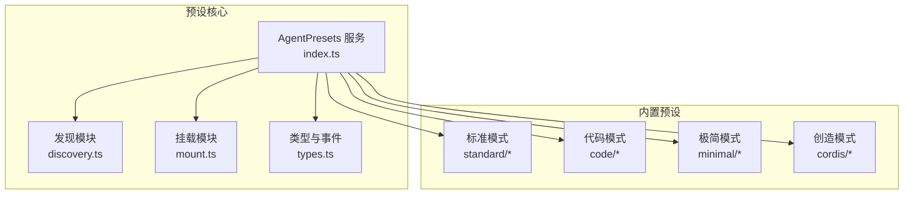
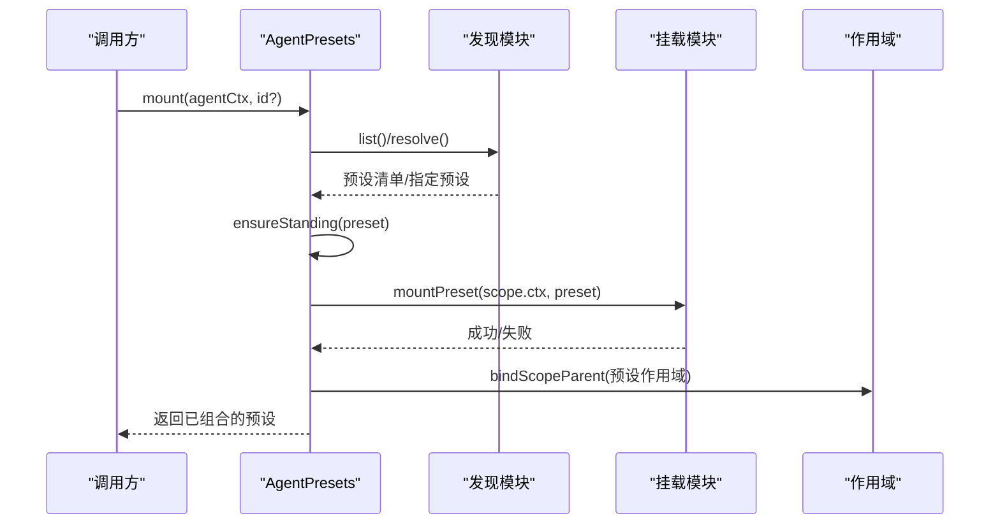
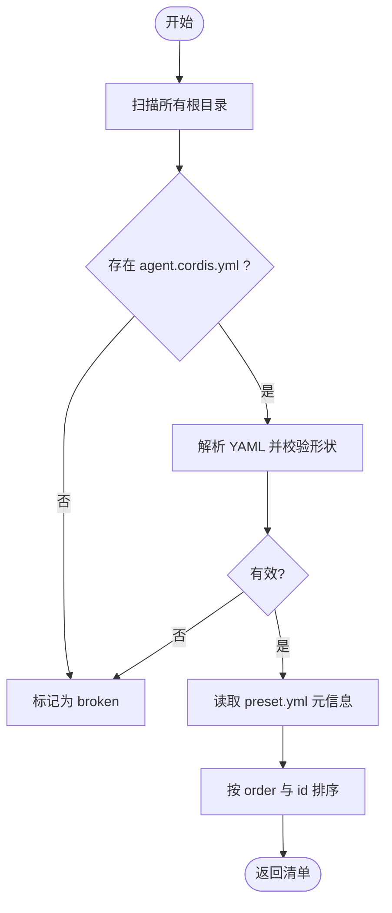
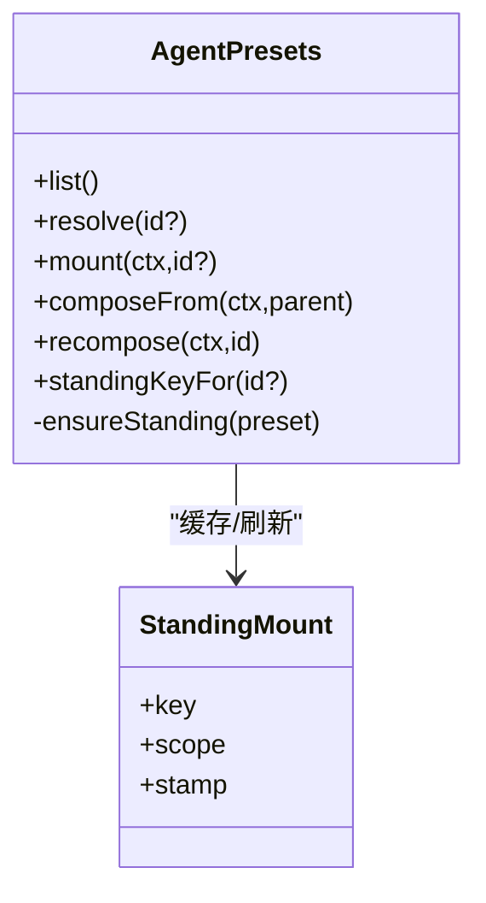
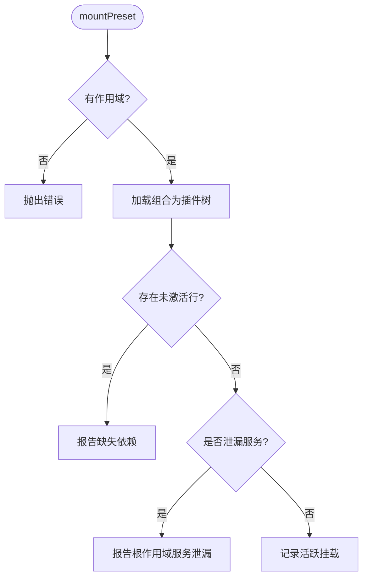
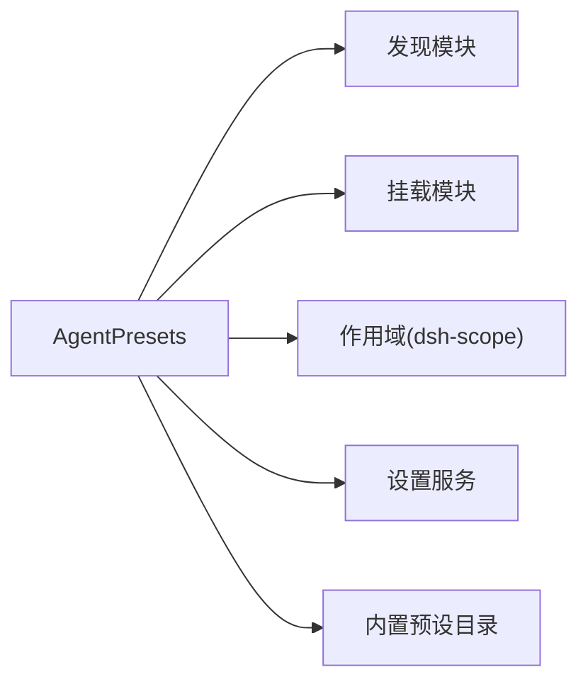

# Agent 预设系统

<cite>
**本文引用的文件**
- [index.ts](file://packages/preset/agent-presets/src/index.ts)
- [discovery.ts](file://packages/preset/agent-presets/src/discovery.ts)
- [mount.ts](file://packages/preset/agent-presets/src/mount.ts)
- [types.ts](file://packages/preset/agent-presets/src/types.ts)
- [preset.yml（标准模式）](file://apps/cli/config/agent-presets/standard/preset.yml)
- [agent.cordis.yml（标准模式）](file://apps/cli/config/agent-presets/standard/agent.cordis.yml)
- [preset.yml（代码模式）](file://apps/cli/config/agent-presets/code/preset.yml)
- [agent.cordis.yml（代码模式）](file://apps/cli/config/agent-presets/code/agent.cordis.yml)
- [preset.yml（极简模式）](file://apps/cli/config/agent-presets/minimal/preset.yml)
- [agent.cordis.yml（极简模式）](file://apps/cli/config/agent-presets/minimal/agent.cordis.yml)
- [preset.yml（创造模式）](file://apps/cli/config/agent-presets/cordis/preset.yml)
- [agent.cordis.yml（创造模式）](file://apps/cli/config/agent-presets/cordis/agent.cordis.yml)
</cite>

## 目录
1. [简介](#简介)
2. [项目结构](#项目结构)
3. [核心组件](#核心组件)
4. [架构总览](#架构总览)
5. [详细组件分析](#详细组件分析)
6. [依赖关系分析](#依赖关系分析)
7. [性能与热重载](#性能与热重载)
8. [故障排查指南](#故障排查指南)
9. [结论](#结论)
10. [附录：常用场景与配置示例](#附录常用场景与配置示例)

## 简介
Agent 预设系统是 DeepSeek Harness 中用于“按会话装配模型可见能力”的机制。每个预设是一个 Cordis 组合文件，描述该 Agent 可用的工具、提示段、工作流等；运行时以“常驻挂载”的方式将预设组合到进程级作用域，并通过作用域父子关系让每个 Agent 加入并继承这些能力。系统内置了多种预设（如标准、代码、极简、创造），同时支持用户自定义预设，便于快速构建和分享可复用的 Agent 配置。

## 项目结构
- 预设发现与装载核心位于 packages/preset/agent-presets/src，提供清单扫描、元数据读取、常驻挂载、服务查找、事件发布等能力。
- 内置预设位于 apps/cli/config/agent-presets，每个子目录代表一个预设，包含：
  - agent.cordis.yml：Agent 层组合（工具、技能、计划模式、压缩、委托与工作流等）。
  - preset.yml：预设元信息（名称、描述、排序）。
- 用户自定义预设默认位于 harness-home 下的 .agent-presets 目录，由系统在扫描时自动纳入。

**图示来源**
- [index.ts:82-182](file://packages/preset/agent-presets/src/index.ts#L82-L182)
- [discovery.ts:139-186](file://packages/preset/agent-presets/src/discovery.ts#L139-L186)
- [mount.ts:332-381](file://packages/preset/agent-presets/src/mount.ts#L332-L381)

**章节来源**
- [index.ts:82-182](file://packages/preset/agent-presets/src/index.ts#L82-L182)
- [discovery.ts:139-186](file://packages/preset/agent-presets/src/discovery.ts#L139-L186)
- [mount.ts:332-381](file://packages/preset/agent-presets/src/mount.ts#L332-L381)

## 核心组件
- AgentPresets 服务：负责预设根目录解析、列表与解析、默认预设选择、常驻挂载、作用域绑定、重组合、冷读键获取、设置项读写等。
- 发现模块：扫描预设根目录，校验组合文件形状与 YAML 合法性，产出带健康状态的预设清单。
- 挂载模块：将预设组合以插件树形式挂载到作用域，检查未激活行与服务泄漏，维护活跃挂载集合。
- 类型与事件：定义客户端安全的事件声明，如“已选择预设”。

关键职责与交互：
- 清单与解析：list() 与 resolve() 每次重新扫描根目录，保证热更新可见；resolveMountable() 拒绝损坏的预设。
- 常驻挂载：ensureStanding() 基于文件时间戳与大小生成“代次”，同一预设只挂载一次，后续会话复用或按需刷新。
- 作用域绑定：通过 bindScopeParent 将 Agent 的作用域父节点指向预设的常驻作用域，从而继承其注册的工具与提示段。
- 服务访问：serviceForAgent() 允许在宿主侧按 Agent 上下文读取其预设内服务实例。

**章节来源**
- [index.ts:82-182](file://packages/preset/agent-presets/src/index.ts#L82-L182)
- [index.ts:191-239](file://packages/preset/agent-presets/src/index.ts#L191-L239)
- [index.ts:275-338](file://packages/preset/agent-presets/src/index.ts#L275-L338)
- [index.ts:458-488](file://packages/preset/agent-presets/src/index.ts#L458-L488)
- [discovery.ts:55-106](file://packages/preset/agent-presets/src/discovery.ts#L55-L106)
- [discovery.ts:139-186](file://packages/preset/agent-presets/src/discovery.ts#L139-L186)
- [mount.ts:178-203](file://packages/preset/agent-presets/src/mount.ts#L178-L203)
- [mount.ts:256-272](file://packages/preset/agent-presets/src/mount.ts#L256-L272)
- [mount.ts:332-381](file://packages/preset/agent-presets/src/mount.ts#L332-L381)
- [types.ts:4-14](file://packages/preset/agent-presets/src/types.ts#L4-L14)

## 架构总览
预设系统采用“宿主-预设”两层组合：
- 宿主层：持有全局注册表、沙箱与审批栈、持久化、模型路由等。
- 预设层：为单个 Agent 装配模型可见的能力（工具、提示段、技能、计划模式、压缩、委托与工作流等）。

**图示来源**
- [index.ts:275-338](file://packages/preset/agent-presets/src/index.ts#L275-L338)
- [index.ts:491-534](file://packages/preset/agent-presets/src/index.ts#L491-L534)
- [mount.ts:332-381](file://packages/preset/agent-presets/src/mount.ts#L332-L381)

## 详细组件分析

### 预设发现与优先级
- 预设根顺序：配置的 roots 在前，随后是用户根（除非关闭 includeUserRoot）。同 id 时，先出现的根优先。
- 健康检查：对缺失或不可解析的组合文件标记 broken，避免“幽灵目录”占用 id。
- 排序规则：order 字段越小越靠前；相同 order 按 id 字典序。

**图示来源**
- [discovery.ts:55-106](file://packages/preset/agent-presets/src/discovery.ts#L55-L106)
- [discovery.ts:139-186](file://packages/preset/agent-presets/src/discovery.ts#L139-L186)

**章节来源**
- [discovery.ts:55-106](file://packages/preset/agent-presets/src/discovery.ts#L55-L106)
- [discovery.ts:139-186](file://packages/preset/agent-presets/src/discovery.ts#L139-L186)

### 常驻挂载与代次管理
- 单飞创建：同一预设的常驻挂载仅创建一个 Promise，并发请求共享。
- 代次检测：记录组合文件的 mtime 与 size，变化后重建新代次，旧代次继续服务已加入的会话。
- 作用域绑定：将 Agent 的作用域父节点指向预设作用域，实现能力继承。

**图示来源**
- [index.ts:241-338](file://packages/preset/agent-presets/src/index.ts#L241-L338)
- [index.ts:491-534](file://packages/preset/agent-presets/src/index.ts#L491-L534)

**章节来源**
- [index.ts:241-338](file://packages/preset/agent-presets/src/index.ts#L241-L338)
- [index.ts:491-534](file://packages/preset/agent-presets/src/index.ts#L491-L534)

### 挂载校验与安全边界
- 未激活行检查：确保所有启用行都进入可用状态，否则报告缺失依赖。
- 服务泄漏检查：禁止预设向根作用域发布服务，防止进程级污染；必须使用 isolate 分组。
- 导入基址修正：预设中的包名从宿主基址解析，避免本地路径导致的依赖解析失败。

**图示来源**
- [mount.ts:274-301](file://packages/preset/agent-presets/src/mount.ts#L274-L301)
- [mount.ts:332-381](file://packages/preset/agent-presets/src/mount.ts#L332-L381)

**章节来源**
- [mount.ts:274-301](file://packages/preset/agent-presets/src/mount.ts#L274-L301)
- [mount.ts:332-381](file://packages/preset/agent-presets/src/mount.ts#L332-L381)

### 预设与插件组合的关系
- 宿主层拥有：注册表、沙箱与审批栈、持久化、模型路由等。
- 预设层贡献：工具、提示段、技能、计划模式、压缩、委托与工作流等模型可见能力。
- 隔离原则：任何服务行必须置于带 isolate 的分组内，避免进程级冲突。

**章节来源**
- [agent.cordis.yml（标准模式）:1-19](file://apps/cli/config/agent-presets/standard/agent.cordis.yml#L1-L19)
- [agent.cordis.yml（代码模式）:1-26](file://apps/cli/config/agent-presets/code/agent.cordis.yml#L1-L26)
- [agent.cordis.yml（极简模式）:1-7](file://apps/cli/config/agent-presets/minimal/agent.cordis.yml#L1-L7)
- [agent.cordis.yml（创造模式）:1-12](file://apps/cli/config/agent-presets/cordis/agent.cordis.yml#L1-L12)

## 依赖关系分析
- AgentPresets 依赖：
  - 发现模块：扫描与校验预设。
  - 挂载模块：执行组合、校验与审计。
  - 作用域：绑定 Agent 到预设作用域。
  - 设置服务：读取/写入默认预设。
- 内置预设依赖宿主提供的注册表与基础设施，自身仅暴露模型可见能力。

**图示来源**
- [index.ts:24-37](file://packages/preset/agent-presets/src/index.ts#L24-L37)
- [index.ts:82-182](file://packages/preset/agent-presets/src/index.ts#L82-L182)

**章节来源**
- [index.ts:24-37](file://packages/preset/agent-presets/src/index.ts#L24-L37)
- [index.ts:82-182](file://packages/preset/agent-presets/src/index.ts#L82-L182)

## 性能与热重载
- 常驻挂载减少重复组装成本：同一预设只挂载一次，后续会话直接加入。
- 代次变更触发增量刷新：仅当组合文件内容变化时才重建新代次，已加入会话不受影响。
- 热重载体验：
  - 编辑用户预设后，下一次 list()/resolve() 即可看到变化。
  - 新建会话会加载最新代次；已有会话保持原代次直至销毁。
  - 可通过 recompose() 将现有 Agent 切换到新预设（需满足无历史产出的约束）。

**章节来源**
- [index.ts:191-239](file://packages/preset/agent-presets/src/index.ts#L191-L239)
- [index.ts:241-338](file://packages/preset/agent-presets/src/index.ts#L241-L338)
- [index.ts:458-488](file://packages/preset/agent-presets/src/index.ts#L458-L488)
- [index.ts:491-534](file://packages/preset/agent-presets/src/index.ts#L491-L534)

## 故障排查指南
- 常见错误与定位：
  - 未知预设：resolve() 找不到 id，检查清单与默认预设设置。
  - 损坏预设：resolveMountable() 拒绝 broken 预设，查看 discovery 报告的 reason。
  - 挂载失败：mountPreset() 抛出聚合错误，查看 inactiveRows 与 leakedServices 输出。
  - 服务泄漏：若检测到根作用域服务泄漏，需在预设中将服务放入 isolate 分组或移至宿主层。
- 调试建议：
  - 使用 livePresetMounts() 查看当前活跃挂载。
  - 使用 standingKeyFor() 获取冷读所需的预设作用域键。
  - 通过 serviceForAgent() 在宿主侧读取某 Agent 的预设服务实例进行验证。

**章节来源**
- [index.ts:213-239](file://packages/preset/agent-presets/src/index.ts#L213-L239)
- [mount.ts:178-203](file://packages/preset/agent-presets/src/mount.ts#L178-L203)
- [mount.ts:256-272](file://packages/preset/agent-presets/src/mount.ts#L256-L272)
- [mount.ts:332-381](file://packages/preset/agent-presets/src/mount.ts#L332-L381)

## 结论
Agent 预设系统通过“发现—挂载—作用域绑定”的清晰链路，实现了按会话装配模型可见能力的目标。内置预设覆盖从极简到创造的多种场景，用户可基于复制与编辑快速创建自定义预设。常驻挂载与代次机制兼顾性能与热重载体验，严格的挂载校验保障稳定性与安全性。结合宿主与预设的职责划分，系统具备良好的可扩展性与可维护性。

## 附录：常用场景与配置示例
- 标准模式：功能完整的编码 Agent，支持文件编辑、Shell、检索、技能、计划、目标、子代理与工作流。
- 代码模式：在标准基础上引入 Code Mode SDK 呈现方式，用 TypeScript 程序组合多步操作。
- 极简模式：仅提供持久 bash 与 str_replace_editor 的双工具编码 Agent，适合轻量任务。
- 创造模式：具备标准能力并提供运行时检查、插件实验与创作指导，用于编写自定义预设。

各预设的元信息与组合文件路径如下：
- 标准模式
  - 元信息：[preset.yml（标准模式）](file://apps/cli/config/agent-presets/standard/preset.yml)
  - 组合：[agent.cordis.yml（标准模式）](file://apps/cli/config/agent-presets/standard/agent.cordis.yml)
- 代码模式
  - 元信息：[preset.yml（代码模式）](file://apps/cli/config/agent-presets/code/preset.yml)
  - 组合：[agent.cordis.yml（代码模式）](file://apps/cli/config/agent-presets/code/agent.cordis.yml)
- 极简模式
  - 元信息：[preset.yml（极简模式）](file://apps/cli/config/agent-presets/minimal/preset.yml)
  - 组合：[agent.cordis.yml（极简模式）](file://apps/cli/config/agent-presets/minimal/agent.cordis.yml)
- 创造模式
  - 元信息：[preset.yml（创造模式）](file://apps/cli/config/agent-presets/cordis/preset.yml)
  - 组合：[agent.cordis.yml（创造模式）](file://apps/cli/config/agent-presets/cordis/agent.cordis.yml)

**章节来源**
- [preset.yml（标准模式）:1-4](file://apps/cli/config/agent-presets/standard/preset.yml#L1-L4)
- [agent.cordis.yml（标准模式）:1-252](file://apps/cli/config/agent-presets/standard/agent.cordis.yml#L1-L252)
- [preset.yml（代码模式）:1-4](file://apps/cli/config/agent-presets/code/preset.yml#L1-L4)
- [agent.cordis.yml（代码模式）:1-263](file://apps/cli/config/agent-presets/code/agent.cordis.yml#L1-L263)
- [preset.yml（极简模式）:1-4](file://apps/cli/config/agent-presets/minimal/preset.yml#L1-L4)
- [agent.cordis.yml（极简模式）:1-63](file://apps/cli/config/agent-presets/minimal/agent.cordis.yml#L1-L63)
- [preset.yml（创造模式）:1-4](file://apps/cli/config/agent-presets/cordis/preset.yml#L1-L4)
- [agent.cordis.yml（创造模式）:1-263](file://apps/cli/config/agent-presets/cordis/agent.cordis.yml#L1-L263)