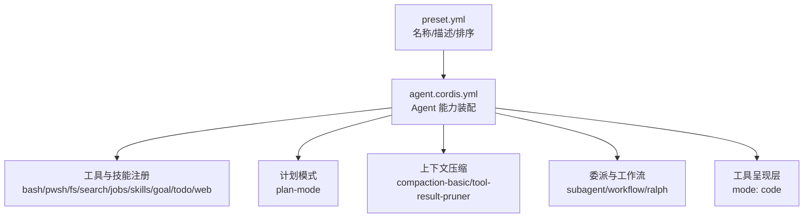
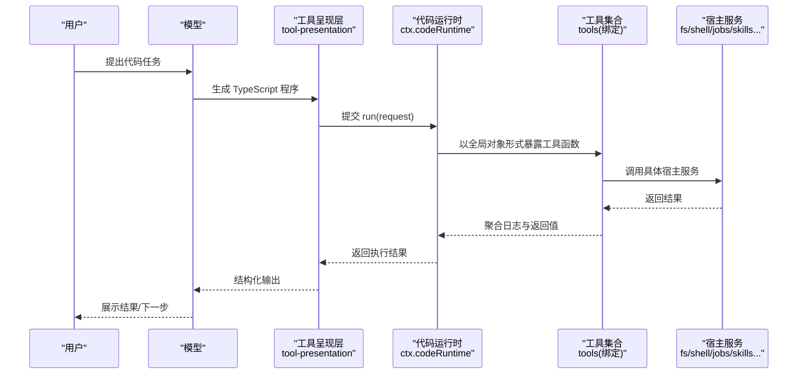
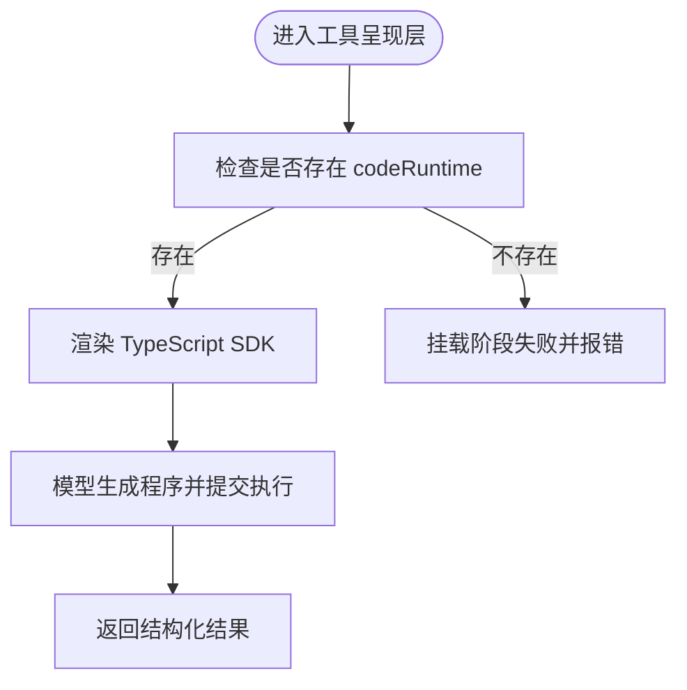
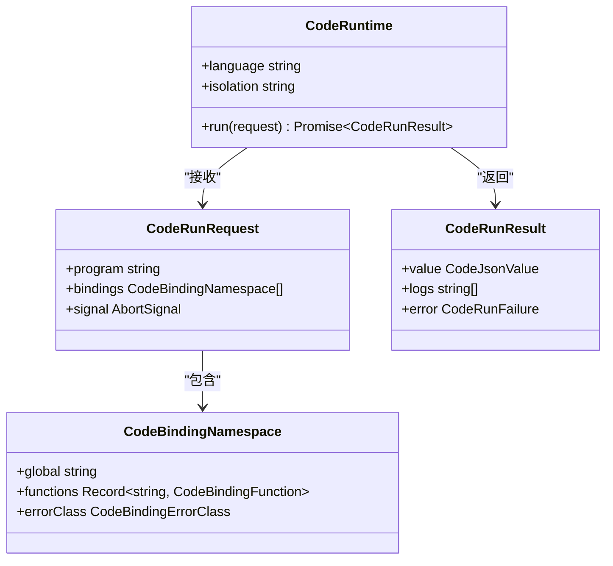
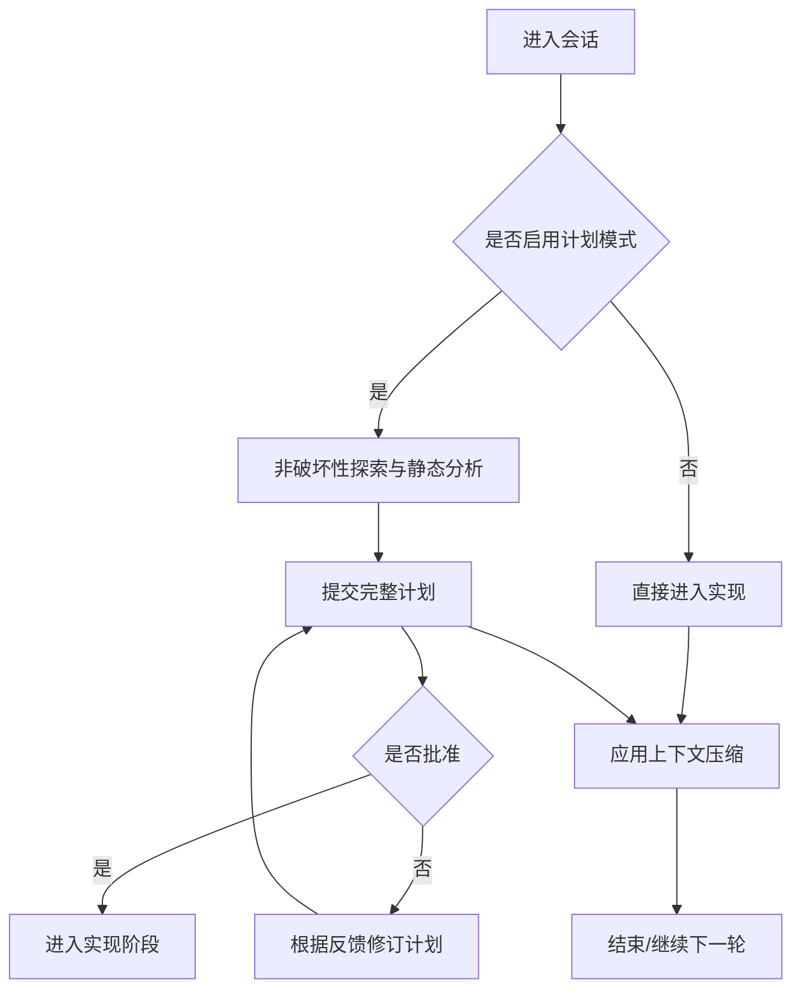
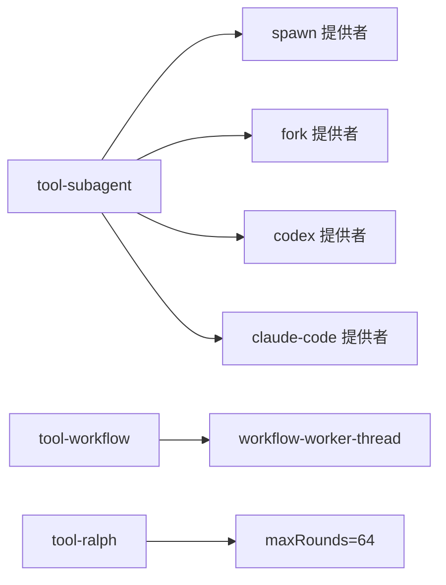
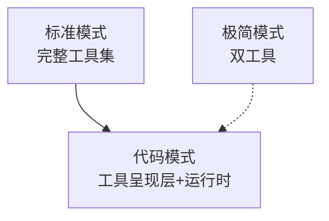
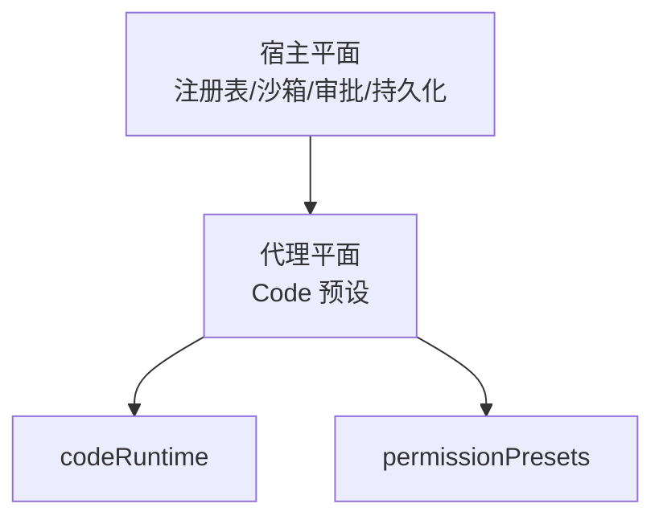

# Code 预设

<cite>
**本文引用的文件**
- [apps/cli/config/agent-presets/code/preset.yml](file://apps/cli/config/agent-presets/code/preset.yml)
- [apps/cli/config/agent-presets/code/agent.cordis.yml](file://apps/cli/config/agent-presets/code/agent.cordis.yml)
- [apps/cli/config/agent-presets/standard/preset.yml](file://apps/cli/config/agent-presets/standard/preset.yml)
- [apps/cli/config/agent-presets/standard/agent.cordis.yml](file://apps/cli/config/agent-presets/standard/agent.cordis.yml)
- [apps/cli/config/agent-presets/minimal/preset.yml](file://apps/cli/config/agent-presets/minimal/preset.yml)
- [docs/subsystems/code-runtime.md](file://docs/subsystems/code-runtime.md)
- [docs/subsystems/permission-presets.md](file://docs/subsystems/permission-presets.md)
- [.agents/notes/implemented/feature/2026-08-05-per-agent-tool-presentation.md](file://.agents/notes/implemented/feature/2026-08-05-per-agent-tool-presentation.md)
</cite>

## 目录
1. [简介](#简介)
2. [项目结构](#项目结构)
3. [核心组件](#核心组件)
4. [架构总览](#架构总览)
5. [详细组件分析](#详细组件分析)
6. [依赖分析](#依赖分析)
7. [性能考虑](#性能考虑)
8. [故障排查指南](#故障排查指南)
9. [结论](#结论)
10. [附录](#附录)

## 简介
Code 预设是面向代码开发与编程任务的“代码模式”智能体配置。它在标准编码能力的基础上，通过“工具呈现层”将多步操作以 TypeScript 程序的方式组合执行，显著减少往返轮次、提升复杂任务效率。该预设与“标准模式”共享大部分能力（文件系统、Shell、计划、目标、子代理与工作流等），但关键差异在于：模型不再逐条调用工具，而是生成并运行一段 TypeScript 程序，由运行时统一调度底层工具，最终返回结构化结果。

本文件聚焦以下目标：
- 解释 Code 预设的组成与职责边界
- 详解 preset.yml 与 agent.cordis.yml 中与代码开发相关的设置
- 给出代码生成、重构、调试等场景的使用示例
- 说明如何配置代码特定工具与技能
- 提供代码模式下的性能优化建议
- 对比其他预设，突出在代码处理方面的增强点

## 项目结构
Code 预设位于 CLI 配置的 agent-presets/code 目录下，包含两个关键文件：
- preset.yml：描述预设名称、用途与排序
- agent.cordis.yml：定义该 Agent 会话的工具、技能、计划、压缩、委派与工作流等能力装配，以及最重要的“工具呈现层”

图示来源
- [apps/cli/config/agent-presets/code/preset.yml:1-4](file://apps/cli/config/agent-presets/code/preset.yml#L1-L4)
- [apps/cli/config/agent-presets/code/agent.cordis.yml:1-263](file://apps/cli/config/agent-presets/code/agent.cordis.yml#L1-L263)

章节来源
- [apps/cli/config/agent-presets/code/preset.yml:1-4](file://apps/cli/config/agent-presets/code/preset.yml#L1-L4)
- [apps/cli/config/agent-presets/code/agent.cordis.yml:1-263](file://apps/cli/config/agent-presets/code/agent.cordis.yml#L1-L263)

## 核心组件
- 身份与指令
  - persona：为 Agent 注入角色与上下文（模型、工作目录）
  - agent-instructions：限制提示长度，确保指令稳定
- Shell 工具
  - tool-bash / tool-pwsh：按平台启用，用于命令执行
- 文件系统
  - tool-fs / tool-fs-search：读写与搜索，search 支持控制采样策略
- 后台任务
  - tool-jobs：暴露后台任务管理能力
- 技能
  - skill-filesystem / tool-skill：本地根发现与技能加载
- 目标
  - tool-goal：面向模型的“目标”工具入口
- 计划模式
  - plan-mode：引导模型先规划再实施，避免误改
- 上下文压缩
  - compaction-basic / command-compact / tool-result-pruner：控制输出裁剪阈值，降低长对话成本
- 委派与工作流
  - subagent/fork/codex/claude-code/workflow/ralph：跨进程/线程委派、工作流编排、Ralph 多轮协作
- 其余模型可见工具
  - tool-ask-user / tool-todo / tool-web：交互、待办、网页检索（可关闭 fetch）
- 工具呈现层（代码模式关键）
  - tool-presentation：将工具集呈现为 TypeScript SDK，使模型以程序方式组合多步操作

章节来源
- [apps/cli/config/agent-presets/code/agent.cordis.yml:27-263](file://apps/cli/config/agent-presets/code/agent.cordis.yml#L27-L263)

## 架构总览
Code 预设的核心思想是“工具呈现层 + 代码运行时”。模型不直接调用每个工具，而是生成 TypeScript 程序；运行时负责执行该程序，并将宿主提供的工具函数作为全局绑定暴露给程序。这样，原本需要多次往返的操作被合并为一次程序执行，显著提升效率。

图示来源
- [apps/cli/config/agent-presets/code/agent.cordis.yml:254-263](file://apps/cli/config/agent-presets/code/agent.cordis.yml#L254-L263)
- [docs/subsystems/code-runtime.md:1-192](file://docs/subsystems/code-runtime.md#L1-L192)

## 详细组件分析

### 工具呈现层（Code Mode）
- 作用：将工具集渲染为 TypeScript SDK，供模型生成程序调用
- 行为：等待宿主提供 codeRuntime；若未提供，则在挂载时失败而非首次请求时报错
- 影响：同一进程中不同会话可拥有不同的工具呈现（例如标准模式仍为原生工具，而 Code 模式使用 SDK）

图示来源
- [apps/cli/config/agent-presets/code/agent.cordis.yml:254-263](file://apps/cli/config/agent-presets/code/agent.cordis.yml#L254-L263)
- [.agents/notes/implemented/feature/2026-08-05-per-agent-tool-presentation.md:36-47](file://.agents/notes/implemented/feature/2026-08-05-per-agent-tool-presentation.md#L36-L47)

章节来源
- [apps/cli/config/agent-presets/code/agent.cordis.yml:254-263](file://apps/cli/config/agent-presets/code/agent.cordis.yml#L254-L263)
- [.agents/notes/implemented/feature/2026-08-05-per-agent-tool-presentation.md:36-47](file://.agents/notes/implemented/feature/2026-08-05-per-agent-tool-presentation.md#L36-L47)

### 代码运行时（Code Runtime）
- 接口：run(request) 接收程序源码、绑定命名空间、中止信号，返回结果或错误
- 绑定：将宿主工具函数以全局对象形式暴露给程序，参数与返回值需为可无损 JSON 传输的值
- 输出：捕获 console/stream 输出，限制序列化大小；失败分类包括异常、超时、中止、工作进程退出、无效输出、输出超限
- 隔离：每次运行相互隔离，销毁时终止并等待进行中的运行

图示来源
- [docs/subsystems/code-runtime.md:1-192](file://docs/subsystems/code-runtime.md#L1-L192)

章节来源
- [docs/subsystems/code-runtime.md:1-192](file://docs/subsystems/code-runtime.md#L1-L192)

### 计划模式与压缩
- 计划模式：引导模型先探索与规划，再提交完整方案，避免误改代码
- 压缩：控制工具结果裁剪阈值，减少上下文膨胀，降低 token 消耗

图示来源
- [apps/cli/config/agent-presets/code/agent.cordis.yml:107-132](file://apps/cli/config/agent-presets/code/agent.cordis.yml#L107-L132)
- [apps/cli/config/agent-presets/code/agent.cordis.yml:133-163](file://apps/cli/config/agent-presets/code/agent.cordis.yml#L133-L163)

章节来源
- [apps/cli/config/agent-presets/code/agent.cordis.yml:107-163](file://apps/cli/config/agent-presets/code/agent.cordis.yml#L107-L163)

### 委派与工作流
- 子代理：spawn/fork/codex/claude-code 等多种提供者，支持后台持续运行
- 工作流：线程级 worker 执行，适合复杂流水线
- Ralph：多轮协作工具，限制最大轮数

图示来源
- [apps/cli/config/agent-presets/code/agent.cordis.yml:164-235](file://apps/cli/config/agent-presets/code/agent.cordis.yml#L164-L235)

章节来源
- [apps/cli/config/agent-presets/code/agent.cordis.yml:164-235](file://apps/cli/config/agent-presets/code/agent.cordis.yml#L164-L235)

### 与其他预设的对比
- 标准模式：功能完整的编码 Agent，具备文件编辑、Shell、检索、Skills、计划、目标、子代理与工作流
- 极简模式：仅提供持久 bash 与 str_replace_editor 的双工具编码 Agent
- Code 模式：在标准能力基础上，增加“工具呈现层”，以 TypeScript 程序组合多步操作，减少往返

图示来源
- [apps/cli/config/agent-presets/standard/preset.yml:1-4](file://apps/cli/config/agent-presets/standard/preset.yml#L1-L4)
- [apps/cli/config/agent-presets/minimal/preset.yml:1-4](file://apps/cli/config/agent-presets/minimal/preset.yml#L1-L4)
- [apps/cli/config/agent-presets/code/preset.yml:1-4](file://apps/cli/config/agent-presets/code/preset.yml#L1-L4)

章节来源
- [apps/cli/config/agent-presets/standard/preset.yml:1-4](file://apps/cli/config/agent-presets/standard/preset.yml#L1-L4)
- [apps/cli/config/agent-presets/minimal/preset.yml:1-4](file://apps/cli/config/agent-presets/minimal/preset.yml#L1-L4)
- [apps/cli/config/agent-presets/code/preset.yml:1-4](file://apps/cli/config/agent-presets/code/preset.yml#L1-L4)

## 依赖分析
- 宿主平面 vs 代理平面
  - 宿主平面：沙箱、审批、持久化、模型路由、工具注册表等
  - 代理平面：本预设仅负责“工具呈现”和会话内可见的配置
- 关键依赖
  - codeRuntime：必须存在，否则挂载失败
  - permissionPresets：权限预设与沙箱/审批策略相关（可选能力）

图示来源
- [apps/cli/config/agent-presets/code/agent.cordis.yml:1-26](file://apps/cli/config/agent-presets/code/agent.cordis.yml#L1-L26)
- [docs/subsystems/permission-presets.md:1-132](file://docs/subsystems/permission-presets.md#L1-L132)

章节来源
- [apps/cli/config/agent-presets/code/agent.cordis.yml:1-26](file://apps/cli/config/agent-presets/code/agent.cordis.yml#L1-L26)
- [docs/subsystems/permission-presets.md:1-132](file://docs/subsystems/permission-presets.md#L1-L132)

## 性能考虑
- 使用代码模式减少往返：将多步工具调用合并为一次程序执行，显著降低延迟
- 合理设置压缩阈值：调整 tool-result-pruner 的阈值与头尾保留字符，平衡信息量与上下文大小
- 控制网络访问：关闭 web 工具的 fetch，避免不必要的网络开销
- 限制计划模式范围：仅在必要时启用，避免过度规划导致额外轮次
- 委派与后台任务：对耗时任务使用 subagent 或 workflow，避免阻塞主循环
- 运行时隔离：每次运行相互隔离，注意避免跨运行状态导致的资源泄漏

[本节为通用指导，无需引用具体文件]

## 故障排查指南
- 挂载失败：若部署未组合 TypeScript 运行时，Code 预设会在挂载阶段失败，定位到 tool-presentation 行
- 工具不可用：确认宿主已注册对应工具（如 fs、shell、jobs），且未被平台禁用（如 Windows 下 pwsh 默认禁用）
- 输出截断：检查 tool-result-pruner 的阈值配置，适当提高 head/tail 保留字符
- 计划模式问题：确保模型遵循“先计划后实施”的规则，避免误改
- 权限与沙箱：如需切换权限预设，使用 permissionPresets 服务，确保 shell 执行器具备约束能力

章节来源
- [apps/cli/config/agent-presets/code/agent.cordis.yml:254-263](file://apps/cli/config/agent-presets/code/agent.cordis.yml#L254-L263)
- [apps/cli/config/agent-presets/code/agent.cordis.yml:44-58](file://apps/cli/config/agent-presets/code/agent.cordis.yml#L44-L58)
- [apps/cli/config/agent-presets/code/agent.cordis.yml:133-163](file://apps/cli/config/agent-presets/code/agent.cordis.yml#L133-L163)
- [docs/subsystems/permission-presets.md:1-132](file://docs/subsystems/permission-presets.md#L1-L132)

## 结论
Code 预设通过“工具呈现层 + 代码运行时”的组合，将复杂的代码任务转化为一次程序执行，极大提升了开发效率与用户体验。它与标准模式共享丰富的能力，同时通过计划模式、上下文压缩、委派与工作流等机制，保障任务的可控性与稳定性。对于需要高效完成代码生成、重构、调试等任务的场景，Code 预设提供了最佳实践路径。

[本节为总结性内容，无需引用具体文件]

## 附录
- 使用示例
  - 代码生成：让模型生成一个 TypeScript 程序，调用工具读取项目结构、分析依赖、生成新模块并写入文件
  - 重构：编写程序批量替换符号、更新导入、调整类型定义，并通过工具验证编译与测试
  - 调试：生成程序收集日志、执行诊断命令、分析堆栈，输出修复建议
- 配置建议
  - 开启计划模式以提升大型变更的可控性
  - 调整压缩阈值以适配项目规模
  - 按需启用 web 工具，避免不必要网络请求
  - 使用 subagent/workflow 处理耗时任务
- 权限与安全
  - 结合 permissionPresets 管理沙箱与审批策略
  - 确保工具呈现层仅在需要的会话中启用

[本节为补充信息，无需引用具体文件]