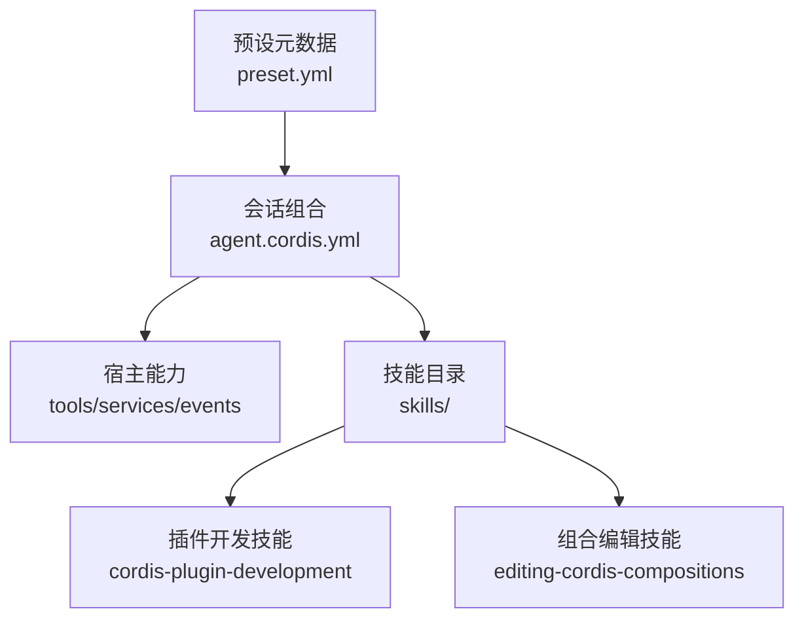
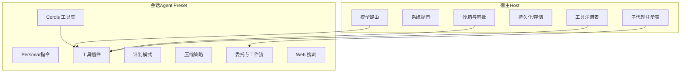
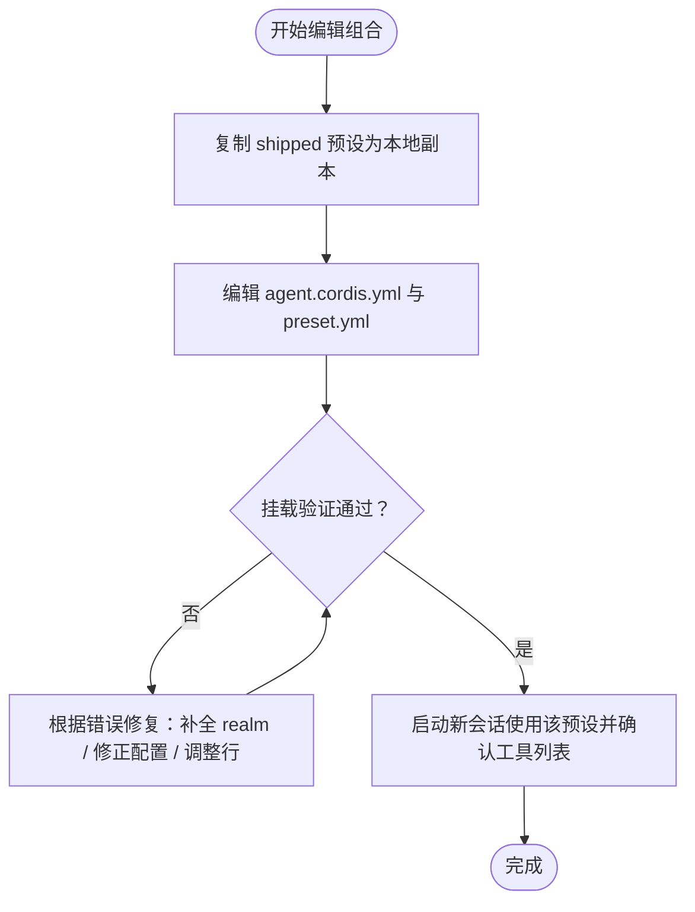
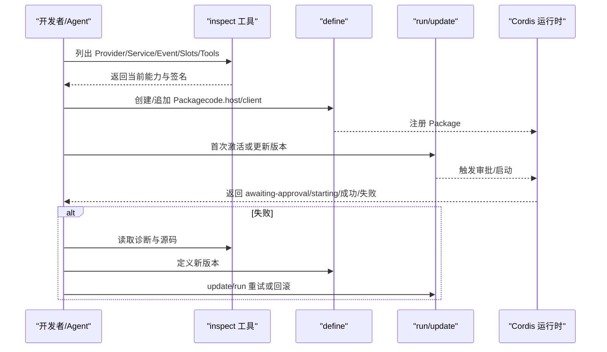
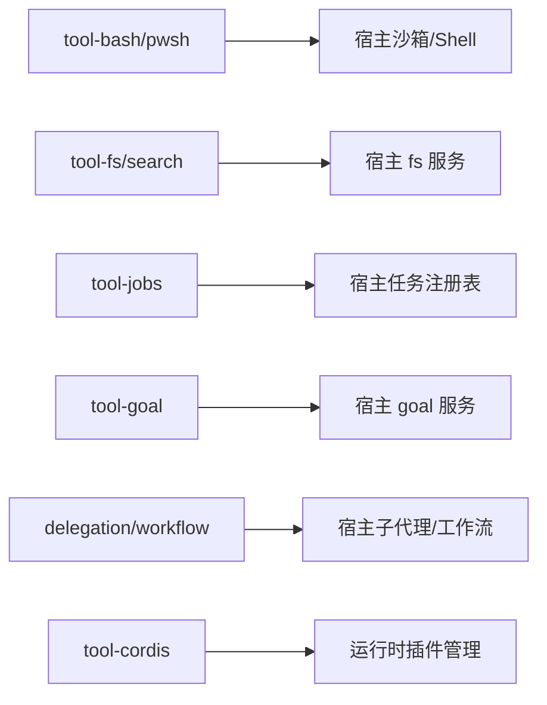
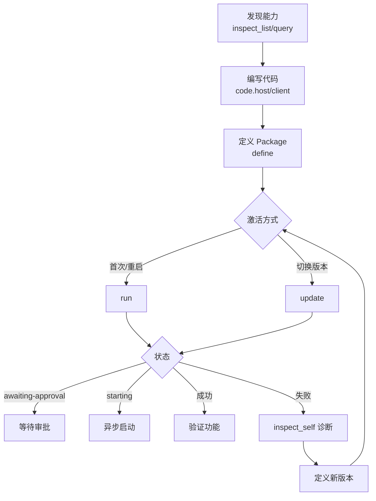

# Cordis 预设

<cite>
**本文引用的文件**
- [apps/cli/config/agent-presets/cordis/preset.yml](file://apps/cli/config/agent-presets/cordis/preset.yml)
- [apps/cli/config/agent-presets/cordis/agent.cordis.yml](file://apps/cli/config/agent-presets/cordis/agent.cordis.yml)
- [apps/cli/config/agent-presets/cordis/skills/cordis-plugin-development/SKILL.md](file://apps/cli/config/agent-presets/cordis/skills/cordis-plugin-development/SKILL.md)
- [apps/cli/config/agent-presets/cordis/skills/editing-cordis-compositions/SKILL.md](file://apps/cli/config/agent-presets/cordis/skills/editing-cordis-compositions/SKILL.md)
- [apps/cli/config/agent-presets/standard/preset.yml](file://apps/cli/config/agent-presets/standard/preset.yml)
- [apps/cli/config/agent-presets/standard/agent.cordis.yml](file://apps/cli/config/agent-presets/standard/agent.cordis.yml)
- [docs/cordis-tutorial/06-composition-and-hmr.md](file://docs/cordis-tutorial/06-composition-and-hmr.md)
- [docs/testing.md](file://docs/testing.md)
</cite>

## 目录
1. [简介](#简介)
2. [项目结构](#项目结构)
3. [核心组件](#核心组件)
4. [架构总览](#架构总览)
5. [详细组件分析](#详细组件分析)
6. [依赖关系分析](#依赖关系分析)
7. [性能与可维护性](#性能与可维护性)
8. [故障排查指南](#故障排查指南)
9. [结论](#结论)
10. [附录：插件开发工作流示例](#附录插件开发工作流示例)

## 简介
本文件面向使用 Cordis 框架进行开发与插件开发的工程师，系统化说明“Cordis 预设”的构成、能力边界、技能系统与配置要点。重点覆盖以下目标：
- 解释 Cordis 预设为何以及如何为“插件开发”和“编辑组合（composition）”提供专用能力。
- 详解两个内置技能：cordis-plugin-development 与 editing-cordis-compositions 的职责与用法。
- 梳理 preset.yml 与 agent.cordis.yml 中与插件开发相关的设置与作用域。
- 给出从编写、调试到测试的完整工作流示例，并展示如何使用内置开发辅助工具。
- 总结对开发体验的优化点、最佳实践与常见问题解决方案。

## 项目结构
Cordis 预设以“组合文件 + 元数据 + 技能”的形式组织：
- preset.yml：预设的显示名称、描述与排序等元信息。
- agent.cordis.yml：当前会话挂载的组合清单，声明所有插件行、分组与隔离域。
- skills/：随预设提供的技能文档，指导 Agent 如何安全地编辑组合或开发动态插件。

图示来源
- [apps/cli/config/agent-presets/cordis/preset.yml:1-4](file://apps/cli/config/agent-presets/cordis/preset.yml#L1-L4)
- [apps/cli/config/agent-presets/cordis/agent.cordis.yml:1-263](file://apps/cli/config/agent-presets/cordis/agent.cordis.yml#L1-L263)
- [apps/cli/config/agent-presets/cordis/skills/cordis-plugin-development/SKILL.md:1-421](file://apps/cli/config/agent-presets/cordis/skills/cordis-plugin-development/SKILL.md#L1-L421)
- [apps/cli/config/agent-presets/cordis/skills/editing-cordis-compositions/SKILL.md:1-155](file://apps/cli/config/agent-presets/cordis/skills/editing-cordis-compositions/SKILL.md#L1-L155)

章节来源
- [apps/cli/config/agent-presets/cordis/preset.yml:1-4](file://apps/cli/config/agent-presets/cordis/preset.yml#L1-L4)
- [apps/cli/config/agent-presets/cordis/agent.cordis.yml:1-263](file://apps/cli/config/agent-presets/cordis/agent.cordis.yml#L1-L263)

## 核心组件
- 预设元数据（preset.yml）
  - 定义预设的名称、描述与在列表中的顺序，便于用户选择与识别。
- 会话组合（agent.cordis.yml）
  - 声明所有插件行，包括 Shell、文件系统、计划模式、压缩、委托与工作流、Web 搜索、以及用于自修改的 Cordis 工具集。
  - 通过分组与 isolate 域控制服务实例的作用域，避免跨会话冲突。
  - 将“编辑组合”的技能目录注入到该预设层，使 Agent 能按部署上下文学习如何安全编辑组合。
- 技能（Skills）
  - cordis-plugin-development：指导如何发现 Provider、注册/运行/回滚动态插件、处理审批与诊断。
  - editing-cordis-compositions：指导如何复制/校验/验证组合，区分 Host 与 Agent 平面，避免破坏性操作。

章节来源
- [apps/cli/config/agent-presets/cordis/preset.yml:1-4](file://apps/cli/config/agent-presets/cordis/preset.yml#L1-L4)
- [apps/cli/config/agent-presets/cordis/agent.cordis.yml:15-33](file://apps/cli/config/agent-presets/cordis/agent.cordis.yml#L15-L33)
- [apps/cli/config/agent-presets/cordis/agent.cordis.yml:45-263](file://apps/cli/config/agent-presets/cordis/agent.cordis.yml#L45-L263)
- [apps/cli/config/agent-presets/cordis/skills/cordis-plugin-development/SKILL.md:1-421](file://apps/cli/config/agent-presets/cordis/skills/cordis-plugin-development/SKILL.md#L1-L421)
- [apps/cli/config/agent-presets/cordis/skills/editing-cordis-compositions/SKILL.md:1-155](file://apps/cli/config/agent-presets/cordis/skills/editing-cordis-compositions/SKILL.md#L1-L155)

## 架构总览
Cordis 预设将“宿主能力”与“会话级能力”解耦：
- 宿主（Host）：进程级单例，包含工具注册表、系统提示、代理工厂、沙箱与审批栈、持久化、模型路由、子代理注册表等。
- 会话（Agent Preset）：每个会话挂载一次，贡献工具、Persona、提示段、压缩策略等；若发布服务，必须置于 isolate 域内，避免进程级冲突。

图示来源
- [apps/cli/config/agent-presets/cordis/agent.cordis.yml:15-33](file://apps/cli/config/agent-presets/cordis/agent.cordis.yml#L15-L33)
- [apps/cli/config/agent-presets/cordis/agent.cordis.yml:45-263](file://apps/cli/config/agent-presets/cordis/agent.cordis.yml#L45-L263)

章节来源
- [apps/cli/config/agent-presets/cordis/agent.cordis.yml:15-33](file://apps/cli/config/agent-presets/cordis/agent.cordis.yml#L15-L33)
- [apps/cli/config/agent-presets/cordis/agent.cordis.yml:45-263](file://apps/cli/config/agent-presets/cordis/agent.cordis.yml#L45-L263)

## 详细组件分析

### 预设元数据与角色定位
- 名称与描述：用于 UI 选择与识别，提升可发现性。
- 排序：影响预设列表的展示顺序。
- 角色：Cordis 预设定位为“创造模式”，在标准模式基础上增加运行时检查、插件实验与创作指导。

章节来源
- [apps/cli/config/agent-presets/cordis/preset.yml:1-4](file://apps/cli/config/agent-presets/cordis/preset.yml#L1-L4)
- [apps/cli/config/agent-presets/standard/preset.yml:1-4](file://apps/cli/config/agent-presets/standard/preset.yml#L1-L4)

### 组合文件（agent.cordis.yml）关键能力
- Persona 与指令：为 Agent 设定身份与行为约束，强调“宿主/会话”双平面的编辑归属。
- Shell/FS/Jobs/Goal/Web：提供常用工具入口，部分工具仅暴露给模型侧，具体能力由宿主注册表决定。
- 计划模式：独立作用域，确保规划阶段不执行变更。
- 压缩：共享工具结果裁剪器，降低上下文膨胀。
- 委托与工作流：子代理与工作流工具在此层注册，引擎与后端位于宿主。
- Cordis 工具集：允许读取/挂载/卸载临时插件，是“自修改”的信任边界。
- 技能注入：将 skills/ 目录作为自定义技能根，使 Agent 能加载“编辑组合”与“插件开发”技能。

章节来源
- [apps/cli/config/agent-presets/cordis/agent.cordis.yml:15-33](file://apps/cli/config/agent-presets/cordis/agent.cordis.yml#L15-L33)
- [apps/cli/config/agent-presets/cordis/agent.cordis.yml:45-263](file://apps/cli/config/agent-presets/cordis/agent.cordis.yml#L45-L263)

### 技能：editing-cordis-compositions（编辑组合）
- 职责：指导如何安全地创建、修改、验证组合；明确不可触碰的 shipped 预设目录；判断某项应属于宿主还是会话。
- 关键流程：
  - 通过 agentPresets 服务列出、读取、复制预设；只写本地用户根目录。
  - 使用 standingKeyFor 进行“挂载验证”，捕获包解析失败、配置无效、未激活行、服务发布到根域等问题。
  - 遵循“发布服务的行必须处于 isolate 域”的铁律，避免进程级冲突。
  - 对原生产品子代理（Codex/Claude Code）保持宿主侧提供者不变，仅在预设中启用对应工具行。

图示来源
- [apps/cli/config/agent-presets/cordis/skills/editing-cordis-compositions/SKILL.md:10-122](file://apps/cli/config/agent-presets/cordis/skills/editing-cordis-compositions/SKILL.md#L10-L122)

章节来源
- [apps/cli/config/agent-presets/cordis/skills/editing-cordis-compositions/SKILL.md:10-155](file://apps/cli/config/agent-presets/cordis/skills/editing-cordis-compositions/SKILL.md#L10-L155)

### 技能：cordis-plugin-development（动态插件开发）
- 职责：指导如何在宿主/客户端平台创建、调试、扩展动态插件，涵盖服务、事件、Slot、主题、动态工具、版本管理、审批与诊断。
- 标准工作流：
  - 使用 inspect 系列工具发现 Provider、方法、Schema。
  - 编写 code.host/code.client 并通过 define 创建 Package。
  - 使用 run/update 激活或切换版本，处理 awaiting-approval/starting 等状态。
  - 使用 stop 暂停、undefine 清理。
- 平台选择：根据需求选择宿主（文件/命令/网络/Agent/Session）、客户端（主题/布局/页面状态/设置页/侧边栏/覆盖层），或两者协作。
- 访问与副作用：优先 ctx.get 获取可选能力；必要时 inject 声明硬依赖；使用 effect/on 管理生命周期。
- 客户端 UI：通过 Slots.listSubTree 查询目标 Slot 协议后注册；支持在 Run 卡片、普通 Tool 卡片、覆盖层等位置嵌入。
- 版本与修复：理解 currentPackageId/nextPackageId/pluginRunId 语义；失败时定义新版本并 update/run 恢复。

图示来源
- [apps/cli/config/agent-presets/cordis/skills/cordis-plugin-development/SKILL.md:10-421](file://apps/cli/config/agent-presets/cordis/skills/cordis-plugin-development/SKILL.md#L10-L421)

章节来源
- [apps/cli/config/agent-presets/cordis/skills/cordis-plugin-development/SKILL.md:10-421](file://apps/cli/config/agent-presets/cordis/skills/cordis-plugin-development/SKILL.md#L10-L421)

### 组合与热重载（HMR）
- 组合条目具备 id，便于增量替换；disabled 可快速禁用而不删除。
- 通过 HMR 插件监听文件变化，实现插件热重载：卸载旧实例、加载新代码、重新执行 apply。
- 当插件因缺少依赖而 PENDING 时，可通过枚举 Fiber 状态进行诊断。

章节来源
- [docs/cordis-tutorial/06-composition-and-hmr.md:7-114](file://docs/cordis-tutorial/06-composition-and-hmr.md#L7-L114)

## 依赖关系分析
- 宿主与预设的依赖方向：
  - 预设中的工具/服务通常消费宿主注册表（如 shell、jobs、goal、web）。
  - 预设内部通过 group+isolate 划分私有领域（如 planMode、compaction、workflowEngine）。
- 技能与组合的关系：
  - editing-cordis-compositions 指导如何安全地编辑组合，避免破坏宿主或 shipped 预设。
  - cordis-plugin-development 指导在运行时动态扩展能力，无需改动组合文件。
- 典型依赖链：
  - tool-bash/tool-pwsh → 宿主沙箱与 Shell 执行器
  - tool-fs/tool-fs-search → 宿主 fs 服务与策略
  - tool-jobs → 宿主任务注册表
  - tool-goal → 宿主 goal 服务与命令端点
  - delegation/workflow → 宿主子代理注册表与工作流引擎
  - tool-cordis → 运行时自检与动态插件管理

图示来源
- [apps/cli/config/agent-presets/cordis/agent.cordis.yml:45-263](file://apps/cli/config/agent-presets/cordis/agent.cordis.yml#L45-L263)

章节来源
- [apps/cli/config/agent-presets/cordis/agent.cordis.yml:45-263](file://apps/cli/config/agent-presets/cordis/agent.cordis.yml#L45-L263)

## 性能与可维护性
- 作用域隔离：通过 isolate 域避免进程级服务冲突，提高多会话并发稳定性。
- 上下文压缩：共享工具结果裁剪器，减少大输出对上下文的占用。
- 热重载：HMR 缩短“编辑-验证”循环，提升开发效率。
- 最小能力原则：按需启用工具与服务，减少不必要的副作用与资源消耗。
- 可观测性：利用 inspect 工具与诊断信息，快速定位问题。

[本节为通用建议，不直接分析具体文件]

## 故障排查指南
- 组合编辑类问题
  - 禁止编辑 shipped 预设目录；应复制后再编辑。
  - 使用 standingKeyFor 进行挂载验证，捕获包解析失败、配置无效、未激活行、服务发布到根域等错误。
  - 发布服务的行必须置于 isolate 域，否则会被拒绝或与其他会话冲突。
- 动态插件类问题
  - 使用 inspect_list/query/self 确认当前能力与源码，再编写代码。
  - 注意审批状态（awaiting-approval）与异步启动（starting），不要在单次工具调用中阻塞等待。
  - 失败时读取诊断，定义新版本并 update/run 恢复；不要覆盖失败 Package。
  - 客户端渲染错误需查看 client-render 诊断，并在新的 Package 中修复。
- 常见错误对照
  - service not declared：检查是否声明 inject 或使用 ctx.get 并处理缺失。
  - timer without inject：查询 timer Service 并声明注入。
  - Slot 注册失败：先查询真实 SubTree，再按协议注册。
  - host.call 失败：核对方法名、pluginRunId、JSON 参数与 Handler 依赖。
  - 更新失败：遵循 current/next 语义，修复 next 并 update，或 run current 回滚。

章节来源
- [apps/cli/config/agent-presets/cordis/skills/editing-cordis-compositions/SKILL.md:10-122](file://apps/cli/config/agent-presets/cordis/skills/editing-cordis-compositions/SKILL.md#L10-L122)
- [apps/cli/config/agent-presets/cordis/skills/cordis-plugin-development/SKILL.md:368-421](file://apps/cli/config/agent-presets/cordis/skills/cordis-plugin-development/SKILL.md#L368-L421)

## 结论
Cordis 预设通过“组合 + 技能”的方式，为插件开发与组合编辑提供了安全、可控且高效的开发环境。其核心在于：
- 明确宿主与会话的职责边界，避免进程级冲突。
- 提供完善的技能指导，覆盖从编辑组合到动态插件的全流程。
- 借助 inspect/validate/HMR 等工具，形成“发现-编写-验证-运行”的快速迭代闭环。
- 通过最小能力原则与可观测性设计，提升稳定性与可维护性。

[本节为总结性内容，不直接分析具体文件]

## 附录：插件开发工作流示例
以下为基于内置技能的推荐工作流，适用于“新增能力/修复问题/扩展 UI”等场景：

- 准备阶段
  - 使用 cordis_inspect_list 获取当前宿主/客户端能力清单。
  - 使用 cordis_inspect_query 精确查询所需 Service/Event/Tool/Slot/Theme 的签名与选项。
- 编写阶段
  - 在 code.host 或 code.client 编写纯 JavaScript 函数体，避免 JSX/TS/import。
  - 如需强依赖，声明 inject；否则使用 ctx.get 并处理缺失。
  - 使用 ctx.effect/ctx.on 管理副作用与事件监听。
- 定义与运行
  - 调用 cordis_define 创建或追加 Package。
  - 首次激活或重启使用 run；切换版本使用 update。
  - 处理 awaiting-approval/starting 等状态，不在同一轮次阻塞等待。
- 调试与修复
  - 失败时使用 cordis_inspect_self 读取源码与诊断。
  - 针对未知能力再次 list/query；定义新版本并 update/run。
  - 客户端渲染错误查看 client-render 诊断，在新 Package 中修复。
- 清理与回滚
  - 使用 cordis_stop 暂停效果，保留 Packages 与授权以便后续使用。
  - 仅在不再需要时使用 cordis_undefine 永久移除。

图示来源
- [apps/cli/config/agent-presets/cordis/skills/cordis-plugin-development/SKILL.md:10-421](file://apps/cli/config/agent-presets/cordis/skills/cordis-plugin-development/SKILL.md#L10-L421)

章节来源
- [apps/cli/config/agent-presets/cordis/skills/cordis-plugin-development/SKILL.md:10-421](file://apps/cli/config/agent-presets/cordis/skills/cordis-plugin-development/SKILL.md#L10-L421)