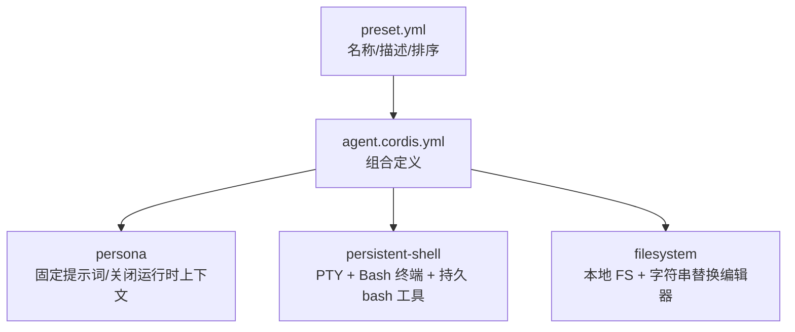
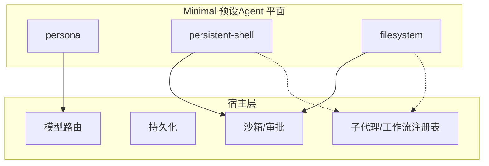
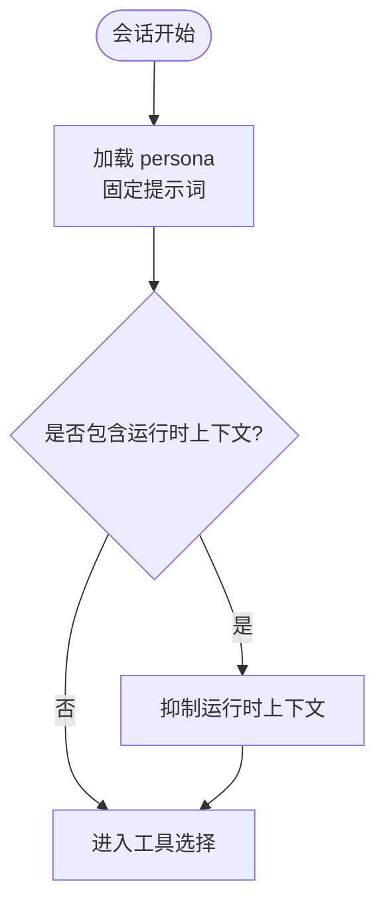
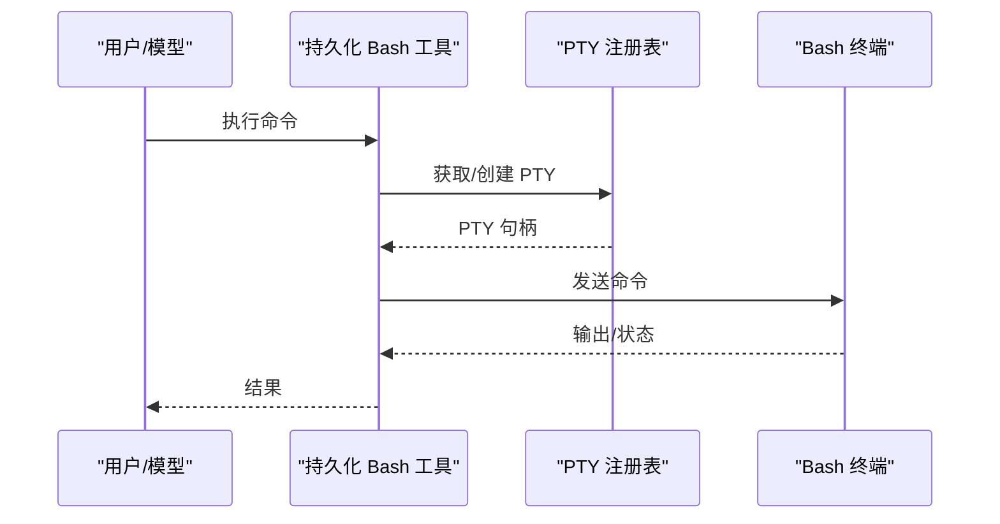
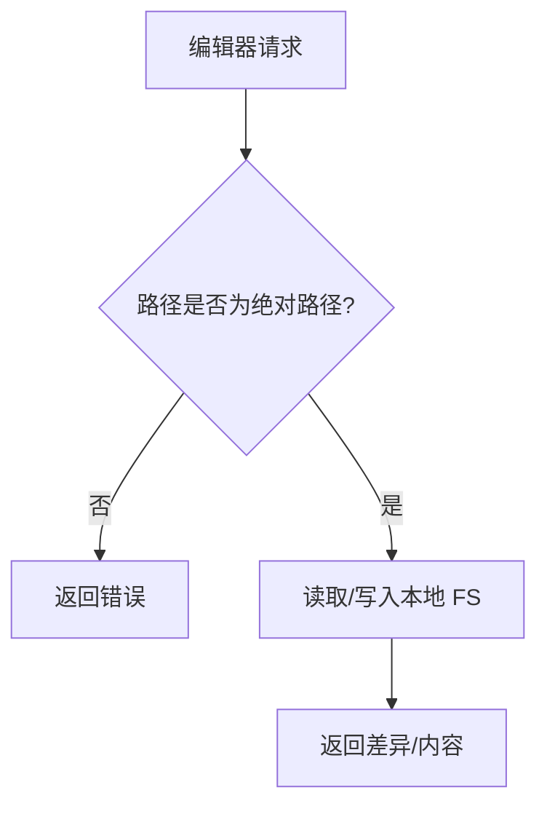
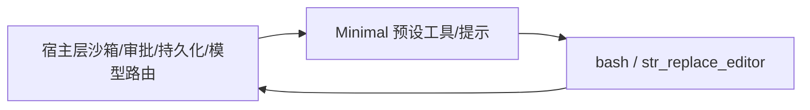

# Minimal 预设

<cite>
**本文引用的文件**
- [apps/cli/config/agent-presets/minimal/preset.yml](file://apps/cli/config/agent-presets/minimal/preset.yml)
- [apps/cli/config/agent-presets/minimal/agent.cordis.yml](file://apps/cli/config/agent-presets/minimal/agent.cordis.yml)
- [apps/cli/config/agent-presets/standard/preset.yml](file://apps/cli/config/agent-presets/standard/preset.yml)
- [apps/cli/config/agent-presets/standard/agent.cordis.yml](file://apps/cli/config/agent-presets/standard/agent.cordis.yml)
- [apps/cli/config/agent-presets/code/preset.yml](file://apps/cli/config/agent-presets/code/preset.yml)
- [apps/cli/config/agent-presets/code/agent.cordis.yml](file://apps/cli/config/agent-presets/code/agent.cordis.yml)
- [apps/cli/config/agent-presets/cordis/agent.cordis.yml](file://apps/cli/config/agent-presets/cordis/agent.cordis.yml)
- [packages/preset/agent-presets/src/discovery.ts](file://packages/preset/agent-presets/src/discovery.ts)
- [packages/host/apiproxy/src/api-proxy.ts](file://packages/host/apiproxy/src/api-proxy.ts)
- [packages/client/ui-agent-preset/src/client/locales.ts](file://packages/client/ui-agent-preset/src/client/locales.ts)
- [docs/subsystems/core.md](file://docs/subsystems/core.md)
</cite>

## 目录
1. [简介](#简介)
2. [项目结构](#项目结构)
3. [核心组件](#核心组件)
4. [架构总览](#架构总览)
5. [详细组件分析](#详细组件分析)
6. [依赖关系分析](#依赖关系分析)
7. [性能与资源特性](#性能与资源特性)
8. [故障排查指南](#故障排查指南)
9. [结论](#结论)
10. [附录：最小化定制步骤](#附录最小化定制步骤)

## 简介
Minimal 预设是最轻量级的 Agent 配置，仅保留“持久 Bash + 字符串替换编辑器”两个工具，用于快速原型开发、资源受限环境或需要极简交互的自动化场景。它通过固定提示词、关闭运行时上下文快照、不启用上下文压缩等策略，将模型可见能力收敛到最小集合，从而降低启动开销、减少上下文体积并提升稳定性。

## 项目结构
Minimal 预设由两个文件组成：
- preset.yml：元数据（名称、描述、排序）
- agent.cordis.yml：Agent 平面组合，声明 persona、终端与持久 bash、本地文件系统与 str_replace_editor

图表来源
- [apps/cli/config/agent-presets/minimal/preset.yml:1-4](file://apps/cli/config/agent-presets/minimal/preset.yml#L1-L4)
- [apps/cli/config/agent-presets/minimal/agent.cordis.yml:1-63](file://apps/cli/config/agent-presets/minimal/agent.cordis.yml#L1-L63)

章节来源
- [apps/cli/config/agent-presets/minimal/preset.yml:1-4](file://apps/cli/config/agent-presets/minimal/preset.yml#L1-L4)
- [apps/cli/config/agent-presets/minimal/agent.cordis.yml:1-63](file://apps/cli/config/agent-presets/minimal/agent.cordis.yml#L1-L63)

## 核心组件
- Persona（固定提示词）
  - 提供简洁的角色设定，完整且关闭 includeRuntimeContext，避免注入运行时上下文快照。
- 持久 Shell（persistent-shell）
  - 使用 PTY 注册表隔离终端；挂载 Bash 终端与持久化 bash 工具，支持跨调用保持会话状态。
- 本地文件系统（filesystem）
  - 以本地 FS 提供者覆盖宿主沙箱提供者；编辑器共享该域并要求绝对路径。

章节来源
- [apps/cli/config/agent-presets/minimal/agent.cordis.yml:8-13](file://apps/cli/config/agent-presets/minimal/agent.cordis.yml#L8-L13)
- [apps/cli/config/agent-presets/minimal/agent.cordis.yml:18-45](file://apps/cli/config/agent-presets/minimal/agent.cordis.yml#L18-L45)
- [apps/cli/config/agent-presets/minimal/agent.cordis.yml:48-63](file://apps/cli/config/agent-presets/minimal/agent.cordis.yml#L48-L63)

## 架构总览
Minimal 预设遵循“Agent 平面”组合原则：只暴露模型可看到的工具与提示片段，其余如沙箱、审批、持久化、模型路由等由宿主层提供。

图表来源
- [apps/cli/config/agent-presets/minimal/agent.cordis.yml:1-63](file://apps/cli/config/agent-presets/minimal/agent.cordis.yml#L1-L63)
- [docs/subsystems/core.md:388-547](file://docs/subsystems/core.md#L388-L547)

## 详细组件分析

### 组件：Persona（固定提示词）
- 作用：为模型提供稳定、简短的系统提示，不包含运行时上下文快照，确保输入更可控。
- 关键行为：complete=true 表示提示词完整；includeRuntimeContext=false 抑制动态上下文注入。

图表来源
- [apps/cli/config/agent-presets/minimal/agent.cordis.yml:8-13](file://apps/cli/config/agent-presets/minimal/agent.cordis.yml#L8-L13)

章节来源
- [apps/cli/config/agent-presets/minimal/agent.cordis.yml:8-13](file://apps/cli/config/agent-presets/minimal/agent.cordis.yml#L8-L13)

### 组件：Persistent Shell（持久 Bash）
- 组成：PTY 注册表 + Bash 终端 + 持久化 bash 工具。
- 隔离：通过 isolate.terminals 将终端置于独立域，避免与其他会话冲突。
- 超时：终端与持久化工具均设置超时，防止长时间无响应阻塞。
- 说明：工具描述明确互联网不可用、包镜像可用、状态跨调用持久化等约束。

图表来源
- [apps/cli/config/agent-presets/minimal/agent.cordis.yml:18-45](file://apps/cli/config/agent-presets/minimal/agent.cordis.yml#L18-L45)

章节来源
- [apps/cli/config/agent-presets/minimal/agent.cordis.yml:18-45](file://apps/cli/config/agent-presets/minimal/agent.cordis.yml#L18-L45)

### 组件：Filesystem（本地 FS + 编辑器）
- 覆盖：以本地 FS 提供者替代宿主沙箱提供者，便于在受限环境中直接操作当前工作目录。
- 编辑器：str_replace_editor 共享同一域，要求绝对路径，限制最大输出字符数以控制上下文大小。
- 工作目录：默认取自进程环境变量或当前工作目录。

图表来源
- [apps/cli/config/agent-presets/minimal/agent.cordis.yml:48-63](file://apps/cli/config/agent-presets/minimal/agent.cordis.yml#L48-L63)

章节来源
- [apps/cli/config/agent-presets/minimal/agent.cordis.yml:48-63](file://apps/cli/config/agent-presets/minimal/agent.cordis.yml#L48-L63)

### 被禁用的功能
- 未启用：计划模式、目标、技能、子代理、工作流、Web 搜索、任务管理、上下文压缩等。
- 原因：Minimal 预设聚焦于“最少的工具集”，避免引入额外服务与状态，降低复杂度与资源占用。

章节来源
- [apps/cli/config/agent-presets/minimal/agent.cordis.yml:1-63](file://apps/cli/config/agent-presets/minimal/agent.cordis.yml#L1-L63)

## 依赖关系分析
- 宿主层职责：沙箱与审批、持久化、模型路由、子代理与工作流注册表等由宿主提供，不在 Minimal 中重复实现。
- 预设边界：Minimal 仅注册模型可见的工具与提示片段；服务若被宿主或其他会话消费，应留在宿主层。

图表来源
- [apps/cli/config/agent-presets/minimal/agent.cordis.yml:1-63](file://apps/cli/config/agent-presets/minimal/agent.cordis.yml#L1-L63)
- [docs/subsystems/core.md:388-547](file://docs/subsystems/core.md#L388-L547)

章节来源
- [docs/subsystems/core.md:388-547](file://docs/subsystems/core.md#L388-L547)

## 性能与资源特性
- 启动更快：仅加载必要插件，减少初始化开销。
- 上下文更小：关闭运行时上下文快照、无上下文压缩，但整体输入更短，利于长对话稳定性。
- 资源占用低：无 Web 搜索、无工作流引擎、无子代理等重型能力。
- 超时保护：终端与持久化工具具备超时，避免卡死。

[本节为通用指导，无需特定文件引用]

## 故障排查指南
- 无法访问网络：持久化 Bash 工具明确不提供互联网访问；如需网络能力，请切换到标准或 Code 预设。
- 编辑器报错路径问题：编辑器要求绝对路径；请检查传入路径是否正确。
- 终端无输出或卡住：检查超时配置与命令本身；必要时缩短命令或后台运行长任务。
- 切换预设失败：确认宿主已正确发现并挂载预设；可通过 API 列出预设并查看默认项。

章节来源
- [apps/cli/config/agent-presets/minimal/agent.cordis.yml:18-63](file://apps/cli/config/agent-presets/minimal/agent.cordis.yml#L18-L63)
- [packages/host/apiproxy/src/api-proxy.ts:3061-3081](file://packages/host/apiproxy/src/api-proxy.ts#L3061-L3081)

## 结论
Minimal 预设以“最少能力、最高确定性”为目标，适合快速原型、脚本化任务与资源受限环境。当需要更多能力（如 Web 搜索、计划、目标、子代理、工作流、Code Mode 等）时，应选用 Standard 或 Code 预设；当需要创作与自修改能力时，可选 Cordis 预设。

[本节为总结性内容，无需特定文件引用]

## 附录：最小化定制步骤
- 复制预设：从 shipped 预设复制一份到用户预设目录，避免直接修改 shipped 安装。
- 调整提示词：按需修改 persona 文本，保持简洁并确保 complete=true。
- 调整工具：
  - 如需禁用某个工具，可在对应行添加 disabled 标记。
  - 如需调整超时或输出限制，修改对应工具的 config。
- 验证组合：使用宿主提供的“站立键”校验或预览组合，确保能正常挂载。
- 设置为默认：在宿主配置中将 minimal 设为默认预设，或在 UI 中选择。

章节来源
- [packages/preset/agent-presets/src/discovery.ts:25-41](file://packages/preset/agent-presets/src/discovery.ts#L25-L41)
- [packages/host/apiproxy/src/api-proxy.ts:3061-3081](file://packages/host/apiproxy/src/api-proxy.ts#L3061-L3081)
- [packages/client/ui-agent-preset/src/client/locales.ts:169-174](file://packages/client/ui-agent-preset/src/client/locales.ts#L169-L174)

## 与其他预设的功能对比
- Minimal vs Standard
  - Minimal：仅持久 Bash + 字符串替换编辑器；无计划/目标/技能/子代理/工作流/Web 搜索/压缩。
  - Standard：完整编码 Agent，含文件编辑、Shell、文件与网页检索、技能、计划、目标、子代理与工作流。
- Minimal vs Code
  - Code：在 Standard 基础上增加 Code Mode 呈现，将多步操作合并为一次 TypeScript 程序执行。
- Minimal vs Cordis
  - Cordis：在 Standard 基础上增加自修改能力（读取/编写运行时组合），用于创作自定义预设。

章节来源
- [apps/cli/config/agent-presets/standard/preset.yml:1-4](file://apps/cli/config/agent-presets/standard/preset.yml#L1-L4)
- [apps/cli/config/agent-presets/code/preset.yml:1-4](file://apps/cli/config/agent-presets/code/preset.yml#L1-L4)
- [apps/cli/config/agent-presets/cordis/agent.cordis.yml:1-12](file://apps/cli/config/agent-presets/cordis/agent.cordis.yml#L1-L12)

## 何时选择 Minimal 预设
- 快速原型：只需文件编辑与命令行执行，快速验证想法。
- 资源受限：CPU/内存/磁盘紧张，或容器/边缘环境。
- 自动化流水线：稳定、可预测的最小能力集，减少外部依赖。
- 安全边界：希望尽可能少地暴露能力，降低攻击面。

[本节为通用指导，无需特定文件引用]