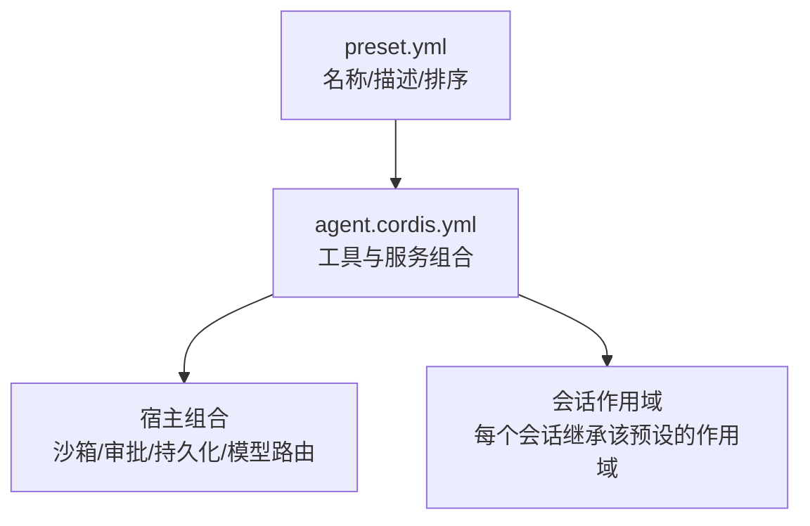
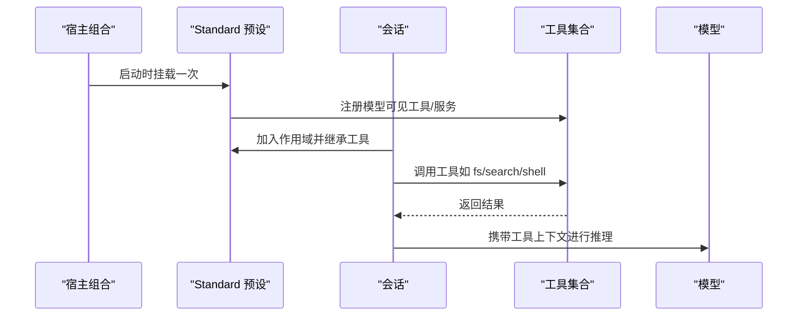
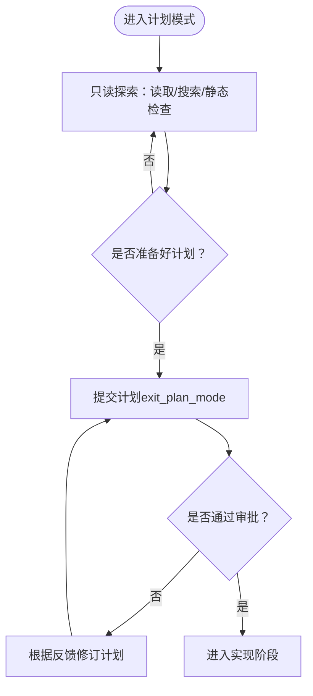
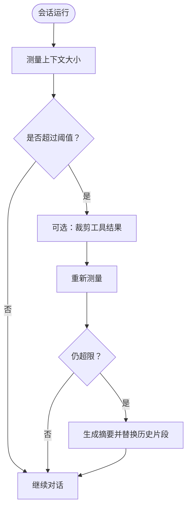
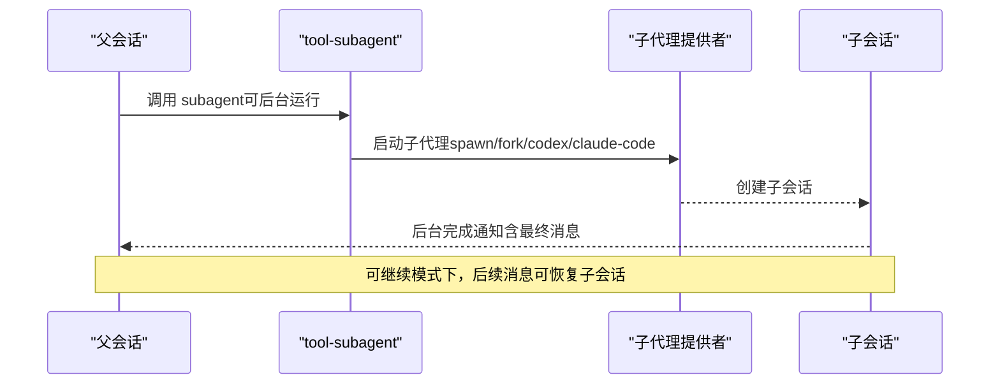
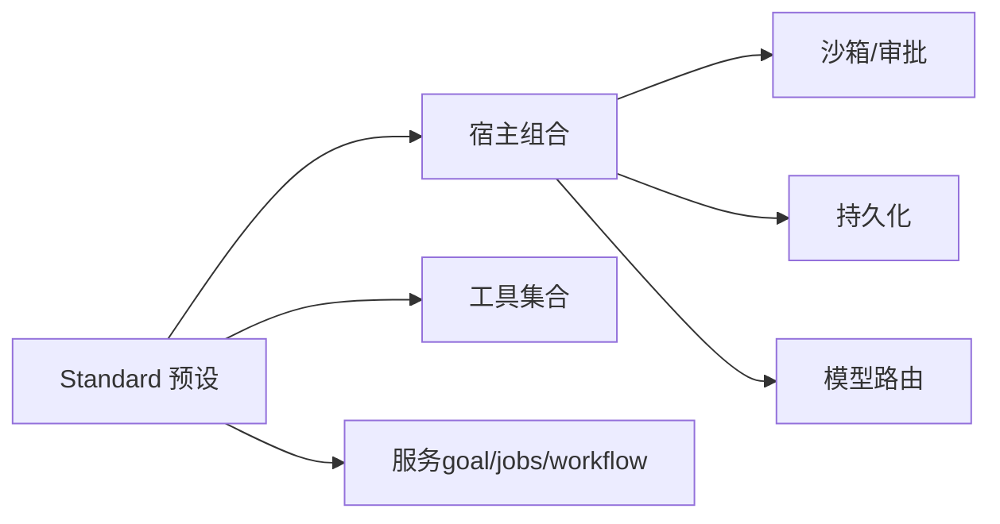

# Standard 预设

<cite>
**本文引用的文件**
- [apps/cli/config/agent-presets/standard/preset.yml](file://apps/cli/config/agent-presets/standard/preset.yml)
- [apps/cli/config/agent-presets/standard/agent.cordis.yml](file://apps/cli/config/agent-presets/standard/agent.cordis.yml)
- [apps/cli/config/agent-presets/minimal/preset.yml](file://apps/cli/config/agent-presets/minimal/preset.yml)
- [apps/cli/config/agent-presets/minimal/agent.cordis.yml](file://apps/cli/config/agent-presets/minimal/agent.cordis.yml)
- [apps/cli/config/agent-presets/code/preset.yml](file://apps/cli/config/agent-presets/code/preset.yml)
- [packages/web/tool-web/src/index.ts](file://packages/web/tool-web/src/index.ts)
- [packages/compaction/compaction-tool-result-pruner/src/config.ts](file://packages/compaction/compaction-tool-result-pruner/src/config.ts)
- [packages/subagent/tool-subagent/src/index.ts](file://packages/subagent/tool-subagent/src/index.ts)
- [docs/subsystems/compaction.md](file://docs/subsystems/compaction.md)
- [docs/subsystems/permission-presets.md](file://docs/subsystems/permission-presets.md)
</cite>

## 目录
1. [简介](#简介)
2. [项目结构](#项目结构)
3. [核心组件](#核心组件)
4. [架构总览](#架构总览)
5. [详细组件分析](#详细组件分析)
6. [依赖关系分析](#依赖关系分析)
7. [性能与资源消耗](#性能与资源消耗)
8. [故障排查指南](#故障排查指南)
9. [结论](#结论)
10. [附录：配置选项速查](#附录：配置选项速查)

## 简介
Standard 预设是默认推荐的“功能完整”的编码 Agent 预设，提供文件系统访问、Shell（bash/pwsh）、Web 搜索、Skills、计划模式、目标管理、子代理与工作流、任务后台执行、上下文压缩等能力。它通过一次进程级挂载，将模型可见的工具与提示片段注册到会话作用域中；宿主负责沙箱、审批、持久化与模型路由等横切关注点。

与 Minimal 相比，Standard 在保持安全边界的同时，显著扩展了工具集与自动化能力，适合大多数日常编码与多步骤任务场景。

**章节来源**
- [apps/cli/config/agent-presets/standard/preset.yml:1-4](file://apps/cli/config/agent-presets/standard/preset.yml#L1-L4)
- [apps/cli/config/agent-presets/minimal/preset.yml:1-4](file://apps/cli/config/agent-presets/minimal/preset.yml#L1-L4)

## 项目结构
Standard 预设由两个文件组成：
- preset.yml：元数据（名称、描述、排序），用于 UI 展示与选择。
- agent.cordis.yml：Agent 层组合清单，声明所有模型可见的工具、服务与提示片段。

**图表来源**
- [apps/cli/config/agent-presets/standard/preset.yml:1-4](file://apps/cli/config/agent-presets/standard/preset.yml#L1-L4)
- [apps/cli/config/agent-presets/standard/agent.cordis.yml:1-10](file://apps/cli/config/agent-presets/standard/agent.cordis.yml#L1-L10)

**章节来源**
- [apps/cli/config/agent-presets/standard/preset.yml:1-4](file://apps/cli/config/agent-presets/standard/preset.yml#L1-L4)
- [apps/cli/config/agent-presets/standard/agent.cordis.yml:1-10](file://apps/cli/config/agent-presets/standard/agent.cordis.yml#L1-L10)

## 核心组件
Standard 预设包含以下关键能力（按功能域分组）：
- 身份与指令
  - persona：注入模型身份与运行上下文（模型名、工作目录）。
  - agent-instructions：限制指令长度，避免过长系统提示。
- Shell
  - tool-bash：Linux/macOS 下的 bash 工具（Windows 禁用）。
  - tool-pwsh：Windows 下的 PowerShell 工具（非 Windows 禁用）。
- 文件系统
  - tool-fs：基础文件读写工具。
  - tool-fs-search：文件检索工具，可调整采样策略。
- 后台任务
  - tool-jobs：暴露后台任务管理能力（查询/停止）。
- Skills
  - skill-filesystem：本地根目录发现。
  - tool-skill：技能目录加载与调用。
- 目标与计划
  - tool-goal：目标管理与驱动。
  - planning（plan-mode）：计划模式提示与行为约束。
- 上下文压缩
  - compaction-basic：自动压缩引擎。
  - command-compact：手动压缩命令。
  - tool-result-pruner：工具结果裁剪器（头/尾保留，中间裁剪）。
- 委派与工作流
  - tool-subagent-control / list-agents：子代理控制与列表。
  - tool-subagent（spawn/fork/codex/claude-code）：多种子代理提供者。
  - workflow-worker-thread：工作流执行线程。
  - tool-workflow：工作流工具。
  - tool-ralph：基于工作流的智能编排工具。
- 交互与辅助
  - tool-ask-user：向用户提问。
  - tool-todo：待办事项跟踪（支持并行进行中任务）。
  - tool-web：Web 搜索与抓取（可关闭 fetch，仅保留搜索）。

**章节来源**
- [apps/cli/config/agent-presets/standard/agent.cordis.yml:20-252](file://apps/cli/config/agent-presets/standard/agent.cordis.yml#L20-L252)

## 架构总览
Standard 预设采用“宿主 + 预设”的分层组合：
- 宿主（base.cordis.yml + web.cordis.yml）：持有 registries、沙箱、审批、持久化、模型路由等全局能力。
- 预设（agent.cordis.yml）：以“站立作用域”挂载一次，所有会话通过作用域继承获得工具与提示片段，但会话状态按 Session/Agent 隔离。

**图表来源**
- [apps/cli/config/agent-presets/standard/agent.cordis.yml:1-10](file://apps/cli/config/agent-presets/standard/agent.cordis.yml#L1-L10)

**章节来源**
- [apps/cli/config/agent-presets/standard/agent.cordis.yml:1-10](file://apps/cli/config/agent-presets/standard/agent.cordis.yml#L1-L10)

## 详细组件分析

### 身份与指令
- persona：使用模板变量注入模型名与工作目录，使 Agent 具备运行时上下文感知。
- agent-instructions：限制指令字节上限，避免系统提示过大影响上下文。

**章节来源**
- [apps/cli/config/agent-presets/standard/agent.cordis.yml:20-34](file://apps/cli/config/agent-presets/standard/agent.cordis.yml#L20-L34)

### Shell（bash/pwsh）
- 平台条件启用：bash 在非 Windows 启用，pwsh 在 Windows 启用。
- 环境变量由宿主注入（DSH_WEB_URL/DSH_WEB_MODE），确保工具正确运行。

**章节来源**
- [apps/cli/config/agent-presets/standard/agent.cordis.yml:35-51](file://apps/cli/config/agent-presets/standard/agent.cordis.yml#L35-L51)

### 文件系统与检索
- tool-fs：基础文件操作，受宿主沙箱与权限策略保护。
- tool-fs-search：文件检索，可通过配置调整采样策略（例如关闭大结果采样）。

**章节来源**
- [apps/cli/config/agent-presets/standard/agent.cordis.yml:52-63](file://apps/cli/config/agent-presets/standard/agent.cordis.yml#L52-L63)

### 后台任务（Jobs）
- tool-jobs：允许模型查询与停止后台任务，提升长耗时操作的体验。

**章节来源**
- [apps/cli/config/agent-presets/standard/agent.cordis.yml:64-75](file://apps/cli/config/agent-presets/standard/agent.cordis.yml#L64-L75)

### Skills（技能）
- skill-filesystem：为 Agent 提供本地根目录发现能力。
- tool-skill：加载并调用技能目录中的工具。

**章节来源**
- [apps/cli/config/agent-presets/standard/agent.cordis.yml:76-88](file://apps/cli/config/agent-presets/standard/agent.cordis.yml#L76-L88)

### 目标（Goal）与计划（Plan Mode）
- tool-goal：目标管理与驱动，宿主提供服务与命令端点。
- planning（plan-mode）：进入计划模式后，引导模型先探索再提交计划，禁止直接修改代码或配置。

**图表来源**
- [apps/cli/config/agent-presets/standard/agent.cordis.yml:100-125](file://apps/cli/config/agent-presets/standard/agent.cordis.yml#L100-L125)

**章节来源**
- [apps/cli/config/agent-presets/standard/agent.cordis.yml:89-125](file://apps/cli/config/agent-presets/standard/agent.cordis.yml#L89-L125)

### 上下文压缩（Compaction）
- compaction-basic：自动压缩引擎，当上下文压力超过阈值时触发。
- command-compact：手动触发压缩的命令。
- tool-result-pruner：对工具结果进行头/尾保留、中间裁剪，减少上下文占用。

**图表来源**
- [docs/subsystems/compaction.md:1-239](file://docs/subsystems/compaction.md#L1-L239)
- [apps/cli/config/agent-presets/standard/agent.cordis.yml:126-156](file://apps/cli/config/agent-presets/standard/agent.cordis.yml#L126-L156)

**章节来源**
- [docs/subsystems/compaction.md:1-239](file://docs/subsystems/compaction.md#L1-L239)
- [apps/cli/config/agent-presets/standard/agent.cordis.yml:126-156](file://apps/cli/config/agent-presets/standard/agent.cordis.yml#L126-L156)

### 委派与工作流（Subagent & Workflow）
- tool-subagent：支持 spawn/fork/codex/claude-code 等多种提供者，可配置后台模式（one-shot/continuable）。
- tool-workflow：工作流工具，结合 worker 线程执行复杂流程。
- tool-ralph：基于工作流的智能编排工具，可设置最大轮次与子代理提供者。

**图表来源**
- [apps/cli/config/agent-presets/standard/agent.cordis.yml:157-234](file://apps/cli/config/agent-presets/standard/agent.cordis.yml#L157-L234)
- [packages/subagent/tool-subagent/src/index.ts:28-304](file://packages/subagent/tool-subagent/src/index.ts#L28-L304)

**章节来源**
- [apps/cli/config/agent-presets/standard/agent.cordis.yml:157-234](file://apps/cli/config/agent-presets/standard/agent.cordis.yml#L157-L234)
- [packages/subagent/tool-subagent/src/index.ts:28-304](file://packages/subagent/tool-subagent/src/index.ts#L28-L304)

### Web 工具
- tool-web：可配置搜索与抓取开关，设置超时与输出字符上限。Standard 预设默认关闭 fetch，仅开启搜索。

**章节来源**
- [apps/cli/config/agent-presets/standard/agent.cordis.yml:235-252](file://apps/cli/config/agent-presets/standard/agent.cordis.yml#L235-L252)
- [packages/web/tool-web/src/index.ts:52-91](file://packages/web/tool-web/src/index.ts#L52-L91)

### 交互与辅助
- tool-ask-user：向用户提问，收集必要信息。
- tool-todo：跟踪待办事项，支持并行进行中任务。

**章节来源**
- [apps/cli/config/agent-presets/standard/agent.cordis.yml:235-244](file://apps/cli/config/agent-presets/standard/agent.cordis.yml#L235-L244)

## 依赖关系分析
Standard 预设依赖宿主提供的以下能力：
- 工具注册表与沙箱策略
- 审批策略与权限预设
- 会话持久化与模型路由
- 背景任务与子代理注册表

**图表来源**
- [apps/cli/config/agent-presets/standard/agent.cordis.yml:1-10](file://apps/cli/config/agent-presets/standard/agent.cordis.yml#L1-L10)
- [docs/subsystems/permission-presets.md:1-132](file://docs/subsystems/permission-presets.md#L1-L132)

**章节来源**
- [apps/cli/config/agent-presets/standard/agent.cordis.yml:1-10](file://apps/cli/config/agent-presets/standard/agent.cordis.yml#L1-L10)
- [docs/subsystems/permission-presets.md:1-132](file://docs/subsystems/permission-presets.md#L1-L132)

## 性能与资源消耗
- 上下文压缩：通过 compaction-basic 与 tool-result-pruner 降低上下文压力，减少 LLM 调用成本与延迟。
- 工具结果裁剪：默认阈值与头尾保留策略可平衡信息完整性与上下文占用。
- 子代理后台模式：continuable 模式支持长时间运行的子任务，避免阻塞主会话。
- Web 工具：可关闭 fetch 仅保留搜索，减少网络开销。

建议：
- 在高并发或多会话场景中，合理调整 tool-result-pruner 的阈值与头尾字符数。
- 对于需要快速响应的场景，优先使用搜索而非抓取。
- 对长任务使用后台子代理，提高吞吐与用户体验。

[本节为通用指导，不直接分析具体文件]

## 故障排查指南
- 权限与沙箱：若工具无法执行，检查宿主沙箱模式与审批策略是否正确配置。
- 平台兼容性：bash/pwsh 根据平台条件启用，确保在对应平台下启用正确的工具。
- 压缩失败：若压缩未生效，检查 token 测量与阈值配置，确认 tool-result-pruner 已正确挂载。
- 子代理错误：若子代理启动失败，检查提供者能力（如 continuable 需 provider 支持 resume）。

**章节来源**
- [docs/subsystems/permission-presets.md:1-132](file://docs/subsystems/permission-presets.md#L1-L132)
- [apps/cli/config/agent-presets/standard/agent.cordis.yml:35-51](file://apps/cli/config/agent-presets/standard/agent.cordis.yml#L35-L51)
- [packages/compaction/compaction-tool-result-pruner/src/config.ts:46-77](file://packages/compaction/compaction-tool-result-pruner/src/config.ts#L46-L77)
- [packages/subagent/tool-subagent/src/index.ts:267-304](file://packages/subagent/tool-subagent/src/index.ts#L267-L304)

## 结论
Standard 预设提供了完整的编码 Agent 能力集，涵盖文件系统、Shell、Web、Skills、计划、目标、子代理与工作流、后台任务与上下文压缩等。它在宿主的安全与持久化保障下，为大多数开发场景提供了开箱即用的最佳实践。相比 Minimal，Standard 更适合复杂任务与团队协作；如需更轻量环境，可回退至 Minimal。

[本节为总结性内容，不直接分析具体文件]

## 附录：配置选项速查
- persona：文本模板，支持 {{model}} 与 {{cwd}}。
- agent-instructions：maxBytes 限制指令长度。
- tool-bash / tool-pwsh：平台条件启用。
- tool-fs-search：sampleOverCapGlobResults 控制大结果采样。
- compaction：compaction-basic、command-compact、tool-result-pruner（thresholdChars/headChars/tailChars）。
- delegation：tool-subagent（provider/toolName/backgroundMode/maxDepth）、workflow-worker-thread、tool-workflow、tool-ralph（subagentProvider/maxRounds）。
- tool-web：fetch/searchTimeoutMs（Standard 默认 fetch=false）。

**章节来源**
- [apps/cli/config/agent-presets/standard/agent.cordis.yml:20-252](file://apps/cli/config/agent-presets/standard/agent.cordis.yml#L20-L252)
- [packages/web/tool-web/src/index.ts:52-91](file://packages/web/tool-web/src/index.ts#L52-L91)
- [packages/compaction/compaction-tool-result-pruner/src/config.ts:46-77](file://packages/compaction/compaction-tool-result-pruner/src/config.ts#L46-L77)