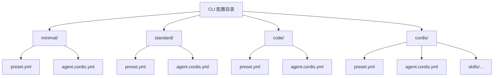
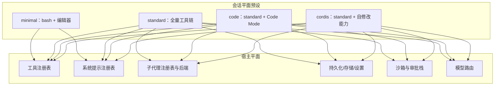
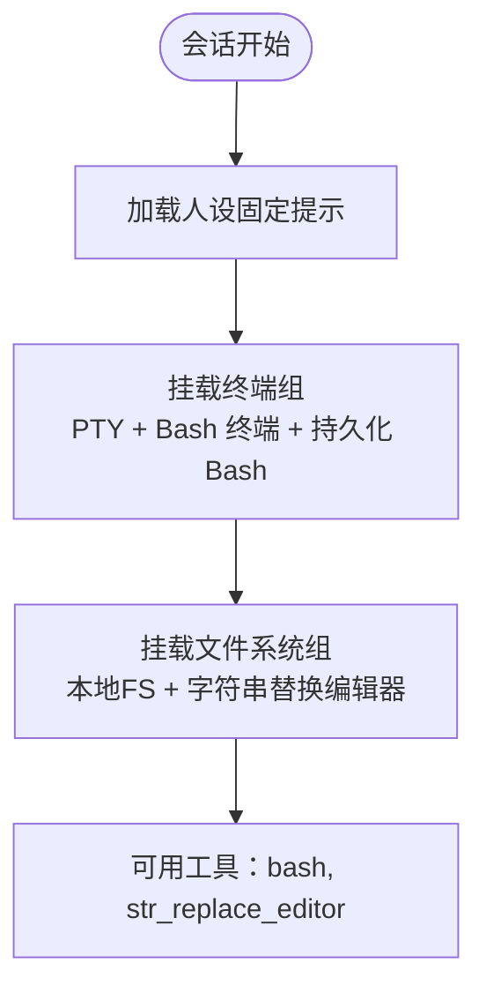
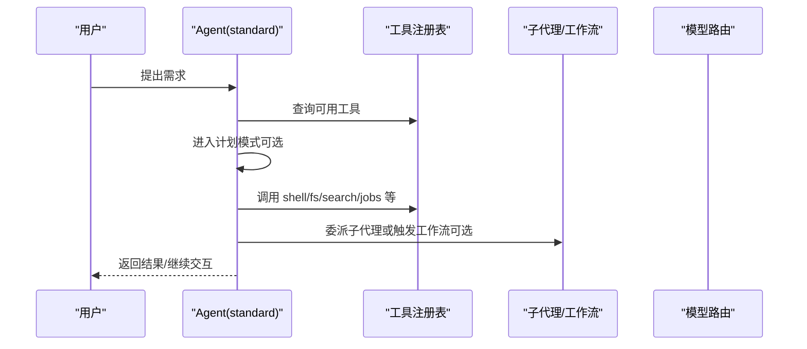
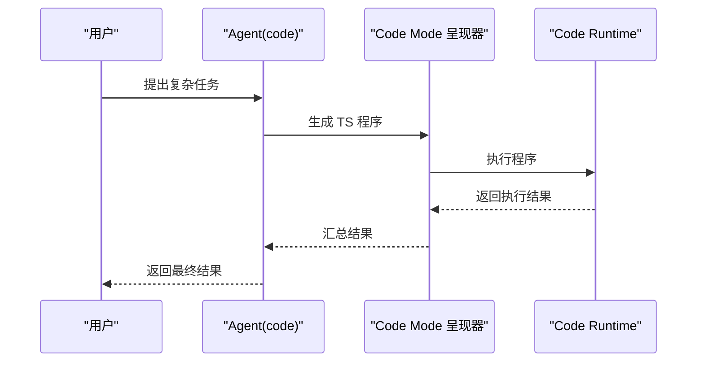
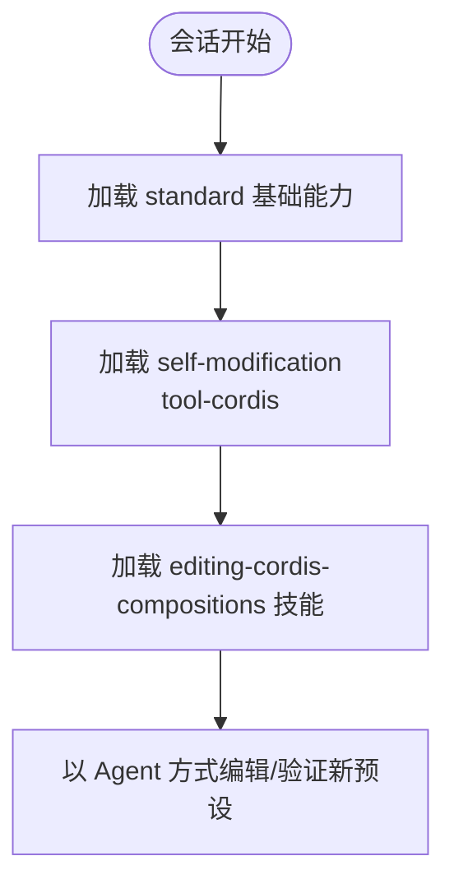
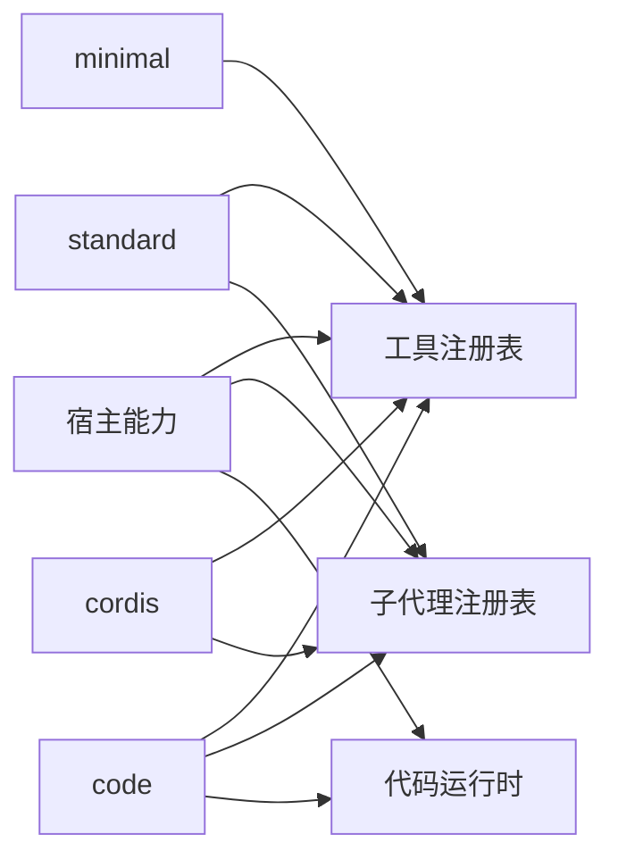

# 内置预设详解

<cite>
**本文引用的文件**
- [apps/cli/config/agent-presets/minimal/preset.yml](file://apps/cli/config/agent-presets/minimal/preset.yml)
- [apps/cli/config/agent-presets/minimal/agent.cordis.yml](file://apps/cli/config/agent-presets/minimal/agent.cordis.yml)
- [apps/cli/config/agent-presets/standard/preset.yml](file://apps/cli/config/agent-presets/standard/preset.yml)
- [apps/cli/config/agent-presets/standard/agent.cordis.yml](file://apps/cli/config/agent-presets/standard/agent.cordis.yml)
- [apps/cli/config/agent-presets/code/preset.yml](file://apps/cli/config/agent-presets/code/preset.yml)
- [apps/cli/config/agent-presets/code/agent.cordis.yml](file://apps/cli/config/agent-presets/code/agent.cordis.yml)
- [apps/cli/config/agent-presets/cordis/preset.yml](file://apps/cli/config/agent-presets/cordis/preset.yml)
- [apps/cli/config/agent-presets/cordis/agent.cordis.yml](file://apps/cli/config/agent-presets/cordis/agent.cordis.yml)
- [apps/cli/config/agent-presets/cordis/skills/editing-cordis-compositions/skill.md](file://apps/cli/config/agent-presets/cordis/skills/editing-cordis-compositions/skill.md)
- [apps/cli/tests/web-agent-presets.e2e.ts](file://apps/cli/tests/web-agent-presets.e2e.ts)
- [scripts/demo-cordis.mjs](file://scripts/demo-cordis.mjs)
- [packages/code-runtime/code-runtime-worker-thread/src/index.ts](file://packages/code-runtime/code-runtime-worker-thread/src/index.ts)
</cite>

## 目录
1. [简介](#简介)
2. [项目结构](#项目结构)
3. [核心组件](#核心组件)
4. [架构总览](#架构总览)
5. [详细组件分析](#详细组件分析)
6. [依赖关系分析](#依赖关系分析)
7. [性能与资源特征](#性能与资源特征)
8. [故障排查指南](#故障排查指南)
9. [结论](#结论)
10. [附录：快速上手与示例](#附录快速上手与示例)

## 简介
本指南面向希望快速选择并上手 DeepSeek Harness 内置 Agent 预设的用户。仓库提供了四个内置预设：minimal、standard、code、cordis，分别覆盖从“极简编码”到“完整能力”，再到“代码模式（TypeScript 程序组合）”和“可自我编辑的创造模式”的不同使用场景。本文将逐一说明每个预设包含的插件、工具与服务，给出典型使用场景与示例，解释如何基于内置预设进行定制扩展，并提供功能对比、性能特征与选型建议。

## 项目结构
内置预设位于 CLI 配置目录下，每个预设由两部分组成：
- preset.yml：元数据（名称、描述、排序）。
- agent.cordis.yml：该预设的插件装配清单（工具、服务、提示段、工作流等）。

图表来源
- [apps/cli/config/agent-presets/minimal/preset.yml:1-4](file://apps/cli/config/agent-presets/minimal/preset.yml#L1-L4)
- [apps/cli/config/agent-presets/minimal/agent.cordis.yml:1-63](file://apps/cli/config/agent-presets/minimal/agent.cordis.yml#L1-L63)
- [apps/cli/config/agent-presets/standard/preset.yml:1-4](file://apps/cli/config/agent-presets/standard/preset.yml#L1-L4)
- [apps/cli/config/agent-presets/standard/agent.cordis.yml:1-252](file://apps/cli/config/agent-presets/standard/agent.cordis.yml#L1-L252)
- [apps/cli/config/agent-presets/code/preset.yml:1-4](file://apps/cli/config/agent-presets/code/preset.yml#L1-L4)
- [apps/cli/config/agent-presets/code/agent.cordis.yml:1-263](file://apps/cli/config/agent-presets/code/agent.cordis.yml#L1-L263)
- [apps/cli/config/agent-presets/cordis/preset.yml:1-4](file://apps/cli/config/agent-presets/cordis/preset.yml#L1-L4)
- [apps/cli/config/agent-presets/cordis/agent.cordis.yml:1-263](file://apps/cli/config/agent-presets/cordis/agent.cordis.yml#L1-L263)

章节来源
- [apps/cli/config/agent-presets/minimal/preset.yml:1-4](file://apps/cli/config/agent-presets/minimal/preset.yml#L1-L4)
- [apps/cli/config/agent-presets/standard/preset.yml:1-4](file://apps/cli/config/agent-presets/standard/preset.yml#L1-L4)
- [apps/cli/config/agent-presets/code/preset.yml:1-4](file://apps/cli/config/agent-presets/code/preset.yml#L1-L4)
- [apps/cli/config/agent-presets/cordis/preset.yml:1-4](file://apps/cli/config/agent-presets/cordis/preset.yml#L1-L4)

## 核心组件
- 最小化预设 minimal：仅包含持久化 bash 终端与 str_replace_editor 两个工具，适合轻量编码任务。
- 标准预设 standard：提供完整的编码 Agent 能力，包括 Shell、文件系统、搜索、Skills、计划、目标、子代理与工作流等。
- 代码预设 code：在 standard 基础上引入 Code Mode，通过 TypeScript 程序组合多步操作，减少往返调用。
- 创造预设 cordis：在 standard 基础上开放运行时自检与插件实验能力，支持以 Agent 编写 Agent 的预设。

章节来源
- [apps/cli/config/agent-presets/minimal/agent.cordis.yml:1-63](file://apps/cli/config/agent-presets/minimal/agent.cordis.yml#L1-L63)
- [apps/cli/config/agent-presets/standard/agent.cordis.yml:1-252](file://apps/cli/config/agent-presets/standard/agent.cordis.yml#L1-L252)
- [apps/cli/config/agent-presets/code/agent.cordis.yml:1-263](file://apps/cli/config/agent-presets/code/agent.cordis.yml#L1-L263)
- [apps/cli/config/agent-presets/cordis/agent.cordis.yml:1-263](file://apps/cli/config/agent-presets/cordis/agent.cordis.yml#L1-L263)

## 架构总览
所有预设均遵循“宿主平面（Host）+ 会话平面（Agent Preset）”的分层原则：
- 宿主平面：注册表、沙箱、审批、持久化、模型路由、子代理注册表与后端等进程级共享能力。
- 会话平面：每个预设为一次会话贡献工具、人设、提示段、压缩策略等，按会话隔离。

图表来源
- [apps/cli/config/agent-presets/standard/agent.cordis.yml:1-252](file://apps/cli/config/agent-presets/standard/agent.cordis.yml#L1-L252)
- [apps/cli/config/agent-presets/code/agent.cordis.yml:1-263](file://apps/cli/config/agent-presets/code/agent.cordis.yml#L1-L263)
- [apps/cli/config/agent-presets/cordis/agent.cordis.yml:1-263](file://apps/cli/config/agent-presets/cordis/agent.cordis.yml#L1-L263)

## 详细组件分析

### minimal 预设
- 特点：固定提示、双工具（持久化 bash、str_replace_editor），无上下文压缩，无 Web 检索。
- 包含的插件/工具/服务：
  - 人设 persona：固定简短提示，关闭运行时上下文快照。
  - 终端组 persistent-shell：PTY、bash 终端、持久化 bash 工具。
  - 文件系统组 filesystem：本地 FS、str_replace_editor。
- 典型场景：需要最简编码环境，避免额外能力带来的复杂度与开销。
- 示例要点：
  - 启动后仅暴露两个工具；适合脚本执行与简单文件替换。
  - 不启用 Web 搜索与背景任务控制。

图表来源
- [apps/cli/config/agent-presets/minimal/agent.cordis.yml:8-63](file://apps/cli/config/agent-presets/minimal/agent.cordis.yml#L8-L63)

章节来源
- [apps/cli/config/agent-presets/minimal/agent.cordis.yml:1-63](file://apps/cli/config/agent-presets/minimal/agent.cordis.yml#L1-L63)

### standard 预设
- 特点：功能完整的编码 Agent，涵盖 Shell、文件系统、搜索、Skills、计划、目标、子代理与工作流。
- 包含的插件/工具/服务（节选）：
  - 身份与指令：persona、agent-instructions。
  - Shell：tool-bash、tool-pwsh（按平台启用）。
  - 文件系统：tool-fs、tool-fs-search。
  - 后台任务：tool-jobs。
  - Skills：skill-filesystem、tool-skill。
  - 目标：tool-goal。
  - 计划模式：planning（plan-mode）。
  - 上下文压缩：compaction-basic、command-compact、tool-result-pruner。
  - 委托与工作流：tool-subagent-control、tool-subagent（spawn/fork）、workflow-worker-thread、tool-workflow、tool-ralph。
  - 其他：tool-ask-user、tool-todo、tool-web（禁用 fetch，保留搜索）。
- 典型场景：通用编码助手，能规划、搜索、执行命令、管理任务、委派子代理、运行工作流。
- 示例要点：
  - 可在计划模式下先制定方案再实施。
  - 可通过 subagent/workflow 编排复杂流程。
  - 自动压缩上下文，控制输出大小。

图表来源
- [apps/cli/config/agent-presets/standard/agent.cordis.yml:20-252](file://apps/cli/config/agent-presets/standard/agent.cordis.yml#L20-L252)

章节来源
- [apps/cli/config/agent-presets/standard/agent.cordis.yml:1-252](file://apps/cli/config/agent-presets/standard/agent.cordis.yml#L1-L252)

### code 预设
- 特点：在 standard 基础上增加 Code Mode，将多步工具调用封装为 TypeScript 程序，由 run_code 执行，显著减少往返。
- 新增内容：
  - tool-presentation：mode=code，呈现 Code Mode。
  - 其余与 standard 一致。
- 典型场景：复杂多步骤任务，希望通过单一程序编排多个工具调用，提升效率与一致性。
- 示例要点：
  - 模型生成 TS 程序，宿主 codeRuntime 执行，结果回传。
  - 适用于批量文件处理、跨模块重构、自动化流水线等。

图表来源
- [apps/cli/config/agent-presets/code/agent.cordis.yml:254-263](file://apps/cli/config/agent-presets/code/agent.cordis.yml#L254-L263)
- [packages/code-runtime/code-runtime-worker-thread/src/index.ts:24-54](file://packages/code-runtime/code-runtime-worker-thread/src/index.ts#L24-L54)

章节来源
- [apps/cli/config/agent-presets/code/agent.cordis.yml:1-263](file://apps/cli/config/agent-presets/code/agent.cordis.yml#L1-L263)

### cordis 预设
- 特点：在 standard 基础上开放运行时自检与插件实验能力，允许 Agent 读写自身运行的 Composition，用于创建自定义预设。
- 新增内容：
  - tool-cordis：读取/写入/挂载临时插件的能力（信任边界，需谨慎）。
  - skill-filesystem：附带 editing-cordis-compositions 技能，指导如何编辑 Composition。
- 典型场景：高级用户或开发者，需要以 Agent 方式创作、验证、部署新的 Agent 预设。
- 示例要点：
  - 使用 cordis_mount 临时挂载插件进行探测。
  - 通过 editing-cordis-compositions 技能学习两平面规则与校验方法。

图表来源
- [apps/cli/config/agent-presets/cordis/agent.cordis.yml:241-263](file://apps/cli/config/agent-presets/cordis/agent.cordis.yml#L241-L263)
- [apps/cli/config/agent-presets/cordis/skills/editing-cordis-compositions/skill.md:1-155](file://apps/cli/config/agent-presets/cordis/skills/editing-cordis-compositions/skill.md#L1-L155)

章节来源
- [apps/cli/config/agent-presets/cordis/agent.cordis.yml:1-263](file://apps/cli/config/agent-presets/cordis/agent.cordis.yml#L1-L263)
- [apps/cli/config/agent-presets/cordis/skills/editing-cordis-compositions/skill.md:1-155](file://apps/cli/config/agent-presets/cordis/skills/editing-cordis-compositions/skill.md#L1-L155)

## 依赖关系分析
- 宿主与预设的解耦：预设只负责“会话级”能力注入，进程级能力由宿主提供。
- 关键依赖：
  - 工具注册表：所有工具通过宿主注册表暴露给模型。
  - 子代理与工作流：注册表在宿主侧，预设仅提供工具入口。
  - 代码运行时：code 预设依赖宿主提供的 codeRuntime。
  - 权限与沙箱：宿主侧统一管控，预设不可越权。

图表来源
- [apps/cli/config/agent-presets/standard/agent.cordis.yml:157-234](file://apps/cli/config/agent-presets/standard/agent.cordis.yml#L157-L234)
- [apps/cli/config/agent-presets/code/agent.cordis.yml:164-263](file://apps/cli/config/agent-presets/code/agent.cordis.yml#L164-L263)
- [apps/cli/config/agent-presets/cordis/agent.cordis.yml:145-263](file://apps/cli/config/agent-presets/cordis/agent.cordis.yml#L145-L263)

章节来源
- [apps/cli/config/agent-presets/standard/agent.cordis.yml:1-252](file://apps/cli/config/agent-presets/standard/agent.cordis.yml#L1-L252)
- [apps/cli/config/agent-presets/code/agent.cordis.yml:1-263](file://apps/cli/config/agent-presets/code/agent.cordis.yml#L1-L263)
- [apps/cli/config/agent-presets/cordis/agent.cordis.yml:1-263](file://apps/cli/config/agent-presets/cordis/agent.cordis.yml#L1-L263)

## 性能与资源特征
- minimal：
  - 资源占用最低，仅加载必要工具与人设。
  - 无上下文压缩，长对话可能增长较快。
- standard：
  - 功能全面，包含压缩、搜索、工作流等，内存与 CPU 占用高于 minimal。
  - 通过 compaction 与工具结果裁剪控制上下文膨胀。
- code：
  - 在 standard 基础上增加 Code Mode，TS 程序执行带来额外开销，但可减少多次工具调用的网络/调度成本。
  - 可通过 worker 计算预算、堆限制等参数优化稳定性。
- cordis：
  - 具备 self-modification 能力，需严格信任边界；在生产环境中谨慎使用。
  - 性能特征与 standard 相近，额外开销来自运行时自检与技能加载。

章节来源
- [apps/cli/config/agent-presets/standard/agent.cordis.yml:126-156](file://apps/cli/config/agent-presets/standard/agent.cordis.yml#L126-L156)
- [apps/cli/config/agent-presets/code/agent.cordis.yml:254-263](file://apps/cli/config/agent-presets/code/agent.cordis.yml#L254-L263)
- [packages/code-runtime/code-runtime-worker-thread/src/index.ts:24-54](file://packages/code-runtime/code-runtime-worker-thread/src/index.ts#L24-L54)
- [apps/cli/config/agent-presets/cordis/agent.cordis.yml:9-12](file://apps/cli/config/agent-presets/cordis/agent.cordis.yml#L9-L12)

## 故障排查指南
- 常见错误与定位：
  - 服务发布到根域导致冲突：需在 group 中设置 isolate 领域，避免进程级服务碰撞。
  - 行未激活：检查是否缺少所需服务或 realm 配置不当。
  - 配置无效：根据错误信息修正 config 字段类型与必填项。
- 验证方法：
  - 使用 standingKeyFor 对预设进行装载校验，确认无解析失败、配置错误或未激活的行。
  - 通过 cordis_inspect 查看当前会话的 Composition，确认行是否生效。
- 安全注意：
  - cordis 预设具有自修改能力，应视为“等同于 shell 访问”，仅在受控环境下使用。

章节来源
- [apps/cli/config/agent-presets/cordis/skills/editing-cordis-compositions/skill.md:76-122](file://apps/cli/config/agent-presets/cordis/skills/editing-cordis-compositions/skill.md#L76-L122)
- [apps/cli/config/agent-presets/cordis/agent.cordis.yml:9-12](file://apps/cli/config/agent-presets/cordis/agent.cordis.yml#L9-L12)

## 结论
- 若仅需最简编码能力，选择 minimal。
- 若需要完整编码助手能力（搜索、计划、委派、工作流等），选择 standard。
- 若任务涉及多步复杂编排且希望减少往返，选择 code。
- 若需要以 Agent 方式创作与验证新预设，选择 cordis（注意安全边界）。
- 所有预设均遵循宿主/会话分层，便于扩展与治理。

## 附录：快速上手与示例
- 默认预设与列表：
  - 测试中验证了 shipped 预设包含 code、cordis、minimal、standard，默认预设为 standard。
- 演示入口：
  - 可使用 demo 脚本启动 Web 或 ACP 表面，叠加 cordis 工具集进行体验。
- 典型用法路径：
  - 通过 settings 与 agent-presets 配置选择预设。
  - 在 Web 界面或 CLI 中选择预设并开启会话。
  - 对于 code 预设，确保宿主已提供 codeRuntime。

章节来源
- [apps/cli/tests/web-agent-presets.e2e.ts:187-193](file://apps/cli/tests/web-agent-presets.e2e.ts#L187-L193)
- [scripts/demo-cordis.mjs:1-22](file://scripts/demo-cordis.mjs#L1-L22)