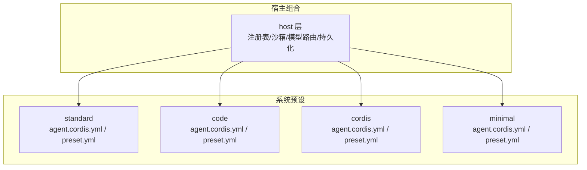
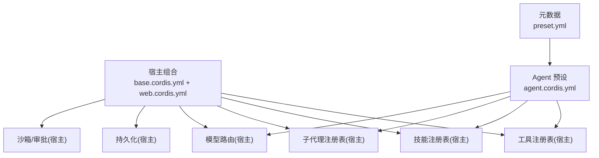
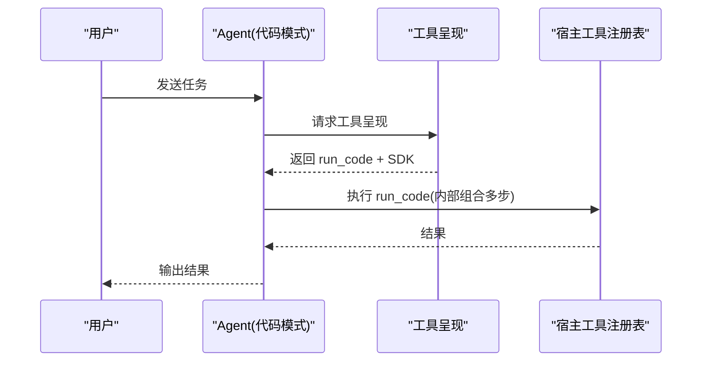
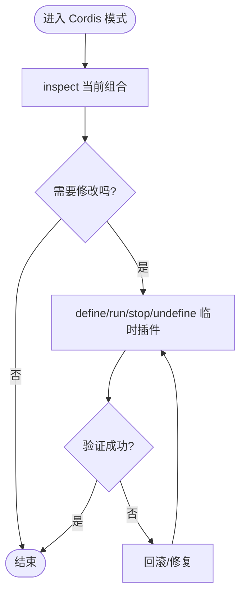
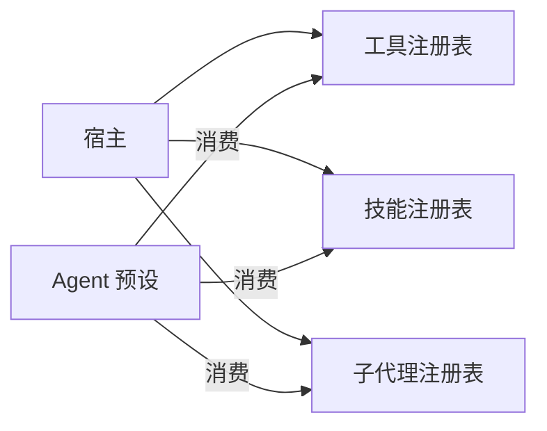

# 自定义预设开发

<cite>
**本文引用的文件**
- [apps/cli/config/agent-presets/standard/agent.cordis.yml](file://apps/cli/config/agent-presets/standard/agent.cordis.yml)
- [apps/cli/config/agent-presets/standard/preset.yml](file://apps/cli/config/agent-presets/standard/preset.yml)
- [apps/cli/config/agent-presets/code/agent.cordis.yml](file://apps/cli/config/agent-presets/code/agent.cordis.yml)
- [apps/cli/config/agent-presets/code/preset.yml](file://apps/cli/config/agent-presets/code/preset.yml)
- [apps/cli/config/agent-presets/cordis/agent.cordis.yml](file://apps/cli/config/agent-presets/cordis/agent.cordis.yml)
- [apps/cli/config/agent-presets/cordis/preset.yml](file://apps/cli/config/agent-presets/cordis/preset.yml)
- [apps/cli/config/agent-presets/minimal/agent.cordis.yml](file://apps/cli/config/agent-presets/minimal/agent.cordis.yml)
- [apps/cli/config/agent-presets/minimal/preset.yml](file://apps/cli/config/agent-presets/minimal/preset.yml)
- [docs/cordis-primer.md](file://docs/cordis-primer.md)
- [docs/config-catalog.md](file://docs/config-catalog.md)
- [docs/testing.md](file://docs/testing.md)
- [packages/preset/agent-presets/tests/authoring.spec.ts](file://packages/preset/agent-presets/tests/authoring.spec.ts)
- [apps/cli/tests/web-agent-presets.e2e.ts](file://apps/cli/tests/web-agent-presets.e2e.ts)
</cite>

## 目录
1. [简介](#简介)
2. [项目结构](#项目结构)
3. [核心组件](#核心组件)
4. [架构总览](#架构总览)
5. [详细组件分析](#详细组件分析)
6. [依赖关系分析](#依赖关系分析)
7. [性能考量](#性能考量)
8. [故障排查指南](#故障排查指南)
9. [结论](#结论)
10. [附录](#附录)

## 简介
本指南面向希望从零开始创建“自定义 Agent 预设”的开发者。你将了解：
- 预设目录结构与必需文件
- agent.cordis.yml 与 preset.yml 的配置方法
- 预设开发与调试的最佳实践
- 版本管理与发布流程建议
- 测试与质量检查方法
- 复杂预设的开发案例（如 Code Mode、自修改能力）
目标是帮助你构建可复用、专业级的 Agent 预设，使其在 DeepSeek Harness 中稳定运行并易于维护。

## 项目结构
预设以“每个预设一个目录”的方式组织，位于部署或用户根目录下。每个预设包含：
- agent.cordis.yml：Agent 层组合清单，声明该预设提供的工具、技能、提示段、计划模式、压缩策略等
- preset.yml：元数据（名称、描述、排序），用于 UI 展示与选择

仓库内置了多个参考预设：
- standard：完整编码 Agent，提供 Shell、文件系统、搜索、技能、目标、子代理、工作流、计划、压缩等
- code：在 standard 基础上启用 Code Mode，将多步操作合并为一次 run_code 调用
- cordis：在 standard 基础上增加运行时自修改能力（谨慎使用）
- minimal：极简双工具（持久 bash + str_replace_editor），固定提示，无上下文快照与压缩

图示来源
- [apps/cli/config/agent-presets/standard/agent.cordis.yml:1-252](file://apps/cli/config/agent-presets/standard/agent.cordis.yml#L1-L252)
- [apps/cli/config/agent-presets/code/agent.cordis.yml:1-263](file://apps/cli/config/agent-presets/code/agent.cordis.yml#L1-L263)
- [apps/cli/config/agent-presets/cordis/agent.cordis.yml:1-263](file://apps/cli/config/agent-presets/cordis/agent.cordis.yml#L1-L263)
- [apps/cli/config/agent-presets/minimal/agent.cordis.yml:1-63](file://apps/cli/config/agent-presets/minimal/agent.cordis.yml#L1-L63)

章节来源
- [apps/cli/config/agent-presets/standard/agent.cordis.yml:1-252](file://apps/cli/config/agent-presets/standard/agent.cordis.yml#L1-L252)
- [apps/cli/config/agent-presets/code/agent.cordis.yml:1-263](file://apps/cli/config/agent-presets/code/agent.cordis.yml#L1-L263)
- [apps/cli/config/agent-presets/cordis/agent.cordis.yml:1-263](file://apps/cli/config/agent-presets/cordis/agent.cordis.yml#L1-L263)
- [apps/cli/config/agent-presets/minimal/agent.cordis.yml:1-63](file://apps/cli/config/agent-presets/minimal/agent.cordis.yml#L1-L63)

## 核心组件
- 宿主层（Host）：负责进程级共享能力，如工具注册表、沙箱与审批栈、持久化、模型路由、子代理注册表等。这些不应由预设直接拥有，以避免跨会话冲突。
- Agent 层（Preset）：每个会话挂载的 Agent 平面组合，声明该 Agent 可见的工具、技能、提示段、计划模式、压缩策略等。服务行必须放入 isolate 域，避免进程全局污染。
- 元数据（preset.yml）：name、description、order，决定 UI 展示顺序与说明。

关键要点
- 宿主与 Agent 层的边界清晰：宿主持有“注册表”，Agent 层只注册“模型可见”的行为
- 服务必须隔离：任何 service 行需放在带 isolate 的 group 内，确保每会话独立实例
- 平台条件禁用：通过 !!js 表达式按平台启用/禁用工具（如 bash/pwsh）

章节来源
- [apps/cli/config/agent-presets/standard/agent.cordis.yml:1-252](file://apps/cli/config/agent-presets/standard/agent.cordis.yml#L1-L252)
- [apps/cli/config/agent-presets/code/agent.cordis.yml:1-263](file://apps/cli/config/agent-presets/code/agent.cordis.yml#L1-L263)
- [apps/cli/config/agent-presets/cordis/agent.cordis.yml:1-263](file://apps/cli/config/agent-presets/cordis/agent.cordis.yml#L1-L263)
- [apps/cli/config/agent-presets/minimal/agent.cordis.yml:1-63](file://apps/cli/config/agent-presets/minimal/agent.cordis.yml#L1-L63)

## 架构总览
下图展示了宿主与 Agent 层的职责划分以及预设如何叠加到宿主之上。

图示来源
- [apps/cli/config/agent-presets/standard/agent.cordis.yml:1-252](file://apps/cli/config/agent-presets/standard/agent.cordis.yml#L1-L252)
- [apps/cli/config/agent-presets/code/agent.cordis.yml:1-263](file://apps/cli/config/agent-presets/code/agent.cordis.yml#L1-L263)
- [apps/cli/config/agent-presets/cordis/agent.cordis.yml:1-263](file://apps/cli/config/agent-presets/cordis/agent.cordis.yml#L1-L263)

## 详细组件分析

### 标准模式（standard）
- 定位：功能完整的编码 Agent，覆盖 Shell、文件系统、搜索、技能、目标、子代理、工作流、计划、压缩等
- 关键点：
  - 身份与指令：persona 与 agent-instructions
  - Shell：bash/pwsh 按平台启用
  - 文件系统：tool-fs、tool-fs-search
  - 背景任务：tool-jobs
  - 技能：skill-filesystem、tool-skill
  - 目标：tool-goal
  - 计划模式：plan-mode 提示段
  - 压缩：compaction-basic、command-compact、tool-result-pruner
  - 委派与工作流：subagent、workflow、ralph
  - 其他：ask_user_question、todo、web_search

章节来源
- [apps/cli/config/agent-presets/standard/agent.cordis.yml:1-252](file://apps/cli/config/agent-presets/standard/agent.cordis.yml#L1-L252)
- [apps/cli/config/agent-presets/standard/preset.yml:1-4](file://apps/cli/config/agent-presets/standard/preset.yml#L1-L4)

### Code 模式（code）
- 定位：在 standard 基础上启用 Code Mode，将多步操作合并为一次 run_code 调用，提升效率
- 关键点：
  - 继承 standard 全部能力
  - 新增 tool-presentation 配置 mode: code，仅向模型暴露 run_code 与生成 SDK
  - 保持宿主侧工具注册表不变，仅改变模型可见呈现

图示来源
- [apps/cli/config/agent-presets/code/agent.cordis.yml:254-263](file://apps/cli/config/agent-presets/code/agent.cordis.yml#L254-L263)
- [apps/cli/config/agent-presets/standard/agent.cordis.yml:1-252](file://apps/cli/config/agent-presets/standard/agent.cordis.yml#L1-L252)

章节来源
- [apps/cli/config/agent-presets/code/agent.cordis.yml:1-263](file://apps/cli/config/agent-presets/code/agent.cordis.yml#L1-L263)
- [apps/cli/config/agent-presets/code/preset.yml:1-4](file://apps/cli/config/agent-presets/code/preset.yml#L1-L4)

### Cordis 模式（cordis）
- 定位：允许 Agent 读取和修改自身运行时的组合（高风险，视为 shell 访问）
- 关键点：
  - 继承 standard 全部能力
  - 新增 self-modification 工具集（cordis_inspect_*、cordis_define/run/stop/undefine）
  - 附带 composition-authoring 技能，指导如何编辑组合
  - 明确信任边界：仅在受控环境下启用

图示来源
- [apps/cli/config/agent-presets/cordis/agent.cordis.yml:241-263](file://apps/cli/config/agent-presets/cordis/agent.cordis.yml#L241-L263)

章节来源
- [apps/cli/config/agent-presets/cordis/agent.cordis.yml:1-263](file://apps/cli/config/agent-presets/cordis/agent.cordis.yml#L1-L263)
- [apps/cli/config/agent-presets/cordis/preset.yml:1-4](file://apps/cli/config/agent-presets/cordis/preset.yml#L1-L4)

### 极简模式（minimal）
- 定位：固定提示、双工具（持久 bash + str_replace_editor），无上下文快照与压缩
- 关键点：
  - persona 设置 complete 且 includeRuntimeContext=false
  - 独立的 persistent-shell 与 filesystem 组，使用 isolate 域
  - 适合基准测试或轻量场景

章节来源
- [apps/cli/config/agent-presets/minimal/agent.cordis.yml:1-63](file://apps/cli/config/agent-presets/minimal/agent.cordis.yml#L1-L63)
- [apps/cli/config/agent-presets/minimal/preset.yml:1-4](file://apps/cli/config/agent-presets/minimal/preset.yml#L1-L4)

### 配置参考（config-catalog）
- 所有插件的 config 字段类型与说明集中在配置目录中，便于查阅与校验
- 例如：
  - dsh-agent-tool-presentation 的 mode 控制工具呈现方式（native/code/both）
  - dsh-compaction-basic 的阈值与重试策略
  - dsh-compaction-tool-result-pruner 的结果裁剪策略

章节来源
- [docs/config-catalog.md:297-319](file://docs/config-catalog.md#L297-L319)
- [docs/config-catalog.md:468-532](file://docs/config-catalog.md#L468-L532)

## 依赖关系分析
- 宿主与 Agent 层解耦：宿主持有注册表与基础设施，Agent 层仅消费并通过组合扩展行为
- 预设间可复用：可通过复制 shipped preset 并在用户根下编辑副本实现定制
- 技能与工具分层：宿主注册技能与工具，Agent 层决定是否暴露给模型

图示来源
- [apps/cli/config/agent-presets/standard/agent.cordis.yml:1-252](file://apps/cli/config/agent-presets/standard/agent.cordis.yml#L1-L252)
- [apps/cli/config/agent-presets/code/agent.cordis.yml:1-263](file://apps/cli/config/agent-presets/code/agent.cordis.yml#L1-L263)

章节来源
- [apps/cli/config/agent-presets/standard/agent.cordis.yml:1-252](file://apps/cli/config/agent-presets/standard/agent.cordis.yml#L1-L252)
- [apps/cli/config/agent-presets/code/agent.cordis.yml:1-263](file://apps/cli/config/agent-presets/code/agent.cordis.yml#L1-L263)

## 性能考量
- 压缩策略：合理设置 compaction-basic 与 tool-result-pruner 阈值，避免过长工具结果影响上下文
- 并行度：根据模型与资源调整 maxParallelToolCalls，避免过载
- 呈现模式：Code Mode 可减少往返次数，提高吞吐；但需确保代码执行环境安全与超时限制
- 资源隔离：服务置于 isolate 域，避免跨会话状态泄漏

[本节为通用指导，不直接分析具体文件]

## 故障排查指南
常见问题与定位方法：
- 工具未生效：确认工具注册在宿主注册表，Agent 层仅消费；若误放在宿主层，可能导致全局污染
- 服务冲突：服务行未放入 isolate 域导致进程全局实例冲突；应使用 group+isolate
- 平台相关失败：bash/pwsh 按平台启用，检查 !!js 表达式是否符合预期
- 权限与路径：最小模式下编辑器要求绝对路径；注意 cwd 与 diffBasisMaxBytes 等限制
- 自修改风险：Cordis 模式具备运行时编辑能力，需谨慎授权与审计

章节来源
- [apps/cli/config/agent-presets/standard/agent.cordis.yml:1-252](file://apps/cli/config/agent-presets/standard/agent.cordis.yml#L1-L252)
- [apps/cli/config/agent-presets/minimal/agent.cordis.yml:1-63](file://apps/cli/config/agent-presets/minimal/agent.cordis.yml#L1-L63)
- [apps/cli/config/agent-presets/cordis/agent.cordis.yml:1-263](file://apps/cli/config/agent-presets/cordis/agent.cordis.yml#L1-L263)

## 结论
通过理解宿主与 Agent 层的边界、正确使用 isolate 域、选择合适的呈现模式与压缩策略，你可以构建稳定、高效、可复用的自定义预设。建议从 minimal 起步，逐步叠加能力，并使用 e2e 与 snapshot 测试保障质量。对于高级场景（如 Code Mode、自修改），请严格评估信任边界与安全风险。

[本节为总结性内容，不直接分析具体文件]

## 附录

### 从零开始创建自定义预设的步骤
1. 新建预设目录：在用户根或部署根下创建 <id>/ 目录
2. 编写 agent.cordis.yml：定义 persona、工具、技能、计划、压缩等
3. 编写 preset.yml：填写 name、description、order
4. 本地调试：通过宿主组合挂载你的预设，验证工具与提示
5. 测试与质量检查：运行单元、e2e、snapshot 测试，确保行为稳定
6. 版本管理：使用 Git 管理变更，记录破坏性更新与兼容性说明
7. 发布流程：将预设纳入用户根或部署根，确保 trust 标记正确

章节来源
- [packages/preset/agent-presets/tests/authoring.spec.ts:25-60](file://packages/preset/agent-presets/tests/authoring.spec.ts#L25-L60)
- [apps/cli/tests/web-agent-presets.e2e.ts:706-774](file://apps/cli/tests/web-agent-presets.e2e.ts#L706-L774)

### 测试与质量检查
- 单元测试：验证插件生命周期、事件顺序、并发与清理
- E2E：启动真实组合，断言模型可见行为与日志
- Snapshot：捕获非确定性输出（传输契约、呈现、持久化日志）
- Web GUI：浏览器快照对比，确保界面一致性

章节来源
- [docs/testing.md:1-50](file://docs/testing.md#L1-L50)
- [apps/cli/tests/web-agent-presets.e2e.ts:150-425](file://apps/cli/tests/web-agent-presets.e2e.ts#L150-L425)

### 复杂预设开发案例
- Code Mode：通过 tool-presentation 切换呈现模式，减少往返，提升效率
- Cordis 自修改：在受控环境中启用运行时编辑，配合技能指导与审计
- 技能与工具分层：宿主注册能力，Agent 层按需暴露，保证隔离与复用

章节来源
- [apps/cli/config/agent-presets/code/agent.cordis.yml:254-263](file://apps/cli/config/agent-presets/code/agent.cordis.yml#L254-L263)
- [apps/cli/config/agent-presets/cordis/agent.cordis.yml:241-263](file://apps/cli/config/agent-presets/cordis/agent.cordis.yml#L241-L263)

### Cordis 基础概念
- 插件即 Service，通过 inject 声明依赖，通过 effect/on 注册可逆效果
- 事件分发模式：emit/waterfall/parallel/serial，遵循契约
- Loader 配置：!!js 表达式支持动态选择与插值

章节来源
- [docs/cordis-primer.md:1-45](file://docs/cordis-primer.md#L1-L45)