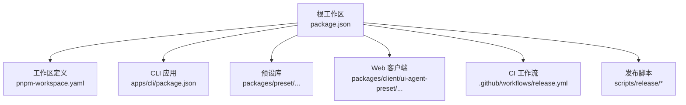
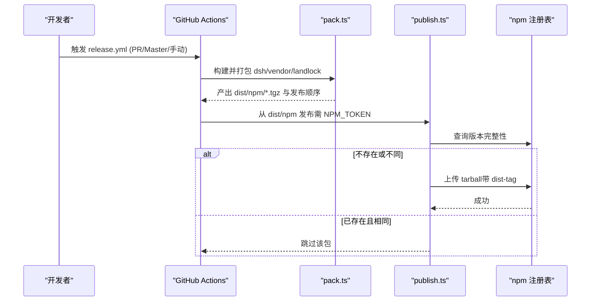
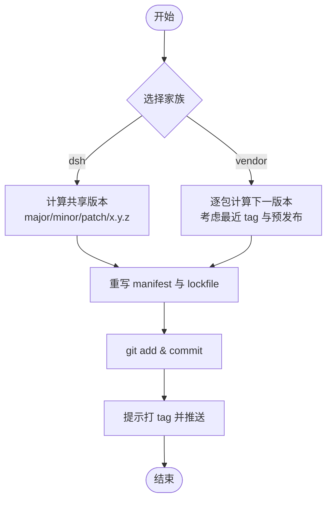
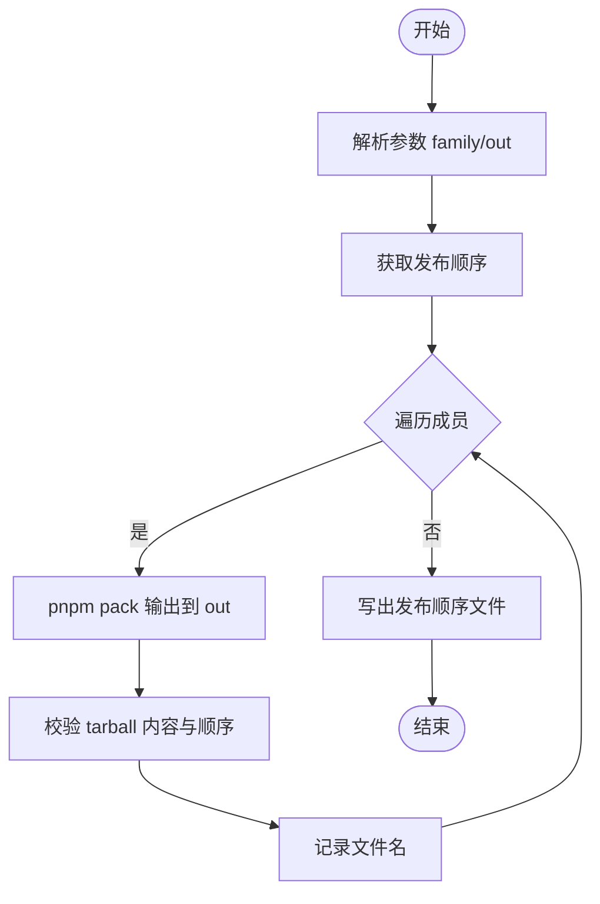
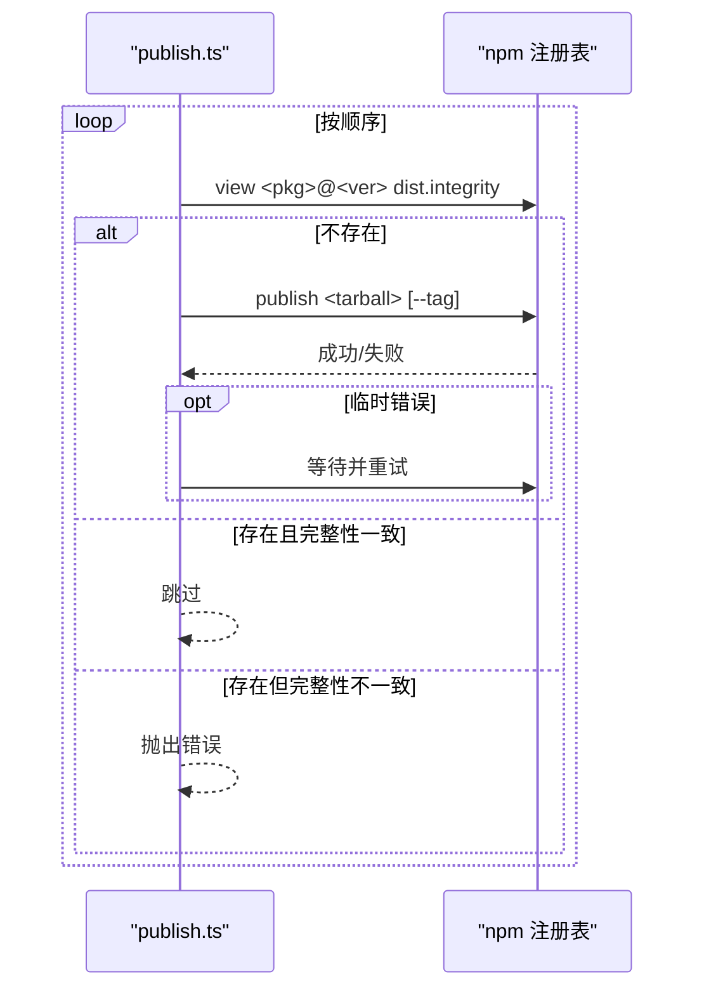
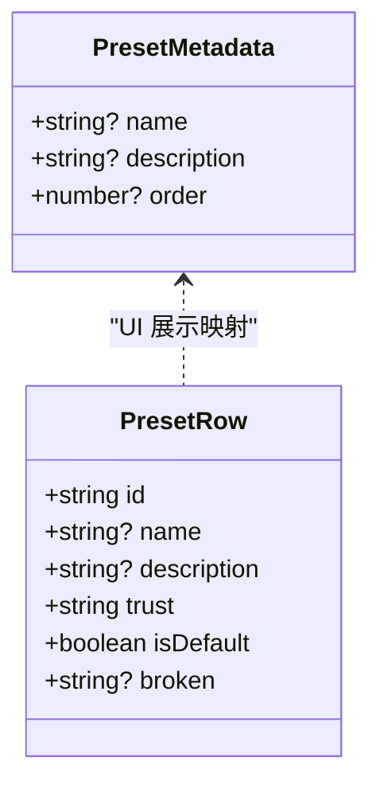
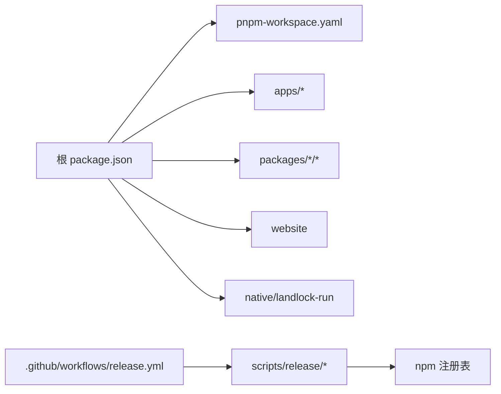

# 预设发布与分发

<cite>
**本文引用的文件**
- [package.json](file://package.json)
- [pnpm-workspace.yaml](file://pnpm-workspace.yaml)
- [.github/workflows/release.yml](file://.github/workflows/release.yml)
- [apps/cli/package.json](file://apps/cli/package.json)
- [scripts/release/bump.ts](file://scripts/release/bump.ts)
- [scripts/release/pack.ts](file://scripts/release/pack.ts)
- [scripts/release/publish.ts](file://scripts/release/publish.ts)
- [packages/preset/agent-presets/src/metadata.ts](file://packages/preset/agent-presets/src/metadata.ts)
- [apps/cli/config/agent-presets/code/preset.yml](file://apps/cli/config/agent-presets/code/preset.yml)
- [apps/cli/config/agent-presets/standard/preset.yml](file://apps/cli/config/agent-presets/standard/preset.yml)
- [packages/client/ui-agent-preset/src/client/section-store.ts](file://packages/client/ui-agent-preset/src/client/section-store.ts)
- [scripts/check-workspace-constraints.ts](file://scripts/check-workspace-constraints.ts)
</cite>

## 目录
1. [简介](#简介)
2. [项目结构](#项目结构)
3. [核心组件](#核心组件)
4. [架构总览](#架构总览)
5. [详细组件分析](#详细组件分析)
6. [依赖关系分析](#依赖关系分析)
7. [性能考虑](#性能考虑)
8. [故障排查指南](#故障排查指南)
9. [结论](#结论)
10. [附录](#附录)

## 简介
本指南面向希望将高质量“预设”打包、版本化并发布到 npm 的开发者。内容覆盖：
- 预设包的打包与版本管理策略
- npm 包发布的配置与流程（CI 自动化）
- 预设文档生成与示例代码组织方法
- 许可证与法律合规要求
- 持续集成与自动化发布
- 社区分享与反馈收集机制

本仓库采用 monorepo + pnpm workspace，通过脚本与 GitHub Actions 实现可重复、可审计的发布流水线；预设元数据与 UI 展示由专用模块负责，确保用户侧体验一致。

## 项目结构
- 工作区与成员
  - 根 package.json 声明 workspaces，包含 packages/*/*、apps/*、website、native/landlock-run 等。
  - pnpm-workspace.yaml 定义成员范围、peerDependencyRules、allowBuilds 白名单与 patchedDependencies。
- 发布相关
  - scripts/release/* 提供 bump、pack、publish 三阶段脚本，配合 .github/workflows/release.yml 完成 CI 构建与发布。
- 预设相关
  - packages/preset/agent-presets 提供预设发现、挂载、元数据处理能力。
  - apps/cli/config/agent-presets 内置系统预设（如标准模式、PTC 模式），以 preset.yml 描述显示信息。
  - packages/client/ui-agent-preset 在 Web 界面中渲染预设列表与选择逻辑。

图表来源
- [package.json:1-18](file://package.json#L1-L18)
- [pnpm-workspace.yaml:1-22](file://pnpm-workspace.yaml#L1-L22)
- [apps/cli/package.json:1-20](file://apps/cli/package.json#L1-L20)
- [.github/workflows/release.yml:1-20](file://.github/workflows/release.yml#L1-L20)

章节来源
- [package.json:1-18](file://package.json#L1-L18)
- [pnpm-workspace.yaml:1-22](file://pnpm-workspace.yaml#L1-L22)

## 核心组件
- 版本与发布家族
  - bump.ts：按家族（dsh/vendor）计算新版本、重写 manifest、提交变更并提示打 tag。
  - pack.ts：按发布顺序对每个成员执行 pnpm pack，校验产物并记录发布顺序。
  - publish.ts：基于 tarball 完整性比对进行幂等发布，处理临时失败重试。
- 预设元数据与展示
  - metadata.ts：定义 preset.yml 的结构与渲染规则（name/description/order）。
  - section-store.ts：前端预设行模型（id/name/description/trust/isDefault/broken）。
- 约束与合规
  - check-workspace-constraints.ts：校验发布成员的 repository、publishConfig.access、private 等约束。

章节来源
- [scripts/release/bump.ts:1-369](file://scripts/release/bump.ts#L1-L369)
- [scripts/release/pack.ts:1-62](file://scripts/release/pack.ts#L1-L62)
- [scripts/release/publish.ts:1-170](file://scripts/release/publish.ts#L1-L170)
- [packages/preset/agent-presets/src/metadata.ts:24-105](file://packages/preset/agent-presets/src/metadata.ts#L24-L105)
- [packages/client/ui-agent-preset/src/client/section-store.ts:21-59](file://packages/client/ui-agent-preset/src/client/section-store.ts#L21-L59)
- [scripts/check-workspace-constraints.ts:253-267](file://scripts/check-workspace-constraints.ts#L253-L267)

## 架构总览
发布流水线分为“打包”和“发布”两个阶段，二者解耦且可独立运行：
- 打包阶段（无凭据）：安装依赖、构建、按家族打包所有成员为 tarball，并验证安装可行性。
- 发布阶段（受保护环境）：仅上传已打包的 tarball，基于 registry 状态幂等发布。

图表来源
- [.github/workflows/release.yml:35-149](file://.github/workflows/release.yml#L35-L149)
- [scripts/release/pack.ts:1-62](file://scripts/release/pack.ts#L1-L62)
- [scripts/release/publish.ts:1-170](file://scripts/release/publish.ts#L1-L170)

## 详细组件分析

### 版本管理与家族策略
- dsh 家族：共享单一版本号（workspace root 与各成员一致），支持 major/minor/patch 或显式 x.y.z。
- vendor 家族：每个包独立版本线，但每次发布整体推进，避免复用旧版本。
- 预发布标识：vendor 家族支持 --prerelease 用于演练发布，不占用稳定版号。
- 版本写入：bump.ts 会重写 manifest 中的 version，更新 lockfile，并提交变更；CI 不打 tag，由人工在合并后打 tag。

图表来源
- [scripts/release/bump.ts:126-179](file://scripts/release/bump.ts#L126-L179)
- [scripts/release/bump.ts:238-298](file://scripts/release/bump.ts#L238-L298)
- [scripts/release/bump.ts:300-369](file://scripts/release/bump.ts#L300-L369)

章节来源
- [scripts/release/bump.ts:1-369](file://scripts/release/bump.ts#L1-L369)

### 打包流程与产物校验
- 按发布顺序遍历成员，逐个执行 pnpm pack，输出到指定目录。
- 校验 tarball 是否包含必要文件，并记录发布顺序以便后续发布。
- CI 中额外打包 vendored framework 与 landlock entry，用于安装验证。

图表来源
- [scripts/release/pack.ts:1-62](file://scripts/release/pack.ts#L1-L62)
- [.github/workflows/release.yml:77-100](file://.github/workflows/release.yml#L77-L100)

章节来源
- [scripts/release/pack.ts:1-62](file://scripts/release/pack.ts#L1-L62)
- [.github/workflows/release.yml:35-108](file://.github/workflows/release.yml#L35-L108)

### 发布流程与幂等性
- 读取打包顺序，逐一查询 registry 的版本完整性。
- 若不存在则发布；若存在且完整性一致则跳过；不一致则报错（防止内容变化未升版）。
- 对临时错误（E409/E429/超时等）进行指数退避重试。
- 预发布版本默认使用 next dist-tag，稳定版本使用 latest（由 npm 默认行为决定）。

图表来源
- [scripts/release/publish.ts:44-124](file://scripts/release/publish.ts#L44-L124)
- [scripts/release/publish.ts:126-170](file://scripts/release/publish.ts#L126-L170)

章节来源
- [scripts/release/publish.ts:1-170](file://scripts/release/publish.ts#L1-L170)

### 预设元数据与 UI 展示
- 元数据文件：preset.yml，字段包括 name、description、order。
- 渲染规则：空值省略，非空字符串去空白；order 越小越靠前。
- 前端模型：PresetsRow 包含 id、name、description、trust、isDefault、broken 等，用于页面展示与交互。

图表来源
- [packages/preset/agent-presets/src/metadata.ts:24-105](file://packages/preset/agent-presets/src/metadata.ts#L24-L105)
- [packages/client/ui-agent-preset/src/client/section-store.ts:21-59](file://packages/client/ui-agent-preset/src/client/section-store.ts#L21-L59)

章节来源
- [packages/preset/agent-presets/src/metadata.ts:24-105](file://packages/preset/agent-presets/src/metadata.ts#L24-L105)
- [packages/client/ui-agent-preset/src/client/section-store.ts:21-59](file://packages/client/ui-agent-preset/src/client/section-store.ts#L21-L59)

### 内置预设与示例组织
- 内置预设位于 apps/cli/config/agent-presets，每个子目录为一个预设，配套 agent.cordis.yml 与 preset.yml。
- 示例预设：
  - 标准模式：功能完整的编码 Agent，支持文件编辑、Shell、检索、Skills、计划、目标、子代理与工作流。
  - PTC 模式：具备标准模式全部能力，并通过 Code Mode SDK 呈现工具，让模型用 TypeScript 程序组合多步操作。
- 建议：新增预设时遵循目录命名规范（id 匹配正则），并在 preset.yml 中补充显示信息。

章节来源
- [apps/cli/config/agent-presets/standard/preset.yml:1-4](file://apps/cli/config/agent-presets/standard/preset.yml#L1-L4)
- [apps/cli/config/agent-presets/code/preset.yml:1-4](file://apps/cli/config/agent-presets/code/preset.yml#L1-L4)

### 许可证与法律合规
- 根与 CLI 包均声明 MIT 许可证。
- 发布前校验：check-workspace-constraints 强制发布成员设置 publishConfig.access 为 public，repository 指向仓库地址与目录，且不得 private。
- 第三方通知：仓库维护 THIRD_PARTY_NOTICES.md，可通过脚本生成与校验。

章节来源
- [package.json:1-10](file://package.json#L1-L10)
- [apps/cli/package.json:1-22](file://apps/cli/package.json#L1-L22)
- [scripts/check-workspace-constraints.ts:253-267](file://scripts/check-workspace-constraints.ts#L253-L267)

### 持续集成与自动化发布
- 工作流 release.yml：
  - PR/Master 触发：执行构建与打包，产出 npm tarballs 作为工件。
  - 手动触发：从 dsh-v* 标签触发，下载工件并使用 NPM_TOKEN 发布到 npm。
  - 并发控制：pack 按 ref 并发，publish 串行化以避免 dist-tag 竞争。
- 环境变量与缓存：
  - PRIMARY_NODE_VERSION 固定主版本。
  - pnpm store 缓存加速安装。
- 安全边界：
  - 打包阶段无需凭据；发布阶段仅在受保护环境（environment: npm-publish）执行。

章节来源
- [.github/workflows/release.yml:1-150](file://.github/workflows/release.yml#L1-L150)

### 社区分享与反馈收集
- 预设选择与复制：Web 端支持列出系统/用户预设，支持复制为新预设，便于社区分享与二次定制。
- 错误可见性：当预设无法组成会话时，UI 会显示 broken 原因，指导修复或删除。
- 建议：在预设 README 中说明适用场景、依赖与反馈渠道（Issue/讨论区），并在 preset.yml 中完善 description。

章节来源
- [packages/client/ui-agent-preset/src/client/section-store.ts:21-59](file://packages/client/ui-agent-preset/src/client/section-store.ts#L21-L59)

## 依赖关系分析
- 工作区依赖
  - 根 package.json 通过 workspaces 聚合多个子包与应用。
  - pnpm-workspace.yaml 统一 peerDependencyRules、allowBuilds 白名单与 patchedDependencies。
- 发布依赖
  - release.yml 依赖 pnpm/action-setup、actions/setup-node、cache/restore、upload/download-artifact。
  - 发布脚本依赖 npm CLI 与 Node 标准库。

图表来源
- [package.json:11-18](file://package.json#L11-L18)
- [pnpm-workspace.yaml:1-22](file://pnpm-workspace.yaml#L1-L22)
- [.github/workflows/release.yml:35-149](file://.github/workflows/release.yml#L35-L149)

章节来源
- [package.json:11-18](file://package.json#L11-L18)
- [pnpm-workspace.yaml:1-22](file://pnpm-workspace.yaml#L1-L22)
- [.github/workflows/release.yml:35-149](file://.github/workflows/release.yml#L35-L149)

## 性能考虑
- 安装与构建缓存：使用 pnpm store 缓存与 actions/cache 提升 CI 速度。
- 并行与串行：pack 按 ref 并发，publish 串行化避免竞态。
- 增量发布：publish.ts 基于完整性判断跳过已发布包，减少网络开销。
- 预构建产物：pack 阶段只产出必要 tarball，避免多余文件影响体积与校验。

[本节为通用指导，不直接分析具体文件]

## 故障排查指南
- 版本不一致
  - 现象：publish 报“已发布但完整性不同”。
  - 处理：检查构建是否可重现，必要时升级版本。
- 临时注册表错误
  - 现象：E409/E429/超时等。
  - 处理：脚本自动重试并退避；若多次失败，检查网络与注册表状态。
- 发布成员约束失败
  - 现象：check-workspace-constraints 报错。
  - 处理：确保 publishConfig.access=public、repository 正确、非 private。
- 预设无法组成会话
  - 现象：UI 显示 broken。
  - 处理：根据错误信息修正 agent.cordis.yml 或移除问题预设。

章节来源
- [scripts/release/publish.ts:44-124](file://scripts/release/publish.ts#L44-L124)
- [scripts/check-workspace-constraints.ts:253-267](file://scripts/check-workspace-constraints.ts#L253-L267)

## 结论
通过脚本与 CI 的协同，本仓库实现了：
- 统一的版本与发布家族管理
- 可重复、幂等的打包与发布流程
- 清晰的预设元数据与前端展示
- 严格的约束与合规校验
按照本指南操作，即可将高质量的预设安全、可靠地发布给社区使用。

[本节为总结，不直接分析具体文件]

## 附录
- 常用命令参考
  - 版本递增：pnpm run release:dsh <major|minor|patch|x.y.z>
  - 打包：pnpm run release:pack --family dsh --out dist/npm
  - 发布：pnpm run release:publish --family dsh --from dist/npm
  - 文档站点：pnpm run docs:build
- 关键路径
  - 工作区与脚本：根 package.json、pnpm-workspace.yaml、scripts/release/*
  - 预设元数据：packages/preset/agent-presets/src/metadata.ts
  - 内置预设：apps/cli/config/agent-presets/*/preset.yml
  - 工作流：.github/workflows/release.yml

[本节为参考信息，不直接分析具体文件]