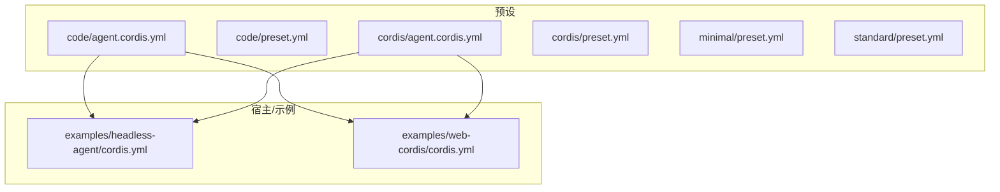
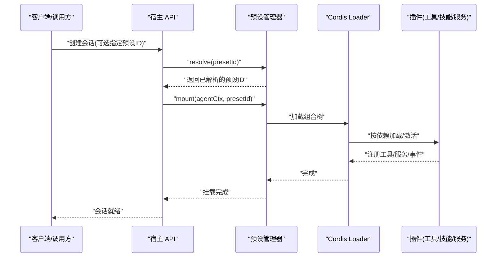
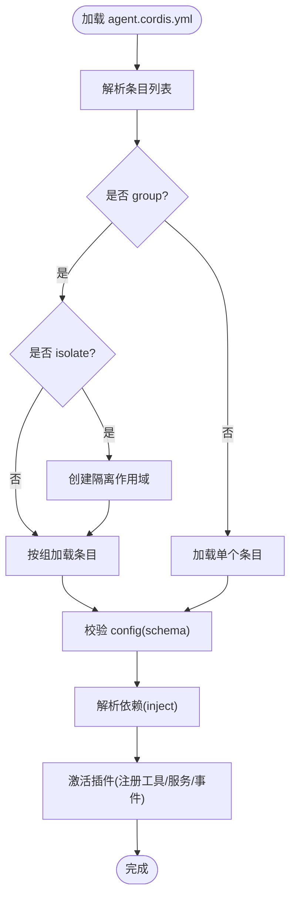
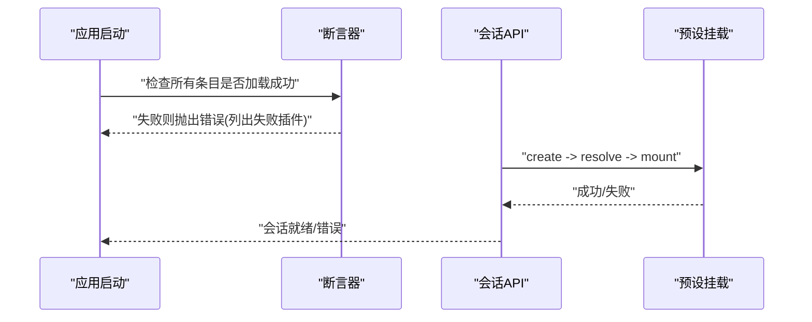

# 预设开发工作流

<cite>
**本文引用的文件**
- [apps/cli/config/agent-presets/code/agent.cordis.yml](file://apps/cli/config/agent-presets/code/agent.cordis.yml)
- [apps/cli/config/agent-presets/code/preset.yml](file://apps/cli/config/agent-presets/code/preset.yml)
- [apps/cli/config/agent-presets/cordis/agent.cordis.yml](file://apps/cli/config/agent-presets/cordis/agent.cordis.yml)
- [apps/cli/config/agent-presets/cordis/preset.yml](file://apps/cli/config/agent-presets/cordis/preset.yml)
- [apps/cli/config/agent-presets/minimal/preset.yml](file://apps/cli/config/agent-presets/minimal/preset.yml)
- [apps/cli/config/agent-presets/standard/preset.yml](file://apps/cli/config/agent-presets/standard/preset.yml)
- [examples/headless-agent/cordis.yml](file://examples/headless-agent/cordis.yml)
- [examples/web-cordis/cordis.yml](file://examples/web-cordis/cordis.yml)
- [docs/cordis-tutorial/05-config.md](file://docs/cordis-tutorial/05-config.md)
- [docs/cordis-tutorial/06-composition-and-hmr.zh.md](file://docs/cordis-tutorial/06-composition-and-hmr.zh.md)
- [packages/boot/app-boot/src/index.ts](file://packages/boot/app-boot/src/index.ts)
- [packages/host/apiproxy/src/api-proxy.ts](file://packages/host/apiproxy/src/api-proxy.ts)
- [packages/client/ui-agent-preset/src/client/section-store.ts](file://packages/client/ui-agent-preset/src/client/section-store.ts)
- [scripts/dev-web.ts](file://scripts/dev-web.ts)
- [apps/cli/src/bin.ts](file://apps/cli/src/bin.ts)
</cite>

## 目录
1. [简介](#简介)
2. [项目结构](#项目结构)
3. [核心组件](#核心组件)
4. [架构总览](#架构总览)
5. [详细组件分析](#详细组件分析)
6. [依赖关系分析](#依赖关系分析)
7. [性能考虑](#性能考虑)
8. [故障排查指南](#故障排查指南)
9. [结论](#结论)
10. [附录](#附录)

## 简介
本指南面向希望从零开始创建自定义 Agent 预设的开发者，覆盖从项目初始化、目录结构设置、基础配置到热重载与调试的全流程。重点说明：
- cordis.yml 的结构与必需字段
- preset.yml 的配置选项与最佳实践
- 开发环境与工具链（HMR）
- 预设加载问题的诊断方法
- 高效预设开发工作流建议

## 项目结构
仓库中内置了多个参考预设，位于 apps/cli/config/agent-presets 下，每个预设包含：
- agent.cordis.yml：定义该预设挂载的插件行（工具、技能、计划模式、压缩、子代理与工作流等）
- preset.yml：对外展示的元数据（名称、描述、排序）

此外，examples 目录下提供了最小可运行的 headless 与 web 组合示例，便于理解宿主层如何装配能力。

图表来源
- [apps/cli/config/agent-presets/code/agent.cordis.yml:1-263](file://apps/cli/config/agent-presets/code/agent.cordis.yml#L1-L263)
- [apps/cli/config/agent-presets/cordis/agent.cordis.yml:1-263](file://apps/cli/config/agent-presets/cordis/agent.cordis.yml#L1-L263)
- [examples/headless-agent/cordis.yml:1-166](file://examples/headless-agent/cordis.yml#L1-L166)
- [examples/web-cordis/cordis.yml:1-20](file://examples/web-cordis/cordis.yml#L1-L20)

章节来源
- [apps/cli/config/agent-presets/code/agent.cordis.yml:1-263](file://apps/cli/config/agent-presets/code/agent.cordis.yml#L1-L263)
- [apps/cli/config/agent-presets/cordis/agent.cordis.yml:1-263](file://apps/cli/config/agent-presets/cordis/agent.cordis.yml#L1-L263)
- [examples/headless-agent/cordis.yml:1-166](file://examples/headless-agent/cordis.yml#L1-L166)
- [examples/web-cordis/cordis.yml:1-20](file://examples/web-cordis/cordis.yml#L1-L20)

## 核心组件
- 预设清单（preset.yml）
  - name：预设显示名称
  - description：预设功能描述
  - order：在 UI 中的排序权重
  这些字段由宿主侧读取并展示，用于用户选择与排序。

- 预设组合（agent.cordis.yml）
  - 以数组形式声明“条目”（entry），每个条目通过 id/name/config/disabled/group/isolate 等元数据控制行为
  - 典型条目包括：persona、工具（bash/pwsh/fs/search/jobs/skill/workflow/subagent 等）、计划模式、压缩、Web 工具、代码呈现等
  - 使用 group + isolate 将服务实例隔离到会话级或组级，避免跨会话污染

- 宿主装配（示例）
  - examples/headless-agent/cordis.yml：演示最小化宿主装配（设置、凭据、LLM、子进程、持久化、压缩、子代理、工作流、工具等）
  - examples/web-cordis/cordis.yml：演示 Web 补丁叠加，启用 Cordis 自修改能力

章节来源
- [apps/cli/config/agent-presets/code/preset.yml:1-4](file://apps/cli/config/agent-presets/code/preset.yml#L1-L4)
- [apps/cli/config/agent-presets/cordis/preset.yml:1-4](file://apps/cli/config/agent-presets/cordis/preset.yml#L1-L4)
- [apps/cli/config/agent-presets/minimal/preset.yml:1-4](file://apps/cli/config/agent-presets/minimal/preset.yml#L1-L4)
- [apps/cli/config/agent-presets/standard/preset.yml:1-4](file://apps/cli/config/agent-presets/standard/preset.yml#L1-L4)
- [apps/cli/config/agent-presets/code/agent.cordis.yml:1-263](file://apps/cli/config/agent-presets/code/agent.cordis.yml#L1-L263)
- [apps/cli/config/agent-presets/cordis/agent.cordis.yml:1-263](file://apps/cli/config/agent-presets/cordis/agent.cordis.yml#L1-L263)
- [examples/headless-agent/cordis.yml:1-166](file://examples/headless-agent/cordis.yml#L1-L166)
- [examples/web-cordis/cordis.yml:1-20](file://examples/web-cordis/cordis.yml#L1-L20)

## 架构总览
预设加载与装配的关键路径：
- 宿主 API 在创建会话前解析预设 ID，并在会话 setup 阶段安装并挂载预设
- 预设装载时，Cordis Loader 按依赖顺序加载插件；HMR 可在保存时卸载旧实例并重新加载新实例
- 若存在未满足的 inject 依赖，插件会处于 PENDING 状态，需通过诊断手段定位缺失提供方

图表来源
- [packages/host/apiproxy/src/api-proxy.ts:1211-1247](file://packages/host/apiproxy/src/api-proxy.ts#L1211-L1247)
- [docs/cordis-tutorial/06-composition-and-hmr.zh.md:23-59](file://docs/cordis-tutorial/06-composition-and-hmr.zh.md#L23-L59)

章节来源
- [packages/host/apiproxy/src/api-proxy.ts:1211-1247](file://packages/host/apiproxy/src/api-proxy.ts#L1211-L1247)
- [docs/cordis-tutorial/06-composition-and-hmr.zh.md:23-59](file://docs/cordis-tutorial/06-composition-and-hmr.zh.md#L23-L59)

## 详细组件分析

### 预设清单 preset.yml
- 字段
  - name：预设名称（用于 UI 展示）
  - description：预设描述（用于 UI 展示）
  - order：排序权重（数字越小越靠前）
- 最佳实践
  - 保持简短明确，突出能力边界
  - 合理设置 order，使常用预设优先
  - 与 agent.cordis.yml 保持一致的能力范围，避免误导

章节来源
- [apps/cli/config/agent-presets/standard/preset.yml:1-4](file://apps/cli/config/agent-presets/standard/preset.yml#L1-L4)
- [apps/cli/config/agent-presets/code/preset.yml:1-4](file://apps/cli/config/agent-presets/code/preset.yml#L1-L4)
- [apps/cli/config/agent-presets/minimal/preset.yml:1-4](file://apps/cli/config/agent-presets/minimal/preset.yml#L1-L4)
- [apps/cli/config/agent-presets/cordis/preset.yml:1-4](file://apps/cli/config/agent-presets/cordis/preset.yml#L1-L4)

### 预设组合 agent.cordis.yml
- 条目元数据
  - id：稳定标识，便于 HMR 精确识别变更
  - name：模块名或相对路径
  - config：插件配置块（受 schema 校验）
  - disabled：跳过挂载但保留条目
  - group/isolate：分组与隔离，控制服务实例生命周期与作用域
- 常见能力
  - persona/agent-instructions：设定角色与指令
  - shell 工具：bash/pwsh（按平台禁用/启用）
  - filesystem：fs/fs-search
  - background jobs：jobs
  - skills：skill-filesystem/tool-skill
  - goals：tool-goal
  - plan mode：计划模式
  - compaction：压缩与结果裁剪
  - delegation/workflows：子代理与工作流
  - tool-web/tool-ask-user/tool-todo 等模型可见工具
  - code presentation：Code Mode 呈现

图表来源
- [apps/cli/config/agent-presets/code/agent.cordis.yml:1-263](file://apps/cli/config/agent-presets/code/agent.cordis.yml#L1-L263)
- [apps/cli/config/agent-presets/cordis/agent.cordis.yml:1-263](file://apps/cli/config/agent-presets/cordis/agent.cordis.yml#L1-L263)
- [docs/cordis-tutorial/05-config.md:1-66](file://docs/cordis-tutorial/05-config.md#L1-L66)

章节来源
- [apps/cli/config/agent-presets/code/agent.cordis.yml:1-263](file://apps/cli/config/agent-presets/code/agent.cordis.yml#L1-L263)
- [apps/cli/config/agent-presets/cordis/agent.cordis.yml:1-263](file://apps/cli/config/agent-presets/cordis/agent.cordis.yml#L1-L263)
- [docs/cordis-tutorial/05-config.md:1-66](file://docs/cordis-tutorial/05-config.md#L1-L66)

### 宿主装配与示例
- headless-agent/cordis.yml：展示了完整的宿主装配流程，包括设置、凭据、LLM、子进程、持久化、压缩、子代理、工作流、工具等
- web-cordis/cordis.yml：演示如何通过 patch overlay 为 Web 组合注入 Cordis 自修改能力

章节来源
- [examples/headless-agent/cordis.yml:1-166](file://examples/headless-agent/cordis.yml#L1-L166)
- [examples/web-cordis/cordis.yml:1-20](file://examples/web-cordis/cordis.yml#L1-L20)

### 预设加载与错误处理
- 启动后断言：若存在无法加载且未禁用的条目，会抛出错误并列出失败插件
- 会话创建：API 在创建会话前解析预设，setup 阶段挂载；失败会回滚，避免半安装状态
- 前端展示：UI 对损坏预设进行隐藏/禁用，并提供打开目录等操作

图表来源
- [packages/boot/app-boot/src/index.ts:651-663](file://packages/boot/app-boot/src/index.ts#L651-L663)
- [packages/host/apiproxy/src/api-proxy.ts:1211-1247](file://packages/host/apiproxy/src/api-proxy.ts#L1211-L1247)
- [packages/client/ui-agent-preset/src/client/section-store.ts:279-307](file://packages/client/ui-agent-preset/src/client/section-store.ts#L279-L307)

章节来源
- [packages/boot/app-boot/src/index.ts:651-663](file://packages/boot/app-boot/src/index.ts#L651-L663)
- [packages/host/apiproxy/src/api-proxy.ts:1211-1247](file://packages/host/apiproxy/src/api-proxy.ts#L1211-L1247)
- [packages/client/ui-agent-preset/src/client/section-store.ts:279-307](file://packages/client/ui-agent-preset/src/client/section-store.ts#L279-L307)

## 依赖关系分析
- 预设与宿主解耦：预设只负责自身会话范围内的能力装配；宿主负责全局注册表、沙箱、审批栈、持久化、模型路由等
- 依赖驱动加载：插件通过 inject 声明所需服务；缺少提供方会导致 PENDING
- HMR 依赖：HMR 需要 logger 与 timer 支持，否则日志不可见或去抖失效

图表来源
- [docs/cordis-tutorial/06-composition-and-hmr.zh.md:23-59](file://docs/cordis-tutorial/06-composition-and-hmr.zh.md#L23-L59)
- [apps/cli/config/agent-presets/code/agent.cordis.yml:1-263](file://apps/cli/config/agent-presets/code/agent.cordis.yml#L1-L263)

章节来源
- [docs/cordis-tutorial/06-composition-and-hmr.zh.md:23-59](file://docs/cordis-tutorial/06-composition-and-hmr.zh.md#L23-L59)
- [apps/cli/config/agent-presets/code/agent.cordis.yml:1-263](file://apps/cli/config/agent-presets/code/agent.cordis.yml#L1-L263)

## 性能考虑
- 合理使用 group 与 isolate：将仅属于某会话或某组的资源隔离，避免跨会话共享导致的冲突与内存泄漏
- 谨慎启用后台任务与工作流：根据场景选择 continuable/one-shot，限制最大深度与轮次
- 压缩阈值与保留比例：根据上下文窗口与成本调整压缩策略，减少不必要的数据传输与存储

[本节提供通用指导，不直接分析具体文件]

## 故障排查指南
- 插件始终 PENDING
  - 检查是否存在未提供的 inject 依赖
  - 使用诊断脚本枚举 FiberState.PENDING 的插件，定位缺失提供方
- 配置校验失败
  - 查看 config 块的 schema 校验错误信息，修正类型或必填字段
- 预设无法加载
  - 启动断言会列出失败的插件名称，结合日志定位模块解析或依赖问题
- 前端无法操作损坏预设
  - 通过“打开目录”快速定位并修复源文件

章节来源
- [docs/cordis-tutorial/06-composition-and-hmr.zh.md:61-110](file://docs/cordis-tutorial/06-composition-and-hmr.zh.md#L61-L110)
- [docs/cordis-tutorial/05-config.md:53-66](file://docs/cordis-tutorial/05-config.md#L53-L66)
- [packages/boot/app-boot/src/index.ts:651-663](file://packages/boot/app-boot/src/index.ts#L651-L663)
- [packages/client/ui-agent-preset/src/client/section-store.ts:279-307](file://packages/client/ui-agent-preset/src/client/section-store.ts#L279-L307)

## 结论
通过遵循 preset.yml 的元数据约定与 agent.cordis.yml 的组合规范，配合宿主提供的加载、HMR 与诊断能力，可以高效地构建、迭代与调试自定义 Agent 预设。建议在开发过程中：
- 显式声明 id，确保 HMR 精准更新
- 使用 group/isolate 管理作用域与生命周期
- 利用示例工程快速验证宿主装配
- 借助诊断与前端工具快速定位问题

[本节总结性内容，不直接分析具体文件]

## 附录

### 从零开始创建自定义预设的步骤
- 初始化项目
  - 在宿主环境中准备一个独立的预设目录（例如 ~/.dsh/.agent-presets/<id>/）
  - 在该目录下创建 agent.cordis.yml 与 preset.yml
- 设置目录结构与基础配置
  - preset.yml：填写 name/description/order
  - agent.cordis.yml：从 minimal 或 standard 复制基础条目，按需增减
- 配置与调试
  - 使用宿主的 CLI 运行会话，选择你的预设
  - 开启 HMR 观察变更并热重载
  - 遇到加载问题，使用诊断手段定位 PENDING 或缺失依赖

章节来源
- [apps/cli/config/agent-presets/minimal/preset.yml:1-4](file://apps/cli/config/agent-presets/minimal/preset.yml#L1-L4)
- [apps/cli/config/agent-presets/standard/preset.yml:1-4](file://apps/cli/config/agent-presets/standard/preset.yml#L1-L4)
- [examples/headless-agent/cordis.yml:1-166](file://examples/headless-agent/cordis.yml#L1-L166)

### cordis.yml 结构与必需字段
- 根节点：数组形式的条目列表
- 条目字段
  - id：稳定标识（推荐）
  - name：模块名或相对路径
  - config：插件配置（受 schema 校验）
  - disabled：跳过挂载
  - group/isolate：分组与隔离
- 校验与错误
  - 配置错误会在加载时报错，不会启动不完整插件

章节来源
- [docs/cordis-tutorial/05-config.md:1-66](file://docs/cordis-tutorial/05-config.md#L1-L66)
- [apps/cli/config/agent-presets/code/agent.cordis.yml:1-263](file://apps/cli/config/agent-presets/code/agent.cordis.yml#L1-L263)

### preset.yml 配置选项与最佳实践
- 字段
  - name：预设名称
  - description：预设描述
  - order：排序权重
- 最佳实践
  - 名称与描述清晰表达能力边界
  - 合理设置 order，常用预设靠前
  - 与组合文件保持一致，避免能力与描述不符

章节来源
- [apps/cli/config/agent-presets/standard/preset.yml:1-4](file://apps/cli/config/agent-presets/standard/preset.yml#L1-L4)
- [apps/cli/config/agent-presets/code/preset.yml:1-4](file://apps/cli/config/agent-presets/code/preset.yml#L1-L4)
- [apps/cli/config/agent-presets/minimal/preset.yml:1-4](file://apps/cli/config/agent-presets/minimal/preset.yml#L1-L4)
- [apps/cli/config/agent-presets/cordis/preset.yml:1-4](file://apps/cli/config/agent-presets/cordis/preset.yml#L1-L4)

### 开发环境与工具链设置
- 运行入口
  - CLI 入口负责分发不同模式（profile/plugin/dump-config）
- 客户端插件热构建
  - dev-web 脚本监听 dsh.client 包变化并重建，触发宿主刷新
- 预设内 HMR
  - 在 Cordis 组合中加入 HMR 插件，监视 root 目录并在保存时重载

章节来源
- [apps/cli/src/bin.ts:1-54](file://apps/cli/src/bin.ts#L1-L54)
- [scripts/dev-web.ts:1-114](file://scripts/dev-web.ts#L1-L114)
- [docs/cordis-tutorial/06-composition-and-hmr.zh.md:23-59](file://docs/cordis-tutorial/06-composition-and-hmr.zh.md#L23-L59)

### 热重载（HMR）配置与使用
- 在组合中添加 HMR 插件，并配置 root 目录
- 使用 tsx 运行 Cordis 以便 HMR 正常工作
- 编辑源码或组合文件后，HMR 会卸载旧实例并加载新实例，apply 再次执行

章节来源
- [docs/cordis-tutorial/06-composition-and-hmr.zh.md:23-59](file://docs/cordis-tutorial/06-composition-and-hmr.zh.md#L23-L59)

### 调试与诊断预设加载问题
- 检查 PENDING 插件：枚举 FiberState.PENDING 的 fiber，定位缺失服务
- 查看启动断言：列出未能加载的插件名称
- 前端操作：通过“打开目录”快速定位并修复源文件

章节来源
- [docs/cordis-tutorial/06-composition-and-hmr.zh.md:61-110](file://docs/cordis-tutorial/06-composition-and-hmr.zh.md#L61-L110)
- [packages/boot/app-boot/src/index.ts:651-663](file://packages/boot/app-boot/src/index.ts#L651-L663)
- [packages/client/ui-agent-preset/src/client/section-store.ts:279-307](file://packages/client/ui-agent-preset/src/client/section-store.ts#L279-L307)

### 建立高效的预设开发工作流
- 基于标准/极简预设起步，逐步添加能力
- 显式 id 与合理 group/isolate，确保 HMR 与隔离正确
- 使用示例工程验证宿主装配
- 频繁保存触发 HMR，快速反馈
- 遇到问题先查 PENDING 与配置校验错误，再定位依赖与 schema

[本节提供通用工作流建议，不直接分析具体文件]