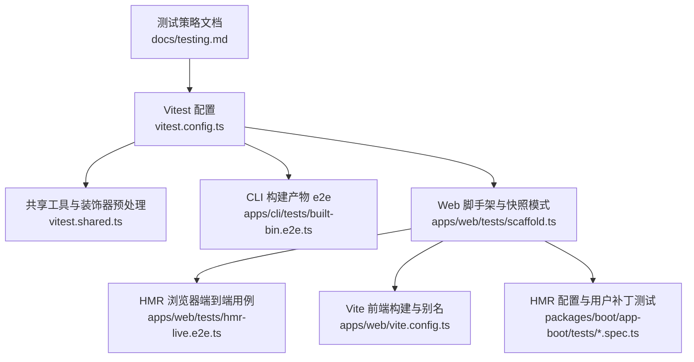
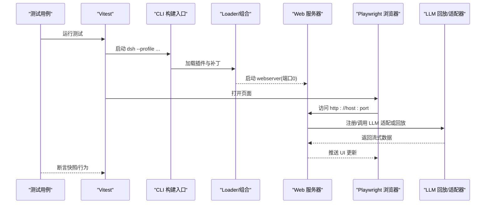
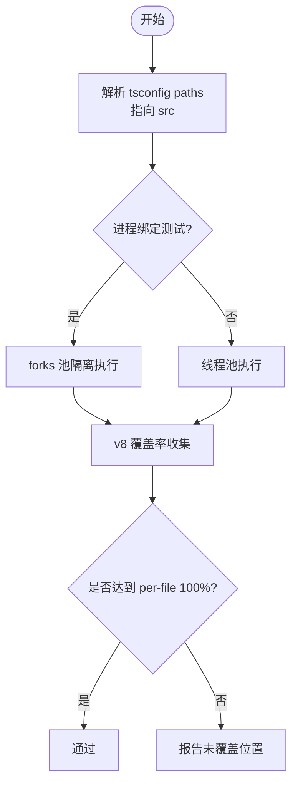
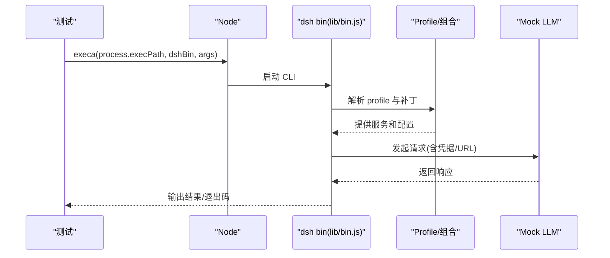
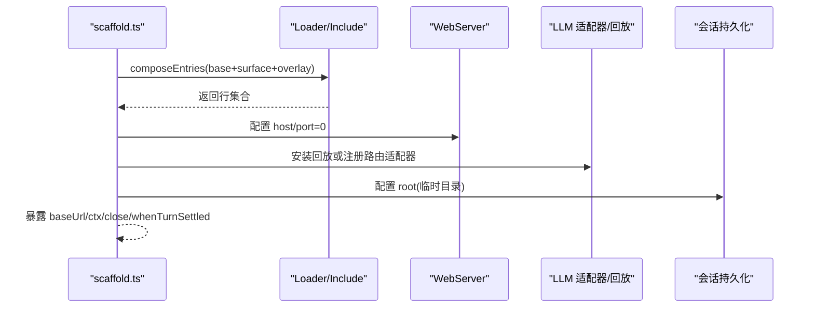
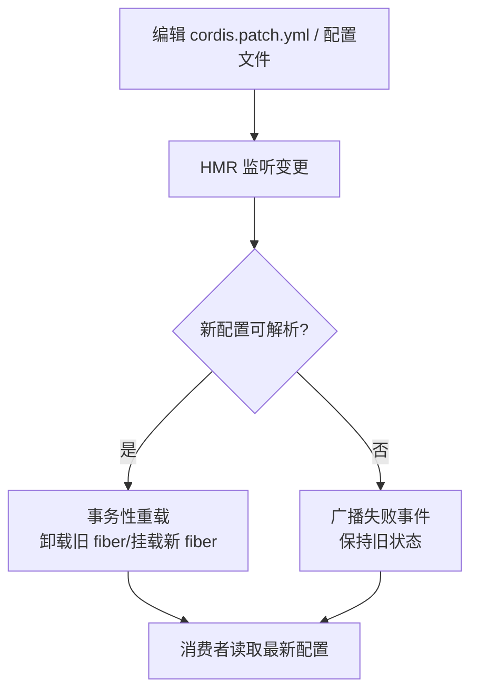
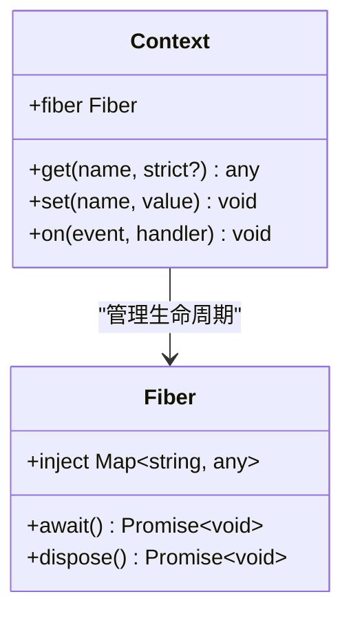
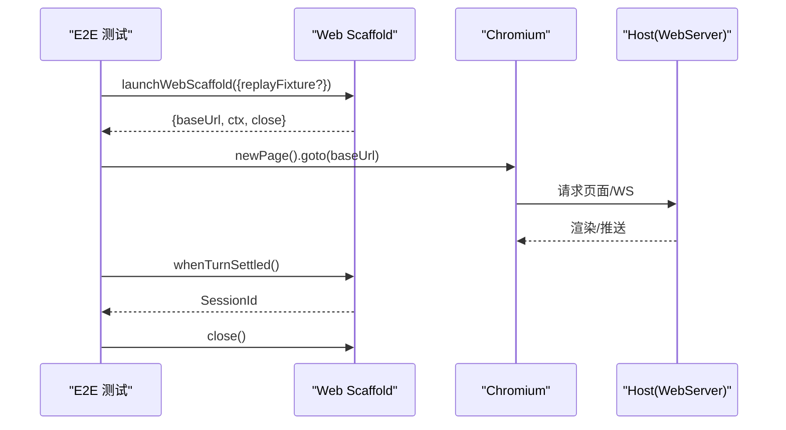
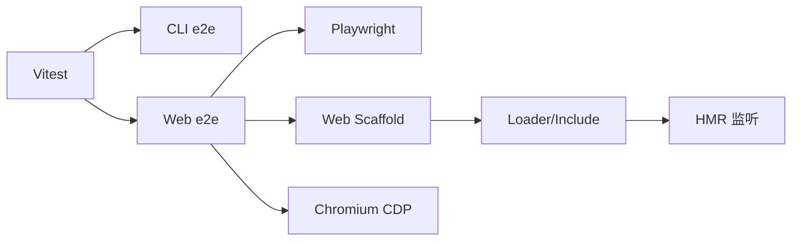

# 预设测试与调试

<cite>
**本文引用的文件**
- [apps/cli/tests/built-bin.e2e.ts](file://apps/cli/tests/built-bin.e2e.ts)
- [apps/web/tests/scaffold.ts](file://apps/web/tests/scaffold.ts)
- [apps/web/tests/hmr-live.e2e.ts](file://apps/web/tests/hmr-live.e2e.ts)
- [apps/web/vite.config.ts](file://apps/web/vite.config.ts)
- [vitest.config.ts](file://vitest.config.ts)
- [vitest.shared.ts](file://vitest.shared.ts)
- [docs/testing.md](file://docs/testing.md)
- [packages/boot/app-boot/tests/user-patches.spec.ts](file://packages/boot/app-boot/tests/user-patches.spec.ts)
- [packages/boot/app-boot/tests/hmr-config.spec.ts](file://packages/boot/app-boot/tests/hmr-config.spec.ts)
- [docs/cordis-api/inherited.md](file://docs/cordis-api/inherited.md)
- [docs/cordis-api/context.md](file://docs/cordis-api/context.md)
- [docs/cordis-api/registry.md](file://docs/cordis-api/registry.md)
- [apps/web/tests/complex-history.perf.ts](file://apps/web/tests/complex-history.perf.ts)
</cite>

## 目录
1. [简介](#简介)
2. [项目结构](#项目结构)
3. [核心组件](#核心组件)
4. [架构总览](#架构总览)
5. [详细组件分析](#详细组件分析)
6. [依赖关系分析](#依赖关系分析)
7. [性能考虑](#性能考虑)
8. [故障排查指南](#故障排查指南)
9. [结论](#结论)
10. [附录](#附录)

## 简介
本指南面向使用 Cordis 的插件与预设开发者，聚焦“如何编写、运行和调试预设相关的单元测试、端到端测试与快照测试”，并给出 HMR（热重载）调试技巧、Cordis 诊断方法、常见问题定位以及性能分析与内存泄漏检测的实践。目标是帮助你在保证质量的前提下快速迭代预设组合与服务依赖。

## 项目结构
仓库采用多包与工作区组织，测试覆盖多个层级：
- 单元测试：基于 Vitest，位于各包的 tests 目录，强调边缘路径、事件顺序、并发竞态与契约回归。
- 构建产物 e2e：通过 Node 直接执行已构建的 CLI 入口，验证真实装配行为。
- Web 浏览器 e2e：基于 Playwright + 真实 web 装配，支持 replay/record/refresh 三种快照模式。
- HMR 相关：用户补丁与配置变更的热重载、客户端插件无刷新更新。
- 性能基准：在 Chromium 中采集指标，评估渲染与内存占用。

**图表来源**
- [docs/testing.md:1-50](file://docs/testing.md#L1-L50)
- [vitest.config.ts:1-286](file://vitest.config.ts#L1-L286)
- [vitest.shared.ts:1-43](file://vitest.shared.ts#L1-L43)
- [apps/cli/tests/built-bin.e2e.ts:1-764](file://apps/cli/tests/built-bin.e2e.ts#L1-L764)
- [apps/web/tests/scaffold.ts:1-800](file://apps/web/tests/scaffold.ts#L1-L800)
- [apps/web/tests/hmr-live.e2e.ts:1-133](file://apps/web/tests/hmr-live.e2e.ts#L1-L133)
- [apps/web/vite.config.ts:1-161](file://apps/web/vite.config.ts#L1-L161)
- [packages/boot/app-boot/tests/user-patches.spec.ts:315-341](file://packages/boot/app-boot/tests/user-patches.spec.ts#L315-L341)
- [packages/boot/app-boot/tests/hmr-config.spec.ts:101-128](file://packages/boot/app-boot/tests/hmr-config.spec.ts#L101-L128)

**章节来源**
- [docs/testing.md:1-50](file://docs/testing.md#L1-L50)
- [vitest.config.ts:1-286](file://vitest.config.ts#L1-L286)

## 核心组件
- 测试分层与策略
  - 单元、覆盖率门控、带密钥 e2e、快照、Web 浏览器快照等分层清晰，命令与规则在根文档中定义。
- Vitest 工程化
  - 统一路径解析、进程隔离、覆盖率阈值、平台差异处理、重型套件豁免。
- CLI 构建产物验收
  - 直接调用 lib/bin.js，验证参数路由、profile 生命周期、错误提示、头信息输出、热重载影响等。
- Web 端到端脚手架
  - 启动真实 web 装配，注入会话持久化、服务、回放适配器、设置与凭据等；支持 replay/record/refresh。
- HMR 与用户补丁
  - 监听 cordis.patch.yml 与配置文件变更，事务性重载，失败回滚与恢复。
- 性能与内存
  - 通过 CDP 获取 Chromium 指标，统计节点数、事件监听器数量、堆大小变化，辅助发现泄漏。

**章节来源**
- [docs/testing.md:1-50](file://docs/testing.md#L1-L50)
- [vitest.config.ts:1-286](file://vitest.config.ts#L1-L286)
- [apps/cli/tests/built-bin.e2e.ts:1-764](file://apps/cli/tests/built-bin.e2e.ts#L1-L764)
- [apps/web/tests/scaffold.ts:1-800](file://apps/web/tests/scaffold.ts#L1-L800)
- [packages/boot/app-boot/tests/user-patches.spec.ts:315-341](file://packages/boot/app-boot/tests/user-patches.spec.ts#L315-L341)
- [packages/boot/app-boot/tests/hmr-config.spec.ts:101-128](file://packages/boot/app-boot/tests/hmr-config.spec.ts#L101-L128)
- [apps/web/tests/complex-history.perf.ts:515-542](file://apps/web/tests/complex-history.perf.ts#L515-L542)

## 架构总览
下图展示了从测试驱动到应用装配、HMR 与回放的关键交互。

**图表来源**
- [apps/cli/tests/built-bin.e2e.ts:1-764](file://apps/cli/tests/built-bin.e2e.ts#L1-L764)
- [apps/web/tests/scaffold.ts:1-800](file://apps/web/tests/scaffold.ts#L1-L800)
- [apps/web/tests/hmr-live.e2e.ts:1-133](file://apps/web/tests/hmr-live.e2e.ts#L1-L133)

## 详细组件分析

### 单元测试与覆盖率门控
- 目标
  - 每个包内 tests/** 下的 spec 由 Vitest 执行；覆盖率要求 per-file 100%，用于识别死代码与未覆盖分支。
- 关键机制
  - 路径解析指向 src，避免加载二次单例；进程绑定测试分离执行；Windows 平台排除不支持的套件；pwsh 缺失时豁免特定文件。
- 实践建议
  - 优先覆盖边缘路径、错误分支、事件顺序与并发竞态；对契约回归使用永久测试。

**图表来源**
- [vitest.config.ts:1-286](file://vitest.config.ts#L1-L286)
- [vitest.shared.ts:1-43](file://vitest.shared.ts#L1-L43)

**章节来源**
- [vitest.config.ts:1-286](file://vitest.config.ts#L1-L286)
- [vitest.shared.ts:1-43](file://vitest.shared.ts#L1-L43)
- [docs/testing.md:1-50](file://docs/testing.md#L1-L50)

### CLI 构建产物端到端测试
- 目标
  - 以 Node 直接执行 lib/bin.js，验证参数路由、profile 生命周期、错误提示、热重载影响、配置转储等。
- 要点
  - 通过临时 home/workspace 隔离环境；模拟 LLM 服务端；校验退出码、stdout/stderr；验证信号处理与 dispose。
- 典型场景
  - 缺少 profile 的错误提示；headless 流程调用 mock LLM；patch 叠加顺序；用户层 patch 热重载生效与回退。

**图表来源**
- [apps/cli/tests/built-bin.e2e.ts:1-764](file://apps/cli/tests/built-bin.e2e.ts#L1-L764)

**章节来源**
- [apps/cli/tests/built-bin.e2e.ts:1-764](file://apps/cli/tests/built-bin.e2e.ts#L1-L764)

### Web 端到端脚手架与快照模式
- 目标
  - 启动真实 web 装配，注入会话持久化、技能发现、设置与凭据、webserver、回放适配器等；支持 replay/record/refresh。
- 能力
  - 通过 include patches 组装与 shipped bundles 一致的树；为 keyless 场景禁用 llm-deepseek 并注入 RouteOnlyAdapter；记录模式需密钥。
  - 提供 whenTurnSettled、seedSession、recordFixture、realizeSeedFixture 等工具。
- 使用方式
  - launchWebScaffold(options) 启动；close() 清理并校验回放消费；通过 DSH_SNAPSHOT 切换模式。

**图表来源**
- [apps/web/tests/scaffold.ts:1-800](file://apps/web/tests/scaffold.ts#L1-L800)

**章节来源**
- [apps/web/tests/scaffold.ts:1-800](file://apps/web/tests/scaffold.ts#L1-L800)

### HMR 配置与热重载调试
- 用户补丁与配置热重载
  - 监听 cordis.patch.yml 与配置文件变更，事务性重载；失败时广播 hmr/config-update-failed 并保持旧值；恢复后重新应用。
- 客户端插件无刷新更新
  - 通过 dev:web 与 dsh web 配合，修改源码后浏览器无刷新更新，保持页面身份不变。
- Vite 角色
  - 阻止独立 serve；配置 vendor chunk、资源分组与别名，确保 CSS 走 Vite 管线。

**图表来源**
- [packages/boot/app-boot/tests/user-patches.spec.ts:315-341](file://packages/boot/app-boot/tests/user-patches.spec.ts#L315-L341)
- [packages/boot/app-boot/tests/hmr-config.spec.ts:101-128](file://packages/boot/app-boot/tests/hmr-config.spec.ts#L101-L128)
- [apps/web/tests/hmr-live.e2e.ts:1-133](file://apps/web/tests/hmr-live.e2e.ts#L1-L133)
- [apps/web/vite.config.ts:1-161](file://apps/web/vite.config.ts#L1-L161)

**章节来源**
- [packages/boot/app-boot/tests/user-patches.spec.ts:315-341](file://packages/boot/app-boot/tests/user-patches.spec.ts#L315-L341)
- [packages/boot/app-boot/tests/hmr-config.spec.ts:101-128](file://packages/boot/app-boot/tests/hmr-config.spec.ts#L101-L128)
- [apps/web/tests/hmr-live.e2e.ts:1-133](file://apps/web/tests/hmr-live.e2e.ts#L1-L133)
- [apps/web/vite.config.ts:1-161](file://apps/web/vite.config.ts#L1-L161)

### 使用 Cordis 的诊断工具检查插件状态与服务依赖
- 事件总线
  - 订阅 internal/status、internal/plugin、hmr/change、hmr/reload、loader/config-update 等事件，观察 fiber 生命周期与重载过程。
- 服务查询
  - 使用 ctx.get(name, strict?) 读取服务，strict=true 仅返回当前活跃 fiber 提供的实现；ctx.set 可替换已提供的服务值。
- 依赖声明
  - inject 数组或对象形式声明所需服务；Cordis 会等待依赖就绪再运行 apply；依赖消失时消费方也会卸载并在恢复后重启。

**图表来源**
- [docs/cordis-api/context.md:235-284](file://docs/cordis-api/context.md#L235-L284)
- [docs/cordis-api/registry.md:121-153](file://docs/cordis-api/registry.md#L121-L153)
- [docs/cordis-api/inherited.md:23-40](file://docs/cordis-api/inherited.md#L23-L40)

**章节来源**
- [docs/cordis-api/inherited.md:23-40](file://docs/cordis-api/inherited.md#L23-L40)
- [docs/cordis-api/context.md:235-284](file://docs/cordis-api/context.md#L235-L284)
- [docs/cordis-api/registry.md:121-153](file://docs/cordis-api/registry.md#L121-L153)

### 端到端测试编写与执行
- CLI 构建产物 e2e
  - 通过 execa 启动 lib/bin.js，构造临时 home/workspace，注入环境变量与凭据，断言退出码与输出。
- Web 浏览器 e2e
  - 使用 scaffold.launchWebScaffold 启动真实装配，选择 replay/record/refresh；通过 whenTurnSettled 等待回合结束；使用 seedSession 注入历史；通过 recordFixture 录制快照。
- HMR 浏览器 e2e
  - 同时启动 dev:web 与 dsh web，修改源码后断言页面文本更新且无刷新。

**图表来源**
- [apps/web/tests/scaffold.ts:1-800](file://apps/web/tests/scaffold.ts#L1-L800)
- [apps/web/tests/hmr-live.e2e.ts:1-133](file://apps/web/tests/hmr-live.e2e.ts#L1-L133)

**章节来源**
- [apps/cli/tests/built-bin.e2e.ts:1-764](file://apps/cli/tests/built-bin.e2e.ts#L1-L764)
- [apps/web/tests/scaffold.ts:1-800](file://apps/web/tests/scaffold.ts#L1-L800)
- [apps/web/tests/hmr-live.e2e.ts:1-133](file://apps/web/tests/hmr-live.e2e.ts#L1-L133)

## 依赖关系分析
- 测试框架与工具链
  - Vitest 作为统一入口，结合 vite-tsconfig-paths 解析 src；共享装饰器预处理；按平台与进程特性调整执行策略。
- 应用装配与插件系统
  - Loader/Include/Group 负责组合；HMR 监听配置与补丁变更；Web 装配通过 include patches 注入必要服务。
- 外部集成
  - Playwright 控制浏览器；CDP 采集性能指标；mock LLM 或回放适配器替代真实模型调用。

**图表来源**
- [vitest.config.ts:1-286](file://vitest.config.ts#L1-L286)
- [apps/web/tests/scaffold.ts:1-800](file://apps/web/tests/scaffold.ts#L1-L800)
- [apps/web/tests/complex-history.perf.ts:515-542](file://apps/web/tests/complex-history.perf.ts#L515-L542)

**章节来源**
- [vitest.config.ts:1-286](file://vitest.config.ts#L1-L286)
- [apps/web/tests/scaffold.ts:1-800](file://apps/web/tests/scaffold.ts#L1-L800)
- [apps/web/tests/complex-history.perf.ts:515-542](file://apps/web/tests/complex-history.perf.ts#L515-L542)

## 性能考虑
- 指标采集
  - 通过 CDP 的 Performance.getMetrics 获取 JSHeapUsedSize、Nodes、JSEventListeners 等；配合 GC 触发后测量 retained 状态。
- 关注点
  - DOM 元素数量、事件监听器增长、堆内存趋势；长会话与高基数历史渲染时的增量开销。
- 实践
  - 在复杂历史场景中记录 baseline 与 delta；避免在回放中引入非确定性因素；必要时使用 SOAK 场景观察长期稳定性。

**章节来源**
- [apps/web/tests/complex-history.perf.ts:515-542](file://apps/web/tests/complex-history.perf.ts#L515-L542)

## 故障排查指南
- 常见症状与定位
  - 启动卡住或退出异常：检查 profile 是否存在、参数是否正确、patch 是否有效；查看 CLI stderr 与日志。
  - HMR 不生效：确认 dev:web 与 dsh web 同时运行；检查 cordis.patch.yml 语法与 id 匹配；关注 hmr/config-update-failed 事件。
  - 服务依赖未就绪：使用 ctx.get(name, strict?) 检查服务是否可用；订阅 internal/status 观察 fiber 状态。
  - 回放未消费：在 close 前调用 replayHandle.assertConsumed()；核对 fixture 与驱动步骤一致。
- 建议步骤
  - 最小化复现：剥离无关补丁与服务，逐步添加；使用临时 home/workspace 隔离；启用 DSH_TELEMETRY_DISABLED 减少噪声。
  - 利用快照：record 模式生成 session.jsonl；replay 模式回放；refresh 模式更新黄金文件并审查 diff。

**章节来源**
- [apps/cli/tests/built-bin.e2e.ts:1-764](file://apps/cli/tests/built-bin.e2e.ts#L1-L764)
- [packages/boot/app-boot/tests/user-patches.spec.ts:315-341](file://packages/boot/app-boot/tests/user-patches.spec.ts#L315-L341)
- [docs/cordis-api/inherited.md:23-40](file://docs/cordis-api/inherited.md#L23-L40)
- [apps/web/tests/scaffold.ts:1-800](file://apps/web/tests/scaffold.ts#L1-L800)

## 结论
通过分层测试策略、严格的覆盖率门控、真实的 CLI/Web 端到端验证与 HMR 调试手段，可以高效保障预设的质量与稳定性。借助 Cordis 的事件与服务 API，能够精准定位依赖与生命周期问题；结合性能指标采集，持续优化渲染与内存占用。建议在每次涉及模型、协议或用户可见行为的变更时，同步扩展快照与 e2e 场景，确保回归风险可控。

## 附录
- 常用命令
  - 单元测试与覆盖率：参考根文档中的命令说明。
  - 快照录制与回放：使用 DSH_SNAPSHOT=replay|record|refresh 切换模式。
  - HMR 调试：同时运行 dev:web 与 dsh web，修改源码后观察无刷新更新。
- 参考文件
  - 测试策略与规范：docs/testing.md
  - Vitest 配置与共享工具：vitest.config.ts、vitest.shared.ts
  - CLI 构建产物 e2e：apps/cli/tests/built-bin.e2e.ts
  - Web 脚手架与快照：apps/web/tests/scaffold.ts
  - HMR 端到端：apps/web/tests/hmr-live.e2e.ts
  - Vite 前端构建：apps/web/vite.config.ts
  - HMR 配置与用户补丁：packages/boot/app-boot/tests/*.spec.ts
  - Cordis 诊断事件与服务：docs/cordis-api/*