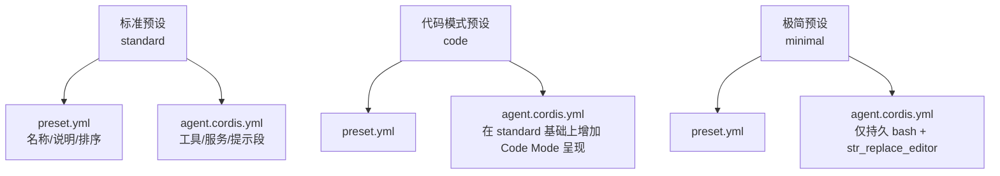
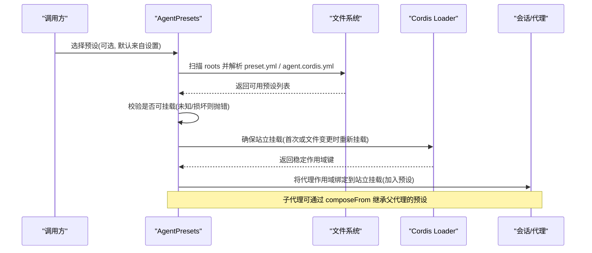
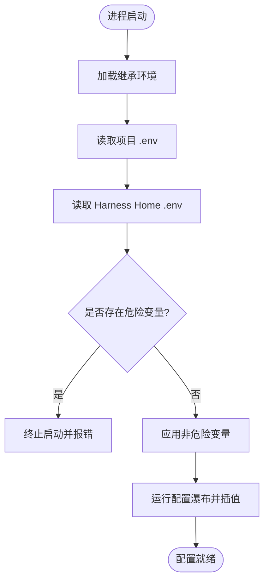
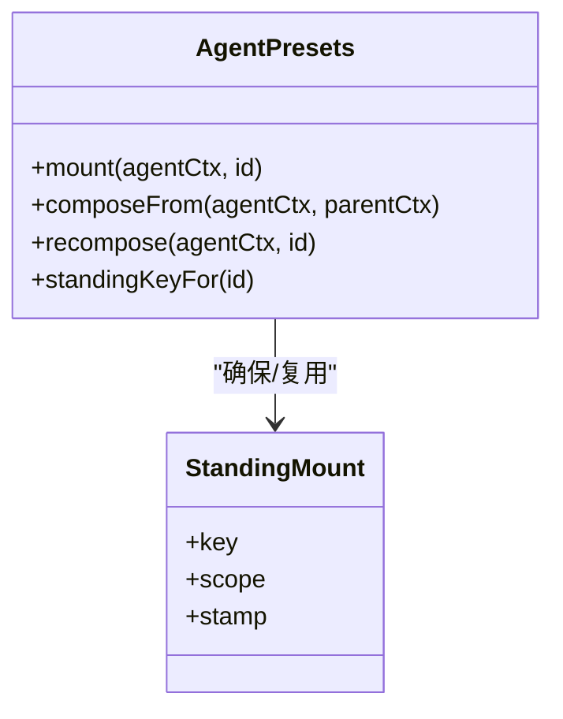
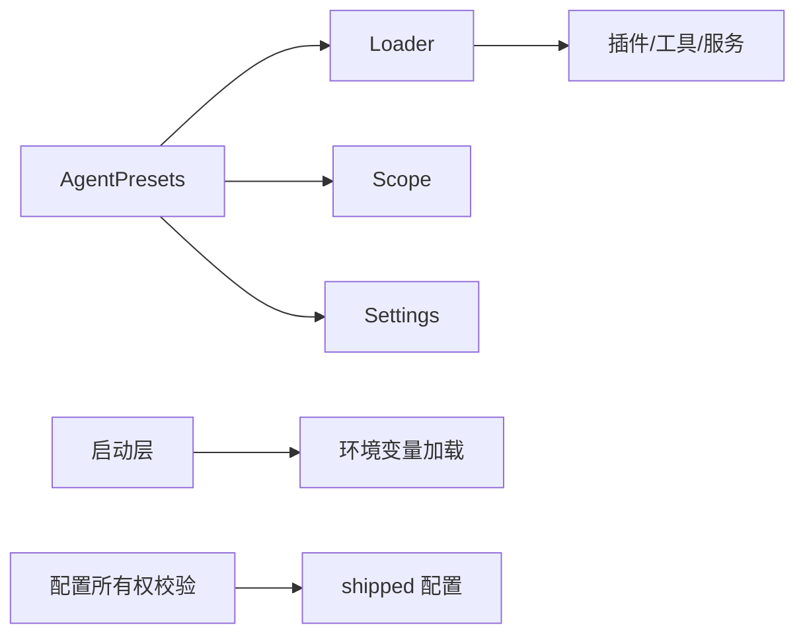

# 预设配置详解

<cite>
**本文引用的文件**
- [apps/cli/config/agent-presets/standard/preset.yml](file://apps/cli/config/agent-presets/standard/preset.yml)
- [apps/cli/config/agent-presets/code/preset.yml](file://apps/cli/config/agent-presets/code/preset.yml)
- [apps/cli/config/agent-presets/minimal/preset.yml](file://apps/cli/config/agent-presets/minimal/preset.yml)
- [apps/cli/config/agent-presets/standard/agent.cordis.yml](file://apps/cli/config/agent-presets/standard/agent.cordis.yml)
- [apps/cli/config/agent-presets/code/agent.cordis.yml](file://apps/cli/config/agent-presets/code/agent.cordis.yml)
- [apps/cli/config/agent-presets/minimal/agent.cordis.yml](file://apps/cli/config/agent-presets/minimal/agent.cordis.yml)
- [packages/preset/agent-presets/src/index.ts](file://packages/preset/agent-presets/src/index.ts)
- [packages/preset/agent-presets/src/mount.ts](file://packages/preset/agent-presets/src/mount.ts)
- [packages/preset/agent-presets/src/preset.ts](file://packages/preset/agent-presets/src/preset.ts)
- [packages/boot/app-boot/src/index.ts](file://packages/boot/app-boot/src/index.ts)
- [scripts/verify-config-source-ownership.ts](file://scripts/verify-config-source-ownership.ts)
- [docs/config-catalog.md](file://docs/config-catalog.md)
</cite>

## 目录
1. [简介](#简介)
2. [项目结构](#项目结构)
3. [核心组件](#核心组件)
4. [架构总览](#架构总览)
5. [详细组件分析](#详细组件分析)
6. [依赖关系分析](#依赖关系分析)
7. [性能考量](#性能考量)
8. [故障排查指南](#故障排查指南)
9. [结论](#结论)
10. [附录](#附录)

## 简介
本参考文档面向使用 DeepSeek Harness 的开发者，系统化说明“预设（Preset）”的配置体系与最佳实践。内容覆盖：
- preset.yml 的字段、语法与用途
- 三种内置预设（standard、code、minimal）的差异与适用场景
- 环境变量注入与条件配置的机制与限制
- 配置验证与错误处理策略
- 预设继承与覆盖机制
- 复杂配置场景的实现方案
目标是帮助开发者编写正确、可维护且安全的预设配置文件。

## 项目结构
预设由两部分组成：
- 元数据文件 preset.yml：描述预设的名称、说明与排序等展示信息
- 组合文件 agent.cordis.yml：声明该预设挂载的插件、工具、提示段与服务实例，并通过分组与隔离域控制生命周期与作用域

图表来源
- [apps/cli/config/agent-presets/standard/preset.yml:1-4](file://apps/cli/config/agent-presets/standard/preset.yml#L1-L4)
- [apps/cli/config/agent-presets/standard/agent.cordis.yml:1-252](file://apps/cli/config/agent-presets/standard/agent.cordis.yml#L1-L252)
- [apps/cli/config/agent-presets/code/preset.yml:1-4](file://apps/cli/config/agent-presets/code/preset.yml#L1-L4)
- [apps/cli/config/agent-presets/code/agent.cordis.yml:1-263](file://apps/cli/config/agent-presets/code/agent.cordis.yml#L1-L263)
- [apps/cli/config/agent-presets/minimal/preset.yml:1-4](file://apps/cli/config/agent-presets/minimal/preset.yml#L1-L4)
- [apps/cli/config/agent-presets/minimal/agent.cordis.yml:1-63](file://apps/cli/config/agent-presets/minimal/agent.cordis.yml#L1-L63)

章节来源
- [apps/cli/config/agent-presets/standard/preset.yml:1-4](file://apps/cli/config/agent-presets/standard/preset.yml#L1-L4)
- [apps/cli/config/agent-presets/code/preset.yml:1-4](file://apps/cli/config/agent-presets/code/preset.yml#L1-L4)
- [apps/cli/config/agent-presets/minimal/preset.yml:1-4](file://apps/cli/config/agent-presets/minimal/preset.yml#L1-L4)

## 核心组件
- 预设注册与发现：通过 AgentPresets 服务扫描 roots，按优先级合并 id，支持系统级与用户级信任级别
- 站立挂载（Standing Mount）：每个预设只挂载一次，多个会话通过作用域父子关系共享同一组插件实例
- 继承与加入：子代理可通过 composeFrom 继承父代理已加入的预设能力
- 写入保护：预设为输入型配置，不持久化回原文件，避免运行时被意外改写

关键行为要点
- 默认预设可由设置层覆盖；未显式选择时回退到部署默认
- 当组合文件变更时，新会话将自动切换到新的“代次”，已在运行的会话保持其代次不变
- 未知或损坏的预设在解析阶段即失败，便于快速定位问题

章节来源
- [packages/preset/agent-presets/src/index.ts:82-182](file://packages/preset/agent-presets/src/index.ts#L82-L182)
- [packages/preset/agent-presets/src/index.ts:275-338](file://packages/preset/agent-presets/src/index.ts#L275-L338)
- [packages/preset/agent-presets/src/index.ts:490-534](file://packages/preset/agent-presets/src/index.ts#L490-L534)
- [packages/preset/agent-presets/src/mount.ts:94-124](file://packages/preset/agent-presets/src/mount.ts#L94-L124)
- [packages/preset/agent-presets/src/preset.ts:20-62](file://packages/preset/agent-presets/src/preset.ts#L20-L62)

## 架构总览
下图展示了从“选择预设”到“站立挂载”再到“会话加入”的整体流程，以及环境变量的加载顺序对配置生效的影响。

图表来源
- [packages/preset/agent-presets/src/index.ts:195-239](file://packages/preset/agent-presets/src/index.ts#L195-L239)
- [packages/preset/agent-presets/src/index.ts:275-338](file://packages/preset/agent-presets/src/index.ts#L275-L338)
- [packages/preset/agent-presets/src/index.ts:490-534](file://packages/preset/agent-presets/src/index.ts#L490-L534)

## 详细组件分析

### preset.yml 字段与语法
- name：预设显示名
- description：一句话说明预设用途
- order：在同一组内的排序位置（数值越小越靠前）

这些字段用于 UI 展示与排序，不参与运行时逻辑。

章节来源
- [apps/cli/config/agent-presets/standard/preset.yml:1-4](file://apps/cli/config/agent-presets/standard/preset.yml#L1-L4)
- [apps/cli/config/agent-presets/code/preset.yml:1-4](file://apps/cli/config/agent-presets/code/preset.yml#L1-L4)
- [apps/cli/config/agent-presets/minimal/preset.yml:1-4](file://apps/cli/config/agent-presets/minimal/preset.yml#L1-L4)

### 三种预设的差异
- standard：功能完整的编码 Agent，包含 Shell、文件系统、技能、目标、计划、子代理与工作流等模型可见工具
- code：在 standard 基础上启用 Code Mode 呈现，将多步操作以 TypeScript 程序形式组合执行，减少往返次数
- minimal：仅提供持久 bash 与 str_replace_editor 两个工具，适合最小化、强约束场景

差异体现在 agent.cordis.yml 中启用的插件与呈现模式。

章节来源
- [apps/cli/config/agent-presets/standard/agent.cordis.yml:1-252](file://apps/cli/config/agent-presets/standard/agent.cordis.yml#L1-L252)
- [apps/cli/config/agent-presets/code/agent.cordis.yml:1-263](file://apps/cli/config/agent-presets/code/agent.cordis.yml#L1-L263)
- [apps/cli/config/agent-presets/minimal/agent.cordis.yml:1-63](file://apps/cli/config/agent-presets/minimal/agent.cordis.yml#L1-L63)

### 环境变量注入与条件配置
- 启动期分层加载：进程继承的环境 > 项目 .env > Harness Home .env，且会拒绝危险变量（如 PATH、HTTPS_PROXY 等）
- 配置插值时机：Loader 在 Cordis 激活前运行内部配置瀑布，随后对原始配置进行插值，表达式在目标行的 fiber 中解析
- 安全限制： shipped 配置禁止直接内联凭据或端点的环境引用，需通过适配器提供的凭据与环境快照机制获取

图表来源
- [packages/boot/app-boot/src/index.ts:166-191](file://packages/boot/app-boot/src/index.ts#L166-L191)
- [.agents/notes/implemented/architecture/2026-08-06-app-owned-command-line.md:23-31](file://.agents/notes/implemented/architecture/2026-08-06-app-owned-command-line.md#L23-L31)
- [scripts/verify-config-source-ownership.ts:25-56](file://scripts/verify-config-source-ownership.ts#L25-L56)

章节来源
- [packages/boot/app-boot/src/index.ts:166-191](file://packages/boot/app-boot/src/index.ts#L166-L191)
- [scripts/verify-config-source-ownership.ts:25-56](file://scripts/verify-config-source-ownership.ts#L25-L56)

### 配置验证与错误处理
- 预设解析阶段：若预设不存在或组合不可用，抛出明确错误（未知预设/挂载失败），便于快速修复
- JSON Schema 校验：插件配置受严格子集约束，违规项会被收集并报告
- 运行时校验：设置层允许跨字段校验，失败时拒绝写入并保持上次有效值

建议
- 优先在解析阶段暴露问题，避免进入深层挂载后才失败
- 使用生成的配置目录（config catalog）核对字段合法性
- 对跨字段约束使用 validate 钩子在写入时拦截

章节来源
- [packages/preset/agent-presets/src/index.ts:223-239](file://packages/preset/agent-presets/src/index.ts#L223-L239)
- [packages/core/tools/src/json-schema.ts:58-86](file://packages/core/tools/src/json-schema.ts#L58-L86)
- [packages/settings/settings/src/index.ts:36-62](file://packages/settings/settings/src/index.ts#L36-L62)
- [docs/config-catalog.md:1-10](file://docs/config-catalog.md#L1-L10)

### 预设继承与覆盖机制
- 继承：子代理通过 composeFrom 继承父代理已加入的预设，获得相同的工具、提示段与事件监听
- 覆盖：用户设置层可覆盖默认预设；roots 列表中先出现的根具有更高优先级，可屏蔽同名用户预设
- 重连：可在无历史产出的前提下将代理重连到不同预设的站立挂载

图表来源
- [packages/preset/agent-presets/src/index.ts:275-338](file://packages/preset/agent-presets/src/index.ts#L275-L338)
- [packages/preset/agent-presets/src/index.ts:458-472](file://packages/preset/agent-presets/src/index.ts#L458-L472)
- [packages/preset/agent-presets/src/index.ts:485-534](file://packages/preset/agent-presets/src/index.ts#L485-L534)

章节来源
- [packages/preset/agent-presets/src/index.ts:195-239](file://packages/preset/agent-presets/src/index.ts#L195-L239)
- [packages/preset/agent-presets/src/index.ts:275-338](file://packages/preset/agent-presets/src/index.ts#L275-L338)
- [packages/preset/agent-presets/src/index.ts:458-472](file://packages/preset/agent-presets/src/index.ts#L458-L472)

### 复杂配置场景实现方案
- 多环境切换：通过 roots 的多级目录与 includeUserRoot 控制，结合用户层设置覆盖默认预设
- 条件启用工具：在 agent.cordis.yml 中使用平台相关条件禁用/启用特定工具行
- 最小权限模式：采用 minimal 预设，仅开放必要工具，配合沙箱策略限制访问
- 代码模式增强：使用 code 预设以获得更高效的工具组合方式

示例路径（不含具体代码）
- 平台条件开关：[apps/cli/config/agent-presets/standard/agent.cordis.yml:44-50](file://apps/cli/config/agent-presets/standard/agent.cordis.yml#L44-L50)
- Code Mode 呈现：[apps/cli/config/agent-presets/code/agent.cordis.yml:254-263](file://apps/cli/config/agent-presets/code/agent.cordis.yml#L254-L263)
- 极简双工具：[apps/cli/config/agent-presets/minimal/agent.cordis.yml:1-63](file://apps/cli/config/agent-presets/minimal/agent.cordis.yml#L1-L63)

章节来源
- [apps/cli/config/agent-presets/standard/agent.cordis.yml:44-50](file://apps/cli/config/agent-presets/standard/agent.cordis.yml#L44-L50)
- [apps/cli/config/agent-presets/code/agent.cordis.yml:254-263](file://apps/cli/config/agent-presets/code/agent.cordis.yml#L254-L263)
- [apps/cli/config/agent-presets/minimal/agent.cordis.yml:1-63](file://apps/cli/config/agent-presets/minimal/agent.cordis.yml#L1-L63)

## 依赖关系分析
- AgentPresets 依赖 Loader、Scope、Settings 等基础服务
- 预设组合中的插件通过 cordis 注册表与隔离域组织，避免进程级冲突
- 环境变量与安全校验由 boot 层与脚本保障，防止敏感信息泄露

图表来源
- [packages/preset/agent-presets/src/index.ts:82-182](file://packages/preset/agent-presets/src/index.ts#L82-L182)
- [packages/boot/app-boot/src/index.ts:166-191](file://packages/boot/app-boot/src/index.ts#L166-L191)
- [scripts/verify-config-source-ownership.ts:25-56](file://scripts/verify-config-source-ownership.ts#L25-L56)

章节来源
- [packages/preset/agent-presets/src/index.ts:82-182](file://packages/preset/agent-presets/src/index.ts#L82-L182)
- [packages/boot/app-boot/src/index.ts:166-191](file://packages/boot/app-boot/src/index.ts#L166-L191)
- [scripts/verify-config-source-ownership.ts:25-56](file://scripts/verify-config-source-ownership.ts#L25-L56)

## 性能考量
- 站立挂载复用：同一预设只挂载一次，减少重复初始化成本
- 代次检测：基于文件时间戳与大小判断是否需要重建，避免不必要的重启
- 工具结果裁剪：通过压缩与裁剪策略控制上下文体积，降低模型压力
- 代码模式：将多轮交互合并为单次程序执行，显著减少往返开销

章节来源
- [packages/preset/agent-presets/src/index.ts:490-534](file://packages/preset/agent-presets/src/index.ts#L490-L534)
- [apps/cli/config/agent-presets/standard/agent.cordis.yml:126-156](file://apps/cli/config/agent-presets/standard/agent.cordis.yml#L126-L156)
- [apps/cli/config/agent-presets/code/agent.cordis.yml:1-12](file://apps/cli/config/agent-presets/code/agent.cordis.yml#L1-L12)

## 故障排查指南
常见问题与对策
- 未知预设：检查预设 id 是否在 roots 中可用，或是否存在拼写错误
- 挂载失败：查看组合文件是否可读、是否存在破坏性变更；必要时删除损坏的本地预设
- 环境变量异常：确认未在内联配置中直接引用凭据或端点；检查 .env 是否包含危险变量导致启动失败
- 工具不可见：确认所在预设是否启用了对应工具；注意 host-plane 与 agent-plane 的职责划分

定位步骤
- 使用 list/resolve 接口查看可用预设与解析结果
- 检查 standing mounts 与 composition stamp 是否按预期更新
- 审查 agent.cordis.yml 中的 disabled 与 isolate 配置

章节来源
- [packages/preset/agent-presets/src/index.ts:195-239](file://packages/preset/agent-presets/src/index.ts#L195-L239)
- [packages/preset/agent-presets/src/index.ts:490-534](file://packages/preset/agent-presets/src/index.ts#L490-L534)
- [scripts/verify-config-source-ownership.ts:25-56](file://scripts/verify-config-source-ownership.ts#L25-L56)

## 结论
预设体系通过“元数据 + 组合文件”的方式，将能力装配与展示信息解耦；借助站立挂载与继承机制，既保证了资源复用，又实现了灵活的会话级定制。配合严格的配置验证与安全边界，开发者可以构建出安全、高效且易于维护的 Agent 工作流。

## 附录
- 插件配置目录：生成于 docs/config-catalog.md，提供各插件的可配置字段与依赖说明
- 推荐实践
  - 使用 minimal 作为基线，按需叠加能力
  - 通过 roots 与 includeUserRoot 管理系统级与用户级预设
  - 避免在 shipped 配置中内联凭据或端点
  - 利用 Code Mode 提升复杂任务效率

章节来源
- [docs/config-catalog.md:167-203](file://docs/config-catalog.md#L167-L203)