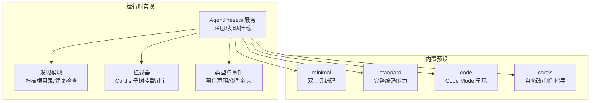
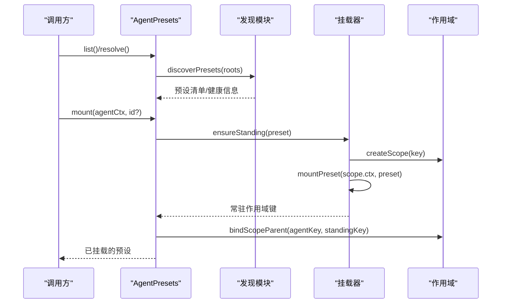
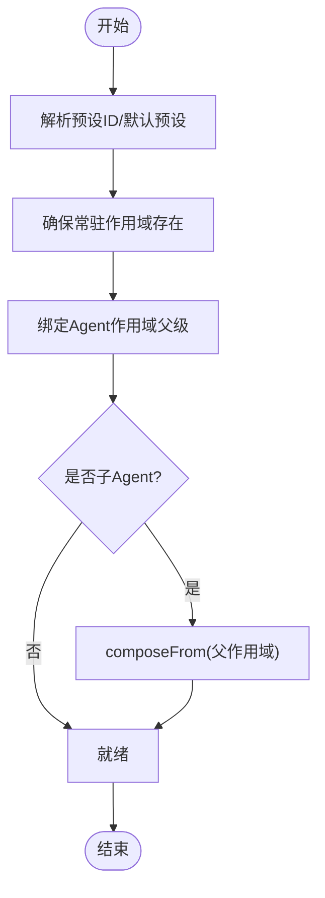
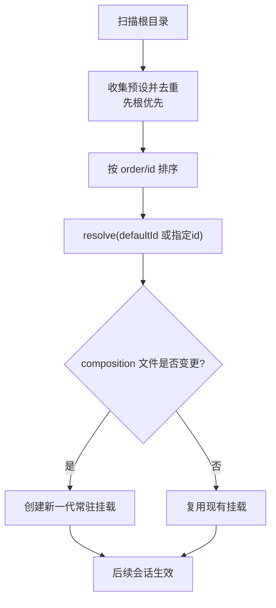
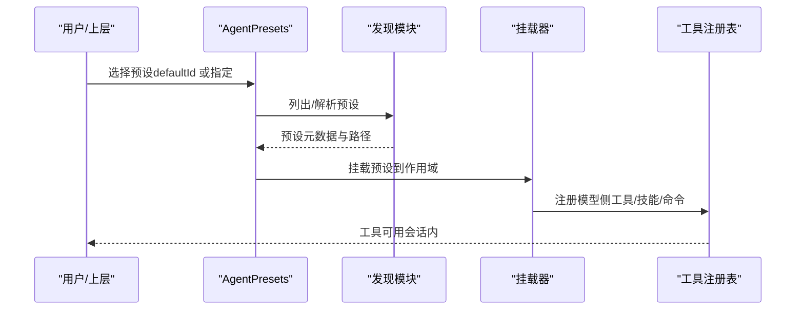
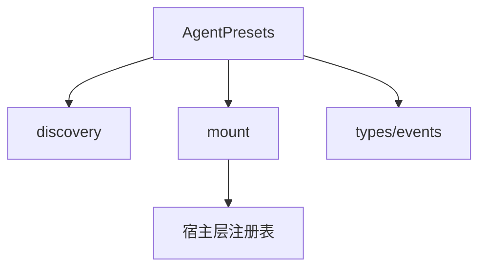

# 预设概念与架构

<cite>
**本文引用的文件**
- [index.ts](file://packages/preset/agent-presets/src/index.ts)
- [discovery.ts](file://packages/preset/agent-presets/src/discovery.ts)
- [mount.ts](file://packages/preset/agent-presets/src/mount.ts)
- [types.ts](file://packages/preset/agent-presets/src/types.ts)
- [preset.yml（minimal）](file://apps/cli/config/agent-presets/minimal/preset.yml)
- [preset.yml（standard）](file://apps/cli/config/agent-presets/standard/preset.yml)
- [preset.yml（code）](file://apps/cli/config/agent-presets/code/preset.yml)
- [preset.yml（cordis）](file://apps/cli/config/agent-presets/cordis/preset.yml)
- [agent.cordis.yml（minimal）](file://apps/cli/config/agent-presets/minimal/agent.cordis.yml)
- [agent.cordis.yml（standard）](file://apps/cli/config/agent-presets/standard/agent.cordis.yml)
- [agent.cordis.yml（code）](file://apps/cli/config/agent-presets/code/agent.cordis.yml)
- [agent.cordis.yml（cordis）](file://apps/cli/config/agent-presets/cordis/agent.cordis.yml)
</cite>

## 目录
1. [简介](#简介)
2. [项目结构](#项目结构)
3. [核心组件](#核心组件)
4. [架构总览](#架构总览)
5. [详细组件分析](#详细组件分析)
6. [依赖关系分析](#依赖关系分析)
7. [性能考量](#性能考量)
8. [故障排查指南](#故障排查指南)
9. [结论](#结论)
10. [附录](#附录)

## 简介
Agent 预设系统用于以“可组合、可继承、可复用”的方式，为不同 Agent 会话装配一套稳定的能力集合。一个预设由元数据（名称、描述、排序）和一份 Cordis 组成式配置构成，运行时会被发现、校验并挂载到 Agent 的作用域中，形成“常驻的、按会话隔离的能力层”。其核心价值在于：
- 标准化能力边界：将工具、提示段、工作流等能力以声明式方式组织，避免在业务代码中硬编码。
- 快速切换场景：通过选择不同预设，一键切换“极简编码”“标准编码”“Code Mode”“创造模式”等体验。
- 安全与稳定：通过作用域隔离、服务泄漏检测、不可变输入文件等机制，保证多会话并发下的稳定性与安全性。
- 可扩展与可创作：支持用户级覆盖与自创作预设，便于团队沉淀最佳实践。

## 项目结构
预设系统由两部分组成：
- 运行时实现：位于 packages/preset/agent-presets，负责预设的发现、解析、挂载与作用域绑定。
- 内置预设：位于 apps/cli/config/agent-presets，提供 minimal、standard、code、cordis 四套开箱即用预设。

图表来源
- [index.ts:82-182](file://packages/preset/agent-presets/src/index.ts#L82-L182)
- [discovery.ts:139-186](file://packages/preset/agent-presets/src/discovery.ts#L139-L186)
- [mount.ts:332-381](file://packages/preset/agent-presets/src/mount.ts#L332-L381)
- [types.ts:4-14](file://packages/preset/agent-presets/src/types.ts#L4-L14)

章节来源
- [index.ts:82-182](file://packages/preset/agent-presets/src/index.ts#L82-L182)
- [discovery.ts:139-186](file://packages/preset/agent-presets/src/discovery.ts#L139-L186)
- [mount.ts:332-381](file://packages/preset/agent-presets/src/mount.ts#L332-L381)
- [types.ts:4-14](file://packages/preset/agent-presets/src/types.ts#L4-L14)

## 核心组件
- AgentPresets 服务：维护默认预设、根目录列表、用户设置；提供 list/resolve/mount/composeFrom/recompose/standingKeyFor 等能力。
- 发现模块：扫描配置的根目录与用户根目录，读取 agent.cordis.yml，进行基础健康检查，返回带 broken 信息的清单。
- 挂载器：基于 Cordis Include 加载预设子树，执行可用性审计（未激活行、服务泄漏），并将结果记录到全局挂载表。
- 类型与事件：定义客户端可见的事件 agent-preset/selected，以及类型约束。

章节来源
- [index.ts:82-182](file://packages/preset/agent-presets/src/index.ts#L82-L182)
- [discovery.ts:139-186](file://packages/preset/agent-presets/src/discovery.ts#L139-L186)
- [mount.ts:274-381](file://packages/preset/agent-presets/src/mount.ts#L274-L381)
- [types.ts:4-14](file://packages/preset/agent-presets/src/types.ts#L4-L14)

## 架构总览
预设系统的整体流程如下：
- 启动时或按需调用 list() 扫描所有根目录，得到可用预设清单。
- 通过 resolve(id) 或 defaultId 确定要使用的预设。
- mount(agentCtx, id) 创建或复用“常驻作用域”，将 Agent 的作用域父级绑定到该作用域，使预设注册的插件、工具、提示段对当前 Agent 可见。
- 子 Agent 可通过 composeFrom(parentCtx) 继承父 Agent 的预设能力，而不重新解析文件。
- 运行期若检测到 composition 文件变更（mtime/size 变化），会触发新一代的常驻挂载，后续新会话使用新版本。

图表来源
- [index.ts:199-287](file://packages/preset/agent-presets/src/index.ts#L199-L287)
- [discovery.ts:177-186](file://packages/preset/agent-presets/src/discovery.ts#L177-L186)
- [mount.ts:332-381](file://packages/preset/agent-presets/src/mount.ts#L332-L381)

## 详细组件分析

### 预设层次结构与继承机制
- 层次结构
  - 宿主层（Host Composition）：进程级共享的注册表、沙箱、审批栈、持久化、模型路由等。
  - 预设层（Agent Preset）：每个会话可选的“能力包”，包含 persona、工具、技能、计划模式、压缩、委托与工作流等。
  - 会话层（Session/Agent Scope）：每个 Agent 的作用域，继承其父作用域的注册项，从而获得预设能力。
- 继承机制
  - 通过 dsh-scope 的父级绑定，将 Agent 的作用域父级指向预设的“常驻作用域”，使该 Agent 能访问预设注册的插件、工具、提示段与服务。
  - 子 Agent 通过 composeFrom(parentCtx) 直接继承父 Agent 的预设实例，避免重复解析与冲突。

图表来源
- [index.ts:275-325](file://packages/preset/agent-presets/src/index.ts#L275-L325)

章节来源
- [index.ts:275-325](file://packages/preset/agent-presets/src/index.ts#L275-L325)

### 内置预设特点与适用场景
- minimal（极简模式）
  - 特点：固定 persona，仅启用持久 bash 与 str_replace_editor 两个工具；关闭运行时上下文快照与上下文压缩。
  - 适用：轻量编码任务、最小权限与最小资源占用场景。
- standard（标准模式）
  - 特点：完整的编码 Agent 能力，包括 Shell、文件系统、搜索、Skills、计划、目标、子代理与工作流等。
  - 适用：通用编码与研发辅助场景。
- code（PTC 模式）
  - 特点：在 standard 基础上增加 Code Mode 呈现层，模型通过 TypeScript SDK 程序组合多步操作，减少往返。
  - 适用：复杂多步任务、需要结构化编排的场景。
- cordis（创造模式）
  - 特点：具备 standard 全部能力，并提供自修改与创作指导（读取/写入运行时、编辑组合文件），附带专用 persona 与技能。
  - 适用：高级用户/开发者自定义 Agent 预设与运行时实验。

章节来源
- [preset.yml（minimal）:1-4](file://apps/cli/config/agent-presets/minimal/preset.yml#L1-L4)
- [preset.yml（standard）:1-4](file://apps/cli/config/agent-presets/standard/preset.yml#L1-L4)
- [preset.yml（code）:1-4](file://apps/cli/config/agent-presets/code/preset.yml#L1-L4)
- [preset.yml（cordis）:1-4](file://apps/cli/config/agent-presets/cordis/preset.yml#L1-L4)
- [agent.cordis.yml（minimal）:1-63](file://apps/cli/config/agent-presets/minimal/agent.cordis.yml#L1-L63)
- [agent.cordis.yml（standard）:1-252](file://apps/cli/config/agent-presets/standard/agent.cordis.yml#L1-L252)
- [agent.cordis.yml（code）:1-263](file://apps/cli/config/agent-presets/code/agent.cordis.yml#L1-L263)
- [agent.cordis.yml（cordis）:1-263](file://apps/cli/config/agent-presets/cordis/agent.cordis.yml#L1-L263)

### 预设与插件组合的关系
- 预设即一组 Cordis 插件行的组合，通过 agent.cordis.yml 声明。
- 挂载时，Cordis Loader 将预设作为独立子树加载，插件注册到该子树的作用域中，避免污染宿主层。
- 宿主层保留进程级共享的注册表（如工具注册表、工作流引擎等），预设通过“模型侧工具”与之交互。

图表来源
- [mount.ts:332-381](file://packages/preset/agent-presets/src/mount.ts#L332-L381)
- [agent.cordis.yml（standard）:1-252](file://apps/cli/config/agent-presets/standard/agent.cordis.yml#L1-L252)

章节来源
- [mount.ts:332-381](file://packages/preset/agent-presets/src/mount.ts#L332-L381)
- [agent.cordis.yml（standard）:1-252](file://apps/cli/config/agent-presets/standard/agent.cordis.yml#L1-L252)

### 预设的加载顺序与优先级规则
- 根目录优先级：先配置的根目录优先于后配置的根目录；用户根目录（$DSH_HOME/.agent-presets）默认追加在最后，除非显式关闭 includeUserRoot。
- 同名预设覆盖：先出现的根目录中的预设优先（first-root-wins）。
- 显示排序：同一根内按 preset.yml 中的 order 升序排列，order 相同则按 id 字典序。
- 运行时热更新：当 composition 文件的 mtime/size 发生变化时，会创建新一代常驻挂载，新会话自动使用新版本；已加入的会话保持原版本直至销毁。

图表来源
- [index.ts:95-105](file://packages/preset/agent-presets/src/index.ts#L95-L105)
- [discovery.ts:164-169](file://packages/preset/agent-presets/src/discovery.ts#L164-L169)
- [index.ts:491-534](file://packages/preset/agent-presets/src/index.ts#L491-L534)

章节来源
- [index.ts:95-105](file://packages/preset/agent-presets/src/index.ts#L95-L105)
- [discovery.ts:164-169](file://packages/preset/agent-presets/src/discovery.ts#L164-L169)
- [index.ts:491-534](file://packages/preset/agent-presets/src/index.ts#L491-L534)

### 数据流图：从选择预设到工具可用

图表来源
- [index.ts:199-287](file://packages/preset/agent-presets/src/index.ts#L199-L287)
- [mount.ts:332-381](file://packages/preset/agent-presets/src/mount.ts#L332-L381)

## 依赖关系分析
- 内部依赖
  - AgentPresets 依赖 discovery（发现）、mount（挂载）、metadata（元数据）、authoring（创作）、session（会话选择）等模块。
  - 挂载器依赖 Cordis Loader 与 Include，并通过 dsh-scope 管理作用域父子关系。
- 外部依赖
  - 宿主层提供的注册表（工具、工作流、子代理等）与策略（沙箱、审批、持久化）。
- 耦合与内聚
  - 预设层与宿主层解耦：预设不持有进程级单例，而是通过模型侧工具与宿主注册表交互。
  - 高内聚：每个预设自包含 persona、工具、技能、命令等，易于复制与替换。

图表来源
- [index.ts:24-37](file://packages/preset/agent-presets/src/index.ts#L24-L37)
- [mount.ts:17-23](file://packages/preset/agent-presets/src/mount.ts#L17-L23)

章节来源
- [index.ts:24-37](file://packages/preset/agent-presets/src/index.ts#L24-L37)
- [mount.ts:17-23](file://packages/preset/agent-presets/src/mount.ts#L17-L23)

## 性能考量
- 常驻挂载：每个预设只创建一个“常驻作用域”，多个会话共享，减少重复加载与初始化成本。
- 热更新控制：仅在 composition 文件发生 mtime/size 变化时重建挂载，避免频繁重建带来的开销。
- 懒加载与一次性：默认预设通过 settings 动态读取，无需重启即可生效；子 Agent 继承父 Agent 的预设实例，避免重复解析。
- 资源隔离：通过 isolate 领域限制服务生命周期与作用域，防止进程级污染与内存泄漏。

[本节为通用性能建议，不直接分析具体文件]

## 故障排查指南
- 常见错误与定位
  - 未知预设：resolve() 找不到预设时会抛出 UnknownPresetError，检查 roots 配置与预设 id。
  - 损坏预设：discovery 阶段会标记 broken，并在 mount 前拒绝挂载，查看 broken 原因（YAML 解析失败、缺少必要字段等）。
  - 服务泄漏：挂载器会检测是否有服务发布到 root realm，若有则报错，需将服务放入 isolate 组或移至宿主层。
  - 未激活行：某些行仍在等待注入的服务，inactiveRows 会列出缺失依赖，补齐服务或调整依赖顺序。
- 诊断工具
  - livePresetMounts：查看当前活跃的挂载。
  - leakedServices：检测服务泄漏。
  - inactiveRows：列出不活跃的行及其缺失依赖。
- 处理步骤
  - 修正 agent.cordis.yml 语法与结构。
  - 确保 isolate 组正确包裹需要隔离的服务。
  - 确认宿主层提供了必要的服务（如 tokenMeter、workflows、subagents 等）。
  - 删除或修复损坏的预设目录，或恢复缺失的 agent.cordis.yml。

章节来源
- [mount.ts:274-381](file://packages/preset/agent-presets/src/mount.ts#L274-L381)
- [discovery.ts:86-106](file://packages/preset/agent-presets/src/discovery.ts#L86-L106)

## 结论
Agent 预设系统通过“发现—解析—挂载—继承”的清晰流程，将复杂的能力装配抽象为可复用的配置单元。它既保证了多会话并发下的稳定性与安全性，又提供了灵活的扩展与创作能力。推荐的最佳实践包括：
- 使用 standard 作为基线，按需裁剪为 minimal 或增强为 code/cordis。
- 将进程级共享能力留在宿主层，预设仅暴露模型侧工具与提示段。
- 合理使用 isolate 组，避免服务泄漏与作用域污染。
- 利用用户根目录进行本地覆盖与创作，遵循 first-root-wins 的优先级规则。
- 关注 composition 文件变更，理解热更新的生效时机与影响范围。

[本节为总结性内容，不直接分析具体文件]

## 附录
- 关键术语
  - 宿主层：进程级共享的基础设施与注册表。
  - 预设层：按会话选择的“能力包”，以 agent.cordis.yml 声明。
  - 会话层：每个 Agent 的作用域，继承父作用域的能力。
  - 常驻挂载：每个预设的生命周期与作用域，供多个会话共享。
- 参考路径
  - 运行时实现：packages/preset/agent-presets/src
  - 内置预设：apps/cli/config/agent-presets

[本节为补充说明，不直接分析具体文件]