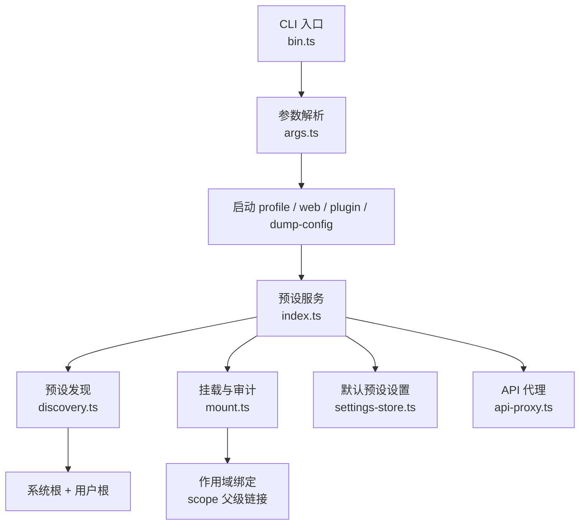
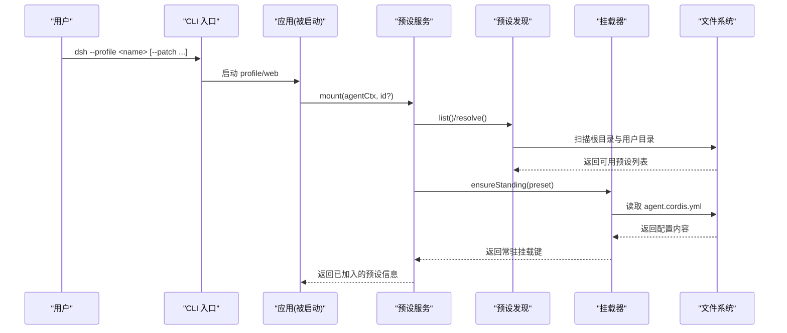
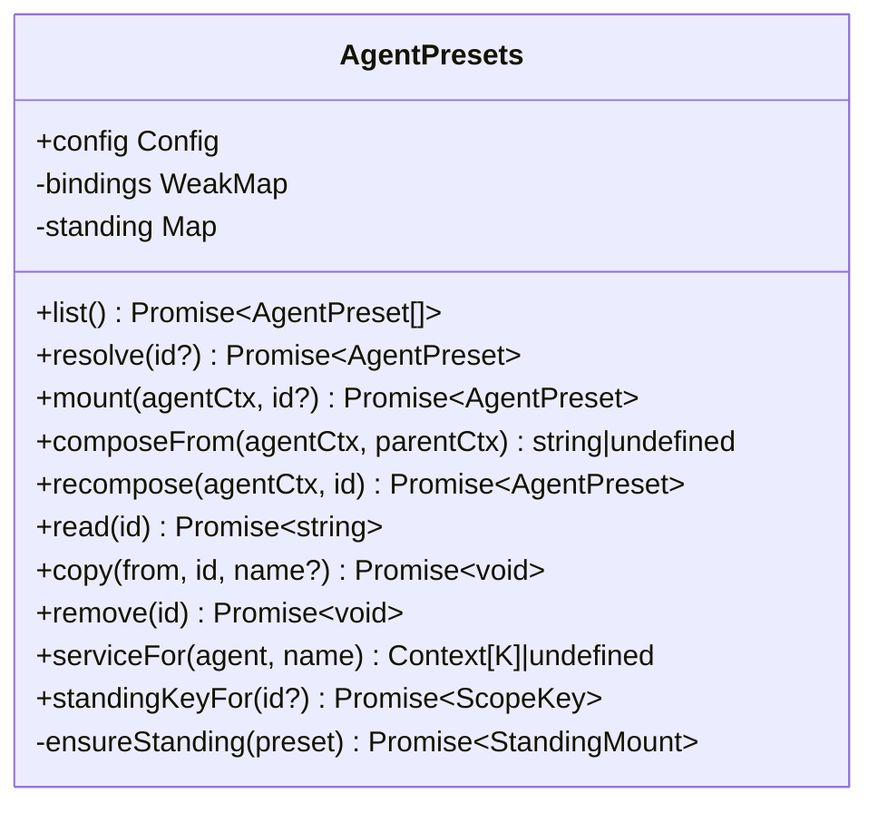
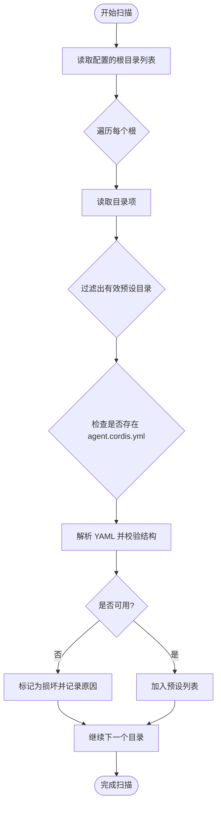
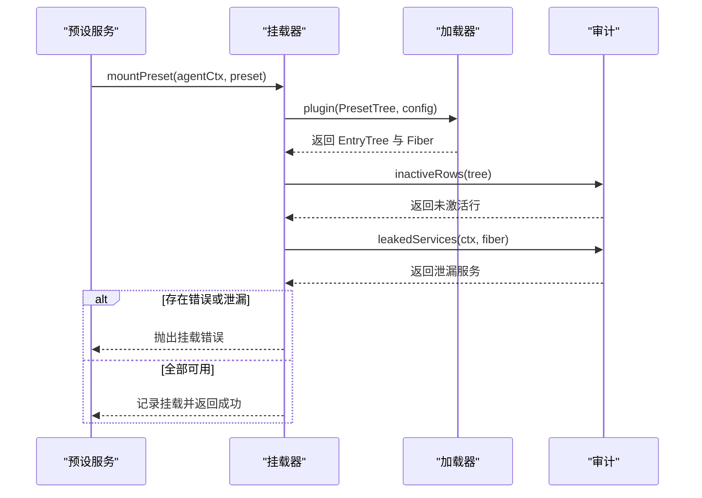
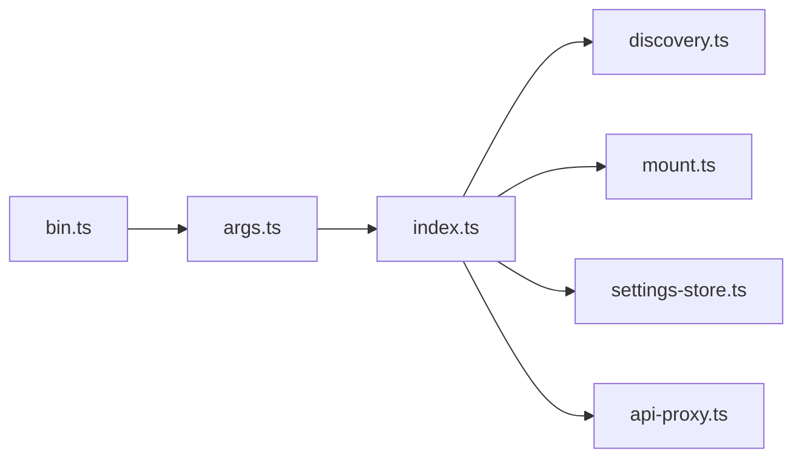

# 预设管理与使用

<cite>
**本文引用的文件**
- [apps/cli/src/bin.ts](file://apps/cli/src/bin.ts)
- [apps/cli/src/args.ts](file://apps/cli/src/args.ts)
- [packages/preset/agent-presets/src/index.ts](file://packages/preset/agent-presets/src/index.ts)
- [packages/preset/agent-presets/src/discovery.ts](file://packages/preset/agent-presets/src/discovery.ts)
- [packages/preset/agent-presets/src/mount.ts](file://packages/preset/agent-presets/src/mount.ts)
- [packages/preset/agent-presets/src/types.ts](file://packages/preset/agent-presets/src/types.ts)
- [packages/client/ui-agent-preset/src/client/settings-store.ts](file://packages/client/ui-agent-preset/src/client/settings-store.ts)
- [packages/host/apiproxy/src/api-proxy.ts](file://packages/host/apiproxy/src/api-proxy.ts)
- [apps/cli/config/agent-presets/standard/preset.yml](file://apps/cli/config/agent-presets/standard/preset.yml)
- [apps/cli/config/agent-presets/code/preset.yml](file://apps/cli/config/agent-presets/code/preset.yml)
- [apps/cli/config/agent-presets/minimal/preset.yml](file://apps/cli/config/agent-presets/minimal/preset.yml)
- [apps/cli/config/agent-presets/cordis/preset.yml](file://apps/cli/config/agent-presets/cordis/preset.yml)
</cite>

## 目录
1. [简介](#简介)
2. [项目结构](#项目结构)
3. [核心组件](#核心组件)
4. [架构总览](#架构总览)
5. [详细组件分析](#详细组件分析)
6. [依赖关系分析](#依赖关系分析)
7. [性能考虑](#性能考虑)
8. [故障排除指南](#故障排除指南)
9. [结论](#结论)
10. [附录](#附录)

## 简介
本指南面向需要在项目中安装、使用和管理“Agent 预设”的工程师与运维人员。内容涵盖：
- 如何在项目中安装和启用预设
- 预设的命令行接口与管理命令
- 预设的热重载与动态更新机制
- 预设的共享与分发方式
- 预设的故障排除与调试方法
- 预设的性能优化建议
- 实际项目中的应用案例

通过本指南，你将高效地管理并维护整个预设生态，确保不同会话以各自独立的工具集、提示词段落和技能目录运行，同时保持进程级资源的高效复用。

## 项目结构
预设系统由以下关键部分组成：
- CLI 入口与参数解析：负责启动不同模式（profile/web/plugin/dump-config），并将内部参数透传给被启动的应用。
- 预设注册表与发现：扫描系统根目录和用户根目录，列出可用预设，并对预设进行健康检查。
- 挂载与生命周期：为每个预设建立“常驻挂载”，按会话加入该挂载，实现能力隔离与复用。
- 设置与默认预设：用户可通过设置选择默认预设，并在创建新会话时自动应用。
- API 代理：提供读取、复制、删除预设等受权操作。

图表来源
- [apps/cli/src/bin.ts:1-54](file://apps/cli/src/bin.ts#L1-L54)
- [apps/cli/src/args.ts:1-192](file://apps/cli/src/args.ts#L1-L192)
- [packages/preset/agent-presets/src/index.ts:1-573](file://packages/preset/agent-presets/src/index.ts#L1-L573)
- [packages/preset/agent-presets/src/discovery.ts:1-187](file://packages/preset/agent-presets/src/discovery.ts#L1-L187)
- [packages/preset/agent-presets/src/mount.ts:1-382](file://packages/preset/agent-presets/src/mount.ts#L1-L382)
- [packages/client/ui-agent-preset/src/client/settings-store.ts:27-62](file://packages/client/ui-agent-preset/src/client/settings-store.ts#L27-L62)
- [packages/host/apiproxy/src/api-proxy.ts:3135-3167](file://packages/host/apiproxy/src/api-proxy.ts#L3135-L3167)

章节来源
- [apps/cli/src/bin.ts:1-54](file://apps/cli/src/bin.ts#L1-L54)
- [apps/cli/src/args.ts:1-192](file://apps/cli/src/args.ts#L1-L192)
- [packages/preset/agent-presets/src/index.ts:1-573](file://packages/preset/agent-presets/src/index.ts#L1-L573)
- [packages/preset/agent-presets/src/discovery.ts:1-187](file://packages/preset/agent-presets/src/discovery.ts#L1-L187)
- [packages/preset/agent-presets/src/mount.ts:1-382](file://packages/preset/agent-presets/src/mount.ts#L1-L382)
- [packages/client/ui-agent-preset/src/client/settings-store.ts:27-62](file://packages/client/ui-agent-preset/src/client/settings-store.ts#L27-L62)
- [packages/host/apiproxy/src/api-proxy.ts:3135-3167](file://packages/host/apiproxy/src/api-proxy.ts#L3135-L3167)

## 核心组件
- CLI 入口与参数解析
  - 支持 --profile、--patch、--dump-config、--dump-default-config、web 别名、plugin 子命令等。
  - 将自身标志之后的所有参数透传给被启动的应用，避免冲突。
- 预设服务 AgentPresets
  - 负责预设的发现、解析、挂载、热重载、默认预设选择、复制与删除。
  - 维护“常驻挂载”（standing mount）：每个预设只组装一次，多个会话可安全复用。
  - 通过作用域父子关系将 agent 加入对应预设的能力层。
- 预设发现 discovery
  - 扫描系统根与用户根目录，识别包含 agent.cordis.yml 的目录作为预设。
  - 对预设进行健康检查，报告不可用原因，避免静默失败。
- 挂载 mount
  - 将预设组合树挂载到 agent 的作用域下，校验未激活的行与泄漏的服务。
  - 记录当前挂载以便审计与查询。
- 设置与默认预设 settings-store
  - 持久化用户选择的默认预设，供新会话创建时自动应用。
- API 代理 api-proxy
  - 提供 read、copy、remove 等受权操作，用于预设的读取、复制与删除。

章节来源
- [apps/cli/src/args.ts:1-192](file://apps/cli/src/args.ts#L1-L192)
- [packages/preset/agent-presets/src/index.ts:1-573](file://packages/preset/agent-presets/src/index.ts#L1-L573)
- [packages/preset/agent-presets/src/discovery.ts:1-187](file://packages/preset/agent-presets/src/discovery.ts#L1-L187)
- [packages/preset/agent-presets/src/mount.ts:1-382](file://packages/preset/agent-presets/src/mount.ts#L1-L382)
- [packages/client/ui-agent-preset/src/client/settings-store.ts:27-62](file://packages/client/ui-agent-preset/src/client/settings-store.ts#L27-L62)
- [packages/host/apiproxy/src/api-proxy.ts:3135-3167](file://packages/host/apiproxy/src/api-proxy.ts#L3135-L3167)

## 架构总览
预设系统的整体流程如下：
- CLI 启动后，根据参数决定进入 profile/web/plugin/dump-config 模式。
- 在 profile/web 模式下，应用会创建 agent，并通过预设服务将其加入某个预设的“常驻挂载”。
- 预设服务从系统根与用户根发现预设，解析并挂载；若文件变更，则按需重建新的“世代”以供后续会话使用。
- 用户可通过设置指定默认预设；API 代理提供受权操作来管理预设。

图表来源
- [apps/cli/src/bin.ts:1-54](file://apps/cli/src/bin.ts#L1-L54)
- [apps/cli/src/args.ts:1-192](file://apps/cli/src/args.ts#L1-L192)
- [packages/preset/agent-presets/src/index.ts:1-573](file://packages/preset/agent-presets/src/index.ts#L1-L573)
- [packages/preset/agent-presets/src/discovery.ts:1-187](file://packages/preset/agent-presets/src/discovery.ts#L1-L187)
- [packages/preset/agent-presets/src/mount.ts:1-382](file://packages/preset/agent-presets/src/mount.ts#L1-L382)

## 详细组件分析

### 预设服务 AgentPresets
- 职责
  - 预设发现与解析：list()、resolve()、resolveMountable()。
  - 常驻挂载管理：ensureStanding()，基于文件时间戳与大小判断是否需要重建。
  - 会话加入与继承：mount()、composeFrom()、recompose()。
  - 默认预设：defaultId 从设置中读取，支持热重载。
  - 作者能力：copy()、remove()、read()。
  - 服务查找：serviceFor() 针对特定 agent 的实例读取。
- 关键点
  - 常驻挂载是“按预设”而非“按会话”的，提升性能与一致性。
  - 通过作用域父子关系将 agent 加入预设能力层，保证隔离。
  - 对未激活行与泄漏服务进行严格校验，防止污染宿主。

图表来源
- [packages/preset/agent-presets/src/index.ts:1-573](file://packages/preset/agent-presets/src/index.ts#L1-L573)

章节来源
- [packages/preset/agent-presets/src/index.ts:1-573](file://packages/preset/agent-presets/src/index.ts#L1-L573)

### 预设发现 discovery
- 职责
  - 扫描系统根与用户根目录，识别包含 agent.cordis.yml 的目录。
  - 对预设进行健康检查，报告 YAML 解析或结构问题。
  - 排序规则：优先 order，其次按 id 字典序。
- 关键点
  - 每次调用 list()/discoverPresets() 都会重新扫描，支持运行时新增/删除预设。
  - 用户根目录固定为 .agent-presets，便于统一管理与分发。

图表来源
- [packages/preset/agent-presets/src/discovery.ts:1-187](file://packages/preset/agent-presets/src/discovery.ts#L1-L187)

章节来源
- [packages/preset/agent-presets/src/discovery.ts:1-187](file://packages/preset/agent-presets/src/discovery.ts#L1-L187)

### 挂载与审计 mount
- 职责
  - 将预设组合树挂载到 agent 的作用域下，确保每行都可用。
  - 检测未激活的行与泄漏到宿主的服务，阻止不安全的挂载。
  - 记录当前挂载以便审计与查询。
- 关键点
  - 通过 Include 子类控制模块解析，确保包名从宿主基址解析。
  - 禁止写回预设文件，避免意外覆盖。
  - 提供 inactiveRows()、leakedServices() 等诊断能力。

图表来源
- [packages/preset/agent-presets/src/mount.ts:1-382](file://packages/preset/agent-presets/src/mount.ts#L1-L382)

章节来源
- [packages/preset/agent-presets/src/mount.ts:1-382](file://packages/preset/agent-presets/src/mount.ts#L1-L382)

### 设置与默认预设 settings-store
- 职责
  - 持久化用户选择的默认预设，供新会话创建时自动应用。
  - 提供 writeDefaultPreset() 写入默认预设，处理传输错误。
- 关键点
  - 默认预设存储在独立命名空间，避免与其他设置冲突。
  - UI 与通用设置写入共用同一落点，保持一致性。

章节来源
- [packages/client/ui-agent-preset/src/client/settings-store.ts:27-62](file://packages/client/ui-agent-preset/src/client/settings-store.ts#L27-L62)

### API 代理 api-proxy
- 职责
  - 提供 read、copy、remove 等受权操作，用于预设的读取、复制与删除。
  - 对错误进行包装，返回统一的错误消息。
- 关键点
  - 读操作返回预设元数据与内容，便于前端展示与编辑。
  - 复制与删除操作需要受权，防止误改系统预设。

章节来源
- [packages/host/apiproxy/src/api-proxy.ts:3135-3167](file://packages/host/apiproxy/src/api-proxy.ts#L3135-L3167)

### 预设示例与元数据
- 内置预设
  - 标准模式：功能完整的编码 Agent，支持多种能力。
  - PTC 模式：通过 Code Mode SDK 呈现工具，让模型用 TypeScript 程序组合多步操作。
  - 极简模式：仅提供持久 bash 与 str_replace_editor 的双工具编码 Agent。
  - 创造模式：用于创建自定义 Agent preset，具备运行时检查与创作指导。
- 元数据
  - 每个预设目录包含 preset.yml，定义名称、描述与排序。

章节来源
- [apps/cli/config/agent-presets/standard/preset.yml:1-4](file://apps/cli/config/agent-presets/standard/preset.yml#L1-L4)
- [apps/cli/config/agent-presets/code/preset.yml:1-4](file://apps/cli/config/agent-presets/code/preset.yml#L1-L4)
- [apps/cli/config/agent-presets/minimal/preset.yml:1-4](file://apps/cli/config/agent-presets/minimal/preset.yml#L1-L4)
- [apps/cli/config/agent-presets/cordis/preset.yml:1-4](file://apps/cli/config/agent-presets/cordis/preset.yml#L1-L4)

## 依赖关系分析
- CLI 与参数解析
  - bin.ts 根据 args.ts 解析后的模式动态导入并执行相应逻辑。
- 预设服务与发现
  - index.ts 依赖 discovery.ts 进行目录扫描与健康检查。
  - index.ts 依赖 mount.ts 进行挂载与审计。
- 设置与 API
  - settings-store.ts 提供默认预设的持久化。
  - api-proxy.ts 提供受权操作，调用预设服务的 copy/remove/read。

图表来源
- [apps/cli/src/bin.ts:1-54](file://apps/cli/src/bin.ts#L1-L54)
- [apps/cli/src/args.ts:1-192](file://apps/cli/src/args.ts#L1-L192)
- [packages/preset/agent-presets/src/index.ts:1-573](file://packages/preset/agent-presets/src/index.ts#L1-L573)
- [packages/preset/agent-presets/src/discovery.ts:1-187](file://packages/preset/agent-presets/src/discovery.ts#L1-L187)
- [packages/preset/agent-presets/src/mount.ts:1-382](file://packages/preset/agent-presets/src/mount.ts#L1-L382)
- [packages/client/ui-agent-preset/src/client/settings-store.ts:27-62](file://packages/client/ui-agent-preset/src/client/settings-store.ts#L27-L62)
- [packages/host/apiproxy/src/api-proxy.ts:3135-3167](file://packages/host/apiproxy/src/api-proxy.ts#L3135-L3167)

章节来源
- [apps/cli/src/bin.ts:1-54](file://apps/cli/src/bin.ts#L1-L54)
- [apps/cli/src/args.ts:1-192](file://apps/cli/src/args.ts#L1-L192)
- [packages/preset/agent-presets/src/index.ts:1-573](file://packages/preset/agent-presets/src/index.ts#L1-L573)
- [packages/preset/agent-presets/src/discovery.ts:1-187](file://packages/preset/agent-presets/src/discovery.ts#L1-L187)
- [packages/preset/agent-presets/src/mount.ts:1-382](file://packages/preset/agent-presets/src/mount.ts#L1-L382)
- [packages/client/ui-agent-preset/src/client/settings-store.ts:27-62](file://packages/client/ui-agent-preset/src/client/settings-store.ts#L27-L62)
- [packages/host/apiproxy/src/api-proxy.ts:3135-3167](file://packages/host/apiproxy/src/api-proxy.ts#L3135-L3167)

## 性能考虑
- 常驻挂载
  - 每个预设只组装一次，多个会话共享同一实例，减少重复开销。
  - 通过文件时间戳与大小判断是否需要重建，避免不必要的重装载。
- 作用域隔离
  - 通过作用域父子关系将 agent 加入预设能力层，避免全局污染。
- 健康检查
  - 在挂载前进行未激活行与泄漏服务检查，提前发现问题，避免运行时异常。
- 热重载
  - 设置文档热重载，无需重启即可生效；预设文件变更触发新一代挂载，旧会话不受影响。

[本节为通用性能讨论，不直接分析具体文件]

## 故障排除指南
- 常见错误
  - 未知预设：请求的预设 ID 不存在于任何根目录。
  - 挂载失败：YAML 解析错误、结构不合法、未激活行、泄漏服务。
  - 权限不足：无法读取或写入预设目录。
- 诊断步骤
  - 使用 dump-config 查看组合树，确认预设是否正确加载。
  - 检查预设目录中的 agent.cordis.yml 是否完整且语法正确。
  - 使用 API 代理的 read 操作获取预设内容与元数据，确认状态。
  - 检查用户根目录 .agent-presets 是否存在且可写。
- 恢复措施
  - 修复 YAML 语法或结构问题。
  - 移除或修正导致泄漏的服务。
  - 重新复制或删除错误的预设。

章节来源
- [packages/preset/agent-presets/src/discovery.ts:1-187](file://packages/preset/agent-presets/src/discovery.ts#L1-L187)
- [packages/preset/agent-presets/src/mount.ts:1-382](file://packages/preset/agent-presets/src/mount.ts#L1-L382)
- [packages/host/apiproxy/src/api-proxy.ts:3135-3167](file://packages/host/apiproxy/src/api-proxy.ts#L3135-L3167)

## 结论
预设系统通过常驻挂载与作用域隔离，实现了高性能、高可靠性的 Agent 能力装配。结合 CLI、设置与 API 代理，提供了完整的安装、使用、管理与热重载能力。遵循本指南，你可以高效地管理预设生态，确保不同会话以各自独立的方式运行，同时保持进程级资源的高效复用。

[本节为总结，不直接分析具体文件]

## 附录

### 安装与使用预设
- 安装预设
  - 将预设目录放入系统根或用户根（.agent-presets）。
  - 确保目录中包含 agent.cordis.yml 与可选的 preset.yml。
- 使用预设
  - 通过 CLI 启动 profile/web，并在创建会话时选择预设。
  - 设置默认预设，使新会话自动应用。

章节来源
- [packages/preset/agent-presets/src/discovery.ts:1-187](file://packages/preset/agent-presets/src/discovery.ts#L1-L187)
- [packages/client/ui-agent-preset/src/client/settings-store.ts:27-62](file://packages/client/ui-agent-preset/src/client/settings-store.ts#L27-L62)

### 命令行接口与管理命令
- CLI 入口
  - dsh --profile <name>：启动指定 profile。
  - dsh --profile web：启动 web 模式。
  - dsh plugin --profile <name> add/remove/why <package>：管理插件。
  - dsh --dump-config/--dump-default-config：打印组合树。
- 预设管理
  - 通过 API 代理的 read/copy/remove 操作管理预设。

章节来源
- [apps/cli/src/bin.ts:1-54](file://apps/cli/src/bin.ts#L1-L54)
- [apps/cli/src/args.ts:1-192](file://apps/cli/src/args.ts#L1-L192)
- [packages/host/apiproxy/src/api-proxy.ts:3135-3167](file://packages/host/apiproxy/src/api-proxy.ts#L3135-L3167)

### 热重载与动态更新
- 设置热重载
  - 修改默认预设后，新会话立即生效。
- 预设文件热重载
  - 修改 agent.cordis.yml 后，后续会话将使用新一代挂载。
  - 已运行的会话不受影响，保持原有能力。

章节来源
- [packages/preset/agent-presets/src/index.ts:1-573](file://packages/preset/agent-presets/src/index.ts#L1-L573)

### 共享与分发
- 系统根
  - 由部署方提供，包含内置预设。
- 用户根
  - 位于 .agent-presets，允许用户自定义与分享。
- 复制与删除
  - 通过 API 代理的 copy/remove 操作进行本地化与清理。

章节来源
- [packages/preset/agent-presets/src/discovery.ts:1-187](file://packages/preset/agent-presets/src/discovery.ts#L1-L187)
- [packages/host/apiproxy/src/api-proxy.ts:3135-3167](file://packages/host/apiproxy/src/api-proxy.ts#L3135-L3167)

### 实际应用案例
- 标准模式
  - 适用于大多数编码场景，提供完整工具链与工作流。
- PTC 模式
  - 适用于复杂任务，通过 TypeScript 程序组合多步操作。
- 极简模式
  - 适用于轻量级编码任务，仅保留必要工具。
- 创造模式
  - 适用于开发自定义预设，提供运行时检查与指导。

章节来源
- [apps/cli/config/agent-presets/standard/preset.yml:1-4](file://apps/cli/config/agent-presets/standard/preset.yml#L1-L4)
- [apps/cli/config/agent-presets/code/preset.yml:1-4](file://apps/cli/config/agent-presets/code/preset.yml#L1-L4)
- [apps/cli/config/agent-presets/minimal/preset.yml:1-4](file://apps/cli/config/agent-presets/minimal/preset.yml#L1-L4)
- [apps/cli/config/agent-presets/cordis/preset.yml:1-4](file://apps/cli/config/agent-presets/cordis/preset.yml#L1-L4)