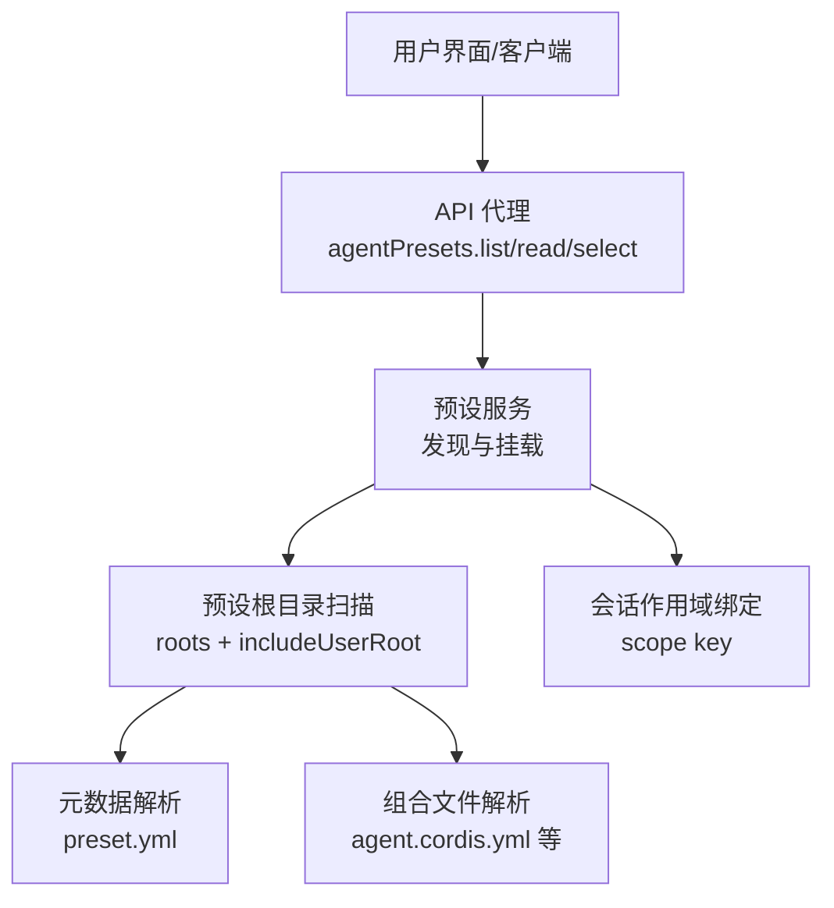
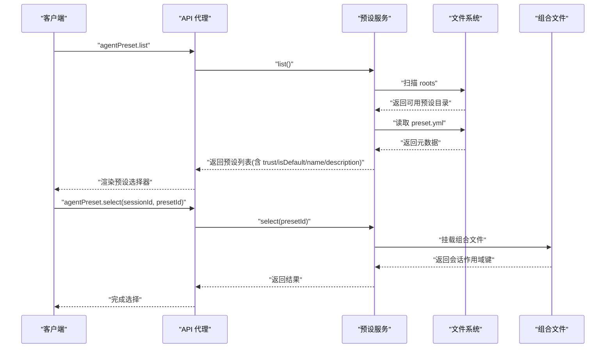
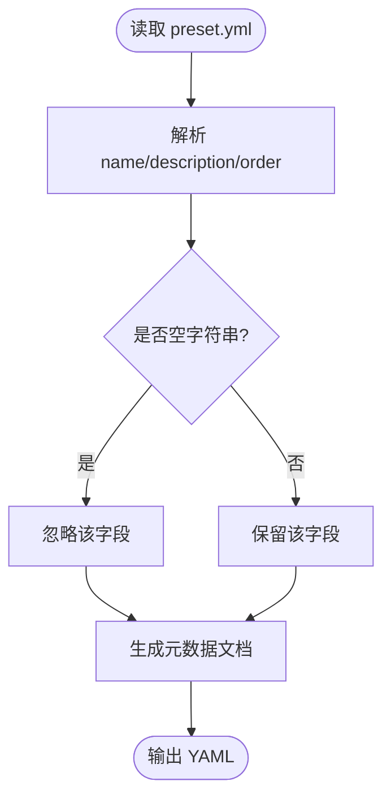
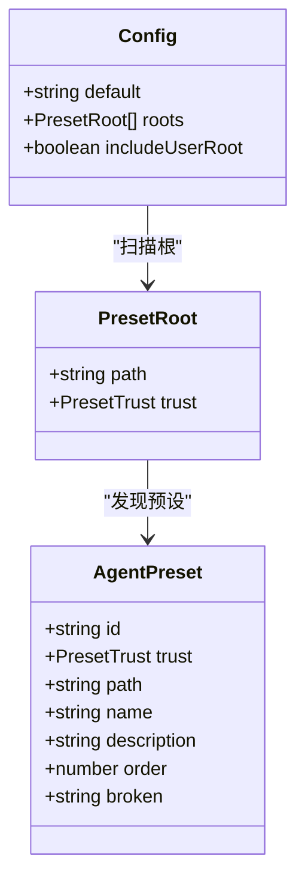
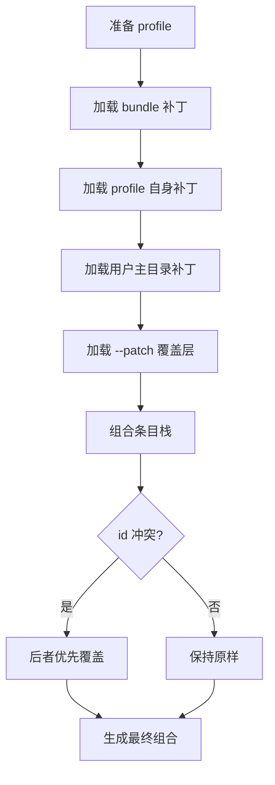
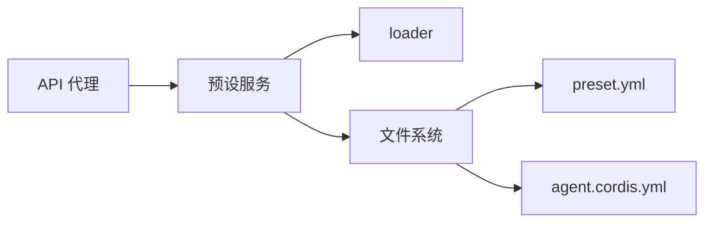

# 预设配置格式

<cite>
**本文引用的文件**
- [preset.yml](file://apps/cli/config/agent-presets/code/preset.yml)
- [preset.yml](file://apps/cli/config/agent-presets/cordis/preset.yml)
- [preset.yml](file://apps/cli/config/agent-presets/minimal/preset.yml)
- [preset.yml](file://apps/cli/config/agent-presets/standard/preset.yml)
- [agent.cordis.yml](file://apps/cli/config/agent-presets/code/agent.cordis.yml)
- [preset.ts](file://packages/preset/agent-presets/src/preset.ts)
- [metadata.ts](file://packages/preset/agent-presets/src/metadata.ts)
- [mount.ts](file://packages/preset/agent-presets/src/mount.ts)
- [profile-boot.ts](file://apps/cli/src/profile-boot.ts)
- [config-catalog.md](file://docs/config-catalog.md)
- [config-catalog.zh.md](file://docs/config-catalog.zh.md)
- [api-proxy.ts](file://packages/host/apiproxy/src/api-proxy.ts)
- [agent-presets.schema.ts](file://packages/host/apiproxy/src/api/agent-presets.schema.ts)
</cite>

## 目录
1. [简介](#简介)
2. [项目结构](#项目结构)
3. [核心组件](#核心组件)
4. [架构总览](#架构总览)
5. [详细组件分析](#详细组件分析)
6. [依赖关系分析](#依赖关系分析)
7. [性能与可维护性](#性能与可维护性)
8. [故障排查指南](#故障排查指南)
9. [结论](#结论)
10. [附录：字段参考与示例](#附录字段参考与示例)

## 简介
本文件是“预设配置格式”的完整参考，聚焦于每个 Agent 预设目录下的 preset.yml 元数据文件的语法、字段、默认值、验证规则、错误处理、继承与覆盖机制，以及不同预设类型的对比与最佳实践。通过本参考，你可以正确编写、维护和调试预设配置文件，确保在不同部署环境中稳定生效。

## 项目结构
- 预设元数据位于各预设目录的 preset.yml，用于对外展示名称、描述和排序。
- 预设的实际能力由 agent.cordis.yml（或其他 cordis 组合文件）定义，preset.yml 仅负责“显示层”的元信息。
- 运行时通过插件系统加载并组合这些预设，提供列表、选择、读取等 API。

图表来源
- [api-proxy.ts:3061-3081](file://packages/host/apiproxy/src/api-proxy.ts#L3061-L3081)
- [agent-presets.schema.ts:1-37](file://packages/host/apiproxy/src/api/agent-presets.schema.ts#L1-L37)
- [preset.ts:20-62](file://packages/preset/agent-presets/src/preset.ts#L20-L62)
- [metadata.ts:24-39](file://packages/preset/agent-presets/src/metadata.ts#L24-L39)

章节来源
- [preset.ts:20-62](file://packages/preset/agent-presets/src/preset.ts#L20-L62)
- [metadata.ts:24-39](file://packages/preset/agent-presets/src/metadata.ts#L24-L39)

## 核心组件
- 预设元数据模型：包含 id、trust、path、name、description、order、broken 等字段，用于描述一个可挂载的 Agent 预设。
- 元数据文件：preset.yml 支持 name、description、order 三个可选字段，用于 UI 展示与排序。
- 预设服务：负责从 roots 中扫描、合并、去重、排序，并提供 list/read/select 等能力。
- 组合文件：agent.cordis.yml 等文件定义具体工具、技能、工作流等能力；preset.yml 不承载运行时行为。

章节来源
- [preset.ts:20-62](file://packages/preset/agent-presets/src/preset.ts#L20-L62)
- [metadata.ts:24-39](file://packages/preset/agent-presets/src/metadata.ts#L24-L39)
- [config-catalog.md:167-203](file://docs/config-catalog.md#L167-L203)
- [config-catalog.zh.md:169-205](file://docs/config-catalog.zh.md#L169-L205)

## 架构总览
预设的加载与使用流程如下：
- 客户端调用 API 获取预设列表或选择预设。
- 预设服务根据配置扫描 roots，并可选择附加用户根目录。
- 对每个预设，解析其 preset.yml 元数据，并尝试挂载其组合文件。
- 成功挂载后，将预设与当前会话的作用域绑定，供后续工具与服务消费。

图表来源
- [api-proxy.ts:3061-3081](file://packages/host/apiproxy/src/api-proxy.ts#L3061-L3081)
- [agent-presets.schema.ts:12-31](file://packages/host/apiproxy/src/api/agent-presets.schema.ts#L12-L31)
- [preset.ts:51-62](file://packages/preset/agent-presets/src/preset.ts#L51-L62)

## 详细组件分析

### 元数据文件 preset.yml
- 位置：每个预设目录下与组合文件并列的 preset.yml。
- 字段：
  - name：人类可读的名称，缺失时回退到 id。
  - description：一句话描述，缺失时不写入。
  - order：组内排序，数值越小越靠前；未声明的排在已声明之后，再按 id 排序。
- 行为：
  - 空字符串会被视为缺失。
  - 渲染时会省略未设置的字段，避免写入无意义的空值。

图表来源
- [metadata.ts:24-39](file://packages/preset/agent-presets/src/metadata.ts#L24-L39)
- [metadata.ts:87-105](file://packages/preset/agent-presets/src/metadata.ts#L87-L105)

章节来源
- [metadata.ts:24-39](file://packages/preset/agent-presets/src/metadata.ts#L24-L39)
- [metadata.ts:87-105](file://packages/preset/agent-presets/src/metadata.ts#L87-L105)

### 预设服务与配置
- 插件配置项：
  - default：当调用方未指定预设时的默认 id；缺失会在挂载时报错。
  - roots：扫描根目录数组，顺序决定优先级；相同 id 以先出现的为准。
  - includeUserRoot：是否在 roots 之后追加用户根目录（来自 harness home 的 USER_PRESET_DIR）。
- 信任级别：
  - system：随部署提供的预设。
  - user：本地编写的预设，具有与 shell 访问相同的信任级别。
- 错误类型：
  - UnknownPresetError：请求的 id 不存在，附带可用 id 列表。
  - PresetMountError：预设存在但无法挂载，附带失败原因。

图表来源
- [preset.ts:20-62](file://packages/preset/agent-presets/src/preset.ts#L20-L62)
- [config-catalog.md:167-203](file://docs/config-catalog.md#L167-L203)
- [config-catalog.zh.md:169-205](file://docs/config-catalog.zh.md#L169-L205)

章节来源
- [preset.ts:20-62](file://packages/preset/agent-presets/src/preset.ts#L20-L62)
- [config-catalog.md:167-203](file://docs/config-catalog.md#L167-L203)
- [config-catalog.zh.md:169-205](file://docs/config-catalog.zh.md#L169-L205)

### 组合文件与能力
- preset.yml 不承载运行时行为；实际能力由 agent.cordis.yml 等组合文件定义。
- 例如 code 预设通过 tool-presentation 行将工具呈现模式切换为 code，使模型通过 TypeScript SDK 组合多步操作。
- 组合文件中的服务必须置于隔离作用域（如 planMode、compaction），以避免跨会话污染。

章节来源
- [agent.cordis.yml:1-263](file://apps/cli/config/agent-presets/code/agent.cordis.yml#L1-L263)

### 继承与覆盖机制
- 组合阶段：
  - 优先顺序：bundle 层 → 配置文件层 → 用户主目录补丁 → --patch 覆盖层 → 遥测开关。
  - 同一 id 的行会按顺序被覆盖；insert 插入新行。
- 预设根覆盖：
  - roots 的顺序决定优先级；更早的 root 中的同名 id 胜出。
  - includeUserRoot 允许在 roots 之后追加用户根，从而让用户覆盖系统预设。
- 会话作用域：
  - 预设挂载后会绑定到会话作用域键，确保每会话独立实例。

图表来源
- [profile-boot.ts:131-157](file://apps/cli/src/profile-boot.ts#L131-L157)

章节来源
- [profile-boot.ts:131-157](file://apps/cli/src/profile-boot.ts#L131-L157)

### 不同预设类型对比
- standard：功能完整的编码 Agent，支持文件编辑、Shell、检索、Skills、计划、目标、子代理和工作流。
- code：在标准基础上启用 Code Mode，通过 TypeScript SDK 组合多步操作。
- minimal：极简模式，仅提供持久 bash 与 str_replace_editor 的双工具编码 Agent。
- cordis：创造模式，具备标准能力并提供运行时检查、插件实验与创作指导。

章节来源
- [preset.yml:1-4](file://apps/cli/config/agent-presets/standard/preset.yml#L1-L4)
- [preset.yml:1-4](file://apps/cli/config/agent-presets/code/preset.yml#L1-L4)
- [preset.yml:1-4](file://apps/cli/config/agent-presets/minimal/preset.yml#L1-L4)
- [preset.yml:1-4](file://apps/cli/config/agent-presets/cordis/preset.yml#L1-L4)

## 依赖关系分析
- 预设服务依赖 loader 以发现与挂载组合文件。
- API 代理暴露预设相关 RPC，并通过 schema 校验输入输出。
- 元数据解析依赖 preset.yml 的存在与内容；组合文件解析依赖 agent.cordis.yml 等。

图表来源
- [api-proxy.ts:3061-3081](file://packages/host/apiproxy/src/api-proxy.ts#L3061-L3081)
- [agent-presets.schema.ts:12-31](file://packages/host/apiproxy/src/api/agent-presets.schema.ts#L12-L31)
- [preset.ts:51-62](file://packages/preset/agent-presets/src/preset.ts#L51-L62)

章节来源
- [api-proxy.ts:3061-3081](file://packages/host/apiproxy/src/api-proxy.ts#L3061-L3081)
- [agent-presets.schema.ts:12-31](file://packages/host/apiproxy/src/api/agent-presets.schema.ts#L12-L31)
- [preset.ts:51-62](file://packages/preset/agent-presets/src/preset.ts#L51-L62)

## 性能与可维护性
- 元数据渲染时省略未设置字段，减少冗余写入。
- 预设根扫描与合并遵循明确优先级，便于维护与扩展。
- 组合文件采用隔离作用域，避免跨会话状态污染，提升稳定性。
- 建议：
  - 合理设置 order，保证预设排序直观。
  - 使用 includeUserRoot 实现用户级覆盖，避免修改系统预设。
  - 在组合文件中显式配置关键参数，避免隐式默认带来的不确定性。

## 故障排查指南
- 未知预设 id：
  - 现象：请求的 preset id 不存在。
  - 处理：检查 roots 配置与预设目录命名是否符合规范；查看可用 id 列表。
- 预设挂载失败：
  - 现象：预设存在但无法安装。
  - 处理：查看失败原因，确认组合文件与作用域隔离是否正确；必要时移除损坏的预设目录。
- 元数据为空：
  - 现象：name/description 未显示。
  - 处理：确认 preset.yml 是否存在且字段非空字符串；必要时补充元数据。

章节来源
- [preset.ts:64-93](file://packages/preset/agent-presets/src/preset.ts#L64-L93)

## 结论
preset.yml 作为预设的“显示层”，提供 name、description、order 三个关键字段，配合预设服务的扫描与挂载机制，形成稳定的预设体系。通过合理的 roots 与 includeUserRoot 配置，可实现系统预设与用户覆盖的清晰分离；通过组合文件的隔离作用域，确保多会话环境下的稳定性。遵循本参考的最佳实践，可以高效地编写与维护预设配置。

## 附录：字段参考与示例

### preset.yml 字段说明
- name：人类可读名称，缺失时回退到 id。
- description：一句话描述，缺失时不写入。
- order：组内排序，数值越小越靠前；未声明的排在已声明之后，再按 id 排序。

章节来源
- [metadata.ts:24-39](file://packages/preset/agent-presets/src/metadata.ts#L24-L39)
- [metadata.ts:87-105](file://packages/preset/agent-presets/src/metadata.ts#L87-L105)

### 预设服务配置字段
- default：默认预设 id，缺失时在挂载时报错。
- roots：扫描根目录数组，顺序决定优先级。
- includeUserRoot：是否追加用户根目录。

章节来源
- [preset.ts:51-62](file://packages/preset/agent-presets/src/preset.ts#L51-L62)
- [config-catalog.md:167-203](file://docs/config-catalog.md#L167-L203)
- [config-catalog.zh.md:169-205](file://docs/config-catalog.zh.md#L169-L205)

### 预设类型对比
- standard：功能完整，适合通用编码场景。
- code：启用 Code Mode，适合复杂多步任务。
- minimal：极简工具集，适合轻量编码。
- cordis：创作与实验导向，适合自定义开发。

章节来源
- [preset.yml:1-4](file://apps/cli/config/agent-presets/standard/preset.yml#L1-L4)
- [preset.yml:1-4](file://apps/cli/config/agent-presets/code/preset.yml#L1-L4)
- [preset.yml:1-4](file://apps/cli/config/agent-presets/minimal/preset.yml#L1-L4)
- [preset.yml:1-4](file://apps/cli/config/agent-presets/cordis/preset.yml#L1-L4)

### 常见陷阱
- 误将运行时行为放入 preset.yml：应放在组合文件中。
- 忽略 includeUserRoot：导致用户覆盖无效。
- 未设置 order：可能导致预设排序不符合预期。
- 组合文件未使用隔离作用域：可能引发跨会话污染。

章节来源
- [agent.cordis.yml:1-263](file://apps/cli/config/agent-presets/code/agent.cordis.yml#L1-L263)
- [preset.ts:51-62](file://packages/preset/agent-presets/src/preset.ts#L51-L62)