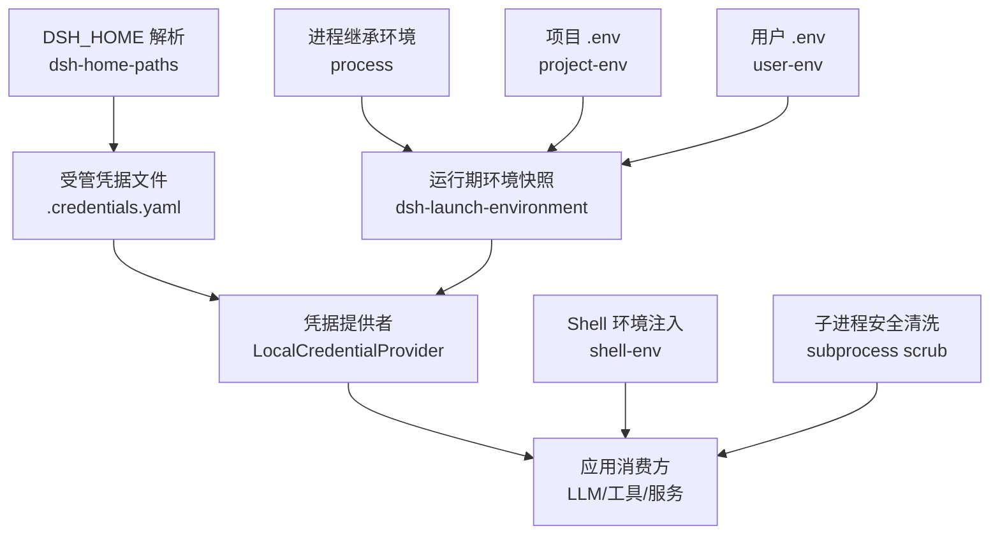
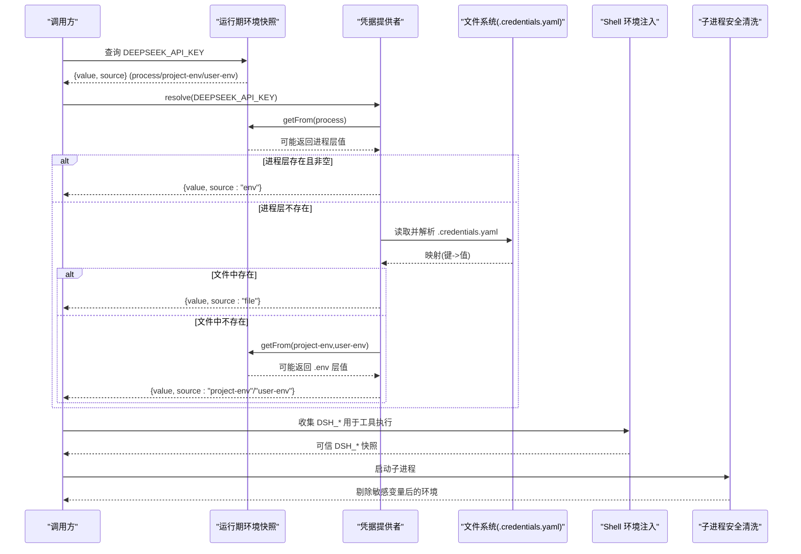
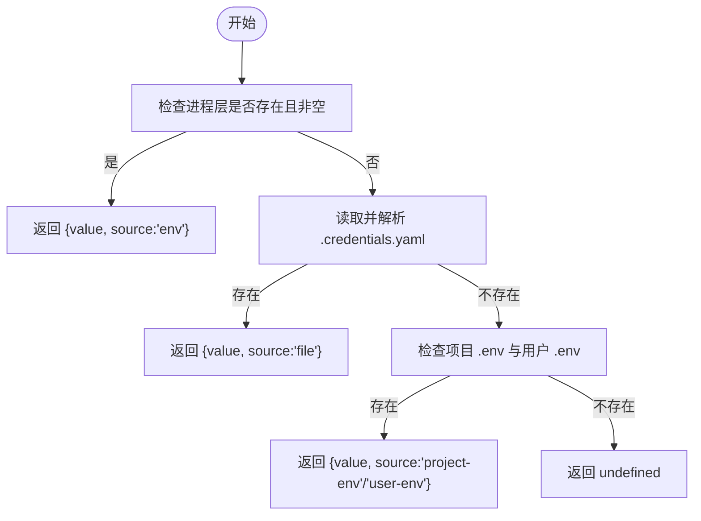
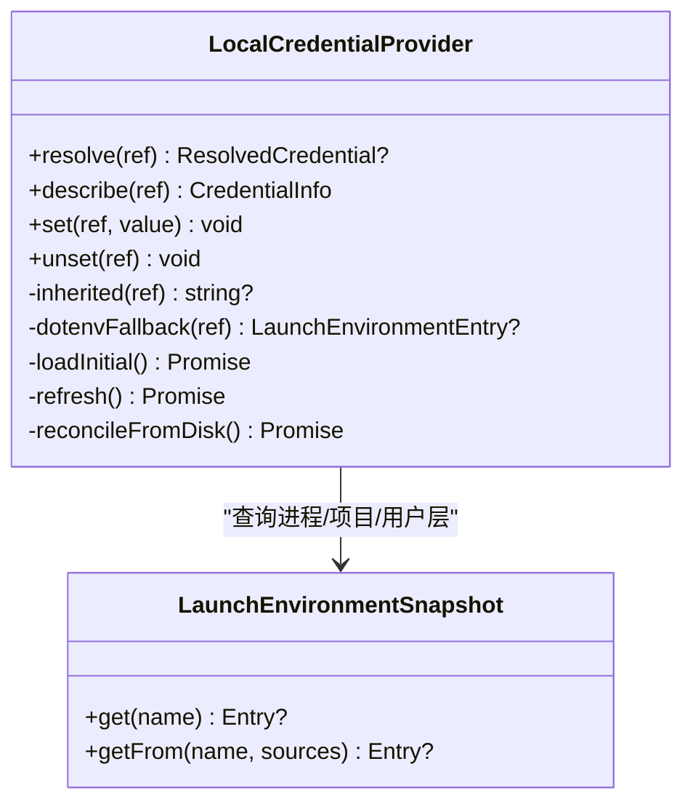
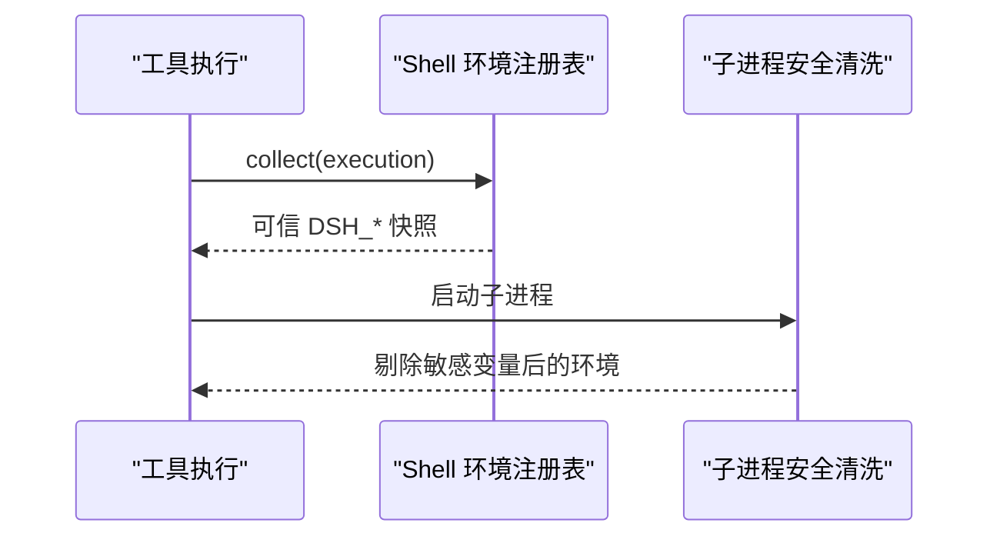
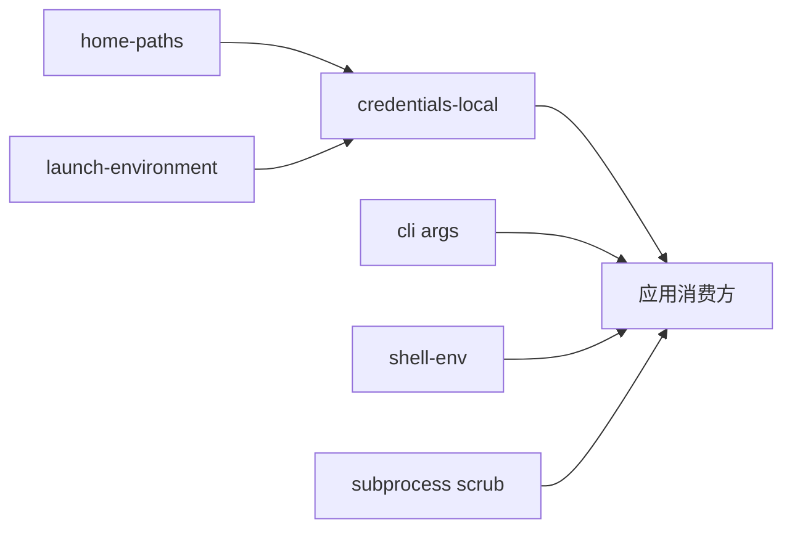

# 环境变量管理

<cite>
**本文引用的文件**
- [packages/util/home-paths/src/index.ts](file://packages/util/home-paths/src/index.ts)
- [packages/util/launch-environment/README.md](file://packages/util/launch-environment/README.md)
- [packages/credentials/credentials-local/src/index.ts](file://packages/credentials/credentials-local/src/index.ts)
- [docs/subsystems/credentials.md](file://docs/subsystems/credentials.md)
- [apps/cli/src/args.ts](file://apps/cli/src/args.ts)
- [packages/shell/shell-env/src/index.ts](file://packages/shell/shell-env/src/index.ts)
- [packages/subprocess/subprocess/tests/service.spec.ts](file://packages/subprocess/subprocess/tests/service.spec.ts)
</cite>

## 目录
1. [简介](#简介)
2. [项目结构](#项目结构)
3. [核心组件](#核心组件)
4. [架构总览](#架构总览)
5. [详细组件分析](#详细组件分析)
6. [依赖关系分析](#依赖关系分析)
7. [性能考虑](#性能考虑)
8. [故障排查指南](#故障排查指南)
9. [结论](#结论)
10. [附录](#附录)

## 简介
本文件面向 DeepSeek Harness 的环境变量与凭据管理，聚焦以下目标：
- 明确环境变量的加载顺序与优先级规则（进程继承、项目 .env、用户 .env、受管凭据文件）。
- 说明敏感信息的安全存储与管理最佳实践（权限校验、只读层保护、子进程隔离）。
- 解释 DSH_HOME、DSH_CONFIG_DIR 等关键环境变量的作用与默认行为。
- 指导如何配置和使用凭据文件 .credentials.yaml。
- 提供不同部署环境下的环境变量配置示例。
- 介绍环境变量验证与安全检查机制，帮助用户正确维护运行时配置。

## 项目结构
DeepSeek Harness 将“运行期环境快照”和“凭据来源分层”解耦为独立模块：
- 运行期环境快照：通过 dsh-launch-environment 记录每个值来自哪一层（进程、项目 .env、用户 .env），并提供不可变视图供消费方解析。
- 凭据提供者：dsh-credentials-local 以 $DSH_HOME/.credentials.yaml 为受管可写源，并叠加到环境层之上或之下形成最终可见的凭据值。
- 路径与家目录：dsh-home-paths 统一解析 DSH_HOME 及默认 ~/.dsh，并提供路径工具。
- CLI 与 Shell：CLI 参数影响配置装配；Shell 环境注册器负责向子工具注入可信的 DSH_* 变量。
- 子进程安全：子进程启动前会清理父进程中的敏感变量，避免泄露。

图表来源
- [packages/util/launch-environment/README.md:1-37](file://packages/util/launch-environment/README.md#L1-L37)
- [packages/credentials/credentials-local/src/index.ts:1-497](file://packages/credentials/credentials-local/src/index.ts#L1-L497)
- [packages/util/home-paths/src/index.ts:1-113](file://packages/util/home-paths/src/index.ts#L1-L113)
- [packages/shell/shell-env/src/index.ts:147-176](file://packages/shell/shell-env/src/index.ts#L147-L176)
- [packages/subprocess/subprocess/tests/service.spec.ts:78-100](file://packages/subprocess/subprocess/tests/service.spec.ts#L78-L100)

章节来源
- [packages/util/launch-environment/README.md:1-37](file://packages/util/launch-environment/README.md#L1-L37)
- [packages/util/home-paths/src/index.ts:1-113](file://packages/util/home-paths/src/index.ts#L1-L113)
- [packages/credentials/credentials-local/src/index.ts:1-497](file://packages/credentials/credentials-local/src/index.ts#L1-L497)

## 核心组件
- 运行期环境快照（dsh-launch-environment）
  - 维护一个不可变快照，记录每个值的来源层：进程继承、项目 .env、用户 .env。
  - 提供 get/getFrom 按信任顺序解析，支持显式限定来源集合，防止未来重排序引入不信任层。
- 凭据提供者（LocalCredentialProvider）
  - 以 $DSH_HOME/.credentials.yaml 为受管可写源，严格校验 YAML 结构与权限。
  - 解析顺序：进程继承 > 受管文件 > 项目 .env > 用户 .env。
  - 提供 resolve/describe/set/unset，支持热重载与外部编辑观察。
- 家目录与路径（dsh-home-paths）
  - 解析 DSH_HOME，默认 ~/.dsh；支持 ~ 展开、空值视为未设置。
  - 提供 dshHomePath 拼接子路径与显示名称。
- Shell 环境注入（shell-env）
  - 为工具执行构建可信的 DSH_* 快照，包含 DSH_HOME、会话 ID 等。
- 子进程安全（subprocess scrub）
  - 启动子进程时剔除 DSH_* 与凭据形变量，保留 PATH 等必要项。

章节来源
- [packages/util/launch-environment/README.md:1-37](file://packages/util/launch-environment/README.md#L1-L37)
- [packages/credentials/credentials-local/src/index.ts:1-497](file://packages/credentials/credentials-local/src/index.ts#L1-L497)
- [packages/util/home-paths/src/index.ts:1-113](file://packages/util/home-paths/src/index.ts#L1-L113)
- [packages/shell/shell-env/src/index.ts:147-176](file://packages/shell/shell-env/src/index.ts#L147-L176)
- [packages/subprocess/subprocess/tests/service.spec.ts:78-100](file://packages/subprocess/subprocess/tests/service.spec.ts#L78-L100)

## 架构总览
下图展示从进程启动到凭据解析的关键流程，以及各层的信任关系与边界。

图表来源
- [packages/util/launch-environment/README.md:1-37](file://packages/util/launch-environment/README.md#L1-L37)
- [packages/credentials/credentials-local/src/index.ts:1-497](file://packages/credentials/credentials-local/src/index.ts#L1-L497)
- [packages/shell/shell-env/src/index.ts:147-176](file://packages/shell/shell-env/src/index.ts#L147-L176)
- [packages/subprocess/subprocess/tests/service.spec.ts:78-100](file://packages/subprocess/subprocess/tests/service.spec.ts#L78-L100)

## 详细组件分析

### 环境变量加载顺序与优先级
- 运行期环境快照（dsh-launch-environment）
  - 层定义与信任顺序：进程继承 > 项目 .env > 用户 .env。
  - 解析策略：get(name) 按信任顺序搜索；getFrom(name, sources) 仅搜索指定层，保持信任顺序不变。
  - 大小写匹配遵循平台规则（POSIX 精确匹配，Windows 大小写不敏感）。
- 凭据提供者（LocalCredentialProvider）
  - 解析顺序：进程继承（只读，最高优先）> 受管文件（可写）> 项目 .env > 用户 .env。
  - 若进程层存在且非空，则直接返回；否则尝试受管文件；再回退到 .env 层。
  - 描述接口 describe 会暴露当前来源与是否可写（进程层不可写）。

图表来源
- [packages/util/launch-environment/README.md:1-37](file://packages/util/launch-environment/README.md#L1-L37)
- [packages/credentials/credentials-local/src/index.ts:1-497](file://packages/credentials/credentials-local/src/index.ts#L1-L497)

章节来源
- [packages/util/launch-environment/README.md:1-37](file://packages/util/launch-environment/README.md#L1-L37)
- [packages/credentials/credentials-local/src/index.ts:1-497](file://packages/credentials/credentials-local/src/index.ts#L1-L497)

### 关键环境变量：DSH_HOME 与 DSH_CONFIG_DIR
- DSH_HOME
  - 作用：定义 Harness 的用户数据根目录，所有凭据、缓存、配置等位于该目录下。
  - 解析优先级：显式传入路径 > 环境变量 DSH_HOME > 默认 ~/.dsh。
  - 空值处理：空或空白字符串视为未设置，回退到默认路径。
  - 显示名称：默认路径显示为 ~/.dsh，自定义路径显示为 $DSH_HOME。
- DSH_CONFIG_DIR
  - 在仓库中未发现对 DSH_CONFIG_DIR 的直接实现引用；常见做法是通过 DSH_HOME 派生配置目录（如 $DSH_HOME/profiles、$DSH_HOME/cordis.patch.yml）。
  - 如需使用，建议通过 DSH_HOME 间接控制配置位置，或在 CLI 参数中指定配置文件路径。

章节来源
- [packages/util/home-paths/src/index.ts:1-113](file://packages/util/home-paths/src/index.ts#L1-L113)
- [apps/cli/src/args.ts:131-145](file://apps/cli/src/args.ts#L131-L145)

### 凭据文件 .credentials.yaml 的配置与使用
- 文件位置：默认位于 $DSH_HOME/.credentials.yaml；可通过插件配置 path 覆盖。
- 文件格式：严格的键值映射，键必须为 POSIX 标识符（即合法的凭证引用名），值为非空字符串。
- 权限要求：文件需仅所有者可读（POSIX 模式 0600），启动时会校验；若权限过宽将拒绝加载。
- 写入与热更新：
  - set/unset 通过原子写入与文件锁保证并发安全。
  - 支持监听文件变化，外部编辑可热发布到内存快照。
- 与 .env 的关系：
  - 进程层始终最高优先；受管文件次之；.env 作为回退层。
  - 若进程层已提供某键，则无法通过 set 写入（会被视为被只读层遮挡）。

图表来源
- [packages/credentials/credentials-local/src/index.ts:1-497](file://packages/credentials/credentials-local/src/index.ts#L1-L497)
- [packages/util/launch-environment/README.md:1-37](file://packages/util/launch-environment/README.md#L1-L37)

章节来源
- [packages/credentials/credentials-local/src/index.ts:1-497](file://packages/credentials/credentials-local/src/index.ts#L1-L497)
- [docs/subsystems/credentials.md:1-134](file://docs/subsystems/credentials.md#L1-L134)

### Shell 环境注入与子进程安全
- Shell 环境注入
  - collect(execution) 构建可信的 DSH_* 快照，包含 DSH_HOME、会话 ID 等，并按贡献者声明聚合。
  - 仅允许已声明的变量进入，防止任意键污染。
- 子进程安全清洗
  - 启动子进程前剔除 DSH_* 与凭据形变量（大小写不敏感），保留 PATH 等必要项。
  - 避免将敏感信息泄露到不受信的执行环境中。

图表来源
- [packages/shell/shell-env/src/index.ts:147-176](file://packages/shell/shell-env/src/index.ts#L147-L176)
- [packages/subprocess/subprocess/tests/service.spec.ts:78-100](file://packages/subprocess/subprocess/tests/service.spec.ts#L78-L100)

章节来源
- [packages/shell/shell-env/src/index.ts:147-176](file://packages/shell/shell-env/src/index.ts#L147-L176)
- [packages/subprocess/subprocess/tests/service.spec.ts:78-100](file://packages/subprocess/subprocess/tests/service.spec.ts#L78-L100)

## 依赖关系分析
- dsh-launch-environment 为凭据提供者提供跨层的环境访问能力，确保凭据解析遵循信任顺序。
- dsh-home-paths 为凭据文件定位与显示提供基础路径能力。
- CLI 通过 args 传递 profile、patch、dump-config 等选项，影响配置装配与输出。
- shell-env 与 subprocess 共同保障工具与子进程环境的可信性与安全性。

图表来源
- [packages/util/home-paths/src/index.ts:1-113](file://packages/util/home-paths/src/index.ts#L1-L113)
- [packages/util/launch-environment/README.md:1-37](file://packages/util/launch-environment/README.md#L1-L37)
- [packages/credentials/credentials-local/src/index.ts:1-497](file://packages/credentials/credentials-local/src/index.ts#L1-L497)
- [apps/cli/src/args.ts:131-145](file://apps/cli/src/args.ts#L131-L145)
- [packages/shell/shell-env/src/index.ts:147-176](file://packages/shell/shell-env/src/index.ts#L147-L176)
- [packages/subprocess/subprocess/tests/service.spec.ts:78-100](file://packages/subprocess/subprocess/tests/service.spec.ts#L78-L100)

章节来源
- [packages/util/home-paths/src/index.ts:1-113](file://packages/util/home-paths/src/index.ts#L1-L113)
- [packages/util/launch-environment/README.md:1-37](file://packages/util/launch-environment/README.md#L1-L37)
- [packages/credentials/credentials-local/src/index.ts:1-497](file://packages/credentials/credentials-local/src/index.ts#L1-L497)
- [apps/cli/src/args.ts:131-145](file://apps/cli/src/args.ts#L131-L145)
- [packages/shell/shell-env/src/index.ts:147-176](file://packages/shell/shell-env/src/index.ts#L147-L176)
- [packages/subprocess/subprocess/tests/service.spec.ts:78-100](file://packages/subprocess/subprocess/tests/service.spec.ts#L78-L100)

## 性能考虑
- 凭据文件热更新：基于 chokidar 的文件监听与去抖窗口，减少频繁重读带来的开销。
- 操作队列：写操作与刷新通过单线程队列串行化，避免并发竞争与状态不一致。
- 原子写入与文件锁：确保并发写入时的数据一致性与完整性。
- 子进程环境最小化：仅传递必要变量，降低子进程初始化成本与安全风险。

[本节为通用性能讨论，无需特定文件引用]

## 故障排查指南
- 凭据文件权限错误
  - 现象：启动时报错提示文件可读范围过大。
  - 处理：将 .credentials.yaml 设置为仅所有者可读（POSIX 0600）。
- 凭据文件内容无效
  - 现象：YAML 解析失败、键非法、值为空或重复键。
  - 处理：修正 YAML 格式，确保键为合法 POSIX 标识符，值为非空字符串，删除重复键。
- 进程层遮挡导致无法写入
  - 现象：describe 显示 source 为 env 且 writable 为 false；set 抛出遮挡错误。
  - 处理：在启动 dsh 的 shell 中移除或修改对应环境变量。
- 子进程仍出现敏感变量
  - 现象：子进程继承了不应存在的 DSH_* 或凭据形变量。
  - 处理：确认使用了子进程安全清洗逻辑，避免手动透传敏感变量。

章节来源
- [packages/credentials/credentials-local/src/index.ts:1-497](file://packages/credentials/credentials-local/src/index.ts#L1-L497)
- [packages/subprocess/subprocess/tests/service.spec.ts:78-100](file://packages/subprocess/subprocess/tests/service.spec.ts#L78-L100)

## 结论
DeepSeek Harness 通过“运行期环境快照 + 凭据提供者分层”的设计，实现了清晰、安全、可审计的环境变量与凭据管理。DSH_HOME 作为用户数据根目录统一管理凭据与配置；.credentials.yaml 提供受管、可写的凭据存储；Shell 与子进程边界确保敏感信息不被泄露。遵循本文的加载顺序、安全实践与故障排查步骤，可在多部署环境下稳定、安全地管理运行时环境变量。

[本节为总结性内容，无需特定文件引用]

## 附录

### 环境变量加载顺序与优先级速查
- 运行期环境快照（按信任顺序）：进程继承 > 项目 .env > 用户 .env。
- 凭据解析顺序：进程继承（只读）> 受管文件（可写）> 项目 .env > 用户 .env。
- DSH_HOME 解析：显式路径 > DSH_HOME > ~/.dsh；空值视为未设置。

章节来源
- [packages/util/launch-environment/README.md:1-37](file://packages/util/launch-environment/README.md#L1-L37)
- [packages/credentials/credentials-local/src/index.ts:1-497](file://packages/credentials/credentials-local/src/index.ts#L1-L497)
- [packages/util/home-paths/src/index.ts:1-113](file://packages/util/home-paths/src/index.ts#L1-L113)

### 不同部署环境下的环境变量配置示例
- 本地开发
  - 设置 DSH_HOME 指向工作区内的私有目录（例如 ~/dev-dsh）。
  - 在项目根目录放置 .env 提供模型端点等非敏感配置。
  - 将 API Key 放入 $DSH_HOME/.credentials.yaml，并通过 UI 或命令行写入。
- CI/容器
  - 通过进程环境变量注入密钥（如 DEEPSEEK_API_KEY），利用进程层最高优先特性。
  - 不建议在镜像中持久化密钥；每次构建注入即可。
- 生产服务器
  - 使用系统级环境变量或编排平台注入密钥，保持只读。
  - 将需要持久化的密钥存入 .credentials.yaml，并确保文件权限为 0600。
  - 通过 DSH_HOME 集中管理用户数据与配置。

[本节为概念性示例，无需特定文件引用]

### 环境变量验证与安全检查机制
- 凭据文件校验
  - YAML 结构、键合法性、值类型与非空约束。
  - 权限校验：拒绝组/其他可读的文件。
- 进程层遮挡保护
  - 当进程层提供某键时，禁止写入该键，避免“看似成功实则无效”的误导。
- 子进程隔离
  - 启动子进程前剔除 DSH_* 与凭据形变量，保留 PATH 等必要项。

章节来源
- [packages/credentials/credentials-local/src/index.ts:1-497](file://packages/credentials/credentials-local/src/index.ts#L1-L497)
- [packages/subprocess/subprocess/tests/service.spec.ts:78-100](file://packages/subprocess/subprocess/tests/service.spec.ts#L78-L100)