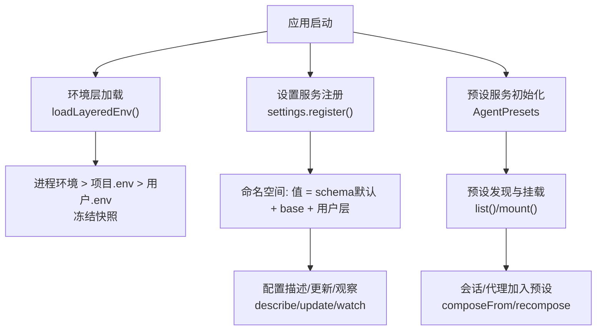
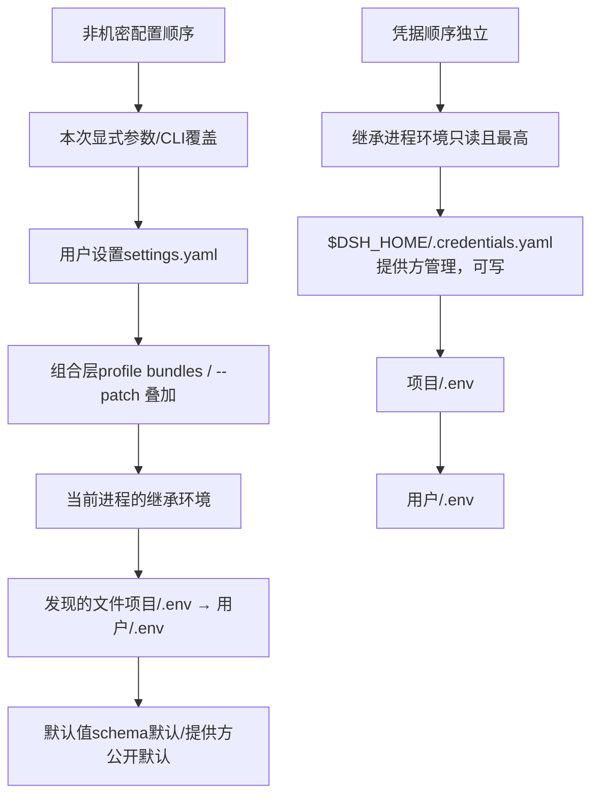
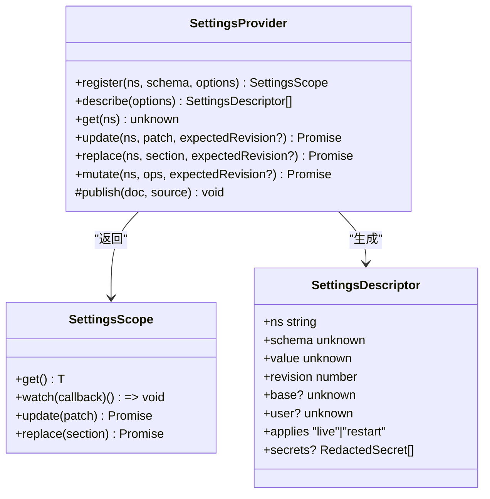
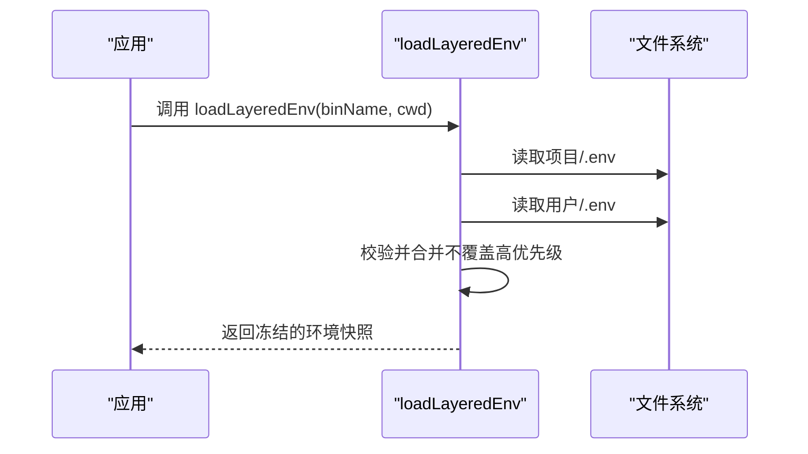
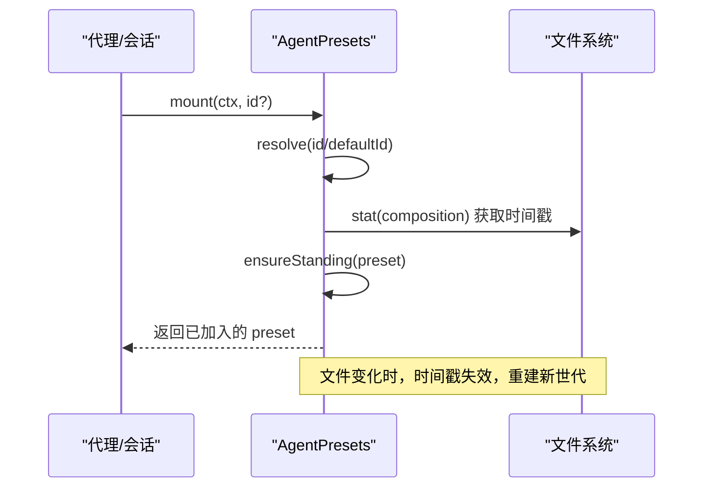
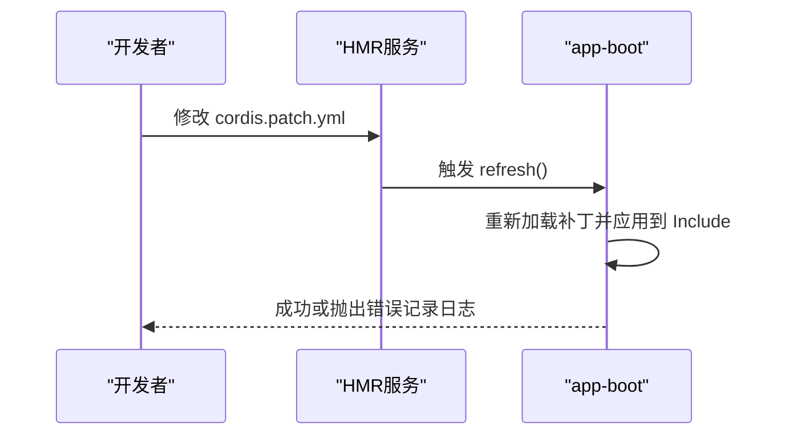
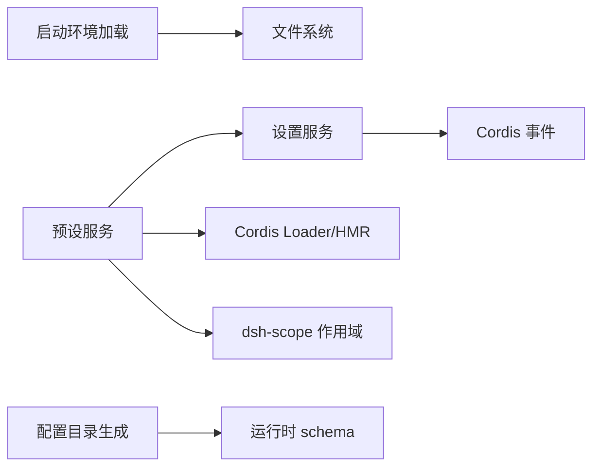

# 配置管理

<cite>
**本文引用的文件**
- [packages/preset/agent-presets/src/index.ts](file://packages/preset/agent-presets/src/index.ts)
- [packages/preset/agent-presets/src/preset.ts](file://packages/preset/agent-presets/src/preset.ts)
- [packages/settings/settings/src/index.ts](file://packages/settings/settings/src/index.ts)
- [packages/boot/app-boot/src/index.ts](file://packages/boot/app-boot/src/index.ts)
- [.agents/notes/implemented/architecture/2026-08-04-configuration-source-ownership.md](file://.agents/notes/implemented/architecture/2026-08-04-configuration-source-ownership.md)
- [.agents/notes/implemented/bug-fix/2026-07-20-config-hot-reload-resilience.md](file://.agents/notes/implemented/bug-fix/2026-07-20-config-hot-reload-resilience.md)
- [scripts/verify-config-source-ownership.ts](file://scripts/verify-config-source-ownership.ts)
- [packages/boot/app-boot/tests/hmr-config.spec.ts](file://packages/boot/app-boot/tests/hmr-config.spec.ts)
- [packages/settings/settings/tests/redact.spec.ts](file://packages/settings/settings/tests/redact.spec.ts)
- [docs/config-catalog.md](file://docs/config-catalog.md)
</cite>

## 目录
1. [简介](#简介)
2. [项目结构](#项目结构)
3. [核心组件](#核心组件)
4. [架构总览](#架构总览)
5. [详细组件分析](#详细组件分析)
6. [依赖关系分析](#依赖关系分析)
7. [性能考虑](#性能考虑)
8. [故障排查指南](#故障排查指南)
9. [结论](#结论)
10. [附录](#附录)

## 简介
本文件面向 DeepSeek Harness 的配置管理系统，系统性说明配置的层次结构与优先级、环境变量与凭据安全、预设（Preset）系统的使用与扩展、配置热重载与动态更新机制、以及配置验证与错误处理。目标是帮助用户高效理解并掌握复杂配置选项，提升配置效率与管理能力。

## 项目结构
DeepSeek Harness 的配置由多个子系统协作完成：
- 设置服务（Settings）：提供命名空间化的用户可编辑配置、合并策略、持久化与变更事件。
- 启动环境加载（App Boot）：负责进程环境、项目级与用户级 .env 的层级加载与环境快照。
- 预设系统（Agent Presets）：发现、挂载与生命周期管理“预设”组合，支持默认预设与用户自定义。
- 配置目录与文档：生成式配置目录（Config Catalog）与各子系统配置项参考。

**图示来源**
- [packages/boot/app-boot/src/index.ts:166-198](file://packages/boot/app-boot/src/index.ts#L166-L198)
- [packages/settings/settings/src/index.ts:350-512](file://packages/settings/settings/src/index.ts#L350-L512)
- [packages/preset/agent-presets/src/index.ts:82-193](file://packages/preset/agent-presets/src/index.ts#L82-L193)

**章节来源**
- [packages/boot/app-boot/src/index.ts:166-198](file://packages/boot/app-boot/src/index.ts#L166-L198)
- [packages/settings/settings/src/index.ts:350-512](file://packages/settings/settings/src/index.ts#L350-L512)
- [packages/preset/agent-presets/src/index.ts:82-193](file://packages/preset/agent-presets/src/index.ts#L82-L193)
- [docs/config-catalog.md:167-203](file://docs/config-catalog.md#L167-L203)

## 核心组件
- 设置服务（SettingsProvider）
  - 提供命名空间注册、三层合并（schema默认 → base → 用户层）、序列化写队列、变更事件与描述接口。
  - 支持路径操作 mutate、并发冲突检测（revision）、敏感字段脱敏（redactSecrets）。
- 启动环境加载（loadLayeredEnv）
  - 按优先级合并进程环境、项目 .env、用户 .env，生成不可变的环境快照，避免覆盖更高优先级的变量。
- 预设服务（AgentPresets）
  - 扫描预设根目录、解析元数据、维护“常驻挂载”（standing mount），为每个会话/代理提供一致的能力集合。
  - 支持默认预设、复制/删除本地预设、重连（recompose）到不同预设。

**章节来源**
- [packages/settings/settings/src/index.ts:350-800](file://packages/settings/settings/src/index.ts#L350-L800)
- [packages/boot/app-boot/src/index.ts:166-198](file://packages/boot/app-boot/src/index.ts#L166-L198)
- [packages/preset/agent-presets/src/index.ts:82-573](file://packages/preset/agent-presets/src/index.ts#L82-L573)

## 架构总览
下图展示非机密配置与凭据两类不同的优先级顺序，以及它们在运行时的作用域与影响范围。

**图示来源**
- [.agents/notes/implemented/architecture/2026-08-04-configuration-source-ownership.md:17-39](file://.agents/notes/implemented/architecture/2026-08-04-configuration-source-ownership.md#L17-L39)

**章节来源**
- [.agents/notes/implemented/architecture/2026-08-04-configuration-source-ownership.md:17-39](file://.agents/notes/implemented/architecture/2026-08-04-configuration-source-ownership.md#L17-L39)

## 详细组件分析

### 设置服务（SettingsProvider）
- 注册与合并
  - 通过 register(ns, schema, { base, applies, validate }) 注册命名空间；resolve 时按 schema默认 → base → 用户层合并。
  - 支持 live/restart 生效时机，validate 用于跨字段约束校验。
- 写入与持久化
  - update/replace/mutate 串行化写入，提交前进行 JSON 形状校验与冲突检测（expectedRevision）。
  - publish 接收外部文档变更，逐命名空间重新解析并通知观察者。
- 描述与脱敏
  - describe 暴露 schema、value、base、user、applies 等；wire 层必须开启 redactSecrets 以隐藏敏感字段。

**图示来源**
- [packages/settings/settings/src/index.ts:350-512](file://packages/settings/settings/src/index.ts#L350-L512)
- [packages/settings/settings/src/index.ts:514-648](file://packages/settings/settings/src/index.ts#L514-L648)

**章节来源**
- [packages/settings/settings/src/index.ts:350-800](file://packages/settings/settings/src/index.ts#L350-L800)
- [packages/settings/settings/tests/redact.spec.ts:115-135](file://packages/settings/settings/tests/redact.spec.ts#L115-L135)

### 启动环境加载（loadLayeredEnv）
- 优先级与快照
  - 先解析项目 .env 与用户 .env，再按优先级注入 process.env，最终生成包含来源信息的冻结快照。
- 安全边界
  - 不覆盖已存在的高优先级变量；对引导期变量有严格限制，防止误用。

**图示来源**
- [packages/boot/app-boot/src/index.ts:166-198](file://packages/boot/app-boot/src/index.ts#L166-L198)

**章节来源**
- [packages/boot/app-boot/src/index.ts:166-198](file://packages/boot/app-boot/src/index.ts#L166-L198)

### 预设系统（AgentPresets）
- 发现与元数据
  - 扫描 roots（含用户根），解析 preset.yml 元数据（name/description/order），按 id 稳定排序。
- 常驻挂载与版本控制
  - 基于 composition 文件的 mtime+size 作为“时间戳”，同一 preset 仅一次挂载；文件变化触发新世代。
- 会话/代理加入
  - mount 将代理 scope 绑定到 preset 的 standing key；composeFrom 使子代理继承父代理的 preset；recompose 可在无历史时切换 preset。
- 用户可写与清理
  - copy/remove 管理本地预设；删除后自动清理 stale 的 standing mount 并重置默认预设引用。

**图示来源**
- [packages/preset/agent-presets/src/index.ts:184-239](file://packages/preset/agent-presets/src/index.ts#L184-L239)
- [packages/preset/agent-presets/src/index.ts:490-534](file://packages/preset/agent-presets/src/index.ts#L490-L534)

**章节来源**
- [packages/preset/agent-presets/src/index.ts:82-573](file://packages/preset/agent-presets/src/index.ts#L82-L573)
- [packages/preset/agent-presets/src/preset.ts:1-94](file://packages/preset/agent-presets/src/preset.ts#L1-L94)

### 配置热重载与动态更新
- HMR 配置监听
  - registerConfig(filename, refresh) 精确监听单个配置文件，串行化刷新并返回异步 disposer；创建/变更/删除均被观察。
- 用户补丁层（cordis.patch.yml）
  - watchUserPatches 在 HMR 下重新加载补丁列表并应用到 Include，保证与启动时一致的组成顺序。
- 健壮性
  - 失败会被规范化为 Error 并广播 hmr/config-update-failed；回滚保持先前状态，避免部分应用导致的不一致。

**图示来源**
- [packages/boot/app-boot/src/index.ts:225-265](file://packages/boot/app-boot/src/index.ts#L225-L265)
- [packages/boot/app-boot/tests/hmr-config.spec.ts:101-169](file://packages/boot/app-boot/tests/hmr-config.spec.ts#L101-L169)
- [.agents/notes/implemented/bug-fix/2026-07-20-config-hot-reload-resilience.md:17-21](file://.agents/notes/implemented/bug-fix/2026-07-20-config-hot-reload-resilience.md#L17-L21)

**章节来源**
- [packages/boot/app-boot/src/index.ts:225-265](file://packages/boot/app-boot/src/index.ts#L225-L265)
- [packages/boot/app-boot/tests/hmr-config.spec.ts:101-169](file://packages/boot/app-boot/tests/hmr-config.spec.ts#L101-L169)
- [.agents/notes/implemented/bug-fix/2026-07-20-config-hot-reload-resilience.md:17-21](file://.agents/notes/implemented/bug-fix/2026-07-20-config-hot-reload-resilience.md#L17-L21)

### 配置验证与错误处理
- 设置层
  - JSON 形状校验（cloneJsonShaped）拒绝非 JSON 兼容类型；mutate 的路径操作强校验；write 队列中检查 expectedRevision 防并发冲突。
  - 外部文档变更通过 publish 重新解析，非法段保留上次有效值并告警。
- 源码合规
  - verify-config-source-ownership 禁止在 shipped 配置中内联凭据/端点，强制通过 credentials 与环境快照获取。
- 预设挂载
  - UnknownPresetError/PresetMountError 区分“未知预设”和“可用但无法挂载”的错误场景，便于上层给出明确提示。

**章节来源**
- [packages/settings/settings/src/index.ts:577-648](file://packages/settings/settings/src/index.ts#L577-L648)
- [scripts/verify-config-source-ownership.ts:25-56](file://scripts/verify-config-source-ownership.ts#L25-L56)
- [packages/preset/agent-presets/src/preset.ts:64-94](file://packages/preset/agent-presets/src/preset.ts#L64-L94)

## 依赖关系分析
- 设置服务依赖 Cordis 上下文与事件机制，对外暴露 describe/update/watch 等能力。
- 启动环境加载依赖文件系统与路径解析，输出冻结快照供后续模块使用。
- 预设服务依赖设置服务（默认预设）、Cordis Loader/HMR、dsh-scope 作用域绑定。
- 配置目录（Config Catalog）由脚本生成，确保声明与运行时 schema 一致。

**图示来源**
- [packages/settings/settings/src/index.ts:350-512](file://packages/settings/settings/src/index.ts#L350-L512)
- [packages/boot/app-boot/src/index.ts:166-198](file://packages/boot/app-boot/src/index.ts#L166-L198)
- [packages/preset/agent-presets/src/index.ts:82-193](file://packages/preset/agent-presets/src/index.ts#L82-L193)
- [docs/config-catalog.md:1-10](file://docs/config-catalog.md#L1-L10)

**章节来源**
- [packages/settings/settings/src/index.ts:350-512](file://packages/settings/settings/src/index.ts#L350-L512)
- [packages/boot/app-boot/src/index.ts:166-198](file://packages/boot/app-boot/src/index.ts#L166-L198)
- [packages/preset/agent-presets/src/index.ts:82-193](file://packages/preset/agent-presets/src/index.ts#L82-L193)
- [docs/config-catalog.md:1-10](file://docs/config-catalog.md#L1-L10)

## 性能考虑
- 设置层
  - 写队列串行化避免竞争；deepEqualJson 减少不必要的通知；watcher 回调串行执行，避免风暴。
- 预设层
  - 常驻挂载基于文件时间戳缓存，避免重复组装；删除/复制后及时清理 stale 挂载。
- 环境加载
  - 一次性解析并冻结快照，避免多次 IO 与拷贝。

[本节为通用指导，无需特定文件来源]

## 故障排查指南
- 设置冲突
  - 现象：update/replace/mutate 报 SETTINGS_CONFLICT。
  - 原因：expectedRevision 与当前不一致，存在并发写入。
  - 处理：重新读取 descriptor.revision 后重试。
- 无效存储段
  - 现象：外部编辑 settings 后警告并保留上次有效值。
  - 处理：修正存储段格式，重启或等待重新发布。
- 预设挂载失败
  - 现象：PresetMountError/UnknownPresetError。
  - 处理：检查 preset 目录是否完整、composition 是否可读、id 是否存在于 roots。
- 热重载失败
  - 现象：hmr/config-update-failed 事件。
  - 处理：查看日志定位解析/应用错误，必要时回滚到上一版本。

**章节来源**
- [packages/settings/settings/src/index.ts:577-648](file://packages/settings/settings/src/index.ts#L577-L648)
- [packages/preset/agent-presets/src/preset.ts:64-94](file://packages/preset/agent-presets/src/preset.ts#L64-L94)
- [.agents/notes/implemented/bug-fix/2026-07-20-config-hot-reload-resilience.md:17-21](file://.agents/notes/implemented/bug-fix/2026-07-20-config-hot-reload-resilience.md#L17-L21)

## 结论
DeepSeek Harness 的配置体系通过分层优先级、严格的凭据隔离、健壮的验证与热重载机制，提供了灵活而安全的配置管理能力。设置服务提供细粒度命名空间控制，启动环境加载确保环境变量安全注入，预设系统则让能力组合可复用、可演进。遵循本文的最佳实践，可显著提升配置效率与稳定性。

[本节为总结性内容，无需特定文件来源]

## 附录

### 环境变量管理与安全最佳实践
- 非机密配置顺序：本次显式 > 用户设置 > 组合层 > 继承环境 > 发现文件 > 默认值。
- 凭据顺序：继承环境（只读且最高）> $DSH_HOME/.credentials.yaml > 项目/.env > 用户/.env。
- 禁止在 shipped 配置中内联凭据/端点，统一通过 credentials 与环境快照获取。

**章节来源**
- [.agents/notes/implemented/architecture/2026-08-04-configuration-source-ownership.md:17-39](file://.agents/notes/implemented/architecture/2026-08-04-configuration-source-ownership.md#L17-L39)
- [scripts/verify-config-source-ownership.ts:25-56](file://scripts/verify-config-source-ownership.ts#L25-L56)

### 预设系统使用方法
- 内置预设：位于部署提供的 roots（system trust），如 minimal/standard/cordis/code。
- 自定义预设：在用户根（user trust）创建目录，放置 agent.cordis.yml 与 preset.yml，支持 name/description/order。
- 默认预设：通过 settings 的 agent-presets.default 指定；未选择时使用该默认。
- 复制/删除：copy(from, id, name?) 复制现有预设；remove(id) 删除本地预设并清理默认引用。

**章节来源**
- [packages/preset/agent-presets/src/index.ts:82-193](file://packages/preset/agent-presets/src/index.ts#L82-L193)
- [packages/preset/agent-presets/src/index.ts:365-416](file://packages/preset/agent-presets/src/index.ts#L365-L416)
- [docs/config-catalog.md:167-203](file://docs/config-catalog.md#L167-L203)

### 配置热重载与动态更新
- 使用 HMR 监听 cordis.patch.yml，实现用户补丁层的实时应用。
- 失败会标准化为 Error 并通过事件广播，确保可观测性与回滚一致性。

**章节来源**
- [packages/boot/app-boot/src/index.ts:225-265](file://packages/boot/app-boot/src/index.ts#L225-L265)
- [packages/boot/app-boot/tests/hmr-config.spec.ts:101-169](file://packages/boot/app-boot/tests/hmr-config.spec.ts#L101-L169)
- [.agents/notes/implemented/bug-fix/2026-07-20-config-hot-reload-resilience.md:17-21](file://.agents/notes/implemented/bug-fix/2026-07-20-config-hot-reload-resilience.md#L17-L21)

### 配置示例与最佳实践
- 设置层
  - 使用 register 声明 schema 与 base，利用 validate 表达跨字段约束。
  - 通过 describe 暴露 UI 所需信息，并在 wire 层启用 redactSecrets。
- 环境层
  - 将敏感信息放入进程环境或 .credentials.yaml，避免写入 .env。
- 预设层
  - 合理组织 roots，优先使用 system 预设，用户层仅覆盖必要差异。
  - 使用 order 控制显示顺序，确保 UI 体验稳定。

**章节来源**
- [packages/settings/settings/src/index.ts:350-512](file://packages/settings/settings/src/index.ts#L350-L512)
- [packages/settings/settings/tests/redact.spec.ts:115-135](file://packages/settings/settings/tests/redact.spec.ts#L115-L135)
- [packages/preset/agent-presets/src/index.ts:82-193](file://packages/preset/agent-presets/src/index.ts#L82-L193)