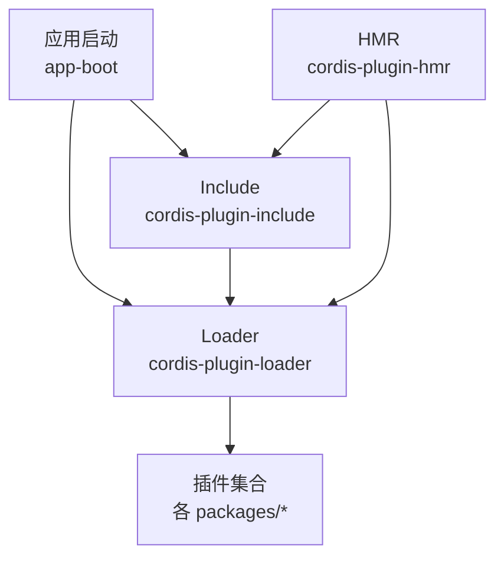
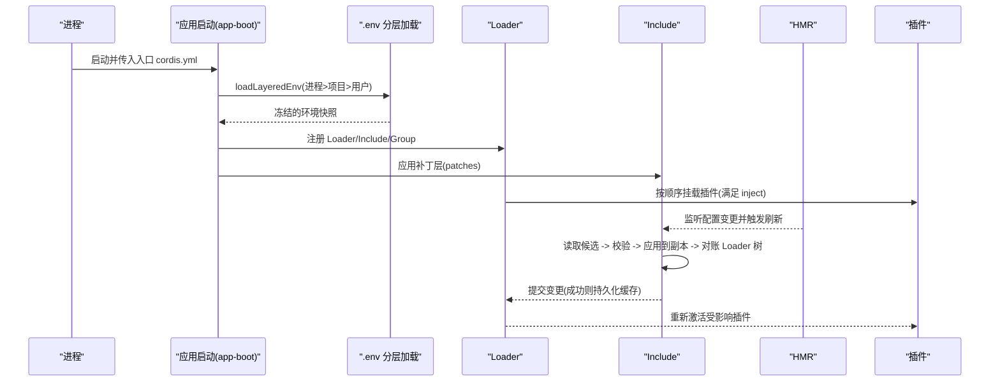
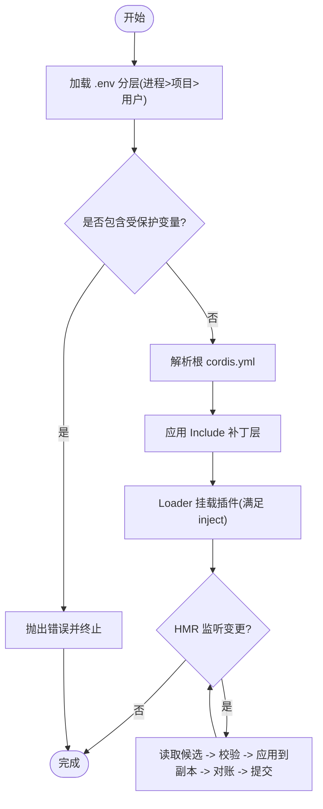
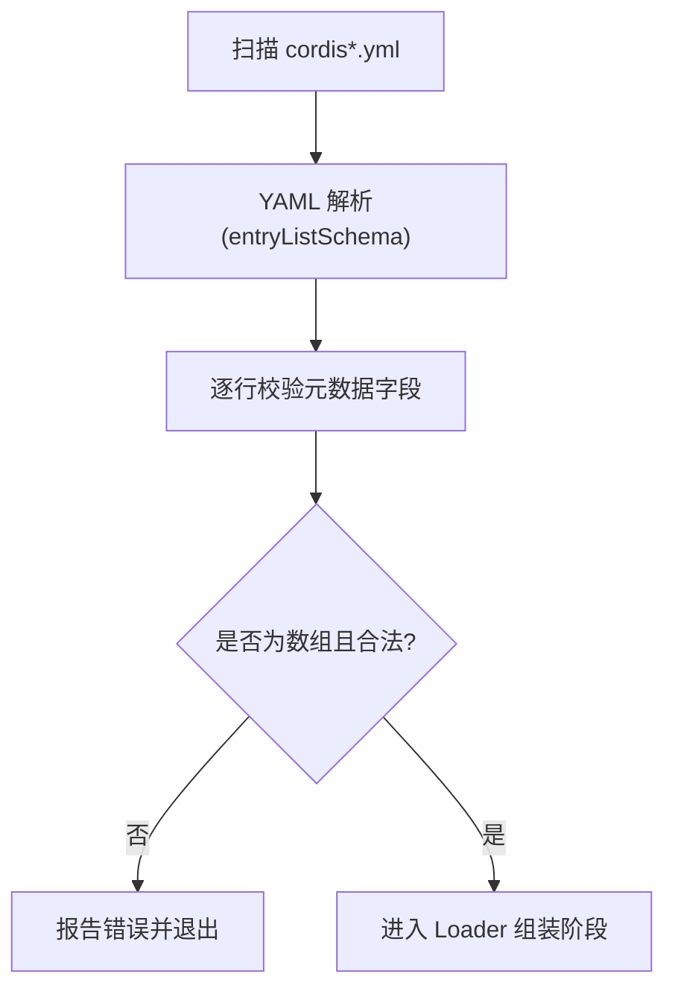
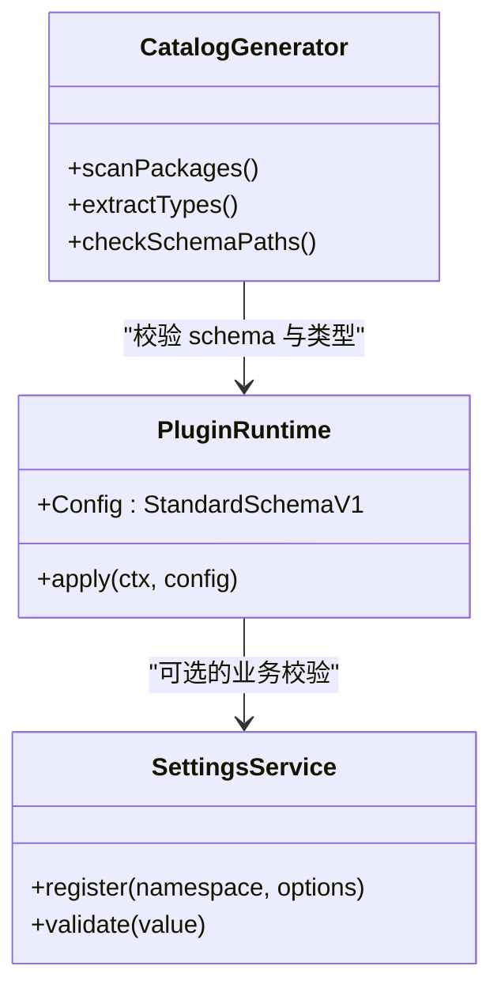
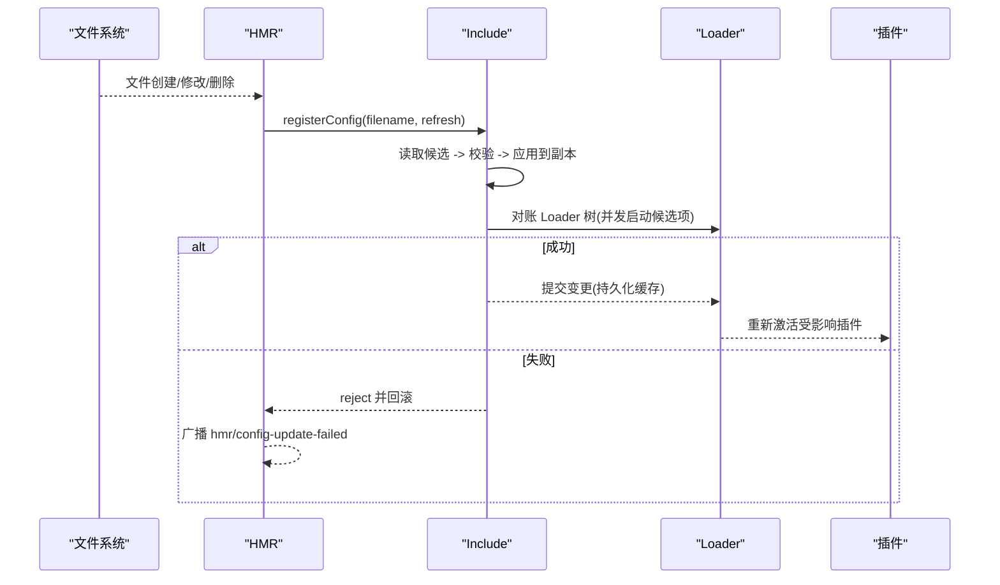
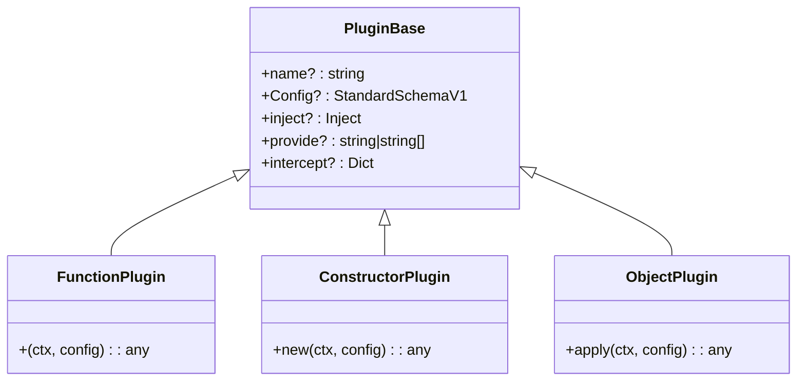
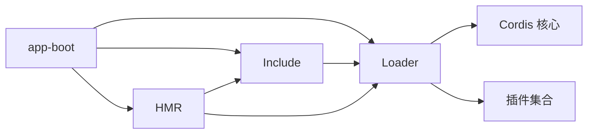

# 配置系统架构

<cite>
**本文引用的文件**
- [packages/boot/app-boot/src/index.ts](file://packages/boot/app-boot/src/index.ts)
- [scripts/cordis-config-files.ts](file://scripts/cordis-config-files.ts)
- [scripts/verify-cordis-config.ts](file://scripts/verify-cordis-config.ts)
- [scripts/gen-config-catalog.ts](file://scripts/gen-config-catalog.ts)
- [examples/acp-agent/cordis.yml](file://examples/acp-agent/cordis.yml)
- [apps/cli/config/agent-presets/cordis/agent.cordis.yml](file://apps/cli/config/agent-presets/cordis/agent.cordis.yml)
- [packages/settings/settings/src/index.ts](file://packages/settings/settings/src/index.ts)
- [packages/client/ui-settings-plugins/src/index.ts](file://packages/client/ui-settings-plugins/src/index.ts)
- [packages/boot/app-boot/tests/hmr-config.spec.ts](file://packages/boot/app-boot/tests/hmr-config.spec.ts)
- [packages/boot/app-boot/tests/user-patches.spec.ts](file://packages/boot/app-boot/tests/user-patches.spec.ts)
- [docs/cordis-api/inherited.md](file://docs/cordis-api/inherited.md)
- [.agents/notes/implemented/bug-fix/2026-07-20-config-hot-reload-resilience.zh.md](file://.agents/notes/implemented/bug-fix/2026-07-20-config-hot-reload-resilience.zh.md)
</cite>

## 目录
1. [简介](#简介)
2. [项目结构](#项目结构)
3. [核心组件](#核心组件)
4. [架构总览](#架构总览)
5. [详细组件分析](#详细组件分析)
6. [依赖关系分析](#依赖关系分析)
7. [性能考量](#性能考量)
8. [故障排查指南](#故障排查指南)
9. [结论](#结论)
10. [附录](#附录)

## 简介
本文件系统性阐述 DeepSeek Harness 的配置系统架构，覆盖以下主题：
- 配置的层次结构与优先级规则（进程环境、项目 .env、用户 .env、根 cordis.yml、Include 补丁层、HMR 热更新）
- cordis.yml 的解析机制与校验流程
- 配置验证系统（类型检查与运行时校验）
- 配置热重载机制与动态更新流程
- 插件配置接口与继承机制（组隔离、注入依赖、拦截配置）
- 扩展点与自定义配置类型开发指南
- 错误处理与调试技巧

## 项目结构
DeepSeek Harness 的配置由“应用启动引导 + Loader 组合 + Include 补丁 + HMR 热更新”共同构成。关键路径如下：
- 应用启动引导：负责加载 .env、解析入口配置文件、安装 Loader 守卫、暴露路径解析器并驱动 Cordis Loader 直到树稳定
- Loader：按数组顺序装载插件条目，支持 group/isolate/inject/disabled 等元数据
- Include：提供补丁层能力，允许在运行时对已解析的条目进行追加/修改/移除
- HMR：监听配置与模块变更，串行化刷新，保证原子性与可回滚

图表来源
- [packages/boot/app-boot/src/index.ts:1-200](file://packages/boot/app-boot/src/index.ts#L1-L200)
- [docs/cordis-api/inherited.md:23-39](file://docs/cordis-api/inherited.md#L23-L39)

章节来源
- [packages/boot/app-boot/src/index.ts:1-200](file://packages/boot/app-boot/src/index.ts#L1-L200)
- [docs/cordis-api/inherited.md:23-39](file://docs/cordis-api/inherited.md#L23-L39)

## 核心组件
- 应用启动与配置解析
  - 解析入口配置文件路径（支持 replay 模式切换为快照文件）
  - 分层加载 .env（进程 > 项目目录 > 用户目录），拒绝危险变量名
  - 将 dshHomePath 注入 Context，供 !!js 表达式使用
  - 初始化 Loader、Include、Group，并驱动到稳定状态
- Loader 与插件元数据
  - 以数组形式声明插件条目，支持 id/name/group/isolate/inject/intercept/disabled/config
  - 在激活前运行 internal/config 水线，用于插值与校验
- Include 补丁层
  - 通过 patches 选项对已解析条目进行追加/修改/删除
  - 支持 Include.refresh() 读取候选内容、校验、应用到副本、对账 Loader 树后提交
- HMR 热更新
  - 监听配置与模块变化，串行化刷新，失败广播 hmr/config-update-failed
  - registerConfig(filename, refresh) 精确路径监听，返回异步 disposer

章节来源
- [packages/boot/app-boot/src/index.ts:52-69](file://packages/boot/app-boot/src/index.ts#L52-L69)
- [packages/boot/app-boot/src/index.ts:71-198](file://packages/boot/app-boot/src/index.ts#L71-L198)
- [docs/cordis-api/inherited.md:23-39](file://docs/cordis-api/inherited.md#L23-L39)
- [.agents/notes/implemented/bug-fix/2026-07-20-config-hot-reload-resilience.zh.md:17-37](file://.agents/notes/implemented/bug-fix/2026-07-20-config-hot-reload-resilience.zh.md#L17-L37)

## 架构总览
下图展示从进程启动到配置生效的关键调用链，包括环境变量加载、配置文件解析、Loader 组装、Include 补丁与 HMR 热更新。

图表来源
- [packages/boot/app-boot/src/index.ts:1-200](file://packages/boot/app-boot/src/index.ts#L1-L200)
- [packages/boot/app-boot/tests/hmr-config.spec.ts:101-169](file://packages/boot/app-boot/tests/hmr-config.spec.ts#L101-L169)
- [packages/boot/app-boot/tests/user-patches.spec.ts:315-341](file://packages/boot/app-boot/tests/user-patches.spec.ts#L315-L341)

## 详细组件分析

### 配置层次与优先级
- 环境变量优先级：进程环境 > 项目目录 .env > 用户目录 .env；禁止在 .env 中设置受保护的引导变量
- 配置文件优先级：根 cordis.yml 为基础，Include 补丁层在后，HMR 实时刷新最终覆盖
- 插件条目级覆盖：同 id 的 later 层条目会覆盖 earlier 层（Loader 保持顺序语义）

图表来源
- [packages/boot/app-boot/src/index.ts:71-198](file://packages/boot/app-boot/src/index.ts#L71-L198)
- [packages/boot/app-boot/tests/user-patches.spec.ts:315-341](file://packages/boot/app-boot/tests/user-patches.spec.ts#L315-L341)

章节来源
- [packages/boot/app-boot/src/index.ts:71-198](file://packages/boot/app-boot/src/index.ts#L71-L198)
- [examples/acp-agent/cordis.yml:1-193](file://examples/acp-agent/cordis.yml#L1-L193)
- [apps/cli/config/agent-presets/cordis/agent.cordis.yml:1-263](file://apps/cli/config/agent-presets/cordis/agent.cordis.yml#L1-L263)

### cordis.yml 解析机制
- 发现与扫描：脚本通过 glob 匹配 **/*cordis*.yml，排除翻译侧车与 vendor/node_modules
- 解析与校验：使用 js-yaml 加载，并以 entryListSchema 校验根必须为数组；逐行校验元数据字段
- 示例与解析：示例中的 cordis.yml 展示了插件 id/name/config 及 !!js 表达式的使用

图表来源
- [scripts/cordis-config-files.ts:1-18](file://scripts/cordis-config-files.ts#L1-L18)
- [scripts/verify-cordis-config.ts:69-99](file://scripts/verify-cordis-config.ts#L69-L99)
- [examples/acp-agent/cordis.yml:1-193](file://examples/acp-agent/cordis.yml#L1-L193)

章节来源
- [scripts/cordis-config-files.ts:1-18](file://scripts/cordis-config-files.ts#L1-L18)
- [scripts/verify-cordis-config.ts:69-99](file://scripts/verify-cordis-config.ts#L69-L99)
- [examples/acp-agent/cordis.yml:1-193](file://examples/acp-agent/cordis.yml#L1-L193)

### 配置验证系统（类型检查与运行时校验）
- 静态生成校验：gen-config-catalog 遍历包入口，提取配置类型与 Schemastery schema，交叉核对 schema 键路径与声明类型，确保文档与实现一致
- 运行时校验：插件可通过 Config (StandardSchemaV1) 定义校验器；Loader 在激活前对 fiber 配置执行 waterfalls 与校验
- 设置服务校验：settings 提供 validate 钩子，用于跨字段约束或业务规则校验，失败时拒绝写入并保持上次有效值

图表来源
- [scripts/gen-config-catalog.ts:309-757](file://scripts/gen-config-catalog.ts#L309-L757)
- [packages/settings/settings/src/index.ts:36-62](file://packages/settings/settings/src/index.ts#L36-L62)

章节来源
- [scripts/gen-config-catalog.ts:309-757](file://scripts/gen-config-catalog.ts#L309-L757)
- [packages/settings/settings/src/index.ts:36-62](file://packages/settings/settings/src/index.ts#L36-L62)

### 配置热重载与动态更新流程
- HMR 监听：registerConfig 精确路径监听，串行化并合并刷新，返回异步 disposer
- Include 刷新：读取并校验候选内容，应用到副本，对账 Loader 树，成功后才提交缓存与解析数据
- 事务性回滚：失败时恢复先前插件/配置，广播 hmr/config-update-failed，避免部分应用导致的不一致

图表来源
- [packages/boot/app-boot/tests/hmr-config.spec.ts:101-169](file://packages/boot/app-boot/tests/hmr-config.spec.ts#L101-L169)
- [packages/boot/app-boot/tests/user-patches.spec.ts:315-341](file://packages/boot/app-boot/tests/user-patches.spec.ts#L315-L341)
- [.agents/notes/implemented/bug-fix/2026-07-20-config-hot-reload-resilience.zh.md:17-37](file://.agents/notes/implemented/bug-fix/2026-07-20-config-hot-reload-resilience.zh.md#L17-L37)

章节来源
- [packages/boot/app-boot/tests/hmr-config.spec.ts:101-169](file://packages/boot/app-boot/tests/hmr-config.spec.ts#L101-L169)
- [packages/boot/app-boot/tests/user-patches.spec.ts:315-341](file://packages/boot/app-boot/tests/user-patches.spec.ts#L315-L341)
- [.agents/notes/implemented/bug-fix/2026-07-20-config-hot-reload-resilience.zh.md:17-37](file://.agents/notes/implemented/bug-fix/2026-07-20-config-hot-reload-resilience.zh.md#L17-L37)

### 插件配置接口与继承机制
- 插件入口形状：函数/类/对象，均支持 Base<T>（name/Config/inject/provide/intercept）
- 组与隔离：group=true 可将多个条目组织为一个逻辑单元；isolate 可限定作用域（如 planMode/compaction）
- 注入依赖：inject 声明所需服务，仅当所有依赖可用时才加载；intercept 声明消费的服务拦截配置
- 继承与覆盖：later 层条目覆盖 earlier 层；Include 补丁可对任意层进行追加/修改/删除

图表来源
- [docs/cordis-api/registry.zh.md:60-121](file://docs/cordis-api/registry.zh.md#L60-L121)
- [apps/cli/config/agent-presets/cordis/agent.cordis.yml:90-162](file://apps/cli/config/agent-presets/cordis/agent.cordis.yml#L90-L162)

章节来源
- [docs/cordis-api/registry.zh.md:60-121](file://docs/cordis-api/registry.zh.md#L60-L121)
- [apps/cli/config/agent-presets/cordis/agent.cordis.yml:90-162](file://apps/cli/config/agent-presets/cordis/agent.cordis.yml#L90-L162)

### 扩展点与自定义配置类型开发指南
- 声明配置类型：在插件导出中提供第二参数类型（apply(ctx, config) 的 config），或通过 static Config 暴露 Schemastery schema
- 生成配置目录：使用 gen-config-catalog 自动抽取类型与 schema，生成 docs/config-catalog.md 并校验一致性
- 跨包组合：schemaComposes 支持组合其他包的配置键路径，生成器会折叠并校验
- UI 集成：通过 settings 注册命名空间并提供 base/validate/applies，使配置可在 UI 中渲染与编辑

章节来源
- [scripts/gen-config-catalog.ts:1-8](file://scripts/gen-config-catalog.ts#L1-L8)
- [scripts/gen-config-catalog.ts:656-757](file://scripts/gen-config-catalog.ts#L656-L757)
- [packages/settings/settings/src/index.ts:36-62](file://packages/settings/settings/src/index.ts#L36-L62)
- [packages/client/ui-settings-plugins/src/index.ts:1-11](file://packages/client/ui-settings-plugins/src/index.ts#L1-L11)

## 依赖关系分析
- 应用启动依赖 app-boot，负责环境加载与 Loader 初始化
- Loader 依赖 cordis 核心与插件；Include 提供补丁能力；HMR 提供热更新
- 插件通过 inject 声明依赖，Loader 保证依赖就绪后再激活
- 配置生成工具依赖 TypeScript 类型系统与 Schemastery schema，确保文档与实现一致

图表来源
- [packages/boot/app-boot/src/index.ts:1-200](file://packages/boot/app-boot/src/index.ts#L1-L200)
- [docs/cordis-api/inherited.md:23-39](file://docs/cordis-api/inherited.md#L23-L39)

章节来源
- [packages/boot/app-boot/src/index.ts:1-200](file://packages/boot/app-boot/src/index.ts#L1-L200)
- [docs/cordis-api/inherited.md:23-39](file://docs/cordis-api/inherited.md#L23-L39)

## 性能考量
- 配置解析与校验：YAML 解析与 schema 校验应在冷启动时完成，避免重复计算；Include 刷新时对候选内容进行增量校验
- HMR 刷新：串行化并合并频繁变更，减少不必要的重挂载；失败快速回滚，避免长时间不一致
- 插件激活：仅当依赖满足时激活，减少无效工作；组内并发启动候选项，等待全部结果后再提交
- 环境加载：一次性解析 .env 并冻结快照，避免多次 IO

[本节为通用指导，不直接分析具体文件]

## 故障排查指南
- 常见错误
  - cordis.yml 根非数组：verify-cordis-config 会报告并中止
  - 受保护变量出现在 .env：loadLayeredEnv 会抛出错误
  - HMR 刷新失败：hmr/config-update-failed 事件携带错误信息，需检查候选内容与校验逻辑
- 调试技巧
  - 使用 renderConfigDump 输出最终配置树与来源注释，便于定位覆盖关系
  - 监听内部事件（internal/update、loader/config-update）观察配置变更过程
  - 在 include.refresh 中打印候选内容与校验结果，确认补丁是否正确应用

章节来源
- [scripts/verify-cordis-config.ts:69-99](file://scripts/verify-cordis-config.ts#L69-L99)
- [packages/boot/app-boot/src/index.ts:71-198](file://packages/boot/app-boot/src/index.ts#L71-L198)
- [packages/boot/app-boot/tests/user-patches.spec.ts:315-341](file://packages/boot/app-boot/tests/user-patches.spec.ts#L315-L341)

## 结论
DeepSeek Harness 的配置系统通过分层加载、严格校验与热重载机制，提供了高可靠、可扩展且易于维护的配置能力。建议遵循以下最佳实践：
- 明确配置层次与优先级，避免冲突
- 使用 Schemastery schema 与类型声明确保配置正确性
- 利用 Include 补丁与 HMR 实现动态更新与快速迭代
- 通过 settings 与 UI 集成提升配置可观测性与易用性

[本节为总结，不直接分析具体文件]

## 附录
- 示例配置参考：examples/acp-agent/cordis.yml 展示了多插件组合与 !!js 表达式用法
- 预设配置参考：apps/cli/config/agent-presets/cordis/agent.cordis.yml 展示了组隔离与插件组织方式

章节来源
- [examples/acp-agent/cordis.yml:1-193](file://examples/acp-agent/cordis.yml#L1-L193)
- [apps/cli/config/agent-presets/cordis/agent.cordis.yml:1-263](file://apps/cli/config/agent-presets/cordis/agent.cordis.yml#L1-L263)