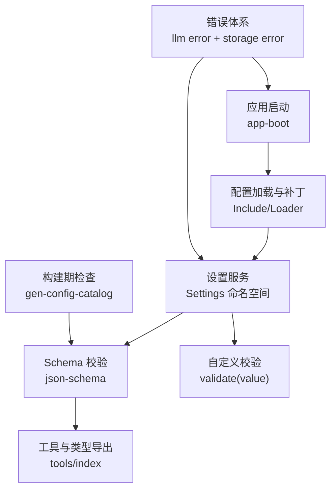
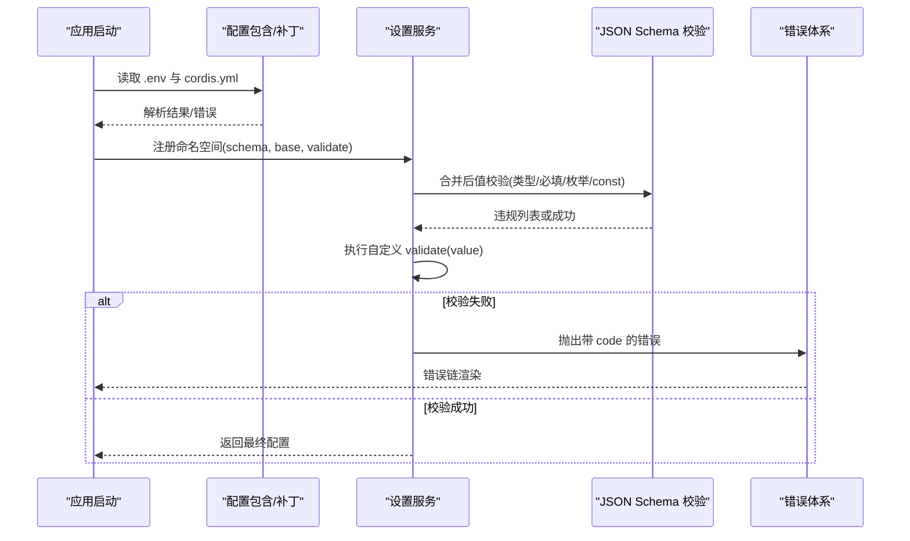
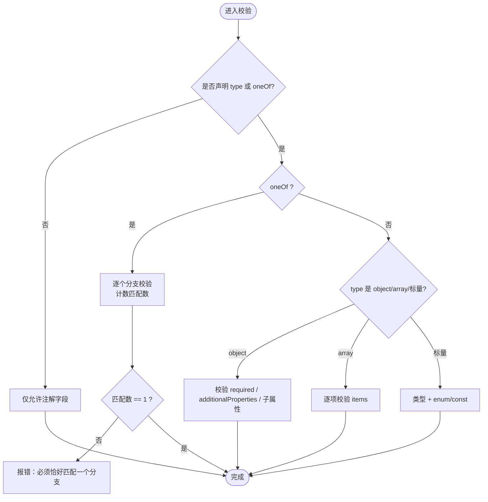
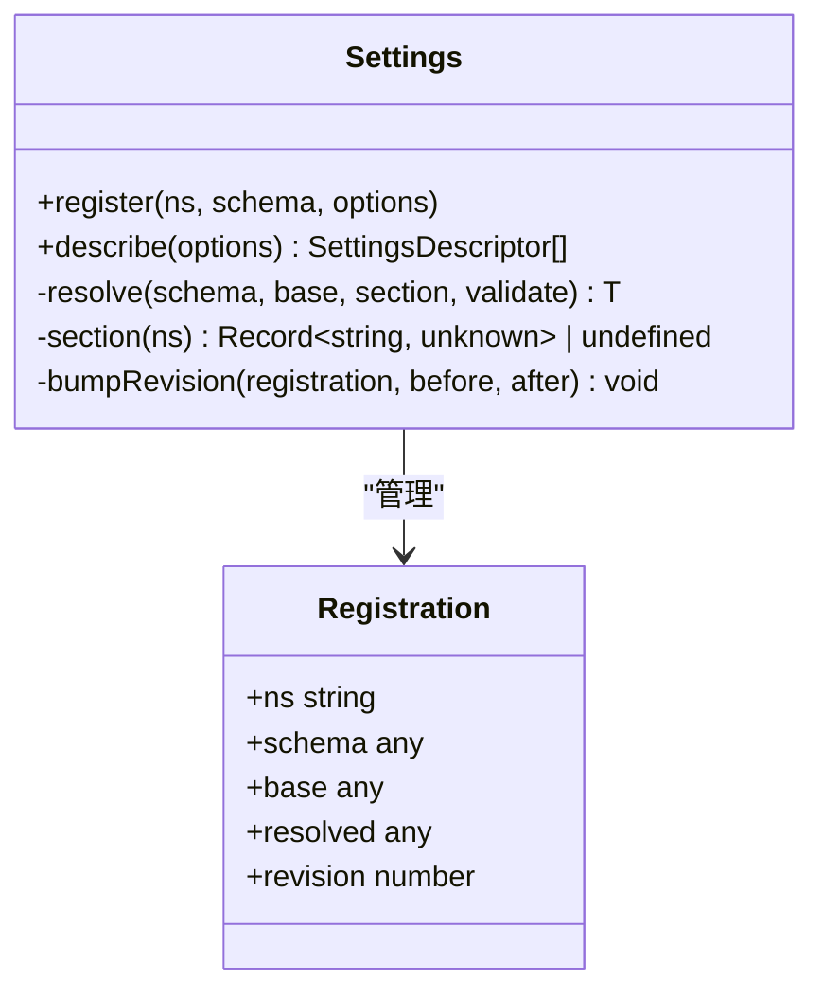
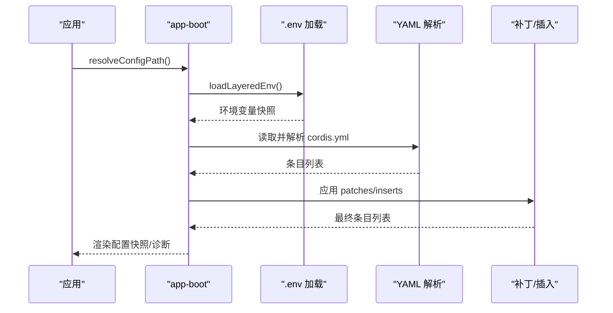
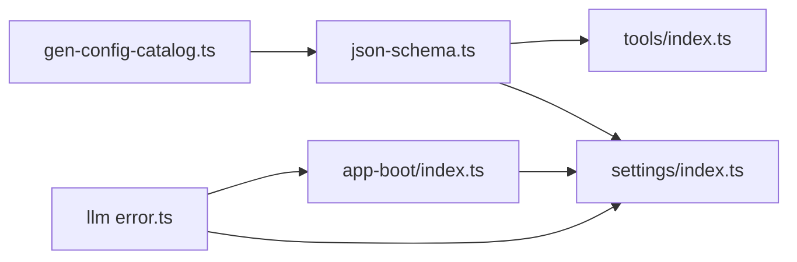

# 配置验证与错误处理

<cite>
**本文引用的文件**
- [packages/core/tools/src/json-schema.ts](file://packages/core/tools/src/json-schema.ts)
- [packages/core/tools/src/index.ts](file://packages/core/tools/src/index.ts)
- [packages/settings/settings/src/index.ts](file://packages/settings/settings/src/index.ts)
- [packages/settings/settings/src/redact.ts](file://packages/settings/settings/src/redact.ts)
- [packages/boot/app-boot/src/index.ts](file://packages/boot/app-boot/src/index.ts)
- [scripts/gen-config-catalog.ts](file://scripts/gen-config-catalog.ts)
- [packages/llm/llm/src/error.ts](file://packages/llm/llm/src/error.ts)
- [packages/storage/storage-domain/src/error.ts](file://packages/storage/storage-domain/src/error.ts)
- [packages/core/tools/tests/tools.spec.ts](file://packages/core/tools/tests/tools.spec.ts)
- [packages/core/tools/tests/properties.spec.ts](file://packages/core/tools/tests/properties.spec.ts)
- [packages/workflow/workflow-worker-thread/tests/meta.spec.ts](file://packages/workflow/workflow-worker-thread/tests/meta.spec.ts)
- [packages/runtime-diagnostics/invariants/tests/service.spec.ts](file://packages/runtime-diagnostics/invariants/tests/service.spec.ts)
- [scripts/test-invariants.spec.ts](file://scripts/test-invariants.spec.ts)
</cite>

## 目录
1. [简介](#简介)
2. [项目结构](#项目结构)
3. [核心组件](#核心组件)
4. [架构总览](#架构总览)
5. [详细组件分析](#详细组件分析)
6. [依赖关系分析](#依赖关系分析)
7. [性能考量](#性能考量)
8. [故障排查指南](#故障排查指南)
9. [结论](#结论)
10. [附录](#附录)

## 简介
本文件聚焦于“配置验证与错误处理”的体系化说明，覆盖类型系统、运行时检查、诊断方法、错误消息含义、性能优化策略、自定义验证器编写、常见错误解决方案与最佳实践，以及调试工具与日志分析方法。目标是帮助用户快速定位并解决配置问题，提升配置开发与维护的效率和质量。

## 项目结构
该仓库在多个层次提供配置能力：
- 启动层：负责加载环境、解析配置路径、渲染配置快照与补丁诊断。
- 设置层：提供命名空间化的配置注册、合并、默认值填充、用户层覆盖、跨字段校验与描述能力。
- 工具与类型层：提供受控 JSON Schema 子集、参数校验、类型到 Schema 的转换与导出。
- 构建期检查：对配置 Schema 的路径与类型进行静态/半静态校验，确保 schema 与声明类型一致。
- 错误体系：统一的错误基类与错误链渲染，便于端到端路由与可观测性。

**图表来源**
- [packages/boot/app-boot/src/index.ts:61-198](file://packages/boot/app-boot/src/index.ts#L61-L198)
- [packages/settings/settings/src/index.ts:36-723](file://packages/settings/settings/src/index.ts#L36-L723)
- [packages/core/tools/src/json-schema.ts:1-657](file://packages/core/tools/src/json-schema.ts#L1-L657)
- [packages/core/tools/src/index.ts:65-106](file://packages/core/tools/src/index.ts#L65-L106)
- [scripts/gen-config-catalog.ts:309-757](file://scripts/gen-config-catalog.ts#L309-L757)
- [packages/llm/llm/src/error.ts:102-130](file://packages/llm/llm/src/error.ts#L102-L130)
- [packages/storage/storage-domain/src/error.ts:37-53](file://packages/storage/storage-domain/src/error.ts#L37-L53)

**章节来源**
- [packages/boot/app-boot/src/index.ts:61-198](file://packages/boot/app-boot/src/index.ts#L61-L198)
- [packages/settings/settings/src/index.ts:36-723](file://packages/settings/settings/src/index.ts#L36-L723)
- [packages/core/tools/src/json-schema.ts:1-657](file://packages/core/tools/src/json-schema.ts#L1-L657)
- [packages/core/tools/src/index.ts:65-106](file://packages/core/tools/src/index.ts#L65-L106)
- [scripts/gen-config-catalog.ts:309-757](file://scripts/gen-config-catalog.ts#L309-L757)

## 核心组件
- 受控 JSON Schema 子集与校验器：定义最小可用且安全的 Schema 约束集合，提供模式断言与值校验，返回路径化诊断信息。
- 设置服务（Settings）：以命名空间为单位组织配置，支持 base 基础值、用户层覆盖、schema 默认值与必填项、可选的跨字段 validate 钩子。
- 启动与配置渲染：读取 .env、解析 cordis.yml、应用补丁、生成可审计的配置快照，并在匹配失败时输出诊断。
- 构建期配置目录生成与校验：将配置的 schema 键路径与 TypeScript 类型进行对照，发现缺失或越界字段。
- 错误体系：统一错误基类、错误码、错误链渲染，便于上层按 code 分支处理。

**章节来源**
- [packages/core/tools/src/json-schema.ts:1-657](file://packages/core/tools/src/json-schema.ts#L1-L657)
- [packages/settings/settings/src/index.ts:36-723](file://packages/settings/settings/src/index.ts#L36-L723)
- [packages/boot/app-boot/src/index.ts:61-198](file://packages/boot/app-boot/src/index.ts#L61-L198)
- [scripts/gen-config-catalog.ts:309-757](file://scripts/gen-config-catalog.ts#L309-L757)
- [packages/llm/llm/src/error.ts:102-130](file://packages/llm/llm/src/error.ts#L102-L130)
- [packages/storage/storage-domain/src/error.ts:37-53](file://packages/storage/storage-domain/src/error.ts#L37-L53)

## 架构总览
配置验证贯穿“启动—设置—工具—构建期”的全链路：
- 启动阶段：加载 .env 与 cordis.yml，应用补丁，渲染配置快照；若读取/解析失败抛出带上下文的错误。
- 设置阶段：按命名空间合并 base 与用户层，使用 schema 做类型与默认值校验，再调用可选的 validate 钩子做跨字段校验。
- 工具阶段：通过 tools 导出暴露 Schema 断言与值校验，供工具参数与结构化输出使用。
- 构建期：扫描插件配置与类型声明，对比 schema 键路径与类型成员，报告不一致。

**图表来源**
- [packages/boot/app-boot/src/index.ts:61-198](file://packages/boot/app-boot/src/index.ts#L61-L198)
- [packages/settings/settings/src/index.ts:36-723](file://packages/settings/settings/src/index.ts#L36-L723)
- [packages/core/tools/src/json-schema.ts:1-657](file://packages/core/tools/src/json-schema.ts#L1-L657)
- [packages/llm/llm/src/error.ts:102-130](file://packages/llm/llm/src/error.ts#L102-L130)

## 详细组件分析

### 受控 JSON Schema 子集与运行时校验
- 支持的关键词：type、oneOf、properties、required、additionalProperties、items、enum、const，以及 description/title/default/examples 等注解。
- 语义约束：
  - type 与 oneOf 互斥；未声明 type 时仅允许注解。
  - required 必须为字符串数组且每个键必须在 properties 中声明。
  - additionalProperties 为布尔值；false 时拒绝未声明键。
  - enum/const 必须与声明的标量类型一致；同时存在时需满足包含关系。
  - oneOf 至少两个分支，且要求“恰好一个分支匹配”。
- 值校验：
  - 对象：检查 required、additionalProperties:false 时的未知键、子属性递归校验。
  - 数组：逐项校验 items。
  - 标量：类型检查 + enum/const 约束。
  - 严格 JSON 边界：对象需为普通对象，数组需为稠密数组，值需可无损序列化。
- 诊断：所有违规以路径形式收集并返回，避免只报首个错误。

**图表来源**
- [packages/core/tools/src/json-schema.ts:202-376](file://packages/core/tools/src/json-schema.ts#L202-L376)
- [packages/core/tools/src/json-schema.ts:486-657](file://packages/core/tools/src/json-schema.ts#L486-L657)

**章节来源**
- [packages/core/tools/src/json-schema.ts:1-657](file://packages/core/tools/src/json-schema.ts#L1-L657)

### 设置服务（Settings）：命名空间、合并、默认值与自定义校验
- 注册选项：
  - base：基础值（来自入口配置子集）。
  - applies：生效时机（用于 UI 展示）。
  - validate：跨字段校验钩子，可在写入时拒绝非法组合。
- 合并与默认值：
  - 先合并 base 与用户层，再用 schema 做类型与默认值填充。
  - 已存在的用户层会覆盖 base，但不会破坏 last good value。
- 自定义校验：
  - 在 schema 通过后执行 validate(value)，失败则拒绝写入或注册。
  - 对于持久化中的坏配置，保持上次有效值并发出警告，避免运行态崩溃。
- 描述与脱敏：
  - describe() 暴露 schema、当前值、base、user 层，便于 UI 渲染与差异标记。
  - redact 遍历配置树，将标记为 secret 的字段剔除并记录位置。

**图表来源**
- [packages/settings/settings/src/index.ts:36-723](file://packages/settings/settings/src/index.ts#L36-L723)

**章节来源**
- [packages/settings/settings/src/index.ts:36-723](file://packages/settings/settings/src/index.ts#L36-L723)
- [packages/settings/settings/src/redact.ts:50-83](file://packages/settings/settings/src/redact.ts#L50-L83)

### 启动与配置渲染：读取、解析、补丁与诊断
- 环境变量：
  - 分层加载 .env（进程 > 项目 > 用户），拒绝引导类变量被 .env 覆盖。
  - 解析失败或检测到禁止变量时给出明确诊断。
- 配置加载：
  - 解析 cordis.yml，应用 include 补丁与插入条目。
  - 渲染配置快照，便于回放与审计。
- 诊断：
  - 读取/解析失败抛出带 binName 前缀的错误。
  - 无匹配的补丁行通过 warn 输出，标注所属层。

**图表来源**
- [packages/boot/app-boot/src/index.ts:61-198](file://packages/boot/app-boot/src/index.ts#L61-L198)
- [packages/boot/app-boot/src/index.ts:367-397](file://packages/boot/app-boot/src/index.ts#L367-L397)

**章节来源**
- [packages/boot/app-boot/src/index.ts:61-198](file://packages/boot/app-boot/src/index.ts#L61-L198)
- [packages/boot/app-boot/src/index.ts:367-397](file://packages/boot/app-boot/src/index.ts#L367-L397)

### 构建期配置目录与类型一致性检查
- 目标：确保配置的 schema 键路径与 TypeScript 类型成员一致。
- 机制：
  - 收集各包的 schema keys 与 compose 关系，折叠成完整键路径集合。
  - 查找主配置类型声明，逐路径比对是否存在。
  - 无法解析的类型视为 unknown，不报错；确切的缺失才报告。
- 产出：构建期 violations，提示包名与具体路径问题。

**章节来源**
- [scripts/gen-config-catalog.ts:309-757](file://scripts/gen-config-catalog.ts#L309-L757)

### 错误体系与错误链渲染
- 统一错误基类：
  - 提供稳定 code 与人类可读 message，便于上层按 code 分支处理。
  - 存储区错误支持 detail 字段携带上下文。
- 错误链：
  - 展开 cause 链与 AggregateError 成员，避免被包装错误掩盖根因。
  - 循环引用安全处理，重复消息去重。

**章节来源**
- [packages/llm/llm/src/error.ts:102-130](file://packages/llm/llm/src/error.ts#L102-L130)
- [packages/storage/storage-domain/src/error.ts:37-53](file://packages/storage/storage-domain/src/error.ts#L37-L53)

## 依赖关系分析
- json-schema 被 tools 包重新导出，作为工具参数与结构化输出的统一校验基础设施。
- settings 依赖 schema 做类型与默认值填充，并通过 validate 钩子实现跨字段校验。
- app-boot 负责环境与配置文件的读取与补丁，向上提供稳定的启动上下文。
- gen-config-catalog 在构建期连接 schema 与类型系统，提前发现不一致。

**图表来源**
- [packages/core/tools/src/index.ts:65-106](file://packages/core/tools/src/index.ts#L65-L106)
- [packages/settings/settings/src/index.ts:36-723](file://packages/settings/settings/src/index.ts#L36-L723)
- [packages/boot/app-boot/src/index.ts:61-198](file://packages/boot/app-boot/src/index.ts#L61-L198)
- [scripts/gen-config-catalog.ts:309-757](file://scripts/gen-config-catalog.ts#L309-L757)
- [packages/llm/llm/src/error.ts:102-130](file://packages/llm/llm/src/error.ts#L102-L130)

**章节来源**
- [packages/core/tools/src/index.ts:65-106](file://packages/core/tools/src/index.ts#L65-L106)
- [packages/settings/settings/src/index.ts:36-723](file://packages/settings/settings/src/index.ts#L36-L723)
- [packages/boot/app-boot/src/index.ts:61-198](file://packages/boot/app-boot/src/index.ts#L61-L198)
- [scripts/gen-config-catalog.ts:309-757](file://scripts/gen-config-catalog.ts#L309-L757)
- [packages/llm/llm/src/error.ts:102-130](file://packages/llm/llm/src/error.ts#L102-L130)

## 性能考量
- 栈安全校验：值校验采用显式帧循环而非递归，避免深层嵌套导致的栈溢出风险。
- 批量诊断：一次遍历收集所有违规，减少多次往返与重复计算。
- 构建期预检：在 CI 中运行 schema-path 检查，尽早发现类型与 schema 不一致，降低运行时成本。
- 配置快照与补丁：按需渲染与增量更新，避免全量重建带来的开销。
- 环境变量分层加载：先解析再应用，避免无效写入与回滚。

[本节为通用性能建议，无需特定文件来源]

## 故障排查指南
- 常见错误与含义
  - required 缺失或值为 undefined：表示必填字段未提供。
  - additionalProperties 为 false 时出现未知键：表示存在未声明字段。
  - oneOf 匹配数为 0 或大于 1：表示联合类型分支选择错误或冲突。
  - enum/const 不匹配：值不在允许集合或常量不符。
  - 非对象根：当需要对象根时传入非对象导致失败。
  - 环境变量注入引导类变量：被 .env 覆盖的系统级变量会被拒绝。
  - 补丁无匹配：某一层尝试修改但不存在对应条目，会输出告警。
- 定位方法
  - 查看 JSON Schema 校验返回的违规列表，关注路径与消息。
  - 使用 settings.describe() 获取 schema、当前值、base 与 user 层，识别覆盖来源。
  - 使用 app-boot 的配置渲染输出，确认最终条目与补丁效果。
  - 使用错误链渲染，展开 cause 链定位根因。
- 测试参考
  - 参数校验行为与边界用例见测试套件，包括必需字段、额外键、枚举、const、非对象顶层等。
  - 工作流元数据校验示例展示了“一次性报告全部违规”的行为。
  - 不变式注册配置校验覆盖了空串、空白、重复正则、无效正则等场景。

**章节来源**
- [packages/core/tools/tests/tools.spec.ts:2467-2521](file://packages/core/tools/tests/tools.spec.ts#L2467-L2521)
- [packages/core/tools/tests/properties.spec.ts:142-175](file://packages/core/tools/tests/properties.spec.ts#L142-L175)
- [packages/workflow/workflow-worker-thread/tests/meta.spec.ts:80-89](file://packages/workflow/workflow-worker-thread/tests/meta.spec.ts#L80-L89)
- [packages/runtime-diagnostics/invariants/tests/service.spec.ts:145-166](file://packages/runtime-diagnostics/invariants/tests/service.spec.ts#L145-L166)
- [scripts/test-invariants.spec.ts:53-95](file://scripts/test-invariants.spec.ts#L53-L95)

## 结论
该仓库通过“受控 JSON Schema + 设置服务 + 启动装配 + 构建期检查 + 统一错误体系”的组合，提供了从开发到运行的完整配置验证与错误处理能力。遵循本文档的最佳实践，可以显著降低配置错误的概率，提高问题定位效率与系统稳定性。

## 附录
- 如何编写自定义配置验证器
  - 在 settings.register 的 options.validate 中实现跨字段校验逻辑，基于已合并的值进行判断。
  - 校验失败时抛出错误，使写入或注册立即失败；对于持久化中的坏配置，系统会保留上次有效值并发出警告。
  - 结合 describe() 的输出，向 UI 暴露 schema 与当前值，便于交互式修正。
- 最佳实践
  - 优先使用 schema 表达单字段约束，仅在必要时使用 validate 表达跨字段约束。
  - 在 CI 中启用构建期 schema-path 检查，提前发现类型与 schema 不一致。
  - 谨慎使用 additionalProperties:false，避免引入不必要的破坏性变更。
  - 合理划分 base 与 user 层，保持可预测的覆盖顺序。
  - 使用错误链渲染与诊断路径，提升排障效率。
- 调试工具与日志分析
  - 使用 app-boot 的配置渲染输出，核对最终条目与补丁效果。
  - 使用 settings.describe() 获取命名空间的 schema、当前值、base 与 user 层。
  - 使用错误链渲染函数展开 cause 链，定位根因。
  - 关注 .env 分层加载日志，确认环境变量来源与冲突。

[本节为通用指导，无需特定文件来源]