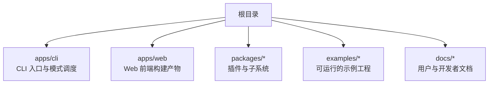
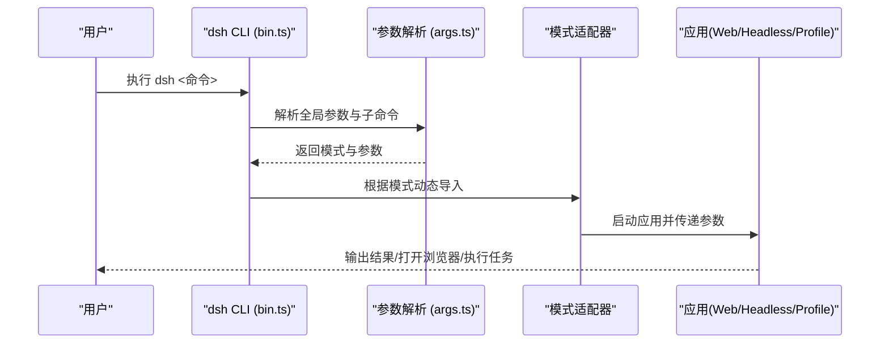
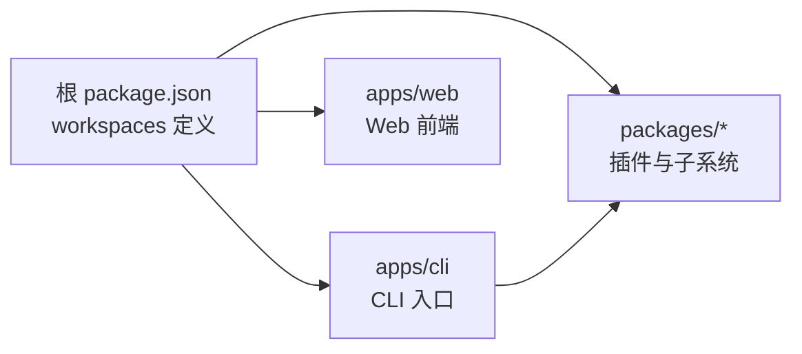

# 快速开始指南

<cite>
**本文引用的文件**
- [README.md](file://README.md)
- [apps/cli/README.md](file://apps/cli/README.md)
- [apps/cli/src/bin.ts](file://apps/cli/src/bin.ts)
- [apps/cli/src/args.ts](file://apps/cli/src/args.ts)
- [package.json](file://package.json)
- [examples/headless-agent/README.md](file://examples/headless-agent/README.md)
- [examples/web-cordis/README.md](file://examples/web-cordis/README.md)
- [docs/user/guide/index.md](file://docs/user/guide/index.md)
- [packages/llm/llm-deepseek/src/index.ts](file://packages/llm/llm-deepseek/src/index.ts)
</cite>

## 目录
1. [简介](#简介)
2. [项目结构](#项目结构)
3. [核心组件](#核心组件)
4. [架构总览](#架构总览)
5. [详细组件分析](#详细组件分析)
6. [依赖分析](#依赖分析)
7. [性能注意事项](#性能注意事项)
8. [故障排除指南](#故障排除指南)
9. [结论](#结论)
10. [附录](#附录)

## 简介
本指南面向首次接触 DeepSeek Harness（dsh）的开发者与用户，目标是帮助你在最短时间内完成环境准备、安装依赖、基本配置，并分别以 Web UI、Headless 和 CLI 三种模式运行起来。你将学会：
- 使用 npm/pnpm 或源码方式启动 dsh
- 通过命令行参数选择运行模式与常用选项
- 创建你的第一个智能体应用（基于示例工程）
- 理解基础配置项与环境变量
- 快速实现常见用例（对话代理、文件操作等）
- 排查常见问题

## 项目结构
仓库采用 monorepo 组织，核心入口位于 apps/cli，Web 前端在 apps/web，大量能力以插件形式分布在 packages/*，示例集中在 examples/*，文档位于 docs/*。

**图表来源**
- [package.json:11-18](file://package.json#L11-L18)
- [apps/cli/README.md:1-48](file://apps/cli/README.md#L1-L48)

**章节来源**
- [package.json:11-18](file://package.json#L11-L18)
- [apps/cli/README.md:1-48](file://apps/cli/README.md#L1-L48)

## 核心组件
- CLI 入口与模式调度：负责解析命令行、动态加载对应模式（web、headless、profile 等），并将参数传递给具体应用。
- Web UI：浏览器端交互界面，用于会话编排、工具调用与结果展示。
- Headless 模式：无头执行器，适合脚本化任务与批处理。
- 插件体系：一切皆插件，通过 Cordis 组合能力，包括模型适配、文件系统、Shell、工作流、权限策略等。

**章节来源**
- [apps/cli/src/bin.ts:1-54](file://apps/cli/src/bin.ts#L1-L54)
- [apps/cli/README.md:7-43](file://apps/cli/README.md#L7-L43)

## 架构总览
下图展示了从命令行到不同运行模式的调用链路与关键职责划分。

**图表来源**
- [apps/cli/src/bin.ts:27-53](file://apps/cli/src/bin.ts#L27-L53)
- [apps/cli/src/args.ts:147-169](file://apps/cli/src/args.ts#L147-L169)

## 详细组件分析

### 安装与环境准备
- 最低 Node.js 版本要求由根 package.json 指定；推荐使用 pnpm 管理依赖。
- 通过 npm 直接运行（无需本地源码）：
  - 安装 Node.js 后执行 npx @deepseek-ai/dsh web 即可启动 Web UI。
- 从源码运行：
  - 克隆仓库，进入目录，执行 pnpm install 与 pnpm run build，再执行 pnpm dsh web。

提示：
- 默认监听地址为 127.0.0.1:3080，可在后续步骤中通过参数调整。
- 首次运行会自动初始化内置模板与配置文件。

**章节来源**
- [README.md:13-35](file://README.md#L13-L35)
- [package.json:7-10](file://package.json#L7-L10)
- [package.json:19-25](file://package.json#L19-L25)
- [package.json:136-142](file://package.json#L136-L142)

### 启动不同的运行模式
- Web UI 模式（交互式）：
  - 命令：pnpm dsh web
  - 用途：浏览器内对话、工具调用、会话管理。
- Headless 模式（无头任务）：
  - 命令：pnpm dsh --profile headless "你的任务描述"
  - 用途：一次性任务，完成后退出并输出结果。
- Profile 模式（自定义组合）：
  - 命令：pnpm dsh --profile <名称>
  - 用途：加载用户定义的 profile，叠加补丁层与插件。

说明：
- dsh 会先解析自身参数，再将剩余参数交给被启动的应用。
- web 是 --profile web 的别名。

**章节来源**
- [apps/cli/README.md:7-43](file://apps/cli/README.md#L7-L43)
- [apps/cli/src/args.ts:147-169](file://apps/cli/src/args.ts#L147-L169)

### 创建你的第一个智能体应用
- 推荐从示例入手：
  - Web 自引用示例：演示如何在内存中查看/挂载/卸载插件。
    - 启动：pnpm run demo:cordis
    - 需要设置 DEEPSEEK_API_KEY。
  - Headless 编码代理：一次性任务，支持 Bash、文件操作、子代理与工作流。
    - 启动：pnpm dsh --profile headless "修复工作区中的失败测试"
    - 需要设置 DEEPSEEK_API_KEY（可选 DEEPSEEK_BASE_URL）。

- 在 Web UI 中创建简单对话代理：
  - 启动 Web UI 后，在“设置 → 模型”中配置 API Key，选择工作区，然后发送消息让代理总结仓库或编辑文件。

**章节来源**
- [examples/web-cordis/README.md:7-22](file://examples/web-cordis/README.md#L7-L22)
- [examples/headless-agent/README.md:7-18](file://examples/headless-agent/README.md#L7-L18)
- [docs/user/guide/index.md:7-23](file://docs/user/guide/index.md#L7-L23)

### 基础配置与常用设置
- 模型配置（Web UI）：
  - 路径：设置 → 模型
  - 作用：输入 API Key 后即可立即使用该模型路由，无需重启服务。
- 环境变量与凭据：
  - 模型提供商会从凭据服务或环境变量中读取密钥与端点。若未提供，将抛出缺失凭据错误。
- 常用 CLI 选项（节选）：
  - --patch：追加补丁层覆盖（可重复）
  - --dump-config / --dump-default-config：打印组合后的配置树并退出
  - web 子命令支持透传应用参数（如端口等）

注意：
- 安全限制：某些主机绑定（如 0.0.0.0）出于安全原因不被支持，应使用 127.0.0.1。

**章节来源**
- [docs/user/guide/index.md:7-11](file://docs/user/guide/index.md#L7-L11)
- [packages/llm/llm-deepseek/src/index.ts:225-246](file://packages/llm/llm-deepseek/src/index.ts#L225-L246)
- [apps/cli/README.md:18-43](file://apps/cli/README.md#L18-L43)
- [apps/cli/tests/built-bin.e2e.ts:329-368](file://apps/cli/tests/built-bin.e2e.ts#L329-L368)

### 常见用例快速上手
- 简单对话代理（Web UI）：
  - 启动 Web UI，配置模型，选择工作区，发送“总结本仓库并识别主要包”。
- 文件操作工具（Headless）：
  - 使用 headless 模式执行一次性任务，例如“查找并替换某类文件中的关键字”，或“列出当前目录结构”。
- 自动化集成（JSON-RPC/ACP）：
  - 参考 jsonrpc-agent 与 acp-agent 示例，通过 SDK 或协议驱动 agent。

**章节来源**
- [docs/user/guide/index.md:13-23](file://docs/user/guide/index.md#L13-L23)
- [examples/headless-agent/README.md:7-18](file://examples/headless-agent/README.md#L7-L18)
- [examples/README.md:11-29](file://examples/README.md#L11-L29)

## 依赖分析
- 运行时依赖：Node.js（满足 engines 要求）、pnpm（工作区管理）。
- 模块组织：monorepo 通过 workspaces 聚合 apps、packages、native、website 等子项目。
- CLI 依赖：dsh 本身依赖众多内部插件包（如 web-app、headless、终端、工具集等），这些在 apps/cli/package.json 中声明。

**图表来源**
- [package.json:11-18](file://package.json#L11-L18)
- [apps/cli/package.json:22-84](file://apps/cli/package.json#L22-L84)

**章节来源**
- [package.json:11-18](file://package.json#L11-L18)
- [apps/cli/package.json:22-84](file://apps/cli/package.json#L22-L84)

## 性能注意事项
- 首次构建与热更新：开发时建议先执行完整构建，再进行调试与运行。
- 资源占用：启用过多工具/插件会增加启动时间与内存占用，可按需裁剪。
- 网络与模型：模型调用受网络与配额影响，合理设置超时与重试策略。
- 日志与诊断：使用 dump-config 与相关诊断工具定位配置问题，减少试错成本。

[本节为通用指导，不直接分析具体文件]

## 故障排除指南
- 无法启动 Web UI：
  - 确认已执行构建且 Node.js 版本符合要求。
  - 检查是否已有进程占用端口。
- 模型不可用或报错：
  - 在“设置 → 模型”中正确配置 API Key 与端点。
  - 若未配置凭据，系统会提示缺失凭据；请通过凭据服务或环境变量提供。
- 参数或模式错误：
  - 使用 dsh --help 或各模式 --help 查看用法。
  - 注意父级参数与子命令参数的边界，避免误传。
- 安全限制导致启动失败：
  - 不要尝试绑定 0.0.0.0；请使用 127.0.0.1。

**章节来源**
- [README.md:13-35](file://README.md#L13-L35)
- [docs/user/guide/index.md:7-11](file://docs/user/guide/index.md#L7-L11)
- [packages/llm/llm-deepseek/src/index.ts:225-246](file://packages/llm/llm-deepseek/src/index.ts#L225-L246)
- [apps/cli/tests/built-bin.e2e.ts:329-368](file://apps/cli/tests/built-bin.e2e.ts#L329-L368)

## 结论
通过以上步骤，你已掌握如何安装与运行 DeepSeek Harness，并在 Web UI、Headless 与 CLI 模式下快速搭建智能体应用。建议从示例入手，逐步扩展插件与工具，结合文档深入理解配置与架构。遇到问题时，优先检查模型凭据、端口占用与安全限制，并使用 dump-config 等工具进行诊断。

[本节为总结性内容，不直接分析具体文件]

## 附录

### 渐进式学习路径
- 入门：
  - 使用 Web UI 完成一次对话与文件编辑。
- 进阶：
  - 使用 Headless 模式执行一次性任务。
  - 阅读示例工程，理解插件组合与配置覆盖。
- 高级：
  - 自定义 Profile 与补丁层。
  - 开发/集成新插件与工具。
  - 通过 JSON-RPC/ACP 进行自动化集成。

[本节为概念性内容，不直接分析具体文件]