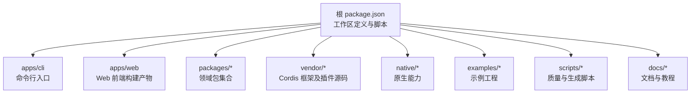
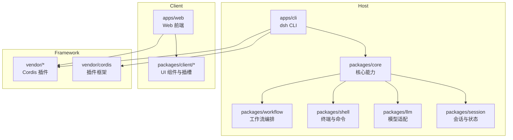
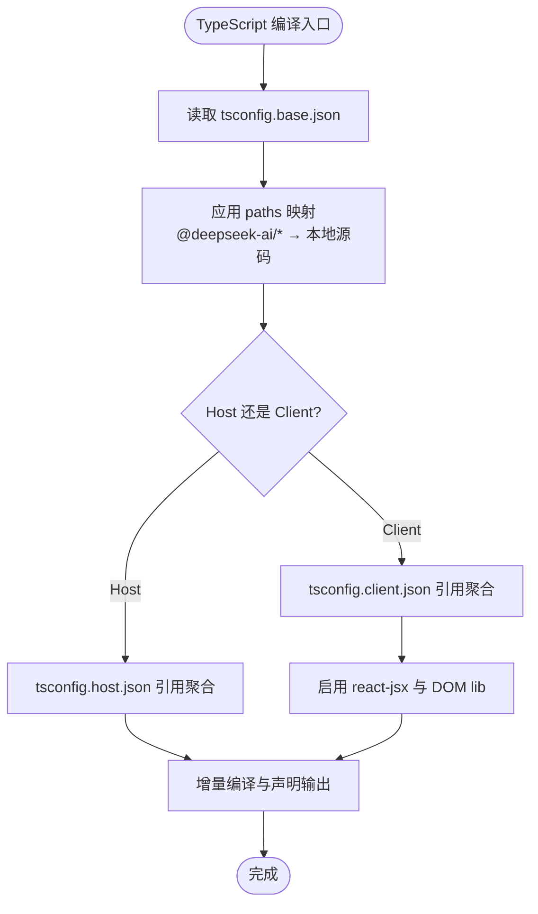
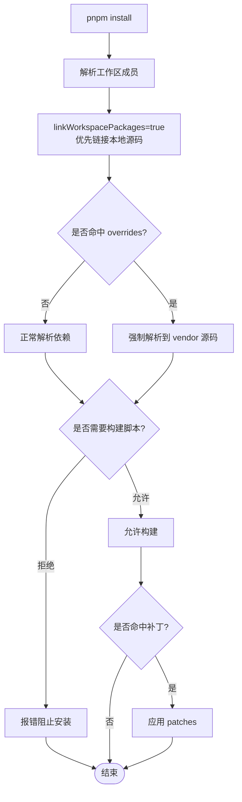
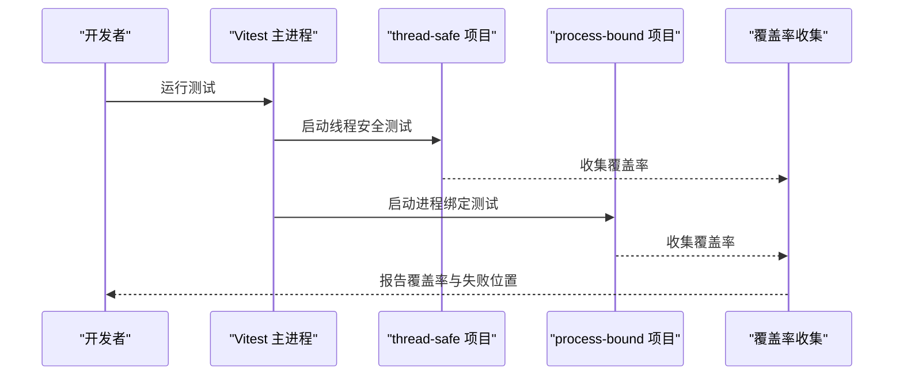
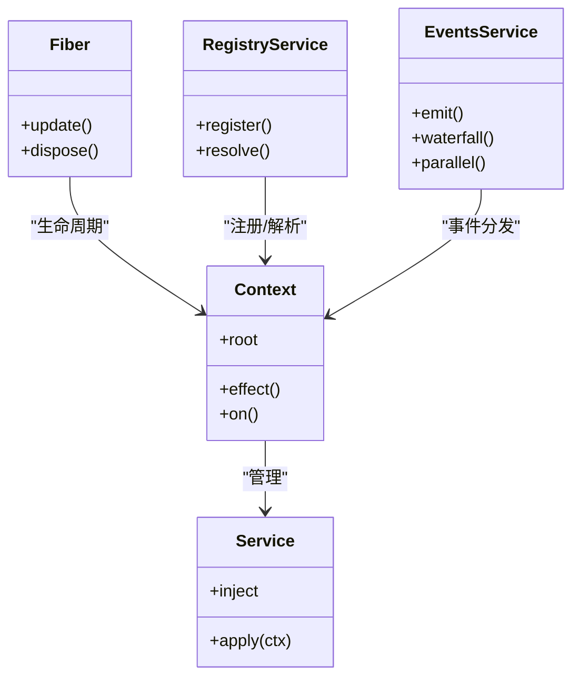
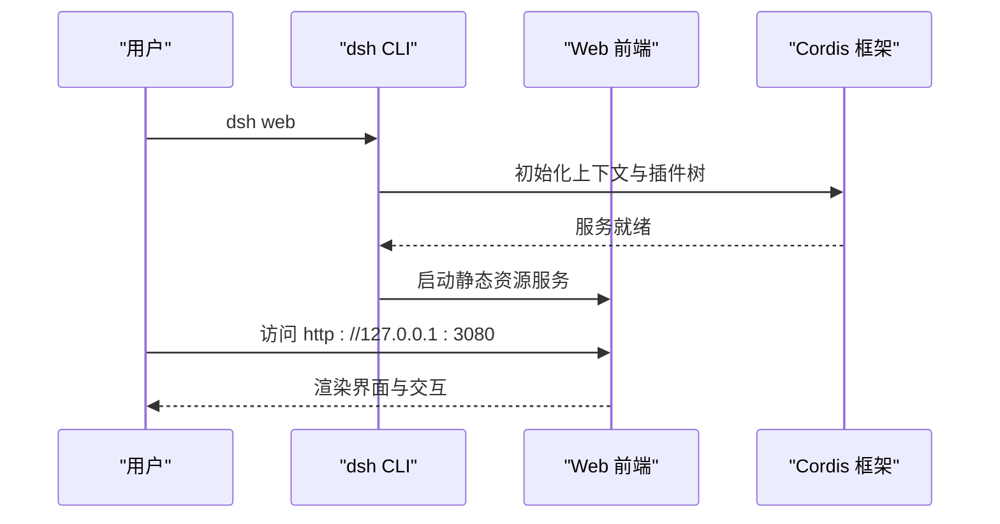
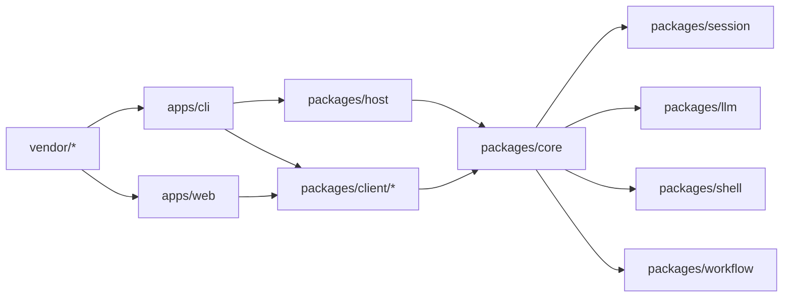

# 技术栈与依赖

<cite>
**本文引用的文件**
- [package.json](file://package.json)
- [pnpm-workspace.yaml](file://pnpm-workspace.yaml)
- [tsconfig.base.json](file://tsconfig.base.json)
- [vitest.config.ts](file://vitest.config.ts)
- [README.md](file://README.md)
- [apps/cli/package.json](file://apps/cli/package.json)
- [apps/web/package.json](file://apps/web/package.json)
- [vendor/README.md](file://vendor/README.md)
- [vitest.shared.ts](file://vitest.shared.ts)
- [vitest.e2e.config.ts](file://vitest.e2e.config.ts)
- [vitest.web-stress.config.ts](file://vitest.web-stress.config.ts)
- [tsconfig.base.client.json](file://tsconfig.base.client.json)
</cite>

## 目录
1. [简介](#简介)
2. [项目结构](#项目结构)
3. [核心组件](#核心组件)
4. [架构总览](#架构总览)
5. [详细组件分析](#详细组件分析)
6. [依赖关系分析](#依赖关系分析)
7. [性能考虑](#性能考虑)
8. [故障排查指南](#故障排查指南)
9. [结论](#结论)
10. [附录](#附录)

## 简介
DeepSeek Harness（简称 dsh）是一个以“一切皆插件”为核心理念的开源智能体运行框架，底层基于 Cordis 插件框架。仓库采用 pnpm monorepo 组织，使用 TypeScript 作为主要语言，Node.js 作为运行时，React 构建 Web 前端界面，Vitest 提供测试能力，并通过 tsdown、Vite 等工具完成编译与打包。该文档面向不同经验水平的开发者，系统梳理技术选型、构建工具链、模块化架构、包职责划分以及最佳实践与性能考量。

## 项目结构
仓库根目录包含应用、包、原生组件、示例、脚本与文档等：
- apps：产品级入口与应用（CLI、Web 前端）
- packages：按领域划分的可复用包集合（core、host、client、llm、session、shell、workflow 等）
- vendor：内联维护的 Cordis 框架及其插件源码（完全可控、可审计、可补丁）
- native：原生能力（如 landlock-run 安全沙箱启动器）
- examples：示例工程，演示如何组合插件与配置
- scripts：质量门禁、代码生成、发布与验证脚本
- docs：子系统、教程、用户指南与架构文档

图表来源
- [package.json:11-18](file://package.json#L11-L18)
- [pnpm-workspace.yaml:1-22](file://pnpm-workspace.yaml#L1-L22)

章节来源
- [package.json:1-18](file://package.json#L1-L18)
- [pnpm-workspace.yaml:1-22](file://pnpm-workspace.yaml#L1-L22)

## 核心组件
- 运行时与语言
  - Node.js：要求版本 ^22.19.0 或 >=24.0.0，确保现代 ES 特性与稳定性。
  - TypeScript：目标 ES2024，模块解析为 bundler 模式，启用严格类型检查与增量编译；通过 paths 映射将内部包与 vendor 源码直接指向源路径，保证开发与测试时始终加载源码而非已构建产物。
- 插件框架
  - Cordis：以 Context/Service/Events/Fiber 为核心概念，支持声明式依赖注入、事件通信、生命周期管理与热重载。仓库内维护其源码副本，便于审计、补丁与演进。
- 前端
  - React：用于 Web 界面渲染。
  - Vite：负责 Web 应用的开发与构建。
- 构建与打包
  - tsdown：用于 Host 与 Client 聚合包的构建。
  - Vite：用于 Web 前端构建。
- 测试
  - Vitest：统一测试框架，支持多项目并行、覆盖率门控（100%）、E2E 与压力测试。
- 包管理
  - pnpm：monorepo 工作区管理，严格的依赖构建白名单与覆盖策略，确保可重复安装与构建。

章节来源
- [package.json:8-10](file://package.json#L8-L10)
- [tsconfig.base.json:5-26](file://tsconfig.base.json#L5-L26)
- [vendor/README.md:1-6](file://vendor/README.md#L1-L6)
- [apps/web/package.json:28-32](file://apps/web/package.json#L28-L32)
- [package.json:20-24](file://package.json#L20-L24)
- [vitest.config.ts:117-159](file://vitest.config.ts#L117-L159)
- [pnpm-workspace.yaml:27-55](file://pnpm-workspace.yaml#L27-L55)

## 架构总览
整体架构围绕“插件化 + 宿主/客户端分离”展开：
- Host 侧：CLI 应用、服务注册、会话管理、工具执行、调度、持久化、沙箱等。
- Client 侧：Web 前端 UI、交互、消息展示、设置面板等。
- 插件体系：通过 Cordis 在 Host/Client 两侧分别挂载服务、工具、UI 插槽与事件监听，实现功能解耦与可扩展性。
- 构建面：Host 与 Client 各自独立聚合编译，避免相互污染；vendor 层提供稳定的框架基础。

图表来源
- [apps/cli/package.json:22-84](file://apps/cli/package.json#L22-L84)
- [apps/web/package.json:28-49](file://apps/web/package.json#L28-L49)
- [vendor/README.md:9-24](file://vendor/README.md#L9-L24)

## 详细组件分析

### 构建工具链与 TypeScript 配置
- 目标与模块
  - target: es2024，module: esnext，moduleResolution: bundler，开启 declaration/sourceMap/incremental，严格类型检查。
- 路径映射
  - 通过 paths 将 @deepseek-ai/* 内部包与 vendor 包映射到本地源码，确保开发/测试时不加载已构建产物，避免单例重复与行为差异。
- 客户端基线
  - tsconfig.base.client.json 扩展 base，启用 react-jsx、DOM lib，并清空 types 以避免 Node 环境污染。

图表来源
- [tsconfig.base.json:5-26](file://tsconfig.base.json#L5-L26)
- [tsconfig.base.json:30-276](file://tsconfig.base.json#L30-L276)
- [tsconfig.base.client.json:1-11](file://tsconfig.base.client.json#L1-L11)

章节来源
- [tsconfig.base.json:5-26](file://tsconfig.base.json#L5-L26)
- [tsconfig.base.json:30-276](file://tsconfig.base.json#L30-L276)
- [tsconfig.base.client.json:1-11](file://tsconfig.base.client.json#L1-L11)

### 包管理器与工作区（pnpm）
- 工作区成员
  - 包含 vendor/*、packages/*/*、native/landlock-run、apps/*、website、examples、python/sdk-runtime 等。
- 链接与覆盖
  - linkWorkspacePackages: true 使同名包在工作区内优先解析到本地源码。
  - overrides 将特定包名指向本地 vendor 源码。
- 构建脚本白名单
  - allowBuilds 仅允许必要的原生构建脚本（esbuild、node-pty、koffi 等），其余默认拒绝，提升安全性与可重复性。
- 补丁
  - patchedDependencies 对 node-pty 进行补丁以适配平台差异。

图表来源
- [pnpm-workspace.yaml:1-22](file://pnpm-workspace.yaml#L1-L22)
- [pnpm-workspace.yaml:27-55](file://pnpm-workspace.yaml#L27-L55)
- [pnpm-workspace.yaml:71-73](file://pnpm-workspace.yaml#L71-L73)

章节来源
- [pnpm-workspace.yaml:1-22](file://pnpm-workspace.yaml#L1-L22)
- [pnpm-workspace.yaml:27-55](file://pnpm-workspace.yaml#L27-L55)
- [pnpm-workspace.yaml:71-73](file://pnpm-workspace.yaml#L71-L73)

### 测试框架（Vitest）
- 多项目与隔离
  - thread-safe 与 process-bound 两个项目池，进程绑定测试单独运行，避免全局状态干扰。
- 覆盖率门控
  - 100% 语句/分支/函数/行覆盖率，逐文件校验；针对无法覆盖的浏览器 UI 与类型文件进行精确排除。
- 装饰器与路径
  - 自定义 pre-transform 插件处理 TS 装饰器；通过 vite-tsconfig-paths 复用 tsconfig.base.json 的 paths 映射。
- E2E 与压力测试
  - 独立配置文件 vitest.e2e.config.ts 与 vitest.web-stress.config.ts，分别控制超时、重试与并行度。

图表来源
- [vitest.config.ts:117-159](file://vitest.config.ts#L117-L159)
- [vitest.config.ts:160-283](file://vitest.config.ts#L160-L283)
- [vitest.shared.ts:1-42](file://vitest.shared.ts#L1-L42)
- [vitest.e2e.config.ts:31-58](file://vitest.e2e.config.ts#L31-L58)
- [vitest.web-stress.config.ts:1-15](file://vitest.web-stress.config.ts#L1-L15)

章节来源
- [vitest.config.ts:117-159](file://vitest.config.ts#L117-L159)
- [vitest.config.ts:160-283](file://vitest.config.ts#L160-L283)
- [vitest.shared.ts:1-42](file://vitest.shared.ts#L1-L42)
- [vitest.e2e.config.ts:31-58](file://vitest.e2e.config.ts#L31-L58)
- [vitest.web-stress.config.ts:1-15](file://vitest.web-stress.config.ts#L1-L15)

### 插件框架（Cordis）
- 设计理念
  - 插件即 Service，Context 为服务容器，inject 声明依赖，事件驱动通信，Fiber 管理生命周期与热重载。
- 本地化维护
  - 源码 vendored 至 vendor/*，命名空间重定向到 @deepseek-ai/*，保留上游版本与许可证，便于审计与补丁。
- 与 Harness 集成
  - CLI 与 Web 均通过 Cordis 装载插件树，组合服务、工具、UI 插槽与事件监听，形成可插拔的能力矩阵。

图表来源
- [vendor/README.md:1-6](file://vendor/README.md#L1-L6)
- [vendor/README.md:9-24](file://vendor/README.md#L9-L24)
- [vendor/README.md:29-50](file://vendor/README.md#L29-L50)

章节来源
- [vendor/README.md:1-6](file://vendor/README.md#L1-L6)
- [vendor/README.md:9-24](file://vendor/README.md#L9-L24)
- [vendor/README.md:29-50](file://vendor/README.md#L29-L50)

### 应用入口与前端
- CLI（apps/cli）
  - 暴露 dsh 命令，组合 Host 侧插件与服务，提供 profile 启动、插件管理、Web UI 别名等功能。
- Web（apps/web）
  - 基于 Vite 构建 React 前端，依赖 @deepseek-ai/dsh-client-web 壳库，产出 dist 由 CLI 的 web 子命令提供服务。

图表来源
- [apps/cli/package.json:14-16](file://apps/cli/package.json#L14-L16)
- [apps/cli/package.json:22-84](file://apps/cli/package.json#L22-L84)
- [apps/web/package.json:22-32](file://apps/web/package.json#L22-L32)
- [README.md:15-35](file://README.md#L15-L35)

章节来源
- [apps/cli/package.json:14-16](file://apps/cli/package.json#L14-L16)
- [apps/cli/package.json:22-84](file://apps/cli/package.json#L22-L84)
- [apps/web/package.json:22-32](file://apps/web/package.json#L22-L32)
- [README.md:15-35](file://README.md#L15-L35)

## 依赖关系分析
- 包职责划分
  - core：核心能力（会话、工具、权限、计划等）
  - host：宿主侧服务（API 代理、Web 服务器、插件清单等）
  - client：客户端 UI 与运行时（React 组件、插槽、连接、HMR 等）
  - llm：模型适配与消息协议
  - shell：终端与命令执行（bash、pwsh、沙箱）
  - workflow：工作流编排与任务调度
  - session：会话投影、查询、标题、统计等
  - sandbox：跨平台沙箱与安全限制
  - extensions：Cordis 宿主/客户端运行器与 UI 扩展
- 外部依赖
  - React、Vite、Vitest、TypeScript、jsdom（测试环境）等
- 内联依赖
  - vendor/* 中的 Cordis 框架与插件，通过 workspace link 与 overrides 锁定版本与路径

图表来源
- [apps/cli/package.json:22-84](file://apps/cli/package.json#L22-L84)
- [apps/web/package.json:28-49](file://apps/web/package.json#L28-L49)
- [vendor/README.md:9-24](file://vendor/README.md#L9-L24)

章节来源
- [apps/cli/package.json:22-84](file://apps/cli/package.json#L22-L84)
- [apps/web/package.json:28-49](file://apps/web/package.json#L28-L49)
- [vendor/README.md:9-24](file://vendor/README.md#L9-L24)

## 性能考虑
- 编译与构建
  - 使用增量编译与声明输出，减少重复构建成本；Host/Client 分离避免无关依赖参与编译。
- 测试并行与隔离
  - Vitest 分项目运行，进程绑定测试独立隔离，避免全局状态导致的竞态与不稳定。
- 覆盖率与质量门控
  - 100% 覆盖率门控促使关键路径被充分覆盖；对无法覆盖的 UI 与类型文件进行精确排除，避免误报。
- 依赖与安装
  - pnpm 严格构建脚本白名单，减少不可控的原生构建风险；workspace link 确保本地源码一致性与可调试性。
- 前端性能
  - Vite 快速热更新与按需构建；React 18 并发特性提升 UI 响应性。

[本节提供通用指导，无需具体文件分析]

## 故障排查指南
- 安装失败
  - 检查 Node.js 版本是否符合要求；确认 pnpm 版本与工作区配置；查看 allowBuilds 白名单是否包含所需原生构建。
- 测试失败
  - 确认 Vitest 项目配置是否正确（thread-safe/process-bound）；检查覆盖率排除列表是否合理；对于 Windows 不支持的套件，确认排除规则生效。
- 类型错误
  - 检查 tsconfig.base.json 的 paths 映射是否覆盖所有内部包；确保 Client 与 Host 聚合引用正确。
- 插件加载异常
  - 核对 Cordis 插件声明与依赖注入；检查 vendor 源码是否被正确链接；关注 HMR 与 Include 的事务性更新日志。

章节来源
- [package.json:8-10](file://package.json#L8-L10)
- [pnpm-workspace.yaml:27-55](file://pnpm-workspace.yaml#L27-L55)
- [vitest.config.ts:117-159](file://vitest.config.ts#L117-L159)
- [vitest.config.ts:160-283](file://vitest.config.ts#L160-L283)
- [tsconfig.base.json:30-276](file://tsconfig.base.json#L30-L276)
- [vendor/README.md:29-50](file://vendor/README.md#L29-L50)

## 结论
DeepSeek Harness 通过 Cordis 插件框架实现了高度解耦与可扩展的架构，结合 pnpm monorepo、TypeScript、Vitest、Vite 与 React，形成了从后端服务到前端界面的完整技术栈。严格的依赖管理、完善的测试门控与清晰的模块化职责划分，使得项目在快速迭代中仍能保持高质量与可维护性。建议新贡献者遵循现有规范，逐步理解各包职责与插件机制，并在实践中优化性能与可靠性。

[本节总结性内容，无需具体文件分析]

## 附录
- 快速开始
  - 安装 Node.js 与 pnpm，克隆仓库后执行安装与构建，使用 dsh web 启动 Web UI。
- 参考文档
  - 开发指南、架构文档、Cordis 教程与子系统说明位于 docs 目录。

章节来源
- [README.md:15-35](file://README.md#L15-L35)
- [README.md:47-51](file://README.md#L47-L51)