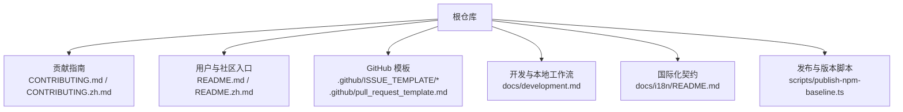
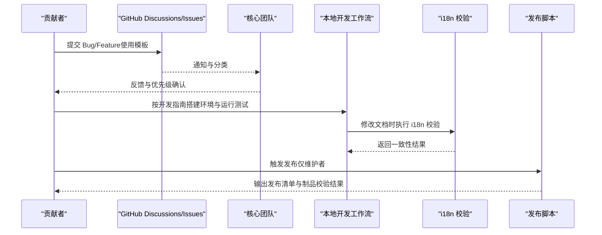
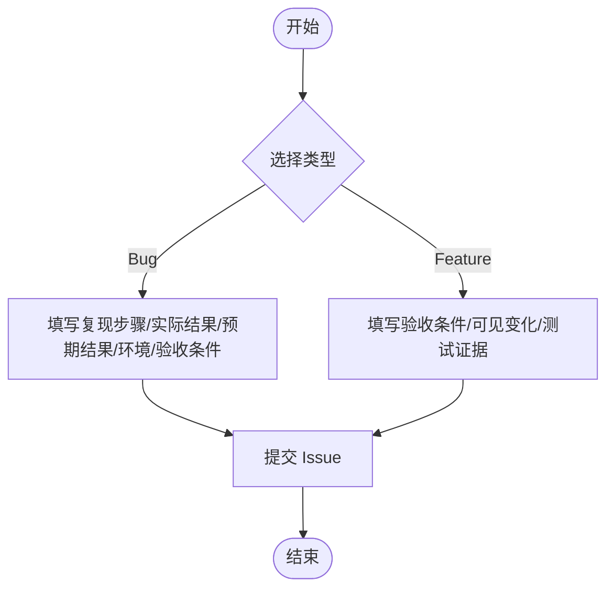
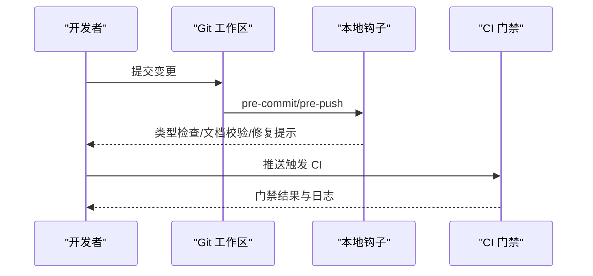
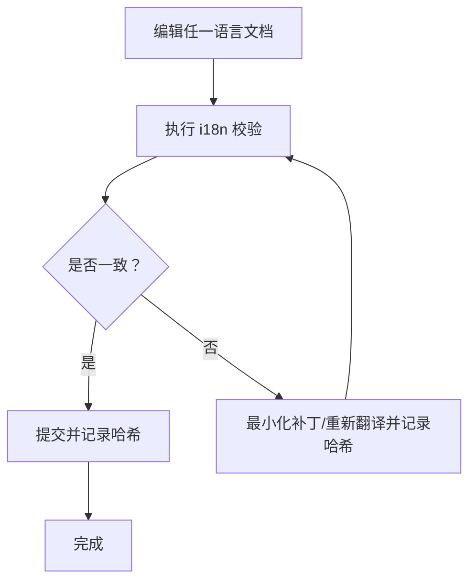
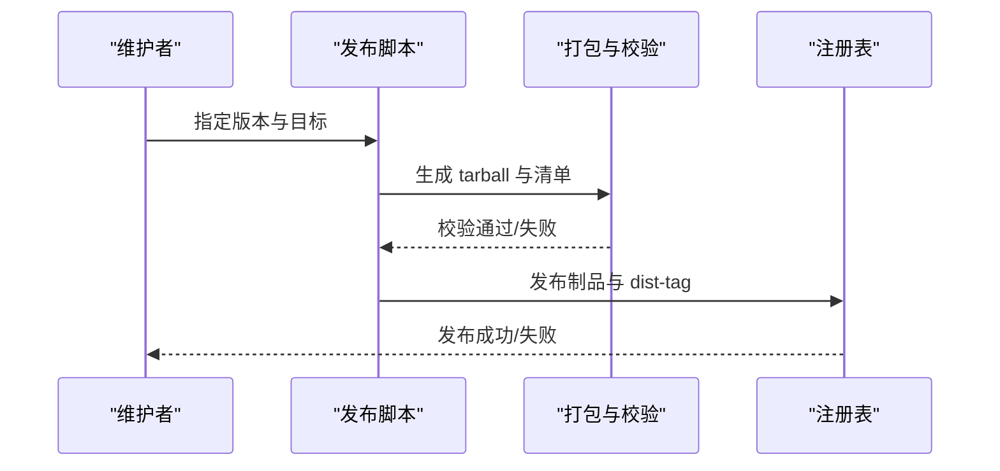
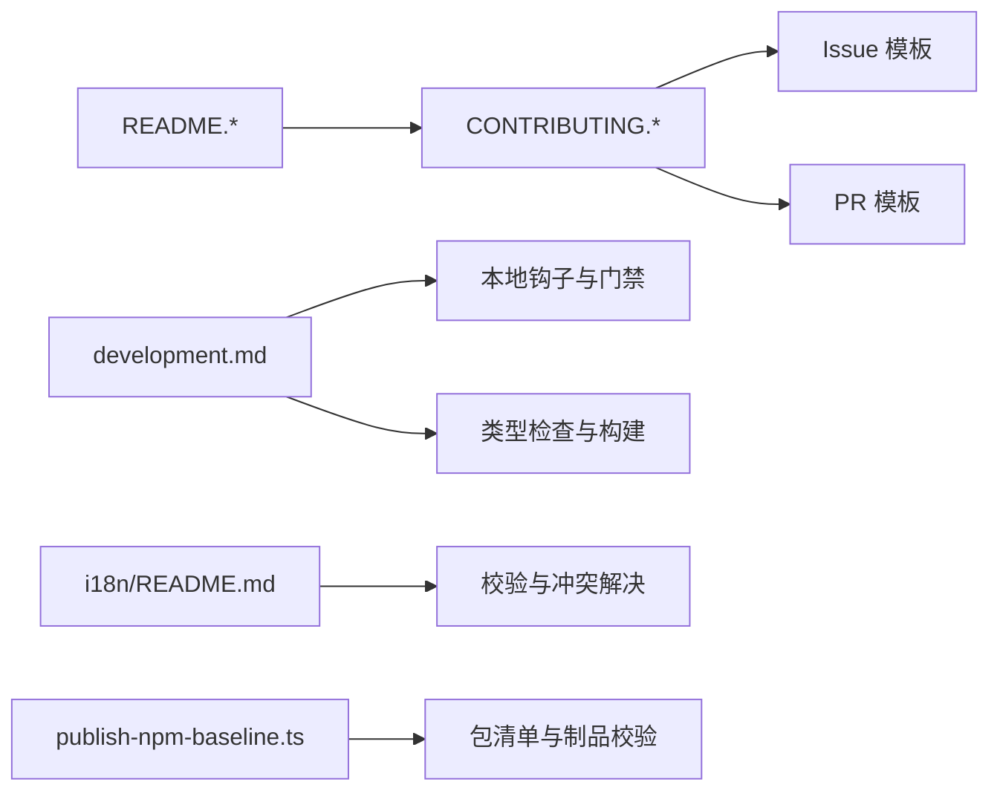

# 社区与支持

<cite>
**本文引用的文件**
- [CONTRIBUTING.md](file://CONTRIBUTING.md)
- [CONTRIBUTING.zh.md](file://CONTRIBUTING.zh.md)
- [README.md](file://README.md)
- [README.zh.md](file://README.zh.md)
- [.github/ISSUE_TEMPLATE/config.yml](file://.github/ISSUE_TEMPLATE/config.yml)
- [.github/ISSUE_TEMPLATE/bug.md](file://.github/ISSUE_TEMPLATE/bug.md)
- [.github/ISSUE_TEMPLATE/feature.md](file://.github/ISSUE_TEMPLATE/feature.md)
- [.github/pull_request_template.md](file://.github/pull_request_template.md)
- [docs/development.md](file://docs/development.md)
- [docs/i18n/README.md](file://docs/i18n/README.md)
- [scripts/publish-npm-baseline.ts](file://scripts/publish-npm-baseline.ts)
</cite>

## 目录
1. [简介](#简介)
2. [项目结构](#项目结构)
3. [核心组件](#核心组件)
4. [架构总览](#架构总览)
5. [详细组件分析](#详细组件分析)
6. [依赖关系分析](#依赖关系分析)
7. [性能与质量保障](#性能与质量保障)
8. [故障排查指南](#故障排查指南)
9. [结论](#结论)
10. [附录](#附录)

## 简介
本文件面向希望参与 DeepSeek Harness（简称 dsh）的开发者、贡献者与使用者，聚焦社区协作与支持流程。内容涵盖：如何参与开发、代码贡献流程与规范、问题报告与功能请求模板、治理与决策方式、社区资源链接、国际化与多语言贡献方式、发布与版本管理策略，以及新贡献者入门指引（环境搭建、测试与调试）。同时强调社区的包容性与协作精神，鼓励通过讨论、插件生态与文档建设共同推进项目发展。

## 项目结构
仓库采用“一切皆插件”的架构，围绕 Cordis 运行时组织。社区与支持相关的关键位置包括：
- 根级贡献说明与运行入口：CONTRIBUTING.*、README.*
- GitHub 模板：.github/ISSUE_TEMPLATE/* 与 .github/pull_request_template.md
- 开发与本地工作流：docs/development.md
- 国际化与双语文档契约：docs/i18n/README.md
- 发布与版本脚本：scripts/publish-npm-baseline.ts

**图示来源**
- [CONTRIBUTING.md:1-24](file://CONTRIBUTING.md#L1-L24)
- [CONTRIBUTING.zh.md:1-24](file://CONTRIBUTING.zh.md#L1-L24)
- [README.md:37-45](file://README.md#L37-L45)
- [README.zh.md:37-68](file://README.zh.md#L37-L68)
- [.github/ISSUE_TEMPLATE/config.yml:1-3](file://.github/ISSUE_TEMPLATE/config.yml#L1-L3)
- [.github/ISSUE_TEMPLATE/bug.md:1-23](file://.github/ISSUE_TEMPLATE/bug.md#L1-L23)
- [.github/ISSUE_TEMPLATE/feature.md:1-21](file://.github/ISSUE_TEMPLATE/feature.md#L1-L21)
- [.github/pull_request_template.md:1-14](file://.github/pull_request_template.md#L1-L14)
- [docs/development.md:1-172](file://docs/development.md#L1-L172)
- [docs/i18n/README.md:1-61](file://docs/i18n/README.md#L1-L61)
- [scripts/publish-npm-baseline.ts:94-338](file://scripts/publish-npm-baseline.ts#L94-L338)

**章节来源**
- [CONTRIBUTING.md:1-24](file://CONTRIBUTING.md#L1-L24)
- [CONTRIBUTING.zh.md:1-24](file://CONTRIBUTING.zh.md#L1-L24)
- [README.md:37-45](file://README.md#L37-L45)
- [README.zh.md:37-68](file://README.zh.md#L37-L68)
- [docs/development.md:1-172](file://docs/development.md#L1-L172)
- [docs/i18n/README.md:1-61](file://docs/i18n/README.md#L1-L61)
- [scripts/publish-npm-baseline.ts:94-338](file://scripts/publish-npm-baseline.ts#L94-L338)

## 核心组件
- 贡献与参与渠道
  - 当前阶段不接受外部 PR，但欢迎在 GitHub Discussions 中反馈问题或 bug，并为关注点投票；同时鼓励创建插件、撰写博客与帮助他人。
  - 中文与英文贡献说明并列维护，体现对多语言社区的尊重。
- 问题与功能请求
  - 使用仓库提供的 Issue 模板：Bug 与 Feature 两类模板分别引导复现步骤、预期结果、验收条件与环境信息。
  - 禁止空白 Issue，确保所有问题通过模板提交，便于追踪与处理。
- 提交流程与评审
  - 提供 Pull Request 模板，要求关联 Issue，并结构化描述变更与验证过程。
- 开发与本地工作流
  - 提供从环境准备到类型检查、构建、演示运行的完整路径；包含环境变量配置、Git 集成（合并驱动）、本地钩子与 CI 门禁说明。
- 国际化与多语言贡献
  - 双语文档契约：每篇文档以“英/中 + i18n 一致性记录”三元组形式维护；强制语言切换器与结构一致性校验；提供自动化校验与冲突解决工具链。
- 发布与版本管理
  - 发布脚本负责打包、校验与生成发布清单，确保包元数据、内部依赖与版本号一致，支持 dist-tag 与注册表发布。

**章节来源**
- [CONTRIBUTING.md:1-24](file://CONTRIBUTING.md#L1-L24)
- [CONTRIBUTING.zh.md:1-24](file://CONTRIBUTING.zh.md#L1-L24)
- [README.md:37-45](file://README.md#L37-L45)
- [README.zh.md:37-68](file://README.zh.md#L37-L68)
- [.github/ISSUE_TEMPLATE/config.yml:1-3](file://.github/ISSUE_TEMPLATE/config.yml#L1-L3)
- [.github/ISSUE_TEMPLATE/bug.md:1-23](file://.github/ISSUE_TEMPLATE/bug.md#L1-L23)
- [.github/ISSUE_TEMPLATE/feature.md:1-21](file://.github/ISSUE_TEMPLATE/feature.md#L1-L21)
- [.github/pull_request_template.md:1-14](file://.github/pull_request_template.md#L1-L14)
- [docs/development.md:1-172](file://docs/development.md#L1-L172)
- [docs/i18n/README.md:1-61](file://docs/i18n/README.md#L1-L61)
- [scripts/publish-npm-baseline.ts:94-338](file://scripts/publish-npm-baseline.ts#L94-L338)

## 架构总览
下图展示社区支持与协作的关键交互：贡献者通过 Discussions 反馈问题，团队基于模板进行归类与优先级评估；贡献者也可通过 PR 模板提交变更（当前阶段暂不接受外部 PR），并在本地遵循开发与测试流程；国际化由双语文档契约与校验工具保障；发布流程通过脚本统一打包与校验。

**图示来源**
- [README.md:37-45](file://README.md#L37-L45)
- [README.zh.md:37-68](file://README.zh.md#L37-L68)
- [.github/ISSUE_TEMPLATE/bug.md:1-23](file://.github/ISSUE_TEMPLATE/bug.md#L1-L23)
- [.github/ISSUE_TEMPLATE/feature.md:1-21](file://.github/ISSUE_TEMPLATE/feature.md#L1-L21)
- [docs/development.md:1-172](file://docs/development.md#L1-L172)
- [docs/i18n/README.md:1-61](file://docs/i18n/README.md#L1-L61)
- [scripts/publish-npm-baseline.ts:94-338](file://scripts/publish-npm-baseline.ts#L94-L338)

## 详细组件分析

### 贡献与参与渠道
- 当前阶段不接收外部 PR，但鼓励通过 GitHub Discussions 反馈问题与 bug，并为重要议题投票。
- 鼓励为生态系统贡献：创建插件、写博客、回答问题与帮助社区成员。
- 中英双语贡献说明并列维护，体现包容性。

**章节来源**
- [CONTRIBUTING.md:1-24](file://CONTRIBUTING.md#L1-L24)
- [CONTRIBUTING.zh.md:1-24](file://CONTRIBUTING.zh.md#L1-L24)

### 问题报告与功能请求模板
- Bug 模板：要求一句话错误摘要，并提供复现步骤、实际结果、预期结果、环境与验收条件。
- Feature 模板：要求一句话预期结果，并提供验收条件、可见变化与测试证据。
- 禁用空白 Issue，确保所有问题通过模板提交。

**图示来源**
- [.github/ISSUE_TEMPLATE/bug.md:1-23](file://.github/ISSUE_TEMPLATE/bug.md#L1-L23)
- [.github/ISSUE_TEMPLATE/feature.md:1-21](file://.github/ISSUE_TEMPLATE/feature.md#L1-L21)
- [.github/ISSUE_TEMPLATE/config.yml:1-3](file://.github/ISSUE_TEMPLATE/config.yml#L1-L3)

**章节来源**
- [.github/ISSUE_TEMPLATE/bug.md:1-23](file://.github/ISSUE_TEMPLATE/bug.md#L1-L23)
- [.github/ISSUE_TEMPLATE/feature.md:1-21](file://.github/ISSUE_TEMPLATE/feature.md#L1-L21)
- [.github/ISSUE_TEMPLATE/config.yml:1-3](file://.github/ISSUE_TEMPLATE/config.yml#L1-L3)

### 提交流程与代码规范
- 提供 PR 模板，要求关联 Issue，并结构化描述变更与验证过程。
- 当前阶段不接收外部 PR，但模板可用于内部或未来开放后的贡献流程。
- 本地工作流包含 Lefthook 钩子、类型检查、文档同步与构建产物校验。

**图示来源**
- [.github/pull_request_template.md:1-14](file://.github/pull_request_template.md#L1-L14)
- [docs/development.md:107-125](file://docs/development.md#L107-L125)

**章节来源**
- [.github/pull_request_template.md:1-14](file://.github/pull_request_template.md#L1-L14)
- [docs/development.md:107-125](file://docs/development.md#L107-L125)

### 国际化支持与多语言贡献方式
- 双语文档契约：每篇文档以“英/中 + i18n 一致性记录”三元组形式维护；强制语言切换器与结构一致性校验。
- 自动化校验：提供 verify-translation-pairing 等命令，确保成对文件的哈希一致与结构匹配。
- 冲突解决：提供合并驱动与冲突解决工具，保证合并安全与可恢复性。

**图示来源**
- [docs/i18n/README.md:7-41](file://docs/i18n/README.md#L7-L41)
- [docs/i18n/README.md:42-61](file://docs/i18n/README.md#L42-L61)

**章节来源**
- [docs/i18n/README.md:1-61](file://docs/i18n/README.md#L1-L61)

### 发布流程与版本管理策略
- 发布脚本负责打包、校验与生成发布清单，确保包元数据、内部依赖与版本号一致。
- 支持 dist-tag 与注册表发布，产出完整性校验与工件探针作为发布门禁。
- 版本策略与标签约定由脚本与 Agent Note 共同约束，避免漂移与不一致。

**图示来源**
- [scripts/publish-npm-baseline.ts:94-338](file://scripts/publish-npm-baseline.ts#L94-L338)

**章节来源**
- [scripts/publish-npm-baseline.ts:94-338](file://scripts/publish-npm-baseline.ts#L94-L338)

### 新贡献者入门指导
- 环境搭建：安装 Node.js、启用 Corepack pnpm、配置 Git 与 Lefthook 钩子；首次克隆后执行类型检查以确保环境就绪。
- 运行与演示：构建后运行 Web UI、Headless 代理、Cordis 自引用演示与 ACP 自动化服务器。
- 环境变量：通过环境变量或 .env 配置 API Key；真实 API 的 e2e 套件在未设置时将自动跳过。
- 本地门禁：pre-commit/pre-merge-commit/pre-push 钩子执行配对记录校验、静态分析与类型检查；可选全量检查命令。

**章节来源**
- [docs/development.md:7-40](file://docs/development.md#L7-L40)
- [docs/development.md:90-117](file://docs/development.md#L90-L117)
- [docs/development.md:127-151](file://docs/development.md#L127-L151)

## 依赖关系分析
社区与支持相关的依赖关系如下：
- 贡献指南与用户入口：README.* 指向贡献说明与社区资源。
- 问题与功能请求：Issue 模板与配置决定提交格式与可用性。
- 开发与本地工作流：development.md 提供钩子、类型检查、构建与演示命令。
- 国际化：i18n/README.md 定义契约与校验流程。
- 发布：publish-npm-baseline.ts 提供打包、校验与发布逻辑。

**图示来源**
- [README.md:37-45](file://README.md#L37-L45)
- [CONTRIBUTING.md:1-24](file://CONTRIBUTING.md#L1-L24)
- [.github/ISSUE_TEMPLATE/config.yml:1-3](file://.github/ISSUE_TEMPLATE/config.yml#L1-L3)
- [.github/ISSUE_TEMPLATE/bug.md:1-23](file://.github/ISSUE_TEMPLATE/bug.md#L1-L23)
- [.github/ISSUE_TEMPLATE/feature.md:1-21](file://.github/ISSUE_TEMPLATE/feature.md#L1-L21)
- [.github/pull_request_template.md:1-14](file://.github/pull_request_template.md#L1-L14)
- [docs/development.md:107-125](file://docs/development.md#L107-L125)
- [docs/i18n/README.md:1-61](file://docs/i18n/README.md#L1-L61)
- [scripts/publish-npm-baseline.ts:94-338](file://scripts/publish-npm-baseline.ts#L94-L338)

**章节来源**
- [README.md:37-45](file://README.md#L37-L45)
- [CONTRIBUTING.md:1-24](file://CONTRIBUTING.md#L1-L24)
- [docs/development.md:107-125](file://docs/development.md#L107-L125)
- [docs/i18n/README.md:1-61](file://docs/i18n/README.md#L1-L61)
- [scripts/publish-npm-baseline.ts:94-338](file://scripts/publish-npm-baseline.ts#L94-L338)

## 性能与质量保障
- 本地快速门禁：Lefthook 在提交前执行轻量校验（配对记录、静态分析、修复尝试、空格错误检测、供应商清单守卫），减少无效提交。
- 类型与文档质量：typecheck 与 doc-sync 确保类型正确与文档一致性；i18n 校验保证双语文档结构与哈希一致。
- 构建与产物校验：发布脚本对 tarball 进行完整性与依赖校验，防止私有包或工作区协议残留进入发布物。

[本节为通用指导，不直接分析具体文件]

## 故障排查指南
- 无法解析 pnpm：确认已启用 Corepack；若未生效，手动安装 Lefthook 与合并驱动。
- 类型检查失败：先执行一次完整构建，再运行 typecheck；必要时查看生成的 Host-for-Client 远程声明。
- i18n 校验失败：使用命名参数校验特定配对；若合并冲突，使用冲突解决命令逐步修复。
- 发布失败：检查包元数据（private、publishConfig.access、repository 地址与目录）与内部依赖锁定版本；确保 tarball 不包含工作区协议。

**章节来源**
- [docs/development.md:16-33](file://docs/development.md#L16-L33)
- [docs/development.md:101-117](file://docs/development.md#L101-L117)
- [docs/i18n/README.md:24-41](file://docs/i18n/README.md#L24-L41)
- [scripts/publish-npm-baseline.ts:253-267](file://scripts/publish-npm-baseline.ts#L253-L267)

## 结论
DeepSeek Harness 的社区与支持体系以“包容、协作、可验证”为核心：通过清晰的贡献说明、标准化的问题与功能请求模板、严格的本地与 CI 门禁、完善的国际化契约与发布流程，确保社区高效协作与高质量交付。尽管当前阶段不接收外部 PR，但鼓励通过 Discussions、插件生态与文档建设积极参与。建议新贡献者从开发指南入手，熟悉本地工作流与 i18n 校验，逐步融入社区。

[本节为总结，不直接分析具体文件]

## 附录
- 社区资源链接
  - GitHub Discussions：用于反馈与问题跟踪
  - Discord 社区：加入讨论与交流
  - 中文社区：企微群与微信公众号二维码（见 README 中文版）
- 最佳实践
  - 提交 Issue 时使用模板，提供充分复现信息与验收条件
  - 修改文档时同步更新对应语言版本并记录哈希
  - 本地运行相关检查后再提交，减少 CI 失败
- 治理与决策
  - 团队规模较小，优先关注高票讨论与关键问题
  - 决策透明，通过文档与脚本固化流程，降低沟通成本

**章节来源**
- [README.md:37-45](file://README.md#L37-L45)
- [README.zh.md:37-68](file://README.zh.md#L37-L68)
- [CONTRIBUTING.md:1-24](file://CONTRIBUTING.md#L1-L24)
- [CONTRIBUTING.zh.md:1-24](file://CONTRIBUTING.zh.md#L1-L24)