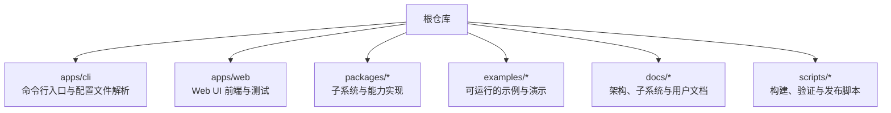
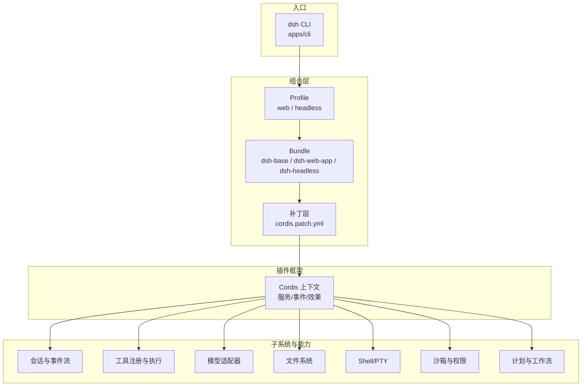
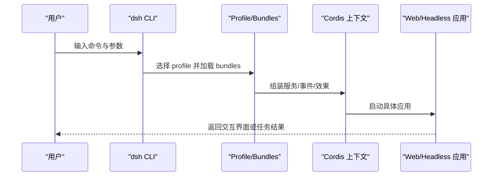
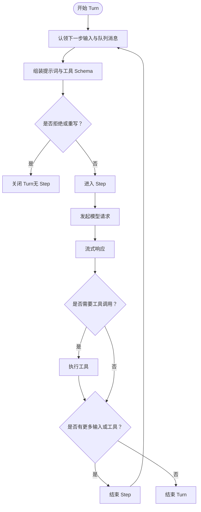
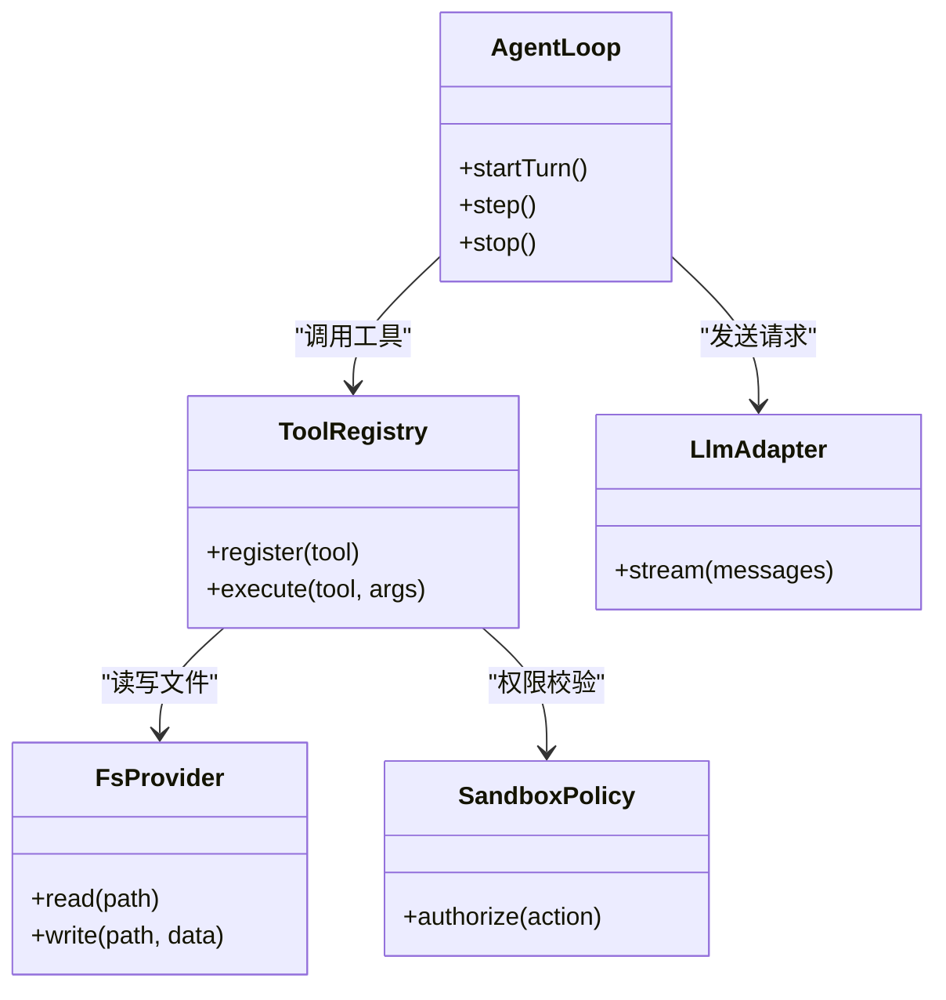
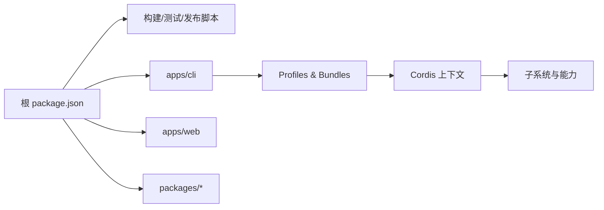

# 项目介绍与核心价值

<cite>
**本文引用的文件**
- [README.md](file://README.md)
- [package.json](file://package.json)
- [apps/cli/README.md](file://apps/cli/README.md)
- [docs/architecture.md](file://docs/architecture.md)
- [docs/cordis-primer.md](file://docs/cordis-primer.md)
- [docs/subsystems/README.md](file://docs/subsystems/README.md)
- [docs/user/guide/index.md](file://docs/user/guide/index.md)
- [examples/README.md](file://examples/README.md)
- [examples/headless-agent/README.md](file://examples/headless-agent/README.md)
- [examples/acp-agent/README.md](file://examples/acp-agent/README.md)
</cite>

## 目录
1. [简介](#简介)
2. [项目结构](#项目结构)
3. [核心组件](#核心组件)
4. [架构总览](#架构总览)
5. [详细组件分析](#详细组件分析)
6. [依赖关系分析](#依赖关系分析)
7. [性能考量](#性能考量)
8. [故障排查指南](#故障排查指南)
9. [结论](#结论)
10. [附录](#附录)

## 简介
DeepSeek Harness（简称 dsh）是由 DeepSeek AI 开源的智能体运行框架。它的核心目标是：以“一切皆插件”的架构，提供可组合、可扩展、可替换的智能体运行时，让开发者快速构建面向不同场景的 AI Agent 应用。它基于 Cordis 插件框架，将模型适配器、工具注册表、会话日志、Agent 循环等全部视为插件，通过配置即可替换或增强能力，无需修改核心代码。

价值主张
- 灵活扩展：所有能力以插件形式挂载，支持热插拔与覆盖式补丁。
- 多模式运行：同一内核支持 Web UI、Headless 一次性任务、CLI 自动化等多种使用方式。
- 生态贡献：为 AI Agent 生态提供统一的运行时与扩展点，降低集成成本，提升互操作性。

适合读者
- 初学者：理解什么是智能体框架、如何快速上手体验。
- 有经验的开发者：掌握插件机制、事件流、能力接缝与扩展点，进行深度定制。

**章节来源**
- [README.md:1-58](file://README.md#L1-L58)

## 项目结构
仓库采用多包工作区组织，核心入口位于 apps/cli，Web 前端在 apps/web，大量子系统与能力实现集中在 packages/*，示例与教程在 examples 与 docs。

- CLI 负责启动不同 profile（web、headless），并转发参数给对应应用。
- Web 提供交互式界面，便于调试与可视化。
- packages 提供会话、工具、LLM 适配、沙箱、权限、计划、工作流等能力。
- examples 展示 Headless、ACP、Web 插件等典型用法。
- docs 提供架构说明、子系统参考与用户指南。

**章节来源**
- [apps/cli/README.md:1-48](file://apps/cli/README.md#L1-L48)
- [docs/subsystems/README.md:1-56](file://docs/subsystems/README.md#L1-L56)
- [examples/README.md:1-30](file://examples/README.md#L1-L30)

## 核心组件
- 插件框架（Cordis）：服务、事件、效果与上下文组成的轻量插件系统，支持声明式依赖与可逆注册。
- 会话与事件流：追加式会话日志作为模型可见上下文的唯一事实源，支撑回放、持久化、遥测与投影。
- Agent 循环：驱动 step/turn 生命周期，协调模型请求、工具调用与输入投递。
- 能力接缝（Seams）：如文件系统、子进程、终端、Web 访问、工作流、计划等，均可通过提供者替换。
- 多模式运行：Web UI、Headless、CLI 三种模式共享同一内核，差异在于组合层与交互面。

这些组件共同构成“一切皆插件”的可组合运行时，使产品形态与行为可通过配置与补丁灵活拼装。

**章节来源**
- [docs/architecture.md:9-130](file://docs/architecture.md#L9-L130)
- [docs/cordis-primer.md:7-45](file://docs/cordis-primer.md#L7-L45)

## 架构总览
下图展示了从 CLI 到插件树、再到各子系统与能力的整体关系。

- 启动流程：CLI 解析参数 → 选择 profile → 加载 bundle 与补丁 → 组装 Cordis 上下文 → 启动具体应用（Web 或 Headless）。
- 能力扩展：通过注册服务、事件监听与效果，动态注入新能力；所有变更可被上层补丁覆盖。
- 会话日志：所有模型可见输入均落盘，保证可回放与一致性。

**图表来源**
- [apps/cli/README.md:1-48](file://apps/cli/README.md#L1-L48)
- [docs/architecture.md:15-38](file://docs/architecture.md#L15-L38)
- [docs/architecture.md:53-130](file://docs/architecture.md#L53-L130)

**章节来源**
- [docs/architecture.md:15-130](file://docs/architecture.md#L15-L130)

## 详细组件分析

### “一切皆插件”的架构模式
- 插件即服务：每个功能以 Service 形式存在，声明依赖后由框架按序挂载。
- 上下文即注册表：通过 ctx.<key> 暴露稳定接口，避免硬耦合。
- 事件驱动通信：emit/waterfall/parallel/serial 多种分发模式，满足观察、包装、并行与串行需求。
- 可逆注册：effect/on 注册的副作用可在卸载时回滚，确保热重载与清理安全。

这种设计带来高内聚、低耦合与强可替换性，使得更换模型、工具、存储、沙箱等行为只需替换提供者，而不影响其他模块。

**章节来源**
- [docs/cordis-primer.md:7-45](file://docs/cordis-primer.md#L7-L45)

### 多运行模式：Web UI、Headless、CLI
- Web UI：交互式对话、可视化调试、审批策略与实时反馈，适合探索、协作与复杂任务编排。
- Headless：一次性任务执行，输出结构化结果后退出，适合批处理、CI/CD 与自动化流水线。
- CLI：统一入口，解析参数并路由到对应 profile，支持 --dump-config 等诊断能力。

**图表来源**
- [apps/cli/README.md:7-43](file://apps/cli/README.md#L7-L43)
- [docs/architecture.md:15-38](file://docs/architecture.md#L15-L38)

**章节来源**
- [apps/cli/README.md:7-43](file://apps/cli/README.md#L7-L43)
- [docs/user/guide/index.md:1-31](file://docs/user/guide/index.md#L1-L31)

### 会话与事件流（Turn/Step）
- Turn 是零或多个 Step 的集合，Step 是一次模型请求及其工具调用。
- 事件包括 session/event（持久）、agent/*（实时）、tools/*（工具管线）等。
- 模型可见输入必须可重建自日志，保证回放一致性与审计可追溯。

**图表来源**
- [docs/architecture.md:63-90](file://docs/architecture.md#L63-L90)

**章节来源**
- [docs/architecture.md:53-130](file://docs/architecture.md#L53-L130)

### 能力接缝与扩展点
- 模型适配器：注册到 ctx.llm，切换不同 LLM 后端。
- 工具注册：注册到 ctx.tools，新增模型可见能力。
- 文件系统/子进程/终端：通过 fs/shell/terminal 提供者替换执行环境。
- 权限与沙箱：通过 sandbox 与 approval 控制危险操作。
- 工作流与计划：通过 workflow/plan 管理复杂任务编排。

**图表来源**
- [docs/architecture.md:98-130](file://docs/architecture.md#L98-L130)

**章节来源**
- [docs/architecture.md:98-130](file://docs/architecture.md#L98-L130)

### 实际使用案例与成功故事
- Headless 编码代理：接受单一任务，执行后输出最终答案并退出，适合 CI/CD 与自动化。
- ACP 自动化服务器：通过 JSON-RPC 标准协议，供父 Agent 或程序化客户端调用，支持会话、权限与取消。
- Web 插件示例：可自我检查与修改内存中的插件树，展示动态能力装配。

这些示例体现了 dsh 在不同场景下的实用价值：从交互式开发到生产级自动化，都能以插件化方式快速拼装所需能力。

**章节来源**
- [examples/headless-agent/README.md:1-33](file://examples/headless-agent/README.md#L1-L33)
- [examples/acp-agent/README.md:1-25](file://examples/acp-agent/README.md#L1-L25)
- [examples/README.md:1-30](file://examples/README.md#L1-L30)

## 依赖关系分析
- 工作区与脚本：根 package.json 定义工作区、构建脚本与命令别名（如 dsh、demo:acp）。
- CLI 与 Profile：CLI 仅解析自身标志，其余参数交由已启动的应用处理，保证职责清晰。
- 插件树组合：bundle 顺序、profile patch、home patch、--patch 叠加，形成最终运行态。

**图表来源**
- [package.json:1-183](file://package.json#L1-L183)
- [apps/cli/README.md:30-43](file://apps/cli/README.md#L30-L43)

**章节来源**
- [package.json:1-183](file://package.json#L1-L183)
- [apps/cli/README.md:30-43](file://apps/cli/README.md#L30-L43)

## 性能考量
- 会话日志作为唯一事实源，减少状态复制与同步开销，同时支持回放与审计。
- 事件分发模式（emit/waterfall/parallel/serial）允许按需选择并发与顺序，平衡吞吐与一致性。
- 能力接缝使重资源提供者（如远程沙箱）可按需替换，避免不必要的绑定。
- 插件卸载与效果回滚确保资源释放有序，防止泄漏与竞态。

[本节为通用指导，不直接分析具体文件]

## 故障排查指南
- 查看组合树：使用 --dump-config 或 --dump-default-config 检查实际装载的插件与补丁顺序。
- 定位错误来源：区分 CLI 参数错误与应用内部错误；CLI 会为非零退出码报告配置或启动失败。
- 会话问题：通过会话日志回放与工具执行轨迹定位模型输入与工具调用问题。
- 权限与沙箱：确认 sandbox 与 approval 策略是否符合预期，必要时调整权限预设。

**章节来源**
- [apps/cli/README.md:18-43](file://apps/cli/README.md#L18-L43)
- [docs/architecture.md:92-130](file://docs/architecture.md#L92-L130)

## 结论
DeepSeek Harness 以“一切皆插件”的架构，提供了高度可组合、可扩展的智能体运行时。通过 Cordis 插件框架、会话事件流与能力接缝，开发者可以灵活拼装模型、工具、存储与执行环境，并以 Web UI、Headless、CLI 多种模式满足不同场景需求。其技术愿景是为 AI Agent 生态提供统一、开放、可演进的运行时基础，降低集成成本，促进生态繁荣。

[本节为总结性内容，不直接分析具体文件]

## 附录
- 快速开始：安装 Node.js 后运行 npx @deepseek-ai/dsh web 启动 Web UI。
- 源码运行：克隆仓库，pnpm install && pnpm run build，然后 pnpm dsh web。
- 社区与支持：GitHub Discussions、Discord 社区与插件标签 #dsh-plugin。

**章节来源**
- [README.md:13-52](file://README.md#L13-L52)