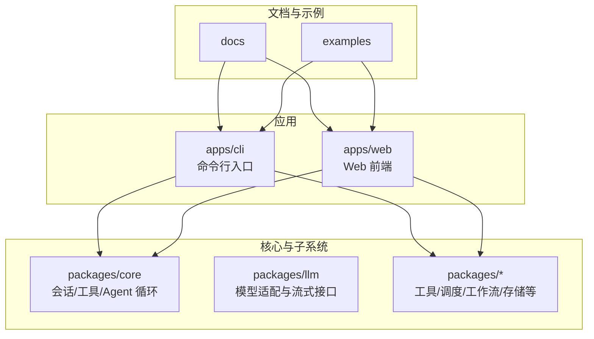
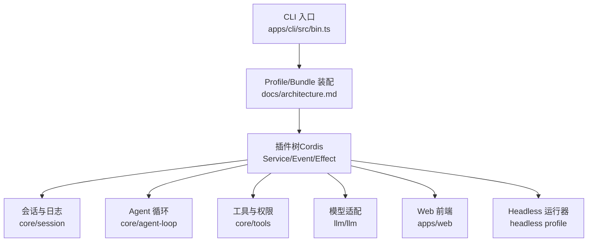
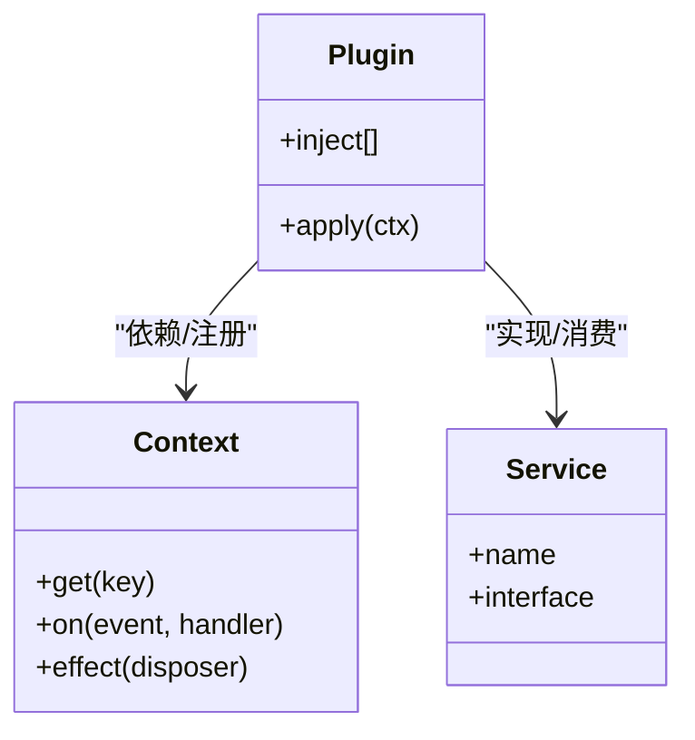
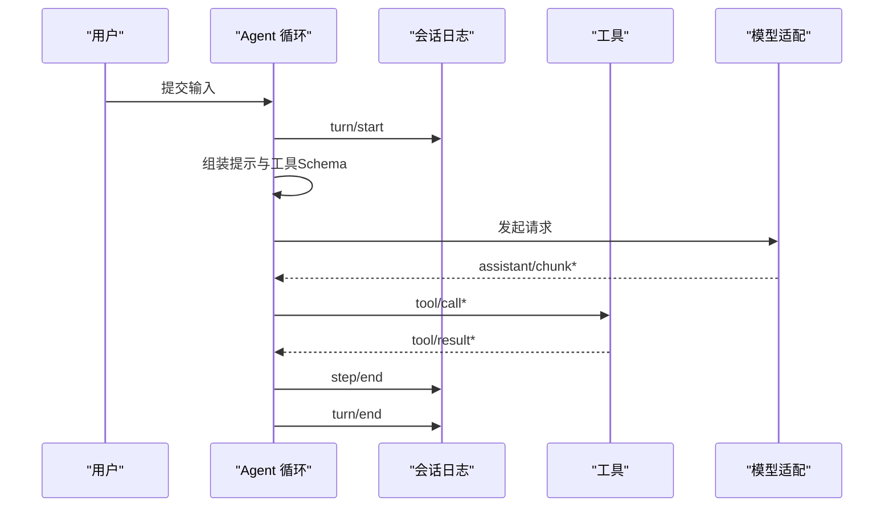
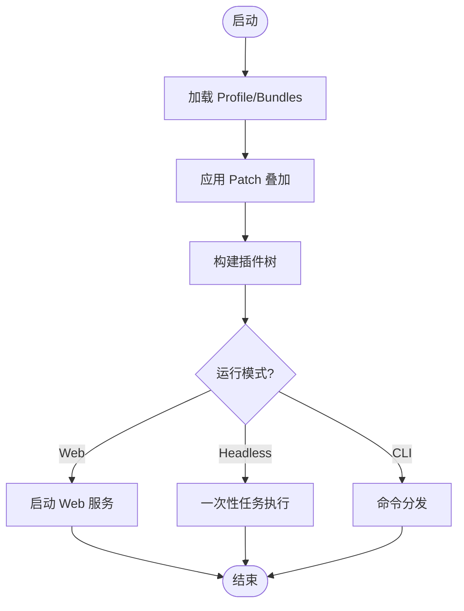
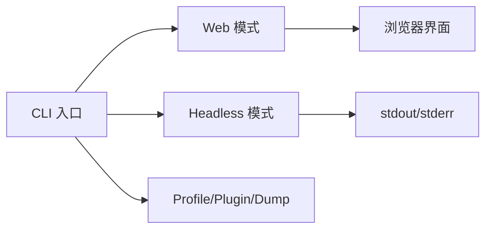
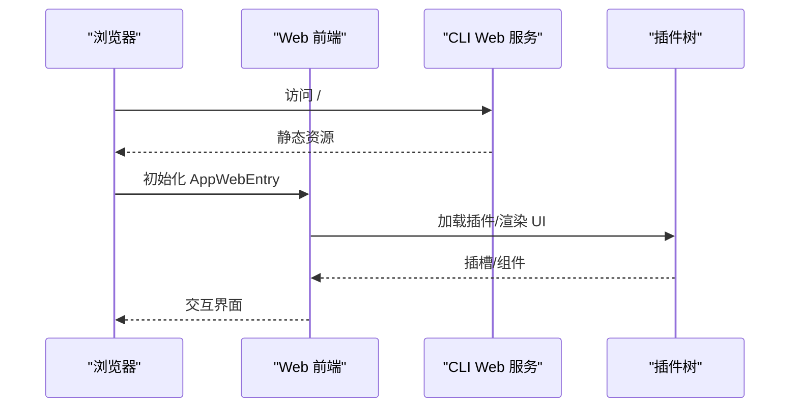
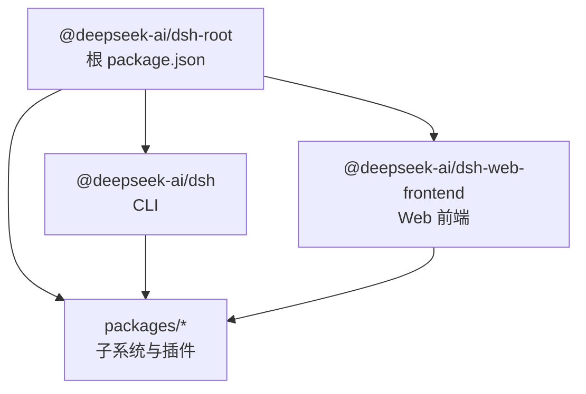

# 项目概述

<cite>
**本文引用的文件**
- [README.md](file://README.md)
- [package.json](file://package.json)
- [apps/cli/package.json](file://apps/cli/package.json)
- [apps/web/package.json](file://apps/web/package.json)
- [apps/cli/src/bin.ts](file://apps/cli/src/bin.ts)
- [apps/web/src/main.ts](file://apps/web/src/main.ts)
- [docs/architecture.md](file://docs/architecture.md)
- [docs/cordis-primer.md](file://docs/cordis-primer.md)
- [docs/user/guide/index.md](file://docs/user/guide/index.md)
- [examples/README.md](file://examples/README.md)
</cite>

## 目录
1. [简介](#简介)
2. [项目结构](#项目结构)
3. [核心组件](#核心组件)
4. [架构总览](#架构总览)
5. [详细组件分析](#详细组件分析)
6. [依赖关系分析](#依赖关系分析)
7. [性能与可扩展性](#性能与可扩展性)
8. [故障排查指南](#故障排查指南)
9. [结论](#结论)
10. [附录：快速开始与示例](#附录快速开始与示例)

## 简介
DeepSeek Harness（简称 dsh）是一个开源的智能体运行框架，采用“一切皆插件”的架构理念，基于 Cordis 插件框架构建。它通过可组合的插件层、类型化事件与服务注册机制，将模型适配器、工具、会话日志、Agent 循环等全部能力以插件形式提供，从而支持高度可替换与可插拔的产品形态。项目同时提供 Web UI、Headless 无头模式与 CLI 命令行三种运行方式，覆盖交互式开发、自动化任务与集成调用等场景。

- 核心理念：一切皆插件；通过配置与补丁叠加实现运行时装配。
- 技术栈：TypeScript、React、Node.js、Vite、pnpm monorepo。
- 运行模式：Web UI（浏览器交互）、Headless（一次性任务执行）、CLI（命令驱动）。
- 扩展点：服务、事件、工具、会话、权限策略、文件系统、子进程、调度、工作流等。

**章节来源**
- [README.md:1-58](file://README.md#L1-L58)
- [docs/architecture.md:9-37](file://docs/architecture.md#L9-L37)

## 项目结构
仓库采用 pnpm monorepo 组织，核心入口与应用位于 apps 目录，通用能力与子系统位于 packages 目录，文档与示例分别位于 docs 与 examples 目录。

- apps/cli：dsh 命令行入口与多模式分发（profile、plugin、dump-config），依赖大量 dsh-* 插件包。
- apps/web：Web 前端应用入口，基于 React + Vite，构建产物由 CLI 的 web 模式提供服务。
- packages/*：按子系统划分的插件与核心库（如 session、tools、llm、agent-loop、schedule、workflow 等）。
- docs：架构、子系统、用户指南、Cordis 教程与 API 参考。
- examples：可运行的示例工程，涵盖 headless-agent、jsonrpc-agent、web-cordis、web-schedule、acp-agent 等。

**图表来源**
- [apps/cli/package.json:22-83](file://apps/cli/package.json#L22-L83)
- [apps/web/package.json:28-49](file://apps/web/package.json#L28-L49)
- [docs/architecture.md:39-52](file://docs/architecture.md#L39-L52)

**章节来源**
- [apps/cli/package.json:1-102](file://apps/cli/package.json#L1-L102)
- [apps/web/package.json:1-52](file://apps/web/package.json#L1-L52)
- [docs/architecture.md:39-52](file://docs/architecture.md#L39-L52)

## 核心组件
- 插件框架（Cordis）：以 Service 为基本单元，通过 inject 声明依赖，使用 effect/on 注册可逆副作用，通过类型化事件进行通信。
- 会话与会话日志：append-only 的事件日志，作为模型可见上下文的唯一事实源，支撑回放、持久化、遥测与 UI 渲染。
- Agent 循环与步骤：turn/step 流程封装模型请求与工具调用，暴露 agent/* 与 tools/* 等扩展点。
- 工具与能力：工具注册表与受控执行管线，结合权限策略与沙箱，确保工具调用的安全与可观测。
- 模型适配：统一的 llm 接口与流式消息抽象，便于接入不同模型提供方。
- 配置与组合：profile/bundle 分层装配，支持 patch 覆盖与叠加，形成可复用的运行画像。

**章节来源**
- [docs/cordis-primer.md:7-13](file://docs/cordis-primer.md#L7-L13)
- [docs/architecture.md:53-128](file://docs/architecture.md#L53-L128)

## 架构总览
DeepSeek Harness 以 Cordis 插件树为核心，启动时按 profile 与 bundle 顺序组装，所有功能模块以插件形式挂载到共享上下文。通过事件与服务的解耦设计，系统具备高内聚、低耦合与强扩展性。

**图表来源**
- [apps/cli/src/bin.ts:29-52](file://apps/cli/src/bin.ts#L29-L52)
- [docs/architecture.md:15-37](file://docs/architecture.md#L15-L37)
- [docs/architecture.md:39-52](file://docs/architecture.md#L39-L52)

**章节来源**
- [apps/cli/src/bin.ts:1-54](file://apps/cli/src/bin.ts#L1-L54)
- [docs/architecture.md:9-37](file://docs/architecture.md#L9-L37)

## 详细组件分析

### 插件框架与“一切皆插件”
- 设计理念：每个产品能力都是插件，包括模型适配器、工具注册表、会话日志、Agent 循环本身。通过注入依赖与可逆副作用，实现热重载与卸载时的自动清理。
- 关键概念：
  - Service：声明稳定 ctx 键，供其他插件发现。
  - Effect/On：注册副作用，随插件生命周期自动回滚。
  - Typed Events：类型安全的发布/订阅，支持 waterfall/parallel/serial 等模式。
- 优势：无需特权核心即可扩展；通过配置与补丁改变行为；插件间松耦合。

**图表来源**
- [docs/cordis-primer.md:7-13](file://docs/cordis-primer.md#L7-L13)

**章节来源**
- [docs/cordis-primer.md:1-13](file://docs/cordis-primer.md#L1-L13)
- [docs/architecture.md:9-14](file://docs/architecture.md#L9-L14)

### 会话与 Agent 循环
- 会话日志：append-only 的 SessionEvent 序列，是模型可见上下文的唯一事实源，用于回放、持久化、遥测与 UI 渲染。
- Turn/Step：一个 turn 包含零或多个 step；每个 step 是一次模型请求及工具调用。
- 扩展点：agent/pre-step、agent/request、tools/pre-execute/execute/post-execute 等事件可用于拦截与改写。

**图表来源**
- [docs/architecture.md:63-90](file://docs/architecture.md#L63-L90)

**章节来源**
- [docs/architecture.md:53-90](file://docs/architecture.md#L53-L90)

### 配置与组合（Profile/Bundle/Patch）
- Profile：命名化的运行画像，列出要堆叠的 bundles，并持有用户自定义 patch。
- Bundle：分发格式，包含 Cordis 配置行与代码，保证上层仍可覆盖。
- Patch：按 id 替换或插入行，支持 home 级与 --patch 叠加。
- 调试：可通过 dump-config 查看实际装配结果。

**图表来源**
- [docs/architecture.md:15-37](file://docs/architecture.md#L15-L37)

**章节来源**
- [docs/architecture.md:15-37](file://docs/architecture.md#L15-L37)

### 运行模式与适用场景
- Web UI：适合交互式开发与调试，支持会话管理、工具审批、可视化反馈。
- Headless：适合自动化任务与脚本集成，输出 stdout/stderr，退出码反映完成状态。
- CLI：命令驱动，支持 profile、plugin、dump-config 等模式，便于编排与测试。

**图表来源**
- [apps/cli/src/bin.ts:29-52](file://apps/cli/src/bin.ts#L29-L52)
- [docs/user/guide/index.md:1-31](file://docs/user/guide/index.md#L1-L31)

**章节来源**
- [apps/cli/src/bin.ts:1-54](file://apps/cli/src/bin.ts#L1-L54)
- [docs/user/guide/index.md:1-31](file://docs/user/guide/index.md#L1-L31)

### Web 前端与 React 集成
- 前端入口：最小化引导，挂载 AppWebEntry，其余逻辑在客户端库中。
- 技术栈：React + Vite，构建产物由 CLI 的 web 模式提供服务。
- 插件化 UI：通过 Slot/Renderer 等机制，UI 能力也以插件形式扩展。

**图表来源**
- [apps/web/src/main.ts:1-11](file://apps/web/src/main.ts#L1-L11)
- [apps/web/package.json:28-49](file://apps/web/package.json#L28-L49)

**章节来源**
- [apps/web/src/main.ts:1-11](file://apps/web/src/main.ts#L1-L11)
- [apps/web/package.json:1-52](file://apps/web/package.json#L1-L52)

## 依赖关系分析
- CLI 依赖大量 dsh-* 插件包，涵盖工具、终端、会话、调度、工作流、Web 应用等。
- Web 前端依赖 React、Vite 以及客户端库，构建后由 CLI 提供静态资源。
- 根 package.json 定义 monorepo 工作区与统一脚本，便于构建、测试与发布。

**图表来源**
- [package.json:11-18](file://package.json#L11-L18)
- [apps/cli/package.json:22-83](file://apps/cli/package.json#L22-L83)
- [apps/web/package.json:28-49](file://apps/web/package.json#L28-L49)

**章节来源**
- [package.json:1-183](file://package.json#L1-L183)
- [apps/cli/package.json:1-102](file://apps/cli/package.json#L1-L102)
- [apps/web/package.json:1-52](file://apps/web/package.json#L1-L52)

## 性能与可扩展性
- 插件卸载与热重载：通过 effect/on 的可逆副作用，支持热更新与资源回收，避免内存泄漏。
- 事件驱动：类型化事件降低耦合，提升扩展性与可观测性。
- 会话日志：append-only 设计利于回放与持久化，减少状态同步复杂度。
- 工具执行管线：受控执行与权限策略保障安全性与稳定性。
- 建议：
  - 合理拆分插件，保持单一职责。
  - 谨慎使用全局副作用，优先使用 effect/on。
  - 利用 patch 与 profile 进行环境差异化配置。

[本节为通用指导，不直接分析具体文件]

## 故障排查指南
- 启动问题：确认 Node 版本与工作区安装；检查 CLI 分发的 mode 是否正确。
- 配置问题：使用 dump-config 查看实际装配结果，定位被覆盖的行。
- 插件问题：检查 inject 依赖是否满足；确认 effect/on 的 disposer 是否正确释放。
- 工具执行失败：查看工具执行事件与权限策略；必要时启用更详细的日志。
- Web 前端问题：确认构建产物与静态资源路径；检查浏览器控制台错误。

**章节来源**
- [apps/cli/src/bin.ts:29-52](file://apps/cli/src/bin.ts#L29-L52)
- [docs/architecture.md:15-37](file://docs/architecture.md#L15-L37)

## 结论
DeepSeek Harness 以 Cordis 插件框架为基础，实现了“一切皆插件”的高扩展性架构。通过会话日志、Agent 循环、工具执行管线与模型适配的统一抽象，项目提供了 Web UI、Headless 与 CLI 三种运行模式，满足不同场景需求。开发者可通过 profile/bundle/patch 灵活组合能力，借助类型化事件与服务注册实现松耦合扩展。对于初学者，可从 Web UI 入门；对于有经验的开发者，可深入插件开发与子系统定制。

[本节为总结，不直接分析具体文件]

## 附录：快速开始与示例

### 快速开始
- 从 npm 运行 Web UI：
  - 安装 Node.js 后执行 npx @deepseek-ai/dsh web，默认监听 http://127.0.0.1:3080。
- 从源码运行：
  - git clone 仓库，pnpm install，pnpm run build，pnpm dsh web。
- 配置模型与选择工作区后，即可在 Web UI 中发起任务。

**章节来源**
- [README.md:13-35](file://README.md#L13-L35)
- [docs/user/guide/index.md:1-31](file://docs/user/guide/index.md#L1-L31)

### 常见用例与示例
- Headless 一次性任务：适用于自动化脚本与 CI/CD。
- JSON-RPC 驱动：通过 Python SDK 与 JSON-RPC 控制 Agent。
- Web 自引用插件：动态检查与修改内存中的插件树。
- Web 定时提醒：Session 本地持久化提醒，支持延迟与绝对时间。
- ACP 自动化服务器：程序化客户端的会话、权限与取消支持。

**章节来源**
- [examples/README.md:1-30](file://examples/README.md#L1-L30)